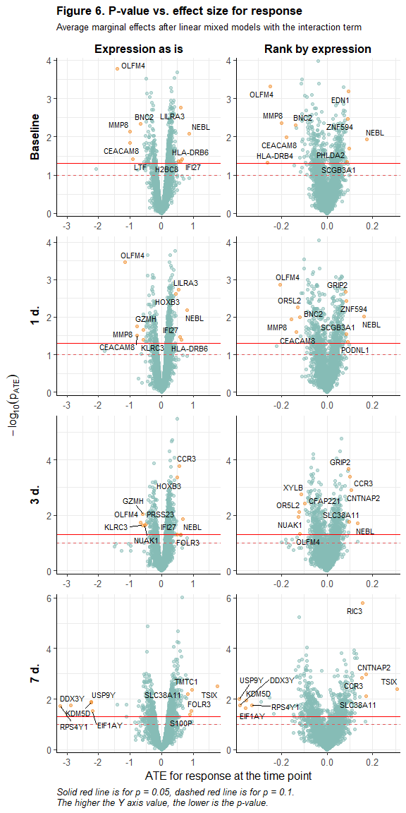

<style type="text/css">

.math {
font-size: small;
}

</style>


```r
library(tidyverse)
library(labelled)
library(gtsummary)
library(ggbeeswarm)
library(ggrepel)
library(lemon)
library(ComplexUpset)
library(colorspace)
library(lme4)
library(lmerTest)
library(marginaleffects)
library(broom.mixed)
library(qvalue)
library(knitr)
if (identical(knitr::opts_knit$get("rmarkdown.runtime"), "shiny")) {
  library(shiny)
}

options(knitr.kable.NA = '')
knitr::opts_chunk$set(echo = TRUE, warning = FALSE, message = FALSE, error = FALSE)

list("style_number-arg:big.mark" = "") %>% set_gtsummary_theme()

# Function for upset plots

upset_plot <- function(data, sets_names, rowcolors, title, subtitle, showh = TRUE, ab_hjust = -0.95) {
  
  p1 <- upset(
    data, sets_names, name = "gene", sort_sets = FALSE,
    sort_intersections = "ascending", sort_intersections_by = c("degree", "cardinality"),
    wrap = TRUE, set_sizes = FALSE,
    base_annotations = list("Inclusive intersection size" = (
      intersection_size(
        mode = "intersect",
        # mapping = aes(fill = exclusive_intersection),
        text_mapping = aes(y = !!get_size_mode("inclusive_intersection"),
                           colour = "on_background"),
        text = list(size = 3.5)
      ) +
        scale_y_continuous(expand = c(0.07,0)) +
        labs(title = "A. Inclusive intersection size") +
        theme(legend.position = "none",
              panel.grid.major.x = element_blank(),
              panel.grid.minor.x = element_blank(),
              axis.ticks.y = element_line(color = "grey50", linewidth = 0.2),
              axis.text.y = element_text(size = 8),
              axis.title.y = element_blank(),
              plot.title = element_text(hjust = ab_hjust, size = 11, face = "bold")))),
    matrix = intersection_matrix(
      outline_color = list(active = "#4F6980", inactive = "white"),
      segment = geom_segment(color = "#4F6980")
    ) +
      scale_color_manual(values = c("TRUE" = "#4F6980", "FALSE" = "white"), guide = "none"),
    stripes = upset_stripes(colors = rowcolors),
    themes = upset_modify_themes(list(
      intersections_matrix = theme(panel.grid.major = element_blank(),
                                   panel.grid.minor = element_blank(),
                                   axis.text.y = element_text(size = 10),
                                   axis.title.x = element_blank()))))
  p2 <- upset(
    data, sets_names, name = "gene", sort_sets = FALSE, 
    sort_intersections = "ascending", sort_intersections_by = c("degree", "cardinality"),
    wrap = TRUE, set_sizes = FALSE,
    base_annotations = list("Intersection size" = (
      intersection_size(
        text_mapping = aes(y = !!get_size_mode("exclusive_intersection"),
                           colour = "on_background"),
        text = list(size = 3.5)
      ) + 
        annotate(geom = "text", x = Inf, y = Inf,
                 label = sprintf("%d\nunique genes", nrow(data)),
                 vjust = 1, hjust = 1) +
        scale_y_continuous(expand = c(0.07,0)) +
        labs(title = "B. Exclusive intersection size") +
        theme(panel.grid.major.x = element_blank(),
              panel.grid.minor.x = element_blank(),
              axis.ticks.y = element_line(color = "grey50", linewidth = 0.2),
              axis.text.y = element_text(size = 8),
              axis.title.y = element_blank(),
              plot.title = element_text(hjust = ab_hjust, size = 11, face = "bold")))),
    matrix = intersection_matrix(
      outline_color = list(active = "#4F6980", inactive = "white"),
      segment = geom_segment(color = "#4F6980")
    ) +
      scale_color_manual(values = c("TRUE" = "#4F6980", "FALSE" = "white"), guide = "none"),
    stripes = upset_stripes(colors = rowcolors),
    themes = upset_modify_themes(list(
      intersections_matrix = theme(panel.grid.major = element_blank(),
                                   panel.grid.minor = element_blank(),
                                   axis.text.y = element_text(size = 10),
                                   axis.title.x = element_blank()))))
  
  if (showh) {
    p1 +
      labs(title = title, subtitle = subtitle) +
      theme(plot.title = element_text(size = 13, face = "bold"),
            plot.subtitle = element_text(size = 10)) +
      p2
  } else {
    ((p1 +
        labs(title = title, subtitle = subtitle) +
        theme(plot.title = element_text(size = 13, face = "bold"),
              plot.subtitle = element_text(size = 10))) 
     /
       (p2))
  }
}

# Function for getting BPs (GO) for genes strored in "gene" column of df

bp_genesF <- function(df) {
  AnnotationDbi::select(
    org.Hs.eg.db::org.Hs.eg.db, 
    df %>% pull(gene) %>% unique(), 
    c("GENENAME", "GO"), "SYMBOL") %>% 
    filter(ONTOLOGY == "BP") %>%
    mutate(TERM = AnnotationDbi::Term(GO)) %>%
    filter(!is.na(TERM)) %>%
    transmute(TERM, gene = SYMBOL) %>%
    unique() %>%
    group_by(TERM) %>%
    summarise(n = n(), genes = paste(gene, collapse = ", ")) %>%
    arrange(-n)
}

# Данные https://www.immunespace.org/project/home/Integrative_Public_Study/begin.view?SDY=IS2

# all_noNorm_withResponse_eset <- readRDS("data/all_noNorm_withResponse_eset.Rds")
all_noNorm_withResponse_eset <- readRDS(file.path("..", "data", "all_noNorm_withResponse_eset.Rds"))

# Данные по участникам исследования SDY984 -------------------------------------

df_subj <- all_noNorm_withResponse_eset@phenoData@data %>%
  filter(study_accession == "SDY984")

timepoints <- unique(df_subj$study_time_collected)

# Данные на момент baseline (0 days) для описательной статистики
# за исключением moderate response по MFC_p40
df_subj_baseline <- df_subj %>%
  filter(study_time_collected == 0 & MFC_p40 != "moderateResponder") %>% 
  transmute(participant_id, 
            arm_accession = factor(arm_accession, c("ARM3536", "ARM3537"),
                                   c("Young", "Elderly")), 
            age = age_imputed,
            gender = factor(gender), 
            race = fct_infreq(factor(race)),
            ethnicity = factor(ethnicity, c("Not Hispanic or Latino", "Hispanic or Latino")),
            igg_baseline = ImmResp_baseline_value_MFC,
            response = factor(MFC_p40, c("lowResponder", "highResponder"), 
                              c("Low Responder", "High Responder")))

var_label(df_subj_baseline) <-
  list(arm_accession = "Study arm",
       age = "Age, yrs",
       gender = "Gender",
       race = "Race",
       ethnicity = "Ethnicity",
       igg_baseline = "log2(IgG), ELISA",
       response = "Vaccination response (MFC_p40)")

# Данные по экспрессии генов для участников исследования SDY984 ----------------

expr_t <- all_noNorm_withResponse_eset@assayData$exprs
expr_t <- expr_t[,df_subj$uid]

# Матрица экспрессий --> датафрейм
# (только по испытуемым с moderate response по MFC_p40)
# + характеристики испытуемых
df_expr <- expr_t %>%
  t() %>%
  as_tibble(rownames = "uid") %>%
  separate(uid, c("participant_id", "time", NA, NA), 
           sep = "_", remove = FALSE, convert = TRUE) %>%
  filter(participant_id %in% df_subj_baseline$participant_id) %>%
  left_join(df_subj %>% transmute(uid, igg_postvax = ImmResp_postVax_value_MFC), 
            by = "uid") %>%
  left_join(df_subj_baseline %>% select(participant_id, arm_accession, gender, 
                                        race, ethnicity, igg_baseline, response), 
            by = "participant_id")

# Уберём гены с одними пропусками по экспрессии
df_expr <- df_expr %>%
  select(function(x) sum(is.na(x)) != length(x)) %>%
  select(participant_id, uid, arm_accession, gender, race, ethnicity,
         igg_baseline, time, response, igg_postvax, everything())

# Длинный датафрейм
df_expr_long <- df_expr %>%
  pivot_longer(A1BG:last_col(), names_to = "gene", values_to = "expr")
```

## **Общая информация**

<br>

В данном отчёте будут представлены результаты анализа данных по экспрессии генов среди добровольцев, прошедших **вакцинацию от varicella zoster живой ослабленной вакциной Zostavax**. Данные были получены в рамках исследования [SDY984](https://www.immport.org/shared/study/SDY984) по программе [Human Immunology Project Consortium (HIPC)](https://www.immunespace.org/) и выложены на страничке [HIPC-II Immune Signatures Data Resource and Analysis (IS2)](https://datatools.immunespace.org/project/home/Integrative_Public_Study/begin.view?SDY=IS2) (доступны для скачивания после регистрации).

**Задача нашего исследовательского проекта** - определить, динамика экспрессии каких именно генов связана с иммунным ответом на вакцинацию и в какие сигнальные пути входят эти гены. Эту задачу можно решать двояко: 

- с помощью оценки различий в экспрессии генов между испытуемыми, ответившими и не ответившими на вакцинацию, 

- с помощью оценки взаимосвязи между экспрессией генов (и её динамикой) и итоговым ответом на вакцинацию.

<br>

В выбранном нами исследовании **экспрессия генов** оценивалась у 35 добровольцев до вакцинации и в нескольких точках (1, 3, 7 дней) после неё. 

Также по завершении исследования (через 30 дней от начала) оценивался **ответ на вакцинацию** с разбиением испытуемых на 3 группы: low, moderate и high responder. Разбиение проводилось отдельно по нескольким критериям, но мы для определения статуса по ответу на вакцинацию будем использовать только MFC_p40. MFC - это maximum fold change (максимальная кратность изменения) для титра антител после вакцинации по сравнению с состоянием до неё (максимальная - поскольку [некоторые вакцины в исследовании содержали несколько штаммов вируса и/или титр антител для них определялся с помощью нескольких тестов](https://www.nature.com/articles/s41590-022-01329-5)). В исследовании, с данными которого мы будем работать, штамм был один и титр антител измерялся с помощью одной методики - оценки уровня IgG методом ELISA (enzyme-linked immunosorbent assay, или иммуноферментный анализ, ИФА), поэтому в данном случае MFC фактически равна просто кратности изменения титра антител (формально это $log_2(FC)$). Что касается разбивки на группы по ответу, то оно [производилось по перцентилям полученного значения для MFC](https://www.nature.com/articles/s41590-022-01329-5), а именно: для MFC_p40 все испытуемые, у кого MFC был меньше или равен 40-му перцентилю, считались low responder'ами, с MFC, равным или большим 60-го перцентиля - high responder'ами, остальные - moderate responder'ами (детали можно найти, в том числе, в [функциях](https://rdrr.io/github/RGLab/ImmuneSignatures2/src/R/immuneResponseCallGeneration.R), которые использовались для получения того датасета, с которым мы работаем).

В целях упрощения в рамках нашего исследовательского проекта мы исключим из анализа испытуемых с moderate ответом на вакцинацию (7 чел.), а также, на начальном этапе, не будем делать разбивку в зависимости от ветви исследования (возрастной группы испытуемых).

<br>

## **Описательная статистика: характеристики испытуемых, baseline**

<br>

Описательная статистика по участникам исследования на начало исследования (до вакцинации) представлена в Table 1 ниже. Поскольку мы планируем в своём исследовании, в том числе, сравнивать испытуемых с разным уровнем ответа по экспрессии генов, данные в таблице представлены в разбивке по этим группам. Young - добровольцы в возрасте 25 лет, Elderly - добровольцы в возрасте 60 лет.


```r
tbl_summary(
  df_subj_baseline %>% select(-participant_id, -age), 
  by = "response",
  type = all_continuous() ~ "continuous2",
  statistic = list(
    all_continuous() ~ c("{mean} ({sd})", 
                         "{median} ({p25}-{p75})", "{min}-{max}")),
  digits = list(igg_baseline ~ rep(1,7)),
  missing_text = "Н.Д.") %>%
  add_stat_label(label = list(
    all_continuous() ~ c("Mean (SD)",
                         "Median (Q1-Q3)", "Range"))) %>%
  add_p(pvalue_fun = function(x) style_pvalue(x, digits = 3)) %>%
  modify_header(all_stat_cols() ~ "**{level}**<br>N = {n}") %>%
  modify_footnote(p.value ~ "p-value: Study arm, Gender, Race - Pearson's Chi-squared test;<br> 
                  Ethnicity - Fisher's exact test; IgG - Mann-Whitney test") %>%
  bold_labels() %>%
  as_kable_extra(caption = "<b>Table 1. Baseline characteristics of the study participants.</b>",
                 addtl_fmt = FALSE) %>% 
  kableExtra::row_spec(0, bold = TRUE) %>%
  kableExtra::kable_classic(full_width = FALSE, position = "left", font_size = 14,
                            html_font = "\"Source Sans Pro\", helvetica, sans-serif")
```

<table style='NAborder-bottom: 0; font-size: 14px; font-family: "Source Sans Pro", helvetica, sans-serif; width: auto !important; ' class=" lightable-classic">
<caption style="font-size: initial !important;"><b>Table 1. Baseline characteristics of the study participants.</b></caption>
 <thead>
  <tr>
   <th style="text-align:left;font-weight: bold;"> Characteristic </th>
   <th style="text-align:center;font-weight: bold;"> Low Responder<br>N = 14 </th>
   <th style="text-align:center;font-weight: bold;"> High Responder<br>N = 14 </th>
   <th style="text-align:center;font-weight: bold;"> p-value </th>
  </tr>
 </thead>
<tbody>
  <tr>
   <td style="text-align:left;"> <span style=" font-weight: bold;    ">Study arm, n (%)</span> </td>
   <td style="text-align:center;">  </td>
   <td style="text-align:center;">  </td>
   <td style="text-align:center;"> 0.023 </td>
  </tr>
  <tr>
   <td style="text-align:left;padding-left: 2em;" indentlevel="1"> Young </td>
   <td style="text-align:center;"> 4 (29%) </td>
   <td style="text-align:center;"> 10 (71%) </td>
   <td style="text-align:center;">  </td>
  </tr>
  <tr>
   <td style="text-align:left;padding-left: 2em;" indentlevel="1"> Elderly </td>
   <td style="text-align:center;"> 10 (71%) </td>
   <td style="text-align:center;"> 4 (29%) </td>
   <td style="text-align:center;">  </td>
  </tr>
  <tr>
   <td style="text-align:left;"> <span style=" font-weight: bold;    ">Gender, n (%)</span> </td>
   <td style="text-align:center;">  </td>
   <td style="text-align:center;">  </td>
   <td style="text-align:center;"> 0.430 </td>
  </tr>
  <tr>
   <td style="text-align:left;padding-left: 2em;" indentlevel="1"> Female </td>
   <td style="text-align:center;"> 8 (57%) </td>
   <td style="text-align:center;"> 10 (71%) </td>
   <td style="text-align:center;">  </td>
  </tr>
  <tr>
   <td style="text-align:left;padding-left: 2em;" indentlevel="1"> Male </td>
   <td style="text-align:center;"> 6 (43%) </td>
   <td style="text-align:center;"> 4 (29%) </td>
   <td style="text-align:center;">  </td>
  </tr>
  <tr>
   <td style="text-align:left;"> <span style=" font-weight: bold;    ">Race, n (%)</span> </td>
   <td style="text-align:center;">  </td>
   <td style="text-align:center;">  </td>
   <td style="text-align:center;"> 0.516 </td>
  </tr>
  <tr>
   <td style="text-align:left;padding-left: 2em;" indentlevel="1"> White </td>
   <td style="text-align:center;"> 11 (79%) </td>
   <td style="text-align:center;"> 8 (57%) </td>
   <td style="text-align:center;">  </td>
  </tr>
  <tr>
   <td style="text-align:left;padding-left: 2em;" indentlevel="1"> Black or African American </td>
   <td style="text-align:center;"> 2 (14%) </td>
   <td style="text-align:center;"> 5 (36%) </td>
   <td style="text-align:center;">  </td>
  </tr>
  <tr>
   <td style="text-align:left;padding-left: 2em;" indentlevel="1"> Unknown </td>
   <td style="text-align:center;"> 1 (7.1%) </td>
   <td style="text-align:center;"> 1 (7.1%) </td>
   <td style="text-align:center;">  </td>
  </tr>
  <tr>
   <td style="text-align:left;"> <span style=" font-weight: bold;    ">Ethnicity, n (%)</span> </td>
   <td style="text-align:center;">  </td>
   <td style="text-align:center;">  </td>
   <td style="text-align:center;"> &gt;0.999 </td>
  </tr>
  <tr>
   <td style="text-align:left;padding-left: 2em;" indentlevel="1"> Not Hispanic or Latino </td>
   <td style="text-align:center;"> 12 (86%) </td>
   <td style="text-align:center;"> 13 (93%) </td>
   <td style="text-align:center;">  </td>
  </tr>
  <tr>
   <td style="text-align:left;padding-left: 2em;" indentlevel="1"> Hispanic or Latino </td>
   <td style="text-align:center;"> 2 (14%) </td>
   <td style="text-align:center;"> 1 (7.1%) </td>
   <td style="text-align:center;">  </td>
  </tr>
  <tr>
   <td style="text-align:left;"> <span style=" font-weight: bold;    ">log2(IgG), ELISA</span> </td>
   <td style="text-align:center;">  </td>
   <td style="text-align:center;">  </td>
   <td style="text-align:center;"> 0.012 </td>
  </tr>
  <tr>
   <td style="text-align:left;padding-left: 2em;" indentlevel="1"> Mean (SD) </td>
   <td style="text-align:center;"> 14.2 (1.0) </td>
   <td style="text-align:center;"> 13.0 (1.3) </td>
   <td style="text-align:center;">  </td>
  </tr>
  <tr>
   <td style="text-align:left;padding-left: 2em;" indentlevel="1"> Median (Q1-Q3) </td>
   <td style="text-align:center;"> 14.0 (13.4-15.1) </td>
   <td style="text-align:center;"> 13.0 (12.6-13.7) </td>
   <td style="text-align:center;">  </td>
  </tr>
  <tr>
   <td style="text-align:left;padding-left: 2em;" indentlevel="1"> Range </td>
   <td style="text-align:center;"> 12.8-15.9 </td>
   <td style="text-align:center;"> 10.6-15.4 </td>
   <td style="text-align:center;">  </td>
  </tr>
</tbody>
<tfoot><tr><td style="padding: 0; " colspan="100%">
<sup>1</sup> p-value: Study arm, Gender, Race - Pearson's Chi-squared test;<br> 
Ethnicity - Fisher's exact test; IgG - Mann-Whitney test</td></tr></tfoot>
</table>

<br>

## **Описательная статистика: экспрессии генов**

<br>

Исходный датасет включал в себя данные по экспрессии 26925 генов, для нашего исследования удалим те гены, данные по экспрессии которых были пропущены для всех участников исследования, включенных в анализ, - останется матрица экспрессий по 16146 генам. По данным об экспрессии этих генов во _всех_ точках исследования оценим медианное абсолютное отклонение (MAD) и оставим для дальнейшего анализа 5 тыс. генов с наибольшим его значением (гены с наибольшей вариацией экспрессии).


```r
genes_maxvar <- df_expr_long %>%
  group_by(gene) %>%
  summarise(mad_expr = mad(expr)) %>%
  arrange(-mad_expr) %>%
  slice_head(n = 5000)

df_expr_long_fin <- df_expr_long %>%
  filter(gene %in% genes_maxvar$gene) %>%
  mutate(timeF = factor(time, timepoints, ifelse(timepoints == 0, "Baseline", paste(timepoints, "d."))))
```

<br>

Ниже представлены гистограммы для экспрессий во всех точках исследования для 10 генов, случайно выбранных из оставшихся 5 тысяч. 

_Если вы запускаете этот отчёт в RStudio и активизируете в опциях .rmd-файла (yaml) опцию `runtime: shiny`, то сможете генерировать случайные выборки по 10 генов по нажатию кнопки New sample и видеть соответствующие графики_


```r
# Мини-приложение для генерации случайной выборки из 10 генов и отрисовки по ним гистограмм
# запускается через Rmarkdown c опцией runtime: shiny в yaml

shinyApp(
  ui = fluidPage(
    actionButton("samp", "New sample"),
    p(""),
    plotOutput("plot_sample")
  ),
  server = function(input, output) {
    
    rvalues <- reactiveValues(new_plot = 1)
    replot <- observeEvent(input$samp, {
      rvalues$new_plot <- rvalues$new_plot + 1
    })
    
    output$plot_sample <- renderPlot({
      req(rvalues$new_plot)
      df_expr_long_fin %>% 
        filter(gene %in% sample(genes_maxvar$gene, size = 10, replace = FALSE)) %>%
        mutate(gene = fct_reorder(gene, expr, max)) %>% 
        ggplot(aes(x = expr, fill = response)) +
        geom_histogram(alpha = 0.6, position = "identity") +
        scale_y_continuous(expand = c(0,0,0.1,0)) +
        scale_fill_manual(values = c("#E15759", "#4E79A7")) +
        facet_grid(gene ~ timeF, scales = "free_x", switch = "y") +
        labs(x = "Gene expression", y = element_blank(), fill = element_blank(),
             title = "Figure 1. Distribution of the random 10 genes expressions by time",
             caption = "Counts on the Y-axis (the same scale for all plots)") +
        theme_bw(base_size = 12) +
        theme(legend.position = "bottom",
              panel.grid.major = element_blank(),
              panel.grid.minor = element_blank(),
              axis.text.y = element_blank(),
              axis.ticks.y = element_blank(),
              strip.background = element_blank(),
              strip.placement = "outside",
              strip.text.y.left = element_text(size = 10, color = "black", face = "bold", angle = 0, hjust = 1),
              strip.text.x = element_text(size = 11, color = "black", face = "bold"),
              plot.title = element_text(size = 13, face = "bold"),
              plot.caption = element_text(size = 10, color = "black", face = "italic", hjust = 0))
    }, width = 600, height = 650)
  }, options = list(height = 700, width = 650))
```


```r
# Гистограммы для экспрессий для случайной выборки из 10 генов
# (для html отчёта)

df_expr_long_fin %>% 
  filter(gene %in% sample(genes_maxvar$gene, size = 10, replace = FALSE)) %>%
  mutate(gene = fct_reorder(gene, expr, max)) %>% 
  ggplot(aes(x = expr, fill = response)) +
  geom_histogram(alpha = 0.6, position = "identity") +
  scale_y_continuous(expand = c(0,0,0.1,0)) +
  scale_x_continuous(breaks = seq(0, max(df_expr_long_fin$expr), 2)) +
  scale_fill_manual(values = c("#E15759", "#4E79A7")) +
  facet_grid(gene ~ timeF, scales = "free", switch = "y") +
  labs(x = "Gene expression", y = element_blank(), fill = element_blank(),
       title = "Figure 1. Distribution of the random 10 genes expressions by time",
       caption = "Counts on the Y-axis (the same scale for all plots)") +
  theme_bw(base_size = 12) +
  theme(legend.position = "bottom",
        panel.grid.major = element_blank(),
        panel.grid.minor = element_blank(),
        axis.text.y = element_blank(),
        axis.ticks.y = element_blank(),
        strip.background = element_blank(),
        strip.placement = "outside",
        strip.text.y.left = element_text(size = 10, color = "black", face = "bold", angle = 0, hjust = 1),
        strip.text.x = element_text(size = 11, color = "black", face = "bold"),
        plot.title = element_text(size = 13, face = "bold"),
        plot.caption = element_text(size = 10, color = "black", face = "italic", hjust = 0))
```

<!-- -->

<br>

## **Сравнение экспрессии генов между группами испытуемых с разным уровнем ответа: попарные тесты Манна-Уитни**

<br>

В каждой точке исследования по каждому гену сравним экспрессии генов между группами со слабым и сильным ответом на вакцинацию с помощью теста Манна-Уитни, скорректируем полученные p-values по методу Бенджамини-Хохберга (для контроля FDR, в каждой точке отдельно) и посмотрим, по какому количеству генов средние значения экспрессий различаются на уровне значимости 5% без коррекции и с коррекцией.


```r
mwtest_p <- suppressWarnings({df_expr_long_fin %>%
    group_by(time, timeF, gene) %>%
    summarise(p = wilcox.test(expr ~ response)$p.value) %>%
    group_by(time) %>%
    mutate(p_adj = p.adjust(p, method = "BH")) %>%
    ungroup() %>%
    arrange(p_adj) %>%
    mutate(p_group = cut(p, c(0, 0.05, 1.1), c("< 0.05", "$\\geq$ 0.05"), right = FALSE),
           p_adj_group = cut(p_adj, c(0, 0.05, 1.1), c("< 0.05", "$\\geq$ 0.05"), right = FALSE))
})

genes_sig_mw <- AnnotationDbi::select(org.Hs.eg.db::org.Hs.eg.db, mwtest_p$gene[mwtest_p$p_adj < 0.05], 
                                      c("GENENAME", "GO"), "SYMBOL") %>% 
  filter(ONTOLOGY == "BP") %>%
  mutate(TERM = AnnotationDbi::Term(GO)) %>%
  transmute(gene = SYMBOL, TERM) %>%
  unique()

tbl_summary(
  mwtest_p %>% select(timeF, p_group, p_adj_group), 
  by = "timeF",
  label = list(p_group = "P-value",
               p_adj_group = "Adjusted p-value")) %>%
  modify_footnote(everything() ~ NA) %>%
  modify_header(label ~ "", 
                all_stat_cols() ~ "**{level}**") %>%
  bold_labels() %>%
  as_kable_extra(caption = "<b>Table 2. P-values of the Mann-Whitney tests before and after<br>
                 adjustment under Benjamini & Hochberg method</b>,<br>number of genes (%)") %>% 
  kableExtra::row_spec(0, bold = TRUE) %>%
  kableExtra::kable_classic(full_width = FALSE, position = "left", font_size = 14,
                            html_font = "\"Source Sans Pro\", helvetica, sans-serif")
```

<table class=" lightable-classic" style='font-size: 14px; font-family: "Source Sans Pro", helvetica, sans-serif; width: auto !important; '>
<caption style="font-size: initial !important;">
<b>Table 2. P-values of the Mann-Whitney tests before and after<br>
                 adjustment under Benjamini &amp; Hochberg method</b>,<br>number of genes (%)</caption>
 <thead>
  <tr>
   <th style="text-align:left;font-weight: bold;">  </th>
   <th style="text-align:center;font-weight: bold;"> Baseline </th>
   <th style="text-align:center;font-weight: bold;"> 1 d. </th>
   <th style="text-align:center;font-weight: bold;"> 3 d. </th>
   <th style="text-align:center;font-weight: bold;"> 7 d. </th>
  </tr>
 </thead>
<tbody>
  <tr>
   <td style="text-align:left;"> <span style=" font-weight: bold;    ">P-value</span> </td>
   <td style="text-align:center;">  </td>
   <td style="text-align:center;">  </td>
   <td style="text-align:center;">  </td>
   <td style="text-align:center;">  </td>
  </tr>
  <tr>
   <td style="text-align:left;padding-left: 2em;" indentlevel="1"> &lt; 0.05 </td>
   <td style="text-align:center;"> 356 (7.1%) </td>
   <td style="text-align:center;"> 423 (8.5%) </td>
   <td style="text-align:center;"> 353 (7.1%) </td>
   <td style="text-align:center;"> 426 (8.5%) </td>
  </tr>
  <tr>
   <td style="text-align:left;padding-left: 2em;" indentlevel="1"> $\geq$ 0.05 </td>
   <td style="text-align:center;"> 4644 (93%) </td>
   <td style="text-align:center;"> 4577 (92%) </td>
   <td style="text-align:center;"> 4647 (93%) </td>
   <td style="text-align:center;"> 4574 (91%) </td>
  </tr>
  <tr>
   <td style="text-align:left;"> <span style=" font-weight: bold;    ">Adjusted p-value</span> </td>
   <td style="text-align:center;">  </td>
   <td style="text-align:center;">  </td>
   <td style="text-align:center;">  </td>
   <td style="text-align:center;">  </td>
  </tr>
  <tr>
   <td style="text-align:left;padding-left: 2em;" indentlevel="1"> &lt; 0.05 </td>
   <td style="text-align:center;"> 0 (0%) </td>
   <td style="text-align:center;"> 0 (0%) </td>
   <td style="text-align:center;"> 0 (0%) </td>
   <td style="text-align:center;"> 2 (&lt;0.1%) </td>
  </tr>
  <tr>
   <td style="text-align:left;padding-left: 2em;" indentlevel="1"> $\geq$ 0.05 </td>
   <td style="text-align:center;"> 5000 (100%) </td>
   <td style="text-align:center;"> 5000 (100%) </td>
   <td style="text-align:center;"> 5000 (100%) </td>
   <td style="text-align:center;"> 4998 (100%) </td>
  </tr>
</tbody>
</table>

<br>

Оказалось всего 2 гена, экспрессии которых статистически значимым образом (на 5%-ном уровне значимости) различаются между сильными и слабыми респондерами, оба наблюдения относятся к точке 7 дней после вакцинации, - это гены IL2RA, RIC3. Статистика по экспрессии этих генов в группах в каждой точке исследования представлена в таблице ниже.


```r
tbl_data <- df_expr %>%
  select(time, response, all_of(mwtest_p$gene[mwtest_p$p_adj < 0.05])) %>%
  nest_by(time) %>%
  mutate(tbl = list(
    tbl_summary(data, 
                by = "response",
                type = all_continuous() ~ "continuous2",
                statistic = list(
                  all_continuous() ~ c("{mean} ({sd})", "{median} ({p25}-{p75})", 
                                       "{min}-{max}")),
                digits = list(all_continuous() ~ rep(1,7))) %>%
      add_stat_label(label = list(
        all_continuous() ~ c("Mean (SD)", "Median (Q1-Q3)", "Range"))) %>%
      add_p(pvalue_fun = function(x) style_pvalue(x, digits = 3)) %>%
      modify_header(all_stat_cols() ~ "**{level}**<br>N = {n}",
                    label ~ "**Gene/ Statistic**") %>%
      modify_footnote(p.value ~ "p-value: Mann-Whitney test with Benjamini & Hochberg correction") %>%
      bold_labels()))

for (i in tbl_data$time) {
  tb <- tbl_data$tbl[tbl_data$time == i][[1]]
  tb$table_body$p.value[tb$table_body$row_type == "label"] <-
    mwtest_p$p_adj[mwtest_p$time == i][match(names(tbl_data$data[tbl_data$time == i][[1]])[-1], 
                                             mwtest_p$gene[mwtest_p$time == i])]
  tbl_data$tbl[tbl_data$time == i][[1]] <- tb
}

tbl_merge(tbl_data$tbl, tab_spanner = sprintf("<b>%s</b>", levels(mwtest_p$timeF))) %>%
  as_kable_extra(caption = "<b>Table 3. Descriptive statistics for genes with expressions,
  significantly different between low and high responders.</b>", addtl_fmt = FALSE) %>% 
  kableExtra::row_spec(0, bold = TRUE) %>%
  kableExtra::kable_classic(full_width = FALSE, position = "left", font_size = 11,
                            html_font = "\"Source Sans Pro\", helvetica, sans-serif")
```

<table style='NAborder-bottom: 0; font-size: 11px; font-family: "Source Sans Pro", helvetica, sans-serif; width: auto !important; ' class=" lightable-classic">
<caption style="font-size: initial !important;"><b>Table 3. Descriptive statistics for genes with expressions,
  significantly different between low and high responders.</b></caption>
 <thead>
<tr>
<th style="empty-cells: hide;border-bottom:hidden;" colspan="1"></th>
<th style="border-bottom:hidden;padding-bottom:0; padding-left:3px;padding-right:3px;text-align: center; " colspan="3"><div style="border-bottom: 1px solid #ddd; padding-bottom: 5px; "><b>Baseline</b></div></th>
<th style="border-bottom:hidden;padding-bottom:0; padding-left:3px;padding-right:3px;text-align: center; " colspan="3"><div style="border-bottom: 1px solid #ddd; padding-bottom: 5px; "><b>1 d.</b></div></th>
<th style="border-bottom:hidden;padding-bottom:0; padding-left:3px;padding-right:3px;text-align: center; " colspan="3"><div style="border-bottom: 1px solid #ddd; padding-bottom: 5px; "><b>3 d.</b></div></th>
<th style="border-bottom:hidden;padding-bottom:0; padding-left:3px;padding-right:3px;text-align: center; " colspan="3"><div style="border-bottom: 1px solid #ddd; padding-bottom: 5px; "><b>7 d.</b></div></th>
</tr>
  <tr>
   <th style="text-align:left;font-weight: bold;"> Gene/ Statistic </th>
   <th style="text-align:center;font-weight: bold;"> Low Responder<br>N = 14 </th>
   <th style="text-align:center;font-weight: bold;"> High Responder<br>N = 14 </th>
   <th style="text-align:center;font-weight: bold;"> p-value </th>
   <th style="text-align:center;font-weight: bold;"> Low Responder<br>N = 14 </th>
   <th style="text-align:center;font-weight: bold;"> High Responder<br>N = 14 </th>
   <th style="text-align:center;font-weight: bold;"> p-value </th>
   <th style="text-align:center;font-weight: bold;"> Low Responder<br>N = 14 </th>
   <th style="text-align:center;font-weight: bold;"> High Responder<br>N = 14 </th>
   <th style="text-align:center;font-weight: bold;"> p-value </th>
   <th style="text-align:center;font-weight: bold;"> Low Responder<br>N = 14 </th>
   <th style="text-align:center;font-weight: bold;"> High Responder<br>N = 14 </th>
   <th style="text-align:center;font-weight: bold;"> p-value </th>
  </tr>
 </thead>
<tbody>
  <tr>
   <td style="text-align:left;"> <span style=" font-weight: bold;    ">IL2RA</span> </td>
   <td style="text-align:center;">  </td>
   <td style="text-align:center;">  </td>
   <td style="text-align:center;"> 0.914 </td>
   <td style="text-align:center;">  </td>
   <td style="text-align:center;">  </td>
   <td style="text-align:center;"> 0.902 </td>
   <td style="text-align:center;">  </td>
   <td style="text-align:center;">  </td>
   <td style="text-align:center;"> 0.893 </td>
   <td style="text-align:center;">  </td>
   <td style="text-align:center;">  </td>
   <td style="text-align:center;"> 0.017 </td>
  </tr>
  <tr>
   <td style="text-align:left;padding-left: 2em;" indentlevel="1"> Mean (SD) </td>
   <td style="text-align:center;"> 4.9 (0.4) </td>
   <td style="text-align:center;"> 5.1 (0.4) </td>
   <td style="text-align:center;">  </td>
   <td style="text-align:center;"> 5.0 (0.4) </td>
   <td style="text-align:center;"> 5.1 (0.4) </td>
   <td style="text-align:center;">  </td>
   <td style="text-align:center;"> 5.1 (0.4) </td>
   <td style="text-align:center;"> 5.0 (0.5) </td>
   <td style="text-align:center;">  </td>
   <td style="text-align:center;"> 4.8 (0.3) </td>
   <td style="text-align:center;"> 5.4 (0.4) </td>
   <td style="text-align:center;">  </td>
  </tr>
  <tr>
   <td style="text-align:left;padding-left: 2em;" indentlevel="1"> Median (Q1-Q3) </td>
   <td style="text-align:center;"> 5.1 (4.7-5.1) </td>
   <td style="text-align:center;"> 4.9 (4.8-5.4) </td>
   <td style="text-align:center;">  </td>
   <td style="text-align:center;"> 5.1 (4.7-5.2) </td>
   <td style="text-align:center;"> 5.2 (4.8-5.4) </td>
   <td style="text-align:center;">  </td>
   <td style="text-align:center;"> 5.1 (4.8-5.4) </td>
   <td style="text-align:center;"> 4.9 (4.6-5.3) </td>
   <td style="text-align:center;">  </td>
   <td style="text-align:center;"> 4.8 (4.7-5.0) </td>
   <td style="text-align:center;"> 5.3 (5.3-5.5) </td>
   <td style="text-align:center;">  </td>
  </tr>
  <tr>
   <td style="text-align:left;padding-left: 2em;" indentlevel="1"> Range </td>
   <td style="text-align:center;"> 4.3-5.3 </td>
   <td style="text-align:center;"> 4.5-5.9 </td>
   <td style="text-align:center;">  </td>
   <td style="text-align:center;"> 4.3-5.6 </td>
   <td style="text-align:center;"> 4.7-6.0 </td>
   <td style="text-align:center;">  </td>
   <td style="text-align:center;"> 4.3-5.8 </td>
   <td style="text-align:center;"> 4.4-5.8 </td>
   <td style="text-align:center;">  </td>
   <td style="text-align:center;"> 4.1-5.2 </td>
   <td style="text-align:center;"> 4.8-6.2 </td>
   <td style="text-align:center;">  </td>
  </tr>
  <tr>
   <td style="text-align:left;"> <span style=" font-weight: bold;    ">RIC3</span> </td>
   <td style="text-align:center;">  </td>
   <td style="text-align:center;">  </td>
   <td style="text-align:center;"> 0.752 </td>
   <td style="text-align:center;">  </td>
   <td style="text-align:center;">  </td>
   <td style="text-align:center;"> 0.401 </td>
   <td style="text-align:center;">  </td>
   <td style="text-align:center;">  </td>
   <td style="text-align:center;"> 0.739 </td>
   <td style="text-align:center;">  </td>
   <td style="text-align:center;">  </td>
   <td style="text-align:center;"> 0.017 </td>
  </tr>
  <tr>
   <td style="text-align:left;padding-left: 2em;" indentlevel="1"> Mean (SD) </td>
   <td style="text-align:center;"> 4.2 (0.3) </td>
   <td style="text-align:center;"> 4.4 (0.3) </td>
   <td style="text-align:center;">  </td>
   <td style="text-align:center;"> 4.1 (0.3) </td>
   <td style="text-align:center;"> 4.4 (0.5) </td>
   <td style="text-align:center;">  </td>
   <td style="text-align:center;"> 4.2 (0.5) </td>
   <td style="text-align:center;"> 4.5 (0.4) </td>
   <td style="text-align:center;">  </td>
   <td style="text-align:center;"> 3.8 (0.3) </td>
   <td style="text-align:center;"> 4.5 (0.3) </td>
   <td style="text-align:center;">  </td>
  </tr>
  <tr>
   <td style="text-align:left;padding-left: 2em;" indentlevel="1"> Median (Q1-Q3) </td>
   <td style="text-align:center;"> 4.1 (4.0-4.4) </td>
   <td style="text-align:center;"> 4.3 (4.2-4.6) </td>
   <td style="text-align:center;">  </td>
   <td style="text-align:center;"> 4.1 (3.9-4.2) </td>
   <td style="text-align:center;"> 4.4 (4.2-4.7) </td>
   <td style="text-align:center;">  </td>
   <td style="text-align:center;"> 4.1 (3.8-4.6) </td>
   <td style="text-align:center;"> 4.5 (4.3-4.6) </td>
   <td style="text-align:center;">  </td>
   <td style="text-align:center;"> 3.7 (3.6-3.9) </td>
   <td style="text-align:center;"> 4.4 (4.2-4.7) </td>
   <td style="text-align:center;">  </td>
  </tr>
  <tr>
   <td style="text-align:left;padding-left: 2em;" indentlevel="1"> Range </td>
   <td style="text-align:center;"> 3.7-4.7 </td>
   <td style="text-align:center;"> 3.8-5.0 </td>
   <td style="text-align:center;">  </td>
   <td style="text-align:center;"> 3.5-4.6 </td>
   <td style="text-align:center;"> 3.1-5.1 </td>
   <td style="text-align:center;">  </td>
   <td style="text-align:center;"> 3.4-5.0 </td>
   <td style="text-align:center;"> 3.7-5.2 </td>
   <td style="text-align:center;">  </td>
   <td style="text-align:center;"> 3.3-4.4 </td>
   <td style="text-align:center;"> 4.1-4.9 </td>
   <td style="text-align:center;">  </td>
  </tr>
</tbody>
<tfoot><tr><td style="padding: 0; " colspan="100%">
<sup>1</sup> p-value: Mann-Whitney test with Benjamini &amp; Hochberg correction</td></tr></tfoot>
</table>

<br>

В качестве иллюстрации:


```r
ggplot(df_expr_long_fin %>% filter(gene %in% mwtest_p$gene[mwtest_p$p_adj < 0.05]),
       aes(x = timeF, y = expr, color = response)) +
  geom_boxplot(position = position_dodge(0.8), width = 0.6) +
  geom_beeswarm(dodge.width = 0.8, groupOnX = TRUE, size = 1.5, alpha = 0.5) +
  scale_color_manual(values = c("#E15759", "#4E79A7")) +
  facet_rep_wrap(~ gene, repeat.tick.labels = TRUE) +
  labs(x = element_blank(), y = "Gene expression", color = element_blank(),
       title = "Figure 2. Expressions by time and response status",
       subtitle = "Genes with significantly different expressions (at least at one point)",
       caption = "Elements of the boxplots:
       bold line inside the box is a median value (Q2), 
       lower and upper bounds of the box are Q1 and Q3 values, respectively, 
       lower whisker is a value for the smallest observation greater than or equal to Q1-1.5*IQR,
       upper whisker is a value for the largest observation less than or equal to Q3+1.5*IQR.") +
  theme_classic(base_size = 12) +
  theme(legend.position = "bottom",
        panel.grid.major.y = element_line(size = .2, color = '#ebebebFF'),
        panel.grid.minor.y = element_line(size = .1, color = '#ebebebFF'),
        axis.text.x = element_text(face = "bold"),
        strip.background = element_blank(),
        strip.text.x = element_text(size = 12, color = "black", face = "bold"),
        plot.title = element_text(size = 13, face = "bold"),
        plot.subtitle = element_text(size = 10),
        plot.caption = element_text(color = "black", face = "italic", hjust = 0))
```

<!-- -->

<br>

[**IL2RA**](https://en.wikipedia.org/wiki/IL2RA) - это  ген, который кодирует белок Interleukin-2 receptor alpha chain (CD25), [Interleukin-2 (IL-2)](https://en.wikipedia.org/wiki/Interleukin_2), участвующий в регулировании активности лейкоцитов, отвечающих за иммунитет. Все биологические процессы, в которых участвуют белковые продукты данного гена (по данным из Gene Ontology): inflammatory response to antigenic stimulus; regulation of T cell tolerance induction; apoptotic process; activation-induced cell death of T cells; inflammatory response; immune response; cell surface receptor signaling pathway; Notch signaling pathway; interleukin-2-mediated signaling pathway; positive regulation of activated T cell proliferation; negative regulation of T cell proliferation; positive regulation of T cell differentiation; regulation of T cell homeostatic proliferation; negative regulation of inflammatory response.

[**RIC3**](https://en.wikipedia.org/wiki/RIC3) - это  ген, который кодирует chaperon белок RIC-3, отвечающий за резистентность к ингибиторам cholinesterase 3. [Chaperon белки](https://en.wikipedia.org/wiki/Chaperone_(protein)) участвуют в сворачивании или разворачивании крупных белков или макромолекулярных белковых комплексов. Все биологические процессы, в которых участвуют белковые продукты данного гена (по данным из Gene Ontology): protein folding; positive regulation of cytosolic calcium ion concentration; synaptic transmission, cholinergic; protein localization to cell surface; cellular protein-containing complex assembly; positive regulation of protein localization to cell surface.

<br>

## **Сравнение экспрессии генов между группами испытуемых с разным уровнем ответа: линейная смешанная модель**

<br>


```r
# Функция для нахождения квантилей по эмпирической функции распределения --> 
# ранги
rank_quant <- function(x) {
  ecdf_x <- ecdf(x)
  ecdf_inv <- function(v) {quantile(x, v)}
  qq <- ecdf_inv(ecdf_x(x))
  qq <- names(qq) %>% gsub("%", "", .) %>% as.numeric(.)/100
  qq
}

# "Квантильные" ранги для экспрессий генов для каждого испытуемого в каждой точке
df_expr_long_fin <- df_expr_long_fin %>%
  group_by(participant_id, time) %>%
  mutate(expr_rank = rank_quant(expr)) %>%
  ungroup()
```

### **Описание модели**

<br>

Для каждого гена из ранее отобранных 5 тыс. оценим линейные смешанные модели (linear mixed effects model) вида:

1. $expr_{it} = \beta_0 + \beta_{0i} + \beta_1*time_{j} + \beta_2*response_{i} + \epsilon_{ij}$, где:

- $expr_{ij}$ - экспрессия гена для _i_-го испытуемого в точке исследования _j_; оценим отдельно спецификации с:

- исходными данными по экспрессии, 

- рангами генов по экспрессии, рассчитанными для каждого испытуемого в каждой точке исследования как квантиль эмпрической функции распределения экспрессий по всем генам для этого испытуемого в этой точке, 

- $time_j$ - точка исследования (в днях от вакцинации), 

- $response_i$ - ответ на вакцинацию _i_-го испытумого (1 - high responder, 0 - low responder), 

- $\beta_0$ - константа регрессионного уравнения (глобальное среднее значение экспрессии гена по всем испытуемым во всех точках),

- $\beta_{0i}$ - случайный эффект (моделируется для каждого испытуемого, имеет нормальное распределение со средним 0 и дисперсией, которая характеризует вариацию средней экспрессии гена между испытуемыми вокруг глоабального среднего значения),

- $\beta_{1,2}$ - коэффициенты регрессионного уравнения (фиксированные эффекты времени от вакцинации и ответа на неё), 

- $\epsilon_{ij}$ - случайный остаток регрессионного уравнения (предполагается, что имеет нормальное распределение со средним значением 0 и дисперсией, которая характеризует вариацию экспрессии для каждого испытуемого (во времени)).

Оценка коэффициента $\beta_2$ данного регрессионного уравнения может интерпретироваться как **средний предельный эффект (average marginal/ treatment effect, AME/ ATE)** ответа на вакцинацию в отношении экспрессии, т.е. в нашем случае она покажет, на сколько отличается среднее значение экспрессии гена среди high респондеров по сравнению с low респондерами по всем точкам исследования.

<br>

2. $expr_{it} = \beta_0 + \beta_{0i} + \beta_1*time_{j} + \beta_2*response_{i} + \beta_3*time_j * response_i + \epsilon_{ij}$, где по сравнению с предыдущей спецификацией добавляется $time_j * response_i$ - пересечение времени анализа и статуса по ответу на вакцинацию.

При оценке этой модели предполагается, что эффект ответа на вацинацию может меняться во времени (и, аналогично, динамика экспрессии может быть разной в зависимости от ответа на вакцинацию). Оценка коэффициента $\beta_2$ в этой модели может быть интерпретирована как ATE в точке baseline (когда $time=0$), т.е. как baseline разница в средней экспрессии гена между теми, кто в дальнейшем был отнесен к high респондерам, и теми, кто нет. Для остальных временных точек ATE может быть получен из соотношения $\beta_2 + \beta_3*time$. Соответственно оценку коэффициента $\beta_3$ мы можем интерпретировать как изменение ATE ответа при увеличении времени от вакцинации на 1 день.

<br>

Оценка линейных смешанных моделей будет выполнена с помощью функции `lmer` из пакета `lme4`, а оценка средних предельных эффектов - с помощью функции `marginaleffects` из одноименного пакета. Заметим, что если в `marginaleffects` после модели с эффектами пересечения задать конкретные временные точки (например, $time=$ 0,1,3,7), то для переменной $response$ мы получим искомые значения ATE в этих точках ($\beta_2 + \beta_3*time$) вместе с их p-values, а если этого не сделать, то на выходе для переменной $response$ мы получим оценку ATE, равную оценке коэффициента $\beta_2$ из модели без эффекта пересечения.


```r
# Оценка линейных смешанных моделей

lmer_q <- purrr::quietly(.f = lmer)

lmer_fits <- df_expr_long_fin %>%
  nest(-gene) %>%
  mutate(
    fit_noint = map(data, ~ lmer_q(expr ~ time + response + (1|participant_id), .x)),
    fit_int = map(data, ~ lmer_q(expr ~ time*response + (1|participant_id), .x)),
    fit_nointrank = map(data, ~ lmer_q(expr_rank ~ time + response + (1|participant_id), .x)),
    fit_intrank = map(data, ~ lmer_q(expr_rank ~ time*response + (1|participant_id), .x)))

lmer_res <- lmer_fits %>%
  mutate(
    beta_p_noint = map(fit_noint, ~ .x$result %>% broom.mixed::tidy()),
    beta_p_nointrank = map(fit_nointrank, ~ .x$result %>% broom.mixed::tidy()),
    beta_p_int = map(fit_int, ~ .x$result %>% broom.mixed::tidy()),
    beta_p_intrank = map(fit_intrank, ~ .x$result %>% broom.mixed::tidy()),
    ame_int = map(
      fit_int, ~ .x$result %>% 
        marginaleffects(newdata = datagrid(time = timepoints, response = levels(df_subj_baseline$response)), eps = 0.001)),
    ame_intrank = map(
      fit_intrank, ~ .x$result %>% 
        marginaleffects(newdata = datagrid(time = timepoints, response = levels(df_subj_baseline$response)), eps = 0.001))) %>%
  select(-data, -contains("fit"))

# # Сохраним результаты в rds (без отправки на github, т.к. файл большой)
# # saveRDS(lmer_res, "OlgaMironenko/res/lmer_res.rds")
# # lmer_res <- readRDS("OlgaMironenko/res/lmer_res.rds")
# # lmer_res <- readRDS(file.path("..", "OlgaMironenko", "res", "lmer_res.rds"))

# Betas and p-values для моделей с пересечением

lmer_betas_int <- full_join(
  lmer_res %>%
    select(gene, beta_p_int) %>%
    unnest(beta_p_int) %>%
    select(gene, term, estimate, p.value),
  lmer_res %>%
    select(gene, beta_p_intrank) %>%
    unnest(beta_p_intrank) %>%
    select(gene, term, estimate, p.value),
  by = c("gene", "term"), suffix = c("_init", "_rank"))

# AMEs/ATEs and p-values для моделей с пересечением

lmer_ames_int <- full_join(
  lmer_res %>%
    select(gene, ame_int) %>%
    unnest(ame_int) %>%
    select(gene, term, time, response, dydx, p.value),
  lmer_res %>%
    select(gene, ame_intrank) %>%
    unnest(ame_intrank) %>%
    select(gene, term, time, response, dydx, p.value),
  by = c("gene", "term", "time", "response"), suffix = c("_init", "_rank"))

# Betas and p-values для моделей без пересечения

lmer_betas_noint <- full_join(
  lmer_res %>%
    select(gene, beta_p_noint) %>%
    unnest(beta_p_noint) %>%
    select(gene, term, estimate, p.value),
  lmer_res %>%
    select(gene, beta_p_nointrank) %>%
    unnest(beta_p_nointrank) %>%
    select(gene, term, estimate, p.value),
  by = c("gene", "term"), suffix = c("_init", "_rank"))

# # Сохраним результаты в rds, чтобы при формировании отчёта не ждать оценки регрессий
saveRDS(lmer_betas_int, "OlgaMironenko/res/lmer_betas_int.rds")
saveRDS(lmer_betas_noint, "OlgaMironenko/res/lmer_betas_noint.rds")
saveRDS(lmer_ames_int, "OlgaMironenko/res/lmer_ames_int.rds")
```


<br>

### **Результаты оценки**

<br>

#### **Наборы значимых генов в разных моделях**

<br>

Всего получилось 414 генов в модели с исходными значениями для экспрессии и 386 гена в модели с рангами для экспрессии, для которых на 5%-ном уровне значимости статистически значим коэффициент при ответе в регрессиях без эффекта пересечения - иными словами, значимо различается среднее значение экспрессии между испытуемыми с разным уровнем ответа по всем точкам исследования. 

В регрессиях с эффектами пересечения обнарудилось 49 генов в модели с исходными значениями для экспрессии и 42 гена в модели с рангами для экспрессии, для которых на 5%-ном уровне значимости статистически значим и основной эффект для ответа, и эффект пересечения ответа со временем, т.е. испытуемые с разным уровнем ответа значимо отличались не только по среднему значению экспрессии данных генов до вакцинации, но и по его динамике. Ещё для 277 (260) генов в соответствующих моделях был значим только основной эффект, т.е. испытуемые с разным ответом на вакцинацию изначально различались по экспрессии этих генов, но её динамика была схожей в этих группах. Ещё для 318 (337) генов в соответствующих моделях был значим только эффект пересечения, т.е. испытуемые с разным ответом на вакцинацию изначально не различались по экспрессии этих генов, но её динамика была в этих группах разной.

Ниже на графике покажем, насколько пересекаются наборы генов-находок, выявленных по статистической значимости коэффициентов в моделях с и без эффектов пересечения.


```r
upset_plt_df <- cbind(
  gene = genes_maxvar$gene,
  map_dfc(genes_sig[grepl("_b\\d$", names(genes_sig))], ~ genes_maxvar$gene %in% .x)) %>%
  filter(if_any(-gene, ~.)) %>%
  setNames(c("gene", genes_sig_lbls[names(.)[-1]]))

upset_plot(upset_plt_df, rev(colnames(upset_plt_df)[-1]), 
           c(darken("#A0CBE8"), rep("#A0CBE8", 2), darken("#F1CE63"), rep("#F1CE63", 2)),
           "Figure 3. Intersection of gene sets with significant coefficients",
           "Linear mixed models with and without the interaction term", FALSE, -0.3) +
  labs(caption = "Models with the interaction term:\n sig. b2 (Baseline) = p < 0.05 for the coeff-t near the main effect of the response,\n sig. b3 (Change) = p < 0.05 for the coeff-t near the response * time interaction.\nModels without the interaction term:\n sig. b2 (Overall) = p < 0.05 coeff-t for the response.") +
  theme(plot.caption = element_text(size = 10, color = "black", face = "italic", hjust = 0))
```

<!-- -->

<br>

Для моделей с эффектами пересечения мы также можем оценить **средний эффект воздействия (average treatment effect, ATE) ответа в отдельных точках исследования**. Ниже на графике покажем, насколько пересекаются наборы генов-находок между точками исследования (гены с p-value для соответствующего ATE < 0.05).


```r
# Whether each gene was significant in any model
genes_maxvar <- cbind(
  genes_maxvar,
  map_dfc(genes_sig[!grepl("b2b3", names(genes_sig))], ~ genes_maxvar$gene %in% .x))

upset_plt_df_1 <- genes_maxvar %>%
  select(contains("init_int_ame")) %>%
  filter(if_any(everything(), ~.)) %>%
  setNames(genes_sig_lbls[names(.)])

upset_plot(upset_plt_df_1, rev(colnames(upset_plt_df_1)), 
           rep("#F1CE63", 4),
           "Figure 4(1). Intersection of gene sets with significant ATEs,\nExpression as is",
           "Linear mixed models with the interaction term", TRUE, -0.8)
```

<!-- -->

```r
upset_plt_df_2 <- genes_maxvar %>%
  select(contains("rank_int_ame")) %>%
  filter(if_any(everything(), ~.)) %>%
  setNames(genes_sig_lbls[names(.)])

upset_plot(upset_plt_df_2, rev(colnames(upset_plt_df_2)), 
           rep("#A0CBE8", 4),
           "Figure 4(2). Intersection of gene sets with significant ATEs,\nRanks by expression",
           "Linear mixed models with the interaction term", TRUE, -0.8)
```

<!-- -->

<br>

#### **Различия в экспрессии генов до вакцинации vs. изменение экспрессии генов**

<br>

Дополнительно к сопоставлению наборов генов-находок со значимыми коэффициентами при основном эффекте и эффекте пересечения для каждого гена мы можем сопоставить соответствующие p-values - например, с помощью диаграммы рассеяния: по оси X покажем p-value для основного эффекта ответа (оценки коэффициента $\beta_2$), по оси Y - для эффекта пересечения ответа со временем (оценки коэффициента $\beta_3$). Для большей наглядности будем использовать $-log_{10}$-преобразование для обоих p-values. В каждом квадранте, за исключением нижнего левого (сюда попадают гены, у которых оба коэффициента были статистически незначимыми), подпишем по 5 генов с наименьшими значениями из обоих p-values.


```r
lmer_p_int_plt <- lmer_sig_int %>%
  group_by(expr, sig_b2, sig_b3) %>%
  arrange(-pmax(logp_b2, logp_b3)) %>%
  mutate(sig_plot = row_number() %in% c(1:5)) %>%
  ungroup() %>%
  mutate(sig_plot = ifelse(!sig_b2 & !sig_b3, FALSE, sig_plot))

ggplot(lmer_p_int_plt, aes(x = logp_b2, y = logp_b3)) +
  geom_point(aes(color = sig_plot), alpha = 0.5, show.legend = FALSE) +
  geom_hline(aes(yintercept = 1), linewidth = 0.7, color = "#E15759", linetype = "dashed") +
  geom_vline(aes(xintercept = 1), linewidth = 0.7, color = "#E15759", linetype = "dashed") +
  geom_hline(aes(yintercept = critv), linewidth = 0.7, color = "#E15759") +
  geom_vline(aes(xintercept = critv), linewidth = 0.7, color = "#E15759") +
  geom_text_repel(aes(label = gene), lmer_p_int_plt %>% filter(sig_plot), size = 3) +
  scale_x_continuous(expand = c(0.02, 0)) +
  scale_y_continuous(expand = c(0.02, 0)) +
  scale_color_manual(values = c("#86BCB6", "#F28E2B")) +
  facet_rep_wrap(~ expr, nrow = 2, ncol = 2, repeat.tick.labels = TRUE) +
  labs(x = bquote(-log[10](p)~", response"), y = bquote(-log[10](p)~", response*time"), 
       title = "Figure 5. P-values for regression coefficients estimates",
       subtitle = "Linear mixed models with the interaction term",
       caption = "Solid red line is for p = 0.05, dashed red line is for p = 0.1. The higher the axis value, the lower is the p-value.") +
  theme_classic(base_size = 12) +
  theme(legend.position = "bottom",
        # axis.line = element_blank(),
        panel.grid.major = element_line(linewidth = .2, color = '#ebebebFF'),
        panel.grid.minor = element_line(linewidth = .1, color = '#ebebebFF'),
        strip.background = element_blank(),
        strip.text.x = element_text(size = 12, color = "black", face = "bold"),
        plot.title = element_text(size = 13, face = "bold"),
        plot.subtitle = element_text(size = 10),
        plot.caption = element_text(size = 10, color = "black", face = "italic", hjust = 0))
```

<!-- -->

<br>

Для генов с p-value < 0.05 хотя бы у одного из коэффициентов $\beta_2$ и $\beta_3$ с помощью базы Gene Ontology мы определили, в каких процессах участвуют их биологические продукты - ниже представим 10 процессов, в которых задействовано наибольшее число этих генов:


```r
bp_genesF(lmer_sig_int %>% filter(sig_b3 | sig_b2)) %>%
  head(10) %>%
  kable(align = "lcl", col.names = c("BP (GO term)", "N, sig.genes", "Sig.genes"), 
        caption = "<b>Table 4. Biological processes (GO) for the most significant genes</b>") %>% 
  kableExtra::row_spec(0, bold = TRUE) %>%
  kableExtra::kable_paper(full_width = FALSE, position = "left", font_size = 12,
                          html_font = "\"Source Sans Pro\", helvetica, sans-serif")
```

<table class=" lightable-paper" style='font-size: 12px; font-family: "Source Sans Pro", helvetica, sans-serif; width: auto !important; '>
<caption style="font-size: initial !important;"><b>Table 4. Biological processes (GO) for the most significant genes</b></caption>
 <thead>
  <tr>
   <th style="text-align:left;font-weight: bold;"> BP (GO term) </th>
   <th style="text-align:center;font-weight: bold;"> N, sig.genes </th>
   <th style="text-align:left;font-weight: bold;"> Sig.genes </th>
  </tr>
 </thead>
<tbody>
  <tr>
   <td style="text-align:left;"> regulation of transcription by RNA polymerase II </td>
   <td style="text-align:center;"> 74 </td>
   <td style="text-align:left;"> AHR, ALX4, ATP2B4, BCL6, BHLHE41, CARF, CUX2, DGKQ, DLX2, ELF3, ERG, FERD3L, FOSL1, HOPX, HOXB2, HOXB3, HOXD10, HOXD13, MAF, MEIS3P1, MNT, NEUROG1, NEUROG2, NFE2L2, NFIB, PAX6, POU3F1, RELB, RFX2, SCAND2P, SIX3, STOX2, TBL1Y, TBX1, TBX21, TBXT, TFAP2A, TFDP3, TLX2, TSC22D1, WT1, ZBTB43, ZBTB7C, ZFP30, ZHX2, ZKSCAN4, ZKSCAN7, ZNF124, ZNF155, ZNF16, ZNF232, ZNF260, ZNF285, ZNF391, ZNF396, ZNF439, ZNF440, ZNF519, ZNF557, ZNF575, ZNF578, ZNF582, ZNF585B, ZNF594, ZNF610, ZNF670, ZNF681, ZNF682, ZNF713, ZNF749, ZNF776, ZNF808, ZNF826P, ZNF83 </td>
  </tr>
  <tr>
   <td style="text-align:left;"> signal transduction </td>
   <td style="text-align:center;"> 50 </td>
   <td style="text-align:left;"> AKAP5, ANGPTL3, CCL2, CCL22, CCL4, CCN1, CD200R1, CEACAM6, CHRNA10, CHRNA3, CSF3R, CXCL16, CXCL5, CXCL9, EDA, ERAP2, ERFE, ERG, FAM13A, FAM3B, GNAL, GUCA2A, IL17D, IL3, ITGB1BP2, KIT, KLRK1, LILRB2, LTB, MAGI2, NLRP3, OCRL, PDE6C, PDE9A, PENK, PLCB1, PLPP1, PLPP3, RALA, RAPGEF3, RARA, RARB, RETN, SCGB3A1, SRGAP1, STX2, TBXT, TLR1, TNFSF8, TRAT1 </td>
  </tr>
  <tr>
   <td style="text-align:left;"> positive regulation of transcription by RNA polymerase II </td>
   <td style="text-align:center;"> 49 </td>
   <td style="text-align:left;"> AHR, ALX4, BMP2, BMPR1A, CCN1, CRTC2, DCN, DLL1, DLX2, EDN1, EIF5A, ELF3, ENG, ERG, FGFR2, HOXB2, HOXB3, HOXD10, HOXD13, IL2, IL4, JUP, LRP6, MAF, MEIS3P1, MYB, NDN, NEUROG1, NFE2L2, NFIB, NLRP3, PAX6, RARA, RARB, SIX3, STOX2, TBX1, TFAP2A, TLX2, TNFSF8, UHRF1, WT1, ZBTB38, ZBTB7C, ZFPM1, ZNF585B, ZNF593, ZNF594, ZNF808 </td>
  </tr>
  <tr>
   <td style="text-align:left;"> negative regulation of transcription by RNA polymerase II </td>
   <td style="text-align:center;"> 45 </td>
   <td style="text-align:left;"> AJUBA, BCL6, BHLHE41, BMP2, CRYM, CUX2, DACT1, DLX2, EDN1, FERD3L, FGFR2, HOPX, HOXB3, ID3, IFI27, IL4, MAF, MNT, MYB, NDN, NSMCE3, OTUD7B, PAX6, PRDM5, RARA, RARB, SKIL, SNCA, SOX14, TBX21, TBXT, TFAP2A, TRO, UHRF1, USP2, WT1, ZFPM1, ZHX2, ZNF124, ZNF391, ZNF439, ZNF440, ZNF557, ZNF582, ZNF749 </td>
  </tr>
  <tr>
   <td style="text-align:left;"> cell adhesion </td>
   <td style="text-align:center;"> 31 </td>
   <td style="text-align:left;"> ADAM12, ADGRE1, ADGRG1, AZGP1, CCL2, CCL4, CCN1, CCR1, CCR8, CD300A, CDH6, CEACAM1, CLDN23, CNTN2, CSF3R, DDR1, DST, EMP2, ENG, HAPLN1, HAPLN3, HAS1, IGFBP7, IGSF9B, IL2, ITGA9, NTM, OLFM4, PCDH12, PCDHB18P, SPON2 </td>
  </tr>
  <tr>
   <td style="text-align:left;"> G protein-coupled receptor signaling pathway </td>
   <td style="text-align:center;"> 31 </td>
   <td style="text-align:left;"> ADGRD1, ADGRE1, ADGRG1, ADORA2B, AKAP12, APOA1, ATRNL1, AVPR2, CCL2, CCL22, CCL4, CCL5, CCR8, CXCL9, DGKQ, EDN1, ENTPD2, F2R, FZD7, GPR157, GPR171, GPR22, KISS1R, NMUR1, OR51I2, OR5H1, OR5L2, PLCB1, PREX2, PTGDR, RHO </td>
  </tr>
  <tr>
   <td style="text-align:left;"> immune response </td>
   <td style="text-align:center;"> 30 </td>
   <td style="text-align:left;"> AZGP1, BMPR1A, CCL22, CCL4, CCR1, CCR8, CEACAM8, CST7, CTSG, CTSV, EDA, GZMA, HLA-DQB2, IL1R1, IL2, IL2RA, IL3, IL4, KIR3DL1, LILRB2, LTB, MICA, PDCD1LG2, PKHD1L1, PXDN, SERPINB9, TENM1, TLR1, TNFRSF4, ULBP1 </td>
  </tr>
  <tr>
   <td style="text-align:left;"> apoptotic process </td>
   <td style="text-align:center;"> 29 </td>
   <td style="text-align:left;"> AHR, BCL2, BCL2L15, BIK, BIRC5, CADM1, CD2, CDK1, CEACAM5, CEACAM6, CHEK1, FAM3B, FGFR2, GLRX2, GZMA, GZMB, GZMH, IFI27, IL2RA, NCKAP1, NLRP2, NLRP3, PAK6, PDCD1, PHLDA2, SERPINB9, SH3RF3, SNCA, TMEM14A </td>
  </tr>
  <tr>
   <td style="text-align:left;"> inflammatory response </td>
   <td style="text-align:center;"> 29 </td>
   <td style="text-align:left;"> AFAP1L2, BCL6, BMP2, CCL2, CCL22, CCL4, CCL5, CCR1, CHST2, CXCL5, CXCL9, ELF3, F2R, HRH4, IL17D, IL1R1, IL2RA, KIT, LXN, MEFV, MEP1B, NFE2L2, NLRP2, NLRP3, PTGDR, RELB, TAC4, TLR1, TNFRSF4 </td>
  </tr>
  <tr>
   <td style="text-align:left;"> negative regulation of transcription, DNA-templated </td>
   <td style="text-align:center;"> 28 </td>
   <td style="text-align:left;"> AHR, BCL6, BHLHE41, BIRC5, BMP2, ELF3, FERD3L, GMNN, ID3, IL4, KCTD1, L3MBTL4, MYB, PLCB1, PRDM5, RARA, RELB, SCML2, SIX3, SOX14, TBL1Y, TBX21, TFAP2A, TNFRSF4, TNP1, WT1, ZBTB38, ZHX2 </td>
  </tr>
</tbody>
</table>

<br>

#### **Статистическая значимость vs. размер эффекта**

<br>

Следующим шагом в анализе результатов оценки линейных смешанных моделей будет **сопоставление статистической значимости среднего тритмент эффекта для ответа на вакцинацию с размером этого эффекта**. 

Ниже представлен volcano plot для результатов оценки регрессий без эффектов пересечения, где по оси Y показано значение $-log_{10}$-преобразования p-value, а по оси X - оценка соответствующего коэффициента при переменной для ответа. Оранжевым выделим по 5 генов с p-value < 0.05 и самыми низкими и самыми высокими значениями оценки коэффициента.


```r
lmer_v_noint_plt <- lmer_res_long %>%
  filter(model == "noint") %>%
  group_by(expr, sig) %>%
  arrange(estimate) %>%
  mutate(sig_plot = row_number() %in% c(1:5, (n()-4):n())) %>%
  ungroup() %>%
  mutate(sig_plot = ifelse(!sig, FALSE, sig_plot))

ggplot(lmer_v_noint_plt, aes(x = estimate, y = logp)) +
  geom_point(aes(color = sig_plot), alpha = 0.5, show.legend = FALSE) +
  geom_hline(aes(yintercept = 1), linewidth = 0.7, color = "#E15759", linetype = "dashed") +
  geom_hline(aes(yintercept = critv), linewidth = 0.7, color = "#E15759") +
  geom_text_repel(aes(label = gene), lmer_v_noint_plt %>% filter(sig_plot), size = 3) +
  scale_x_continuous(expand = c(0.02, 0)) +
  scale_y_continuous(expand = c(0.01, 0)) +
  scale_color_manual(values = c("#86BCB6", "#F28E2B")) +
  facet_rep_wrap(~ expr, nrow = 2, ncol = 2, repeat.tick.labels = TRUE, scales = "free_x") +
  labs(x = bquote("ATE for response" ~ (hat(beta[2]))), y = bquote(-log[10](p[hat(beta[2])])), 
       title = "Figure 5. P-value vs. effect size for response",
       subtitle = "Linear mixed models without the interaction term",
       caption = "Solid red line is for p = 0.05, dashed red line is for p = 0.1.\nThe higher the Y axis value, the lower is the p-value.") +
  theme_classic(base_size = 12) +
  theme(legend.position = "bottom",
        panel.grid.major = element_line(linewidth = .2, color = '#ebebebFF'),
        panel.grid.minor = element_line(linewidth = .1, color = '#ebebebFF'),
        strip.background = element_blank(),
        strip.text.x = element_text(size = 12, color = "black", face = "bold"),
        plot.title = element_text(size = 13, face = "bold"),
        plot.subtitle = element_text(size = 10),
        plot.caption = element_text(size = 10, color = "black", face = "italic", hjust = 0))
```

<!-- -->

<br>

Опять же, с помощью базы Gene Ontology мы можем определить, в каких процессах участвуют биологические продукты генов с наименьшими и наибольшими значимыми (на 5%-ном уровне значимости) средними эффектами ответа (т.е. с наибольшей по абсолютной величине отрицательной и положительной разницей в средней экспрессии генов во всех точках между сильно и слабо ответившими на вакцинацию). Будем считать размер эффекта большим, если по абсолютной величине он превысит 0.25 для исходных данных по экспрессии (результаты для рангов здесь анализировать не будемп). Ниже в таблице представим результаты в виде перечня из 10 процессов, в которых участвует наибольшее число генов с большим отрицательным (downregulated - экспрессия/ ранг, в среднем, больше у слабо ответивших) и большим положительным (upregulated - экспрессия/ ранг, в среднем, больше у сильно ответивших) эффектами.


```r
bp_genesF(lmer_v_noint_plt %>% filter(sig & expr == "Expression as is" & estimate > 0.25)) %>%
  head(10) %>%
  kable(align = "lcl", col.names = c("BP (GO term)", "N, sig.genes", "Sig.genes"), 
        caption = "<b>Table 5(1). Biological processes (GO) for the significant upregulated genes</b>") %>% 
  kableExtra::row_spec(0, bold = TRUE) %>%
  kableExtra::kable_paper(full_width = FALSE, position = "left", font_size = 12,
                          html_font = "\"Source Sans Pro\", helvetica, sans-serif")
```

<table class=" lightable-paper" style='font-size: 12px; font-family: "Source Sans Pro", helvetica, sans-serif; width: auto !important; '>
<caption style="font-size: initial !important;"><b>Table 5(1). Biological processes (GO) for the significant upregulated genes</b></caption>
 <thead>
  <tr>
   <th style="text-align:left;font-weight: bold;"> BP (GO term) </th>
   <th style="text-align:center;font-weight: bold;"> N, sig.genes </th>
   <th style="text-align:left;font-weight: bold;"> Sig.genes </th>
  </tr>
 </thead>
<tbody>
  <tr>
   <td style="text-align:left;"> regulation of transcription by RNA polymerase II </td>
   <td style="text-align:center;"> 17 </td>
   <td style="text-align:left;"> ZNF681, RELB, ZNF786, IRX3, ZKSCAN4, BHLHE41, POU3F1, ZNF234, ZNF257, IKZF4, TSC22D1, ZNF814, ZNF502, ZNF594, GATA2, HOXB2, HOXB3 </td>
  </tr>
  <tr>
   <td style="text-align:left;"> positive regulation of transcription by RNA polymerase II </td>
   <td style="text-align:center;"> 9 </td>
   <td style="text-align:left;"> ZNF786, RARB, IRX3, GTF2I, ZNF814, ZNF594, GATA2, HOXB2, HOXB3 </td>
  </tr>
  <tr>
   <td style="text-align:left;"> inflammatory response </td>
   <td style="text-align:center;"> 7 </td>
   <td style="text-align:left;"> RELB, CXCL9, HRH4, LXN, IL1R1, MEFV, CCR3 </td>
  </tr>
  <tr>
   <td style="text-align:left;"> negative regulation of transcription by RNA polymerase II </td>
   <td style="text-align:center;"> 5 </td>
   <td style="text-align:left;"> RARB, IRX3, BHLHE41, GATA2, HOXB3 </td>
  </tr>
  <tr>
   <td style="text-align:left;"> positive regulation of cytosolic calcium ion concentration </td>
   <td style="text-align:center;"> 5 </td>
   <td style="text-align:left;"> HRH4, CHRNA10, GATA2, RIC3, CCR3 </td>
  </tr>
  <tr>
   <td style="text-align:left;"> signal transduction </td>
   <td style="text-align:center;"> 5 </td>
   <td style="text-align:left;"> RARB, CXCL9, ERFE, CHRNA10, SCGB3A1 </td>
  </tr>
  <tr>
   <td style="text-align:left;"> biological_process </td>
   <td style="text-align:center;"> 4 </td>
   <td style="text-align:left;"> HRH4, LHFPL2, THNSL1, CD248 </td>
  </tr>
  <tr>
   <td style="text-align:left;"> cell adhesion </td>
   <td style="text-align:center;"> 4 </td>
   <td style="text-align:left;"> PCDH12, ITGB8, CNTNAP2, CCR3 </td>
  </tr>
  <tr>
   <td style="text-align:left;"> G protein-coupled receptor signaling pathway </td>
   <td style="text-align:center;"> 4 </td>
   <td style="text-align:left;"> P2RY14, CXCL9, TAS2R45, AKAP12 </td>
  </tr>
  <tr>
   <td style="text-align:left;"> immune response </td>
   <td style="text-align:center;"> 4 </td>
   <td style="text-align:left;"> HLA-DQB2, IL1R1, ITGB8, CCR3 </td>
  </tr>
</tbody>
</table>

```r
bp_genesF(lmer_v_noint_plt %>%
            filter(sig & expr == "Expression as is" & estimate < -0.25)) %>%
  head(10) %>%
  kable(align = "lcl", col.names = c("BP (GO term)", "N, sig.genes", "Sig.genes"), 
        caption = "<b>Table 5(2). Biological processes (GO) for the significant downregulated genes</b>") %>% 
  kableExtra::row_spec(0, bold = TRUE) %>%
  kableExtra::kable_paper(full_width = FALSE, position = "left", font_size = 12,
                          html_font = "\"Source Sans Pro\", helvetica, sans-serif")
```

<table class=" lightable-paper" style='font-size: 12px; font-family: "Source Sans Pro", helvetica, sans-serif; width: auto !important; '>
<caption style="font-size: initial !important;"><b>Table 5(2). Biological processes (GO) for the significant downregulated genes</b></caption>
 <thead>
  <tr>
   <th style="text-align:left;font-weight: bold;"> BP (GO term) </th>
   <th style="text-align:center;font-weight: bold;"> N, sig.genes </th>
   <th style="text-align:left;font-weight: bold;"> Sig.genes </th>
  </tr>
 </thead>
<tbody>
  <tr>
   <td style="text-align:left;"> cell adhesion </td>
   <td style="text-align:center;"> 5 </td>
   <td style="text-align:left;"> OLFM4, NUAK1, ADGRG1, CCL4, SPON2 </td>
  </tr>
  <tr>
   <td style="text-align:left;"> regulation of transcription by RNA polymerase II </td>
   <td style="text-align:center;"> 5 </td>
   <td style="text-align:left;"> ZNF683, SCAND2P, TBX21, TLX2, ZNF391 </td>
  </tr>
  <tr>
   <td style="text-align:left;"> spermatogenesis </td>
   <td style="text-align:center;"> 4 </td>
   <td style="text-align:left;"> CADM1, TDRD1, SLCO4C1, SERPINA5 </td>
  </tr>
  <tr>
   <td style="text-align:left;"> apoptotic process </td>
   <td style="text-align:center;"> 3 </td>
   <td style="text-align:left;"> GZMH, GZMB, CADM1 </td>
  </tr>
  <tr>
   <td style="text-align:left;"> biological_process </td>
   <td style="text-align:center;"> 3 </td>
   <td style="text-align:left;"> SCAND2P, VMO1, TSPOAP1 </td>
  </tr>
  <tr>
   <td style="text-align:left;"> cell-cell signaling </td>
   <td style="text-align:center;"> 3 </td>
   <td style="text-align:left;"> ADGRG1, FGFBP2, CCL4 </td>
  </tr>
  <tr>
   <td style="text-align:left;"> G protein-coupled receptor signaling pathway </td>
   <td style="text-align:center;"> 3 </td>
   <td style="text-align:left;"> OR5L2, ADGRG1, CCL4 </td>
  </tr>
  <tr>
   <td style="text-align:left;"> positive regulation of transcription by RNA polymerase II </td>
   <td style="text-align:center;"> 3 </td>
   <td style="text-align:left;"> JUP, ADRB2, TLX2 </td>
  </tr>
  <tr>
   <td style="text-align:left;"> protein transport </td>
   <td style="text-align:center;"> 3 </td>
   <td style="text-align:left;"> AGAP1, SERP2, LRP2 </td>
  </tr>
  <tr>
   <td style="text-align:left;"> proteolysis </td>
   <td style="text-align:center;"> 3 </td>
   <td style="text-align:left;"> GZMH, PRSS23, VASH1 </td>
  </tr>
</tbody>
</table>

<br>

Аналогичные графики и таблицы можно построить и для оценки **среднего тритмент эффекта для ответа в отдельных точках исследования**, используя результаты для регрессий с эффектами пересечения. На каждом графике оранжевым выделим по 5 генов с p-value < 0.05 и самыми низкими и самыми высокими значениями оценки коэффициента.


```r
lmer_v_int_plt <- lmer_res_long %>%
  filter(grepl("ame", term)) %>%
  group_by(expr, time, sig) %>%
  arrange(estimate) %>%
  mutate(sig_plot = row_number() %in% c(1:5, (n()-4):n())) %>%
  ungroup() %>%
  mutate(sig_plot = ifelse(!sig, FALSE, sig_plot))

ggplot(lmer_v_int_plt, aes(x = estimate, y = logp)) +
  geom_point(aes(color = sig_plot), alpha = 0.5, show.legend = FALSE) +
  geom_hline(aes(yintercept = 1), linewidth = 0.7, color = "#E15759", linetype = "dashed") +
  geom_hline(aes(yintercept = critv), linewidth = 0.7, color = "red") +
  geom_text_repel(aes(label = gene), lmer_v_int_plt %>% filter(sig_plot), size = 3) +
  scale_x_continuous(expand = c(0.02, 0)) +
  scale_y_continuous(expand = c(0.02, 0)) +
  scale_color_manual(values = c("#86BCB6", "#F28E2B")) +
  facet_rep_grid(time ~ expr, repeat.tick.labels = TRUE, scales = "free", switch = "y") +
  labs(x = "ATE for response at the time point", y = bquote(-log[10](p[ATE])), 
       title = "Figure 6. P-value vs. effect size for response",
       subtitle = "Average marginal effects after linear mixed models with the interaction term",
       caption = "Solid red line is for p = 0.05, dashed red line is for p = 0.1.\nThe higher the Y axis value, the lower is the p-value.") +
  theme_classic(base_size = 12) +
  theme(legend.position = "bottom",
        panel.grid.major = element_line(linewidth = .2, color = '#ebebebFF'),
        panel.grid.minor = element_line(linewidth = .1, color = '#ebebebFF'),
        strip.background = element_blank(),
        strip.text = element_text(size = 12, color = "black", face = "bold"),
        strip.placement = "outside",
        plot.title = element_text(size = 13, face = "bold"),
        plot.subtitle = element_text(size = 10),
        plot.caption = element_text(size = 10, color = "black", face = "italic", hjust = 0))
```

<!-- -->

<br>

С одной стороны, визуально заметно некоторое "растягивание" точек вправо и влево к 7 дням от вакцинации, а с другой стороны, по отдельным генам, для которых разница в средней экспрессии до вакцинации между сильными и слабыми респондервами была наибольшей по абсолютной величине, заметно её уменьшение.


<br>

И таблицы по 10 upregulated и downregulated биологических процессов в каждой точке исследования, определённых аналогично описанному выше принципу (по размеру эффекта для исходных данных по экспрессии):


```r
t61 <- bp_genesF(lmer_v_int_plt %>% filter(term == "ame0" & sig & expr == "Expression as is" & estimate > 0.25))

t61 %>%
  head(10) %>%
  kable(align = "lcl", col.names = c("BP (GO term)", "N, sig.genes", "Sig.genes"), 
        caption = "<b>Table 6(1). Biological processes (GO) for the significant upregulated genes, Baseline</b>") %>% 
  kableExtra::row_spec(0, bold = TRUE) %>%
  kableExtra::kable_paper(full_width = FALSE, position = "left", font_size = 12,
                          html_font = "\"Source Sans Pro\", helvetica, sans-serif")
```

<table class=" lightable-paper" style='font-size: 12px; font-family: "Source Sans Pro", helvetica, sans-serif; width: auto !important; '>
<caption style="font-size: initial !important;"><b>Table 6(1). Biological processes (GO) for the significant upregulated genes, Baseline</b></caption>
 <thead>
  <tr>
   <th style="text-align:left;font-weight: bold;"> BP (GO term) </th>
   <th style="text-align:center;font-weight: bold;"> N, sig.genes </th>
   <th style="text-align:left;font-weight: bold;"> Sig.genes </th>
  </tr>
 </thead>
<tbody>
  <tr>
   <td style="text-align:left;"> regulation of transcription by RNA polymerase II </td>
   <td style="text-align:center;"> 13 </td>
   <td style="text-align:left;"> PAX6, ZBTB43, ZNF575, MNT, ZNF124, TSC22D1, BCL6, ZKSCAN4, RELB, RFX2, HOXB2, ZNF594, HOXB3 </td>
  </tr>
  <tr>
   <td style="text-align:left;"> signal transduction </td>
   <td style="text-align:center;"> 12 </td>
   <td style="text-align:left;"> CCL22, CCL2, CHRNA10, RARA, CSF3R, RARB, PDE9A, CXCL9, NLRP3, ERFE, KIT, SCGB3A1 </td>
  </tr>
  <tr>
   <td style="text-align:left;"> inflammatory response </td>
   <td style="text-align:center;"> 10 </td>
   <td style="text-align:left;"> CCL22, CCL2, BCL6, MEFV, RELB, CXCL9, NLRP3, CCR1, KIT, IL1R1 </td>
  </tr>
  <tr>
   <td style="text-align:left;"> negative regulation of transcription by RNA polymerase II </td>
   <td style="text-align:center;"> 10 </td>
   <td style="text-align:left;"> PAX6, MNT, ID3, ZNF124, BCL6, RARA, RARB, EDN1, HOXB3, IFI27 </td>
  </tr>
  <tr>
   <td style="text-align:left;"> positive regulation of transcription by RNA polymerase II </td>
   <td style="text-align:center;"> 9 </td>
   <td style="text-align:left;"> PAX6, EIF5A, RARA, RARB, NLRP3, EDN1, HOXB2, ZNF594, HOXB3 </td>
  </tr>
  <tr>
   <td style="text-align:left;"> innate immune response </td>
   <td style="text-align:center;"> 7 </td>
   <td style="text-align:left;"> MEFV, RELB, SERPING1, TREM1, NLRP3, ARG2, IFI27 </td>
  </tr>
  <tr>
   <td style="text-align:left;"> adaptive immune response </td>
   <td style="text-align:center;"> 6 </td>
   <td style="text-align:left;"> HLA-DQB2, TNFRSF13C, TREM1, LAMP3, ARG2, LILRA3 </td>
  </tr>
  <tr>
   <td style="text-align:left;"> cell adhesion </td>
   <td style="text-align:center;"> 6 </td>
   <td style="text-align:left;"> CCL2, CLDN23, CSF3R, PCDHB18P, PCDH12, CCR1 </td>
  </tr>
  <tr>
   <td style="text-align:left;"> cell differentiation </td>
   <td style="text-align:center;"> 6 </td>
   <td style="text-align:left;"> ID3, RARA, DLK1, NKAPL, SPATA20, RARB </td>
  </tr>
  <tr>
   <td style="text-align:left;"> negative regulation of cell population proliferation </td>
   <td style="text-align:center;"> 6 </td>
   <td style="text-align:left;"> MNT, H2AC4, BCL6, RARA, NUPR1, RARB </td>
  </tr>
</tbody>
</table>

```r
t62 <- bp_genesF(lmer_v_int_plt %>% filter(term == "ame1" & sig & expr == "Expression as is" & estimate > 0.25))

t62 %>%
  head(10) %>%
  kable(align = "lcl", col.names = c("BP (GO term)", "N, sig.genes", "Sig.genes"), 
        caption = "<b>Table 6(2). Biological processes (GO) for the significant upregulated genes, 1 day</b>") %>% 
  kableExtra::row_spec(0, bold = TRUE) %>%
  kableExtra::kable_paper(full_width = FALSE, position = "left", font_size = 12,
                          html_font = "\"Source Sans Pro\", helvetica, sans-serif")
```

<table class=" lightable-paper" style='font-size: 12px; font-family: "Source Sans Pro", helvetica, sans-serif; width: auto !important; '>
<caption style="font-size: initial !important;"><b>Table 6(2). Biological processes (GO) for the significant upregulated genes, 1 day</b></caption>
 <thead>
  <tr>
   <th style="text-align:left;font-weight: bold;"> BP (GO term) </th>
   <th style="text-align:center;font-weight: bold;"> N, sig.genes </th>
   <th style="text-align:left;font-weight: bold;"> Sig.genes </th>
  </tr>
 </thead>
<tbody>
  <tr>
   <td style="text-align:left;"> regulation of transcription by RNA polymerase II </td>
   <td style="text-align:center;"> 9 </td>
   <td style="text-align:left;"> BHLHE41, ZNF575, TSC22D1, ZKSCAN4, RELB, RFX2, ZNF594, HOXB2, HOXB3 </td>
  </tr>
  <tr>
   <td style="text-align:left;"> signal transduction </td>
   <td style="text-align:center;"> 9 </td>
   <td style="text-align:left;"> CSF3R, CHRNA10, RARB, PDE9A, CXCL9, NLRP3, KIT, ERFE, SCGB3A1 </td>
  </tr>
  <tr>
   <td style="text-align:left;"> inflammatory response </td>
   <td style="text-align:center;"> 8 </td>
   <td style="text-align:left;"> RELB, MEFV, CXCL9, NLRP3, KIT, CCR1, IL1R1, CCR3 </td>
  </tr>
  <tr>
   <td style="text-align:left;"> innate immune response </td>
   <td style="text-align:center;"> 7 </td>
   <td style="text-align:left;"> TREM1, SERPING1, RELB, MEFV, NLRP3, ARG2, IFI27 </td>
  </tr>
  <tr>
   <td style="text-align:left;"> adaptive immune response </td>
   <td style="text-align:center;"> 6 </td>
   <td style="text-align:left;"> TNFRSF13C, HLA-DQB2, TREM1, LAMP3, ARG2, LILRA3 </td>
  </tr>
  <tr>
   <td style="text-align:left;"> cell adhesion </td>
   <td style="text-align:center;"> 6 </td>
   <td style="text-align:left;"> CSF3R, PCDHB18P, PCDH12, CNTNAP2, CCR1, CCR3 </td>
  </tr>
  <tr>
   <td style="text-align:left;"> positive regulation of transcription by RNA polymerase II </td>
   <td style="text-align:center;"> 6 </td>
   <td style="text-align:left;"> RARB, NLRP3, EDN1, ZNF594, HOXB2, HOXB3 </td>
  </tr>
  <tr>
   <td style="text-align:left;"> negative regulation of transcription by RNA polymerase II </td>
   <td style="text-align:center;"> 5 </td>
   <td style="text-align:left;"> BHLHE41, RARB, EDN1, HOXB3, IFI27 </td>
  </tr>
  <tr>
   <td style="text-align:left;"> positive regulation of cytosolic calcium ion concentration </td>
   <td style="text-align:center;"> 5 </td>
   <td style="text-align:left;"> RIC3, CHRNA10, EDN1, CCR1, CCR3 </td>
  </tr>
  <tr>
   <td style="text-align:left;"> calcium-mediated signaling </td>
   <td style="text-align:center;"> 4 </td>
   <td style="text-align:left;"> GRIN2C, EDN1, CCR1, CCR3 </td>
  </tr>
</tbody>
</table>

```r
t63 <- bp_genesF(lmer_v_int_plt %>% filter(term == "ame3" & sig & expr == "Expression as is" & estimate > 0.25))

t63 %>%
  head(10) %>%
  kable(align = "lcl", col.names = c("BP (GO term)", "N, sig.genes", "Sig.genes"), 
        caption = "<b>Table 6(3). Biological processes (GO) for the significant upregulated genes, 3 days</b>") %>% 
  kableExtra::row_spec(0, bold = TRUE) %>%
  kableExtra::kable_paper(full_width = FALSE, position = "left", font_size = 12,
                          html_font = "\"Source Sans Pro\", helvetica, sans-serif")
```

<table class=" lightable-paper" style='font-size: 12px; font-family: "Source Sans Pro", helvetica, sans-serif; width: auto !important; '>
<caption style="font-size: initial !important;"><b>Table 6(3). Biological processes (GO) for the significant upregulated genes, 3 days</b></caption>
 <thead>
  <tr>
   <th style="text-align:left;font-weight: bold;"> BP (GO term) </th>
   <th style="text-align:center;font-weight: bold;"> N, sig.genes </th>
   <th style="text-align:left;font-weight: bold;"> Sig.genes </th>
  </tr>
 </thead>
<tbody>
  <tr>
   <td style="text-align:left;"> regulation of transcription by RNA polymerase II </td>
   <td style="text-align:center;"> 17 </td>
   <td style="text-align:left;"> ZKSCAN7, ZKSCAN4, ZNF786, IRX3, ZNF681, BHLHE41, POU3F1, ZNF234, ZNF257, IKZF4, TSC22D1, ZNF814, ZNF594, ZNF502, GATA2, HOXB2, HOXB3 </td>
  </tr>
  <tr>
   <td style="text-align:left;"> positive regulation of transcription by RNA polymerase II </td>
   <td style="text-align:center;"> 8 </td>
   <td style="text-align:left;"> ZNF786, IRX3, GTF2I, ZNF814, ZNF594, GATA2, HOXB2, HOXB3 </td>
  </tr>
  <tr>
   <td style="text-align:left;"> inflammatory response </td>
   <td style="text-align:center;"> 7 </td>
   <td style="text-align:left;"> CXCL9, HRH4, CCR1, LXN, IL1R1, MEFV, CCR3 </td>
  </tr>
  <tr>
   <td style="text-align:left;"> positive regulation of cytosolic calcium ion concentration </td>
   <td style="text-align:center;"> 6 </td>
   <td style="text-align:left;"> HRH4, CCR1, CHRNA10, GATA2, RIC3, CCR3 </td>
  </tr>
  <tr>
   <td style="text-align:left;"> cell adhesion </td>
   <td style="text-align:center;"> 5 </td>
   <td style="text-align:left;"> CCR1, ITGB8, CNTNAP2, CCR3, FOLR3 </td>
  </tr>
  <tr>
   <td style="text-align:left;"> immune response </td>
   <td style="text-align:center;"> 5 </td>
   <td style="text-align:left;"> HLA-DQB2, CCR1, IL1R1, ITGB8, CCR3 </td>
  </tr>
  <tr>
   <td style="text-align:left;"> negative regulation of transcription by RNA polymerase II </td>
   <td style="text-align:center;"> 5 </td>
   <td style="text-align:left;"> IRX3, BHLHE41, GATA2, IFI27, HOXB3 </td>
  </tr>
  <tr>
   <td style="text-align:left;"> adaptive immune response </td>
   <td style="text-align:center;"> 4 </td>
   <td style="text-align:left;"> HLA-DQB2, ARG2, LAMP3, LILRA3 </td>
  </tr>
  <tr>
   <td style="text-align:left;"> biological_process </td>
   <td style="text-align:center;"> 4 </td>
   <td style="text-align:left;"> HRH4, LHFPL2, THNSL1, CD248 </td>
  </tr>
  <tr>
   <td style="text-align:left;"> G protein-coupled receptor signaling pathway </td>
   <td style="text-align:center;"> 4 </td>
   <td style="text-align:left;"> CXCL9, P2RY14, TAS2R45, AKAP12 </td>
  </tr>
</tbody>
</table>

```r
t64 <- bp_genesF(lmer_v_int_plt %>% filter(term == "ame7" & sig & expr == "Expression as is" & estimate > 0.25))

t64 %>%
  head(10) %>%
  kable(align = "lcl", col.names = c("BP (GO term)", "N, sig.genes", "Sig.genes"), 
        caption = "<b>Table 6(4). Biological processes (GO) for the significant upregulated genes, 7 days</b>") %>% 
  kableExtra::row_spec(0, bold = TRUE) %>%
  kableExtra::kable_paper(full_width = FALSE, position = "left", font_size = 12,
                          html_font = "\"Source Sans Pro\", helvetica, sans-serif")
```

<table class=" lightable-paper" style='font-size: 12px; font-family: "Source Sans Pro", helvetica, sans-serif; width: auto !important; '>
<caption style="font-size: initial !important;"><b>Table 6(4). Biological processes (GO) for the significant upregulated genes, 7 days</b></caption>
 <thead>
  <tr>
   <th style="text-align:left;font-weight: bold;"> BP (GO term) </th>
   <th style="text-align:center;font-weight: bold;"> N, sig.genes </th>
   <th style="text-align:left;font-weight: bold;"> Sig.genes </th>
  </tr>
 </thead>
<tbody>
  <tr>
   <td style="text-align:left;"> regulation of transcription by RNA polymerase II </td>
   <td style="text-align:center;"> 40 </td>
   <td style="text-align:left;"> HIVEP2, PCGF6, ZNF268, ZNF776, ZFP37, ZNF585B, ZNF223, ZNF154, ZNF302, ZNF852, ZHX2, ZNF107, ZNF682, ZNF232, ZNF175, BHLHE41, ZNF630, ZNF670, TSC22D1, ZSCAN26, ZNF578, USF1, ZNF717, ZNF786, MEIS3P1, POU3F1, ZNF439, ZNF826P, ZNF814, ZNF285, ZNF260, IKZF4, CARF, ZNF502, GATA2, ZNF519, ZKSCAN7, ZNF681, HOXB3, HOXB2 </td>
  </tr>
  <tr>
   <td style="text-align:left;"> positive regulation of transcription by RNA polymerase II </td>
   <td style="text-align:center;"> 17 </td>
   <td style="text-align:left;"> ZNF268, ZNF585B, TNFSF8, ZNF107, ZNF175, GTF2I, NDN, USF1, MYB, ZNF717, ZNF786, MEIS3P1, PLAG1, ZNF814, GATA2, HOXB3, HOXB2 </td>
  </tr>
  <tr>
   <td style="text-align:left;"> negative regulation of transcription by RNA polymerase II </td>
   <td style="text-align:center;"> 15 </td>
   <td style="text-align:left;"> PCGF6, ZNF268, AEBP1, ZFP37, AJUBA, ZHX2, ZNF175, BHLHE41, NDN, MYB, ZNF439, PAWR, GATA2, HOXB3, DACT1 </td>
  </tr>
  <tr>
   <td style="text-align:left;"> signal transduction </td>
   <td style="text-align:center;"> 13 </td>
   <td style="text-align:left;"> IL7R, THNSL2, TRAT1, SIGLEC8, PLPP1, TNFSF14, RAP1GAP, WNT8B, TNFSF8, LTB, SAV1, CHRNA10, STX2 </td>
  </tr>
  <tr>
   <td style="text-align:left;"> biological_process </td>
   <td style="text-align:center;"> 12 </td>
   <td style="text-align:left;"> OXNAD1, THNSL2, TSPAN9, ZNF223, BTNL3, ZNF107, URB1, NUDT7, HRH4, PUDP, CD248, THNSL1 </td>
  </tr>
  <tr>
   <td style="text-align:left;"> cell adhesion </td>
   <td style="text-align:center;"> 10 </td>
   <td style="text-align:left;"> PDZD2, SIGLEC8, PTPRU, CNTN2, HAPLN3, PARD3, ITGB8, CNTNAP2, CCR3, FOLR3 </td>
  </tr>
  <tr>
   <td style="text-align:left;"> immune response </td>
   <td style="text-align:center;"> 10 </td>
   <td style="text-align:left;"> IL7R, TNFSF14, LTB, ICOS, TLR10, TNFRSF4, IL2RA, ITGB8, CD24, CCR3 </td>
  </tr>
  <tr>
   <td style="text-align:left;"> inflammatory response </td>
   <td style="text-align:center;"> 10 </td>
   <td style="text-align:left;"> CHST1, TPST1, HRH4, TLR10, MEFV, TNFRSF4, NLRP2, LXN, IL2RA, CCR3 </td>
  </tr>
  <tr>
   <td style="text-align:left;"> positive regulation of gene expression </td>
   <td style="text-align:center;"> 10 </td>
   <td style="text-align:left;"> IL7R, SEC16B, JPX, TMEM119, PLAG1, POU3F1, AVPR2, PAWR, GATA2, ITGB8 </td>
  </tr>
  <tr>
   <td style="text-align:left;"> regulation of transcription, DNA-templated </td>
   <td style="text-align:center;"> 10 </td>
   <td style="text-align:left;"> ZNF268, ZFP37, AJUBA, ZNF682, ZSCAN26, MYB, PLAG1, ZNF826P, ZNF502, ZNF519 </td>
  </tr>
</tbody>
</table>

```r
t65 <- bp_genesF(lmer_v_int_plt %>% filter(term == "ame0" & sig & expr == "Expression as is" & estimate < -0.25))

t65 %>%
  head(10) %>%
  kable(align = "lcl", col.names = c("BP (GO term)", "N, sig.genes", "Sig.genes"), 
        caption = "<b>Table 6(5). Biological processes (GO) for the significant downregulated genes, Baseline</b>") %>% 
  kableExtra::row_spec(0, bold = TRUE) %>%
  kableExtra::kable_paper(full_width = FALSE, position = "left", font_size = 12,
                          html_font = "\"Source Sans Pro\", helvetica, sans-serif")
```

<table class=" lightable-paper" style='font-size: 12px; font-family: "Source Sans Pro", helvetica, sans-serif; width: auto !important; '>
<caption style="font-size: initial !important;"><b>Table 6(5). Biological processes (GO) for the significant downregulated genes, Baseline</b></caption>
 <thead>
  <tr>
   <th style="text-align:left;font-weight: bold;"> BP (GO term) </th>
   <th style="text-align:center;font-weight: bold;"> N, sig.genes </th>
   <th style="text-align:left;font-weight: bold;"> Sig.genes </th>
  </tr>
 </thead>
<tbody>
  <tr>
   <td style="text-align:left;"> apoptotic process </td>
   <td style="text-align:center;"> 7 </td>
   <td style="text-align:left;"> GZMH, NLRP2, GZMB, CADM1, CDK1, NCKAP1, BCL2L15 </td>
  </tr>
  <tr>
   <td style="text-align:left;"> G protein-coupled receptor signaling pathway </td>
   <td style="text-align:center;"> 6 </td>
   <td style="text-align:left;"> CCL4, OR5L2, ADGRG1, PTGDR, ADGRE1, DGKQ </td>
  </tr>
  <tr>
   <td style="text-align:left;"> regulation of transcription by RNA polymerase II </td>
   <td style="text-align:center;"> 6 </td>
   <td style="text-align:left;"> SCAND2P, NFIB, ZNF83, TBX21, DGKQ, ZNF391 </td>
  </tr>
  <tr>
   <td style="text-align:left;"> cell adhesion </td>
   <td style="text-align:center;"> 5 </td>
   <td style="text-align:left;"> OLFM4, CCL4, ADGRG1, ADGRE1, SPON2 </td>
  </tr>
  <tr>
   <td style="text-align:left;"> positive regulation of gene expression </td>
   <td style="text-align:center;"> 5 </td>
   <td style="text-align:left;"> MMP8, CDK1, DGKQ, DRD1, RNF207 </td>
  </tr>
  <tr>
   <td style="text-align:left;"> proteolysis </td>
   <td style="text-align:center;"> 5 </td>
   <td style="text-align:left;"> MMP8, LTF, GZMH, ERAP2, VASH1 </td>
  </tr>
  <tr>
   <td style="text-align:left;"> signal transduction </td>
   <td style="text-align:center;"> 5 </td>
   <td style="text-align:left;"> CCL4, ERAP2, RETN, AKAP5, GNAL </td>
  </tr>
  <tr>
   <td style="text-align:left;"> adenylate cyclase-activating G protein-coupled receptor signaling pathway </td>
   <td style="text-align:center;"> 4 </td>
   <td style="text-align:left;"> ADGRG1, S1PR5, ADGRE1, DRD1 </td>
  </tr>
  <tr>
   <td style="text-align:left;"> cell migration </td>
   <td style="text-align:center;"> 4 </td>
   <td style="text-align:left;"> JUP, ADGRG1, CDK1, NCKAP1 </td>
  </tr>
  <tr>
   <td style="text-align:left;"> immune response </td>
   <td style="text-align:center;"> 4 </td>
   <td style="text-align:left;"> CEACAM8, CCL4, KIR3DL1, TENM1 </td>
  </tr>
</tbody>
</table>

```r
t66 <- bp_genesF(lmer_v_int_plt %>% filter(term == "ame1" & sig & expr == "Expression as is" & estimate < -0.25))

t66 %>%
  head(10) %>%
  kable(align = "lcl", col.names = c("BP (GO term)", "N, sig.genes", "Sig.genes"), 
        caption = "<b>Table 6(6). Biological processes (GO) for the significant downregulated genes, 1 day</b>") %>% 
  kableExtra::row_spec(0, bold = TRUE) %>%
  kableExtra::kable_paper(full_width = FALSE, position = "left", font_size = 12,
                          html_font = "\"Source Sans Pro\", helvetica, sans-serif")
```

<table class=" lightable-paper" style='font-size: 12px; font-family: "Source Sans Pro", helvetica, sans-serif; width: auto !important; '>
<caption style="font-size: initial !important;"><b>Table 6(6). Biological processes (GO) for the significant downregulated genes, 1 day</b></caption>
 <thead>
  <tr>
   <th style="text-align:left;font-weight: bold;"> BP (GO term) </th>
   <th style="text-align:center;font-weight: bold;"> N, sig.genes </th>
   <th style="text-align:left;font-weight: bold;"> Sig.genes </th>
  </tr>
 </thead>
<tbody>
  <tr>
   <td style="text-align:left;"> apoptotic process </td>
   <td style="text-align:center;"> 6 </td>
   <td style="text-align:left;"> GZMH, GZMB, CADM1, NLRP2, CDK1, BCL2L15 </td>
  </tr>
  <tr>
   <td style="text-align:left;"> cell adhesion </td>
   <td style="text-align:center;"> 6 </td>
   <td style="text-align:left;"> OLFM4, NUAK1, CCL4, ADGRG1, SPON2, ADGRE1 </td>
  </tr>
  <tr>
   <td style="text-align:left;"> G protein-coupled receptor signaling pathway </td>
   <td style="text-align:center;"> 6 </td>
   <td style="text-align:left;"> OR5L2, CCL4, ADGRG1, PTGDR, ADGRE1, DGKQ </td>
  </tr>
  <tr>
   <td style="text-align:left;"> regulation of transcription by RNA polymerase II </td>
   <td style="text-align:center;"> 6 </td>
   <td style="text-align:left;"> SCAND2P, TBX21, ZNF683, ZNF83, DGKQ, ZNF391 </td>
  </tr>
  <tr>
   <td style="text-align:left;"> innate immune response </td>
   <td style="text-align:center;"> 5 </td>
   <td style="text-align:left;"> RNASE3, ZNF683, NLRP2, SPON2, SH2D1B </td>
  </tr>
  <tr>
   <td style="text-align:left;"> positive regulation of gene expression </td>
   <td style="text-align:center;"> 5 </td>
   <td style="text-align:left;"> MMP8, SLC24A3, CDK1, DGKQ, DRD1 </td>
  </tr>
  <tr>
   <td style="text-align:left;"> adenylate cyclase-activating G protein-coupled receptor signaling pathway </td>
   <td style="text-align:center;"> 4 </td>
   <td style="text-align:left;"> ADGRG1, S1PR5, ADGRE1, DRD1 </td>
  </tr>
  <tr>
   <td style="text-align:left;"> immune response </td>
   <td style="text-align:center;"> 4 </td>
   <td style="text-align:left;"> CEACAM8, CCL4, KIR3DL1, TENM1 </td>
  </tr>
  <tr>
   <td style="text-align:left;"> negative regulation of gene expression </td>
   <td style="text-align:center;"> 4 </td>
   <td style="text-align:left;"> MMP8, SLC24A3, CDK1, DGKQ </td>
  </tr>
  <tr>
   <td style="text-align:left;"> proteolysis </td>
   <td style="text-align:center;"> 4 </td>
   <td style="text-align:left;"> MMP8, GZMH, PRSS23, VASH1 </td>
  </tr>
</tbody>
</table>

```r
t67 <- bp_genesF(lmer_v_int_plt %>% filter(term == "ame3" & sig & expr == "Expression as is" & estimate < -0.25))

t67 %>%
  head(10) %>%
  kable(align = "lcl", col.names = c("BP (GO term)", "N, sig.genes", "Sig.genes"), 
        caption = "<b>Table 6(7). Biological processes (GO) for the significant downregulated genes, 3 days</b>") %>% 
  kableExtra::row_spec(0, bold = TRUE) %>%
  kableExtra::kable_paper(full_width = FALSE, position = "left", font_size = 12,
                          html_font = "\"Source Sans Pro\", helvetica, sans-serif")
```

<table class=" lightable-paper" style='font-size: 12px; font-family: "Source Sans Pro", helvetica, sans-serif; width: auto !important; '>
<caption style="font-size: initial !important;"><b>Table 6(7). Biological processes (GO) for the significant downregulated genes, 3 days</b></caption>
 <thead>
  <tr>
   <th style="text-align:left;font-weight: bold;"> BP (GO term) </th>
   <th style="text-align:center;font-weight: bold;"> N, sig.genes </th>
   <th style="text-align:left;font-weight: bold;"> Sig.genes </th>
  </tr>
 </thead>
<tbody>
  <tr>
   <td style="text-align:left;"> cell adhesion </td>
   <td style="text-align:center;"> 5 </td>
   <td style="text-align:left;"> OLFM4, NUAK1, ADGRG1, CCL4, SPON2 </td>
  </tr>
  <tr>
   <td style="text-align:left;"> regulation of transcription by RNA polymerase II </td>
   <td style="text-align:center;"> 5 </td>
   <td style="text-align:left;"> ZNF683, SCAND2P, TBX21, TLX2, ZNF391 </td>
  </tr>
  <tr>
   <td style="text-align:left;"> G protein-coupled receptor signaling pathway </td>
   <td style="text-align:center;"> 4 </td>
   <td style="text-align:left;"> ADGRG1, OR5L2, CCL4, ADGRG5 </td>
  </tr>
  <tr>
   <td style="text-align:left;"> spermatogenesis </td>
   <td style="text-align:center;"> 4 </td>
   <td style="text-align:left;"> CADM1, TDRD1, SERPINA5, SLCO4C1 </td>
  </tr>
  <tr>
   <td style="text-align:left;"> adenylate cyclase-activating G protein-coupled receptor signaling pathway </td>
   <td style="text-align:center;"> 3 </td>
   <td style="text-align:left;"> ADGRG1, S1PR5, ADGRG5 </td>
  </tr>
  <tr>
   <td style="text-align:left;"> apoptotic process </td>
   <td style="text-align:center;"> 3 </td>
   <td style="text-align:left;"> GZMH, GZMB, CADM1 </td>
  </tr>
  <tr>
   <td style="text-align:left;"> biological_process </td>
   <td style="text-align:center;"> 3 </td>
   <td style="text-align:left;"> SCAND2P, VMO1, TSPOAP1 </td>
  </tr>
  <tr>
   <td style="text-align:left;"> cell-cell signaling </td>
   <td style="text-align:center;"> 3 </td>
   <td style="text-align:left;"> ADGRG1, FGFBP2, CCL4 </td>
  </tr>
  <tr>
   <td style="text-align:left;"> cell surface receptor signaling pathway </td>
   <td style="text-align:center;"> 3 </td>
   <td style="text-align:left;"> ADGRG1, ADRB2, ADGRG5 </td>
  </tr>
  <tr>
   <td style="text-align:left;"> innate immune response </td>
   <td style="text-align:center;"> 3 </td>
   <td style="text-align:left;"> ZNF683, LILRA4, SPON2 </td>
  </tr>
</tbody>
</table>

```r
t68 <- bp_genesF(lmer_v_int_plt %>% filter(term == "ame7" & sig & expr == "Expression as is" & estimate < -0.25))

t68 %>%
  head(10) %>%
  kable(align = "lcl", col.names = c("BP (GO term)", "N, sig.genes", "Sig.genes"), 
        caption = "<b>Table 6(8). Biological processes (GO) for the significant downregulated genes, 7 days</b>") %>% 
  kableExtra::row_spec(0, bold = TRUE) %>%
  kableExtra::kable_paper(full_width = FALSE, position = "left", font_size = 12,
                          html_font = "\"Source Sans Pro\", helvetica, sans-serif")
```

<table class=" lightable-paper" style='font-size: 12px; font-family: "Source Sans Pro", helvetica, sans-serif; width: auto !important; '>
<caption style="font-size: initial !important;"><b>Table 6(8). Biological processes (GO) for the significant downregulated genes, 7 days</b></caption>
 <thead>
  <tr>
   <th style="text-align:left;font-weight: bold;"> BP (GO term) </th>
   <th style="text-align:center;font-weight: bold;"> N, sig.genes </th>
   <th style="text-align:left;font-weight: bold;"> Sig.genes </th>
  </tr>
 </thead>
<tbody>
  <tr>
   <td style="text-align:left;"> regulation of transcription by RNA polymerase II </td>
   <td style="text-align:center;"> 12 </td>
   <td style="text-align:left;"> ZFY, CREB3L3, ZNF683, TLX2, ZFP57, ZNF440, ZNF749, TBX1, VSX1, FOXG1, NEUROG1, ZNF613 </td>
  </tr>
  <tr>
   <td style="text-align:left;"> signal transduction </td>
   <td style="text-align:center;"> 8 </td>
   <td style="text-align:left;"> GUCA2A, ADCY8, TNFSF15, ANGPTL3, CCL2, CCN1, IL3, ZYX </td>
  </tr>
  <tr>
   <td style="text-align:left;"> negative regulation of apoptotic process </td>
   <td style="text-align:center;"> 7 </td>
   <td style="text-align:left;"> SERPINB9, CCN1, CEACAM5, HMGA2, LRP2, IL7, PRAMEF12 </td>
  </tr>
  <tr>
   <td style="text-align:left;"> negative regulation of transcription by RNA polymerase II </td>
   <td style="text-align:center;"> 7 </td>
   <td style="text-align:left;"> ZFP57, ZNF440, USP2, ZNF749, SKIL, HMGA2, FOXG1 </td>
  </tr>
  <tr>
   <td style="text-align:left;"> positive regulation of transcription by RNA polymerase II </td>
   <td style="text-align:center;"> 7 </td>
   <td style="text-align:left;"> CREB3L3, TLX2, TBX1, CCN1, HMGA2, IL1A, NEUROG1 </td>
  </tr>
  <tr>
   <td style="text-align:left;"> immune response </td>
   <td style="text-align:center;"> 6 </td>
   <td style="text-align:left;"> CTSV, SERPINB9, TNFSF15, IL3, PDCD1LG2, IL1A </td>
  </tr>
  <tr>
   <td style="text-align:left;"> spermatogenesis </td>
   <td style="text-align:center;"> 6 </td>
   <td style="text-align:left;"> USP9Y, CTSV, SERPINA5, SKIL, H1-1, RAD51C </td>
  </tr>
  <tr>
   <td style="text-align:left;"> angiogenesis </td>
   <td style="text-align:center;"> 5 </td>
   <td style="text-align:left;"> ANGPTL3, TBX1, APOD, CCL2, EPHB1 </td>
  </tr>
  <tr>
   <td style="text-align:left;"> apoptotic process </td>
   <td style="text-align:center;"> 5 </td>
   <td style="text-align:left;"> SERPINB9, TNFSF15, STEAP3, CEACAM5, IL1A </td>
  </tr>
  <tr>
   <td style="text-align:left;"> G protein-coupled receptor signaling pathway </td>
   <td style="text-align:center;"> 5 </td>
   <td style="text-align:left;"> GPR22, RHO, RGS12, CCL2, ATRNL1 </td>
  </tr>
</tbody>
</table>

<br>

Из всех up- и downregulated биологических процессов выделим те, которые связаны с иммунной системой (содержат слово "immune" в своём названии) и покажем в таблице ниже, какие их них попадают в число up- (+) и downregulated (-) в каждой точке исследования (отсортируем по убыванию среднего числа генов из числа значимых, представляющих соответствующий процесс в каждой точке и имеющих большой положительный или отрицательный средний эффект):


```r
t7 <- bind_rows(
  t61 %>% mutate(reg = "+", time = 0),
  t62 %>% mutate(reg = "+", time = 1),
  t63 %>% mutate(reg = "+", time = 3),
  t64 %>% mutate(reg = "+", time = 7),
  t65 %>% mutate(reg = "-", time = 0),
  t66 %>% mutate(reg = "-", time = 1),
  t67 %>% mutate(reg = "-", time = 3),
  t68 %>% mutate(reg = "-", time = 7)
) %>%
  filter(grepl("immune", TERM, ignore.case = TRUE)) %>%
  group_by(TERM) %>%
  summarise(n = ceiling(mean(n))) %>%
  mutate(d0 = case_when(TERM %in% t61$TERM & TERM %in% t65$TERM ~ 3,
                        TERM %in% t61$TERM ~ 1,
                        TERM %in% t65$TERM ~ 2),
         d1 = case_when(TERM %in% t62$TERM & TERM %in% t66$TERM ~ 3,
                        TERM %in% t62$TERM ~ 1,
                        TERM %in% t66$TERM ~ 2),
         d3 = case_when(TERM %in% t63$TERM & TERM %in% t67$TERM ~ 3,
                        TERM %in% t63$TERM ~ 1,
                        TERM %in% t67$TERM ~ 2),
         d7 = case_when(TERM %in% t64$TERM & TERM %in% t68$TERM ~ 3,
                        TERM %in% t64$TERM ~ 1,
                        TERM %in% t68$TERM ~ 2)) %>%
  mutate_at(vars(contains("d")), ~ factor(., 1:3, c("$+$", "$-$", "+/-"))) %>%
  arrange(-n, as.numeric(d0))

t7 %>%
  kable(align = "lccccc", col.names = c("BP (GO term)", "Mean N, sig.genes", "Baseline", paste(timepoints[-1], "d.")), 
        caption = "<b>Table 7. Up(+) and down(-) regulated immune related biological processes (GO), by time</b>",
        escape = FALSE) %>% 
  kableExtra::row_spec(0, bold = TRUE) %>%
  kableExtra::kable_paper(full_width = FALSE, position = "left", font_size = 13,
                          html_font = "\"Source Sans Pro\", helvetica, sans-serif")
```

<table class=" lightable-paper" style='font-size: 13px; font-family: "Source Sans Pro", helvetica, sans-serif; width: auto !important; '>
<caption style="font-size: initial !important;"><b>Table 7. Up(+) and down(-) regulated immune related biological processes (GO), by time</b></caption>
 <thead>
  <tr>
   <th style="text-align:left;font-weight: bold;"> BP (GO term) </th>
   <th style="text-align:center;font-weight: bold;"> Mean N, sig.genes </th>
   <th style="text-align:center;font-weight: bold;"> Baseline </th>
   <th style="text-align:center;font-weight: bold;"> 1 d. </th>
   <th style="text-align:center;font-weight: bold;"> 3 d. </th>
   <th style="text-align:center;font-weight: bold;"> 7 d. </th>
  </tr>
 </thead>
<tbody>
  <tr>
   <td style="text-align:left;"> immune response </td>
   <td style="text-align:center;"> 5 </td>
   <td style="text-align:center;"> +/- </td>
   <td style="text-align:center;"> +/- </td>
   <td style="text-align:center;"> +/- </td>
   <td style="text-align:center;"> +/- </td>
  </tr>
  <tr>
   <td style="text-align:left;"> innate immune response </td>
   <td style="text-align:center;"> 5 </td>
   <td style="text-align:center;"> +/- </td>
   <td style="text-align:center;"> +/- </td>
   <td style="text-align:center;"> +/- </td>
   <td style="text-align:center;"> +/- </td>
  </tr>
  <tr>
   <td style="text-align:left;"> adaptive immune response </td>
   <td style="text-align:center;"> 4 </td>
   <td style="text-align:center;"> +/- </td>
   <td style="text-align:center;"> +/- </td>
   <td style="text-align:center;"> +/- </td>
   <td style="text-align:center;"> +/- </td>
  </tr>
  <tr>
   <td style="text-align:left;"> antimicrobial humoral immune response mediated by antimicrobial peptide </td>
   <td style="text-align:center;"> 3 </td>
   <td style="text-align:center;"> +/- </td>
   <td style="text-align:center;"> +/- </td>
   <td style="text-align:center;"> +/- </td>
   <td style="text-align:center;">  </td>
  </tr>
  <tr>
   <td style="text-align:left;"> humoral immune response </td>
   <td style="text-align:center;"> 2 </td>
   <td style="text-align:center;"> +/- </td>
   <td style="text-align:center;"> $+$ </td>
   <td style="text-align:center;">  </td>
   <td style="text-align:center;"> +/- </td>
  </tr>
  <tr>
   <td style="text-align:left;"> innate immune response in mucosa </td>
   <td style="text-align:center;"> 2 </td>
   <td style="text-align:center;"> +/- </td>
   <td style="text-align:center;"> +/- </td>
   <td style="text-align:center;"> $+$ </td>
   <td style="text-align:center;">  </td>
  </tr>
  <tr>
   <td style="text-align:left;"> cytokine production involved in immune response </td>
   <td style="text-align:center;"> 1 </td>
   <td style="text-align:center;"> $+$ </td>
   <td style="text-align:center;"> $+$ </td>
   <td style="text-align:center;">  </td>
   <td style="text-align:center;">  </td>
  </tr>
  <tr>
   <td style="text-align:left;"> immune response to tumor cell </td>
   <td style="text-align:center;"> 1 </td>
   <td style="text-align:center;"> $+$ </td>
   <td style="text-align:center;">  </td>
   <td style="text-align:center;">  </td>
   <td style="text-align:center;">  </td>
  </tr>
  <tr>
   <td style="text-align:left;"> immunoglobulin production involved in immunoglobulin-mediated immune response </td>
   <td style="text-align:center;"> 1 </td>
   <td style="text-align:center;"> $+$ </td>
   <td style="text-align:center;"> $+$ </td>
   <td style="text-align:center;"> $+$ </td>
   <td style="text-align:center;">  </td>
  </tr>
  <tr>
   <td style="text-align:left;"> macrophage activation involved in immune response </td>
   <td style="text-align:center;"> 1 </td>
   <td style="text-align:center;"> $+$ </td>
   <td style="text-align:center;"> $+$ </td>
   <td style="text-align:center;">  </td>
   <td style="text-align:center;">  </td>
  </tr>
  <tr>
   <td style="text-align:left;"> monocyte activation involved in immune response </td>
   <td style="text-align:center;"> 1 </td>
   <td style="text-align:center;"> $+$ </td>
   <td style="text-align:center;"> $+$ </td>
   <td style="text-align:center;">  </td>
   <td style="text-align:center;">  </td>
  </tr>
  <tr>
   <td style="text-align:left;"> negative regulation of type 2 immune response </td>
   <td style="text-align:center;"> 1 </td>
   <td style="text-align:center;"> $+$ </td>
   <td style="text-align:center;"> $+$ </td>
   <td style="text-align:center;"> $+$ </td>
   <td style="text-align:center;">  </td>
  </tr>
  <tr>
   <td style="text-align:left;"> positive regulation of type 2 immune response </td>
   <td style="text-align:center;"> 1 </td>
   <td style="text-align:center;"> $+$ </td>
   <td style="text-align:center;"> $+$ </td>
   <td style="text-align:center;">  </td>
   <td style="text-align:center;">  </td>
  </tr>
  <tr>
   <td style="text-align:left;"> regulation of immune response </td>
   <td style="text-align:center;"> 1 </td>
   <td style="text-align:center;"> $+$ </td>
   <td style="text-align:center;">  </td>
   <td style="text-align:center;">  </td>
   <td style="text-align:center;"> $+$ </td>
  </tr>
  <tr>
   <td style="text-align:left;"> regulation of immune system process </td>
   <td style="text-align:center;"> 1 </td>
   <td style="text-align:center;"> $+$ </td>
   <td style="text-align:center;">  </td>
   <td style="text-align:center;">  </td>
   <td style="text-align:center;">  </td>
  </tr>
  <tr>
   <td style="text-align:left;"> type 2 immune response </td>
   <td style="text-align:center;"> 1 </td>
   <td style="text-align:center;"> $+$ </td>
   <td style="text-align:center;">  </td>
   <td style="text-align:center;">  </td>
   <td style="text-align:center;">  </td>
  </tr>
  <tr>
   <td style="text-align:left;"> activation of innate immune response </td>
   <td style="text-align:center;"> 1 </td>
   <td style="text-align:center;"> $-$ </td>
   <td style="text-align:center;">  </td>
   <td style="text-align:center;">  </td>
   <td style="text-align:center;">  </td>
  </tr>
  <tr>
   <td style="text-align:left;"> leukocyte activation involved in immune response </td>
   <td style="text-align:center;"> 1 </td>
   <td style="text-align:center;"> $-$ </td>
   <td style="text-align:center;"> $-$ </td>
   <td style="text-align:center;">  </td>
   <td style="text-align:center;">  </td>
  </tr>
  <tr>
   <td style="text-align:left;"> positive regulation of innate immune response </td>
   <td style="text-align:center;"> 1 </td>
   <td style="text-align:center;"> $-$ </td>
   <td style="text-align:center;"> $-$ </td>
   <td style="text-align:center;">  </td>
   <td style="text-align:center;">  </td>
  </tr>
  <tr>
   <td style="text-align:left;"> immune response-regulating cell surface receptor signaling pathway </td>
   <td style="text-align:center;"> 1 </td>
   <td style="text-align:center;">  </td>
   <td style="text-align:center;">  </td>
   <td style="text-align:center;">  </td>
   <td style="text-align:center;"> $+$ </td>
  </tr>
  <tr>
   <td style="text-align:left;"> immune system process </td>
   <td style="text-align:center;"> 1 </td>
   <td style="text-align:center;">  </td>
   <td style="text-align:center;">  </td>
   <td style="text-align:center;">  </td>
   <td style="text-align:center;"> $-$ </td>
  </tr>
  <tr>
   <td style="text-align:left;"> neutrophil activation involved in immune response </td>
   <td style="text-align:center;"> 1 </td>
   <td style="text-align:center;">  </td>
   <td style="text-align:center;">  </td>
   <td style="text-align:center;">  </td>
   <td style="text-align:center;"> $-$ </td>
  </tr>
  <tr>
   <td style="text-align:left;"> regulation of natural killer cell differentiation involved in immune response </td>
   <td style="text-align:center;"> 1 </td>
   <td style="text-align:center;">  </td>
   <td style="text-align:center;"> $-$ </td>
   <td style="text-align:center;"> $-$ </td>
   <td style="text-align:center;"> $-$ </td>
  </tr>
</tbody>
</table>

<br>

## **Функциональный анализ**

<br>

Представление о функции генов можно получить из **[Gene Ontology (GO)](http://geneontology.org/)** - специальной базы знаний, в которой хранится наиболее актуальная и полная на сегодняшний день информация в данной области, а именно: [аннотация](https://biocorecrg.github.io/PHINDaccess_RNAseq_2020/functional_analysis.html) о молекулярных функциях белковых продуктов генов, биологических процессах, частью которых являются эти функции, и компонентах клеток, в которых продукты гена эти функции выполняют. В нашем исследовании нас будут интересовать, прежде всего, биологические процессы, в которых участвуют продукты найденных нами генов. Выше мы уже использовали GO для определения аннотаций для этих процессов по некоторым наборам генов.

Поскольку генов-находок может быть много, искать подобные аннотации по каждому из них не только не слишком удобно, но не совсем правильно, поскольку продукты разных генов могут участвовать в одних и тех же процессах, как и продукты одного и того же гена могут участвовать в разных. Методы, используемые в рамках **[singular enrichment анализа (SEA)](https://humgenomics.biomedcentral.com/articles/10.1186/1479-7364-4-3-202)**, позволяют определить, гены для каких именно биологических процессов "перепредставлены" (overrepresented) в найденном наборе из $n$ генов по сравнению с полным набором $N$ генов, отобранных нами для анализа. 

В своём исследовании мы будем выявлять такие процессы, основываясь на оценке p-values гипергеометрического распределения, т.е. вероятностей получить в выборке из $n$ генов такую же или бОльшую представленность данного процесса, как в полном наборе из $N$ генов. Рассчитать p-value можно по [формуле](https://academic.oup.com/bioinformatics/article/20/18/3710/202612): $$P=1-\sum_{i=0}^{k-1}\frac{C_M^i C_{N-M}^{n-i}}{C_N^i}$$
где $C_M^i$ - число сочетаний из $M$ по $i$, $N$ - общее количество генов, отобранных нами для анализа (5 тыс.), $M$ - кол-во генов из числа $N$ с определённым биологическим процессом в аннотации, $n$ - кол-во "значимых" генов, обнаруженных на этапе оценки дифференциальной экспрессии, $k$ - кол-во генов из числа $n$ с определённым биологическим процессом в аннотации. 

В R для этого будем использовать функцию `hyperGtest` из пакета `Category` с опцией `conditional = TRUE` (эта опция означает, что при тестировании родительских "узлов" биологических процессов будут исключаться те "потомки", для которых p-value уже оказался ниже порогового уровня значимости - мы в качестве порога будем использовать 0.05). Данная функция - это аналог такой же функции из пакета `GOstats`, позволяющий дополнительно вводить ограничения на минимальный и максимальный размеры наборов генов, участвующих в оценке условного гипергеометрического теста (возьмём 10 и 500, соответственно). Для контроля FDR мы попробуем использовать два подхода: коррекцию p-values, полученных по всем выявленным биологическим процессам, с помощью метода Бенджамина-Хохберга и оценку [q-values](https://www.ncbi.nlm.nih.gov/pmc/articles/PMC170937/).

SEA будем проводить отдельно для каждого набора значимых генов, выявленных нами по результатам оценки различных линейных смешанных моделей.


```r
# library(org.Hs.eg.db)
# library(GOstats)

# org.Hs.eg.db - Genome wide annotation for Human
# EntrezID for genes (exclude those with NA)

genes_universe <- genes_maxvar %>%
  left_join(AnnotationDbi::select(org.Hs.eg.db::org.Hs.eg.db, genes_maxvar$gene, "ENTREZID", "SYMBOL") %>%
              distinct(SYMBOL, .keep_all = TRUE),
            by = c("gene" = "SYMBOL")) %>%
  filter(!is.na(ENTREZID))

# Conditional hypergeometric test for each set of significant genes
# https://biocorecrg.github.io/PHINDaccess_RNAseq_2020/functional_analysis.html

hg_res <- map(
  genes_universe %>% select(contains("init"), contains("rank")),
  function(x) {
    hg_params <- new(getClassDef("GOHyperGParams", package = "Category"),
                     geneIds = genes_universe$ENTREZID[x],
                     universeGeneIds = genes_universe$ENTREZID,
                     annotation = "org.Hs.eg",
                     ontology = "BP",
                     pvalueCutoff = 0.05,
                     conditional = TRUE,
                     minSizeCutoff = 10, maxSizeCutoff = 500,
                     testDirection = "over")
    Category::hyperGTest(hg_params)
  })

# # Saving results into rds (in case of necessity, without sending to github)
# saveRDS(hg_res, "OlgaMironenko/res/hg_res.rds")
# 
# # hg_res <- readRDS("OlgaMironenko/res/hg_res.rds")
# hg_res <- readRDS(file.path("..", "OlgaMironenko", "res", "hg_res.rds"))

ann_select_q <- purrr::quietly(.f = AnnotationDbi::select)

# Genes in significant BPs

hg_res_sig_genes <- imap(
  hg_res, 
  function(x, y) {
    imap_dfr(Category::geneIdsByCategory(x, summary(x)$GOBPID),
             ~ ann_select_q(org.Hs.eg.db::org.Hs.eg.db, .x, "SYMBOL", "ENTREZID") %>%
               .$result %>% 
               left_join(lmer_res_long %>% filter(model_var == y),
                         by = c("SYMBOL" = "gene")) %>%
               transmute(GOID = .y, genes = paste(SYMBOL, collapse = "/"),
                         up = sum(estimate > 0), down = sum(estimate <= 0)) %>%
               unique())
  })

# Results for hypergeom.test for each model

hg_res_pq <- imap(
  hg_res,
  ~ cbind(pvalue = Category::pvalues(.x),
          Count = Category::geneCounts(.x))%>%
    as_tibble(rownames = "GOID") %>%
    # adjusting p-values and calculate qvalues
    mutate(GeneRatio = Count/length(Category::geneIds(.x)),
           p.adjust = p.adjust(pvalue, method = "BH"),
           qvalue = qvalue(pvalue) %>% .$qvalues) %>%
    # joining BP terms and definitions
    left_join(
      AnnotationDbi::select(GO.db::GO.db, .$GOID, c("TERM", "DEFINITION"), keytype = "GOID"),
      by = "GOID") %>%
    # joining genes for significant BPs
    left_join(
      hg_res_sig_genes[[.y]], by = "GOID"))

# Saving the main results into rds for not waiting for results while knitting
saveRDS(hg_res_pq, "OlgaMironenko/res/hg_res_pq.rds")
```


Ниже для каждого набора значимых генов в каждой спецификации линейной смешанной модели покажем количество "перепредставленных" этим набором биологических процессов при разных пороговых значениях для скорректированных p-values и для q-values (пустая ячейка означает отсутствие процессов, удовлетворяющих соответствующему критерию).


```r
# hg_res_pq <- readRDS("OlgaMironenko/res/hg_res_pq.rds")
hg_res_pq <- readRDS(file.path("..", "OlgaMironenko", "res", "hg_res_pq.rds"))

imap_dfr(
  hg_res_pq, 
  ~ tibble(model = genes_sig_lbls[[.y]],
           p01 = sum(.x$p.adjust < 0.1),
           p005 = sum(.x$p.adjust < 0.05),
           p001 = sum(.x$p.adjust < 0.01),
           p0001 = sum(.x$p.adjust < 0.001),
           q01 = sum(.x$qvalue < 0.1),
           q005 = sum(.x$qvalue < 0.05),
           q001 = sum(.x$qvalue < 0.01),
           q0001 = sum(.x$qvalue < 0.001))) %>%
  mutate_if(is.numeric, ~ ifelse(. == 0, NA, .)) %>%
  kable(align = "lcccccccc",
        col.names = c("Gene set source", rep(paste("< ", c(0.1,0.05,0.01,0.001)), 2)),
        caption = "<b>Table 8. Number of significant biological processes (GO) found in hypergeometric tests</b>") %>%
  kableExtra::add_header_above(c(" " = 1, "Adjusted p-value" = 4, "q-value" = 4)) %>% 
  kableExtra::row_spec(0, bold = TRUE) %>%
  kableExtra::kable_classic(full_width = FALSE, position = "left", font_size = 14,
                            html_font = "\"Source Sans Pro\", helvetica, sans-serif")
```

<table class=" lightable-classic" style='font-size: 14px; font-family: "Source Sans Pro", helvetica, sans-serif; width: auto !important; '>
<caption style="font-size: initial !important;"><b>Table 8. Number of significant biological processes (GO) found in hypergeometric tests</b></caption>
 <thead>
<tr>
<th style="empty-cells: hide;border-bottom:hidden;" colspan="1"></th>
<th style="border-bottom:hidden;padding-bottom:0; padding-left:3px;padding-right:3px;text-align: center; " colspan="4"><div style="border-bottom: 1px solid #ddd; padding-bottom: 5px; ">Adjusted p-value</div></th>
<th style="border-bottom:hidden;padding-bottom:0; padding-left:3px;padding-right:3px;text-align: center; " colspan="4"><div style="border-bottom: 1px solid #ddd; padding-bottom: 5px; ">q-value</div></th>
</tr>
  <tr>
   <th style="text-align:left;font-weight: bold;"> Gene set source </th>
   <th style="text-align:center;font-weight: bold;"> &lt;  0.1 </th>
   <th style="text-align:center;font-weight: bold;"> &lt;  0.05 </th>
   <th style="text-align:center;font-weight: bold;"> &lt;  0.01 </th>
   <th style="text-align:center;font-weight: bold;"> &lt;  0.001 </th>
   <th style="text-align:center;font-weight: bold;"> &lt;  0.1 </th>
   <th style="text-align:center;font-weight: bold;"> &lt;  0.05 </th>
   <th style="text-align:center;font-weight: bold;"> &lt;  0.01 </th>
   <th style="text-align:center;font-weight: bold;"> &lt;  0.001 </th>
  </tr>
 </thead>
<tbody>
  <tr>
   <td style="text-align:left;"> Expr., sig. b2 (Baseline) </td>
   <td style="text-align:center;">  </td>
   <td style="text-align:center;">  </td>
   <td style="text-align:center;">  </td>
   <td style="text-align:center;">  </td>
   <td style="text-align:center;">  </td>
   <td style="text-align:center;">  </td>
   <td style="text-align:center;">  </td>
   <td style="text-align:center;">  </td>
  </tr>
  <tr>
   <td style="text-align:left;"> Expr., sig. b3 (Change) </td>
   <td style="text-align:center;">  </td>
   <td style="text-align:center;">  </td>
   <td style="text-align:center;">  </td>
   <td style="text-align:center;">  </td>
   <td style="text-align:center;">  </td>
   <td style="text-align:center;">  </td>
   <td style="text-align:center;">  </td>
   <td style="text-align:center;">  </td>
  </tr>
  <tr>
   <td style="text-align:left;"> Expr., sig. b2 (Overall) </td>
   <td style="text-align:center;">  </td>
   <td style="text-align:center;">  </td>
   <td style="text-align:center;">  </td>
   <td style="text-align:center;">  </td>
   <td style="text-align:center;">  </td>
   <td style="text-align:center;">  </td>
   <td style="text-align:center;">  </td>
   <td style="text-align:center;">  </td>
  </tr>
  <tr>
   <td style="text-align:left;"> Expr., sig. ATE (Baseline) </td>
   <td style="text-align:center;">  </td>
   <td style="text-align:center;">  </td>
   <td style="text-align:center;">  </td>
   <td style="text-align:center;">  </td>
   <td style="text-align:center;">  </td>
   <td style="text-align:center;">  </td>
   <td style="text-align:center;">  </td>
   <td style="text-align:center;">  </td>
  </tr>
  <tr>
   <td style="text-align:left;"> Expr., sig. ATE (1 d.) </td>
   <td style="text-align:center;">  </td>
   <td style="text-align:center;">  </td>
   <td style="text-align:center;">  </td>
   <td style="text-align:center;">  </td>
   <td style="text-align:center;">  </td>
   <td style="text-align:center;">  </td>
   <td style="text-align:center;">  </td>
   <td style="text-align:center;">  </td>
  </tr>
  <tr>
   <td style="text-align:left;"> Expr., sig. ATE (3 d.) </td>
   <td style="text-align:center;">  </td>
   <td style="text-align:center;">  </td>
   <td style="text-align:center;">  </td>
   <td style="text-align:center;">  </td>
   <td style="text-align:center;">  </td>
   <td style="text-align:center;">  </td>
   <td style="text-align:center;">  </td>
   <td style="text-align:center;">  </td>
  </tr>
  <tr>
   <td style="text-align:left;"> Expr., sig. ATE (7 d.) </td>
   <td style="text-align:center;">  </td>
   <td style="text-align:center;">  </td>
   <td style="text-align:center;">  </td>
   <td style="text-align:center;">  </td>
   <td style="text-align:center;">  </td>
   <td style="text-align:center;">  </td>
   <td style="text-align:center;">  </td>
   <td style="text-align:center;">  </td>
  </tr>
  <tr>
   <td style="text-align:left;"> Ranks, sig. b2 (Baseline) </td>
   <td style="text-align:center;"> 2 </td>
   <td style="text-align:center;"> 2 </td>
   <td style="text-align:center;">  </td>
   <td style="text-align:center;">  </td>
   <td style="text-align:center;"> 2 </td>
   <td style="text-align:center;"> 2 </td>
   <td style="text-align:center;">  </td>
   <td style="text-align:center;">  </td>
  </tr>
  <tr>
   <td style="text-align:left;"> Ranks, sig. b3 (Change) </td>
   <td style="text-align:center;">  </td>
   <td style="text-align:center;">  </td>
   <td style="text-align:center;">  </td>
   <td style="text-align:center;">  </td>
   <td style="text-align:center;">  </td>
   <td style="text-align:center;">  </td>
   <td style="text-align:center;">  </td>
   <td style="text-align:center;">  </td>
  </tr>
  <tr>
   <td style="text-align:left;"> Ranks, sig. b2 (Overall) </td>
   <td style="text-align:center;">  </td>
   <td style="text-align:center;">  </td>
   <td style="text-align:center;">  </td>
   <td style="text-align:center;">  </td>
   <td style="text-align:center;">  </td>
   <td style="text-align:center;">  </td>
   <td style="text-align:center;">  </td>
   <td style="text-align:center;">  </td>
  </tr>
  <tr>
   <td style="text-align:left;"> Ranks, sig. ATE (Baseline) </td>
   <td style="text-align:center;"> 2 </td>
   <td style="text-align:center;"> 1 </td>
   <td style="text-align:center;">  </td>
   <td style="text-align:center;">  </td>
   <td style="text-align:center;"> 2 </td>
   <td style="text-align:center;"> 2 </td>
   <td style="text-align:center;">  </td>
   <td style="text-align:center;">  </td>
  </tr>
  <tr>
   <td style="text-align:left;"> Ranks, sig. ATE (1 d.) </td>
   <td style="text-align:center;"> 1 </td>
   <td style="text-align:center;">  </td>
   <td style="text-align:center;">  </td>
   <td style="text-align:center;">  </td>
   <td style="text-align:center;"> 8 </td>
   <td style="text-align:center;"> 1 </td>
   <td style="text-align:center;">  </td>
   <td style="text-align:center;">  </td>
  </tr>
  <tr>
   <td style="text-align:left;"> Ranks, sig. ATE (3 d.) </td>
   <td style="text-align:center;">  </td>
   <td style="text-align:center;">  </td>
   <td style="text-align:center;">  </td>
   <td style="text-align:center;">  </td>
   <td style="text-align:center;">  </td>
   <td style="text-align:center;">  </td>
   <td style="text-align:center;">  </td>
   <td style="text-align:center;">  </td>
  </tr>
  <tr>
   <td style="text-align:left;"> Ranks, sig. ATE (7 d.) </td>
   <td style="text-align:center;">  </td>
   <td style="text-align:center;">  </td>
   <td style="text-align:center;">  </td>
   <td style="text-align:center;">  </td>
   <td style="text-align:center;">  </td>
   <td style="text-align:center;">  </td>
   <td style="text-align:center;">  </td>
   <td style="text-align:center;">  </td>
  </tr>
</tbody>
</table>


<br>

Видим, что в моделях с исходными данными по экспрессии не удалось выявить ни одного биологического процесса, который можно было бы считать перепредставленным в каком-либо из наборов генов со значимыми различиями в экспрессии в какой-либо точке или в её динамике в зависимости от уровня ответа на вакцинацию. В моделях с индивидуальными рангами генов по экспрессии такие процессы обнаруживаются, но их довольно мало: на 5%-ном уровне значимости можно считать перепредставленными 1-2 процесса до вакцинации и максимум 1 в точке 1 день после вакцинации. В каждом случае речь о процессах endochondral bone growth и bone growth - оба они представлены одними и теми же генами среди "значимых" (FGFR2, MATN1, BNC2, RARA, RARB), при этом для трёх из них соответствующий эффект имеет положительный знак (ранг по экспрессии, в среднем, больше у сильно ответивших по сравнению со слабо ответившими), а для двух - отрицательный (ранг по экспрессии, в среднем, меньше у сильно ответивших по сравнению со слабо ответившими).

Замечу, что я также пробовала оценивать перепредставленность процессов с помощью точного теста Фишера (функция `enrichGO` из пакета `clusterProfiler`) - с его помощью удалось также выявить только 2 процесса со скорректированным p-value < 0.05 и с q-value < 0.05 (только в модели с рангами, для ATE в 1 день после вакцинации): cellular calcium ion homeostasis и calcium ion homeostasis, оба из них были представлены 27-ю генами (CCR3, PTGDR, SLC24A3, GRIN2C, RIC3, SV2A, CCL5, MCOLN3, F2R, EDN1, CHRNA10, GTF2I, LPAR4, P2RX2, ATP2C2, GPR174, TRPV3, DRD1, CXCL9, CCR8, RGN, TRPC6, TSPOAP1, ATP2B4, CDH23, LPAR3, HRH4).

<br>

## **Планы по дальнейшим этапам анализа**

<br>

- Определить, какое изменение экспрессии/ ранга гена по экспрессии считать клинически значимым, и соответствующим образом интерпретировать результаты, отраженные на volcano plots.

- Для каждого гена оценить логистическую регрессию для зависимости ответа на вакцинацию от его экспрессии в разных точках. Так мы выявим гены, экспрессия которых в какой-либо точке была связана с оцененным впоследствии ответом на вакцинацию. Для этих генов также определим, в какие сигнальные пути они входят.

<br>
