<style type="text/css">

.math {
font-size: small;
}

</style>


```r
library(tidyverse)
library(labelled)
library(gtsummary)
library(ggbeeswarm)
library(ggrepel)
library(lemon)
library(ComplexUpset)
library(colorspace)
library(ggpubr)
library(lme4)
library(lmerTest)
library(marginaleffects)
library(broom.mixed)
library(qvalue)
library(knitr)
if (identical(knitr::opts_knit$get("rmarkdown.runtime"), "shiny")) {
  library(shiny)
}

options(knitr.kable.NA = '')
knitr::opts_chunk$set(echo = TRUE, warning = FALSE, message = FALSE, error = FALSE)

list("style_number-arg:big.mark" = "") %>% set_gtsummary_theme()

# Function for upset plots

upset_plot <- function(data, sets_names, rowcolors, title, subtitle, showh = TRUE, ab_hjust = -0.95, nletters = 1) {
  
  p1 <- upset(
    data, sets_names, name = "gene", sort_sets = FALSE,
    sort_intersections = "ascending", sort_intersections_by = c("degree", "cardinality"),
    wrap = TRUE, set_sizes = FALSE,
    base_annotations = list("Inclusive intersection size" = (
      intersection_size(
        mode = "intersect",
        # mapping = aes(fill = exclusive_intersection),
        text_mapping = aes(y = !!get_size_mode("inclusive_intersection"),
                           colour = "on_background"),
        text = list(size = 3.5)
      ) +
        scale_y_continuous(expand = c(0.1,0)) +
        labs(title = sprintf("%s. Incl. intersection size", LETTERS[nletters*2 - 1])) +
        theme(legend.position = "none",
              panel.grid.major.x = element_blank(),
              panel.grid.minor.x = element_blank(),
              axis.ticks.y = element_line(color = "grey50", linewidth = 0.2),
              axis.text.y = element_text(size = 8),
              axis.title.y = element_blank(),
              plot.title = element_text(hjust = ab_hjust, size = 11, face = "bold")))),
    matrix = intersection_matrix(
      outline_color = list(active = "#4F6980", inactive = "white"),
      segment = geom_segment(color = "#4F6980")
    ) +
      scale_color_manual(values = c("TRUE" = "#4F6980", "FALSE" = "white"), guide = "none"),
    stripes = upset_stripes(colors = rowcolors),
    themes = upset_modify_themes(list(
      intersections_matrix = theme(panel.grid.major = element_blank(),
                                   panel.grid.minor = element_blank(),
                                   axis.text.y = element_text(size = 10),
                                   axis.title.x = element_blank()))))
  p2 <- upset(
    data, sets_names, name = "gene", sort_sets = FALSE, 
    sort_intersections = "ascending", sort_intersections_by = c("degree", "cardinality"),
    wrap = TRUE, set_sizes = FALSE,
    base_annotations = list("Intersection size" = (
      intersection_size(
        text_mapping = aes(y = !!get_size_mode("exclusive_intersection"),
                           colour = "on_background"),
        text = list(size = 3.5)
      ) + 
        annotate(geom = "text", x = Inf, y = Inf,
                 label = sprintf("%d\nunique genes", nrow(data)),
                 vjust = 1, hjust = 1) +
        scale_y_continuous(expand = c(0.1,0)) +
        labs(title = sprintf("%s. Excl. intersection size", LETTERS[nletters*2])) +
        theme(panel.grid.major.x = element_blank(),
              panel.grid.minor.x = element_blank(),
              axis.ticks.y = element_line(color = "grey50", linewidth = 0.2),
              axis.text.y = element_text(size = 8),
              axis.title.y = element_blank(),
              plot.title = element_text(hjust = ab_hjust, size = 11, face = "bold")))),
    matrix = intersection_matrix(
      outline_color = list(active = "#4F6980", inactive = "white"),
      segment = geom_segment(color = "#4F6980")
    ) +
      scale_color_manual(values = c("TRUE" = "#4F6980", "FALSE" = "white"), guide = "none"),
    stripes = upset_stripes(colors = rowcolors),
    themes = upset_modify_themes(list(
      intersections_matrix = theme(panel.grid.major = element_blank(),
                                   panel.grid.minor = element_blank(),
                                   axis.text.y = element_text(size = 10),
                                   axis.title.x = element_blank()))))
  
  if (showh) {
    p1 +
      labs(title = title, subtitle = subtitle) +
      theme(plot.title = element_text(size = 13, face = "bold"),
            plot.subtitle = element_text(size = 10)) +
      p2
  } else {
    ((p1 +
        labs(title = title, subtitle = subtitle) +
        theme(plot.title = element_text(size = 13, face = "bold"),
              plot.subtitle = element_text(size = 10))) 
     /
       (p2))
  }
}

# Function for getting BPs (GO) for genes strored in "gene" column of df

bp_genesF <- function(df) {
  AnnotationDbi::select(
    org.Hs.eg.db::org.Hs.eg.db, 
    df %>% pull(gene) %>% unique(), 
    "GO", "SYMBOL") %>% 
    filter(ONTOLOGY == "BP") %>%
    mutate(TERM = AnnotationDbi::Term(GO), DEFINITION = AnnotationDbi::Definition(GO)) %>%
    filter(!is.na(TERM) & TERM != "biological_process") %>%
    transmute(SYMBOL, GO, TERM, DEFINITION) %>%
    unique() %>%
    group_by(TERM) %>%
    summarise(GOBPID = unique(GO), def = unique(DEFINITION), n = n(), genes = paste(SYMBOL, collapse = ", ")) %>%
    arrange(-n)
}

# Данные https://www.immunespace.org/project/home/Integrative_Public_Study/begin.view?SDY=IS2

# all_noNorm_withResponse_eset <- readRDS("data/all_noNorm_withResponse_eset.Rds")
all_noNorm_withResponse_eset <- readRDS(file.path("..", "data", "all_noNorm_withResponse_eset.Rds"))

# Данные по участникам исследования SDY984 -------------------------------------

df_subj <- all_noNorm_withResponse_eset@phenoData@data %>%
  filter(study_accession == "SDY984")

timepoints <- unique(df_subj$study_time_collected)

# Данные на момент baseline (0 days) для описательной статистики
# за исключением moderate response по MFC_p40
df_subj_baseline <- df_subj %>%
  filter(study_time_collected == 0 & MFC_p40 != "moderateResponder") %>% 
  transmute(participant_id, 
            arm_accession = factor(arm_accession, c("ARM3536", "ARM3537"),
                                   c("Young", "Elderly")), 
            age = age_imputed,
            gender = factor(gender), 
            race = fct_infreq(factor(race)),
            ethnicity = factor(ethnicity, c("Not Hispanic or Latino", "Hispanic or Latino")),
            igg_baseline = ImmResp_baseline_value_MFC,
            response = factor(MFC_p40, c("lowResponder", "highResponder"), 
                              c("Low Responder", "High Responder")))

var_label(df_subj_baseline) <-
  list(arm_accession = "Study arm",
       age = "Age, yrs",
       gender = "Gender",
       race = "Race",
       ethnicity = "Ethnicity",
       igg_baseline = "log2(IgG), ELISA",
       response = "Vaccination response (MFC_p40)")

# Данные по экспрессии генов для участников исследования SDY984 ----------------

expr_t <- all_noNorm_withResponse_eset@assayData$exprs
expr_t <- expr_t[,df_subj$uid]

# Матрица экспрессий --> датафрейм
# (только по испытуемым с moderate response по MFC_p40)
# + характеристики испытуемых
df_expr <- expr_t %>%
  t() %>%
  as_tibble(rownames = "uid") %>%
  separate(uid, c("participant_id", "time", NA, NA), 
           sep = "_", remove = FALSE, convert = TRUE) %>%
  filter(participant_id %in% df_subj_baseline$participant_id) %>%
  left_join(df_subj %>% transmute(uid, igg_postvax = ImmResp_postVax_value_MFC), 
            by = "uid") %>%
  left_join(df_subj_baseline %>% select(participant_id, arm_accession, gender, 
                                        race, ethnicity, igg_baseline, response), 
            by = "participant_id")

# Уберём гены с одними пропусками по экспрессии
df_expr <- df_expr %>%
  select(function(x) sum(is.na(x)) != length(x)) %>%
  select(participant_id, uid, arm_accession, gender, race, ethnicity,
         igg_baseline, time, response, igg_postvax, everything())

# Длинный датафрейм
df_expr_long <- df_expr %>%
  pivot_longer(A1BG:last_col(), names_to = "gene", values_to = "expr")
```

## **Общая информация**

<br>

В данном отчёте будут представлены результаты анализа данных по экспрессии генов среди добровольцев, прошедших **вакцинацию от varicella zoster живой ослабленной вакциной Zostavax**. Данные были получены в рамках исследования [SDY984](https://www.immport.org/shared/study/SDY984) по программе [Human Immunology Project Consortium (HIPC)](https://www.immunespace.org/) и выложены на страничке [HIPC-II Immune Signatures Data Resource and Analysis (IS2)](https://datatools.immunespace.org/project/home/Integrative_Public_Study/begin.view?SDY=IS2) (доступны для скачивания после регистрации).

**Задача нашего исследовательского проекта** - определить, динамика экспрессии каких именно генов связана с иммунным ответом на вакцинацию и в какие сигнальные пути входят эти гены. Эту задачу можно решать двояко: 

- с помощью оценки различий в экспрессии генов между испытуемыми, ответившими и не ответившими на вакцинацию, 

- с помощью оценки взаимосвязи между экспрессией генов (и её динамикой) и итоговым ответом на вакцинацию.

<br>

Представление о функции генов можно получить из **[Gene Ontology (GO)](http://geneontology.org/)** - специальной базы знаний, в которой хранится наиболее актуальная и полная на сегодняшний день информация в данной области, а именно: [аннотация](https://biocorecrg.github.io/PHINDaccess_RNAseq_2020/functional_analysis.html) о молекулярных функциях белковых продуктов генов, биологических процессах, частью которых являются эти функции, и компонентах клеток, в которых продукты гена эти функции выполняют. В нашем исследовании нас будут интересовать, прежде всего, биологические процессы, в которых участвуют продукты генов-находок (генов с дифференциальной экспрессией для групп испытуемых с разной силой ответа на вакцинацию или генов, экспрессия которых окажется значимым образом связанной с ответом).

<br>

В выбранном нами исследовании **экспрессия генов** оценивалась у 35 добровольцев до вакцинации и в нескольких точках (1, 3, 7 дней) после неё. 

Также по завершении исследования (через 30 дней от начала) оценивался **ответ на вакцинацию** с разбиением испытуемых на 3 группы: low, moderate и high responder. Разбиение проводилось отдельно по нескольким критериям, но мы для определения статуса по ответу на вакцинацию будем использовать только MFC_p40. MFC - это maximum fold change (максимальная кратность изменения) для титра антител после вакцинации по сравнению с состоянием до неё (максимальная - поскольку [некоторые вакцины в исследовании содержали несколько штаммов вируса и/или титр антител для них определялся с помощью нескольких тестов](https://www.nature.com/articles/s41590-022-01329-5)). В исследовании, с данными которого мы будем работать, штамм был один и титр антител измерялся с помощью одной методики - оценки уровня IgG методом ELISA (enzyme-linked immunosorbent assay, или иммуноферментный анализ, ИФА), поэтому в данном случае MFC фактически равна просто кратности изменения титра антител (формально это $log_2(FC)$). Что касается разбивки на группы по ответу, то оно [производилось по перцентилям полученного значения для MFC](https://www.nature.com/articles/s41590-022-01329-5), а именно: для MFC_p40 все испытуемые, у кого MFC был меньше или равен 40-му перцентилю, считались low responder'ами, с MFC, равным или большим 60-го перцентиля - high responder'ами, остальные - moderate responder'ами (детали можно найти, в том числе, в [функциях](https://rdrr.io/github/RGLab/ImmuneSignatures2/src/R/immuneResponseCallGeneration.R), которые использовались для получения того датасета, с которым мы работаем).

В целях упрощения в рамках нашего исследовательского проекта мы исключим из анализа испытуемых с moderate ответом на вакцинацию (7 чел.), а также, на начальном этапе, не будем делать разбивку в зависимости от ветви исследования (возрастной группы испытуемых).

<br>

## **Описательная статистика: характеристики испытуемых, baseline**

<br>

Описательная статистика по участникам исследования на начало исследования (до вакцинации) представлена в Table 1 ниже. Поскольку мы планируем в своём исследовании, в том числе, сравнивать испытуемых с разным уровнем ответа по экспрессии генов, данные в таблице представлены в разбивке по этим группам. Young - добровольцы в возрасте 25 лет, Elderly - добровольцы в возрасте 60 лет.


```r
tbl_summary(
  df_subj_baseline %>% select(-participant_id, -age), 
  by = "response",
  type = all_continuous() ~ "continuous2",
  statistic = list(
    all_continuous() ~ c("{mean} ({sd})", 
                         "{median} ({p25}-{p75})", "{min}-{max}")),
  digits = list(igg_baseline ~ rep(1,7)),
  missing_text = "Н.Д.") %>%
  add_stat_label(label = list(
    all_continuous() ~ c("Mean (SD)",
                         "Median (Q1-Q3)", "Range"))) %>%
  add_p(pvalue_fun = function(x) style_pvalue(x, digits = 3)) %>%
  modify_header(all_stat_cols() ~ "**{level}**<br>N = {n}") %>%
  modify_footnote(p.value ~ "p-value: Study arm, Gender, Race - Pearson's Chi-squared test;<br> 
                  Ethnicity - Fisher's exact test; IgG - Mann-Whitney test") %>%
  bold_labels() %>%
  as_kable_extra(caption = "<b>Table 1. Baseline characteristics of the study participants.</b>",
                 addtl_fmt = FALSE) %>% 
  kableExtra::row_spec(0, bold = TRUE) %>%
  kableExtra::kable_classic(full_width = FALSE, position = "left", font_size = 14,
                            html_font = "\"Source Sans Pro\", helvetica, sans-serif")
```

<table style='NAborder-bottom: 0; font-size: 14px; font-family: "Source Sans Pro", helvetica, sans-serif; width: auto !important; ' class=" lightable-classic">
<caption style="font-size: initial !important;"><b>Table 1. Baseline characteristics of the study participants.</b></caption>
 <thead>
  <tr>
   <th style="text-align:left;font-weight: bold;"> Characteristic </th>
   <th style="text-align:center;font-weight: bold;"> Low Responder<br>N = 14 </th>
   <th style="text-align:center;font-weight: bold;"> High Responder<br>N = 14 </th>
   <th style="text-align:center;font-weight: bold;"> p-value </th>
  </tr>
 </thead>
<tbody>
  <tr>
   <td style="text-align:left;"> <span style=" font-weight: bold;    ">Study arm, n (%)</span> </td>
   <td style="text-align:center;">  </td>
   <td style="text-align:center;">  </td>
   <td style="text-align:center;"> 0.023 </td>
  </tr>
  <tr>
   <td style="text-align:left;padding-left: 2em;" indentlevel="1"> Young </td>
   <td style="text-align:center;"> 4 (29%) </td>
   <td style="text-align:center;"> 10 (71%) </td>
   <td style="text-align:center;">  </td>
  </tr>
  <tr>
   <td style="text-align:left;padding-left: 2em;" indentlevel="1"> Elderly </td>
   <td style="text-align:center;"> 10 (71%) </td>
   <td style="text-align:center;"> 4 (29%) </td>
   <td style="text-align:center;">  </td>
  </tr>
  <tr>
   <td style="text-align:left;"> <span style=" font-weight: bold;    ">Gender, n (%)</span> </td>
   <td style="text-align:center;">  </td>
   <td style="text-align:center;">  </td>
   <td style="text-align:center;"> 0.430 </td>
  </tr>
  <tr>
   <td style="text-align:left;padding-left: 2em;" indentlevel="1"> Female </td>
   <td style="text-align:center;"> 8 (57%) </td>
   <td style="text-align:center;"> 10 (71%) </td>
   <td style="text-align:center;">  </td>
  </tr>
  <tr>
   <td style="text-align:left;padding-left: 2em;" indentlevel="1"> Male </td>
   <td style="text-align:center;"> 6 (43%) </td>
   <td style="text-align:center;"> 4 (29%) </td>
   <td style="text-align:center;">  </td>
  </tr>
  <tr>
   <td style="text-align:left;"> <span style=" font-weight: bold;    ">Race, n (%)</span> </td>
   <td style="text-align:center;">  </td>
   <td style="text-align:center;">  </td>
   <td style="text-align:center;"> 0.516 </td>
  </tr>
  <tr>
   <td style="text-align:left;padding-left: 2em;" indentlevel="1"> White </td>
   <td style="text-align:center;"> 11 (79%) </td>
   <td style="text-align:center;"> 8 (57%) </td>
   <td style="text-align:center;">  </td>
  </tr>
  <tr>
   <td style="text-align:left;padding-left: 2em;" indentlevel="1"> Black or African American </td>
   <td style="text-align:center;"> 2 (14%) </td>
   <td style="text-align:center;"> 5 (36%) </td>
   <td style="text-align:center;">  </td>
  </tr>
  <tr>
   <td style="text-align:left;padding-left: 2em;" indentlevel="1"> Unknown </td>
   <td style="text-align:center;"> 1 (7.1%) </td>
   <td style="text-align:center;"> 1 (7.1%) </td>
   <td style="text-align:center;">  </td>
  </tr>
  <tr>
   <td style="text-align:left;"> <span style=" font-weight: bold;    ">Ethnicity, n (%)</span> </td>
   <td style="text-align:center;">  </td>
   <td style="text-align:center;">  </td>
   <td style="text-align:center;"> &gt;0.999 </td>
  </tr>
  <tr>
   <td style="text-align:left;padding-left: 2em;" indentlevel="1"> Not Hispanic or Latino </td>
   <td style="text-align:center;"> 12 (86%) </td>
   <td style="text-align:center;"> 13 (93%) </td>
   <td style="text-align:center;">  </td>
  </tr>
  <tr>
   <td style="text-align:left;padding-left: 2em;" indentlevel="1"> Hispanic or Latino </td>
   <td style="text-align:center;"> 2 (14%) </td>
   <td style="text-align:center;"> 1 (7.1%) </td>
   <td style="text-align:center;">  </td>
  </tr>
  <tr>
   <td style="text-align:left;"> <span style=" font-weight: bold;    ">log2(IgG), ELISA</span> </td>
   <td style="text-align:center;">  </td>
   <td style="text-align:center;">  </td>
   <td style="text-align:center;"> 0.012 </td>
  </tr>
  <tr>
   <td style="text-align:left;padding-left: 2em;" indentlevel="1"> Mean (SD) </td>
   <td style="text-align:center;"> 14.2 (1.0) </td>
   <td style="text-align:center;"> 13.0 (1.3) </td>
   <td style="text-align:center;">  </td>
  </tr>
  <tr>
   <td style="text-align:left;padding-left: 2em;" indentlevel="1"> Median (Q1-Q3) </td>
   <td style="text-align:center;"> 14.0 (13.4-15.1) </td>
   <td style="text-align:center;"> 13.0 (12.6-13.7) </td>
   <td style="text-align:center;">  </td>
  </tr>
  <tr>
   <td style="text-align:left;padding-left: 2em;" indentlevel="1"> Range </td>
   <td style="text-align:center;"> 12.8-15.9 </td>
   <td style="text-align:center;"> 10.6-15.4 </td>
   <td style="text-align:center;">  </td>
  </tr>
</tbody>
<tfoot><tr><td style="padding: 0; " colspan="100%">
<sup>1</sup> p-value: Study arm, Gender, Race - Pearson's Chi-squared test;<br> 
Ethnicity - Fisher's exact test; IgG - Mann-Whitney test</td></tr></tfoot>
</table>

<br>

## **Описательная статистика: экспрессии генов**

<br>

Исходный датасет включал в себя данные по экспрессии 26925 генов, для нашего исследования удалим те гены, данные по экспрессии которых были пропущены для всех участников исследования, включенных в анализ, - останется матрица экспрессий по 16146 генам. По данным об экспрессии этих генов во _всех_ точках исследования оценим медианное абсолютное отклонение (MAD) и оставим для дальнейшего анализа 5 тыс. генов с наибольшим его значением (гены с наибольшей вариацией экспрессии).


```r
genes_maxvar <- df_expr_long %>%
  group_by(gene) %>%
  summarise(mad_expr = mad(expr)) %>%
  arrange(-mad_expr) %>%
  slice_head(n = 5000)

df_expr_long_fin <- df_expr_long %>%
  filter(gene %in% genes_maxvar$gene) %>%
  mutate(timeF = factor(time, timepoints, ifelse(timepoints == 0, "Baseline", paste(timepoints, "d."))))
```

<br>

Ниже представлены гистограммы для экспрессий во всех точках исследования для 10 генов, случайно выбранных из оставшихся 5 тысяч. 

_Если вы запускаете этот отчёт в RStudio и активизируете в опциях .rmd-файла (yaml) опцию `runtime: shiny`, то сможете генерировать случайные выборки по 10 генов по нажатию кнопки New sample и видеть соответствующие графики_


```r
# Мини-приложение для генерации случайной выборки из 10 генов и отрисовки по ним гистограмм
# запускается через Rmarkdown c опцией runtime: shiny в yaml

shinyApp(
  ui = fluidPage(
    actionButton("samp", "New sample"),
    p(""),
    plotOutput("plot_sample")
  ),
  server = function(input, output) {
    
    rvalues <- reactiveValues(new_plot = 1)
    replot <- observeEvent(input$samp, {
      rvalues$new_plot <- rvalues$new_plot + 1
    })
    
    output$plot_sample <- renderPlot({
      req(rvalues$new_plot)
      df_expr_long_fin %>% 
        filter(gene %in% sample(genes_maxvar$gene, size = 10, replace = FALSE)) %>%
        mutate(gene = fct_reorder(gene, expr, max)) %>% 
        ggplot(aes(x = expr, fill = response)) +
        geom_histogram(alpha = 0.6, position = "identity") +
        scale_y_continuous(expand = c(0,0,0.1,0)) +
        scale_fill_manual(values = c("#E15759", "#4E79A7")) +
        facet_grid(gene ~ timeF, scales = "free_x", switch = "y") +
        labs(x = "Gene expression", y = element_blank(), fill = element_blank(),
             title = "Figure 1. Distribution of the random 10 genes expressions by time",
             caption = "Counts on the Y-axis (the same scale for all plots)") +
        theme_bw(base_size = 12) +
        theme(legend.position = "bottom",
              panel.grid.major = element_blank(),
              panel.grid.minor = element_blank(),
              axis.text.y = element_blank(),
              axis.ticks.y = element_blank(),
              strip.background = element_blank(),
              strip.placement = "outside",
              strip.text.y.left = element_text(size = 10, color = "black", face = "bold", angle = 0, hjust = 1),
              strip.text.x = element_text(size = 11, color = "black", face = "bold"),
              plot.title = element_text(size = 13, face = "bold"),
              plot.caption = element_text(size = 10, color = "black", face = "italic", hjust = 0))
    }, width = 600, height = 650)
  }, options = list(height = 700, width = 650))
```


```r
# Гистограммы для экспрессий для случайной выборки из 10 генов
# (для html отчёта)

df_expr_long_fin %>% 
  filter(gene %in% sample(genes_maxvar$gene, size = 10, replace = FALSE)) %>%
  mutate(gene = fct_reorder(gene, expr, max)) %>% 
  ggplot(aes(x = expr, fill = response)) +
  geom_histogram(alpha = 0.6, position = "identity") +
  scale_y_continuous(expand = c(0,0,0.1,0)) +
  scale_x_continuous(breaks = seq(0, max(df_expr_long_fin$expr), 2)) +
  scale_fill_manual(values = c("#E15759", "#4E79A7")) +
  facet_grid(gene ~ timeF, scales = "free", switch = "y") +
  labs(x = "Gene expression", y = element_blank(), fill = element_blank(),
       title = "Figure 1. Distribution of the random 10 genes expressions by time",
       caption = "Counts on the Y-axis (the same scale for all plots)") +
  theme_bw(base_size = 12) +
  theme(legend.position = "bottom",
        panel.grid.major = element_blank(),
        panel.grid.minor = element_blank(),
        axis.text.y = element_blank(),
        axis.ticks.y = element_blank(),
        strip.background = element_blank(),
        strip.placement = "outside",
        strip.text.y.left = element_text(size = 10, color = "black", face = "bold", angle = 0, hjust = 1),
        strip.text.x = element_text(size = 11, color = "black", face = "bold"),
        plot.title = element_text(size = 13, face = "bold"),
        plot.caption = element_text(size = 10, color = "black", face = "italic", hjust = 0))
```

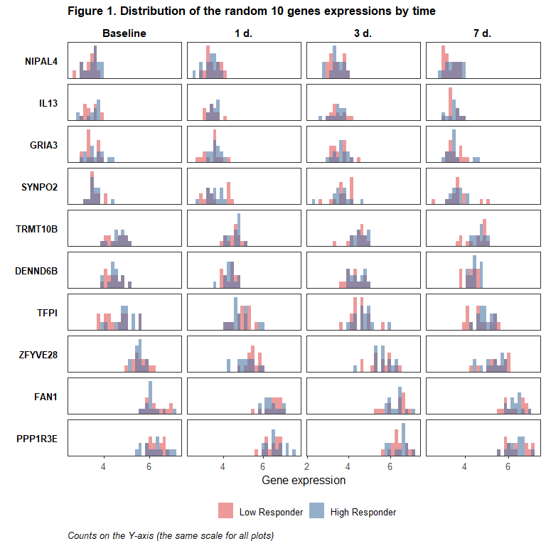<!-- -->

<br>

## **Сравнение экспрессии генов между группами испытуемых с разным уровнем ответа: попарные тесты Манна-Уитни**

<br>

В каждой точке исследования по каждому гену сравним экспрессии генов между группами со слабым и сильным ответом на вакцинацию с помощью теста Манна-Уитни, скорректируем полученные p-values по методу Бенджамини-Хохберга (для контроля FDR, в каждой точке отдельно) и посмотрим, по какому количеству генов средние значения экспрессий различаются на уровне значимости 5% без коррекции и с коррекцией.


```r
mwtest_p <- suppressWarnings({df_expr_long_fin %>%
    group_by(time, timeF, gene) %>%
    summarise(p = wilcox.test(expr ~ response)$p.value) %>%
    group_by(time) %>%
    mutate(p_adj = p.adjust(p, method = "BH")) %>%
    ungroup() %>%
    arrange(p_adj) %>%
    mutate(p_group = cut(p, c(0, 0.05, 1.1), c("< 0.05", "$\\geq$ 0.05"), right = FALSE),
           p_adj_group = cut(p_adj, c(0, 0.05, 1.1), c("< 0.05", "$\\geq$ 0.05"), right = FALSE))
})

genes_sig_mw <- AnnotationDbi::select(org.Hs.eg.db::org.Hs.eg.db, mwtest_p$gene[mwtest_p$p_adj < 0.05], 
                                      c("GENENAME", "GO"), "SYMBOL") %>% 
  filter(ONTOLOGY == "BP") %>%
  mutate(TERM = AnnotationDbi::Term(GO), DEFINITION = AnnotationDbi::Definition(GO)) %>%
  select(SYMBOL, GENENAME, TERM, DEFINITION) %>%
  unique()

tbl_summary(
  mwtest_p %>% select(timeF, p_group, p_adj_group), 
  by = "timeF",
  label = list(p_group = "P-value",
               p_adj_group = "Adjusted p-value")) %>%
  modify_footnote(everything() ~ NA) %>%
  modify_header(label ~ "", 
                all_stat_cols() ~ "**{level}**") %>%
  bold_labels() %>%
  as_kable_extra(caption = "<b>Table 2. P-values of the Mann-Whitney tests before and after<br>
                 adjustment under Benjamini & Hochberg method</b>,<br>number of genes (%)") %>% 
  kableExtra::row_spec(0, bold = TRUE) %>%
  kableExtra::kable_classic(full_width = FALSE, position = "left", font_size = 14,
                            html_font = "\"Source Sans Pro\", helvetica, sans-serif")
```

<table class=" lightable-classic" style='font-size: 14px; font-family: "Source Sans Pro", helvetica, sans-serif; width: auto !important; '>
<caption style="font-size: initial !important;">
<b>Table 2. P-values of the Mann-Whitney tests before and after<br>
                 adjustment under Benjamini &amp; Hochberg method</b>,<br>number of genes (%)</caption>
 <thead>
  <tr>
   <th style="text-align:left;font-weight: bold;">  </th>
   <th style="text-align:center;font-weight: bold;"> Baseline </th>
   <th style="text-align:center;font-weight: bold;"> 1 d. </th>
   <th style="text-align:center;font-weight: bold;"> 3 d. </th>
   <th style="text-align:center;font-weight: bold;"> 7 d. </th>
  </tr>
 </thead>
<tbody>
  <tr>
   <td style="text-align:left;"> <span style=" font-weight: bold;    ">P-value</span> </td>
   <td style="text-align:center;">  </td>
   <td style="text-align:center;">  </td>
   <td style="text-align:center;">  </td>
   <td style="text-align:center;">  </td>
  </tr>
  <tr>
   <td style="text-align:left;padding-left: 2em;" indentlevel="1"> &lt; 0.05 </td>
   <td style="text-align:center;"> 356 (7.1%) </td>
   <td style="text-align:center;"> 423 (8.5%) </td>
   <td style="text-align:center;"> 353 (7.1%) </td>
   <td style="text-align:center;"> 426 (8.5%) </td>
  </tr>
  <tr>
   <td style="text-align:left;padding-left: 2em;" indentlevel="1"> $\geq$ 0.05 </td>
   <td style="text-align:center;"> 4644 (93%) </td>
   <td style="text-align:center;"> 4577 (92%) </td>
   <td style="text-align:center;"> 4647 (93%) </td>
   <td style="text-align:center;"> 4574 (91%) </td>
  </tr>
  <tr>
   <td style="text-align:left;"> <span style=" font-weight: bold;    ">Adjusted p-value</span> </td>
   <td style="text-align:center;">  </td>
   <td style="text-align:center;">  </td>
   <td style="text-align:center;">  </td>
   <td style="text-align:center;">  </td>
  </tr>
  <tr>
   <td style="text-align:left;padding-left: 2em;" indentlevel="1"> &lt; 0.05 </td>
   <td style="text-align:center;"> 0 (0%) </td>
   <td style="text-align:center;"> 0 (0%) </td>
   <td style="text-align:center;"> 0 (0%) </td>
   <td style="text-align:center;"> 2 (&lt;0.1%) </td>
  </tr>
  <tr>
   <td style="text-align:left;padding-left: 2em;" indentlevel="1"> $\geq$ 0.05 </td>
   <td style="text-align:center;"> 5000 (100%) </td>
   <td style="text-align:center;"> 5000 (100%) </td>
   <td style="text-align:center;"> 5000 (100%) </td>
   <td style="text-align:center;"> 4998 (100%) </td>
  </tr>
</tbody>
</table>

<br>

Оказалось всего 2 гена, экспрессии которых статистически значимым образом (на 5%-ном уровне значимости) различаются между сильными и слабыми респондерами, оба наблюдения относятся к точке 7 дней после вакцинации, - это гены IL2RA, RIC3. Статистика по экспрессии этих генов в группах в каждой точке исследования представлена в таблице ниже.


```r
tbl_data <- df_expr %>%
  select(time, response, all_of(mwtest_p$gene[mwtest_p$p_adj < 0.05])) %>%
  nest_by(time) %>%
  mutate(tbl = list(
    tbl_summary(data, 
                by = "response",
                type = all_continuous() ~ "continuous2",
                statistic = list(
                  all_continuous() ~ c("{mean} ({sd})", "{median} ({p25}-{p75})", 
                                       "{min}-{max}")),
                digits = list(all_continuous() ~ rep(1,7))) %>%
      add_stat_label(label = list(
        all_continuous() ~ c("Mean (SD)", "Median (Q1-Q3)", "Range"))) %>%
      add_p(pvalue_fun = function(x) style_pvalue(x, digits = 3)) %>%
      modify_header(all_stat_cols() ~ "**{level}**<br>N = {n}",
                    label ~ "**Gene/ Statistic**") %>%
      modify_footnote(p.value ~ "p-value: Mann-Whitney test with Benjamini & Hochberg correction") %>%
      bold_labels()))

for (i in tbl_data$time) {
  tb <- tbl_data$tbl[tbl_data$time == i][[1]]
  tb$table_body$p.value[tb$table_body$row_type == "label"] <-
    mwtest_p$p_adj[mwtest_p$time == i][match(names(tbl_data$data[tbl_data$time == i][[1]])[-1], 
                                             mwtest_p$gene[mwtest_p$time == i])]
  tbl_data$tbl[tbl_data$time == i][[1]] <- tb
}

tbl_merge(tbl_data$tbl, tab_spanner = sprintf("<b>%s</b>", levels(mwtest_p$timeF))) %>%
  as_kable_extra(caption = "<b>Table 3. Descriptive statistics for genes with expressions,
  significantly different between low and high responders.</b>", addtl_fmt = FALSE) %>% 
  kableExtra::row_spec(0, bold = TRUE) %>%
  kableExtra::kable_classic(full_width = FALSE, position = "left", font_size = 11,
                            html_font = "\"Source Sans Pro\", helvetica, sans-serif")
```

<table style='NAborder-bottom: 0; font-size: 11px; font-family: "Source Sans Pro", helvetica, sans-serif; width: auto !important; ' class=" lightable-classic">
<caption style="font-size: initial !important;"><b>Table 3. Descriptive statistics for genes with expressions,
  significantly different between low and high responders.</b></caption>
 <thead>
<tr>
<th style="empty-cells: hide;border-bottom:hidden;" colspan="1"></th>
<th style="border-bottom:hidden;padding-bottom:0; padding-left:3px;padding-right:3px;text-align: center; " colspan="3"><div style="border-bottom: 1px solid #ddd; padding-bottom: 5px; "><b>Baseline</b></div></th>
<th style="border-bottom:hidden;padding-bottom:0; padding-left:3px;padding-right:3px;text-align: center; " colspan="3"><div style="border-bottom: 1px solid #ddd; padding-bottom: 5px; "><b>1 d.</b></div></th>
<th style="border-bottom:hidden;padding-bottom:0; padding-left:3px;padding-right:3px;text-align: center; " colspan="3"><div style="border-bottom: 1px solid #ddd; padding-bottom: 5px; "><b>3 d.</b></div></th>
<th style="border-bottom:hidden;padding-bottom:0; padding-left:3px;padding-right:3px;text-align: center; " colspan="3"><div style="border-bottom: 1px solid #ddd; padding-bottom: 5px; "><b>7 d.</b></div></th>
</tr>
  <tr>
   <th style="text-align:left;font-weight: bold;"> Gene/ Statistic </th>
   <th style="text-align:center;font-weight: bold;"> Low Responder<br>N = 14 </th>
   <th style="text-align:center;font-weight: bold;"> High Responder<br>N = 14 </th>
   <th style="text-align:center;font-weight: bold;"> p-value </th>
   <th style="text-align:center;font-weight: bold;"> Low Responder<br>N = 14 </th>
   <th style="text-align:center;font-weight: bold;"> High Responder<br>N = 14 </th>
   <th style="text-align:center;font-weight: bold;"> p-value </th>
   <th style="text-align:center;font-weight: bold;"> Low Responder<br>N = 14 </th>
   <th style="text-align:center;font-weight: bold;"> High Responder<br>N = 14 </th>
   <th style="text-align:center;font-weight: bold;"> p-value </th>
   <th style="text-align:center;font-weight: bold;"> Low Responder<br>N = 14 </th>
   <th style="text-align:center;font-weight: bold;"> High Responder<br>N = 14 </th>
   <th style="text-align:center;font-weight: bold;"> p-value </th>
  </tr>
 </thead>
<tbody>
  <tr>
   <td style="text-align:left;"> <span style=" font-weight: bold;    ">IL2RA</span> </td>
   <td style="text-align:center;">  </td>
   <td style="text-align:center;">  </td>
   <td style="text-align:center;"> 0.914 </td>
   <td style="text-align:center;">  </td>
   <td style="text-align:center;">  </td>
   <td style="text-align:center;"> 0.902 </td>
   <td style="text-align:center;">  </td>
   <td style="text-align:center;">  </td>
   <td style="text-align:center;"> 0.893 </td>
   <td style="text-align:center;">  </td>
   <td style="text-align:center;">  </td>
   <td style="text-align:center;"> 0.017 </td>
  </tr>
  <tr>
   <td style="text-align:left;padding-left: 2em;" indentlevel="1"> Mean (SD) </td>
   <td style="text-align:center;"> 4.9 (0.4) </td>
   <td style="text-align:center;"> 5.1 (0.4) </td>
   <td style="text-align:center;">  </td>
   <td style="text-align:center;"> 5.0 (0.4) </td>
   <td style="text-align:center;"> 5.1 (0.4) </td>
   <td style="text-align:center;">  </td>
   <td style="text-align:center;"> 5.1 (0.4) </td>
   <td style="text-align:center;"> 5.0 (0.5) </td>
   <td style="text-align:center;">  </td>
   <td style="text-align:center;"> 4.8 (0.3) </td>
   <td style="text-align:center;"> 5.4 (0.4) </td>
   <td style="text-align:center;">  </td>
  </tr>
  <tr>
   <td style="text-align:left;padding-left: 2em;" indentlevel="1"> Median (Q1-Q3) </td>
   <td style="text-align:center;"> 5.1 (4.7-5.1) </td>
   <td style="text-align:center;"> 4.9 (4.8-5.4) </td>
   <td style="text-align:center;">  </td>
   <td style="text-align:center;"> 5.1 (4.7-5.2) </td>
   <td style="text-align:center;"> 5.2 (4.8-5.4) </td>
   <td style="text-align:center;">  </td>
   <td style="text-align:center;"> 5.1 (4.8-5.4) </td>
   <td style="text-align:center;"> 4.9 (4.6-5.3) </td>
   <td style="text-align:center;">  </td>
   <td style="text-align:center;"> 4.8 (4.7-5.0) </td>
   <td style="text-align:center;"> 5.3 (5.3-5.5) </td>
   <td style="text-align:center;">  </td>
  </tr>
  <tr>
   <td style="text-align:left;padding-left: 2em;" indentlevel="1"> Range </td>
   <td style="text-align:center;"> 4.3-5.3 </td>
   <td style="text-align:center;"> 4.5-5.9 </td>
   <td style="text-align:center;">  </td>
   <td style="text-align:center;"> 4.3-5.6 </td>
   <td style="text-align:center;"> 4.7-6.0 </td>
   <td style="text-align:center;">  </td>
   <td style="text-align:center;"> 4.3-5.8 </td>
   <td style="text-align:center;"> 4.4-5.8 </td>
   <td style="text-align:center;">  </td>
   <td style="text-align:center;"> 4.1-5.2 </td>
   <td style="text-align:center;"> 4.8-6.2 </td>
   <td style="text-align:center;">  </td>
  </tr>
  <tr>
   <td style="text-align:left;"> <span style=" font-weight: bold;    ">RIC3</span> </td>
   <td style="text-align:center;">  </td>
   <td style="text-align:center;">  </td>
   <td style="text-align:center;"> 0.752 </td>
   <td style="text-align:center;">  </td>
   <td style="text-align:center;">  </td>
   <td style="text-align:center;"> 0.401 </td>
   <td style="text-align:center;">  </td>
   <td style="text-align:center;">  </td>
   <td style="text-align:center;"> 0.739 </td>
   <td style="text-align:center;">  </td>
   <td style="text-align:center;">  </td>
   <td style="text-align:center;"> 0.017 </td>
  </tr>
  <tr>
   <td style="text-align:left;padding-left: 2em;" indentlevel="1"> Mean (SD) </td>
   <td style="text-align:center;"> 4.2 (0.3) </td>
   <td style="text-align:center;"> 4.4 (0.3) </td>
   <td style="text-align:center;">  </td>
   <td style="text-align:center;"> 4.1 (0.3) </td>
   <td style="text-align:center;"> 4.4 (0.5) </td>
   <td style="text-align:center;">  </td>
   <td style="text-align:center;"> 4.2 (0.5) </td>
   <td style="text-align:center;"> 4.5 (0.4) </td>
   <td style="text-align:center;">  </td>
   <td style="text-align:center;"> 3.8 (0.3) </td>
   <td style="text-align:center;"> 4.5 (0.3) </td>
   <td style="text-align:center;">  </td>
  </tr>
  <tr>
   <td style="text-align:left;padding-left: 2em;" indentlevel="1"> Median (Q1-Q3) </td>
   <td style="text-align:center;"> 4.1 (4.0-4.4) </td>
   <td style="text-align:center;"> 4.3 (4.2-4.6) </td>
   <td style="text-align:center;">  </td>
   <td style="text-align:center;"> 4.1 (3.9-4.2) </td>
   <td style="text-align:center;"> 4.4 (4.2-4.7) </td>
   <td style="text-align:center;">  </td>
   <td style="text-align:center;"> 4.1 (3.8-4.6) </td>
   <td style="text-align:center;"> 4.5 (4.3-4.6) </td>
   <td style="text-align:center;">  </td>
   <td style="text-align:center;"> 3.7 (3.6-3.9) </td>
   <td style="text-align:center;"> 4.4 (4.2-4.7) </td>
   <td style="text-align:center;">  </td>
  </tr>
  <tr>
   <td style="text-align:left;padding-left: 2em;" indentlevel="1"> Range </td>
   <td style="text-align:center;"> 3.7-4.7 </td>
   <td style="text-align:center;"> 3.8-5.0 </td>
   <td style="text-align:center;">  </td>
   <td style="text-align:center;"> 3.5-4.6 </td>
   <td style="text-align:center;"> 3.1-5.1 </td>
   <td style="text-align:center;">  </td>
   <td style="text-align:center;"> 3.4-5.0 </td>
   <td style="text-align:center;"> 3.7-5.2 </td>
   <td style="text-align:center;">  </td>
   <td style="text-align:center;"> 3.3-4.4 </td>
   <td style="text-align:center;"> 4.1-4.9 </td>
   <td style="text-align:center;">  </td>
  </tr>
</tbody>
<tfoot><tr><td style="padding: 0; " colspan="100%">
<sup>1</sup> p-value: Mann-Whitney test with Benjamini &amp; Hochberg correction</td></tr></tfoot>
</table>

<br>

В качестве иллюстрации:


```r
ggplot(df_expr_long_fin %>% filter(gene %in% mwtest_p$gene[mwtest_p$p_adj < 0.05]),
       aes(x = timeF, y = expr, color = response)) +
  geom_boxplot(position = position_dodge(0.8), width = 0.6) +
  geom_beeswarm(dodge.width = 0.8, groupOnX = TRUE, size = 1.5, alpha = 0.5) +
  scale_color_manual(values = c("#E15759", "#4E79A7")) +
  facet_rep_wrap(~ gene, repeat.tick.labels = TRUE) +
  labs(x = element_blank(), y = "Gene expression", color = element_blank(),
       title = "Figure 2. Expressions by time and response status",
       subtitle = "Genes with significantly different expressions (at least at one point)",
       caption = "Elements of the boxplots:
       bold line inside the box is a median value (Q2), 
       lower and upper bounds of the box are Q1 and Q3 values, respectively, 
       lower whisker is a value for the smallest observation greater than or equal to Q1-1.5*IQR,
       upper whisker is a value for the largest observation less than or equal to Q3+1.5*IQR.") +
  theme_classic(base_size = 12) +
  theme(legend.position = "bottom",
        panel.grid.major.y = element_line(size = .2, color = '#ebebebFF'),
        panel.grid.minor.y = element_line(size = .1, color = '#ebebebFF'),
        axis.text.x = element_text(face = "bold"),
        strip.background = element_blank(),
        strip.text.x = element_text(size = 12, color = "black", face = "bold"),
        plot.title = element_text(size = 13, face = "bold"),
        plot.subtitle = element_text(size = 10),
        plot.caption = element_text(color = "black", face = "italic", hjust = 0))
```

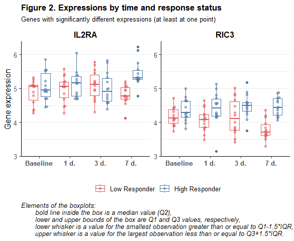<!-- -->

<br>

[**IL2RA**](https://en.wikipedia.org/wiki/IL2RA) - это NA ген, который кодирует белок Interleukin-2 receptor alpha chain (CD25), [Interleukin-2 (IL-2)](https://en.wikipedia.org/wiki/Interleukin_2), участвующий в регулировании активности лейкоцитов, отвечающих за иммунитет. Все биологические процессы, в которых участвуют белковые продукты данного гена (по данным из Gene Ontology): .

[**RIC3**](https://en.wikipedia.org/wiki/RIC3) - это NA ген, который кодирует chaperon белок RIC-3, отвечающий за резистентность к ингибиторам cholinesterase 3. [Chaperon белки](https://en.wikipedia.org/wiki/Chaperone_(protein)) участвуют в сворачивании или разворачивании крупных белков или макромолекулярных белковых комплексов. Все биологические процессы, в которых участвуют белковые продукты данного гена (по данным из Gene Ontology): .

<br>

## **Сравнение экспрессии генов между группами испытуемых с разным уровнем ответа: линейная смешанная модель**

<br>


```r
# Функция для нахождения квантилей по эмпирической функции распределения --> 
# ранги
rank_quant <- function(x) {
  ecdf_x <- ecdf(x)
  ecdf_inv <- function(v) {quantile(x, v)}
  qq <- ecdf_inv(ecdf_x(x))
  qq <- names(qq) %>% gsub("%", "", .) %>% as.numeric(.)/100
  qq
}

# "Квантильные" ранги для экспрессий генов для каждого испытуемого в каждой точке
df_expr_long_fin <- df_expr_long_fin %>%
  group_by(participant_id, time) %>%
  mutate(expr_rank = rank_quant(expr)) %>%
  ungroup()
```

### **Описание модели**

<br>

Для каждого гена из ранее отобранных 5 тыс. оценим линейные смешанные модели (linear mixed effects model) вида:

1. $expr_{it} = \beta_0 + \beta_{0i} + \beta_1*time_{j} + \beta_2*response_{i} + \epsilon_{ij}$, где:

- $expr_{ij}$ - экспрессия гена для _i_-го испытуемого в точке исследования _j_; оценим отдельно спецификации с:

  - исходными данными по экспрессии, 

  - рангами генов по экспрессии, рассчитанными для каждого испытуемого в каждой точке исследования как квантиль эмпрической функции распределения экспрессий по всем генам для этого испытуемого в этой точке, 

- $time_j$ - точка исследования (в днях от вакцинации), 

- $response_i$ - ответ на вакцинацию _i_-го испытумого (1 - high responder, 0 - low responder), 

- $\beta_0$ - константа регрессионного уравнения (глобальное среднее значение экспрессии гена по всем испытуемым во всех точках),

- $\beta_{0i}$ - случайный эффект (моделируется для каждого испытуемого, имеет нормальное распределение со средним 0 и дисперсией, которая характеризует вариацию средней экспрессии гена между испытуемыми вокруг глоабального среднего значения),

- $\beta_{1,2}$ - коэффициенты регрессионного уравнения (фиксированные эффекты времени от вакцинации и ответа на неё), 

- $\epsilon_{ij}$ - случайный остаток регрессионного уравнения (предполагается, что имеет нормальное распределение со средним значением 0 и дисперсией, которая характеризует вариацию экспрессии для каждого испытуемого (во времени)).

Оценка коэффициента $\beta_2$ данного регрессионного уравнения может интерпретироваться как **средний предельный эффект (average marginal/ treatment effect, AME/ ATE)** ответа на вакцинацию в отношении экспрессии, т.е. в нашем случае она покажет, на сколько отличается среднее значение экспрессии гена среди high респондеров по сравнению с low респондерами по всем точкам исследования.

<br>

2. $expr_{it} = \beta_0 + \beta_{0i} + \beta_1*time_{j} + \beta_2*response_{i} + \beta_3*time_j * response_i + \epsilon_{ij}$, где по сравнению с предыдущей спецификацией добавляется $time_j * response_i$ - пересечение времени анализа и статуса по ответу на вакцинацию.

При оценке этой модели предполагается, что эффект ответа на вацинацию может меняться во времени (и, аналогично, динамика экспрессии может быть разной в зависимости от ответа на вакцинацию). Оценка коэффициента $\beta_2$ в этой модели может быть интерпретирована как ATE в точке baseline (когда $time=0$), т.е. как baseline разница в средней экспрессии гена между теми, кто в дальнейшем был отнесен к high респондерам, и теми, кто нет. Для остальных временных точек ATE может быть получен из соотношения $\beta_2 + \beta_3*time$. Соответственно оценку коэффициента $\beta_3$ мы можем интерпретировать как изменение ATE ответа при увеличении времени от вакцинации на 1 день.

<br>

Оценка линейных смешанных моделей будет выполнена с помощью функции `lmer` из пакета `lme4`, а оценка средних предельных эффектов - с помощью функции `marginaleffects` из одноименного пакета. Заметим, что если в `marginaleffects` после модели с эффектами пересечения задать конкретные временные точки (например, $time=$ 0,1,3,7), то для переменной $response$ мы получим искомые значения ATE в этих точках ($\beta_2 + \beta_3*time$) вместе с их p-values, а если этого не сделать, то на выходе для переменной $response$ мы получим оценку ATE, равную оценке коэффициента $\beta_2$ из модели без эффекта пересечения.


```r
# Оценка линейных смешанных моделей

lmer_q <- purrr::quietly(.f = lmer)

lmer_fits <- df_expr_long_fin %>%
  nest(-gene) %>%
  mutate(
    fit_noint = map(data, ~ lmer_q(expr ~ time + response + (1|participant_id), .x)),
    fit_int = map(data, ~ lmer_q(expr ~ time*response + (1|participant_id), .x)),
    fit_nointrank = map(data, ~ lmer_q(expr_rank ~ time + response + (1|participant_id), .x)),
    fit_intrank = map(data, ~ lmer_q(expr_rank ~ time*response + (1|participant_id), .x)))

lmer_res <- lmer_fits %>%
  mutate(
    beta_p_noint = map(fit_noint, ~ .x$result %>% broom.mixed::tidy()),
    beta_p_nointrank = map(fit_nointrank, ~ .x$result %>% broom.mixed::tidy()),
    beta_p_int = map(fit_int, ~ .x$result %>% broom.mixed::tidy()),
    beta_p_intrank = map(fit_intrank, ~ .x$result %>% broom.mixed::tidy()),
    ame_int = map(
      fit_int, ~ .x$result %>% 
        marginaleffects(newdata = datagrid(time = timepoints, response = levels(df_subj_baseline$response)), eps = 0.001)),
    ame_intrank = map(
      fit_intrank, ~ .x$result %>% 
        marginaleffects(newdata = datagrid(time = timepoints, response = levels(df_subj_baseline$response)), eps = 0.001))) %>%
  select(-data, -contains("fit"))

# # Сохраним результаты в rds (без отправки на github, т.к. файл большой)
# # saveRDS(lmer_res, "OlgaMironenko/res/lmer_res.rds")
# # lmer_res <- readRDS("OlgaMironenko/res/lmer_res.rds")
# # lmer_res <- readRDS(file.path("..", "OlgaMironenko", "res", "lmer_res.rds"))

# Betas and p-values для моделей с пересечением

lmer_betas_int <- full_join(
  lmer_res %>%
    select(gene, beta_p_int) %>%
    unnest(beta_p_int) %>%
    select(gene, term, estimate, p.value),
  lmer_res %>%
    select(gene, beta_p_intrank) %>%
    unnest(beta_p_intrank) %>%
    select(gene, term, estimate, p.value),
  by = c("gene", "term"), suffix = c("_init", "_rank"))

# AMEs/ATEs and p-values для моделей с пересечением

lmer_ames_int <- full_join(
  lmer_res %>%
    select(gene, ame_int) %>%
    unnest(ame_int) %>%
    select(gene, term, time, response, dydx, p.value),
  lmer_res %>%
    select(gene, ame_intrank) %>%
    unnest(ame_intrank) %>%
    select(gene, term, time, response, dydx, p.value),
  by = c("gene", "term", "time", "response"), suffix = c("_init", "_rank"))

# Betas and p-values для моделей без пересечения

lmer_betas_noint <- full_join(
  lmer_res %>%
    select(gene, beta_p_noint) %>%
    unnest(beta_p_noint) %>%
    select(gene, term, estimate, p.value),
  lmer_res %>%
    select(gene, beta_p_nointrank) %>%
    unnest(beta_p_nointrank) %>%
    select(gene, term, estimate, p.value),
  by = c("gene", "term"), suffix = c("_init", "_rank"))

# # Сохраним результаты в rds, чтобы при формировании отчёта не ждать оценки регрессий
saveRDS(lmer_betas_int, "OlgaMironenko/res/lmer_betas_int.rds")
saveRDS(lmer_betas_noint, "OlgaMironenko/res/lmer_betas_noint.rds")
saveRDS(lmer_ames_int, "OlgaMironenko/res/lmer_ames_int.rds")
```


```r
# lmer_betas_int <- readRDS("OlgaMironenko/res/lmer_betas_int.rds")
# lmer_betas_noint <- readRDS("OlgaMironenko/res/lmer_betas_noint.rds")
# lmer_ames_int <- readRDS("OlgaMironenko/res/lmer_ames_int.rds")
lmer_betas_int <- readRDS(file.path("..", "OlgaMironenko", "res", "lmer_betas_int.rds"))
lmer_betas_noint <- readRDS(file.path("..", "OlgaMironenko", "res", "lmer_betas_noint.rds"))
lmer_ames_int <- readRDS(file.path("..", "OlgaMironenko", "res", "lmer_ames_int.rds"))

critv <- -log10(0.05)

# Data frame for all betas and p-values for all LMMs

lmer_res_long <- bind_rows(
  lmer_betas_int %>%
    filter(grepl("response", term)) %>%
    transmute(gene, model = "int", term = ifelse(grepl("time", term), "b3", "b2"), 
              estimate_init, estimate_rank, p.value_init, p.value_rank,
              time = NA) %>%
    pivot_longer(cols = -c(gene, model, term, time), 
                 names_pattern = "(estimate|p.value)_(.+)$",
                 names_to = c(".value", "expr")),
  lmer_betas_noint %>%
    filter(grepl("response", term)) %>%
    pivot_longer(cols = -c(gene, term), names_pattern = "(estimate|p.value)_(.+)$",
                 names_to = c(".value", "expr")) %>%
    mutate(model = "noint", term = "b2", time = NA),
  lmer_ames_int %>%
    filter(term == "response" & response == "Low Responder") %>%
    select(-term, -response) %>%
    pivot_longer(cols = -c(gene, time), names_pattern = "(dydx|p.value)_(.+)$",
                 names_to = c(".value", "expr")) %>%
    mutate(model = "int", term = sprintf("ame%d", time)) %>%
    rename(estimate = dydx)
) %>%
  mutate(logp = -log10(p.value),
         sig = logp > critv,
         model_var = sprintf("%s_%s_%s", expr, model, term),
         expr = factor(expr, c("init", "rank"), c("Expression as is", "Rank by expression")),
         time = factor(time, timepoints, labels = ifelse(timepoints == 0, "Baseline", paste(timepoints, "d."))))

# Significant genes

genes_sig <- map(
  lmer_res_long %>%
    filter(sig) %>%
    split(f = as.factor(.$model_var)),
  ~ .x %>% pull(gene))

models <- names(genes_sig)
models_num <- as.numeric(str_extract(models, "\\d+"))

genes_sig_lbls <- sprintf("%s, %s (%s)",
                          ifelse(grepl("init",models), "Expr.", "Ranks"),
                          ifelse(grepl("ame",models), "sig. ATE", 
                                 ifelse(models_num == 2, "sig. b2", "sig. b3")),
                          ifelse(grepl("ame0|_int_b2", models), "Baseline",
                                 ifelse(grepl("b3", models), "Change",
                                        ifelse(grepl("noint", models), "Overall",
                                               sprintf("%d d.", models_num))))) %>%
  as.list() %>% setNames(models)

# Simultaneous significance for the main and interaction terms

lmer_sig_int <- lmer_res_long %>%
  filter(model == "int" & !grepl("ame", term)) %>%
  pivot_wider(id_cols = c(gene, expr), names_from = "term", values_from = c("logp", "sig"))

genes_sig$init_int_b2b3 <- lmer_sig_int %>% filter(sig_b2 & sig_b3 & expr == "Expression as is") %>% pull(gene)
genes_sig$rank_int_b2b3 <- lmer_sig_int %>% filter(sig_b2 & sig_b3 & expr != "Expression as is") %>% pull(gene)

genes_sig_lbls$init_int_b2b3 <- "Expr., sig. b2 and b3"
genes_sig_lbls$rank_int_b2b3 <- "Ranks, sig. b2 and b3"
```

<br>

### **Результаты оценки**

<br>

#### **Наборы значимых генов в разных моделях**

<br>

Всего получилось 414 генов в модели с исходными значениями для экспрессии и 386 генов в модели с рангами для экспрессии, для которых на 5%-ном уровне значимости статистически значим коэффициент при ответе в регрессиях без эффекта пересечения - иными словами, значимо различается среднее значение экспрессии между испытуемыми с разным уровнем ответа по всем точкам исследования. 

В регрессиях с эффектами пересечения обнаружилось 49 генов в модели с исходными значениями для экспрессии и 42 гена в модели с рангами для экспрессии, для которых на 5%-ном уровне значимости статистически значим и основной эффект для ответа, и эффект пересечения ответа со временем, т.е. испытуемые с разным уровнем ответа значимо отличались не только по среднему значению экспрессии данных генов до вакцинации, но и по его динамике. Ещё для 277 (260) генов в соответствующих моделях был значим только основной эффект, т.е. испытуемые с разным ответом на вакцинацию изначально различались по экспрессии этих генов, но её динамика была схожей в этих группах. Ещё для 318 (337) генов был значим только эффект пересечения, т.е. испытуемые с разным ответом на вакцинацию изначально не различались по экспрессии этих генов, но её динамика была в этих группах разной.

Ниже на графике покажем, насколько пересекаются наборы генов-находок, выявленных по статистической значимости коэффициентов в моделях с и без эффектов пересечения.


```r
upset_plt_df <- cbind(
  gene = genes_maxvar$gene,
  map_dfc(genes_sig[grepl("_b\\d$", names(genes_sig))], ~ genes_maxvar$gene %in% .x)) %>%
  filter(if_any(-gene, ~.)) %>%
  setNames(c("gene", genes_sig_lbls[names(.)[-1]]))

upset_plot(upset_plt_df, rev(colnames(upset_plt_df)[-1]), 
           c(darken("#A0CBE8"), rep("#A0CBE8", 2), darken("#F1CE63"), rep("#F1CE63", 2)),
           "Figure 3. Intersection of gene sets with significant coefficients",
           "Linear mixed models with and without the interaction term", FALSE, -0.3) +
  labs(caption = "Models with the interaction term:\n sig. b2 (Baseline) = p < 0.05 for the coeff-t near the main effect of the response,\n sig. b3 (Change) = p < 0.05 for the coeff-t near the response * time interaction.\nModels without the interaction term:\n sig. b2 (Overall) = p < 0.05 coeff-t for the response.") +
  theme(plot.caption = element_text(size = 10, color = "black", face = "italic", hjust = 0))
```

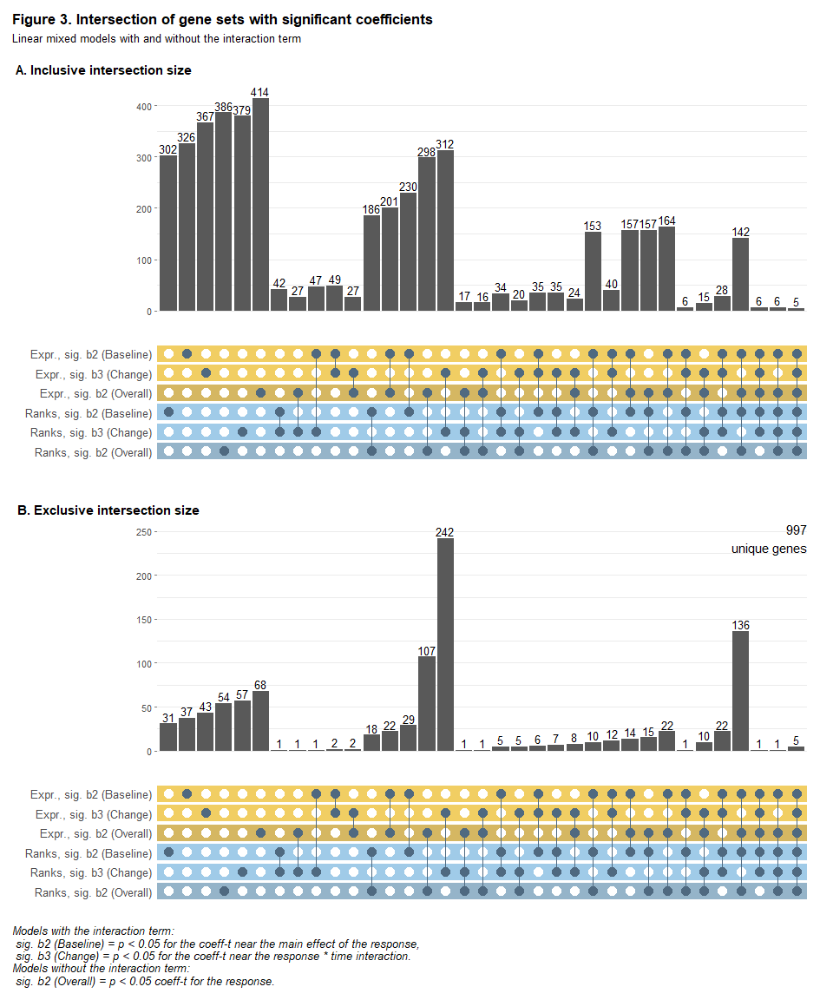<!-- -->

Из всех уникальных генов, для которых был статистически значимым хотя бы один коэффициент в линейных смешанных моделей, больше всего генов имели значимый коэффициент при эффекте пересечения ответа со временем в моделях и с исходными данными по экспрессии, и с рангами генов по экспрессии. 

<br>

Для моделей с эффектами пересечения мы также можем оценить **средний эффект воздействия (average treatment effect, ATE) ответа в отдельных точках исследования**. Ниже на графике покажем, насколько пересекаются наборы генов-находок между точками исследования (гены с p-value < 0.05 для соответствующего ATE).


```r
# Whether each gene was significant in any model
genes_maxvar <- cbind(
  genes_maxvar,
  map_dfc(genes_sig[!grepl("b2b3", names(genes_sig))], ~ genes_maxvar$gene %in% .x))

upset_plt_df_1 <- genes_maxvar %>%
  select(contains("init_int_ame")) %>%
  filter(if_any(everything(), ~.)) %>%
  setNames(genes_sig_lbls[names(.)])

upset_plot(upset_plt_df_1, rev(colnames(upset_plt_df_1)), 
           rep("#F1CE63", 4),
           "Figure 4(1). Intersection of gene sets with significant ATEs,\nExpression as is",
           "Linear mixed models with the interaction term", TRUE, -0.8)
```

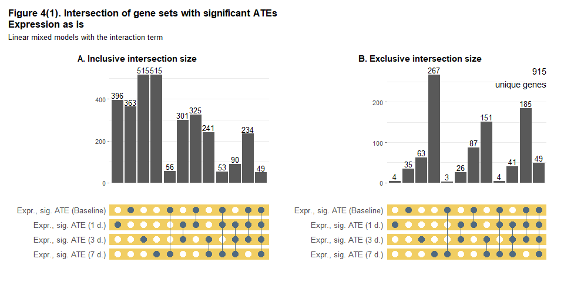<!-- -->

```r
upset_plt_df_2 <- genes_maxvar %>%
  select(contains("rank_int_ame")) %>%
  filter(if_any(everything(), ~.)) %>%
  setNames(genes_sig_lbls[names(.)])

upset_plot(upset_plt_df_2, rev(colnames(upset_plt_df_2)), 
           rep("#A0CBE8", 4),
           "Figure 4(2). Intersection of gene sets with significant ATEs,\nRanks by expression",
           "Linear mixed models with the interaction term", TRUE, -0.8)
```

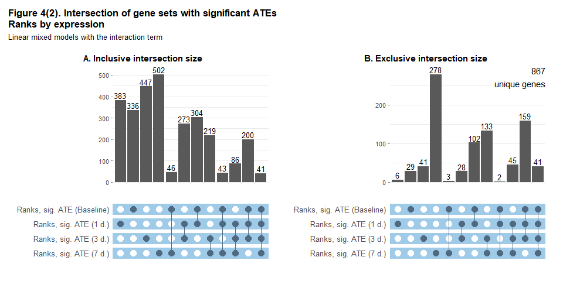<!-- -->

```r
genes_sig_ame7 <- genes_maxvar %>% 
  filter((init_int_ame7 | rank_int_ame7) & 
           !init_int_ame0 & !init_int_ame1 & !init_int_ame3 &
           !rank_int_ame0 & !rank_int_ame1 & !rank_int_ame3)
```

Для относительно небольшого числа генов средний эффект воздействия ответа в отношении экспрессии является статистически значимым на всём протяжении исследования (от 0 до 7 дней). Также относительно невелико число генов, для которых ATE был статистически незначим до вакцинации, но был значимым с 1 по 7 дни, как и генов, для которых, наоборот значимость ATE до вакцинации сменилась на статистическую незначимость с 1 по 7 дней после неё. Но самое примечательное - мода: для наибольшего числа генов ATE стал значимым только к 7 дням после вакцинации.

Всего для 310 ATE в 7 дней был значим в модели с исходными данными по экспрессии или с рангами по экспрессии, но не значим ни в одной из них в 0-3 дня. Ниже представлены биологические процессы, в которых участвуют продукты этих генов (с количеством генов из указанного числа, 5 и более).


```r
t4 <- bp_genesF(genes_sig_ame7)
t4$GOBPID <- kableExtra::cell_spec(t4$GOBPID, "html", link = sprintf("http://amigo.geneontology.org/amigo/term/%s", t4$GOBPID))

t4 %>%
  select(-genes) %>%
  filter(n > 4) %>%
  kable(escape = FALSE, align = "lclcl", col.names = c("BP (GO term)", "GOBPID", "Definition (GO)", "N, sig.genes"), 
        caption = "<b>Table 4. Biological processes (GO) for genes with significant ATE at 7 d. and insignificant ATE at 0-3 d.</b>") %>% 
  kableExtra::row_spec(0, bold = TRUE, align = "c") %>%
  kableExtra::column_spec(1:4, extra_css = "vertical-align:top;") %>%
  kableExtra::kable_paper(full_width = FALSE, position = "left", font_size = 12,
                          html_font = "\"Source Sans Pro\", helvetica, sans-serif")
```

<table class=" lightable-paper" style='font-size: 12px; font-family: "Source Sans Pro", helvetica, sans-serif; width: auto !important; '>
<caption style="font-size: initial !important;"><b>Table 4. Biological processes (GO) for genes with significant ATE at 7 d. and insignificant ATE at 0-3 d.</b></caption>
 <thead>
  <tr>
   <th style="text-align:left;font-weight: bold;text-align: center;"> BP (GO term) </th>
   <th style="text-align:center;font-weight: bold;text-align: center;"> GOBPID </th>
   <th style="text-align:left;font-weight: bold;text-align: center;"> Definition (GO) </th>
   <th style="text-align:center;font-weight: bold;text-align: center;"> N, sig.genes </th>
  </tr>
 </thead>
<tbody>
  <tr>
   <td style="text-align:left;vertical-align:top;"> regulation of transcription by RNA polymerase II </td>
   <td style="text-align:center;vertical-align:top;"> <a href="http://amigo.geneontology.org/amigo/term/GO:0006357" style="     ">GO:0006357</a> </td>
   <td style="text-align:left;vertical-align:top;"> Any process that modulates the frequency, rate or extent of transcription mediated by RNA polymerase II. </td>
   <td style="text-align:center;vertical-align:top;"> 33 </td>
  </tr>
  <tr>
   <td style="text-align:left;vertical-align:top;"> signal transduction </td>
   <td style="text-align:center;vertical-align:top;"> <a href="http://amigo.geneontology.org/amigo/term/GO:0007165" style="     ">GO:0007165</a> </td>
   <td style="text-align:left;vertical-align:top;"> The cellular process in which a signal is conveyed to trigger a change in the activity or state of a cell. Signal transduction begins with reception of a signal (e.g. a ligand binding to a receptor or receptor activation by a stimulus such as light), or for signal transduction in the absence of ligand, signal-withdrawal or the activity of a constitutively active receptor. Signal transduction ends with regulation of a downstream cellular process, e.g. regulation of transcription or regulation of a metabolic process. Signal transduction covers signaling from receptors located on the surface of the cell and signaling via molecules located within the cell. For signaling between cells, signal transduction is restricted to events at and within the receiving cell. </td>
   <td style="text-align:center;vertical-align:top;"> 20 </td>
  </tr>
  <tr>
   <td style="text-align:left;vertical-align:top;"> positive regulation of transcription by RNA polymerase II </td>
   <td style="text-align:center;vertical-align:top;"> <a href="http://amigo.geneontology.org/amigo/term/GO:0045944" style="     ">GO:0045944</a> </td>
   <td style="text-align:left;vertical-align:top;"> Any process that activates or increases the frequency, rate or extent of transcription from an RNA polymerase II promoter. </td>
   <td style="text-align:center;vertical-align:top;"> 18 </td>
  </tr>
  <tr>
   <td style="text-align:left;vertical-align:top;"> negative regulation of transcription by RNA polymerase II </td>
   <td style="text-align:center;vertical-align:top;"> <a href="http://amigo.geneontology.org/amigo/term/GO:0000122" style="     ">GO:0000122</a> </td>
   <td style="text-align:left;vertical-align:top;"> Any process that stops, prevents, or reduces the frequency, rate or extent of transcription mediated by RNA polymerase II. </td>
   <td style="text-align:center;vertical-align:top;"> 15 </td>
  </tr>
  <tr>
   <td style="text-align:left;vertical-align:top;"> regulation of transcription, DNA-templated </td>
   <td style="text-align:center;vertical-align:top;"> <a href="http://amigo.geneontology.org/amigo/term/GO:0006355" style="     ">GO:0006355</a> </td>
   <td style="text-align:left;vertical-align:top;"> Any process that modulates the frequency, rate or extent of cellular DNA-templated transcription. </td>
   <td style="text-align:center;vertical-align:top;"> 13 </td>
  </tr>
  <tr>
   <td style="text-align:left;vertical-align:top;"> negative regulation of transcription, DNA-templated </td>
   <td style="text-align:center;vertical-align:top;"> <a href="http://amigo.geneontology.org/amigo/term/GO:0045892" style="     ">GO:0045892</a> </td>
   <td style="text-align:left;vertical-align:top;"> Any process that stops, prevents, or reduces the frequency, rate or extent of cellular DNA-templated transcription. </td>
   <td style="text-align:center;vertical-align:top;"> 11 </td>
  </tr>
  <tr>
   <td style="text-align:left;vertical-align:top;"> cell adhesion </td>
   <td style="text-align:center;vertical-align:top;"> <a href="http://amigo.geneontology.org/amigo/term/GO:0007155" style="     ">GO:0007155</a> </td>
   <td style="text-align:left;vertical-align:top;"> The attachment of a cell, either to another cell or to an underlying substrate such as the extracellular matrix, via cell adhesion molecules. </td>
   <td style="text-align:center;vertical-align:top;"> 9 </td>
  </tr>
  <tr>
   <td style="text-align:left;vertical-align:top;"> G protein-coupled receptor signaling pathway </td>
   <td style="text-align:center;vertical-align:top;"> <a href="http://amigo.geneontology.org/amigo/term/GO:0007186" style="     ">GO:0007186</a> </td>
   <td style="text-align:left;vertical-align:top;"> A series of molecular signals that proceeds with an activated receptor promoting the exchange of GDP for GTP on the alpha-subunit of an associated heterotrimeric G-protein complex. The GTP-bound activated alpha-G-protein then dissociates from the beta- and gamma-subunits to further transmit the signal within the cell. The pathway begins with receptor-ligand interaction, or for basal GPCR signaling the pathway begins with the receptor activating its G protein in the absence of an agonist, and ends with regulation of a downstream cellular process, e.g. transcription.  The pathway can start from the plasma membrane, Golgi or nuclear membrane. </td>
   <td style="text-align:center;vertical-align:top;"> 9 </td>
  </tr>
  <tr>
   <td style="text-align:left;vertical-align:top;"> multicellular organism development </td>
   <td style="text-align:center;vertical-align:top;"> <a href="http://amigo.geneontology.org/amigo/term/GO:0007275" style="     ">GO:0007275</a> </td>
   <td style="text-align:left;vertical-align:top;"> The biological process whose specific outcome is the progression of a multicellular organism over time from an initial condition (e.g. a zygote or a young adult) to a later condition (e.g. a multicellular animal or an aged adult). </td>
   <td style="text-align:center;vertical-align:top;"> 9 </td>
  </tr>
  <tr>
   <td style="text-align:left;vertical-align:top;"> negative regulation of apoptotic process </td>
   <td style="text-align:center;vertical-align:top;"> <a href="http://amigo.geneontology.org/amigo/term/GO:0043066" style="     ">GO:0043066</a> </td>
   <td style="text-align:left;vertical-align:top;"> Any process that stops, prevents, or reduces the frequency, rate or extent of cell death by apoptotic process. </td>
   <td style="text-align:center;vertical-align:top;"> 8 </td>
  </tr>
  <tr>
   <td style="text-align:left;vertical-align:top;"> negative regulation of cell population proliferation </td>
   <td style="text-align:center;vertical-align:top;"> <a href="http://amigo.geneontology.org/amigo/term/GO:0008285" style="     ">GO:0008285</a> </td>
   <td style="text-align:left;vertical-align:top;"> Any process that stops, prevents or reduces the rate or extent of cell proliferation. </td>
   <td style="text-align:center;vertical-align:top;"> 8 </td>
  </tr>
  <tr>
   <td style="text-align:left;vertical-align:top;"> positive regulation of gene expression </td>
   <td style="text-align:center;vertical-align:top;"> <a href="http://amigo.geneontology.org/amigo/term/GO:0010628" style="     ">GO:0010628</a> </td>
   <td style="text-align:left;vertical-align:top;"> Any process that increases the frequency, rate or extent of gene expression. Gene expression is the process in which a gene's coding sequence is converted into a mature gene product or products (proteins or RNA). This includes the production of an RNA transcript as well as any processing to produce a mature RNA product or an mRNA or circRNA (for protein-coding genes) and the translation of that mRNA or circRNA into protein. Protein maturation is included when required to form an active form of a product from an inactive precursor form. </td>
   <td style="text-align:center;vertical-align:top;"> 8 </td>
  </tr>
  <tr>
   <td style="text-align:left;vertical-align:top;"> positive regulation of transcription, DNA-templated </td>
   <td style="text-align:center;vertical-align:top;"> <a href="http://amigo.geneontology.org/amigo/term/GO:0045893" style="     ">GO:0045893</a> </td>
   <td style="text-align:left;vertical-align:top;"> Any process that activates or increases the frequency, rate or extent of cellular DNA-templated transcription. </td>
   <td style="text-align:center;vertical-align:top;"> 8 </td>
  </tr>
  <tr>
   <td style="text-align:left;vertical-align:top;"> response to hypoxia </td>
   <td style="text-align:center;vertical-align:top;"> <a href="http://amigo.geneontology.org/amigo/term/GO:0001666" style="     ">GO:0001666</a> </td>
   <td style="text-align:left;vertical-align:top;"> Any process that results in a change in state or activity of a cell or an organism (in terms of movement, secretion, enzyme production, gene expression, etc.) as a result of a stimulus indicating lowered oxygen tension. Hypoxia, defined as a decline in O2 levels below normoxic levels of 20.8 - 20.95%, results in metabolic adaptation at both the cellular and organismal level. </td>
   <td style="text-align:center;vertical-align:top;"> 8 </td>
  </tr>
  <tr>
   <td style="text-align:left;vertical-align:top;"> response to xenobiotic stimulus </td>
   <td style="text-align:center;vertical-align:top;"> <a href="http://amigo.geneontology.org/amigo/term/GO:0009410" style="     ">GO:0009410</a> </td>
   <td style="text-align:left;vertical-align:top;"> Any process that results in a change in state or activity of a cell or an organism (in terms of movement, secretion, enzyme production, gene expression, etc.) as a result of a stimulus from a xenobiotic, a compound foreign to the organim exposed to it. It may be synthesized by another organism (like ampicilin) or it can be a synthetic chemical. </td>
   <td style="text-align:center;vertical-align:top;"> 8 </td>
  </tr>
  <tr>
   <td style="text-align:left;vertical-align:top;"> cell differentiation </td>
   <td style="text-align:center;vertical-align:top;"> <a href="http://amigo.geneontology.org/amigo/term/GO:0030154" style="     ">GO:0030154</a> </td>
   <td style="text-align:left;vertical-align:top;"> The process in which relatively unspecialized cells, e.g. embryonic or regenerative cells, acquire specialized structural and/or functional features that characterize the cells, tissues, or organs of the mature organism or some other relatively stable phase of the organism's life history. Differentiation includes the processes involved in commitment of a cell to a specific fate and its subsequent development to the mature state. </td>
   <td style="text-align:center;vertical-align:top;"> 7 </td>
  </tr>
  <tr>
   <td style="text-align:left;vertical-align:top;"> heart development </td>
   <td style="text-align:center;vertical-align:top;"> <a href="http://amigo.geneontology.org/amigo/term/GO:0007507" style="     ">GO:0007507</a> </td>
   <td style="text-align:left;vertical-align:top;"> The process whose specific outcome is the progression of the heart over time, from its formation to the mature structure. The heart is a hollow, muscular organ, which, by contracting rhythmically, keeps up the circulation of the blood. </td>
   <td style="text-align:center;vertical-align:top;"> 7 </td>
  </tr>
  <tr>
   <td style="text-align:left;vertical-align:top;"> immune response </td>
   <td style="text-align:center;vertical-align:top;"> <a href="http://amigo.geneontology.org/amigo/term/GO:0006955" style="     ">GO:0006955</a> </td>
   <td style="text-align:left;vertical-align:top;"> Any immune system process that functions in the calibrated response of an organism to a potential internal or invasive threat. </td>
   <td style="text-align:center;vertical-align:top;"> 7 </td>
  </tr>
  <tr>
   <td style="text-align:left;vertical-align:top;"> intracellular signal transduction </td>
   <td style="text-align:center;vertical-align:top;"> <a href="http://amigo.geneontology.org/amigo/term/GO:0035556" style="     ">GO:0035556</a> </td>
   <td style="text-align:left;vertical-align:top;"> The process in which a signal is passed on to downstream components within the cell, which become activated themselves to further propagate the signal and finally trigger a change in the function or state of the cell. </td>
   <td style="text-align:center;vertical-align:top;"> 7 </td>
  </tr>
  <tr>
   <td style="text-align:left;vertical-align:top;"> positive regulation of cell population proliferation </td>
   <td style="text-align:center;vertical-align:top;"> <a href="http://amigo.geneontology.org/amigo/term/GO:0008284" style="     ">GO:0008284</a> </td>
   <td style="text-align:left;vertical-align:top;"> Any process that activates or increases the rate or extent of cell proliferation. </td>
   <td style="text-align:center;vertical-align:top;"> 7 </td>
  </tr>
  <tr>
   <td style="text-align:left;vertical-align:top;"> spermatogenesis </td>
   <td style="text-align:center;vertical-align:top;"> <a href="http://amigo.geneontology.org/amigo/term/GO:0007283" style="     ">GO:0007283</a> </td>
   <td style="text-align:left;vertical-align:top;"> The developmental process by which male germ line stem cells self renew or give rise to successive cell types resulting in the development of a spermatozoa. </td>
   <td style="text-align:center;vertical-align:top;"> 7 </td>
  </tr>
  <tr>
   <td style="text-align:left;vertical-align:top;"> apoptotic process </td>
   <td style="text-align:center;vertical-align:top;"> <a href="http://amigo.geneontology.org/amigo/term/GO:0006915" style="     ">GO:0006915</a> </td>
   <td style="text-align:left;vertical-align:top;"> A programmed cell death process which begins when a cell receives an internal (e.g. DNA damage) or external signal (e.g. an extracellular death ligand), and proceeds through a series of biochemical events (signaling pathway phase) which trigger an execution phase. The execution phase is the last step of an apoptotic process, and is typically characterized by rounding-up of the cell, retraction of pseudopodes, reduction of cellular volume (pyknosis), chromatin condensation, nuclear fragmentation (karyorrhexis), plasma membrane blebbing and fragmentation of the cell into apoptotic bodies. When the execution phase is completed, the cell has died. </td>
   <td style="text-align:center;vertical-align:top;"> 6 </td>
  </tr>
  <tr>
   <td style="text-align:left;vertical-align:top;"> chromatin remodeling </td>
   <td style="text-align:center;vertical-align:top;"> <a href="http://amigo.geneontology.org/amigo/term/GO:0006338" style="     ">GO:0006338</a> </td>
   <td style="text-align:left;vertical-align:top;"> Dynamic structural changes to eukaryotic chromatin occurring throughout the cell division cycle. These changes range from the local changes necessary for transcriptional regulation to global changes necessary for chromosome segregation. </td>
   <td style="text-align:center;vertical-align:top;"> 6 </td>
  </tr>
  <tr>
   <td style="text-align:left;vertical-align:top;"> homophilic cell adhesion via plasma membrane adhesion molecules </td>
   <td style="text-align:center;vertical-align:top;"> <a href="http://amigo.geneontology.org/amigo/term/GO:0007156" style="     ">GO:0007156</a> </td>
   <td style="text-align:left;vertical-align:top;"> The attachment of a plasma membrane adhesion molecule in one cell to an identical molecule in an adjacent cell. </td>
   <td style="text-align:center;vertical-align:top;"> 6 </td>
  </tr>
  <tr>
   <td style="text-align:left;vertical-align:top;"> negative regulation of cell migration </td>
   <td style="text-align:center;vertical-align:top;"> <a href="http://amigo.geneontology.org/amigo/term/GO:0030336" style="     ">GO:0030336</a> </td>
   <td style="text-align:left;vertical-align:top;"> Any process that stops, prevents, or reduces the frequency, rate or extent of cell migration. </td>
   <td style="text-align:center;vertical-align:top;"> 6 </td>
  </tr>
  <tr>
   <td style="text-align:left;vertical-align:top;"> positive regulation of cytosolic calcium ion concentration </td>
   <td style="text-align:center;vertical-align:top;"> <a href="http://amigo.geneontology.org/amigo/term/GO:0007204" style="     ">GO:0007204</a> </td>
   <td style="text-align:left;vertical-align:top;"> Any process that increases the concentration of calcium ions in the cytosol. </td>
   <td style="text-align:center;vertical-align:top;"> 6 </td>
  </tr>
  <tr>
   <td style="text-align:left;vertical-align:top;"> axonogenesis </td>
   <td style="text-align:center;vertical-align:top;"> <a href="http://amigo.geneontology.org/amigo/term/GO:0007409" style="     ">GO:0007409</a> </td>
   <td style="text-align:left;vertical-align:top;"> De novo generation of a long process of a neuron, including the terminal branched region. Refers to the morphogenesis or creation of shape or form of the developing axon, which carries efferent (outgoing) action potentials from the cell body towards target cells. </td>
   <td style="text-align:center;vertical-align:top;"> 5 </td>
  </tr>
  <tr>
   <td style="text-align:left;vertical-align:top;"> cell cycle </td>
   <td style="text-align:center;vertical-align:top;"> <a href="http://amigo.geneontology.org/amigo/term/GO:0007049" style="     ">GO:0007049</a> </td>
   <td style="text-align:left;vertical-align:top;"> The progression of biochemical and morphological phases and events that occur in a cell during successive cell replication or nuclear replication events. Canonically, the cell cycle comprises the replication and segregation of genetic material followed by the division of the cell, but in endocycles or syncytial cells nuclear replication or nuclear division may not be followed by cell division. </td>
   <td style="text-align:center;vertical-align:top;"> 5 </td>
  </tr>
  <tr>
   <td style="text-align:left;vertical-align:top;"> cell division </td>
   <td style="text-align:center;vertical-align:top;"> <a href="http://amigo.geneontology.org/amigo/term/GO:0051301" style="     ">GO:0051301</a> </td>
   <td style="text-align:left;vertical-align:top;"> The process resulting in division and partitioning of components of a cell to form more cells; may or may not be accompanied by the physical separation of a cell into distinct, individually membrane-bounded daughter cells. </td>
   <td style="text-align:center;vertical-align:top;"> 5 </td>
  </tr>
  <tr>
   <td style="text-align:left;vertical-align:top;"> cell migration </td>
   <td style="text-align:center;vertical-align:top;"> <a href="http://amigo.geneontology.org/amigo/term/GO:0016477" style="     ">GO:0016477</a> </td>
   <td style="text-align:left;vertical-align:top;"> The controlled self-propelled movement of a cell from one site to a destination guided by molecular cues. Cell migration is a central process in the development and maintenance of multicellular organisms. </td>
   <td style="text-align:center;vertical-align:top;"> 5 </td>
  </tr>
  <tr>
   <td style="text-align:left;vertical-align:top;"> exocytosis </td>
   <td style="text-align:center;vertical-align:top;"> <a href="http://amigo.geneontology.org/amigo/term/GO:0006887" style="     ">GO:0006887</a> </td>
   <td style="text-align:left;vertical-align:top;"> A process of secretion by a cell that results in the release of intracellular molecules (e.g. hormones, matrix proteins) contained within a membrane-bounded vesicle. Exocytosis can occur either by full fusion, when the vesicle collapses into the plasma membrane, or by a kiss-and-run mechanism that involves the formation of a transient contact, a pore, between a granule (for exemple of chromaffin cells) and the plasma membrane. The latter process most of the time leads to only partial secretion of the granule content. Exocytosis begins with steps that prepare vesicles for fusion with the membrane (tethering and docking) and ends when molecules are secreted from the cell. </td>
   <td style="text-align:center;vertical-align:top;"> 5 </td>
  </tr>
  <tr>
   <td style="text-align:left;vertical-align:top;"> innate immune response </td>
   <td style="text-align:center;vertical-align:top;"> <a href="http://amigo.geneontology.org/amigo/term/GO:0045087" style="     ">GO:0045087</a> </td>
   <td style="text-align:left;vertical-align:top;"> Innate immune responses are defense responses mediated by germline encoded components that directly recognize components of potential pathogens. </td>
   <td style="text-align:center;vertical-align:top;"> 5 </td>
  </tr>
  <tr>
   <td style="text-align:left;vertical-align:top;"> microtubule cytoskeleton organization </td>
   <td style="text-align:center;vertical-align:top;"> <a href="http://amigo.geneontology.org/amigo/term/GO:0000226" style="     ">GO:0000226</a> </td>
   <td style="text-align:left;vertical-align:top;"> A process that is carried out at the cellular level which results in the assembly, arrangement of constituent parts, or disassembly of cytoskeletal structures comprising microtubules and their associated proteins. </td>
   <td style="text-align:center;vertical-align:top;"> 5 </td>
  </tr>
  <tr>
   <td style="text-align:left;vertical-align:top;"> peptidyl-serine phosphorylation </td>
   <td style="text-align:center;vertical-align:top;"> <a href="http://amigo.geneontology.org/amigo/term/GO:0018105" style="     ">GO:0018105</a> </td>
   <td style="text-align:left;vertical-align:top;"> The phosphorylation of peptidyl-serine to form peptidyl-O-phospho-L-serine. </td>
   <td style="text-align:center;vertical-align:top;"> 5 </td>
  </tr>
  <tr>
   <td style="text-align:left;vertical-align:top;"> protein phosphorylation </td>
   <td style="text-align:center;vertical-align:top;"> <a href="http://amigo.geneontology.org/amigo/term/GO:0006468" style="     ">GO:0006468</a> </td>
   <td style="text-align:left;vertical-align:top;"> The process of introducing a phosphate group on to a protein. </td>
   <td style="text-align:center;vertical-align:top;"> 5 </td>
  </tr>
  <tr>
   <td style="text-align:left;vertical-align:top;"> protein ubiquitination </td>
   <td style="text-align:center;vertical-align:top;"> <a href="http://amigo.geneontology.org/amigo/term/GO:0016567" style="     ">GO:0016567</a> </td>
   <td style="text-align:left;vertical-align:top;"> The process in which one or more ubiquitin groups are added to a protein. </td>
   <td style="text-align:center;vertical-align:top;"> 5 </td>
  </tr>
  <tr>
   <td style="text-align:left;vertical-align:top;"> regulation of gene expression </td>
   <td style="text-align:center;vertical-align:top;"> <a href="http://amigo.geneontology.org/amigo/term/GO:0010468" style="     ">GO:0010468</a> </td>
   <td style="text-align:left;vertical-align:top;"> Any process that modulates the frequency, rate or extent of gene expression. Gene expression is the process in which a gene's coding sequence is converted into a mature gene product or products (proteins or RNA). This includes the production of an RNA transcript as well as any processing to produce a mature RNA product or an mRNA or circRNA (for protein-coding genes) and the translation of that mRNA or circRNA into protein. Protein maturation is included when required to form an active form of a product from an inactive precursor form. </td>
   <td style="text-align:center;vertical-align:top;"> 5 </td>
  </tr>
  <tr>
   <td style="text-align:left;vertical-align:top;"> skeletal system development </td>
   <td style="text-align:center;vertical-align:top;"> <a href="http://amigo.geneontology.org/amigo/term/GO:0001501" style="     ">GO:0001501</a> </td>
   <td style="text-align:left;vertical-align:top;"> The process whose specific outcome is the progression of the skeleton over time, from its formation to the mature structure. The skeleton is the bony framework of the body in vertebrates (endoskeleton) or the hard outer envelope of insects (exoskeleton or dermoskeleton). </td>
   <td style="text-align:center;vertical-align:top;"> 5 </td>
  </tr>
  <tr>
   <td style="text-align:left;vertical-align:top;"> transmembrane transport </td>
   <td style="text-align:center;vertical-align:top;"> <a href="http://amigo.geneontology.org/amigo/term/GO:0055085" style="     ">GO:0055085</a> </td>
   <td style="text-align:left;vertical-align:top;"> The process in which a solute is transported across a lipid bilayer, from one side of a membrane to the other. </td>
   <td style="text-align:center;vertical-align:top;"> 5 </td>
  </tr>
  <tr>
   <td style="text-align:left;vertical-align:top;"> visual perception </td>
   <td style="text-align:center;vertical-align:top;"> <a href="http://amigo.geneontology.org/amigo/term/GO:0007601" style="     ">GO:0007601</a> </td>
   <td style="text-align:left;vertical-align:top;"> The series of events required for an organism to receive a visual stimulus, convert it to a molecular signal, and recognize and characterize the signal. Visual stimuli are detected in the form of photons and are processed to form an image. </td>
   <td style="text-align:center;vertical-align:top;"> 5 </td>
  </tr>
</tbody>
</table>

<br>

#### **Различия в экспрессии генов до вакцинации vs. изменение экспрессии генов**

<br>

Дополнительно к сопоставлению наборов генов-находок со значимыми коэффициентами при основном эффекте и эффекте пересечения мы можем сопоставить соответствующие p-values для каждого гена - например, с помощью диаграммы рассеяния: по оси X покажем p-value для основного эффекта ответа (оценки коэффициента $\beta_2$), по оси Y - для эффекта пересечения ответа со временем (оценки коэффициента $\beta_3$). Для большей наглядности будем использовать $-log_{10}$-преобразование для обоих p-values. В каждом квадранте, за исключением нижнего левого (сюда попадают гены, у которых оба коэффициента были статистически незначимыми), подпишем по 5 генов с наименьшими значениями из обоих p-values.


```r
lmer_p_int_plt <- lmer_sig_int %>%
  group_by(expr, sig_b2, sig_b3) %>%
  arrange(-pmax(logp_b2, logp_b3)) %>%
  mutate(sig_plot = row_number() %in% c(1:5)) %>%
  ungroup() %>%
  mutate(sig_plot = ifelse(!sig_b2 & !sig_b3, FALSE, sig_plot))

ggplot(lmer_p_int_plt, aes(x = logp_b2, y = logp_b3)) +
  geom_point(aes(color = sig_plot), alpha = 0.5, show.legend = FALSE) +
  geom_hline(aes(yintercept = 1), linewidth = 0.7, color = "#E15759", linetype = "dashed") +
  geom_vline(aes(xintercept = 1), linewidth = 0.7, color = "#E15759", linetype = "dashed") +
  geom_hline(aes(yintercept = critv), linewidth = 0.7, color = "#E15759") +
  geom_vline(aes(xintercept = critv), linewidth = 0.7, color = "#E15759") +
  geom_text_repel(aes(label = gene), lmer_p_int_plt %>% filter(sig_plot), size = 3) +
  scale_x_continuous(expand = c(0.02, 0)) +
  scale_y_continuous(expand = c(0.02, 0)) +
  scale_color_manual(values = c("#86BCB6", "#F28E2B")) +
  facet_rep_wrap(~ expr, nrow = 2, ncol = 2, repeat.tick.labels = TRUE) +
  labs(x = bquote(-log[10](p)~", response"), y = bquote(-log[10](p)~", response*time"), 
       title = "Figure 5. P-values for regression coefficients estimates",
       subtitle = "Linear mixed models with the interaction term",
       caption = "Solid red line is for p = 0.05, dashed red line is for p = 0.1. The higher the axis value, the lower is the p-value.") +
  theme_classic(base_size = 12) +
  theme(legend.position = "bottom",
        # axis.line = element_blank(),
        panel.grid.major = element_line(linewidth = .2, color = '#ebebebFF'),
        panel.grid.minor = element_line(linewidth = .1, color = '#ebebebFF'),
        strip.background = element_blank(),
        strip.text.x = element_text(size = 12, color = "black", face = "bold"),
        plot.title = element_text(size = 13, face = "bold"),
        plot.subtitle = element_text(size = 10),
        plot.caption = element_text(size = 10, color = "black", face = "italic", hjust = 0))
```

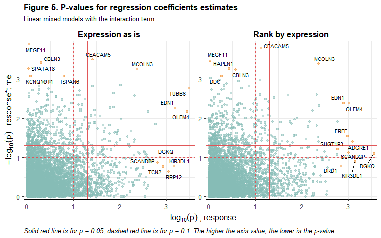<!-- -->

<br>

#### **Статистическая значимость vs. размер эффекта**

<br>

Следующим шагом в анализе результатов оценки линейных смешанных моделей будет **сопоставление статистической значимости среднего эффекта ответа на вакцинацию с размером этого эффекта**. 

Ниже представлен volcano plot для результатов оценки регрессий без эффектов пересечения, где по оси Y показано значение $-log_{10}$-преобразования p-value, а по оси X - оценка соответствующего коэффициента при переменной для ответа. Оранжевым выделим по 5 генов с p-value < 0.05 и самыми низкими и самыми высокими значениями оценки коэффициента.


```r
lmer_v_noint_plt <- lmer_res_long %>%
  filter(model == "noint") %>%
  group_by(expr, sig) %>%
  arrange(estimate) %>%
  mutate(sig_plot = row_number() %in% c(1:5, (n()-4):n())) %>%
  ungroup() %>%
  mutate(sig_plot = ifelse(!sig, FALSE, sig_plot))

ggplot(lmer_v_noint_plt, aes(x = estimate, y = logp)) +
  geom_point(aes(color = sig_plot), alpha = 0.5, show.legend = FALSE) +
  geom_hline(aes(yintercept = 1), linewidth = 0.7, color = "#E15759", linetype = "dashed") +
  geom_hline(aes(yintercept = critv), linewidth = 0.7, color = "#E15759") +
  geom_text_repel(aes(label = gene), lmer_v_noint_plt %>% filter(sig_plot), size = 3) +
  scale_x_continuous(expand = c(0.02, 0)) +
  scale_y_continuous(expand = c(0.01, 0)) +
  scale_color_manual(values = c("#86BCB6", "#F28E2B")) +
  facet_rep_wrap(~ expr, nrow = 2, ncol = 2, repeat.tick.labels = TRUE, scales = "free_x") +
  labs(x = bquote("ATE for response" ~ (hat(beta[2]))), y = bquote(-log[10](p[hat(beta[2])])), 
       title = "Figure 6. P-value vs. effect size for response",
       subtitle = "Linear mixed models without the interaction term",
       caption = "Solid red line is for p = 0.05, dashed red line is for p = 0.1.\nThe higher the Y axis value, the lower is the p-value.") +
  theme_classic(base_size = 12) +
  theme(legend.position = "bottom",
        panel.grid.major = element_line(linewidth = .2, color = '#ebebebFF'),
        panel.grid.minor = element_line(linewidth = .1, color = '#ebebebFF'),
        strip.background = element_blank(),
        strip.text.x = element_text(size = 12, color = "black", face = "bold"),
        plot.title = element_text(size = 13, face = "bold"),
        plot.subtitle = element_text(size = 10),
        plot.caption = element_text(size = 10, color = "black", face = "italic", hjust = 0))
```

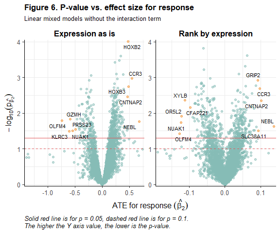<!-- -->

<br>

Аналогичные графики можно построить и для оценки **среднего эффекта ответа в отдельных точках исследования**, используя результаты для регрессий с эффектами пересечения. На каждом графике оранжевым выделим по 5 генов с p-value < 0.05 и самыми низкими и самыми высокими значениями оценки ATE.


```r
lmer_v_int_plt <- lmer_res_long %>%
  filter(grepl("ame", term)) %>%
  group_by(expr, time, sig) %>%
  arrange(estimate) %>%
  mutate(sig_plot = row_number() %in% c(1:5, (n()-4):n())) %>%
  ungroup() %>%
  mutate(sig_plot = ifelse(!sig, FALSE, sig_plot))

ggplot(lmer_v_int_plt, aes(x = estimate, y = logp)) +
  geom_point(aes(color = sig_plot), alpha = 0.5, show.legend = FALSE) +
  geom_hline(aes(yintercept = 1), linewidth = 0.7, color = "#E15759", linetype = "dashed") +
  geom_hline(aes(yintercept = critv), linewidth = 0.7, color = "red") +
  geom_text_repel(aes(label = gene), lmer_v_int_plt %>% filter(sig_plot), size = 3) +
  scale_x_continuous(expand = c(0.02, 0)) +
  scale_y_continuous(expand = c(0.02, 0)) +
  scale_color_manual(values = c("#86BCB6", "#F28E2B")) +
  facet_rep_grid(time ~ expr, repeat.tick.labels = TRUE, scales = "free", switch = "y") +
  labs(x = "ATE for response at the time point", y = bquote(-log[10](p[ATE])), 
       title = "Figure 7. P-value vs. effect size for response",
       subtitle = "Average marginal effects after linear mixed models with the interaction term",
       caption = "Solid red line is for p = 0.05, dashed red line is for p = 0.1.\nThe higher the Y axis value, the lower is the p-value.") +
  theme_classic(base_size = 12) +
  theme(legend.position = "bottom",
        panel.grid.major = element_line(linewidth = .2, color = '#ebebebFF'),
        panel.grid.minor = element_line(linewidth = .1, color = '#ebebebFF'),
        strip.background = element_blank(),
        strip.text = element_text(size = 12, color = "black", face = "bold"),
        strip.placement = "outside",
        plot.title = element_text(size = 13, face = "bold"),
        plot.subtitle = element_text(size = 10),
        plot.caption = element_text(size = 10, color = "black", face = "italic", hjust = 0))
```

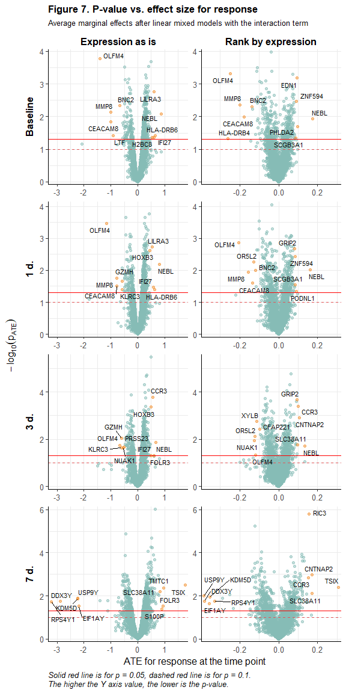<!-- -->

С одной стороны, визуально заметно некоторое "растягивание" точек вправо и влево к 7 дням от вакцинации, а с другой стороны, по отдельным генам, для которых разница в средней экспрессии до вакцинации между сильными и слабыми респондервами была наибольшей по абсолютной величине, заметно её уменьшение.


<br>

#### **Биологические процессы (GO)**

<br>

С помощью базы Gene Ontology посмотрим, в какие биологические процессы входят продукты генов, для которых ATE оказался статистически значимым и большим по абсолютной величине, при этом назовем upregulated гены, для которых ATE > 0.25 для исходных данных по экспрессии генов, downregulated - для которых ATE < -0.25. Результаты для регрессий с рангами по экспрессии здесь учитывать не будем. Покажем на графиках ниже по 8 процессов с наибольшим числом генов из числа отобранных таким образом в каждой точке исследования.


```r
gobp_time <- bind_rows(
  map_dfr(paste0("ame", timepoints),
          ~ bp_genesF(lmer_v_int_plt %>% filter(term == .x & sig & expr == "Expression as is" & estimate > 0.25)) %>%
            mutate(reg = "+", time = as.numeric(str_extract(.x, "\\d")))),
  map_dfr(paste0("ame", timepoints),
          ~ bp_genesF(lmer_v_int_plt %>% filter(term == .x & sig & expr == "Expression as is" & estimate < -0.25)) %>%
            mutate(reg = "-", time = as.numeric(str_extract(.x, "\\d"))))) %>%
  mutate(time = factor(time, timepoints, ifelse(timepoints == 0, "Baseline", paste(timepoints, "d."))))

# gobp_time$GOBPID <- kableExtra::cell_spec(gobp_time$GOBPID, "html", link = sprintf("http://amigo.geneontology.org/amigo/term/%s", gobp_time$GOBPID))

gobp_time_plot <- gobp_time %>%
  group_by(time, GOBPID) %>%
  summarise(term = unique(TERM), def = unique(def),
            n_up = n[reg == "+"], n_d = n[reg == "-"], n_sum = sum(n)) %>%
  group_by(time) %>%
  arrange(-n_sum) %>%
  filter(row_number() <= 8) %>%
  ungroup() %>%
  group_by(GOBPID) %>%
  mutate(n_sum = sum(n_sum)) %>%
  ungroup() %>%
  pivot_longer(cols = c(n_up, n_d), names_to = "reg", values_to = "n") %>%
  mutate(reg = factor(reg, c("n_up", "n_d"), c("Upregulated", "Downregulated")),
         term = fct_reorder(factor(str_wrap(term, 30)), n_sum))

ggplot() +
  geom_bar(aes(y = term, x = n, fill = reg), gobp_time_plot, 
           stat = "identity", position = "stack", width = 0.6) +
  geom_hline(aes(yintercept = y), data.frame(y = c(1:20) + 0.5), color = "grey50") +
  geom_vline(xintercept = 0) +
  facet_grid(~ time, scales = "fixed") +
  scale_x_continuous(expand = c(0,0)) +
  scale_fill_manual(values = c("#499894", "#EDC948")) +
  labs(y = element_blank(), fill = element_blank(),
       x = "Number of genes with big significant ATE",
       title = "Figure 8. Biological processes (GO), represented by the largest number of\ngenes with largest significant ATEs, by time",
       subtitle = "ATEs after linear mixed models") +
  theme_classic(base_size = 12) +
  theme(legend.position = "bottom",
        axis.ticks.y = element_blank(),
        panel.grid.major.x = element_line(linewidth = .2, color = '#ebebebFF'),
        panel.grid.minor.x = element_line(linewidth = .1, color = '#ebebebFF'),
        panel.grid.major.y = element_blank(),
        panel.grid.minor.y = element_blank(),
        strip.background = element_blank(),
        strip.text = element_text(size = 12, color = "black", face = "bold"),
        panel.spacing = unit(1, "lines"),
        plot.title = element_text(size = 13, face = "bold"),
        plot.title.position = "plot",
        plot.subtitle = element_text(size = 10))
```

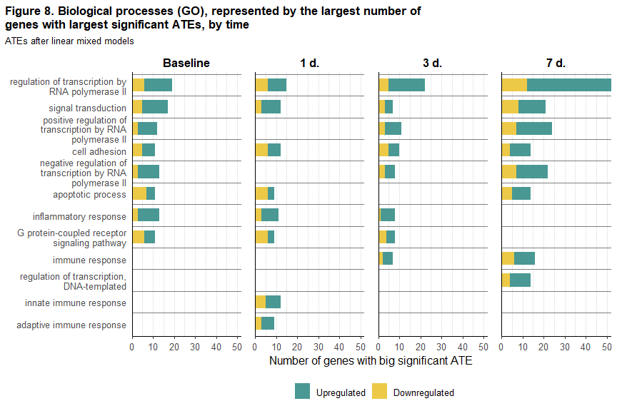<!-- -->

<br>

То же самое - для процессов, в названии которых есть слово "immune":


```r
gobp_time_plot <- gobp_time %>%
  filter(grepl("immune", TERM)) %>%
  group_by(time, GOBPID) %>%
  summarise(term = unique(TERM), def = unique(def),
            n_up = n[reg == "+"], n_d = n[reg == "-"], n_sum = sum(n)) %>%
  group_by(GOBPID) %>%
  mutate(n_sum = sum(n_sum)) %>%
  ungroup() %>%
  pivot_longer(cols = c(n_up, n_d), names_to = "reg", values_to = "n") %>%
  mutate(reg = factor(reg, c("n_up", "n_d"), c("Upregulated", "Downregulated")),
         term = fct_reorder(factor(str_wrap(term, 30)), n_sum)) %>%
  arrange(-n)

ggplot() +
  geom_bar(aes(y = term, x = n, fill = reg), gobp_time_plot, 
           stat = "identity", position = "stack", width = 0.6) +
  geom_hline(aes(yintercept = y), data.frame(y = c(1:20) + 0.5), color = "grey50") +
  geom_vline(xintercept = 0) +
  facet_grid(~ time, scales = "fixed") +
  scale_x_continuous(expand = c(0,0)) +
  scale_fill_manual(values = c("#499894", "#EDC948")) +
  labs(y = element_blank(), fill = element_blank(),
       x = "Number of genes with big significant ATE",
       title = "Figure 9. Immune-related biological processes (GO), represented by the largest number of\ngenes with largest significant ATEs, by time",
       subtitle = "ATEs after linear mixed models") +
  theme_classic(base_size = 12) +
  theme(legend.position = "bottom",
        axis.ticks.y = element_blank(),
        panel.grid.major.x = element_line(linewidth = .2, color = '#ebebebFF'),
        panel.grid.minor.x = element_line(linewidth = .1, color = '#ebebebFF'),
        panel.grid.major.y = element_blank(),
        panel.grid.minor.y = element_blank(),
        strip.background = element_blank(),
        strip.text = element_text(size = 12, color = "black", face = "bold"),
        panel.spacing = unit(1, "lines"),
        plot.title = element_text(size = 13, face = "bold"),
        plot.title.position = "plot",
        plot.subtitle = element_text(size = 10))
```

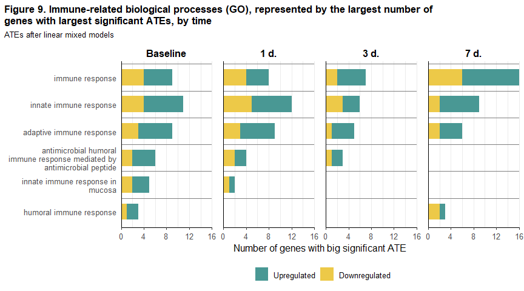<!-- -->

<br>

## **Взаимосвязь между вероятностью ответа и экспрессией генов: логистическая регрессия**

<br>


```r
df_expr_wide_fin <- df_expr_long_fin %>%
  mutate(expr_rank = expr_rank * 100,
         response = as.numeric(response) - 1) %>%
  pivot_wider(id_cols = c(gene, participant_id, response), 
              names_from = "time", values_from = c("expr", "expr_rank"))
```

### **Описание модели**

<br>

Для каждого гена из ранее отобранных 5 тыс. оценим логистическую регрессию вида:

$log(odds(response_{i})) = \gamma_0 + \gamma_1*expr_{0i} + \gamma_2*expr_{1i} + \gamma_3*expr_{3i} + \gamma_4*expr_{7i}$, где:

- $response_i$ - ответ на вакцинацию _i_-го испытумого (1 - high responder, 0 - low responder), 

- $expr_{ji}$ - экспрессия гена для _i_-го испытуемого в точке исследования _j_, $j=0,1,3,7$. Как и при оценке дифференциальной экспрессии, отдельно оценим спецификации с:

  - исходными данными по экспрессии, 

  - рангами генов по экспрессии, рассчитанными для каждого испытуемого в каждой точке исследования как квантиль эмпрической функции распределения экспрессий по всем генам для этого испытуемого в этой точке (в данном случае для удобства интерпретации - см. ниже - мы переведём ранги в шкалу от 0 до 100), 

- $\gamma_0$ - константа регрессионного уравнения,

- $\gamma_1,\gamma_2,\gamma_3,\gamma_4$ - коэффициенты регрессионного уравнения.

Результаты оценки логистических регрессий будем представлять в виде экспонированных значений коэффициентов, которые можно будет интерпретировать как количество раз, в которое изменится шанс сильного ответа на вакцинацию в случае увеличения экспрессии в соответствующей точке на 1, при прочих равных условиях. 


```r
# Оценка логистических регрессий

glm_q <- purrr::quietly(.f = glm)

logreg_fits <- df_expr_wide_fin %>%
  nest(-gene) %>%
  mutate(fit_init = map(data, ~ glm_q(response ~ expr_0 + expr_1 + expr_3 + expr_7, .x, family = "binomial")),
         fit_rank = map(data, ~ glm_q(response ~ expr_0 + expr_1 + expr_3 + expr_7, 
                                      .x %>% select(-matches("expr_\\d")) %>%
                                        rename_with(gsub, matches("expr_rank_\\d"), pattern = "_rank", replacement = ""), 
                                      family = "binomial")))

logreg_res <- logreg_fits %>%
  mutate(
    gamma_p_init = map(fit_init, ~ .x$result %>% broom.mixed::tidy(exp = TRUE)),
    gamma_p_rank = map(fit_rank, ~ .x$result %>% broom.mixed::tidy(exp = TRUE))) %>%
  select(-data, -contains("fit"))

# # Сохраним результаты в rds
# # saveRDS(logreg_res, "OlgaMironenko/res/logreg_res.rds")
# # logreg_res <- readRDS("OlgaMironenko/res/logreg_res.rds")
# # logreg_res <- readRDS(file.path("..", "OlgaMironenko", "res", "logreg_res.rds"))

# Exp.gammas and p-values

logreg_gammas <- full_join(
  logreg_res %>%
    select(gene, gamma_p_init) %>%
    unnest(gamma_p_init) %>%
    select(gene, term, estimate, p.value),
  logreg_res %>%
    select(gene, gamma_p_rank) %>%
    unnest(gamma_p_rank) %>%
    select(gene, term, estimate, p.value),
  by = c("gene", "term"), suffix = c("_init", "_rank"))

# Сохраним результаты в rds, чтобы при формировании отчёта не ждать оценки регрессий
saveRDS(logreg_gammas, "OlgaMironenko/res/logreg_gammas.rds")
```


```r
# logreg_gammas <- readRDS("OlgaMironenko/res/logreg_gammas.rds")
logreg_gammas <- readRDS(file.path("..", "OlgaMironenko", "res", "logreg_gammas.rds"))

critv <- -log10(0.05)

# Data frame for all exp.gammas and p-values for all LMMs

logreg_res_long <- logreg_gammas %>%
    filter(grepl("expr", term)) %>%
    transmute(gene, time = as.numeric(str_extract(term, "\\d")),
              estimate_init, estimate_rank, p.value_init, p.value_rank) %>%
    pivot_longer(cols = -c(gene, time), 
                 names_pattern = "(estimate|p.value)_(.+)$",
                 names_to = c(".value", "expr")) %>%
  mutate(logp = -log10(p.value),
         sig = logp > critv,
         model_var = sprintf("log_%s_%s", expr, time),
         expr = factor(expr, c("init", "rank"), c("Expression as is", "Rank by expression")),
         time = factor(time, timepoints, labels = ifelse(timepoints == 0, "Baseline", paste(timepoints, "d."))))

# Significant genes

genes_sig_logreg <- map(
  logreg_res_long %>%
    filter(sig) %>%
    split(f = as.factor(.$model_var)),
  ~ .x %>% pull(gene))

models_logreg <- names(genes_sig_logreg)
models_logreg_num <- as.numeric(str_extract(models_logreg, "\\d+"))

genes_sig_logreg_lbls <- sprintf("%s, sig.OR (%s)",
                                 ifelse(grepl("init", models_logreg), "Expr.", "Ranks"),
                                 ifelse(models_logreg_num == 0, "Baseline",
                                        sprintf("%d d.", models_logreg_num))) %>%
  as.list() %>% setNames(models_logreg)
```

<br>

### **Результаты оценки**

<br>

#### **Наборы значимых генов в разных точках**

<br>

Ниже на графиках покажем, насколько пересекаются наборы генов-находок, выявленных по статистической значимости коэффициентов при переменных для экспрессии в разных точках исследования в логистических регрессиях.


```r
# Whether each gene was significant in any model
genes_maxvar <- cbind(
  genes_maxvar,
  map_dfc(genes_sig_logreg, ~ genes_maxvar$gene %in% .x))

upset_plt_df_1 <- genes_maxvar %>%
  select(contains("log_init")) %>%
  filter(if_any(everything(), ~.)) %>%
  setNames(genes_sig_logreg_lbls[names(.)])

upset_plot(upset_plt_df_1, rev(colnames(upset_plt_df_1)), 
           rep("#F1CE63", 4),
           "Figure 10(1). Intersection of gene sets with significant ORs,\nExpression as is",
           "Logistic regressions for the (strong) response", TRUE, -0.8)
```

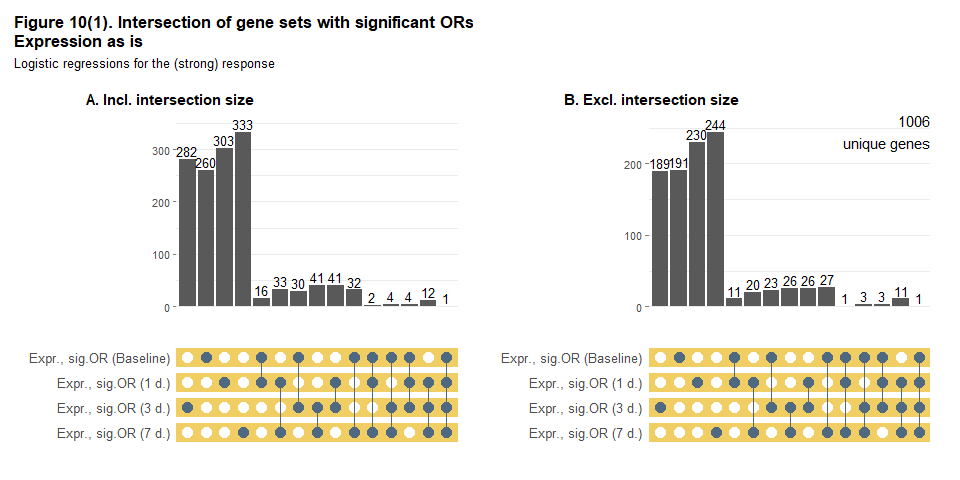<!-- -->

```r
upset_plt_df_2 <- genes_maxvar %>%
  select(contains("log_rank")) %>%
  filter(if_any(everything(), ~.)) %>%
  setNames(genes_sig_logreg_lbls[names(.)])

upset_plot(upset_plt_df_2, rev(colnames(upset_plt_df_2)), 
           rep("#A0CBE8", 4),
           "Figure 10(2). Intersection of gene sets with significant ORs,\nRanks by expression",
           "Logistic regressions for the (strong) response", TRUE, -0.8)
```

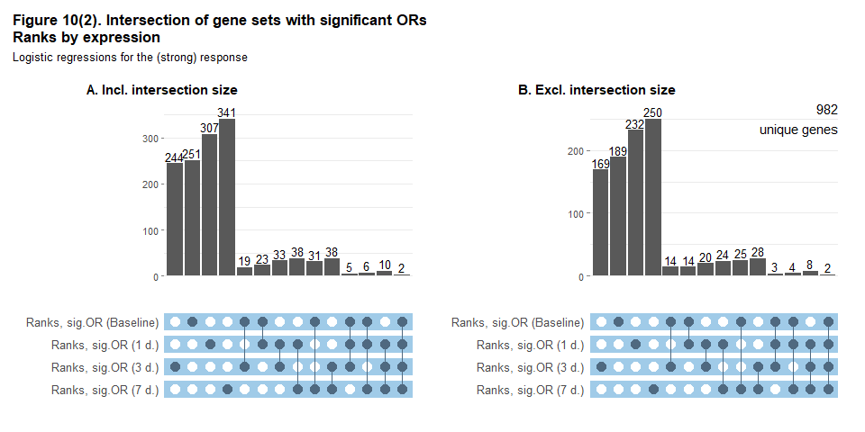<!-- -->

Также может быть интересно сопоставить для каждой точки исследования набор генов со значимым средним эффектом ответа на экспрессию с набором генов со значимым отношением шансов ответа при увеличении экспрессии гена на 1 - результаты на графиках ниже:


```r
upset_plt_df_1 <- genes_maxvar %>%
  select(init_int_ame0, log_init_0) %>%
  filter(if_any(everything(), ~.)) %>%
  setNames(c(genes_sig_lbls, genes_sig_logreg_lbls)[names(.)])

p1 <- upset_plot(upset_plt_df_1, rev(colnames(upset_plt_df_1)), 
                 rep("#F1CE63", 2),
                 element_blank(), "Expression as is", TRUE, 0.4)

upset_plt_df_2 <- genes_maxvar %>%
  select(rank_int_ame0, log_rank_0) %>%
  filter(if_any(everything(), ~.)) %>%
  setNames(c(genes_sig_lbls, genes_sig_logreg_lbls)[names(.)])

p2 <- upset_plot(upset_plt_df_2, rev(colnames(upset_plt_df_2)), 
                 rep("#A0CBE8", 2),
                 element_blank(), "Ranks by expression", TRUE, 0.4, 2)

p12 <- ggarrange(p1, p2, nrow = 2)
annotate_figure(p12, top = text_grob("Figure 11(1). Intersection of gene sets with significant ATEs and ORs, Baseline",
                                     face = "bold", size = 12, hjust = 0.5))
```

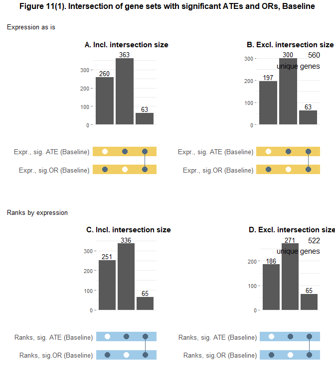<!-- -->

```r
upset_plt_df_1 <- genes_maxvar %>%
  select(init_int_ame1, log_init_1) %>%
  filter(if_any(everything(), ~.)) %>%
  setNames(c(genes_sig_lbls, genes_sig_logreg_lbls)[names(.)])

p1 <- upset_plot(upset_plt_df_1, rev(colnames(upset_plt_df_1)), 
                 rep("#F1CE63", 2),
                 element_blank(), "Expression as is", TRUE, 0.2)

upset_plt_df_2 <- genes_maxvar %>%
  select(rank_int_ame1, log_rank_1) %>%
  filter(if_any(everything(), ~.)) %>%
  setNames(c(genes_sig_lbls, genes_sig_logreg_lbls)[names(.)])

p2 <- upset_plot(upset_plt_df_2, rev(colnames(upset_plt_df_2)), 
                 rep("#A0CBE8", 2),
                 element_blank(), "Ranks by expression", TRUE, 0.2, 2)

p12 <- ggarrange(p1, p2, nrow = 2)
annotate_figure(p12, top = text_grob("Figure 11(2). Intersection of gene sets with significant ATEs and ORs, 1 day",
                                     face = "bold", size = 12, hjust = 0.5))
```

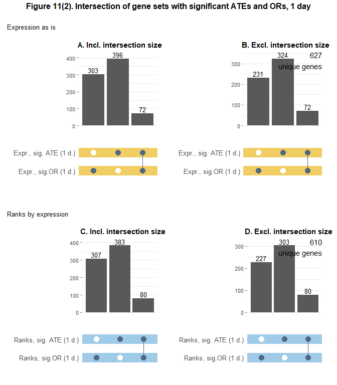<!-- -->

```r
upset_plt_df_1 <- genes_maxvar %>%
  select(init_int_ame3, log_init_3) %>%
  filter(if_any(everything(), ~.)) %>%
  setNames(c(genes_sig_lbls, genes_sig_logreg_lbls)[names(.)])

p1 <- upset_plot(upset_plt_df_1, rev(colnames(upset_plt_df_1)), 
                 rep("#F1CE63", 2),
                 element_blank(), "Expression as is", TRUE, 0.2)

upset_plt_df_2 <- genes_maxvar %>%
  select(rank_int_ame3, log_rank_3) %>%
  filter(if_any(everything(), ~.)) %>%
  setNames(c(genes_sig_lbls, genes_sig_logreg_lbls)[names(.)])

p2 <- upset_plot(upset_plt_df_2, rev(colnames(upset_plt_df_2)), 
                 rep("#A0CBE8", 2),
                 element_blank(), "Ranks by expression", TRUE, 0.2, 2)

p12 <- ggarrange(p1, p2, nrow = 2)
annotate_figure(p12, top = text_grob("Figure 11(3). Intersection of gene sets with significant ATEs and ORs, 3 days",
                                     face = "bold", size = 12, hjust = 0.5))
```

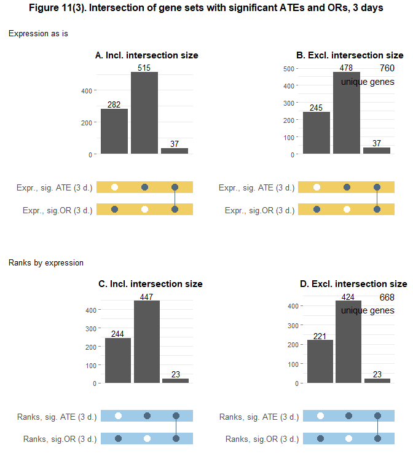<!-- -->

```r
upset_plt_df_1 <- genes_maxvar %>%
  select(init_int_ame7, log_init_7) %>%
  filter(if_any(everything(), ~.)) %>%
  setNames(c(genes_sig_lbls, genes_sig_logreg_lbls)[names(.)])

p1 <- upset_plot(upset_plt_df_1, rev(colnames(upset_plt_df_1)), 
                 rep("#F1CE63", 2),
                 element_blank(), "Expression as is", TRUE, 0.2)

upset_plt_df_2 <- genes_maxvar %>%
  select(rank_int_ame7, log_rank_7) %>%
  filter(if_any(everything(), ~.)) %>%
  setNames(c(genes_sig_lbls, genes_sig_logreg_lbls)[names(.)])

p2 <- upset_plot(upset_plt_df_2, rev(colnames(upset_plt_df_2)), 
                 rep("#A0CBE8", 2),
                 element_blank(), "Ranks by expression", TRUE, 0.2, 2)

p12 <- ggarrange(p1, p2, nrow = 2)
annotate_figure(p12, top = text_grob("Figure 11(4). Intersection of gene sets with significant ATEs and ORs, 7 days",
                                     face = "bold", size = 12, hjust = 0.5))
```

<!-- -->

Видим, что наборы, найденные с помощью двух разных подходов, относительно слабо пересекаются друг с другом до вакцинации и в 1-3 дня после неё - и только в 7 дней пересечение становится заметным.

<br>

#### **Статистическая значимость vs. размер эффекта**

<br>

Размер эффекта экспрессии гена в отношении вероятности сильного ответа на вакцинацию можно оценить с помощью отношения шансов (экспонированного значения коэффициента логистической регрессии при переменной для экспрессии в соответствующей точке исследования).

Ниже на volcano plot сопоставим статистическую значимость эффекта с его размером, для чего по оси Y покажем значение $-log_{10}$-преобразования p-value, а по оси X $log_{10}$ оценки отношения шансов сильного ответа при увеличении соответствующей переменной для экспрессии на 1 (для удобства отображения заменим $log_{10}$ отношения шансов в регрессиях с исходными данными по экспрессии за пределами интервала [-10, 10] на ближайшую из границ этого интервала, в регрессиях для рангов по экспрессии сделаем то же самое по интервалу [-4, 4] - на графиках видно, что все гены, на отображение которых это повлияло, имели статистически незначимые коэффициенты при соответствующих переменных). Оранжевым выделим по 5 генов с p-value < 0.05 и самыми низкими и самыми высокими значениями отношений шансов.


```r
logreg_v_plt <- logreg_res_long %>%
  mutate(estimate = log10(estimate),
         estimate = ifelse(expr == "Expression as is",
                           ifelse(estimate < -10, -10, 
                                  ifelse(estimate > 10, 10, estimate)),
                           ifelse(estimate < -4, -4, 
                                  ifelse(estimate > 4, 4, estimate)))) %>%
  group_by(expr, time, sig) %>%
  arrange(estimate) %>%
  mutate(sig_plot = row_number() %in% c(1:5, (n()-4):n())) %>%
  ungroup() %>%
  mutate(sig_plot = ifelse(!sig, FALSE, sig_plot))

ggplot(logreg_v_plt, aes(x = estimate, y = logp)) +
  geom_point(aes(color = sig_plot), alpha = 0.5, show.legend = FALSE) +
  geom_hline(aes(yintercept = 1), linewidth = 0.7, color = "#E15759", linetype = "dashed") +
  geom_hline(aes(yintercept = critv), linewidth = 0.7, color = "red") +
  geom_text_repel(aes(label = gene), logreg_v_plt %>% filter(sig_plot), size = 3) +
  scale_x_continuous(expand = c(0.02, 0)) +
  scale_y_continuous(expand = c(0.02, 0)) +
  scale_color_manual(values = c("#86BCB6", "#F28E2B")) +
  facet_rep_grid(time ~ expr, repeat.tick.labels = TRUE, scales = "free", switch = "y") +
  labs(x = bquote(log[10](OR)), y = bquote(-log[10](p[OR])), 
       title = "Figure 12. P-value vs. size of gene expression's effect on response",
       subtitle = bquote(log[10]~"odds ratios after logistic regressions for the (strong) response"),
       caption = "Solid red line is for p = 0.05, dashed red line is for p = 0.1.\nThe higher the Y axis value, the lower is the p-value.") +
  theme_classic(base_size = 12) +
  theme(legend.position = "bottom",
        panel.grid.major = element_line(linewidth = .2, color = '#ebebebFF'),
        panel.grid.minor = element_line(linewidth = .1, color = '#ebebebFF'),
        strip.background = element_blank(),
        strip.text = element_text(size = 12, color = "black", face = "bold"),
        strip.placement = "outside",
        plot.title = element_text(size = 13, face = "bold"),
        plot.subtitle = element_text(size = 10),
        plot.caption = element_text(size = 10, color = "black", face = "italic", hjust = 0))
```

<!-- -->

<br>

## **Функциональный анализ**

<br>

Выше мы уже использовали базу Gene Ontology (GO) для определения аннотаций биологических процессов, в которых участвуют белковые продукты генов, дифференциально экспрессированных у испытуемых с разным уровнем ответа на вакцинацию. Однако поскольку генов-находок может быть много, искать подобные аннотации по каждому из них не только не слишком удобно, но не совсем правильно, поскольку продукты разных генов могут участвовать в одних и тех же процессах, как и продукты одного и того же гена могут участвовать в разных. Методы, используемые в рамках **[singular enrichment анализа (SEA)](https://humgenomics.biomedcentral.com/articles/10.1186/1479-7364-4-3-202)**, позволяют определить, какие именно биологические процессы "перепредставлены" (overrepresented) в найденном наборе из $n$ генов по сравнению с полным набором $N$ генов, отобранных нами для анализа (в нашем случае 5 тыс.). 

В своём исследовании мы будем выявлять такие процессы, основываясь на оценке p-values гипергеометрического распределения, т.е. вероятностей получить в выборке из $n$ генов такую же или бОльшую представленность данного процесса, как в полном наборе из $N$ генов. Рассчитать p-value можно по [формуле](https://academic.oup.com/bioinformatics/article/20/18/3710/202612): $$P=1-\sum_{i=0}^{k-1}\frac{C_M^i C_{N-M}^{n-i}}{C_N^i}$$
где $C_M^i$ - число сочетаний из $M$ по $i$, $N$ - общее количество генов, отобранных нами для анализа (5 тыс.), $M$ - кол-во генов из числа $N$ с определённым биологическим процессом в аннотации, $n$ - кол-во "значимых" генов, обнаруженных на этапе оценки дифференциальной экспрессии, $k$ - кол-во генов из числа $n$ с определённым биологическим процессом в аннотации. 

В R для этого будем использовать функцию `hyperGtest` из пакета `Category` с опцией `conditional = TRUE` (эта опция означает, что при тестировании родительских "узлов" биологических процессов будут исключаться те "потомки", для которых p-value уже оказался ниже порогового уровня значимости; в качестве такого порога будем использовать значение 0.05). Данная функция - это аналог такой же функции из пакета `GOstats`, позволяющий дополнительно вводить ограничения на минимальный и максимальный размеры наборов генов, участвующих в оценке условного гипергеометрического теста (возьмём 10 и 500, соответственно). 

После оценки гипергеометрического теста исключим выявленные в нём биологические процессы, в которых вошло менее 5 генов из числа значимых - далее будем работать с p-values по оставшимся процессам.

Для контроля FDR мы попробуем использовать два подхода: коррекцию p-values, полученных по всем выявленным биологическим процессам, с помощью метода Бенджамина-Хохберга и оценку [q-values](https://www.ncbi.nlm.nih.gov/pmc/articles/PMC170937/).

SEA будем проводить отдельно для каждого набора значимых генов, выявленных нами по результатам оценки различных линейных смешанных моделей и логистических регрессий.


```r
library(org.Hs.eg.db)
library(GOstats)

# org.Hs.eg.db - Genome wide annotation for Human
# EntrezID for genes (exclude those with NA)

genes_universe <- genes_maxvar %>%
  left_join(AnnotationDbi::select(org.Hs.eg.db::org.Hs.eg.db, genes_maxvar$gene, "ENTREZID", "SYMBOL") %>%
              distinct(SYMBOL, .keep_all = TRUE),
            by = c("gene" = "SYMBOL")) %>%
  filter(!is.na(ENTREZID))

# Conditional hypergeometric test for each set of significant genes
# https://biocorecrg.github.io/PHINDaccess_RNAseq_2020/functional_analysis.html

hg_res <- map(
  genes_universe %>% select(dplyr::starts_with("init"), dplyr::starts_with("rank"), dplyr::starts_with("log")),
  function(x) {
    hg_params <- new(getClassDef("GOHyperGParams", package = "Category"),
                     geneIds = genes_universe$ENTREZID[x],
                     universeGeneIds = genes_universe$ENTREZID,
                     annotation = "org.Hs.eg",
                     ontology = "BP",
                     pvalueCutoff = 0.05,
                     conditional = TRUE,
                     minSizeCutoff = 10, maxSizeCutoff = 500,
                     testDirection = "over")
    Category::hyperGTest(hg_params)
  })

# # Saving results into rds (in case of necessity, without sending to github)
# saveRDS(hg_res, "OlgaMironenko/res/hg_res.rds")
# 
# # hg_res <- readRDS("OlgaMironenko/res/hg_res.rds")
# hg_res <- readRDS(file.path("..", "OlgaMironenko", "res", "hg_res.rds"))

ann_select_q <- purrr::quietly(.f = AnnotationDbi::select)

# Genes in significant BPs

hg_res_sig_genes <- imap(
  hg_res, 
  function(x, y) {
    imap_dfr(Category::geneIdsByCategory(x, summary(x)$GOBPID),
             ~ ann_select_q(org.Hs.eg.db::org.Hs.eg.db, .x, "SYMBOL", "ENTREZID") %>%
               .$result %>% 
               left_join(lmer_res_long %>% filter(model_var == y),
                         by = c("SYMBOL" = "gene")) %>%
               transmute(GOID = .y, genes = paste(SYMBOL, collapse = "/"),
                         up = sum(estimate > 0), down = sum(estimate <= 0)) %>%
               unique())
  })

# Results for hypergeom.test for each model

hg_res_pq <- imap(
  hg_res,
  ~ cbind(pvalue = Category::pvalues(.x),
          Count = Category::geneCounts(.x))%>%
    as_tibble(rownames = "GOID") %>%
    filter(Count > 4) %>%
    # adjusting p-values and calculate qvalues
    mutate(GeneRatio = Count/length(Category::geneIds(.x)),
           p.adjust = p.adjust(pvalue, method = "BH"),
           qvalue = qvalue(pvalue) %>% .$qvalues) %>%
    # joining BP terms and definitions
    left_join(
      AnnotationDbi::select(GO.db::GO.db, .$GOID, c("TERM", "DEFINITION"), keytype = "GOID"),
      by = "GOID") %>%
    # joining genes for significant BPs
    left_join(
      hg_res_sig_genes[[.y]], by = "GOID"))

# Saving the main results into rds for not waiting for results while knitting
saveRDS(hg_res_pq, "OlgaMironenko/res/hg_res_pq.rds")
```


Ниже для каждого набора значимых генов, выявленного нами по результатам оценки линейных смешанных моделей и логистических регрессий, покажем количество "перепредставленных" этим набором биологических процессов при разных пороговых значениях для скорректированных p-values и для q-values (пустая ячейка означает отсутствие процессов, удовлетворяющих соответствующему критерию).


```r
# hg_res_pq <- readRDS("OlgaMironenko/res/hg_res_pq.rds")
hg_res_pq <- readRDS(file.path("..", "OlgaMironenko", "res", "hg_res_pq.rds"))

imap_dfr(
  hg_res_pq, 
  ~ tibble(model = c(genes_sig_lbls, genes_sig_logreg_lbls)[[.y]],
           p01 = sum(.x$p.adjust < 0.1),
           p005 = sum(.x$p.adjust < 0.05),
           p001 = sum(.x$p.adjust < 0.01),
           p0001 = sum(.x$p.adjust < 0.001),
           q01 = sum(.x$qvalue < 0.1),
           q005 = sum(.x$qvalue < 0.05),
           q001 = sum(.x$qvalue < 0.01),
           q0001 = sum(.x$qvalue < 0.001))) %>%
  mutate_if(is.numeric, ~ ifelse(. == 0, NA, .)) %>%
  kable(align = "lcccccccc",
        col.names = c("Gene set source", rep(paste("< ", c(0.1,0.05,0.01,0.001)), 2)),
        caption = "<b>Table 5. Number of significant biological processes (GO) found in hypergeometric tests</b>") %>%
  kableExtra::add_header_above(c(" " = 1, "Adjusted p-value" = 4, "q-value" = 4)) %>% 
  kableExtra::row_spec(0, bold = TRUE) %>%
  kableExtra::kable_classic(full_width = FALSE, position = "left", font_size = 14,
                            html_font = "\"Source Sans Pro\", helvetica, sans-serif")
```

<table class=" lightable-classic" style='font-size: 14px; font-family: "Source Sans Pro", helvetica, sans-serif; width: auto !important; '>
<caption style="font-size: initial !important;"><b>Table 5. Number of significant biological processes (GO) found in hypergeometric tests</b></caption>
 <thead>
<tr>
<th style="empty-cells: hide;border-bottom:hidden;" colspan="1"></th>
<th style="border-bottom:hidden;padding-bottom:0; padding-left:3px;padding-right:3px;text-align: center; " colspan="4"><div style="border-bottom: 1px solid #ddd; padding-bottom: 5px; ">Adjusted p-value</div></th>
<th style="border-bottom:hidden;padding-bottom:0; padding-left:3px;padding-right:3px;text-align: center; " colspan="4"><div style="border-bottom: 1px solid #ddd; padding-bottom: 5px; ">q-value</div></th>
</tr>
  <tr>
   <th style="text-align:left;font-weight: bold;"> Gene set source </th>
   <th style="text-align:center;font-weight: bold;"> &lt;  0.1 </th>
   <th style="text-align:center;font-weight: bold;"> &lt;  0.05 </th>
   <th style="text-align:center;font-weight: bold;"> &lt;  0.01 </th>
   <th style="text-align:center;font-weight: bold;"> &lt;  0.001 </th>
   <th style="text-align:center;font-weight: bold;"> &lt;  0.1 </th>
   <th style="text-align:center;font-weight: bold;"> &lt;  0.05 </th>
   <th style="text-align:center;font-weight: bold;"> &lt;  0.01 </th>
   <th style="text-align:center;font-weight: bold;"> &lt;  0.001 </th>
  </tr>
 </thead>
<tbody>
  <tr>
   <td style="text-align:left;"> Expr., sig. b2 (Baseline) </td>
   <td style="text-align:center;"> 8 </td>
   <td style="text-align:center;">  </td>
   <td style="text-align:center;">  </td>
   <td style="text-align:center;">  </td>
   <td style="text-align:center;"> 20 </td>
   <td style="text-align:center;"> 12 </td>
   <td style="text-align:center;">  </td>
   <td style="text-align:center;">  </td>
  </tr>
  <tr>
   <td style="text-align:left;"> Expr., sig. b3 (Change) </td>
   <td style="text-align:center;">  </td>
   <td style="text-align:center;">  </td>
   <td style="text-align:center;">  </td>
   <td style="text-align:center;">  </td>
   <td style="text-align:center;">  </td>
   <td style="text-align:center;">  </td>
   <td style="text-align:center;">  </td>
   <td style="text-align:center;">  </td>
  </tr>
  <tr>
   <td style="text-align:left;"> Expr., sig. b2 (Overall) </td>
   <td style="text-align:center;"> 1 </td>
   <td style="text-align:center;">  </td>
   <td style="text-align:center;">  </td>
   <td style="text-align:center;">  </td>
   <td style="text-align:center;"> 1 </td>
   <td style="text-align:center;">  </td>
   <td style="text-align:center;">  </td>
   <td style="text-align:center;">  </td>
  </tr>
  <tr>
   <td style="text-align:left;"> Expr., sig. ATE (Baseline) </td>
   <td style="text-align:center;"> 3 </td>
   <td style="text-align:center;">  </td>
   <td style="text-align:center;">  </td>
   <td style="text-align:center;">  </td>
   <td style="text-align:center;"> 10 </td>
   <td style="text-align:center;"> 4 </td>
   <td style="text-align:center;">  </td>
   <td style="text-align:center;">  </td>
  </tr>
  <tr>
   <td style="text-align:left;"> Expr., sig. ATE (1 d.) </td>
   <td style="text-align:center;">  </td>
   <td style="text-align:center;">  </td>
   <td style="text-align:center;">  </td>
   <td style="text-align:center;">  </td>
   <td style="text-align:center;"> 2 </td>
   <td style="text-align:center;">  </td>
   <td style="text-align:center;">  </td>
   <td style="text-align:center;">  </td>
  </tr>
  <tr>
   <td style="text-align:left;"> Expr., sig. ATE (3 d.) </td>
   <td style="text-align:center;">  </td>
   <td style="text-align:center;">  </td>
   <td style="text-align:center;">  </td>
   <td style="text-align:center;">  </td>
   <td style="text-align:center;">  </td>
   <td style="text-align:center;">  </td>
   <td style="text-align:center;">  </td>
   <td style="text-align:center;">  </td>
  </tr>
  <tr>
   <td style="text-align:left;"> Expr., sig. ATE (7 d.) </td>
   <td style="text-align:center;">  </td>
   <td style="text-align:center;">  </td>
   <td style="text-align:center;">  </td>
   <td style="text-align:center;">  </td>
   <td style="text-align:center;">  </td>
   <td style="text-align:center;">  </td>
   <td style="text-align:center;">  </td>
   <td style="text-align:center;">  </td>
  </tr>
  <tr>
   <td style="text-align:left;"> Ranks, sig. b2 (Baseline) </td>
   <td style="text-align:center;"> 6 </td>
   <td style="text-align:center;"> 2 </td>
   <td style="text-align:center;"> 2 </td>
   <td style="text-align:center;">  </td>
   <td style="text-align:center;"> 55 </td>
   <td style="text-align:center;"> 7 </td>
   <td style="text-align:center;"> 2 </td>
   <td style="text-align:center;">  </td>
  </tr>
  <tr>
   <td style="text-align:left;"> Ranks, sig. b3 (Change) </td>
   <td style="text-align:center;">  </td>
   <td style="text-align:center;">  </td>
   <td style="text-align:center;">  </td>
   <td style="text-align:center;">  </td>
   <td style="text-align:center;">  </td>
   <td style="text-align:center;">  </td>
   <td style="text-align:center;">  </td>
   <td style="text-align:center;">  </td>
  </tr>
  <tr>
   <td style="text-align:left;"> Ranks, sig. b2 (Overall) </td>
   <td style="text-align:center;">  </td>
   <td style="text-align:center;">  </td>
   <td style="text-align:center;">  </td>
   <td style="text-align:center;">  </td>
   <td style="text-align:center;">  </td>
   <td style="text-align:center;">  </td>
   <td style="text-align:center;">  </td>
   <td style="text-align:center;">  </td>
  </tr>
  <tr>
   <td style="text-align:left;"> Ranks, sig. ATE (Baseline) </td>
   <td style="text-align:center;"> 3 </td>
   <td style="text-align:center;"> 2 </td>
   <td style="text-align:center;"> 1 </td>
   <td style="text-align:center;">  </td>
   <td style="text-align:center;"> 39 </td>
   <td style="text-align:center;"> 8 </td>
   <td style="text-align:center;"> 2 </td>
   <td style="text-align:center;">  </td>
  </tr>
  <tr>
   <td style="text-align:left;"> Ranks, sig. ATE (1 d.) </td>
   <td style="text-align:center;"> 10 </td>
   <td style="text-align:center;"> 8 </td>
   <td style="text-align:center;">  </td>
   <td style="text-align:center;">  </td>
   <td style="text-align:center;"> 38 </td>
   <td style="text-align:center;"> 10 </td>
   <td style="text-align:center;"> 1 </td>
   <td style="text-align:center;">  </td>
  </tr>
  <tr>
   <td style="text-align:left;"> Ranks, sig. ATE (3 d.) </td>
   <td style="text-align:center;">  </td>
   <td style="text-align:center;">  </td>
   <td style="text-align:center;">  </td>
   <td style="text-align:center;">  </td>
   <td style="text-align:center;">  </td>
   <td style="text-align:center;">  </td>
   <td style="text-align:center;">  </td>
   <td style="text-align:center;">  </td>
  </tr>
  <tr>
   <td style="text-align:left;"> Ranks, sig. ATE (7 d.) </td>
   <td style="text-align:center;">  </td>
   <td style="text-align:center;">  </td>
   <td style="text-align:center;">  </td>
   <td style="text-align:center;">  </td>
   <td style="text-align:center;">  </td>
   <td style="text-align:center;">  </td>
   <td style="text-align:center;">  </td>
   <td style="text-align:center;">  </td>
  </tr>
  <tr>
   <td style="text-align:left;"> Expr., sig.OR (Baseline) </td>
   <td style="text-align:center;">  </td>
   <td style="text-align:center;">  </td>
   <td style="text-align:center;">  </td>
   <td style="text-align:center;">  </td>
   <td style="text-align:center;"> 18 </td>
   <td style="text-align:center;">  </td>
   <td style="text-align:center;">  </td>
   <td style="text-align:center;">  </td>
  </tr>
  <tr>
   <td style="text-align:left;"> Expr., sig.OR (1 d.) </td>
   <td style="text-align:center;">  </td>
   <td style="text-align:center;">  </td>
   <td style="text-align:center;">  </td>
   <td style="text-align:center;">  </td>
   <td style="text-align:center;"> 136 </td>
   <td style="text-align:center;"> 21 </td>
   <td style="text-align:center;">  </td>
   <td style="text-align:center;">  </td>
  </tr>
  <tr>
   <td style="text-align:left;"> Expr., sig.OR (3 d.) </td>
   <td style="text-align:center;">  </td>
   <td style="text-align:center;">  </td>
   <td style="text-align:center;">  </td>
   <td style="text-align:center;">  </td>
   <td style="text-align:center;">  </td>
   <td style="text-align:center;">  </td>
   <td style="text-align:center;">  </td>
   <td style="text-align:center;">  </td>
  </tr>
  <tr>
   <td style="text-align:left;"> Expr., sig.OR (7 d.) </td>
   <td style="text-align:center;"> 2 </td>
   <td style="text-align:center;">  </td>
   <td style="text-align:center;">  </td>
   <td style="text-align:center;">  </td>
   <td style="text-align:center;"> 2 </td>
   <td style="text-align:center;">  </td>
   <td style="text-align:center;">  </td>
   <td style="text-align:center;">  </td>
  </tr>
  <tr>
   <td style="text-align:left;"> Ranks, sig.OR (Baseline) </td>
   <td style="text-align:center;">  </td>
   <td style="text-align:center;">  </td>
   <td style="text-align:center;">  </td>
   <td style="text-align:center;">  </td>
   <td style="text-align:center;">  </td>
   <td style="text-align:center;">  </td>
   <td style="text-align:center;">  </td>
   <td style="text-align:center;">  </td>
  </tr>
  <tr>
   <td style="text-align:left;"> Ranks, sig.OR (1 d.) </td>
   <td style="text-align:center;">  </td>
   <td style="text-align:center;">  </td>
   <td style="text-align:center;">  </td>
   <td style="text-align:center;">  </td>
   <td style="text-align:center;">  </td>
   <td style="text-align:center;">  </td>
   <td style="text-align:center;">  </td>
   <td style="text-align:center;">  </td>
  </tr>
  <tr>
   <td style="text-align:left;"> Ranks, sig.OR (3 d.) </td>
   <td style="text-align:center;">  </td>
   <td style="text-align:center;">  </td>
   <td style="text-align:center;">  </td>
   <td style="text-align:center;">  </td>
   <td style="text-align:center;">  </td>
   <td style="text-align:center;">  </td>
   <td style="text-align:center;">  </td>
   <td style="text-align:center;">  </td>
  </tr>
  <tr>
   <td style="text-align:left;"> Ranks, sig.OR (7 d.) </td>
   <td style="text-align:center;">  </td>
   <td style="text-align:center;">  </td>
   <td style="text-align:center;">  </td>
   <td style="text-align:center;">  </td>
   <td style="text-align:center;">  </td>
   <td style="text-align:center;">  </td>
   <td style="text-align:center;">  </td>
   <td style="text-align:center;">  </td>
  </tr>
</tbody>
</table>

Видим, что, в основном, перепредставленные процессы обнаруживаются до вакцинации или в 1 день после неё.

В таблице ниже перечислим все процессы с q-value < 0.05, сгруппировав их по точкам, в которых они были перепредставлены по результатам хотя бы одной модели.


```r
imap_dfr(
  hg_res_pq,
  ~ .x %>% filter(qvalue < 0.05) %>% 
    transmute(model = c(genes_sig_lbls, genes_sig_logreg_lbls)[[.y]], 
              GOID, TERM, DEFINITION, Count, up, down, genes)) %>%
  mutate(time = str_remove_all(str_extract(model, "\\(.+\\)"), "[\\(\\)]")) %>%
  transmute(time, GOID, TERM, DEFINITION) %>%
  unique() %>%
  arrange(time, GOID) %>%
  kable(align = "lcll",
        col.names = c("Time", "GOBPID", "BP (GO term)", "Definition (GO)"),
        caption = "<b>Table 6. Overrepresented BPs, by time</b>") %>%
  kableExtra::row_spec(0, bold = TRUE) %>%
  kableExtra::column_spec(1:4, extra_css = "vertical-align:top;") %>%
  kableExtra::kable_classic(full_width = FALSE, position = "left", font_size = 14,
                            html_font = "\"Source Sans Pro\", helvetica, sans-serif")
```

<table class=" lightable-classic" style='font-size: 14px; font-family: "Source Sans Pro", helvetica, sans-serif; width: auto !important; '>
<caption style="font-size: initial !important;"><b>Table 6. Overrepresented BPs, by time</b></caption>
 <thead>
  <tr>
   <th style="text-align:left;font-weight: bold;"> Time </th>
   <th style="text-align:center;font-weight: bold;"> GOBPID </th>
   <th style="text-align:left;font-weight: bold;"> BP (GO term) </th>
   <th style="text-align:left;font-weight: bold;"> Definition (GO) </th>
  </tr>
 </thead>
<tbody>
  <tr>
   <td style="text-align:left;vertical-align:top;"> 1 d. </td>
   <td style="text-align:center;vertical-align:top;"> GO:0003416 </td>
   <td style="text-align:left;vertical-align:top;"> endochondral bone growth </td>
   <td style="text-align:left;vertical-align:top;"> The increase in size or mass of an endochondral bone that contributes to the shaping of the bone. </td>
  </tr>
  <tr>
   <td style="text-align:left;vertical-align:top;"> 1 d. </td>
   <td style="text-align:center;vertical-align:top;"> GO:0006636 </td>
   <td style="text-align:left;vertical-align:top;"> unsaturated fatty acid biosynthetic process </td>
   <td style="text-align:left;vertical-align:top;"> The chemical reactions and pathways resulting in the formation of an unsaturated fatty acid, any fatty acid containing one or more double bonds between carbon atoms. </td>
  </tr>
  <tr>
   <td style="text-align:left;vertical-align:top;"> 1 d. </td>
   <td style="text-align:center;vertical-align:top;"> GO:0007166 </td>
   <td style="text-align:left;vertical-align:top;"> cell surface receptor signaling pathway </td>
   <td style="text-align:left;vertical-align:top;"> A series of molecular signals initiated by activation of a receptor on the surface of a cell. The pathway begins with binding of an extracellular ligand to a cell surface receptor, or for receptors that signal in the absence of a ligand, by ligand-withdrawal or the activity of a constitutively active receptor. The pathway ends with regulation of a downstream cellular process, e.g. transcription. </td>
  </tr>
  <tr>
   <td style="text-align:left;vertical-align:top;"> 1 d. </td>
   <td style="text-align:center;vertical-align:top;"> GO:0007569 </td>
   <td style="text-align:left;vertical-align:top;"> cell aging </td>
   <td style="text-align:left;vertical-align:top;"> An aging process that has as participant a cell after a cell has stopped dividing. Cell aging may occur when a cell has temporarily stopped dividing through cell cycle arrest (GO:0007050) or when a cell has permanently stopped dividing, in which case it is undergoing cellular senescence (GO:0090398). May precede cell death (GO:0008219) and succeed cell maturation (GO:0048469). </td>
  </tr>
  <tr>
   <td style="text-align:left;vertical-align:top;"> 1 d. </td>
   <td style="text-align:center;vertical-align:top;"> GO:0009893 </td>
   <td style="text-align:left;vertical-align:top;"> positive regulation of metabolic process </td>
   <td style="text-align:left;vertical-align:top;"> Any process that activates or increases the frequency, rate or extent of the chemical reactions and pathways within a cell or an organism. </td>
  </tr>
  <tr>
   <td style="text-align:left;vertical-align:top;"> 1 d. </td>
   <td style="text-align:center;vertical-align:top;"> GO:0009967 </td>
   <td style="text-align:left;vertical-align:top;"> positive regulation of signal transduction </td>
   <td style="text-align:left;vertical-align:top;"> Any process that activates or increases the frequency, rate or extent of signal transduction. </td>
  </tr>
  <tr>
   <td style="text-align:left;vertical-align:top;"> 1 d. </td>
   <td style="text-align:center;vertical-align:top;"> GO:0010171 </td>
   <td style="text-align:left;vertical-align:top;"> body morphogenesis </td>
   <td style="text-align:left;vertical-align:top;"> The process in which the anatomical structures of the soma are generated and organized. </td>
  </tr>
  <tr>
   <td style="text-align:left;vertical-align:top;"> 1 d. </td>
   <td style="text-align:center;vertical-align:top;"> GO:0010959 </td>
   <td style="text-align:left;vertical-align:top;"> regulation of metal ion transport </td>
   <td style="text-align:left;vertical-align:top;"> Any process that modulates the frequency, rate, or extent of metal ion transport. Metal ion transport is the directed movement of metal ions, any metal ion with an electric charge, into, out of or within a cell, or between cells, by means of some agent such as a transporter or pore. </td>
  </tr>
  <tr>
   <td style="text-align:left;vertical-align:top;"> 1 d. </td>
   <td style="text-align:center;vertical-align:top;"> GO:0019369 </td>
   <td style="text-align:left;vertical-align:top;"> arachidonic acid metabolic process </td>
   <td style="text-align:left;vertical-align:top;"> The chemical reactions and pathways involving arachidonic acid, a straight chain fatty acid with 20 carbon atoms and four double bonds per molecule. Arachidonic acid is the all-Z-(5,8,11,14)-isomer. </td>
  </tr>
  <tr>
   <td style="text-align:left;vertical-align:top;"> 1 d. </td>
   <td style="text-align:center;vertical-align:top;"> GO:0030003 </td>
   <td style="text-align:left;vertical-align:top;"> cellular cation homeostasis </td>
   <td style="text-align:left;vertical-align:top;"> Any process involved in the maintenance of an internal steady state of cations at the level of a cell. </td>
  </tr>
  <tr>
   <td style="text-align:left;vertical-align:top;"> 1 d. </td>
   <td style="text-align:center;vertical-align:top;"> GO:0030198 </td>
   <td style="text-align:left;vertical-align:top;"> extracellular matrix organization </td>
   <td style="text-align:left;vertical-align:top;"> A process that is carried out at the cellular level which results in the assembly, arrangement of constituent parts, or disassembly of an extracellular matrix. </td>
  </tr>
  <tr>
   <td style="text-align:left;vertical-align:top;"> 1 d. </td>
   <td style="text-align:center;vertical-align:top;"> GO:0030336 </td>
   <td style="text-align:left;vertical-align:top;"> negative regulation of cell migration </td>
   <td style="text-align:left;vertical-align:top;"> Any process that stops, prevents, or reduces the frequency, rate or extent of cell migration. </td>
  </tr>
  <tr>
   <td style="text-align:left;vertical-align:top;"> 1 d. </td>
   <td style="text-align:center;vertical-align:top;"> GO:0040013 </td>
   <td style="text-align:left;vertical-align:top;"> negative regulation of locomotion </td>
   <td style="text-align:left;vertical-align:top;"> Any process that stops, prevents, or reduces the frequency, rate or extent of locomotion of a cell or organism. </td>
  </tr>
  <tr>
   <td style="text-align:left;vertical-align:top;"> 1 d. </td>
   <td style="text-align:center;vertical-align:top;"> GO:0042325 </td>
   <td style="text-align:left;vertical-align:top;"> regulation of phosphorylation </td>
   <td style="text-align:left;vertical-align:top;"> Any process that modulates the frequency, rate or extent of addition of phosphate groups into a molecule. </td>
  </tr>
  <tr>
   <td style="text-align:left;vertical-align:top;"> 1 d. </td>
   <td style="text-align:center;vertical-align:top;"> GO:0045937 </td>
   <td style="text-align:left;vertical-align:top;"> positive regulation of phosphate metabolic process </td>
   <td style="text-align:left;vertical-align:top;"> Any process that activates or increases the frequency, rate or extent of the chemical reactions and pathways involving phosphates. </td>
  </tr>
  <tr>
   <td style="text-align:left;vertical-align:top;"> 1 d. </td>
   <td style="text-align:center;vertical-align:top;"> GO:0046456 </td>
   <td style="text-align:left;vertical-align:top;"> icosanoid biosynthetic process </td>
   <td style="text-align:left;vertical-align:top;"> The chemical reactions and pathways resulting in the formation of icosanoids, any of a group of C20 polyunsaturated fatty acids. </td>
  </tr>
  <tr>
   <td style="text-align:left;vertical-align:top;"> 1 d. </td>
   <td style="text-align:center;vertical-align:top;"> GO:0048518 </td>
   <td style="text-align:left;vertical-align:top;"> positive regulation of biological process </td>
   <td style="text-align:left;vertical-align:top;"> Any process that activates or increases the frequency, rate or extent of a biological process. Biological processes are regulated by many means; examples include the control of gene expression, protein modification or interaction with a protein or substrate molecule. </td>
  </tr>
  <tr>
   <td style="text-align:left;vertical-align:top;"> 1 d. </td>
   <td style="text-align:center;vertical-align:top;"> GO:0048522 </td>
   <td style="text-align:left;vertical-align:top;"> positive regulation of cellular process </td>
   <td style="text-align:left;vertical-align:top;"> Any process that activates or increases the frequency, rate or extent of a cellular process, any of those that are carried out at the cellular level, but are not necessarily restricted to a single cell. For example, cell communication occurs among more than one cell, but occurs at the cellular level. </td>
  </tr>
  <tr>
   <td style="text-align:left;vertical-align:top;"> 1 d. </td>
   <td style="text-align:center;vertical-align:top;"> GO:0048844 </td>
   <td style="text-align:left;vertical-align:top;"> artery morphogenesis </td>
   <td style="text-align:left;vertical-align:top;"> The process in which the anatomical structures of arterial blood vessels are generated and organized. Arteries are blood vessels that transport blood from the heart to the body and its organs. </td>
  </tr>
  <tr>
   <td style="text-align:left;vertical-align:top;"> 1 d. </td>
   <td style="text-align:center;vertical-align:top;"> GO:0050801 </td>
   <td style="text-align:left;vertical-align:top;"> ion homeostasis </td>
   <td style="text-align:left;vertical-align:top;"> Any process involved in the maintenance of an internal steady state of ions within an organism or cell. </td>
  </tr>
  <tr>
   <td style="text-align:left;vertical-align:top;"> 1 d. </td>
   <td style="text-align:center;vertical-align:top;"> GO:0051174 </td>
   <td style="text-align:left;vertical-align:top;"> regulation of phosphorus metabolic process </td>
   <td style="text-align:left;vertical-align:top;"> Any process that modulates the frequency, rate or extent of the chemical reactions and pathways involving phosphorus or compounds containing phosphorus. </td>
  </tr>
  <tr>
   <td style="text-align:left;vertical-align:top;"> 1 d. </td>
   <td style="text-align:center;vertical-align:top;"> GO:0051271 </td>
   <td style="text-align:left;vertical-align:top;"> negative regulation of cellular component movement </td>
   <td style="text-align:left;vertical-align:top;"> Any process that stops, prevents, or reduces the frequency, rate or extent of the movement of a cellular component. </td>
  </tr>
  <tr>
   <td style="text-align:left;vertical-align:top;"> 1 d. </td>
   <td style="text-align:center;vertical-align:top;"> GO:0051480 </td>
   <td style="text-align:left;vertical-align:top;"> regulation of cytosolic calcium ion concentration </td>
   <td style="text-align:left;vertical-align:top;"> Any process involved in the maintenance of an internal steady state of calcium ions within the cytosol of a cell or between the cytosol and its surroundings. </td>
  </tr>
  <tr>
   <td style="text-align:left;vertical-align:top;"> 1 d. </td>
   <td style="text-align:center;vertical-align:top;"> GO:0051928 </td>
   <td style="text-align:left;vertical-align:top;"> positive regulation of calcium ion transport </td>
   <td style="text-align:left;vertical-align:top;"> Any process that activates or increases the frequency, rate or extent of the directed movement of calcium ions into, out of or within a cell, or between cells, by means of some agent such as a transporter or pore. </td>
  </tr>
  <tr>
   <td style="text-align:left;vertical-align:top;"> 1 d. </td>
   <td style="text-align:center;vertical-align:top;"> GO:0055010 </td>
   <td style="text-align:left;vertical-align:top;"> ventricular cardiac muscle tissue morphogenesis </td>
   <td style="text-align:left;vertical-align:top;"> The process in which the anatomical structures of cardiac ventricle muscle is generated and organized. </td>
  </tr>
  <tr>
   <td style="text-align:left;vertical-align:top;"> 1 d. </td>
   <td style="text-align:center;vertical-align:top;"> GO:0055065 </td>
   <td style="text-align:left;vertical-align:top;"> metal ion homeostasis </td>
   <td style="text-align:left;vertical-align:top;"> Any process involved in the maintenance of an internal steady state of metal ions within an organism or cell. </td>
  </tr>
  <tr>
   <td style="text-align:left;vertical-align:top;"> 1 d. </td>
   <td style="text-align:center;vertical-align:top;"> GO:0060415 </td>
   <td style="text-align:left;vertical-align:top;"> muscle tissue morphogenesis </td>
   <td style="text-align:left;vertical-align:top;"> The process in which the anatomical structures of muscle tissue are generated and organized. Muscle tissue consists of a set of cells that are part of an organ and carry out a contractive function. </td>
  </tr>
  <tr>
   <td style="text-align:left;vertical-align:top;"> 1 d. </td>
   <td style="text-align:center;vertical-align:top;"> GO:0072507 </td>
   <td style="text-align:left;vertical-align:top;"> divalent inorganic cation homeostasis </td>
   <td style="text-align:left;vertical-align:top;"> Any process involved in the maintenance of an internal steady state of divalent cations within an organism or cell. </td>
  </tr>
  <tr>
   <td style="text-align:left;vertical-align:top;"> 1 d. </td>
   <td style="text-align:center;vertical-align:top;"> GO:0098868 </td>
   <td style="text-align:left;vertical-align:top;"> bone growth </td>
   <td style="text-align:left;vertical-align:top;"> The increase in size or mass of a bone that contributes to the shaping of that bone. </td>
  </tr>
  <tr>
   <td style="text-align:left;vertical-align:top;"> 1 d. </td>
   <td style="text-align:center;vertical-align:top;"> GO:1902531 </td>
   <td style="text-align:left;vertical-align:top;"> regulation of intracellular signal transduction </td>
   <td style="text-align:left;vertical-align:top;">  </td>
  </tr>
  <tr>
   <td style="text-align:left;vertical-align:top;"> 1 d. </td>
   <td style="text-align:center;vertical-align:top;"> GO:2000772 </td>
   <td style="text-align:left;vertical-align:top;"> regulation of cellular senescence </td>
   <td style="text-align:left;vertical-align:top;">  </td>
  </tr>
  <tr>
   <td style="text-align:left;vertical-align:top;"> Baseline </td>
   <td style="text-align:center;vertical-align:top;"> GO:0002067 </td>
   <td style="text-align:left;vertical-align:top;"> glandular epithelial cell differentiation </td>
   <td style="text-align:left;vertical-align:top;"> The process in which a relatively unspecialized cell acquires specialized features of a glandular epithelial cell. A glandular epithelial cell is a columnar/cuboidal epithelial cell found in a two dimensional sheet with a free surface exposed to the lumen of a gland. </td>
  </tr>
  <tr>
   <td style="text-align:left;vertical-align:top;"> Baseline </td>
   <td style="text-align:center;vertical-align:top;"> GO:0003416 </td>
   <td style="text-align:left;vertical-align:top;"> endochondral bone growth </td>
   <td style="text-align:left;vertical-align:top;"> The increase in size or mass of an endochondral bone that contributes to the shaping of the bone. </td>
  </tr>
  <tr>
   <td style="text-align:left;vertical-align:top;"> Baseline </td>
   <td style="text-align:center;vertical-align:top;"> GO:0007187 </td>
   <td style="text-align:left;vertical-align:top;"> G protein-coupled receptor signaling pathway, coupled to cyclic nucleotide second messenger </td>
   <td style="text-align:left;vertical-align:top;"> The series of molecular signals generated as a consequence of a G protein-coupled receptor binding to its physiological ligand, where the pathway proceeds with activation or inhibition of a nucleotide cyclase activity and a subsequent change in the concentration of a cyclic nucleotide. </td>
  </tr>
  <tr>
   <td style="text-align:left;vertical-align:top;"> Baseline </td>
   <td style="text-align:center;vertical-align:top;"> GO:0007569 </td>
   <td style="text-align:left;vertical-align:top;"> cell aging </td>
   <td style="text-align:left;vertical-align:top;"> An aging process that has as participant a cell after a cell has stopped dividing. Cell aging may occur when a cell has temporarily stopped dividing through cell cycle arrest (GO:0007050) or when a cell has permanently stopped dividing, in which case it is undergoing cellular senescence (GO:0090398). May precede cell death (GO:0008219) and succeed cell maturation (GO:0048469). </td>
  </tr>
  <tr>
   <td style="text-align:left;vertical-align:top;"> Baseline </td>
   <td style="text-align:center;vertical-align:top;"> GO:0007605 </td>
   <td style="text-align:left;vertical-align:top;"> sensory perception of sound </td>
   <td style="text-align:left;vertical-align:top;"> The series of events required for an organism to receive an auditory stimulus, convert it to a molecular signal, and recognize and characterize the signal. Sonic stimuli are detected in the form of vibrations and are processed to form a sound. </td>
  </tr>
  <tr>
   <td style="text-align:left;vertical-align:top;"> Baseline </td>
   <td style="text-align:center;vertical-align:top;"> GO:0015872 </td>
   <td style="text-align:left;vertical-align:top;"> dopamine transport </td>
   <td style="text-align:left;vertical-align:top;"> The directed movement of dopamine into, out of or within a cell, or between cells, by means of some agent such as a transporter or pore. Dopamine is a catecholamine neurotransmitter and a metabolic precursor of noradrenaline and adrenaline. </td>
  </tr>
  <tr>
   <td style="text-align:left;vertical-align:top;"> Baseline </td>
   <td style="text-align:center;vertical-align:top;"> GO:0044262 </td>
   <td style="text-align:left;vertical-align:top;"> cellular carbohydrate metabolic process </td>
   <td style="text-align:left;vertical-align:top;"> The chemical reactions and pathways involving carbohydrates, any of a group of organic compounds based of the general formula Cx(H2O)y, as carried out by individual cells. </td>
  </tr>
  <tr>
   <td style="text-align:left;vertical-align:top;"> Baseline </td>
   <td style="text-align:center;vertical-align:top;"> GO:0046661 </td>
   <td style="text-align:left;vertical-align:top;"> male sex differentiation </td>
   <td style="text-align:left;vertical-align:top;"> The establishment of the sex of a male organism by physical differentiation. </td>
  </tr>
  <tr>
   <td style="text-align:left;vertical-align:top;"> Baseline </td>
   <td style="text-align:center;vertical-align:top;"> GO:0048568 </td>
   <td style="text-align:left;vertical-align:top;"> embryonic organ development </td>
   <td style="text-align:left;vertical-align:top;"> Development, taking place during the embryonic phase, of a tissue or tissues that work together to perform a specific function or functions. Development pertains to the process whose specific outcome is the progression of a structure over time, from its formation to the mature structure. Organs are commonly observed as visibly distinct structures, but may also exist as loosely associated clusters of cells that work together to perform a specific function or functions. </td>
  </tr>
  <tr>
   <td style="text-align:left;vertical-align:top;"> Baseline </td>
   <td style="text-align:center;vertical-align:top;"> GO:0051057 </td>
   <td style="text-align:left;vertical-align:top;"> positive regulation of small GTPase mediated signal transduction </td>
   <td style="text-align:left;vertical-align:top;"> Any process that activates or increases the frequency, rate or extent of small GTPase mediated signal transduction. </td>
  </tr>
  <tr>
   <td style="text-align:left;vertical-align:top;"> Baseline </td>
   <td style="text-align:center;vertical-align:top;"> GO:0051148 </td>
   <td style="text-align:left;vertical-align:top;"> negative regulation of muscle cell differentiation </td>
   <td style="text-align:left;vertical-align:top;"> Any process that stops, prevents, or reduces the frequency, rate or extent of muscle cell differentiation. </td>
  </tr>
  <tr>
   <td style="text-align:left;vertical-align:top;"> Baseline </td>
   <td style="text-align:center;vertical-align:top;"> GO:0051154 </td>
   <td style="text-align:left;vertical-align:top;"> negative regulation of striated muscle cell differentiation </td>
   <td style="text-align:left;vertical-align:top;"> Any process that stops, prevents, or reduces the frequency, rate or extent of striated muscle cell differentiation. </td>
  </tr>
  <tr>
   <td style="text-align:left;vertical-align:top;"> Baseline </td>
   <td style="text-align:center;vertical-align:top;"> GO:0051482 </td>
   <td style="text-align:left;vertical-align:top;"> positive regulation of cytosolic calcium ion concentration involved in phospholipase C-activating G protein-coupled signaling pathway </td>
   <td style="text-align:left;vertical-align:top;"> Any process that increases the concentration of calcium ions in the cytosol that occurs as part of a PLC-activating G protein-coupled receptor signaling pathway. G-protein-activated PLC hydrolyses phosphatidylinositol-bisphosphate (PIP2) to release diacylglycerol (DAG) and inositol trisphosphate (IP3). IP3 then binds to calcium release channels in the endoplasmic reticulum (ER) to trigger calcium ion release into the cytosol. </td>
  </tr>
  <tr>
   <td style="text-align:left;vertical-align:top;"> Baseline </td>
   <td style="text-align:center;vertical-align:top;"> GO:0051928 </td>
   <td style="text-align:left;vertical-align:top;"> positive regulation of calcium ion transport </td>
   <td style="text-align:left;vertical-align:top;"> Any process that activates or increases the frequency, rate or extent of the directed movement of calcium ions into, out of or within a cell, or between cells, by means of some agent such as a transporter or pore. </td>
  </tr>
  <tr>
   <td style="text-align:left;vertical-align:top;"> Baseline </td>
   <td style="text-align:center;vertical-align:top;"> GO:0060348 </td>
   <td style="text-align:left;vertical-align:top;"> bone development </td>
   <td style="text-align:left;vertical-align:top;"> The process whose specific outcome is the progression of bone over time, from its formation to the mature structure. Bone is the hard skeletal connective tissue consisting of both mineral and cellular components. </td>
  </tr>
  <tr>
   <td style="text-align:left;vertical-align:top;"> Baseline </td>
   <td style="text-align:center;vertical-align:top;"> GO:0098868 </td>
   <td style="text-align:left;vertical-align:top;"> bone growth </td>
   <td style="text-align:left;vertical-align:top;"> The increase in size or mass of a bone that contributes to the shaping of that bone. </td>
  </tr>
</tbody>
</table>

<br>
