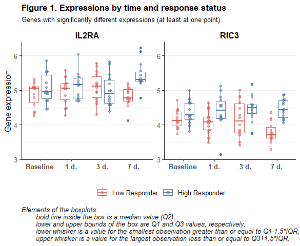

<style type="text/css">

.math {
font-size: small;
}
</style>


```r
library(tidyverse)
library(labelled)
library(gtsummary)
library(ggbeeswarm)
library(lemon)


knitr::opts_chunk$set(echo = TRUE, warning = FALSE, message = FALSE, error = FALSE)

list("style_number-arg:big.mark" = "") %>% set_gtsummary_theme()

# Данные https://www.immunespace.org/project/home/Integrative_Public_Study/begin.view?SDY=IS2

# all_noNorm_withResponse_eset <- readRDS("data/all_noNorm_withResponse_eset.Rds")
all_noNorm_withResponse_eset <- readRDS(file.path("..", "data", "all_noNorm_withResponse_eset.Rds"))

# Данные по участникам исследования SDY984 -------------------------------------

df_subj <- all_noNorm_withResponse_eset@phenoData@data %>%
  filter(study_accession == "SDY984")

timepoints <- unique(df_subj$study_time_collected)

  # Данные на момент baseline (0 days) для описательной статистики
  # за исключением moderate response по MFC_p40
df_subj_baseline <- df_subj %>%
  filter(study_time_collected == 0 & MFC_p40 != "moderateResponder") %>% 
  transmute(participant_id, 
            arm_accession = factor(arm_accession, c("ARM3536", "ARM3537"),
                                   c("Young", "Elderly")), 
            age = age_imputed,
            gender = factor(gender), 
            race = fct_infreq(factor(race)),
            ethnicity = factor(ethnicity, c("Not Hispanic or Latino", "Hispanic or Latino")),
            MFC_baseline = ImmResp_baseline_value_MFC,
            response = factor(MFC_p40, c("lowResponder", "highResponder"), 
                              c("Low Responder", "High Responder")))

var_label(df_subj_baseline) <-
  list(arm_accession = "Study arm",
       age = "Age, yrs",
       gender = "Gender",
       race = "Race",
       ethnicity = "Ethnicity",
       MFC_baseline = "MFC",
       response = "Vaccination response (MFC_p40)")

# Данные по экспрессии генов для участников исследования SDY984 ----------------

expr_t <- all_noNorm_withResponse_eset@assayData$exprs
expr_t <- expr_t[,df_subj$uid]

  # Матрица экспрессий --> датафрейм
  # (только по испытуемым с moderate response по MFC_p40)
  # + характеристики испытуемых
df_expr <- expr_t %>%
  t() %>%
  as_tibble(rownames = "uid") %>%
  separate(uid, c("participant_id", "time", NA, NA), 
           sep = "_", remove = FALSE, convert = TRUE) %>%
  filter(participant_id %in% df_subj_baseline$participant_id) %>%
  left_join(df_subj %>% 
              transmute(uid, MFC_postvax = ImmResp_postVax_value_MFC), 
            by = "uid") %>%
  left_join(df_subj_baseline %>% 
              select(participant_id, arm_accession, gender, race, ethnicity, 
                     MFC_baseline, response), 
            by = "participant_id")

  # Уберём гены с одними пропусками по экспрессии
df_expr <- df_expr %>%
  select(function(x) sum(is.na(x)) != length(x)) %>%
  select(participant_id, uid, arm_accession, gender, race, ethnicity,
         MFC_baseline, time, response, MFC_postvax, everything())

  # Длинный датафрейм
df_expr_long <- df_expr %>%
  pivot_longer(A1BG:last_col(), names_to = "gene", values_to = "expr")
```

В данном отчёте будут представлены результаты анализа данных по экспрессии генов среди добровольцев, прошедших вакцинацию от varicella zoster вакциной Zostavax. Данные были получены в рамках исследования [SDY984](https://www.immport.org/shared/study/SDY984) по программе [Human Immunology Project Consortium (HIPC)](https://www.immunespace.org/) и выложены на страничке [HIPC-II Immune Signatures Data Resource and Analysis (IS2)](https://datatools.immunespace.org/project/home/Integrative_Public_Study/begin.view?SDY=IS2) (доступны для скачивания после регистрации). 

Экспрессия генов оценивалась у 35 добровольцев до вакцинации и в нескольких точках (1, 3, 7 дней) после неё. Также по завершении исследования (через 30 дней от начала) оценивался ответ на вакцинацию с разбиением испытуемых на 3 группы: low, moderate и high responder. Разбиение проводилось отдельно по нескольким критериям, но мы для определения статуса по ответу на вакцинацию будем использовать только MFC_p40.

**Задача нашего исследовательского проекта** - определить, по экспрессии каких именно генов различались между собой испытуемые с разным уровнем ответа на вакцинацию и в какие сигнальные пути входят эти гены. 

В целях упрощения в рамках нашего исследовательского проекта мы исключим из анализа испытуемых с moderate ответом на вакцинацию (7 чел.), а также, на начальном этапе, не будем делать разбивку в зависимости от ветви исследования (возрастной группы испытуемых).

<br>

## **Описательная статистика, baseline**

<br>

Описательная статистика по участникам исследования на начало исследования (до вакцинации) представлена в Table 1 ниже. Поскольку мы планируем в своём исследовании сравнивать испытуемых с разным уровнем ответа по экспрессии генов, данные в таблице представлены в разбивке по этим группам. Young - добровольцы в возрасте 25 лет, Elderly - добровольцы в возрасте 60 лет.


```r
tbl_summary(
  df_subj_baseline %>% select(-participant_id, -age), 
  by = "response",
  type = all_continuous() ~ "continuous2",
  statistic = list(
    all_continuous() ~ c("{mean} ({sd})", 
                         "{median} ({p25}-{p75})", "{min}-{max}")),
  digits = list(MFC_baseline ~ rep(1,7)),
  missing_text = "Н.Д.") %>%
  add_stat_label(label = list(
    all_continuous() ~ c("Mean (SD)",
                         "Median (Q1-Q3)", "Range"))) %>%
  add_p(pvalue_fun = function(x) style_pvalue(x, digits = 3)) %>%
  modify_header(all_stat_cols() ~ "**{level}**<br>N = {n}") %>%
  modify_footnote(p.value ~ "p-value: Study arm, Gender, Race - Pearson's Chi-squared test;<br> 
                  Ethnicity - Fisher's exact test; MFC - Mann-Whitney test") %>%
  bold_labels() %>%
  as_kable_extra(caption = "<b>Table 1. Baseline characteristics of the study participants.</b>",
                 addtl_fmt = FALSE) %>% 
  kableExtra::row_spec(0, bold = TRUE) %>%
  kableExtra::kable_classic(full_width = FALSE, position = "left", font_size = 14,
                            html_font = "\"Source Sans Pro\", helvetica, sans-serif")
```

<table style='NAborder-bottom: 0; font-size: 14px; font-family: "Source Sans Pro", helvetica, sans-serif; width: auto !important; ' class=" lightable-classic">
<caption style="font-size: initial !important;"><b>Table 1. Baseline characteristics of the study participants.</b></caption>
 <thead>
  <tr>
   <th style="text-align:left;font-weight: bold;"> Characteristic </th>
   <th style="text-align:center;font-weight: bold;"> Low Responder<br>N = 14 </th>
   <th style="text-align:center;font-weight: bold;"> High Responder<br>N = 14 </th>
   <th style="text-align:center;font-weight: bold;"> p-value </th>
  </tr>
 </thead>
<tbody>
  <tr>
   <td style="text-align:left;"> <span style=" font-weight: bold;    ">Study arm, n (%)</span> </td>
   <td style="text-align:center;">  </td>
   <td style="text-align:center;">  </td>
   <td style="text-align:center;"> 0.023 </td>
  </tr>
  <tr>
   <td style="text-align:left;padding-left: 2em;" indentlevel="1"> Young </td>
   <td style="text-align:center;"> 4 (29%) </td>
   <td style="text-align:center;"> 10 (71%) </td>
   <td style="text-align:center;">  </td>
  </tr>
  <tr>
   <td style="text-align:left;padding-left: 2em;" indentlevel="1"> Elderly </td>
   <td style="text-align:center;"> 10 (71%) </td>
   <td style="text-align:center;"> 4 (29%) </td>
   <td style="text-align:center;">  </td>
  </tr>
  <tr>
   <td style="text-align:left;"> <span style=" font-weight: bold;    ">Gender, n (%)</span> </td>
   <td style="text-align:center;">  </td>
   <td style="text-align:center;">  </td>
   <td style="text-align:center;"> 0.430 </td>
  </tr>
  <tr>
   <td style="text-align:left;padding-left: 2em;" indentlevel="1"> Female </td>
   <td style="text-align:center;"> 8 (57%) </td>
   <td style="text-align:center;"> 10 (71%) </td>
   <td style="text-align:center;">  </td>
  </tr>
  <tr>
   <td style="text-align:left;padding-left: 2em;" indentlevel="1"> Male </td>
   <td style="text-align:center;"> 6 (43%) </td>
   <td style="text-align:center;"> 4 (29%) </td>
   <td style="text-align:center;">  </td>
  </tr>
  <tr>
   <td style="text-align:left;"> <span style=" font-weight: bold;    ">Race, n (%)</span> </td>
   <td style="text-align:center;">  </td>
   <td style="text-align:center;">  </td>
   <td style="text-align:center;"> 0.516 </td>
  </tr>
  <tr>
   <td style="text-align:left;padding-left: 2em;" indentlevel="1"> White </td>
   <td style="text-align:center;"> 11 (79%) </td>
   <td style="text-align:center;"> 8 (57%) </td>
   <td style="text-align:center;">  </td>
  </tr>
  <tr>
   <td style="text-align:left;padding-left: 2em;" indentlevel="1"> Black or African American </td>
   <td style="text-align:center;"> 2 (14%) </td>
   <td style="text-align:center;"> 5 (36%) </td>
   <td style="text-align:center;">  </td>
  </tr>
  <tr>
   <td style="text-align:left;padding-left: 2em;" indentlevel="1"> Unknown </td>
   <td style="text-align:center;"> 1 (7.1%) </td>
   <td style="text-align:center;"> 1 (7.1%) </td>
   <td style="text-align:center;">  </td>
  </tr>
  <tr>
   <td style="text-align:left;"> <span style=" font-weight: bold;    ">Ethnicity, n (%)</span> </td>
   <td style="text-align:center;">  </td>
   <td style="text-align:center;">  </td>
   <td style="text-align:center;"> &gt;0.999 </td>
  </tr>
  <tr>
   <td style="text-align:left;padding-left: 2em;" indentlevel="1"> Not Hispanic or Latino </td>
   <td style="text-align:center;"> 12 (86%) </td>
   <td style="text-align:center;"> 13 (93%) </td>
   <td style="text-align:center;">  </td>
  </tr>
  <tr>
   <td style="text-align:left;padding-left: 2em;" indentlevel="1"> Hispanic or Latino </td>
   <td style="text-align:center;"> 2 (14%) </td>
   <td style="text-align:center;"> 1 (7.1%) </td>
   <td style="text-align:center;">  </td>
  </tr>
  <tr>
   <td style="text-align:left;"> <span style=" font-weight: bold;    ">MFC</span> </td>
   <td style="text-align:center;">  </td>
   <td style="text-align:center;">  </td>
   <td style="text-align:center;"> 0.012 </td>
  </tr>
  <tr>
   <td style="text-align:left;padding-left: 2em;" indentlevel="1"> Mean (SD) </td>
   <td style="text-align:center;"> 14.2 (1.0) </td>
   <td style="text-align:center;"> 13.0 (1.3) </td>
   <td style="text-align:center;">  </td>
  </tr>
  <tr>
   <td style="text-align:left;padding-left: 2em;" indentlevel="1"> Median (Q1-Q3) </td>
   <td style="text-align:center;"> 14.0 (13.4-15.1) </td>
   <td style="text-align:center;"> 13.0 (12.6-13.7) </td>
   <td style="text-align:center;">  </td>
  </tr>
  <tr>
   <td style="text-align:left;padding-left: 2em;" indentlevel="1"> Range </td>
   <td style="text-align:center;"> 12.8-15.9 </td>
   <td style="text-align:center;"> 10.6-15.4 </td>
   <td style="text-align:center;">  </td>
  </tr>
</tbody>
<tfoot><tr><td style="padding: 0; " colspan="100%">
<sup>1</sup> p-value: Study arm, Gender, Race - Pearson's Chi-squared test;<br> 
Ethnicity - Fisher's exact test; MFC - Mann-Whitney test</td></tr></tfoot>
</table>

<br>

## **Сравнение экспрессии генов между группами испытуемых с разным уровнем ответа на вакцинацию**

<br>

Исходный датасет включал в себя данные по экспрессии 26925 генов, для нашего исследования удалим те гены, данные по экспрессии которых были пропущены для всех участников исследования, включенных в анализ, - останется матрица экспрессий по 16146 генам. По данным об экспрессии этих генов во _всех_ точках исследования оценим медианное абсолютное отклонение (MAD) и оставим для дальнейшего анализа 5 тыс. генов с наибольшим его значением (гены с наибольшей вариацией экспрессии).


```r
genes_maxvar <- df_expr_long %>%
  group_by(gene) %>%
  summarise(mad_expr = mad(expr)) %>%
  arrange(-mad_expr) %>%
  slice_head(n = 5000)

df_expr_long_fin <- df_expr_long %>%
  filter(gene %in% genes_maxvar$gene)
```

В каждой точке исследования по каждому гену сравним экспрессии генов между группами со слабым и сильным ответом на вакцинацию с помощью теста Манна-Уитни, скорректируем полученные p-values по методу Бенджамини-Хохберга (для контроля FDR, в каждой точке отдельно) и посмотрим, по какому количеству генов средние значения экспрессий различаются на уровне значимости 5% без коррекции и с коррекцией.


```r
mwtest_p <- df_expr_long_fin %>%
  group_by(time, gene) %>%
  summarise(p = wilcox.test(expr ~ response)$p.value) %>%
  group_by(time) %>%
  mutate(p_adj = p.adjust(p, method = "BH")) %>%
  ungroup() %>%
  arrange(p_adj) %>%
  mutate(p_group = cut(p, c(0, 0.05, 1.1), c("< 0.05", "$\\geq$ 0.05"), right = FALSE),
         p_adj_group = cut(p_adj, c(0, 0.05, 1.1), c("< 0.05", "$\\geq$ 0.05"), right = FALSE),
         timeF = factor(time, timepoints, ifelse(timepoints == 0, "Baseline", paste(timepoints, "d."))))

tbl_summary(
  mwtest_p %>% select(timeF, p_group, p_adj_group), 
  by = "timeF",
  label = list(p_group = "P-value",
               p_adj_group = "Adjusted p-value")) %>%
  modify_footnote(everything() ~ NA) %>%
  modify_header(label ~ "", 
                all_stat_cols() ~ "**{level}**") %>%
  bold_labels() %>%
  as_kable_extra(caption = "<b>Table 2. P-values of the Mann-Whitney tests before and after<br>
                 adjustment under Benjamini & Hochberg method</b>,<br>number of genes (%)") %>% 
  kableExtra::row_spec(0, bold = TRUE) %>%
  kableExtra::kable_classic(full_width = FALSE, position = "left", font_size = 14,
                            html_font = "\"Source Sans Pro\", helvetica, sans-serif")
```

<table class=" lightable-classic" style='font-size: 14px; font-family: "Source Sans Pro", helvetica, sans-serif; width: auto !important; '>
<caption style="font-size: initial !important;">
<b>Table 2. P-values of the Mann-Whitney tests before and after<br>
                 adjustment under Benjamini &amp; Hochberg method</b>,<br>number of genes (%)</caption>
 <thead>
  <tr>
   <th style="text-align:left;font-weight: bold;">  </th>
   <th style="text-align:center;font-weight: bold;"> Baseline </th>
   <th style="text-align:center;font-weight: bold;"> 1 d. </th>
   <th style="text-align:center;font-weight: bold;"> 3 d. </th>
   <th style="text-align:center;font-weight: bold;"> 7 d. </th>
  </tr>
 </thead>
<tbody>
  <tr>
   <td style="text-align:left;"> <span style=" font-weight: bold;    ">P-value</span> </td>
   <td style="text-align:center;">  </td>
   <td style="text-align:center;">  </td>
   <td style="text-align:center;">  </td>
   <td style="text-align:center;">  </td>
  </tr>
  <tr>
   <td style="text-align:left;padding-left: 2em;" indentlevel="1"> &lt; 0.05 </td>
   <td style="text-align:center;"> 356 (7.1%) </td>
   <td style="text-align:center;"> 423 (8.5%) </td>
   <td style="text-align:center;"> 353 (7.1%) </td>
   <td style="text-align:center;"> 426 (8.5%) </td>
  </tr>
  <tr>
   <td style="text-align:left;padding-left: 2em;" indentlevel="1"> $\geq$ 0.05 </td>
   <td style="text-align:center;"> 4644 (93%) </td>
   <td style="text-align:center;"> 4577 (92%) </td>
   <td style="text-align:center;"> 4647 (93%) </td>
   <td style="text-align:center;"> 4574 (91%) </td>
  </tr>
  <tr>
   <td style="text-align:left;"> <span style=" font-weight: bold;    ">Adjusted p-value</span> </td>
   <td style="text-align:center;">  </td>
   <td style="text-align:center;">  </td>
   <td style="text-align:center;">  </td>
   <td style="text-align:center;">  </td>
  </tr>
  <tr>
   <td style="text-align:left;padding-left: 2em;" indentlevel="1"> &lt; 0.05 </td>
   <td style="text-align:center;"> 0 (0%) </td>
   <td style="text-align:center;"> 0 (0%) </td>
   <td style="text-align:center;"> 0 (0%) </td>
   <td style="text-align:center;"> 2 (&lt;0.1%) </td>
  </tr>
  <tr>
   <td style="text-align:left;padding-left: 2em;" indentlevel="1"> $\geq$ 0.05 </td>
   <td style="text-align:center;"> 5000 (100%) </td>
   <td style="text-align:center;"> 5000 (100%) </td>
   <td style="text-align:center;"> 5000 (100%) </td>
   <td style="text-align:center;"> 4998 (100%) </td>
  </tr>
</tbody>
</table>

<br>

Оказалось всего 2 гена, экспрессии которых статистически значимым образом (на 5%-ном уровне значимости) различаются между сильными и слабыми респондерами, оба наблюдения относятся к точке 7 дней после вакцинации, - это гены IL2RA, RIC3. Статистика по экспрессии этих генов в группах в каждой точке исследования представлена в таблице ниже.


```r
tbl_data <- df_expr %>%
  select(time, response, all_of(mwtest_p$gene[mwtest_p$p_adj < 0.05])) %>%
  nest_by(time) %>%
  mutate(tbl = list(
    tbl_summary(data, 
                by = "response",
                type = all_continuous() ~ "continuous2",
                statistic = list(
                  all_continuous() ~ c("{mean} ({sd})", "{median} ({p25}-{p75})", 
                                       "{min}-{max}")),
                digits = list(all_continuous() ~ rep(1,7))) %>%
      add_stat_label(label = list(
        all_continuous() ~ c("Mean (SD)", "Median (Q1-Q3)", "Range"))) %>%
      add_p(pvalue_fun = function(x) style_pvalue(x, digits = 3)) %>%
      modify_header(all_stat_cols() ~ "**{level}**<br>N = {n}",
                    label ~ "**Gene/ Statistic**") %>%
      modify_footnote(p.value ~ "p-value: Mann-Whitney test with Benjamini & Hochberg correction") %>%
      bold_labels()))

for (i in tbl_data$time) {
  tb <- tbl_data$tbl[tbl_data$time == i][[1]]
  tb$table_body$p.value[tb$table_body$row_type == "label"] <-
    mwtest_p$p_adj[mwtest_p$time == i][match(names(tbl_data$data[tbl_data$time == i][[1]])[-1], 
                                             mwtest_p$gene[mwtest_p$time == i])]
  tbl_data$tbl[tbl_data$time == i][[1]] <- tb
}
  

tbl_merge(tbl_data$tbl, tab_spanner = sprintf("<b>%s</b>", levels(mwtest_p$timeF))) %>%
  as_kable_extra(caption = "<b>Table 3. Descriptive statistics for genes with expressions,
  significantly different between low and high responders.</b>", addtl_fmt = FALSE) %>% 
  kableExtra::row_spec(0, bold = TRUE) %>%
  kableExtra::kable_classic(full_width = FALSE, position = "left", font_size = 11,
                            html_font = "\"Source Sans Pro\", helvetica, sans-serif")
```

<table style='NAborder-bottom: 0; font-size: 11px; font-family: "Source Sans Pro", helvetica, sans-serif; width: auto !important; ' class=" lightable-classic">
<caption style="font-size: initial !important;"><b>Table 3. Descriptive statistics for genes with expressions,
  significantly different between low and high responders.</b></caption>
 <thead>
<tr>
<th style="empty-cells: hide;border-bottom:hidden;" colspan="1"></th>
<th style="border-bottom:hidden;padding-bottom:0; padding-left:3px;padding-right:3px;text-align: center; " colspan="3"><div style="border-bottom: 1px solid #ddd; padding-bottom: 5px; "><b>Baseline</b></div></th>
<th style="border-bottom:hidden;padding-bottom:0; padding-left:3px;padding-right:3px;text-align: center; " colspan="3"><div style="border-bottom: 1px solid #ddd; padding-bottom: 5px; "><b>1 d.</b></div></th>
<th style="border-bottom:hidden;padding-bottom:0; padding-left:3px;padding-right:3px;text-align: center; " colspan="3"><div style="border-bottom: 1px solid #ddd; padding-bottom: 5px; "><b>3 d.</b></div></th>
<th style="border-bottom:hidden;padding-bottom:0; padding-left:3px;padding-right:3px;text-align: center; " colspan="3"><div style="border-bottom: 1px solid #ddd; padding-bottom: 5px; "><b>7 d.</b></div></th>
</tr>
  <tr>
   <th style="text-align:left;font-weight: bold;"> Gene/ Statistic </th>
   <th style="text-align:center;font-weight: bold;"> Low Responder<br>N = 14 </th>
   <th style="text-align:center;font-weight: bold;"> High Responder<br>N = 14 </th>
   <th style="text-align:center;font-weight: bold;"> p-value </th>
   <th style="text-align:center;font-weight: bold;"> Low Responder<br>N = 14 </th>
   <th style="text-align:center;font-weight: bold;"> High Responder<br>N = 14 </th>
   <th style="text-align:center;font-weight: bold;"> p-value </th>
   <th style="text-align:center;font-weight: bold;"> Low Responder<br>N = 14 </th>
   <th style="text-align:center;font-weight: bold;"> High Responder<br>N = 14 </th>
   <th style="text-align:center;font-weight: bold;"> p-value </th>
   <th style="text-align:center;font-weight: bold;"> Low Responder<br>N = 14 </th>
   <th style="text-align:center;font-weight: bold;"> High Responder<br>N = 14 </th>
   <th style="text-align:center;font-weight: bold;"> p-value </th>
  </tr>
 </thead>
<tbody>
  <tr>
   <td style="text-align:left;"> <span style=" font-weight: bold;    ">IL2RA</span> </td>
   <td style="text-align:center;">  </td>
   <td style="text-align:center;">  </td>
   <td style="text-align:center;"> 0.914 </td>
   <td style="text-align:center;">  </td>
   <td style="text-align:center;">  </td>
   <td style="text-align:center;"> 0.902 </td>
   <td style="text-align:center;">  </td>
   <td style="text-align:center;">  </td>
   <td style="text-align:center;"> 0.893 </td>
   <td style="text-align:center;">  </td>
   <td style="text-align:center;">  </td>
   <td style="text-align:center;"> 0.017 </td>
  </tr>
  <tr>
   <td style="text-align:left;padding-left: 2em;" indentlevel="1"> Mean (SD) </td>
   <td style="text-align:center;"> 4.9 (0.4) </td>
   <td style="text-align:center;"> 5.1 (0.4) </td>
   <td style="text-align:center;">  </td>
   <td style="text-align:center;"> 5.0 (0.4) </td>
   <td style="text-align:center;"> 5.1 (0.4) </td>
   <td style="text-align:center;">  </td>
   <td style="text-align:center;"> 5.1 (0.4) </td>
   <td style="text-align:center;"> 5.0 (0.5) </td>
   <td style="text-align:center;">  </td>
   <td style="text-align:center;"> 4.8 (0.3) </td>
   <td style="text-align:center;"> 5.4 (0.4) </td>
   <td style="text-align:center;">  </td>
  </tr>
  <tr>
   <td style="text-align:left;padding-left: 2em;" indentlevel="1"> Median (Q1-Q3) </td>
   <td style="text-align:center;"> 5.1 (4.7-5.1) </td>
   <td style="text-align:center;"> 4.9 (4.8-5.4) </td>
   <td style="text-align:center;">  </td>
   <td style="text-align:center;"> 5.1 (4.7-5.2) </td>
   <td style="text-align:center;"> 5.2 (4.8-5.4) </td>
   <td style="text-align:center;">  </td>
   <td style="text-align:center;"> 5.1 (4.8-5.4) </td>
   <td style="text-align:center;"> 4.9 (4.6-5.3) </td>
   <td style="text-align:center;">  </td>
   <td style="text-align:center;"> 4.8 (4.7-5.0) </td>
   <td style="text-align:center;"> 5.3 (5.3-5.5) </td>
   <td style="text-align:center;">  </td>
  </tr>
  <tr>
   <td style="text-align:left;padding-left: 2em;" indentlevel="1"> Range </td>
   <td style="text-align:center;"> 4.3-5.3 </td>
   <td style="text-align:center;"> 4.5-5.9 </td>
   <td style="text-align:center;">  </td>
   <td style="text-align:center;"> 4.3-5.6 </td>
   <td style="text-align:center;"> 4.7-6.0 </td>
   <td style="text-align:center;">  </td>
   <td style="text-align:center;"> 4.3-5.8 </td>
   <td style="text-align:center;"> 4.4-5.8 </td>
   <td style="text-align:center;">  </td>
   <td style="text-align:center;"> 4.1-5.2 </td>
   <td style="text-align:center;"> 4.8-6.2 </td>
   <td style="text-align:center;">  </td>
  </tr>
  <tr>
   <td style="text-align:left;"> <span style=" font-weight: bold;    ">RIC3</span> </td>
   <td style="text-align:center;">  </td>
   <td style="text-align:center;">  </td>
   <td style="text-align:center;"> 0.752 </td>
   <td style="text-align:center;">  </td>
   <td style="text-align:center;">  </td>
   <td style="text-align:center;"> 0.401 </td>
   <td style="text-align:center;">  </td>
   <td style="text-align:center;">  </td>
   <td style="text-align:center;"> 0.739 </td>
   <td style="text-align:center;">  </td>
   <td style="text-align:center;">  </td>
   <td style="text-align:center;"> 0.017 </td>
  </tr>
  <tr>
   <td style="text-align:left;padding-left: 2em;" indentlevel="1"> Mean (SD) </td>
   <td style="text-align:center;"> 4.2 (0.3) </td>
   <td style="text-align:center;"> 4.4 (0.3) </td>
   <td style="text-align:center;">  </td>
   <td style="text-align:center;"> 4.1 (0.3) </td>
   <td style="text-align:center;"> 4.4 (0.5) </td>
   <td style="text-align:center;">  </td>
   <td style="text-align:center;"> 4.2 (0.5) </td>
   <td style="text-align:center;"> 4.5 (0.4) </td>
   <td style="text-align:center;">  </td>
   <td style="text-align:center;"> 3.8 (0.3) </td>
   <td style="text-align:center;"> 4.5 (0.3) </td>
   <td style="text-align:center;">  </td>
  </tr>
  <tr>
   <td style="text-align:left;padding-left: 2em;" indentlevel="1"> Median (Q1-Q3) </td>
   <td style="text-align:center;"> 4.1 (4.0-4.4) </td>
   <td style="text-align:center;"> 4.3 (4.2-4.6) </td>
   <td style="text-align:center;">  </td>
   <td style="text-align:center;"> 4.1 (3.9-4.2) </td>
   <td style="text-align:center;"> 4.4 (4.2-4.7) </td>
   <td style="text-align:center;">  </td>
   <td style="text-align:center;"> 4.1 (3.8-4.6) </td>
   <td style="text-align:center;"> 4.5 (4.3-4.6) </td>
   <td style="text-align:center;">  </td>
   <td style="text-align:center;"> 3.7 (3.6-3.9) </td>
   <td style="text-align:center;"> 4.4 (4.2-4.7) </td>
   <td style="text-align:center;">  </td>
  </tr>
  <tr>
   <td style="text-align:left;padding-left: 2em;" indentlevel="1"> Range </td>
   <td style="text-align:center;"> 3.7-4.7 </td>
   <td style="text-align:center;"> 3.8-5.0 </td>
   <td style="text-align:center;">  </td>
   <td style="text-align:center;"> 3.5-4.6 </td>
   <td style="text-align:center;"> 3.1-5.1 </td>
   <td style="text-align:center;">  </td>
   <td style="text-align:center;"> 3.4-5.0 </td>
   <td style="text-align:center;"> 3.7-5.2 </td>
   <td style="text-align:center;">  </td>
   <td style="text-align:center;"> 3.3-4.4 </td>
   <td style="text-align:center;"> 4.1-4.9 </td>
   <td style="text-align:center;">  </td>
  </tr>
</tbody>
<tfoot><tr><td style="padding: 0; " colspan="100%">
<sup>1</sup> p-value: Mann-Whitney test with Benjamini &amp; Hochberg correction</td></tr></tfoot>
</table>

<br>

В качестве иллюстрации:


```r
ggplot(df_expr_long_fin %>% 
         filter(gene %in% mwtest_p$gene[mwtest_p$p_adj < 0.05]) %>%
         mutate(timeF = factor(time, timepoints, ifelse(timepoints == 0, "Baseline", paste(timepoints, "d.")))),
       aes(x = timeF, y = expr, color = response)) +
  geom_boxplot(position = position_dodge(0.8), width = 0.6) +
  geom_beeswarm(dodge.width = 0.8, groupOnX = TRUE, size = 1.5, alpha = 0.5) +
  scale_color_manual(values = c("#E15759", "#4E79A7")) +
  facet_rep_wrap(~ gene, repeat.tick.labels = TRUE) +
  labs(x = element_blank(), y = "Gene expression", color = element_blank(),
       title = "Figure 1. Expressions by time and response status",
       subtitle = "Genes with significantly different expressions (at least at one point)",
       caption = "Elements of the boxplots:
       bold line inside the box is a median value (Q2), 
       lower and upper bounds of the box are Q1 and Q3 values, respectively, 
       lower whisker is a value for the smallest observation greater than or equal to Q1-1.5*IQR,
       upper whisker is a value for the largest observation less than or equal to Q3+1.5*IQR.") +
  theme_classic(base_size = 12) +
  theme(legend.position = "bottom",
        panel.grid.major.y = element_line(size = .2, color = '#ebebebFF'),
        panel.grid.minor.y = element_line(size = .1, color = '#ebebebFF'),
        axis.text.x = element_text(face = "bold"),
        strip.background = element_blank(),
        strip.text.x = element_text(size = 12, color = "black", face = "bold"),
        plot.title = element_text(size = 13, face = "bold"),
        plot.subtitle = element_text(size = 10),
        plot.caption = element_text(color = "black", face = "italic", hjust = 0))
```

<!-- -->

<br>

[**IL2RA**](https://en.wikipedia.org/wiki/IL2RA) - это ген, который кодирует белок Interleukin-2 receptor alpha chain (CD25), [Interleukin-2 (IL-2)](https://en.wikipedia.org/wiki/Interleukin_2) - это белок, который регулирует активность лейкоцитов, отвечающих за иммунитет. 

[**RIC3**](https://en.wikipedia.org/wiki/RIC3) - это ген, который кодирует chaperon белок RIC-3, отвечающий за резистентность к ингибиторам cholinesterase 3. [Chaperon белки](https://en.wikipedia.org/wiki/Chaperone_(protein)) участвуют в сворачивании или разворачивании крупных белков или макромолекулярных белковых комплексов.
