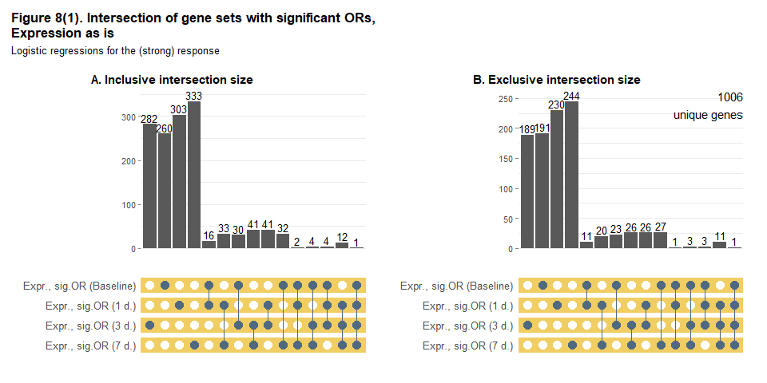
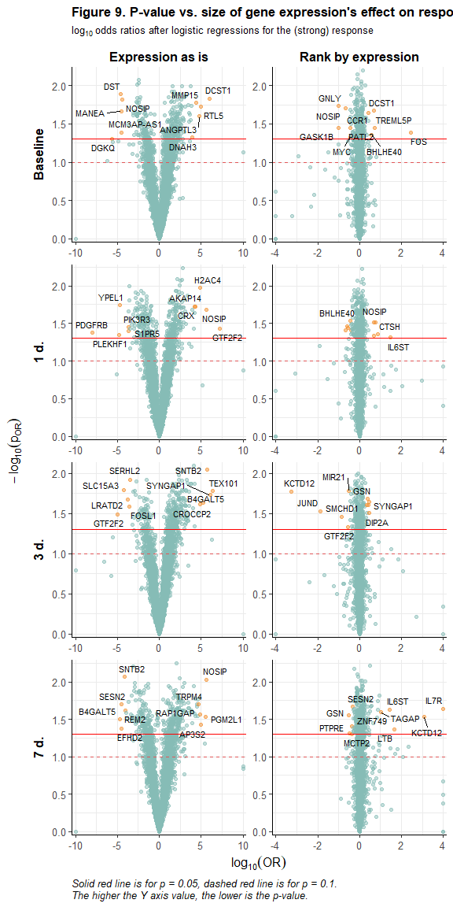

<style type="text/css">

.math {
font-size: small;
}

</style>


```r
library(tidyverse)
library(labelled)
library(gtsummary)
library(ggbeeswarm)
library(ggrepel)
library(lemon)
library(ComplexUpset)
library(colorspace)
library(lme4)
library(lmerTest)
library(marginaleffects)
library(broom.mixed)
library(qvalue)
library(knitr)
if (identical(knitr::opts_knit$get("rmarkdown.runtime"), "shiny")) {
  library(shiny)
}

options(knitr.kable.NA = '')
knitr::opts_chunk$set(echo = TRUE, warning = FALSE, message = FALSE, error = FALSE)

list("style_number-arg:big.mark" = "") %>% set_gtsummary_theme()

# Function for upset plots

upset_plot <- function(data, sets_names, rowcolors, title, subtitle, showh = TRUE, ab_hjust = -0.95) {
  
  p1 <- upset(
    data, sets_names, name = "gene", sort_sets = FALSE,
    sort_intersections = "ascending", sort_intersections_by = c("degree", "cardinality"),
    wrap = TRUE, set_sizes = FALSE,
    base_annotations = list("Inclusive intersection size" = (
      intersection_size(
        mode = "intersect",
        # mapping = aes(fill = exclusive_intersection),
        text_mapping = aes(y = !!get_size_mode("inclusive_intersection"),
                           colour = "on_background"),
        text = list(size = 3.5)
      ) +
        scale_y_continuous(expand = c(0.07,0)) +
        labs(title = "A. Inclusive intersection size") +
        theme(legend.position = "none",
              panel.grid.major.x = element_blank(),
              panel.grid.minor.x = element_blank(),
              axis.ticks.y = element_line(color = "grey50", linewidth = 0.2),
              axis.text.y = element_text(size = 8),
              axis.title.y = element_blank(),
              plot.title = element_text(hjust = ab_hjust, size = 11, face = "bold")))),
    matrix = intersection_matrix(
      outline_color = list(active = "#4F6980", inactive = "white"),
      segment = geom_segment(color = "#4F6980")
    ) +
      scale_color_manual(values = c("TRUE" = "#4F6980", "FALSE" = "white"), guide = "none"),
    stripes = upset_stripes(colors = rowcolors),
    themes = upset_modify_themes(list(
      intersections_matrix = theme(panel.grid.major = element_blank(),
                                   panel.grid.minor = element_blank(),
                                   axis.text.y = element_text(size = 10),
                                   axis.title.x = element_blank()))))
  p2 <- upset(
    data, sets_names, name = "gene", sort_sets = FALSE, 
    sort_intersections = "ascending", sort_intersections_by = c("degree", "cardinality"),
    wrap = TRUE, set_sizes = FALSE,
    base_annotations = list("Intersection size" = (
      intersection_size(
        text_mapping = aes(y = !!get_size_mode("exclusive_intersection"),
                           colour = "on_background"),
        text = list(size = 3.5)
      ) + 
        annotate(geom = "text", x = Inf, y = Inf,
                 label = sprintf("%d\nunique genes", nrow(data)),
                 vjust = 1, hjust = 1) +
        scale_y_continuous(expand = c(0.07,0)) +
        labs(title = "B. Exclusive intersection size") +
        theme(panel.grid.major.x = element_blank(),
              panel.grid.minor.x = element_blank(),
              axis.ticks.y = element_line(color = "grey50", linewidth = 0.2),
              axis.text.y = element_text(size = 8),
              axis.title.y = element_blank(),
              plot.title = element_text(hjust = ab_hjust, size = 11, face = "bold")))),
    matrix = intersection_matrix(
      outline_color = list(active = "#4F6980", inactive = "white"),
      segment = geom_segment(color = "#4F6980")
    ) +
      scale_color_manual(values = c("TRUE" = "#4F6980", "FALSE" = "white"), guide = "none"),
    stripes = upset_stripes(colors = rowcolors),
    themes = upset_modify_themes(list(
      intersections_matrix = theme(panel.grid.major = element_blank(),
                                   panel.grid.minor = element_blank(),
                                   axis.text.y = element_text(size = 10),
                                   axis.title.x = element_blank()))))
  
  if (showh) {
    p1 +
      labs(title = title, subtitle = subtitle) +
      theme(plot.title = element_text(size = 13, face = "bold"),
            plot.subtitle = element_text(size = 10)) +
      p2
  } else {
    ((p1 +
        labs(title = title, subtitle = subtitle) +
        theme(plot.title = element_text(size = 13, face = "bold"),
              plot.subtitle = element_text(size = 10))) 
     /
       (p2))
  }
}

# Function for getting BPs (GO) for genes strored in "gene" column of df

bp_genesF <- function(df) {
  AnnotationDbi::select(
    org.Hs.eg.db::org.Hs.eg.db, 
    df %>% pull(gene) %>% unique(), 
    "GO", "SYMBOL") %>% 
    filter(ONTOLOGY == "BP") %>%
    mutate(TERM = AnnotationDbi::Term(GO), DEFINITION = AnnotationDbi::Definition(GO)) %>%
    filter(!is.na(TERM) & TERM != "biological_process") %>%
    transmute(SYMBOL, GO, TERM, DEFINITION) %>%
    unique() %>%
    group_by(TERM) %>%
    summarise(GOBPID = unique(GO), def = unique(DEFINITION), n = n(), genes = paste(SYMBOL, collapse = ", ")) %>%
    arrange(-n)
}

# Данные https://www.immunespace.org/project/home/Integrative_Public_Study/begin.view?SDY=IS2

# all_noNorm_withResponse_eset <- readRDS("data/all_noNorm_withResponse_eset.Rds")
all_noNorm_withResponse_eset <- readRDS(file.path("..", "data", "all_noNorm_withResponse_eset.Rds"))

# Данные по участникам исследования SDY984 -------------------------------------

df_subj <- all_noNorm_withResponse_eset@phenoData@data %>%
  filter(study_accession == "SDY984")

timepoints <- unique(df_subj$study_time_collected)

# Данные на момент baseline (0 days) для описательной статистики
# за исключением moderate response по MFC_p40
df_subj_baseline <- df_subj %>%
  filter(study_time_collected == 0 & MFC_p40 != "moderateResponder") %>% 
  transmute(participant_id, 
            arm_accession = factor(arm_accession, c("ARM3536", "ARM3537"),
                                   c("Young", "Elderly")), 
            age = age_imputed,
            gender = factor(gender), 
            race = fct_infreq(factor(race)),
            ethnicity = factor(ethnicity, c("Not Hispanic or Latino", "Hispanic or Latino")),
            igg_baseline = ImmResp_baseline_value_MFC,
            response = factor(MFC_p40, c("lowResponder", "highResponder"), 
                              c("Low Responder", "High Responder")))

var_label(df_subj_baseline) <-
  list(arm_accession = "Study arm",
       age = "Age, yrs",
       gender = "Gender",
       race = "Race",
       ethnicity = "Ethnicity",
       igg_baseline = "log2(IgG), ELISA",
       response = "Vaccination response (MFC_p40)")

# Данные по экспрессии генов для участников исследования SDY984 ----------------

expr_t <- all_noNorm_withResponse_eset@assayData$exprs
expr_t <- expr_t[,df_subj$uid]

# Матрица экспрессий --> датафрейм
# (только по испытуемым с moderate response по MFC_p40)
# + характеристики испытуемых
df_expr <- expr_t %>%
  t() %>%
  as_tibble(rownames = "uid") %>%
  separate(uid, c("participant_id", "time", NA, NA), 
           sep = "_", remove = FALSE, convert = TRUE) %>%
  filter(participant_id %in% df_subj_baseline$participant_id) %>%
  left_join(df_subj %>% transmute(uid, igg_postvax = ImmResp_postVax_value_MFC), 
            by = "uid") %>%
  left_join(df_subj_baseline %>% select(participant_id, arm_accession, gender, 
                                        race, ethnicity, igg_baseline, response), 
            by = "participant_id")

# Уберём гены с одними пропусками по экспрессии
df_expr <- df_expr %>%
  select(function(x) sum(is.na(x)) != length(x)) %>%
  select(participant_id, uid, arm_accession, gender, race, ethnicity,
         igg_baseline, time, response, igg_postvax, everything())

# Длинный датафрейм
df_expr_long <- df_expr %>%
  pivot_longer(A1BG:last_col(), names_to = "gene", values_to = "expr")
```

## **Общая информация**

<br>

В данном отчёте будут представлены результаты анализа данных по экспрессии генов среди добровольцев, прошедших **вакцинацию от varicella zoster живой ослабленной вакциной Zostavax**. Данные были получены в рамках исследования [SDY984](https://www.immport.org/shared/study/SDY984) по программе [Human Immunology Project Consortium (HIPC)](https://www.immunespace.org/) и выложены на страничке [HIPC-II Immune Signatures Data Resource and Analysis (IS2)](https://datatools.immunespace.org/project/home/Integrative_Public_Study/begin.view?SDY=IS2) (доступны для скачивания после регистрации).

**Задача нашего исследовательского проекта** - определить, динамика экспрессии каких именно генов связана с иммунным ответом на вакцинацию и в какие сигнальные пути входят эти гены. Эту задачу можно решать двояко: 

- с помощью оценки различий в экспрессии генов между испытуемыми, ответившими и не ответившими на вакцинацию, 

- с помощью оценки взаимосвязи между экспрессией генов (и её динамикой) и итоговым ответом на вакцинацию.

<br>

Представление о функции генов можно получить из **[Gene Ontology (GO)](http://geneontology.org/)** - специальной базы знаний, в которой хранится наиболее актуальная и полная на сегодняшний день информация в данной области, а именно: [аннотация](https://biocorecrg.github.io/PHINDaccess_RNAseq_2020/functional_analysis.html) о молекулярных функциях белковых продуктов генов, биологических процессах, частью которых являются эти функции, и компонентах клеток, в которых продукты гена эти функции выполняют. В нашем исследовании нас будут интересовать, прежде всего, биологические процессы, в которых участвуют продукты генов-находок (генов с дифференциальной экспрессией для групп испытуемых с разной силой ответа на вакцинацию или генов, экспрессия которых окажется значимым образом связанной с ответом).

<br>

В выбранном нами исследовании **экспрессия генов** оценивалась у 35 добровольцев до вакцинации и в нескольких точках (1, 3, 7 дней) после неё. 

Также по завершении исследования (через 30 дней от начала) оценивался **ответ на вакцинацию** с разбиением испытуемых на 3 группы: low, moderate и high responder. Разбиение проводилось отдельно по нескольким критериям, но мы для определения статуса по ответу на вакцинацию будем использовать только MFC_p40. MFC - это maximum fold change (максимальная кратность изменения) для титра антител после вакцинации по сравнению с состоянием до неё (максимальная - поскольку [некоторые вакцины в исследовании содержали несколько штаммов вируса и/или титр антител для них определялся с помощью нескольких тестов](https://www.nature.com/articles/s41590-022-01329-5)). В исследовании, с данными которого мы будем работать, штамм был один и титр антител измерялся с помощью одной методики - оценки уровня IgG методом ELISA (enzyme-linked immunosorbent assay, или иммуноферментный анализ, ИФА), поэтому в данном случае MFC фактически равна просто кратности изменения титра антител (формально это $log_2(FC)$). Что касается разбивки на группы по ответу, то оно [производилось по перцентилям полученного значения для MFC](https://www.nature.com/articles/s41590-022-01329-5), а именно: для MFC_p40 все испытуемые, у кого MFC был меньше или равен 40-му перцентилю, считались low responder'ами, с MFC, равным или большим 60-го перцентиля - high responder'ами, остальные - moderate responder'ами (детали можно найти, в том числе, в [функциях](https://rdrr.io/github/RGLab/ImmuneSignatures2/src/R/immuneResponseCallGeneration.R), которые использовались для получения того датасета, с которым мы работаем).

В целях упрощения в рамках нашего исследовательского проекта мы исключим из анализа испытуемых с moderate ответом на вакцинацию (7 чел.), а также, на начальном этапе, не будем делать разбивку в зависимости от ветви исследования (возрастной группы испытуемых).

<br>

## **Описательная статистика: характеристики испытуемых, baseline**

<br>

Описательная статистика по участникам исследования на начало исследования (до вакцинации) представлена в Table 1 ниже. Поскольку мы планируем в своём исследовании, в том числе, сравнивать испытуемых с разным уровнем ответа по экспрессии генов, данные в таблице представлены в разбивке по этим группам. Young - добровольцы в возрасте 25 лет, Elderly - добровольцы в возрасте 60 лет.


```r
tbl_summary(
  df_subj_baseline %>% select(-participant_id, -age), 
  by = "response",
  type = all_continuous() ~ "continuous2",
  statistic = list(
    all_continuous() ~ c("{mean} ({sd})", 
                         "{median} ({p25}-{p75})", "{min}-{max}")),
  digits = list(igg_baseline ~ rep(1,7)),
  missing_text = "Н.Д.") %>%
  add_stat_label(label = list(
    all_continuous() ~ c("Mean (SD)",
                         "Median (Q1-Q3)", "Range"))) %>%
  add_p(pvalue_fun = function(x) style_pvalue(x, digits = 3)) %>%
  modify_header(all_stat_cols() ~ "**{level}**<br>N = {n}") %>%
  modify_footnote(p.value ~ "p-value: Study arm, Gender, Race - Pearson's Chi-squared test;<br> 
                  Ethnicity - Fisher's exact test; IgG - Mann-Whitney test") %>%
  bold_labels() %>%
  as_kable_extra(caption = "<b>Table 1. Baseline characteristics of the study participants.</b>",
                 addtl_fmt = FALSE) %>% 
  kableExtra::row_spec(0, bold = TRUE) %>%
  kableExtra::kable_classic(full_width = FALSE, position = "left", font_size = 14,
                            html_font = "\"Source Sans Pro\", helvetica, sans-serif")
```

<table style='NAborder-bottom: 0; font-size: 14px; font-family: "Source Sans Pro", helvetica, sans-serif; width: auto !important; ' class=" lightable-classic">
<caption style="font-size: initial !important;"><b>Table 1. Baseline characteristics of the study participants.</b></caption>
 <thead>
  <tr>
   <th style="text-align:left;font-weight: bold;"> Characteristic </th>
   <th style="text-align:center;font-weight: bold;"> Low Responder<br>N = 14 </th>
   <th style="text-align:center;font-weight: bold;"> High Responder<br>N = 14 </th>
   <th style="text-align:center;font-weight: bold;"> p-value </th>
  </tr>
 </thead>
<tbody>
  <tr>
   <td style="text-align:left;"> <span style=" font-weight: bold;    ">Study arm, n (%)</span> </td>
   <td style="text-align:center;">  </td>
   <td style="text-align:center;">  </td>
   <td style="text-align:center;"> 0.023 </td>
  </tr>
  <tr>
   <td style="text-align:left;padding-left: 2em;" indentlevel="1"> Young </td>
   <td style="text-align:center;"> 4 (29%) </td>
   <td style="text-align:center;"> 10 (71%) </td>
   <td style="text-align:center;">  </td>
  </tr>
  <tr>
   <td style="text-align:left;padding-left: 2em;" indentlevel="1"> Elderly </td>
   <td style="text-align:center;"> 10 (71%) </td>
   <td style="text-align:center;"> 4 (29%) </td>
   <td style="text-align:center;">  </td>
  </tr>
  <tr>
   <td style="text-align:left;"> <span style=" font-weight: bold;    ">Gender, n (%)</span> </td>
   <td style="text-align:center;">  </td>
   <td style="text-align:center;">  </td>
   <td style="text-align:center;"> 0.430 </td>
  </tr>
  <tr>
   <td style="text-align:left;padding-left: 2em;" indentlevel="1"> Female </td>
   <td style="text-align:center;"> 8 (57%) </td>
   <td style="text-align:center;"> 10 (71%) </td>
   <td style="text-align:center;">  </td>
  </tr>
  <tr>
   <td style="text-align:left;padding-left: 2em;" indentlevel="1"> Male </td>
   <td style="text-align:center;"> 6 (43%) </td>
   <td style="text-align:center;"> 4 (29%) </td>
   <td style="text-align:center;">  </td>
  </tr>
  <tr>
   <td style="text-align:left;"> <span style=" font-weight: bold;    ">Race, n (%)</span> </td>
   <td style="text-align:center;">  </td>
   <td style="text-align:center;">  </td>
   <td style="text-align:center;"> 0.516 </td>
  </tr>
  <tr>
   <td style="text-align:left;padding-left: 2em;" indentlevel="1"> White </td>
   <td style="text-align:center;"> 11 (79%) </td>
   <td style="text-align:center;"> 8 (57%) </td>
   <td style="text-align:center;">  </td>
  </tr>
  <tr>
   <td style="text-align:left;padding-left: 2em;" indentlevel="1"> Black or African American </td>
   <td style="text-align:center;"> 2 (14%) </td>
   <td style="text-align:center;"> 5 (36%) </td>
   <td style="text-align:center;">  </td>
  </tr>
  <tr>
   <td style="text-align:left;padding-left: 2em;" indentlevel="1"> Unknown </td>
   <td style="text-align:center;"> 1 (7.1%) </td>
   <td style="text-align:center;"> 1 (7.1%) </td>
   <td style="text-align:center;">  </td>
  </tr>
  <tr>
   <td style="text-align:left;"> <span style=" font-weight: bold;    ">Ethnicity, n (%)</span> </td>
   <td style="text-align:center;">  </td>
   <td style="text-align:center;">  </td>
   <td style="text-align:center;"> &gt;0.999 </td>
  </tr>
  <tr>
   <td style="text-align:left;padding-left: 2em;" indentlevel="1"> Not Hispanic or Latino </td>
   <td style="text-align:center;"> 12 (86%) </td>
   <td style="text-align:center;"> 13 (93%) </td>
   <td style="text-align:center;">  </td>
  </tr>
  <tr>
   <td style="text-align:left;padding-left: 2em;" indentlevel="1"> Hispanic or Latino </td>
   <td style="text-align:center;"> 2 (14%) </td>
   <td style="text-align:center;"> 1 (7.1%) </td>
   <td style="text-align:center;">  </td>
  </tr>
  <tr>
   <td style="text-align:left;"> <span style=" font-weight: bold;    ">log2(IgG), ELISA</span> </td>
   <td style="text-align:center;">  </td>
   <td style="text-align:center;">  </td>
   <td style="text-align:center;"> 0.012 </td>
  </tr>
  <tr>
   <td style="text-align:left;padding-left: 2em;" indentlevel="1"> Mean (SD) </td>
   <td style="text-align:center;"> 14.2 (1.0) </td>
   <td style="text-align:center;"> 13.0 (1.3) </td>
   <td style="text-align:center;">  </td>
  </tr>
  <tr>
   <td style="text-align:left;padding-left: 2em;" indentlevel="1"> Median (Q1-Q3) </td>
   <td style="text-align:center;"> 14.0 (13.4-15.1) </td>
   <td style="text-align:center;"> 13.0 (12.6-13.7) </td>
   <td style="text-align:center;">  </td>
  </tr>
  <tr>
   <td style="text-align:left;padding-left: 2em;" indentlevel="1"> Range </td>
   <td style="text-align:center;"> 12.8-15.9 </td>
   <td style="text-align:center;"> 10.6-15.4 </td>
   <td style="text-align:center;">  </td>
  </tr>
</tbody>
<tfoot><tr><td style="padding: 0; " colspan="100%">
<sup>1</sup> p-value: Study arm, Gender, Race - Pearson's Chi-squared test;<br> 
Ethnicity - Fisher's exact test; IgG - Mann-Whitney test</td></tr></tfoot>
</table>

<br>

## **Описательная статистика: экспрессии генов**

<br>

Исходный датасет включал в себя данные по экспрессии 26925 генов, для нашего исследования удалим те гены, данные по экспрессии которых были пропущены для всех участников исследования, включенных в анализ, - останется матрица экспрессий по 16146 генам. По данным об экспрессии этих генов во _всех_ точках исследования оценим медианное абсолютное отклонение (MAD) и оставим для дальнейшего анализа 5 тыс. генов с наибольшим его значением (гены с наибольшей вариацией экспрессии).


```r
genes_maxvar <- df_expr_long %>%
  group_by(gene) %>%
  summarise(mad_expr = mad(expr)) %>%
  arrange(-mad_expr) %>%
  slice_head(n = 5000)

df_expr_long_fin <- df_expr_long %>%
  filter(gene %in% genes_maxvar$gene) %>%
  mutate(timeF = factor(time, timepoints, ifelse(timepoints == 0, "Baseline", paste(timepoints, "d."))))
```

<br>

Ниже представлены гистограммы для экспрессий во всех точках исследования для 10 генов, случайно выбранных из оставшихся 5 тысяч. 

_Если вы запускаете этот отчёт в RStudio и активизируете в опциях .rmd-файла (yaml) опцию `runtime: shiny`, то сможете генерировать случайные выборки по 10 генов по нажатию кнопки New sample и видеть соответствующие графики_


```r
# Мини-приложение для генерации случайной выборки из 10 генов и отрисовки по ним гистограмм
# запускается через Rmarkdown c опцией runtime: shiny в yaml

shinyApp(
  ui = fluidPage(
    actionButton("samp", "New sample"),
    p(""),
    plotOutput("plot_sample")
  ),
  server = function(input, output) {
    
    rvalues <- reactiveValues(new_plot = 1)
    replot <- observeEvent(input$samp, {
      rvalues$new_plot <- rvalues$new_plot + 1
    })
    
    output$plot_sample <- renderPlot({
      req(rvalues$new_plot)
      df_expr_long_fin %>% 
        filter(gene %in% sample(genes_maxvar$gene, size = 10, replace = FALSE)) %>%
        mutate(gene = fct_reorder(gene, expr, max)) %>% 
        ggplot(aes(x = expr, fill = response)) +
        geom_histogram(alpha = 0.6, position = "identity") +
        scale_y_continuous(expand = c(0,0,0.1,0)) +
        scale_fill_manual(values = c("#E15759", "#4E79A7")) +
        facet_grid(gene ~ timeF, scales = "free_x", switch = "y") +
        labs(x = "Gene expression", y = element_blank(), fill = element_blank(),
             title = "Figure 1. Distribution of the random 10 genes expressions by time",
             caption = "Counts on the Y-axis (the same scale for all plots)") +
        theme_bw(base_size = 12) +
        theme(legend.position = "bottom",
              panel.grid.major = element_blank(),
              panel.grid.minor = element_blank(),
              axis.text.y = element_blank(),
              axis.ticks.y = element_blank(),
              strip.background = element_blank(),
              strip.placement = "outside",
              strip.text.y.left = element_text(size = 10, color = "black", face = "bold", angle = 0, hjust = 1),
              strip.text.x = element_text(size = 11, color = "black", face = "bold"),
              plot.title = element_text(size = 13, face = "bold"),
              plot.caption = element_text(size = 10, color = "black", face = "italic", hjust = 0))
    }, width = 600, height = 650)
  }, options = list(height = 700, width = 650))
```


```r
# Гистограммы для экспрессий для случайной выборки из 10 генов
# (для html отчёта)

df_expr_long_fin %>% 
  filter(gene %in% sample(genes_maxvar$gene, size = 10, replace = FALSE)) %>%
  mutate(gene = fct_reorder(gene, expr, max)) %>% 
  ggplot(aes(x = expr, fill = response)) +
  geom_histogram(alpha = 0.6, position = "identity") +
  scale_y_continuous(expand = c(0,0,0.1,0)) +
  scale_x_continuous(breaks = seq(0, max(df_expr_long_fin$expr), 2)) +
  scale_fill_manual(values = c("#E15759", "#4E79A7")) +
  facet_grid(gene ~ timeF, scales = "free", switch = "y") +
  labs(x = "Gene expression", y = element_blank(), fill = element_blank(),
       title = "Figure 1. Distribution of the random 10 genes expressions by time",
       caption = "Counts on the Y-axis (the same scale for all plots)") +
  theme_bw(base_size = 12) +
  theme(legend.position = "bottom",
        panel.grid.major = element_blank(),
        panel.grid.minor = element_blank(),
        axis.text.y = element_blank(),
        axis.ticks.y = element_blank(),
        strip.background = element_blank(),
        strip.placement = "outside",
        strip.text.y.left = element_text(size = 10, color = "black", face = "bold", angle = 0, hjust = 1),
        strip.text.x = element_text(size = 11, color = "black", face = "bold"),
        plot.title = element_text(size = 13, face = "bold"),
        plot.caption = element_text(size = 10, color = "black", face = "italic", hjust = 0))
```

<!-- -->

<br>

## **Сравнение экспрессии генов между группами испытуемых с разным уровнем ответа: попарные тесты Манна-Уитни**

<br>

В каждой точке исследования по каждому гену сравним экспрессии генов между группами со слабым и сильным ответом на вакцинацию с помощью теста Манна-Уитни, скорректируем полученные p-values по методу Бенджамини-Хохберга (для контроля FDR, в каждой точке отдельно) и посмотрим, по какому количеству генов средние значения экспрессий различаются на уровне значимости 5% без коррекции и с коррекцией.


```r
mwtest_p <- suppressWarnings({df_expr_long_fin %>%
    group_by(time, timeF, gene) %>%
    summarise(p = wilcox.test(expr ~ response)$p.value) %>%
    group_by(time) %>%
    mutate(p_adj = p.adjust(p, method = "BH")) %>%
    ungroup() %>%
    arrange(p_adj) %>%
    mutate(p_group = cut(p, c(0, 0.05, 1.1), c("< 0.05", "$\\geq$ 0.05"), right = FALSE),
           p_adj_group = cut(p_adj, c(0, 0.05, 1.1), c("< 0.05", "$\\geq$ 0.05"), right = FALSE))
})

genes_sig_mw <- AnnotationDbi::select(org.Hs.eg.db::org.Hs.eg.db, mwtest_p$gene[mwtest_p$p_adj < 0.05], 
                                      c("GENENAME", "GO"), "SYMBOL") %>% 
  filter(ONTOLOGY == "BP") %>%
  mutate(TERM = AnnotationDbi::Term(GO), DEFINITION = AnnotationDbi::Definition(GO)) %>%
  select(SYMBOL, GENENAME, TERM, DEFINITION) %>%
  unique()

tbl_summary(
  mwtest_p %>% select(timeF, p_group, p_adj_group), 
  by = "timeF",
  label = list(p_group = "P-value",
               p_adj_group = "Adjusted p-value")) %>%
  modify_footnote(everything() ~ NA) %>%
  modify_header(label ~ "", 
                all_stat_cols() ~ "**{level}**") %>%
  bold_labels() %>%
  as_kable_extra(caption = "<b>Table 2. P-values of the Mann-Whitney tests before and after<br>
                 adjustment under Benjamini & Hochberg method</b>,<br>number of genes (%)") %>% 
  kableExtra::row_spec(0, bold = TRUE) %>%
  kableExtra::kable_classic(full_width = FALSE, position = "left", font_size = 14,
                            html_font = "\"Source Sans Pro\", helvetica, sans-serif")
```

<table class=" lightable-classic" style='font-size: 14px; font-family: "Source Sans Pro", helvetica, sans-serif; width: auto !important; '>
<caption style="font-size: initial !important;">
<b>Table 2. P-values of the Mann-Whitney tests before and after<br>
                 adjustment under Benjamini &amp; Hochberg method</b>,<br>number of genes (%)</caption>
 <thead>
  <tr>
   <th style="text-align:left;font-weight: bold;">  </th>
   <th style="text-align:center;font-weight: bold;"> Baseline </th>
   <th style="text-align:center;font-weight: bold;"> 1 d. </th>
   <th style="text-align:center;font-weight: bold;"> 3 d. </th>
   <th style="text-align:center;font-weight: bold;"> 7 d. </th>
  </tr>
 </thead>
<tbody>
  <tr>
   <td style="text-align:left;"> <span style=" font-weight: bold;    ">P-value</span> </td>
   <td style="text-align:center;">  </td>
   <td style="text-align:center;">  </td>
   <td style="text-align:center;">  </td>
   <td style="text-align:center;">  </td>
  </tr>
  <tr>
   <td style="text-align:left;padding-left: 2em;" indentlevel="1"> &lt; 0.05 </td>
   <td style="text-align:center;"> 356 (7.1%) </td>
   <td style="text-align:center;"> 423 (8.5%) </td>
   <td style="text-align:center;"> 353 (7.1%) </td>
   <td style="text-align:center;"> 426 (8.5%) </td>
  </tr>
  <tr>
   <td style="text-align:left;padding-left: 2em;" indentlevel="1"> $\geq$ 0.05 </td>
   <td style="text-align:center;"> 4644 (93%) </td>
   <td style="text-align:center;"> 4577 (92%) </td>
   <td style="text-align:center;"> 4647 (93%) </td>
   <td style="text-align:center;"> 4574 (91%) </td>
  </tr>
  <tr>
   <td style="text-align:left;"> <span style=" font-weight: bold;    ">Adjusted p-value</span> </td>
   <td style="text-align:center;">  </td>
   <td style="text-align:center;">  </td>
   <td style="text-align:center;">  </td>
   <td style="text-align:center;">  </td>
  </tr>
  <tr>
   <td style="text-align:left;padding-left: 2em;" indentlevel="1"> &lt; 0.05 </td>
   <td style="text-align:center;"> 0 (0%) </td>
   <td style="text-align:center;"> 0 (0%) </td>
   <td style="text-align:center;"> 0 (0%) </td>
   <td style="text-align:center;"> 2 (&lt;0.1%) </td>
  </tr>
  <tr>
   <td style="text-align:left;padding-left: 2em;" indentlevel="1"> $\geq$ 0.05 </td>
   <td style="text-align:center;"> 5000 (100%) </td>
   <td style="text-align:center;"> 5000 (100%) </td>
   <td style="text-align:center;"> 5000 (100%) </td>
   <td style="text-align:center;"> 4998 (100%) </td>
  </tr>
</tbody>
</table>

<br>

Оказалось всего 2 гена, экспрессии которых статистически значимым образом (на 5%-ном уровне значимости) различаются между сильными и слабыми респондерами, оба наблюдения относятся к точке 7 дней после вакцинации, - это гены IL2RA, RIC3. Статистика по экспрессии этих генов в группах в каждой точке исследования представлена в таблице ниже.


```r
tbl_data <- df_expr %>%
  select(time, response, all_of(mwtest_p$gene[mwtest_p$p_adj < 0.05])) %>%
  nest_by(time) %>%
  mutate(tbl = list(
    tbl_summary(data, 
                by = "response",
                type = all_continuous() ~ "continuous2",
                statistic = list(
                  all_continuous() ~ c("{mean} ({sd})", "{median} ({p25}-{p75})", 
                                       "{min}-{max}")),
                digits = list(all_continuous() ~ rep(1,7))) %>%
      add_stat_label(label = list(
        all_continuous() ~ c("Mean (SD)", "Median (Q1-Q3)", "Range"))) %>%
      add_p(pvalue_fun = function(x) style_pvalue(x, digits = 3)) %>%
      modify_header(all_stat_cols() ~ "**{level}**<br>N = {n}",
                    label ~ "**Gene/ Statistic**") %>%
      modify_footnote(p.value ~ "p-value: Mann-Whitney test with Benjamini & Hochberg correction") %>%
      bold_labels()))

for (i in tbl_data$time) {
  tb <- tbl_data$tbl[tbl_data$time == i][[1]]
  tb$table_body$p.value[tb$table_body$row_type == "label"] <-
    mwtest_p$p_adj[mwtest_p$time == i][match(names(tbl_data$data[tbl_data$time == i][[1]])[-1], 
                                             mwtest_p$gene[mwtest_p$time == i])]
  tbl_data$tbl[tbl_data$time == i][[1]] <- tb
}

tbl_merge(tbl_data$tbl, tab_spanner = sprintf("<b>%s</b>", levels(mwtest_p$timeF))) %>%
  as_kable_extra(caption = "<b>Table 3. Descriptive statistics for genes with expressions,
  significantly different between low and high responders.</b>", addtl_fmt = FALSE) %>% 
  kableExtra::row_spec(0, bold = TRUE) %>%
  kableExtra::kable_classic(full_width = FALSE, position = "left", font_size = 11,
                            html_font = "\"Source Sans Pro\", helvetica, sans-serif")
```

<table style='NAborder-bottom: 0; font-size: 11px; font-family: "Source Sans Pro", helvetica, sans-serif; width: auto !important; ' class=" lightable-classic">
<caption style="font-size: initial !important;"><b>Table 3. Descriptive statistics for genes with expressions,
  significantly different between low and high responders.</b></caption>
 <thead>
<tr>
<th style="empty-cells: hide;border-bottom:hidden;" colspan="1"></th>
<th style="border-bottom:hidden;padding-bottom:0; padding-left:3px;padding-right:3px;text-align: center; " colspan="3"><div style="border-bottom: 1px solid #ddd; padding-bottom: 5px; "><b>Baseline</b></div></th>
<th style="border-bottom:hidden;padding-bottom:0; padding-left:3px;padding-right:3px;text-align: center; " colspan="3"><div style="border-bottom: 1px solid #ddd; padding-bottom: 5px; "><b>1 d.</b></div></th>
<th style="border-bottom:hidden;padding-bottom:0; padding-left:3px;padding-right:3px;text-align: center; " colspan="3"><div style="border-bottom: 1px solid #ddd; padding-bottom: 5px; "><b>3 d.</b></div></th>
<th style="border-bottom:hidden;padding-bottom:0; padding-left:3px;padding-right:3px;text-align: center; " colspan="3"><div style="border-bottom: 1px solid #ddd; padding-bottom: 5px; "><b>7 d.</b></div></th>
</tr>
  <tr>
   <th style="text-align:left;font-weight: bold;"> Gene/ Statistic </th>
   <th style="text-align:center;font-weight: bold;"> Low Responder<br>N = 14 </th>
   <th style="text-align:center;font-weight: bold;"> High Responder<br>N = 14 </th>
   <th style="text-align:center;font-weight: bold;"> p-value </th>
   <th style="text-align:center;font-weight: bold;"> Low Responder<br>N = 14 </th>
   <th style="text-align:center;font-weight: bold;"> High Responder<br>N = 14 </th>
   <th style="text-align:center;font-weight: bold;"> p-value </th>
   <th style="text-align:center;font-weight: bold;"> Low Responder<br>N = 14 </th>
   <th style="text-align:center;font-weight: bold;"> High Responder<br>N = 14 </th>
   <th style="text-align:center;font-weight: bold;"> p-value </th>
   <th style="text-align:center;font-weight: bold;"> Low Responder<br>N = 14 </th>
   <th style="text-align:center;font-weight: bold;"> High Responder<br>N = 14 </th>
   <th style="text-align:center;font-weight: bold;"> p-value </th>
  </tr>
 </thead>
<tbody>
  <tr>
   <td style="text-align:left;"> <span style=" font-weight: bold;    ">IL2RA</span> </td>
   <td style="text-align:center;">  </td>
   <td style="text-align:center;">  </td>
   <td style="text-align:center;"> 0.914 </td>
   <td style="text-align:center;">  </td>
   <td style="text-align:center;">  </td>
   <td style="text-align:center;"> 0.902 </td>
   <td style="text-align:center;">  </td>
   <td style="text-align:center;">  </td>
   <td style="text-align:center;"> 0.893 </td>
   <td style="text-align:center;">  </td>
   <td style="text-align:center;">  </td>
   <td style="text-align:center;"> 0.017 </td>
  </tr>
  <tr>
   <td style="text-align:left;padding-left: 2em;" indentlevel="1"> Mean (SD) </td>
   <td style="text-align:center;"> 4.9 (0.4) </td>
   <td style="text-align:center;"> 5.1 (0.4) </td>
   <td style="text-align:center;">  </td>
   <td style="text-align:center;"> 5.0 (0.4) </td>
   <td style="text-align:center;"> 5.1 (0.4) </td>
   <td style="text-align:center;">  </td>
   <td style="text-align:center;"> 5.1 (0.4) </td>
   <td style="text-align:center;"> 5.0 (0.5) </td>
   <td style="text-align:center;">  </td>
   <td style="text-align:center;"> 4.8 (0.3) </td>
   <td style="text-align:center;"> 5.4 (0.4) </td>
   <td style="text-align:center;">  </td>
  </tr>
  <tr>
   <td style="text-align:left;padding-left: 2em;" indentlevel="1"> Median (Q1-Q3) </td>
   <td style="text-align:center;"> 5.1 (4.7-5.1) </td>
   <td style="text-align:center;"> 4.9 (4.8-5.4) </td>
   <td style="text-align:center;">  </td>
   <td style="text-align:center;"> 5.1 (4.7-5.2) </td>
   <td style="text-align:center;"> 5.2 (4.8-5.4) </td>
   <td style="text-align:center;">  </td>
   <td style="text-align:center;"> 5.1 (4.8-5.4) </td>
   <td style="text-align:center;"> 4.9 (4.6-5.3) </td>
   <td style="text-align:center;">  </td>
   <td style="text-align:center;"> 4.8 (4.7-5.0) </td>
   <td style="text-align:center;"> 5.3 (5.3-5.5) </td>
   <td style="text-align:center;">  </td>
  </tr>
  <tr>
   <td style="text-align:left;padding-left: 2em;" indentlevel="1"> Range </td>
   <td style="text-align:center;"> 4.3-5.3 </td>
   <td style="text-align:center;"> 4.5-5.9 </td>
   <td style="text-align:center;">  </td>
   <td style="text-align:center;"> 4.3-5.6 </td>
   <td style="text-align:center;"> 4.7-6.0 </td>
   <td style="text-align:center;">  </td>
   <td style="text-align:center;"> 4.3-5.8 </td>
   <td style="text-align:center;"> 4.4-5.8 </td>
   <td style="text-align:center;">  </td>
   <td style="text-align:center;"> 4.1-5.2 </td>
   <td style="text-align:center;"> 4.8-6.2 </td>
   <td style="text-align:center;">  </td>
  </tr>
  <tr>
   <td style="text-align:left;"> <span style=" font-weight: bold;    ">RIC3</span> </td>
   <td style="text-align:center;">  </td>
   <td style="text-align:center;">  </td>
   <td style="text-align:center;"> 0.752 </td>
   <td style="text-align:center;">  </td>
   <td style="text-align:center;">  </td>
   <td style="text-align:center;"> 0.401 </td>
   <td style="text-align:center;">  </td>
   <td style="text-align:center;">  </td>
   <td style="text-align:center;"> 0.739 </td>
   <td style="text-align:center;">  </td>
   <td style="text-align:center;">  </td>
   <td style="text-align:center;"> 0.017 </td>
  </tr>
  <tr>
   <td style="text-align:left;padding-left: 2em;" indentlevel="1"> Mean (SD) </td>
   <td style="text-align:center;"> 4.2 (0.3) </td>
   <td style="text-align:center;"> 4.4 (0.3) </td>
   <td style="text-align:center;">  </td>
   <td style="text-align:center;"> 4.1 (0.3) </td>
   <td style="text-align:center;"> 4.4 (0.5) </td>
   <td style="text-align:center;">  </td>
   <td style="text-align:center;"> 4.2 (0.5) </td>
   <td style="text-align:center;"> 4.5 (0.4) </td>
   <td style="text-align:center;">  </td>
   <td style="text-align:center;"> 3.8 (0.3) </td>
   <td style="text-align:center;"> 4.5 (0.3) </td>
   <td style="text-align:center;">  </td>
  </tr>
  <tr>
   <td style="text-align:left;padding-left: 2em;" indentlevel="1"> Median (Q1-Q3) </td>
   <td style="text-align:center;"> 4.1 (4.0-4.4) </td>
   <td style="text-align:center;"> 4.3 (4.2-4.6) </td>
   <td style="text-align:center;">  </td>
   <td style="text-align:center;"> 4.1 (3.9-4.2) </td>
   <td style="text-align:center;"> 4.4 (4.2-4.7) </td>
   <td style="text-align:center;">  </td>
   <td style="text-align:center;"> 4.1 (3.8-4.6) </td>
   <td style="text-align:center;"> 4.5 (4.3-4.6) </td>
   <td style="text-align:center;">  </td>
   <td style="text-align:center;"> 3.7 (3.6-3.9) </td>
   <td style="text-align:center;"> 4.4 (4.2-4.7) </td>
   <td style="text-align:center;">  </td>
  </tr>
  <tr>
   <td style="text-align:left;padding-left: 2em;" indentlevel="1"> Range </td>
   <td style="text-align:center;"> 3.7-4.7 </td>
   <td style="text-align:center;"> 3.8-5.0 </td>
   <td style="text-align:center;">  </td>
   <td style="text-align:center;"> 3.5-4.6 </td>
   <td style="text-align:center;"> 3.1-5.1 </td>
   <td style="text-align:center;">  </td>
   <td style="text-align:center;"> 3.4-5.0 </td>
   <td style="text-align:center;"> 3.7-5.2 </td>
   <td style="text-align:center;">  </td>
   <td style="text-align:center;"> 3.3-4.4 </td>
   <td style="text-align:center;"> 4.1-4.9 </td>
   <td style="text-align:center;">  </td>
  </tr>
</tbody>
<tfoot><tr><td style="padding: 0; " colspan="100%">
<sup>1</sup> p-value: Mann-Whitney test with Benjamini &amp; Hochberg correction</td></tr></tfoot>
</table>

<br>

В качестве иллюстрации:


```r
ggplot(df_expr_long_fin %>% filter(gene %in% mwtest_p$gene[mwtest_p$p_adj < 0.05]),
       aes(x = timeF, y = expr, color = response)) +
  geom_boxplot(position = position_dodge(0.8), width = 0.6) +
  geom_beeswarm(dodge.width = 0.8, groupOnX = TRUE, size = 1.5, alpha = 0.5) +
  scale_color_manual(values = c("#E15759", "#4E79A7")) +
  facet_rep_wrap(~ gene, repeat.tick.labels = TRUE) +
  labs(x = element_blank(), y = "Gene expression", color = element_blank(),
       title = "Figure 2. Expressions by time and response status",
       subtitle = "Genes with significantly different expressions (at least at one point)",
       caption = "Elements of the boxplots:
       bold line inside the box is a median value (Q2), 
       lower and upper bounds of the box are Q1 and Q3 values, respectively, 
       lower whisker is a value for the smallest observation greater than or equal to Q1-1.5*IQR,
       upper whisker is a value for the largest observation less than or equal to Q3+1.5*IQR.") +
  theme_classic(base_size = 12) +
  theme(legend.position = "bottom",
        panel.grid.major.y = element_line(size = .2, color = '#ebebebFF'),
        panel.grid.minor.y = element_line(size = .1, color = '#ebebebFF'),
        axis.text.x = element_text(face = "bold"),
        strip.background = element_blank(),
        strip.text.x = element_text(size = 12, color = "black", face = "bold"),
        plot.title = element_text(size = 13, face = "bold"),
        plot.subtitle = element_text(size = 10),
        plot.caption = element_text(color = "black", face = "italic", hjust = 0))
```

<!-- -->

<br>

[**IL2RA**](https://en.wikipedia.org/wiki/IL2RA) - это NA ген, который кодирует белок Interleukin-2 receptor alpha chain (CD25), [Interleukin-2 (IL-2)](https://en.wikipedia.org/wiki/Interleukin_2), участвующий в регулировании активности лейкоцитов, отвечающих за иммунитет. Все биологические процессы, в которых участвуют белковые продукты данного гена (по данным из Gene Ontology): .

[**RIC3**](https://en.wikipedia.org/wiki/RIC3) - это NA ген, который кодирует chaperon белок RIC-3, отвечающий за резистентность к ингибиторам cholinesterase 3. [Chaperon белки](https://en.wikipedia.org/wiki/Chaperone_(protein)) участвуют в сворачивании или разворачивании крупных белков или макромолекулярных белковых комплексов. Все биологические процессы, в которых участвуют белковые продукты данного гена (по данным из Gene Ontology): .

<br>

## **Сравнение экспрессии генов между группами испытуемых с разным уровнем ответа: линейная смешанная модель**

<br>


```r
# Функция для нахождения квантилей по эмпирической функции распределения --> 
# ранги
rank_quant <- function(x) {
  ecdf_x <- ecdf(x)
  ecdf_inv <- function(v) {quantile(x, v)}
  qq <- ecdf_inv(ecdf_x(x))
  qq <- names(qq) %>% gsub("%", "", .) %>% as.numeric(.)/100
  qq
}

# "Квантильные" ранги для экспрессий генов для каждого испытуемого в каждой точке
df_expr_long_fin <- df_expr_long_fin %>%
  group_by(participant_id, time) %>%
  mutate(expr_rank = rank_quant(expr)) %>%
  ungroup()
```

### **Описание модели**

<br>

Для каждого гена из ранее отобранных 5 тыс. оценим линейные смешанные модели (linear mixed effects model) вида:

1. $expr_{it} = \beta_0 + \beta_{0i} + \beta_1*time_{j} + \beta_2*response_{i} + \epsilon_{ij}$, где:

- $expr_{ij}$ - экспрессия гена для _i_-го испытуемого в точке исследования _j_; оценим отдельно спецификации с:

  - исходными данными по экспрессии, 

  - рангами генов по экспрессии, рассчитанными для каждого испытуемого в каждой точке исследования как квантиль эмпрической функции распределения экспрессий по всем генам для этого испытуемого в этой точке, 

- $time_j$ - точка исследования (в днях от вакцинации), 

- $response_i$ - ответ на вакцинацию _i_-го испытумого (1 - high responder, 0 - low responder), 

- $\beta_0$ - константа регрессионного уравнения (глобальное среднее значение экспрессии гена по всем испытуемым во всех точках),

- $\beta_{0i}$ - случайный эффект (моделируется для каждого испытуемого, имеет нормальное распределение со средним 0 и дисперсией, которая характеризует вариацию средней экспрессии гена между испытуемыми вокруг глоабального среднего значения),

- $\beta_{1,2}$ - коэффициенты регрессионного уравнения (фиксированные эффекты времени от вакцинации и ответа на неё), 

- $\epsilon_{ij}$ - случайный остаток регрессионного уравнения (предполагается, что имеет нормальное распределение со средним значением 0 и дисперсией, которая характеризует вариацию экспрессии для каждого испытуемого (во времени)).

Оценка коэффициента $\beta_2$ данного регрессионного уравнения может интерпретироваться как **средний предельный эффект (average marginal/ treatment effect, AME/ ATE)** ответа на вакцинацию в отношении экспрессии, т.е. в нашем случае она покажет, на сколько отличается среднее значение экспрессии гена среди high респондеров по сравнению с low респондерами по всем точкам исследования.

<br>

2. $expr_{it} = \beta_0 + \beta_{0i} + \beta_1*time_{j} + \beta_2*response_{i} + \beta_3*time_j * response_i + \epsilon_{ij}$, где по сравнению с предыдущей спецификацией добавляется $time_j * response_i$ - пересечение времени анализа и статуса по ответу на вакцинацию.

При оценке этой модели предполагается, что эффект ответа на вацинацию может меняться во времени (и, аналогично, динамика экспрессии может быть разной в зависимости от ответа на вакцинацию). Оценка коэффициента $\beta_2$ в этой модели может быть интерпретирована как ATE в точке baseline (когда $time=0$), т.е. как baseline разница в средней экспрессии гена между теми, кто в дальнейшем был отнесен к high респондерам, и теми, кто нет. Для остальных временных точек ATE может быть получен из соотношения $\beta_2 + \beta_3*time$. Соответственно оценку коэффициента $\beta_3$ мы можем интерпретировать как изменение ATE ответа при увеличении времени от вакцинации на 1 день.

<br>

Оценка линейных смешанных моделей будет выполнена с помощью функции `lmer` из пакета `lme4`, а оценка средних предельных эффектов - с помощью функции `marginaleffects` из одноименного пакета. Заметим, что если в `marginaleffects` после модели с эффектами пересечения задать конкретные временные точки (например, $time=$ 0,1,3,7), то для переменной $response$ мы получим искомые значения ATE в этих точках ($\beta_2 + \beta_3*time$) вместе с их p-values, а если этого не сделать, то на выходе для переменной $response$ мы получим оценку ATE, равную оценке коэффициента $\beta_2$ из модели без эффекта пересечения.


```r
# Оценка линейных смешанных моделей

lmer_q <- purrr::quietly(.f = lmer)

lmer_fits <- df_expr_long_fin %>%
  nest(-gene) %>%
  mutate(
    fit_noint = map(data, ~ lmer_q(expr ~ time + response + (1|participant_id), .x)),
    fit_int = map(data, ~ lmer_q(expr ~ time*response + (1|participant_id), .x)),
    fit_nointrank = map(data, ~ lmer_q(expr_rank ~ time + response + (1|participant_id), .x)),
    fit_intrank = map(data, ~ lmer_q(expr_rank ~ time*response + (1|participant_id), .x)))

lmer_res <- lmer_fits %>%
  mutate(
    beta_p_noint = map(fit_noint, ~ .x$result %>% broom.mixed::tidy()),
    beta_p_nointrank = map(fit_nointrank, ~ .x$result %>% broom.mixed::tidy()),
    beta_p_int = map(fit_int, ~ .x$result %>% broom.mixed::tidy()),
    beta_p_intrank = map(fit_intrank, ~ .x$result %>% broom.mixed::tidy()),
    ame_int = map(
      fit_int, ~ .x$result %>% 
        marginaleffects(newdata = datagrid(time = timepoints, response = levels(df_subj_baseline$response)), eps = 0.001)),
    ame_intrank = map(
      fit_intrank, ~ .x$result %>% 
        marginaleffects(newdata = datagrid(time = timepoints, response = levels(df_subj_baseline$response)), eps = 0.001))) %>%
  select(-data, -contains("fit"))

# # Сохраним результаты в rds (без отправки на github, т.к. файл большой)
# # saveRDS(lmer_res, "OlgaMironenko/res/lmer_res.rds")
# # lmer_res <- readRDS("OlgaMironenko/res/lmer_res.rds")
# # lmer_res <- readRDS(file.path("..", "OlgaMironenko", "res", "lmer_res.rds"))

# Betas and p-values для моделей с пересечением

lmer_betas_int <- full_join(
  lmer_res %>%
    select(gene, beta_p_int) %>%
    unnest(beta_p_int) %>%
    select(gene, term, estimate, p.value),
  lmer_res %>%
    select(gene, beta_p_intrank) %>%
    unnest(beta_p_intrank) %>%
    select(gene, term, estimate, p.value),
  by = c("gene", "term"), suffix = c("_init", "_rank"))

# AMEs/ATEs and p-values для моделей с пересечением

lmer_ames_int <- full_join(
  lmer_res %>%
    select(gene, ame_int) %>%
    unnest(ame_int) %>%
    select(gene, term, time, response, dydx, p.value),
  lmer_res %>%
    select(gene, ame_intrank) %>%
    unnest(ame_intrank) %>%
    select(gene, term, time, response, dydx, p.value),
  by = c("gene", "term", "time", "response"), suffix = c("_init", "_rank"))

# Betas and p-values для моделей без пересечения

lmer_betas_noint <- full_join(
  lmer_res %>%
    select(gene, beta_p_noint) %>%
    unnest(beta_p_noint) %>%
    select(gene, term, estimate, p.value),
  lmer_res %>%
    select(gene, beta_p_nointrank) %>%
    unnest(beta_p_nointrank) %>%
    select(gene, term, estimate, p.value),
  by = c("gene", "term"), suffix = c("_init", "_rank"))

# # Сохраним результаты в rds, чтобы при формировании отчёта не ждать оценки регрессий
saveRDS(lmer_betas_int, "OlgaMironenko/res/lmer_betas_int.rds")
saveRDS(lmer_betas_noint, "OlgaMironenko/res/lmer_betas_noint.rds")
saveRDS(lmer_ames_int, "OlgaMironenko/res/lmer_ames_int.rds")
```


```r
# lmer_betas_int <- readRDS("OlgaMironenko/res/lmer_betas_int.rds")
# lmer_betas_noint <- readRDS("OlgaMironenko/res/lmer_betas_noint.rds")
# lmer_ames_int <- readRDS("OlgaMironenko/res/lmer_ames_int.rds")
lmer_betas_int <- readRDS(file.path("..", "OlgaMironenko", "res", "lmer_betas_int.rds"))
lmer_betas_noint <- readRDS(file.path("..", "OlgaMironenko", "res", "lmer_betas_noint.rds"))
lmer_ames_int <- readRDS(file.path("..", "OlgaMironenko", "res", "lmer_ames_int.rds"))

critv <- -log10(0.05)

# Data frame for all betas and p-values for all LMMs

lmer_res_long <- bind_rows(
  lmer_betas_int %>%
    filter(grepl("response", term)) %>%
    transmute(gene, model = "int", term = ifelse(grepl("time", term), "b3", "b2"), 
              estimate_init, estimate_rank, p.value_init, p.value_rank,
              time = NA) %>%
    pivot_longer(cols = -c(gene, model, term, time), 
                 names_pattern = "(estimate|p.value)_(.+)$",
                 names_to = c(".value", "expr")),
  lmer_betas_noint %>%
    filter(grepl("response", term)) %>%
    pivot_longer(cols = -c(gene, term), names_pattern = "(estimate|p.value)_(.+)$",
                 names_to = c(".value", "expr")) %>%
    mutate(model = "noint", term = "b2", time = NA),
  lmer_ames_int %>%
    filter(term == "response" & response == "Low Responder") %>%
    select(-term, -response) %>%
    pivot_longer(cols = -c(gene, time), names_pattern = "(dydx|p.value)_(.+)$",
                 names_to = c(".value", "expr")) %>%
    mutate(model = "int", term = sprintf("ame%d", time)) %>%
    rename(estimate = dydx)
) %>%
  mutate(logp = -log10(p.value),
         sig = logp > critv,
         model_var = sprintf("%s_%s_%s", expr, model, term),
         expr = factor(expr, c("init", "rank"), c("Expression as is", "Rank by expression")),
         time = factor(time, timepoints, labels = ifelse(timepoints == 0, "Baseline", paste(timepoints, "d."))))

# Significant genes

genes_sig <- map(
  lmer_res_long %>%
    filter(sig) %>%
    split(f = as.factor(.$model_var)),
  ~ .x %>% pull(gene))

models <- names(genes_sig)
models_num <- as.numeric(str_extract(models, "\\d+"))

genes_sig_lbls <- sprintf("%s, %s (%s)",
                          ifelse(grepl("init",models), "Expr.", "Ranks"),
                          ifelse(grepl("ame",models), "sig. ATE", 
                                 ifelse(models_num == 2, "sig. b2", "sig. b3")),
                          ifelse(grepl("ame0|_int_b2", models), "Baseline",
                                 ifelse(grepl("b3", models), "Change",
                                        ifelse(grepl("noint", models), "Overall",
                                               sprintf("%d d.", models_num))))) %>%
  as.list() %>% setNames(models)

# Simultaneous significance for the main and interaction terms

lmer_sig_int <- lmer_res_long %>%
  filter(model == "int" & !grepl("ame", term)) %>%
  pivot_wider(id_cols = c(gene, expr), names_from = "term", values_from = c("logp", "sig"))

genes_sig$init_int_b2b3 <- lmer_sig_int %>% filter(sig_b2 & sig_b3 & expr == "Expression as is") %>% pull(gene)
genes_sig$rank_int_b2b3 <- lmer_sig_int %>% filter(sig_b2 & sig_b3 & expr != "Expression as is") %>% pull(gene)

genes_sig_lbls$init_int_b2b3 <- "Expr., sig. b2 and b3"
genes_sig_lbls$rank_int_b2b3 <- "Ranks, sig. b2 and b3"
```

<br>

### **Результаты оценки**

<br>

#### **Наборы значимых генов в разных моделях**

<br>

Всего получилось 414 генов в модели с исходными значениями для экспрессии и 386 генов в модели с рангами для экспрессии, для которых на 5%-ном уровне значимости статистически значим коэффициент при ответе в регрессиях без эффекта пересечения - иными словами, значимо различается среднее значение экспрессии между испытуемыми с разным уровнем ответа по всем точкам исследования. 

В регрессиях с эффектами пересечения обнаружилось 49 генов в модели с исходными значениями для экспрессии и 42 гена в модели с рангами для экспрессии, для которых на 5%-ном уровне значимости статистически значим и основной эффект для ответа, и эффект пересечения ответа со временем, т.е. испытуемые с разным уровнем ответа значимо отличались не только по среднему значению экспрессии данных генов до вакцинации, но и по его динамике. Ещё для 277 (260) генов в соответствующих моделях был значим только основной эффект, т.е. испытуемые с разным ответом на вакцинацию изначально различались по экспрессии этих генов, но её динамика была схожей в этих группах. Ещё для 318 (337) генов был значим только эффект пересечения, т.е. испытуемые с разным ответом на вакцинацию изначально не различались по экспрессии этих генов, но её динамика была в этих группах разной.

Ниже на графике покажем, насколько пересекаются наборы генов-находок, выявленных по статистической значимости коэффициентов в моделях с и без эффектов пересечения.


```r
upset_plt_df <- cbind(
  gene = genes_maxvar$gene,
  map_dfc(genes_sig[grepl("_b\\d$", names(genes_sig))], ~ genes_maxvar$gene %in% .x)) %>%
  filter(if_any(-gene, ~.)) %>%
  setNames(c("gene", genes_sig_lbls[names(.)[-1]]))

upset_plot(upset_plt_df, rev(colnames(upset_plt_df)[-1]), 
           c(darken("#A0CBE8"), rep("#A0CBE8", 2), darken("#F1CE63"), rep("#F1CE63", 2)),
           "Figure 3. Intersection of gene sets with significant coefficients",
           "Linear mixed models with and without the interaction term", FALSE, -0.3) +
  labs(caption = "Models with the interaction term:\n sig. b2 (Baseline) = p < 0.05 for the coeff-t near the main effect of the response,\n sig. b3 (Change) = p < 0.05 for the coeff-t near the response * time interaction.\nModels without the interaction term:\n sig. b2 (Overall) = p < 0.05 coeff-t for the response.") +
  theme(plot.caption = element_text(size = 10, color = "black", face = "italic", hjust = 0))
```

<!-- -->

<br>

Для моделей с эффектами пересечения мы также можем оценить **средний эффект воздействия (average treatment effect, ATE) ответа в отдельных точках исследования**. Ниже на графике покажем, насколько пересекаются наборы генов-находок между точками исследования (гены с p-value < 0.05 для соответствующего ATE).


```r
# Whether each gene was significant in any model
genes_maxvar <- cbind(
  genes_maxvar,
  map_dfc(genes_sig[!grepl("b2b3", names(genes_sig))], ~ genes_maxvar$gene %in% .x))

upset_plt_df_1 <- genes_maxvar %>%
  select(contains("init_int_ame")) %>%
  filter(if_any(everything(), ~.)) %>%
  setNames(genes_sig_lbls[names(.)])

upset_plot(upset_plt_df_1, rev(colnames(upset_plt_df_1)), 
           rep("#F1CE63", 4),
           "Figure 4(1). Intersection of gene sets with significant ATEs,\nExpression as is",
           "Linear mixed models with the interaction term", TRUE, -0.8)
```

<!-- -->

```r
upset_plt_df_2 <- genes_maxvar %>%
  select(contains("rank_int_ame")) %>%
  filter(if_any(everything(), ~.)) %>%
  setNames(genes_sig_lbls[names(.)])

upset_plot(upset_plt_df_2, rev(colnames(upset_plt_df_2)), 
           rep("#A0CBE8", 4),
           "Figure 4(2). Intersection of gene sets with significant ATEs,\nRanks by expression",
           "Linear mixed models with the interaction term", TRUE, -0.8)
```

<!-- -->

<br>

#### **Различия в экспрессии генов до вакцинации vs. изменение экспрессии генов**

<br>

Дополнительно к сопоставлению наборов генов-находок со значимыми коэффициентами при основном эффекте и эффекте пересечения мы можем сопоставить соответствующие p-values для каждого гена - например, с помощью диаграммы рассеяния: по оси X покажем p-value для основного эффекта ответа (оценки коэффициента $\beta_2$), по оси Y - для эффекта пересечения ответа со временем (оценки коэффициента $\beta_3$). Для большей наглядности будем использовать $-log_{10}$-преобразование для обоих p-values. В каждом квадранте, за исключением нижнего левого (сюда попадают гены, у которых оба коэффициента были статистически незначимыми), подпишем по 5 генов с наименьшими значениями из обоих p-values.


```r
lmer_p_int_plt <- lmer_sig_int %>%
  group_by(expr, sig_b2, sig_b3) %>%
  arrange(-pmax(logp_b2, logp_b3)) %>%
  mutate(sig_plot = row_number() %in% c(1:5)) %>%
  ungroup() %>%
  mutate(sig_plot = ifelse(!sig_b2 & !sig_b3, FALSE, sig_plot))

ggplot(lmer_p_int_plt, aes(x = logp_b2, y = logp_b3)) +
  geom_point(aes(color = sig_plot), alpha = 0.5, show.legend = FALSE) +
  geom_hline(aes(yintercept = 1), linewidth = 0.7, color = "#E15759", linetype = "dashed") +
  geom_vline(aes(xintercept = 1), linewidth = 0.7, color = "#E15759", linetype = "dashed") +
  geom_hline(aes(yintercept = critv), linewidth = 0.7, color = "#E15759") +
  geom_vline(aes(xintercept = critv), linewidth = 0.7, color = "#E15759") +
  geom_text_repel(aes(label = gene), lmer_p_int_plt %>% filter(sig_plot), size = 3) +
  scale_x_continuous(expand = c(0.02, 0)) +
  scale_y_continuous(expand = c(0.02, 0)) +
  scale_color_manual(values = c("#86BCB6", "#F28E2B")) +
  facet_rep_wrap(~ expr, nrow = 2, ncol = 2, repeat.tick.labels = TRUE) +
  labs(x = bquote(-log[10](p)~", response"), y = bquote(-log[10](p)~", response*time"), 
       title = "Figure 5. P-values for regression coefficients estimates",
       subtitle = "Linear mixed models with the interaction term",
       caption = "Solid red line is for p = 0.05, dashed red line is for p = 0.1. The higher the axis value, the lower is the p-value.") +
  theme_classic(base_size = 12) +
  theme(legend.position = "bottom",
        # axis.line = element_blank(),
        panel.grid.major = element_line(linewidth = .2, color = '#ebebebFF'),
        panel.grid.minor = element_line(linewidth = .1, color = '#ebebebFF'),
        strip.background = element_blank(),
        strip.text.x = element_text(size = 12, color = "black", face = "bold"),
        plot.title = element_text(size = 13, face = "bold"),
        plot.subtitle = element_text(size = 10),
        plot.caption = element_text(size = 10, color = "black", face = "italic", hjust = 0))
```

<!-- -->

<br>

Для генов с p-value < 0.05 хотя бы у одного из коэффициентов $\beta_2$ и $\beta_3$ с помощью базы Gene Ontology мы определили, в каких процессах участвуют их биологические продукты - ниже представим 10 процессов, в которых задействовано наибольшее число этих генов:


```r
t4 <- bp_genesF(lmer_sig_int %>% filter(sig_b3 | sig_b2))
t4$GOBPID <- kableExtra::cell_spec(t4$GOBPID, "html", link = sprintf("http://amigo.geneontology.org/amigo/term/%s", t4$GOBPID))

t4 %>%
  head(10) %>%
  kable(escape = FALSE, align = "lclcl", col.names = c("BP (GO term)", "GOBPID", "Definition (GO)", "N, sig.genes", "Sig.genes"), 
        caption = "<b>Table 4. Biological processes (GO) for genes with significant coefficients in linear mixed models, top 10 by gene count</b>") %>% 
  kableExtra::row_spec(0, bold = TRUE, align = "c") %>%
  kableExtra::column_spec(1:5, extra_css = "vertical-align:top;") %>%
  kableExtra::kable_paper(full_width = FALSE, position = "left", font_size = 12,
                          html_font = "\"Source Sans Pro\", helvetica, sans-serif")
```

<table class=" lightable-paper" style='font-size: 12px; font-family: "Source Sans Pro", helvetica, sans-serif; width: auto !important; '>
<caption style="font-size: initial !important;"><b>Table 4. Biological processes (GO) for genes with significant coefficients in linear mixed models, top 10 by gene count</b></caption>
 <thead>
  <tr>
   <th style="text-align:left;font-weight: bold;text-align: center;"> BP (GO term) </th>
   <th style="text-align:center;font-weight: bold;text-align: center;"> GOBPID </th>
   <th style="text-align:left;font-weight: bold;text-align: center;"> Definition (GO) </th>
   <th style="text-align:center;font-weight: bold;text-align: center;"> N, sig.genes </th>
   <th style="text-align:left;font-weight: bold;text-align: center;"> Sig.genes </th>
  </tr>
 </thead>
<tbody>
  <tr>
   <td style="text-align:left;vertical-align:top;"> regulation of transcription by RNA polymerase II </td>
   <td style="text-align:center;vertical-align:top;"> <a href="http://amigo.geneontology.org/amigo/term/GO:0006357" style="     ">GO:0006357</a> </td>
   <td style="text-align:left;vertical-align:top;"> Any process that modulates the frequency, rate or extent of transcription mediated by RNA polymerase II. </td>
   <td style="text-align:center;vertical-align:top;"> 74 </td>
   <td style="text-align:left;vertical-align:top;"> AHR, ALX4, ATP2B4, BCL6, BHLHE41, CARF, CUX2, DGKQ, DLX2, ELF3, ERG, FERD3L, FOSL1, HOPX, HOXB2, HOXB3, HOXD10, HOXD13, MAF, MEIS3P1, MNT, NEUROG1, NEUROG2, NFE2L2, NFIB, PAX6, POU3F1, RELB, RFX2, SCAND2P, SIX3, STOX2, TBL1Y, TBX1, TBX21, TBXT, TFAP2A, TFDP3, TLX2, TSC22D1, WT1, ZBTB43, ZBTB7C, ZFP30, ZHX2, ZKSCAN4, ZKSCAN7, ZNF124, ZNF155, ZNF16, ZNF232, ZNF260, ZNF285, ZNF391, ZNF396, ZNF439, ZNF440, ZNF519, ZNF557, ZNF575, ZNF578, ZNF582, ZNF585B, ZNF594, ZNF610, ZNF670, ZNF681, ZNF682, ZNF713, ZNF749, ZNF776, ZNF808, ZNF826P, ZNF83 </td>
  </tr>
  <tr>
   <td style="text-align:left;vertical-align:top;"> signal transduction </td>
   <td style="text-align:center;vertical-align:top;"> <a href="http://amigo.geneontology.org/amigo/term/GO:0007165" style="     ">GO:0007165</a> </td>
   <td style="text-align:left;vertical-align:top;"> The cellular process in which a signal is conveyed to trigger a change in the activity or state of a cell. Signal transduction begins with reception of a signal (e.g. a ligand binding to a receptor or receptor activation by a stimulus such as light), or for signal transduction in the absence of ligand, signal-withdrawal or the activity of a constitutively active receptor. Signal transduction ends with regulation of a downstream cellular process, e.g. regulation of transcription or regulation of a metabolic process. Signal transduction covers signaling from receptors located on the surface of the cell and signaling via molecules located within the cell. For signaling between cells, signal transduction is restricted to events at and within the receiving cell. </td>
   <td style="text-align:center;vertical-align:top;"> 50 </td>
   <td style="text-align:left;vertical-align:top;"> AKAP5, ANGPTL3, CCL2, CCL22, CCL4, CCN1, CD200R1, CEACAM6, CHRNA10, CHRNA3, CSF3R, CXCL16, CXCL5, CXCL9, EDA, ERAP2, ERFE, ERG, FAM13A, FAM3B, GNAL, GUCA2A, IL17D, IL3, ITGB1BP2, KIT, KLRK1, LILRB2, LTB, MAGI2, NLRP3, OCRL, PDE6C, PDE9A, PENK, PLCB1, PLPP1, PLPP3, RALA, RAPGEF3, RARA, RARB, RETN, SCGB3A1, SRGAP1, STX2, TBXT, TLR1, TNFSF8, TRAT1 </td>
  </tr>
  <tr>
   <td style="text-align:left;vertical-align:top;"> positive regulation of transcription by RNA polymerase II </td>
   <td style="text-align:center;vertical-align:top;"> <a href="http://amigo.geneontology.org/amigo/term/GO:0045944" style="     ">GO:0045944</a> </td>
   <td style="text-align:left;vertical-align:top;"> Any process that activates or increases the frequency, rate or extent of transcription from an RNA polymerase II promoter. </td>
   <td style="text-align:center;vertical-align:top;"> 49 </td>
   <td style="text-align:left;vertical-align:top;"> AHR, ALX4, BMP2, BMPR1A, CCN1, CRTC2, DCN, DLL1, DLX2, EDN1, EIF5A, ELF3, ENG, ERG, FGFR2, HOXB2, HOXB3, HOXD10, HOXD13, IL2, IL4, JUP, LRP6, MAF, MEIS3P1, MYB, NDN, NEUROG1, NFE2L2, NFIB, NLRP3, PAX6, RARA, RARB, SIX3, STOX2, TBX1, TFAP2A, TLX2, TNFSF8, UHRF1, WT1, ZBTB38, ZBTB7C, ZFPM1, ZNF585B, ZNF593, ZNF594, ZNF808 </td>
  </tr>
  <tr>
   <td style="text-align:left;vertical-align:top;"> negative regulation of transcription by RNA polymerase II </td>
   <td style="text-align:center;vertical-align:top;"> <a href="http://amigo.geneontology.org/amigo/term/GO:0000122" style="     ">GO:0000122</a> </td>
   <td style="text-align:left;vertical-align:top;"> Any process that stops, prevents, or reduces the frequency, rate or extent of transcription mediated by RNA polymerase II. </td>
   <td style="text-align:center;vertical-align:top;"> 45 </td>
   <td style="text-align:left;vertical-align:top;"> AJUBA, BCL6, BHLHE41, BMP2, CRYM, CUX2, DACT1, DLX2, EDN1, FERD3L, FGFR2, HOPX, HOXB3, ID3, IFI27, IL4, MAF, MNT, MYB, NDN, NSMCE3, OTUD7B, PAX6, PRDM5, RARA, RARB, SKIL, SNCA, SOX14, TBX21, TBXT, TFAP2A, TRO, UHRF1, USP2, WT1, ZFPM1, ZHX2, ZNF124, ZNF391, ZNF439, ZNF440, ZNF557, ZNF582, ZNF749 </td>
  </tr>
  <tr>
   <td style="text-align:left;vertical-align:top;"> cell adhesion </td>
   <td style="text-align:center;vertical-align:top;"> <a href="http://amigo.geneontology.org/amigo/term/GO:0007155" style="     ">GO:0007155</a> </td>
   <td style="text-align:left;vertical-align:top;"> The attachment of a cell, either to another cell or to an underlying substrate such as the extracellular matrix, via cell adhesion molecules. </td>
   <td style="text-align:center;vertical-align:top;"> 31 </td>
   <td style="text-align:left;vertical-align:top;"> ADAM12, ADGRE1, ADGRG1, AZGP1, CCL2, CCL4, CCN1, CCR1, CCR8, CD300A, CDH6, CEACAM1, CLDN23, CNTN2, CSF3R, DDR1, DST, EMP2, ENG, HAPLN1, HAPLN3, HAS1, IGFBP7, IGSF9B, IL2, ITGA9, NTM, OLFM4, PCDH12, PCDHB18P, SPON2 </td>
  </tr>
  <tr>
   <td style="text-align:left;vertical-align:top;"> G protein-coupled receptor signaling pathway </td>
   <td style="text-align:center;vertical-align:top;"> <a href="http://amigo.geneontology.org/amigo/term/GO:0007186" style="     ">GO:0007186</a> </td>
   <td style="text-align:left;vertical-align:top;"> A series of molecular signals that proceeds with an activated receptor promoting the exchange of GDP for GTP on the alpha-subunit of an associated heterotrimeric G-protein complex. The GTP-bound activated alpha-G-protein then dissociates from the beta- and gamma-subunits to further transmit the signal within the cell. The pathway begins with receptor-ligand interaction, or for basal GPCR signaling the pathway begins with the receptor activating its G protein in the absence of an agonist, and ends with regulation of a downstream cellular process, e.g. transcription.  The pathway can start from the plasma membrane, Golgi or nuclear membrane. </td>
   <td style="text-align:center;vertical-align:top;"> 31 </td>
   <td style="text-align:left;vertical-align:top;"> ADGRD1, ADGRE1, ADGRG1, ADORA2B, AKAP12, APOA1, ATRNL1, AVPR2, CCL2, CCL22, CCL4, CCL5, CCR8, CXCL9, DGKQ, EDN1, ENTPD2, F2R, FZD7, GPR157, GPR171, GPR22, KISS1R, NMUR1, OR51I2, OR5H1, OR5L2, PLCB1, PREX2, PTGDR, RHO </td>
  </tr>
  <tr>
   <td style="text-align:left;vertical-align:top;"> immune response </td>
   <td style="text-align:center;vertical-align:top;"> <a href="http://amigo.geneontology.org/amigo/term/GO:0006955" style="     ">GO:0006955</a> </td>
   <td style="text-align:left;vertical-align:top;"> Any immune system process that functions in the calibrated response of an organism to a potential internal or invasive threat. </td>
   <td style="text-align:center;vertical-align:top;"> 30 </td>
   <td style="text-align:left;vertical-align:top;"> AZGP1, BMPR1A, CCL22, CCL4, CCR1, CCR8, CEACAM8, CST7, CTSG, CTSV, EDA, GZMA, HLA-DQB2, IL1R1, IL2, IL2RA, IL3, IL4, KIR3DL1, LILRB2, LTB, MICA, PDCD1LG2, PKHD1L1, PXDN, SERPINB9, TENM1, TLR1, TNFRSF4, ULBP1 </td>
  </tr>
  <tr>
   <td style="text-align:left;vertical-align:top;"> apoptotic process </td>
   <td style="text-align:center;vertical-align:top;"> <a href="http://amigo.geneontology.org/amigo/term/GO:0006915" style="     ">GO:0006915</a> </td>
   <td style="text-align:left;vertical-align:top;"> A programmed cell death process which begins when a cell receives an internal (e.g. DNA damage) or external signal (e.g. an extracellular death ligand), and proceeds through a series of biochemical events (signaling pathway phase) which trigger an execution phase. The execution phase is the last step of an apoptotic process, and is typically characterized by rounding-up of the cell, retraction of pseudopodes, reduction of cellular volume (pyknosis), chromatin condensation, nuclear fragmentation (karyorrhexis), plasma membrane blebbing and fragmentation of the cell into apoptotic bodies. When the execution phase is completed, the cell has died. </td>
   <td style="text-align:center;vertical-align:top;"> 29 </td>
   <td style="text-align:left;vertical-align:top;"> AHR, BCL2, BCL2L15, BIK, BIRC5, CADM1, CD2, CDK1, CEACAM5, CEACAM6, CHEK1, FAM3B, FGFR2, GLRX2, GZMA, GZMB, GZMH, IFI27, IL2RA, NCKAP1, NLRP2, NLRP3, PAK6, PDCD1, PHLDA2, SERPINB9, SH3RF3, SNCA, TMEM14A </td>
  </tr>
  <tr>
   <td style="text-align:left;vertical-align:top;"> inflammatory response </td>
   <td style="text-align:center;vertical-align:top;"> <a href="http://amigo.geneontology.org/amigo/term/GO:0006954" style="     ">GO:0006954</a> </td>
   <td style="text-align:left;vertical-align:top;"> The immediate defensive reaction (by vertebrate tissue) to infection or injury caused by chemical or physical agents. The process is characterized by local vasodilation, extravasation of plasma into intercellular spaces and accumulation of white blood cells and macrophages. </td>
   <td style="text-align:center;vertical-align:top;"> 29 </td>
   <td style="text-align:left;vertical-align:top;"> AFAP1L2, BCL6, BMP2, CCL2, CCL22, CCL4, CCL5, CCR1, CHST2, CXCL5, CXCL9, ELF3, F2R, HRH4, IL17D, IL1R1, IL2RA, KIT, LXN, MEFV, MEP1B, NFE2L2, NLRP2, NLRP3, PTGDR, RELB, TAC4, TLR1, TNFRSF4 </td>
  </tr>
  <tr>
   <td style="text-align:left;vertical-align:top;"> negative regulation of transcription, DNA-templated </td>
   <td style="text-align:center;vertical-align:top;"> <a href="http://amigo.geneontology.org/amigo/term/GO:0045892" style="     ">GO:0045892</a> </td>
   <td style="text-align:left;vertical-align:top;"> Any process that stops, prevents, or reduces the frequency, rate or extent of cellular DNA-templated transcription. </td>
   <td style="text-align:center;vertical-align:top;"> 28 </td>
   <td style="text-align:left;vertical-align:top;"> AHR, BCL6, BHLHE41, BIRC5, BMP2, ELF3, FERD3L, GMNN, ID3, IL4, KCTD1, L3MBTL4, MYB, PLCB1, PRDM5, RARA, RELB, SCML2, SIX3, SOX14, TBL1Y, TBX21, TFAP2A, TNFRSF4, TNP1, WT1, ZBTB38, ZHX2 </td>
  </tr>
</tbody>
</table>

<br>

#### **Статистическая значимость vs. размер эффекта**

<br>

Следующим шагом в анализе результатов оценки линейных смешанных моделей будет **сопоставление статистической значимости среднего эффекта ответа на вакцинацию с размером этого эффекта**. 

Ниже представлен volcano plot для результатов оценки регрессий без эффектов пересечения, где по оси Y показано значение $-log_{10}$-преобразования p-value, а по оси X - оценка соответствующего коэффициента при переменной для ответа. Оранжевым выделим по 5 генов с p-value < 0.05 и самыми низкими и самыми высокими значениями оценки коэффициента.


```r
lmer_v_noint_plt <- lmer_res_long %>%
  filter(model == "noint") %>%
  group_by(expr, sig) %>%
  arrange(estimate) %>%
  mutate(sig_plot = row_number() %in% c(1:5, (n()-4):n())) %>%
  ungroup() %>%
  mutate(sig_plot = ifelse(!sig, FALSE, sig_plot))

ggplot(lmer_v_noint_plt, aes(x = estimate, y = logp)) +
  geom_point(aes(color = sig_plot), alpha = 0.5, show.legend = FALSE) +
  geom_hline(aes(yintercept = 1), linewidth = 0.7, color = "#E15759", linetype = "dashed") +
  geom_hline(aes(yintercept = critv), linewidth = 0.7, color = "#E15759") +
  geom_text_repel(aes(label = gene), lmer_v_noint_plt %>% filter(sig_plot), size = 3) +
  scale_x_continuous(expand = c(0.02, 0)) +
  scale_y_continuous(expand = c(0.01, 0)) +
  scale_color_manual(values = c("#86BCB6", "#F28E2B")) +
  facet_rep_wrap(~ expr, nrow = 2, ncol = 2, repeat.tick.labels = TRUE, scales = "free_x") +
  labs(x = bquote("ATE for response" ~ (hat(beta[2]))), y = bquote(-log[10](p[hat(beta[2])])), 
       title = "Figure 6. P-value vs. effect size for response",
       subtitle = "Linear mixed models without the interaction term",
       caption = "Solid red line is for p = 0.05, dashed red line is for p = 0.1.\nThe higher the Y axis value, the lower is the p-value.") +
  theme_classic(base_size = 12) +
  theme(legend.position = "bottom",
        panel.grid.major = element_line(linewidth = .2, color = '#ebebebFF'),
        panel.grid.minor = element_line(linewidth = .1, color = '#ebebebFF'),
        strip.background = element_blank(),
        strip.text.x = element_text(size = 12, color = "black", face = "bold"),
        plot.title = element_text(size = 13, face = "bold"),
        plot.subtitle = element_text(size = 10),
        plot.caption = element_text(size = 10, color = "black", face = "italic", hjust = 0))
```

<!-- -->

<br>

Опять же, с помощью базы Gene Ontology мы можем определить, в каких процессах участвуют биологические продукты генов с наименьшими и наибольшими значимыми (на 5%-ном уровне значимости) средними эффектами ответа (т.е. с наибольшей по абсолютной величине отрицательной и положительной разницей в средней экспрессии генов во всех точках между сильно и слабо ответившими на вакцинацию). Будем считать размер эффекта большим, если по абсолютной величине он превысит 0.25 для исходных данных по экспрессии (результаты для рангов здесь анализировать не будем). Ниже в таблице представим результаты в виде перечня из 10 процессов, в которых участвует наибольшее число генов с большим отрицательным (downregulated - экспрессия, в среднем, больше у слабо ответивших) и большим положительным (upregulated - экспрессия, в среднем, больше у сильно ответивших) эффектами.


```r
t51 <- bp_genesF(lmer_v_noint_plt %>% filter(sig & expr == "Expression as is" & estimate > 0.25))
t51$GOBPID <- kableExtra::cell_spec(t51$GOBPID, "html", link = sprintf("http://amigo.geneontology.org/amigo/term/%s", t51$GOBPID))

t51 %>%
  head(10) %>%
  kable(escape = FALSE, align = "lclcl", col.names = c("BP (GO term)", "GOBPID", "Definition (GO)", "N, sig.genes", "Sig.genes"), 
        caption = "<b>Table 5(1). Biological processes (GO) for significant upregulated genes, top 10 by gene count</b>") %>% 
  kableExtra::row_spec(0, bold = TRUE, align = "c") %>%
  kableExtra::column_spec(1:5, extra_css = "vertical-align:top;") %>%
  kableExtra::kable_paper(full_width = FALSE, position = "left", font_size = 12,
                          html_font = "\"Source Sans Pro\", helvetica, sans-serif")
```

<table class=" lightable-paper" style='font-size: 12px; font-family: "Source Sans Pro", helvetica, sans-serif; width: auto !important; '>
<caption style="font-size: initial !important;"><b>Table 5(1). Biological processes (GO) for significant upregulated genes, top 10 by gene count</b></caption>
 <thead>
  <tr>
   <th style="text-align:left;font-weight: bold;text-align: center;"> BP (GO term) </th>
   <th style="text-align:center;font-weight: bold;text-align: center;"> GOBPID </th>
   <th style="text-align:left;font-weight: bold;text-align: center;"> Definition (GO) </th>
   <th style="text-align:center;font-weight: bold;text-align: center;"> N, sig.genes </th>
   <th style="text-align:left;font-weight: bold;text-align: center;"> Sig.genes </th>
  </tr>
 </thead>
<tbody>
  <tr>
   <td style="text-align:left;vertical-align:top;"> regulation of transcription by RNA polymerase II </td>
   <td style="text-align:center;vertical-align:top;"> <a href="http://amigo.geneontology.org/amigo/term/GO:0006357" style="     ">GO:0006357</a> </td>
   <td style="text-align:left;vertical-align:top;"> Any process that modulates the frequency, rate or extent of transcription mediated by RNA polymerase II. </td>
   <td style="text-align:center;vertical-align:top;"> 17 </td>
   <td style="text-align:left;vertical-align:top;"> ZNF681, RELB, ZNF786, IRX3, ZKSCAN4, BHLHE41, POU3F1, ZNF234, ZNF257, IKZF4, TSC22D1, ZNF814, ZNF502, ZNF594, GATA2, HOXB2, HOXB3 </td>
  </tr>
  <tr>
   <td style="text-align:left;vertical-align:top;"> positive regulation of transcription by RNA polymerase II </td>
   <td style="text-align:center;vertical-align:top;"> <a href="http://amigo.geneontology.org/amigo/term/GO:0045944" style="     ">GO:0045944</a> </td>
   <td style="text-align:left;vertical-align:top;"> Any process that activates or increases the frequency, rate or extent of transcription from an RNA polymerase II promoter. </td>
   <td style="text-align:center;vertical-align:top;"> 9 </td>
   <td style="text-align:left;vertical-align:top;"> ZNF786, RARB, IRX3, GTF2I, ZNF814, ZNF594, GATA2, HOXB2, HOXB3 </td>
  </tr>
  <tr>
   <td style="text-align:left;vertical-align:top;"> inflammatory response </td>
   <td style="text-align:center;vertical-align:top;"> <a href="http://amigo.geneontology.org/amigo/term/GO:0006954" style="     ">GO:0006954</a> </td>
   <td style="text-align:left;vertical-align:top;"> The immediate defensive reaction (by vertebrate tissue) to infection or injury caused by chemical or physical agents. The process is characterized by local vasodilation, extravasation of plasma into intercellular spaces and accumulation of white blood cells and macrophages. </td>
   <td style="text-align:center;vertical-align:top;"> 7 </td>
   <td style="text-align:left;vertical-align:top;"> RELB, CXCL9, HRH4, LXN, IL1R1, MEFV, CCR3 </td>
  </tr>
  <tr>
   <td style="text-align:left;vertical-align:top;"> negative regulation of transcription by RNA polymerase II </td>
   <td style="text-align:center;vertical-align:top;"> <a href="http://amigo.geneontology.org/amigo/term/GO:0000122" style="     ">GO:0000122</a> </td>
   <td style="text-align:left;vertical-align:top;"> Any process that stops, prevents, or reduces the frequency, rate or extent of transcription mediated by RNA polymerase II. </td>
   <td style="text-align:center;vertical-align:top;"> 5 </td>
   <td style="text-align:left;vertical-align:top;"> RARB, IRX3, BHLHE41, GATA2, HOXB3 </td>
  </tr>
  <tr>
   <td style="text-align:left;vertical-align:top;"> positive regulation of cytosolic calcium ion concentration </td>
   <td style="text-align:center;vertical-align:top;"> <a href="http://amigo.geneontology.org/amigo/term/GO:0007204" style="     ">GO:0007204</a> </td>
   <td style="text-align:left;vertical-align:top;"> Any process that increases the concentration of calcium ions in the cytosol. </td>
   <td style="text-align:center;vertical-align:top;"> 5 </td>
   <td style="text-align:left;vertical-align:top;"> HRH4, CHRNA10, GATA2, RIC3, CCR3 </td>
  </tr>
  <tr>
   <td style="text-align:left;vertical-align:top;"> signal transduction </td>
   <td style="text-align:center;vertical-align:top;"> <a href="http://amigo.geneontology.org/amigo/term/GO:0007165" style="     ">GO:0007165</a> </td>
   <td style="text-align:left;vertical-align:top;"> The cellular process in which a signal is conveyed to trigger a change in the activity or state of a cell. Signal transduction begins with reception of a signal (e.g. a ligand binding to a receptor or receptor activation by a stimulus such as light), or for signal transduction in the absence of ligand, signal-withdrawal or the activity of a constitutively active receptor. Signal transduction ends with regulation of a downstream cellular process, e.g. regulation of transcription or regulation of a metabolic process. Signal transduction covers signaling from receptors located on the surface of the cell and signaling via molecules located within the cell. For signaling between cells, signal transduction is restricted to events at and within the receiving cell. </td>
   <td style="text-align:center;vertical-align:top;"> 5 </td>
   <td style="text-align:left;vertical-align:top;"> RARB, CXCL9, ERFE, CHRNA10, SCGB3A1 </td>
  </tr>
  <tr>
   <td style="text-align:left;vertical-align:top;"> cell adhesion </td>
   <td style="text-align:center;vertical-align:top;"> <a href="http://amigo.geneontology.org/amigo/term/GO:0007155" style="     ">GO:0007155</a> </td>
   <td style="text-align:left;vertical-align:top;"> The attachment of a cell, either to another cell or to an underlying substrate such as the extracellular matrix, via cell adhesion molecules. </td>
   <td style="text-align:center;vertical-align:top;"> 4 </td>
   <td style="text-align:left;vertical-align:top;"> PCDH12, ITGB8, CNTNAP2, CCR3 </td>
  </tr>
  <tr>
   <td style="text-align:left;vertical-align:top;"> G protein-coupled receptor signaling pathway </td>
   <td style="text-align:center;vertical-align:top;"> <a href="http://amigo.geneontology.org/amigo/term/GO:0007186" style="     ">GO:0007186</a> </td>
   <td style="text-align:left;vertical-align:top;"> A series of molecular signals that proceeds with an activated receptor promoting the exchange of GDP for GTP on the alpha-subunit of an associated heterotrimeric G-protein complex. The GTP-bound activated alpha-G-protein then dissociates from the beta- and gamma-subunits to further transmit the signal within the cell. The pathway begins with receptor-ligand interaction, or for basal GPCR signaling the pathway begins with the receptor activating its G protein in the absence of an agonist, and ends with regulation of a downstream cellular process, e.g. transcription.  The pathway can start from the plasma membrane, Golgi or nuclear membrane. </td>
   <td style="text-align:center;vertical-align:top;"> 4 </td>
   <td style="text-align:left;vertical-align:top;"> P2RY14, CXCL9, TAS2R45, AKAP12 </td>
  </tr>
  <tr>
   <td style="text-align:left;vertical-align:top;"> immune response </td>
   <td style="text-align:center;vertical-align:top;"> <a href="http://amigo.geneontology.org/amigo/term/GO:0006955" style="     ">GO:0006955</a> </td>
   <td style="text-align:left;vertical-align:top;"> Any immune system process that functions in the calibrated response of an organism to a potential internal or invasive threat. </td>
   <td style="text-align:center;vertical-align:top;"> 4 </td>
   <td style="text-align:left;vertical-align:top;"> HLA-DQB2, IL1R1, ITGB8, CCR3 </td>
  </tr>
  <tr>
   <td style="text-align:left;vertical-align:top;"> negative regulation of transcription, DNA-templated </td>
   <td style="text-align:center;vertical-align:top;"> <a href="http://amigo.geneontology.org/amigo/term/GO:0045892" style="     ">GO:0045892</a> </td>
   <td style="text-align:left;vertical-align:top;"> Any process that stops, prevents, or reduces the frequency, rate or extent of cellular DNA-templated transcription. </td>
   <td style="text-align:center;vertical-align:top;"> 4 </td>
   <td style="text-align:left;vertical-align:top;"> RELB, BHLHE41, IKZF4, RUNX1T1 </td>
  </tr>
</tbody>
</table>

```r
t52 <- bp_genesF(lmer_v_noint_plt %>% filter(sig & expr == "Expression as is" & estimate < -0.25))
t52$GOBPID <- kableExtra::cell_spec(t52$GOBPID, "html", link = sprintf("http://amigo.geneontology.org/amigo/term/%s", t52$GOBPID))

t52 %>%
  head(10) %>%
  kable(escape = FALSE, align = "lclcl", col.names = c("BP (GO term)", "GOBPID", "Definition (GO)", "N, sig.genes", "Sig.genes"), 
        caption = "<b>Table 5(2). Biological processes (GO) for significant downregulated genes, top 10 by gene count</b>") %>% 
  kableExtra::row_spec(0, bold = TRUE, align = "c") %>%
  kableExtra::column_spec(1:5, extra_css = "vertical-align:top;") %>%
  kableExtra::kable_paper(full_width = FALSE, position = "left", font_size = 12,
                          html_font = "\"Source Sans Pro\", helvetica, sans-serif")
```

<table class=" lightable-paper" style='font-size: 12px; font-family: "Source Sans Pro", helvetica, sans-serif; width: auto !important; '>
<caption style="font-size: initial !important;"><b>Table 5(2). Biological processes (GO) for significant downregulated genes, top 10 by gene count</b></caption>
 <thead>
  <tr>
   <th style="text-align:left;font-weight: bold;text-align: center;"> BP (GO term) </th>
   <th style="text-align:center;font-weight: bold;text-align: center;"> GOBPID </th>
   <th style="text-align:left;font-weight: bold;text-align: center;"> Definition (GO) </th>
   <th style="text-align:center;font-weight: bold;text-align: center;"> N, sig.genes </th>
   <th style="text-align:left;font-weight: bold;text-align: center;"> Sig.genes </th>
  </tr>
 </thead>
<tbody>
  <tr>
   <td style="text-align:left;vertical-align:top;"> cell adhesion </td>
   <td style="text-align:center;vertical-align:top;"> <a href="http://amigo.geneontology.org/amigo/term/GO:0007155" style="     ">GO:0007155</a> </td>
   <td style="text-align:left;vertical-align:top;"> The attachment of a cell, either to another cell or to an underlying substrate such as the extracellular matrix, via cell adhesion molecules. </td>
   <td style="text-align:center;vertical-align:top;"> 5 </td>
   <td style="text-align:left;vertical-align:top;"> OLFM4, NUAK1, ADGRG1, CCL4, SPON2 </td>
  </tr>
  <tr>
   <td style="text-align:left;vertical-align:top;"> regulation of transcription by RNA polymerase II </td>
   <td style="text-align:center;vertical-align:top;"> <a href="http://amigo.geneontology.org/amigo/term/GO:0006357" style="     ">GO:0006357</a> </td>
   <td style="text-align:left;vertical-align:top;"> Any process that modulates the frequency, rate or extent of transcription mediated by RNA polymerase II. </td>
   <td style="text-align:center;vertical-align:top;"> 5 </td>
   <td style="text-align:left;vertical-align:top;"> ZNF683, SCAND2P, TBX21, TLX2, ZNF391 </td>
  </tr>
  <tr>
   <td style="text-align:left;vertical-align:top;"> spermatogenesis </td>
   <td style="text-align:center;vertical-align:top;"> <a href="http://amigo.geneontology.org/amigo/term/GO:0007283" style="     ">GO:0007283</a> </td>
   <td style="text-align:left;vertical-align:top;"> The developmental process by which male germ line stem cells self renew or give rise to successive cell types resulting in the development of a spermatozoa. </td>
   <td style="text-align:center;vertical-align:top;"> 4 </td>
   <td style="text-align:left;vertical-align:top;"> CADM1, TDRD1, SLCO4C1, SERPINA5 </td>
  </tr>
  <tr>
   <td style="text-align:left;vertical-align:top;"> apoptotic process </td>
   <td style="text-align:center;vertical-align:top;"> <a href="http://amigo.geneontology.org/amigo/term/GO:0006915" style="     ">GO:0006915</a> </td>
   <td style="text-align:left;vertical-align:top;"> A programmed cell death process which begins when a cell receives an internal (e.g. DNA damage) or external signal (e.g. an extracellular death ligand), and proceeds through a series of biochemical events (signaling pathway phase) which trigger an execution phase. The execution phase is the last step of an apoptotic process, and is typically characterized by rounding-up of the cell, retraction of pseudopodes, reduction of cellular volume (pyknosis), chromatin condensation, nuclear fragmentation (karyorrhexis), plasma membrane blebbing and fragmentation of the cell into apoptotic bodies. When the execution phase is completed, the cell has died. </td>
   <td style="text-align:center;vertical-align:top;"> 3 </td>
   <td style="text-align:left;vertical-align:top;"> GZMH, GZMB, CADM1 </td>
  </tr>
  <tr>
   <td style="text-align:left;vertical-align:top;"> cell-cell signaling </td>
   <td style="text-align:center;vertical-align:top;"> <a href="http://amigo.geneontology.org/amigo/term/GO:0007267" style="     ">GO:0007267</a> </td>
   <td style="text-align:left;vertical-align:top;"> Any process that mediates the transfer of information from one cell to another. This process includes signal transduction in the receiving cell and, where applicable, release of a ligand and any processes that actively facilitate its transport and presentation to the receiving cell.  Examples include signaling via soluble ligands, via cell adhesion molecules and via gap junctions. </td>
   <td style="text-align:center;vertical-align:top;"> 3 </td>
   <td style="text-align:left;vertical-align:top;"> ADGRG1, FGFBP2, CCL4 </td>
  </tr>
  <tr>
   <td style="text-align:left;vertical-align:top;"> G protein-coupled receptor signaling pathway </td>
   <td style="text-align:center;vertical-align:top;"> <a href="http://amigo.geneontology.org/amigo/term/GO:0007186" style="     ">GO:0007186</a> </td>
   <td style="text-align:left;vertical-align:top;"> A series of molecular signals that proceeds with an activated receptor promoting the exchange of GDP for GTP on the alpha-subunit of an associated heterotrimeric G-protein complex. The GTP-bound activated alpha-G-protein then dissociates from the beta- and gamma-subunits to further transmit the signal within the cell. The pathway begins with receptor-ligand interaction, or for basal GPCR signaling the pathway begins with the receptor activating its G protein in the absence of an agonist, and ends with regulation of a downstream cellular process, e.g. transcription.  The pathway can start from the plasma membrane, Golgi or nuclear membrane. </td>
   <td style="text-align:center;vertical-align:top;"> 3 </td>
   <td style="text-align:left;vertical-align:top;"> OR5L2, ADGRG1, CCL4 </td>
  </tr>
  <tr>
   <td style="text-align:left;vertical-align:top;"> positive regulation of transcription by RNA polymerase II </td>
   <td style="text-align:center;vertical-align:top;"> <a href="http://amigo.geneontology.org/amigo/term/GO:0045944" style="     ">GO:0045944</a> </td>
   <td style="text-align:left;vertical-align:top;"> Any process that activates or increases the frequency, rate or extent of transcription from an RNA polymerase II promoter. </td>
   <td style="text-align:center;vertical-align:top;"> 3 </td>
   <td style="text-align:left;vertical-align:top;"> JUP, ADRB2, TLX2 </td>
  </tr>
  <tr>
   <td style="text-align:left;vertical-align:top;"> protein transport </td>
   <td style="text-align:center;vertical-align:top;"> <a href="http://amigo.geneontology.org/amigo/term/GO:0015031" style="     ">GO:0015031</a> </td>
   <td style="text-align:left;vertical-align:top;"> The directed movement of proteins into, out of or within a cell, or between cells, by means of some agent such as a transporter or pore. </td>
   <td style="text-align:center;vertical-align:top;"> 3 </td>
   <td style="text-align:left;vertical-align:top;"> AGAP1, SERP2, LRP2 </td>
  </tr>
  <tr>
   <td style="text-align:left;vertical-align:top;"> proteolysis </td>
   <td style="text-align:center;vertical-align:top;"> <a href="http://amigo.geneontology.org/amigo/term/GO:0006508" style="     ">GO:0006508</a> </td>
   <td style="text-align:left;vertical-align:top;"> The hydrolysis of proteins into smaller polypeptides and/or amino acids by cleavage of their peptide bonds. </td>
   <td style="text-align:center;vertical-align:top;"> 3 </td>
   <td style="text-align:left;vertical-align:top;"> GZMH, PRSS23, VASH1 </td>
  </tr>
  <tr>
   <td style="text-align:left;vertical-align:top;"> signal transduction </td>
   <td style="text-align:center;vertical-align:top;"> <a href="http://amigo.geneontology.org/amigo/term/GO:0007165" style="     ">GO:0007165</a> </td>
   <td style="text-align:left;vertical-align:top;"> The cellular process in which a signal is conveyed to trigger a change in the activity or state of a cell. Signal transduction begins with reception of a signal (e.g. a ligand binding to a receptor or receptor activation by a stimulus such as light), or for signal transduction in the absence of ligand, signal-withdrawal or the activity of a constitutively active receptor. Signal transduction ends with regulation of a downstream cellular process, e.g. regulation of transcription or regulation of a metabolic process. Signal transduction covers signaling from receptors located on the surface of the cell and signaling via molecules located within the cell. For signaling between cells, signal transduction is restricted to events at and within the receiving cell. </td>
   <td style="text-align:center;vertical-align:top;"> 3 </td>
   <td style="text-align:left;vertical-align:top;"> CCL4, GNAL, AKAP5 </td>
  </tr>
</tbody>
</table>

<br>

Аналогичные графики и таблицы можно построить и для оценки **среднего эффекта ответа в отдельных точках исследования**, используя результаты для регрессий с эффектами пересечения. На каждом графике оранжевым выделим по 5 генов с p-value < 0.05 и самыми низкими и самыми высокими значениями оценки ATE.


```r
lmer_v_int_plt <- lmer_res_long %>%
  filter(grepl("ame", term)) %>%
  group_by(expr, time, sig) %>%
  arrange(estimate) %>%
  mutate(sig_plot = row_number() %in% c(1:5, (n()-4):n())) %>%
  ungroup() %>%
  mutate(sig_plot = ifelse(!sig, FALSE, sig_plot))

ggplot(lmer_v_int_plt, aes(x = estimate, y = logp)) +
  geom_point(aes(color = sig_plot), alpha = 0.5, show.legend = FALSE) +
  geom_hline(aes(yintercept = 1), linewidth = 0.7, color = "#E15759", linetype = "dashed") +
  geom_hline(aes(yintercept = critv), linewidth = 0.7, color = "red") +
  geom_text_repel(aes(label = gene), lmer_v_int_plt %>% filter(sig_plot), size = 3) +
  scale_x_continuous(expand = c(0.02, 0)) +
  scale_y_continuous(expand = c(0.02, 0)) +
  scale_color_manual(values = c("#86BCB6", "#F28E2B")) +
  facet_rep_grid(time ~ expr, repeat.tick.labels = TRUE, scales = "free", switch = "y") +
  labs(x = "ATE for response at the time point", y = bquote(-log[10](p[ATE])), 
       title = "Figure 7. P-value vs. effect size for response",
       subtitle = "Average marginal effects after linear mixed models with the interaction term",
       caption = "Solid red line is for p = 0.05, dashed red line is for p = 0.1.\nThe higher the Y axis value, the lower is the p-value.") +
  theme_classic(base_size = 12) +
  theme(legend.position = "bottom",
        panel.grid.major = element_line(linewidth = .2, color = '#ebebebFF'),
        panel.grid.minor = element_line(linewidth = .1, color = '#ebebebFF'),
        strip.background = element_blank(),
        strip.text = element_text(size = 12, color = "black", face = "bold"),
        strip.placement = "outside",
        plot.title = element_text(size = 13, face = "bold"),
        plot.subtitle = element_text(size = 10),
        plot.caption = element_text(size = 10, color = "black", face = "italic", hjust = 0))
```

<!-- -->

<br>

С одной стороны, визуально заметно некоторое "растягивание" точек вправо и влево к 7 дням от вакцинации, а с другой стороны, по отдельным генам, для которых разница в средней экспрессии до вакцинации между сильными и слабыми респондервами была наибольшей по абсолютной величине, заметно её уменьшение.


<br>

И таблицы по 10 биологических процессов, в которых участвуют продукты up- и downregulated генов в каждой точке исследования (с большими положительными и отрицательными значениями среднего эффекта, соответственно):


```r
t61 <- bp_genesF(lmer_v_int_plt %>% filter(term == "ame0" & sig & expr == "Expression as is" & estimate > 0.25))
t61$GOBPID <- kableExtra::cell_spec(t61$GOBPID, "html", link = sprintf("http://amigo.geneontology.org/amigo/term/%s", t61$GOBPID))

t61 %>%
  head(10) %>%
  kable(escape = FALSE, align = "lclcl", col.names = c("BP (GO term)", "GOBPID", "Definition (GO)", "N, sig.genes", "Sig.genes"), 
        caption = "<b>Table 6(1). Biological processes (GO) for significant upregulated genes, Baseline, top 10 by gene count</b>") %>% 
  kableExtra::row_spec(0, bold = TRUE, align = "c") %>%
  kableExtra::column_spec(1:5, extra_css = "vertical-align:top;") %>%
  kableExtra::kable_paper(full_width = FALSE, position = "left", font_size = 12,
                          html_font = "\"Source Sans Pro\", helvetica, sans-serif")
```

<table class=" lightable-paper" style='font-size: 12px; font-family: "Source Sans Pro", helvetica, sans-serif; width: auto !important; '>
<caption style="font-size: initial !important;"><b>Table 6(1). Biological processes (GO) for significant upregulated genes, Baseline, top 10 by gene count</b></caption>
 <thead>
  <tr>
   <th style="text-align:left;font-weight: bold;text-align: center;"> BP (GO term) </th>
   <th style="text-align:center;font-weight: bold;text-align: center;"> GOBPID </th>
   <th style="text-align:left;font-weight: bold;text-align: center;"> Definition (GO) </th>
   <th style="text-align:center;font-weight: bold;text-align: center;"> N, sig.genes </th>
   <th style="text-align:left;font-weight: bold;text-align: center;"> Sig.genes </th>
  </tr>
 </thead>
<tbody>
  <tr>
   <td style="text-align:left;vertical-align:top;"> regulation of transcription by RNA polymerase II </td>
   <td style="text-align:center;vertical-align:top;"> <a href="http://amigo.geneontology.org/amigo/term/GO:0006357" style="     ">GO:0006357</a> </td>
   <td style="text-align:left;vertical-align:top;"> Any process that modulates the frequency, rate or extent of transcription mediated by RNA polymerase II. </td>
   <td style="text-align:center;vertical-align:top;"> 13 </td>
   <td style="text-align:left;vertical-align:top;"> PAX6, ZBTB43, ZNF575, MNT, ZNF124, TSC22D1, BCL6, ZKSCAN4, RELB, RFX2, HOXB2, ZNF594, HOXB3 </td>
  </tr>
  <tr>
   <td style="text-align:left;vertical-align:top;"> signal transduction </td>
   <td style="text-align:center;vertical-align:top;"> <a href="http://amigo.geneontology.org/amigo/term/GO:0007165" style="     ">GO:0007165</a> </td>
   <td style="text-align:left;vertical-align:top;"> The cellular process in which a signal is conveyed to trigger a change in the activity or state of a cell. Signal transduction begins with reception of a signal (e.g. a ligand binding to a receptor or receptor activation by a stimulus such as light), or for signal transduction in the absence of ligand, signal-withdrawal or the activity of a constitutively active receptor. Signal transduction ends with regulation of a downstream cellular process, e.g. regulation of transcription or regulation of a metabolic process. Signal transduction covers signaling from receptors located on the surface of the cell and signaling via molecules located within the cell. For signaling between cells, signal transduction is restricted to events at and within the receiving cell. </td>
   <td style="text-align:center;vertical-align:top;"> 12 </td>
   <td style="text-align:left;vertical-align:top;"> CCL22, CCL2, CHRNA10, RARA, CSF3R, RARB, PDE9A, CXCL9, NLRP3, ERFE, KIT, SCGB3A1 </td>
  </tr>
  <tr>
   <td style="text-align:left;vertical-align:top;"> inflammatory response </td>
   <td style="text-align:center;vertical-align:top;"> <a href="http://amigo.geneontology.org/amigo/term/GO:0006954" style="     ">GO:0006954</a> </td>
   <td style="text-align:left;vertical-align:top;"> The immediate defensive reaction (by vertebrate tissue) to infection or injury caused by chemical or physical agents. The process is characterized by local vasodilation, extravasation of plasma into intercellular spaces and accumulation of white blood cells and macrophages. </td>
   <td style="text-align:center;vertical-align:top;"> 10 </td>
   <td style="text-align:left;vertical-align:top;"> CCL22, CCL2, BCL6, MEFV, RELB, CXCL9, NLRP3, CCR1, KIT, IL1R1 </td>
  </tr>
  <tr>
   <td style="text-align:left;vertical-align:top;"> negative regulation of transcription by RNA polymerase II </td>
   <td style="text-align:center;vertical-align:top;"> <a href="http://amigo.geneontology.org/amigo/term/GO:0000122" style="     ">GO:0000122</a> </td>
   <td style="text-align:left;vertical-align:top;"> Any process that stops, prevents, or reduces the frequency, rate or extent of transcription mediated by RNA polymerase II. </td>
   <td style="text-align:center;vertical-align:top;"> 10 </td>
   <td style="text-align:left;vertical-align:top;"> PAX6, MNT, ID3, ZNF124, BCL6, RARA, RARB, EDN1, HOXB3, IFI27 </td>
  </tr>
  <tr>
   <td style="text-align:left;vertical-align:top;"> positive regulation of transcription by RNA polymerase II </td>
   <td style="text-align:center;vertical-align:top;"> <a href="http://amigo.geneontology.org/amigo/term/GO:0045944" style="     ">GO:0045944</a> </td>
   <td style="text-align:left;vertical-align:top;"> Any process that activates or increases the frequency, rate or extent of transcription from an RNA polymerase II promoter. </td>
   <td style="text-align:center;vertical-align:top;"> 9 </td>
   <td style="text-align:left;vertical-align:top;"> PAX6, EIF5A, RARA, RARB, NLRP3, EDN1, HOXB2, ZNF594, HOXB3 </td>
  </tr>
  <tr>
   <td style="text-align:left;vertical-align:top;"> innate immune response </td>
   <td style="text-align:center;vertical-align:top;"> <a href="http://amigo.geneontology.org/amigo/term/GO:0045087" style="     ">GO:0045087</a> </td>
   <td style="text-align:left;vertical-align:top;"> Innate immune responses are defense responses mediated by germline encoded components that directly recognize components of potential pathogens. </td>
   <td style="text-align:center;vertical-align:top;"> 7 </td>
   <td style="text-align:left;vertical-align:top;"> MEFV, RELB, SERPING1, TREM1, NLRP3, ARG2, IFI27 </td>
  </tr>
  <tr>
   <td style="text-align:left;vertical-align:top;"> adaptive immune response </td>
   <td style="text-align:center;vertical-align:top;"> <a href="http://amigo.geneontology.org/amigo/term/GO:0002250" style="     ">GO:0002250</a> </td>
   <td style="text-align:left;vertical-align:top;"> An immune response mediated by cells expressing specific receptors for antigen produced through a somatic diversification process, and allowing for an enhanced secondary response to subsequent exposures to the same antigen (immunological memory). </td>
   <td style="text-align:center;vertical-align:top;"> 6 </td>
   <td style="text-align:left;vertical-align:top;"> HLA-DQB2, TNFRSF13C, TREM1, LAMP3, ARG2, LILRA3 </td>
  </tr>
  <tr>
   <td style="text-align:left;vertical-align:top;"> cell adhesion </td>
   <td style="text-align:center;vertical-align:top;"> <a href="http://amigo.geneontology.org/amigo/term/GO:0007155" style="     ">GO:0007155</a> </td>
   <td style="text-align:left;vertical-align:top;"> The attachment of a cell, either to another cell or to an underlying substrate such as the extracellular matrix, via cell adhesion molecules. </td>
   <td style="text-align:center;vertical-align:top;"> 6 </td>
   <td style="text-align:left;vertical-align:top;"> CCL2, CLDN23, CSF3R, PCDHB18P, PCDH12, CCR1 </td>
  </tr>
  <tr>
   <td style="text-align:left;vertical-align:top;"> cell differentiation </td>
   <td style="text-align:center;vertical-align:top;"> <a href="http://amigo.geneontology.org/amigo/term/GO:0030154" style="     ">GO:0030154</a> </td>
   <td style="text-align:left;vertical-align:top;"> The process in which relatively unspecialized cells, e.g. embryonic or regenerative cells, acquire specialized structural and/or functional features that characterize the cells, tissues, or organs of the mature organism or some other relatively stable phase of the organism's life history. Differentiation includes the processes involved in commitment of a cell to a specific fate and its subsequent development to the mature state. </td>
   <td style="text-align:center;vertical-align:top;"> 6 </td>
   <td style="text-align:left;vertical-align:top;"> ID3, RARA, DLK1, NKAPL, SPATA20, RARB </td>
  </tr>
  <tr>
   <td style="text-align:left;vertical-align:top;"> negative regulation of cell population proliferation </td>
   <td style="text-align:center;vertical-align:top;"> <a href="http://amigo.geneontology.org/amigo/term/GO:0008285" style="     ">GO:0008285</a> </td>
   <td style="text-align:left;vertical-align:top;"> Any process that stops, prevents or reduces the rate or extent of cell proliferation. </td>
   <td style="text-align:center;vertical-align:top;"> 6 </td>
   <td style="text-align:left;vertical-align:top;"> MNT, H2AC4, BCL6, RARA, NUPR1, RARB </td>
  </tr>
</tbody>
</table>

```r
t62 <- bp_genesF(lmer_v_int_plt %>% filter(term == "ame1" & sig & expr == "Expression as is" & estimate > 0.25))
t62$GOBPID <- kableExtra::cell_spec(t62$GOBPID, "html", link = sprintf("http://amigo.geneontology.org/amigo/term/%s", t62$GOBPID))

t62 %>%
  head(10) %>%
  kable(escape = FALSE, align = "lclcl", col.names = c("BP (GO term)", "GOBPID", "Definition (GO)", "N, sig.genes", "Sig.genes"), 
        caption = "<b>Table 6(2). Biological processes (GO) for significant upregulated genes, 1 day, top 10 by gene count</b>") %>% 
  kableExtra::row_spec(0, bold = TRUE, align = "c") %>%
  kableExtra::column_spec(1:5, extra_css = "vertical-align:top;") %>%
  kableExtra::kable_paper(full_width = FALSE, position = "left", font_size = 12,
                          html_font = "\"Source Sans Pro\", helvetica, sans-serif")
```

<table class=" lightable-paper" style='font-size: 12px; font-family: "Source Sans Pro", helvetica, sans-serif; width: auto !important; '>
<caption style="font-size: initial !important;"><b>Table 6(2). Biological processes (GO) for significant upregulated genes, 1 day, top 10 by gene count</b></caption>
 <thead>
  <tr>
   <th style="text-align:left;font-weight: bold;text-align: center;"> BP (GO term) </th>
   <th style="text-align:center;font-weight: bold;text-align: center;"> GOBPID </th>
   <th style="text-align:left;font-weight: bold;text-align: center;"> Definition (GO) </th>
   <th style="text-align:center;font-weight: bold;text-align: center;"> N, sig.genes </th>
   <th style="text-align:left;font-weight: bold;text-align: center;"> Sig.genes </th>
  </tr>
 </thead>
<tbody>
  <tr>
   <td style="text-align:left;vertical-align:top;"> regulation of transcription by RNA polymerase II </td>
   <td style="text-align:center;vertical-align:top;"> <a href="http://amigo.geneontology.org/amigo/term/GO:0006357" style="     ">GO:0006357</a> </td>
   <td style="text-align:left;vertical-align:top;"> Any process that modulates the frequency, rate or extent of transcription mediated by RNA polymerase II. </td>
   <td style="text-align:center;vertical-align:top;"> 9 </td>
   <td style="text-align:left;vertical-align:top;"> BHLHE41, ZNF575, TSC22D1, ZKSCAN4, RELB, RFX2, ZNF594, HOXB2, HOXB3 </td>
  </tr>
  <tr>
   <td style="text-align:left;vertical-align:top;"> signal transduction </td>
   <td style="text-align:center;vertical-align:top;"> <a href="http://amigo.geneontology.org/amigo/term/GO:0007165" style="     ">GO:0007165</a> </td>
   <td style="text-align:left;vertical-align:top;"> The cellular process in which a signal is conveyed to trigger a change in the activity or state of a cell. Signal transduction begins with reception of a signal (e.g. a ligand binding to a receptor or receptor activation by a stimulus such as light), or for signal transduction in the absence of ligand, signal-withdrawal or the activity of a constitutively active receptor. Signal transduction ends with regulation of a downstream cellular process, e.g. regulation of transcription or regulation of a metabolic process. Signal transduction covers signaling from receptors located on the surface of the cell and signaling via molecules located within the cell. For signaling between cells, signal transduction is restricted to events at and within the receiving cell. </td>
   <td style="text-align:center;vertical-align:top;"> 9 </td>
   <td style="text-align:left;vertical-align:top;"> CSF3R, CHRNA10, RARB, PDE9A, CXCL9, NLRP3, KIT, ERFE, SCGB3A1 </td>
  </tr>
  <tr>
   <td style="text-align:left;vertical-align:top;"> inflammatory response </td>
   <td style="text-align:center;vertical-align:top;"> <a href="http://amigo.geneontology.org/amigo/term/GO:0006954" style="     ">GO:0006954</a> </td>
   <td style="text-align:left;vertical-align:top;"> The immediate defensive reaction (by vertebrate tissue) to infection or injury caused by chemical or physical agents. The process is characterized by local vasodilation, extravasation of plasma into intercellular spaces and accumulation of white blood cells and macrophages. </td>
   <td style="text-align:center;vertical-align:top;"> 8 </td>
   <td style="text-align:left;vertical-align:top;"> RELB, MEFV, CXCL9, NLRP3, KIT, CCR1, IL1R1, CCR3 </td>
  </tr>
  <tr>
   <td style="text-align:left;vertical-align:top;"> innate immune response </td>
   <td style="text-align:center;vertical-align:top;"> <a href="http://amigo.geneontology.org/amigo/term/GO:0045087" style="     ">GO:0045087</a> </td>
   <td style="text-align:left;vertical-align:top;"> Innate immune responses are defense responses mediated by germline encoded components that directly recognize components of potential pathogens. </td>
   <td style="text-align:center;vertical-align:top;"> 7 </td>
   <td style="text-align:left;vertical-align:top;"> TREM1, SERPING1, RELB, MEFV, NLRP3, ARG2, IFI27 </td>
  </tr>
  <tr>
   <td style="text-align:left;vertical-align:top;"> adaptive immune response </td>
   <td style="text-align:center;vertical-align:top;"> <a href="http://amigo.geneontology.org/amigo/term/GO:0002250" style="     ">GO:0002250</a> </td>
   <td style="text-align:left;vertical-align:top;"> An immune response mediated by cells expressing specific receptors for antigen produced through a somatic diversification process, and allowing for an enhanced secondary response to subsequent exposures to the same antigen (immunological memory). </td>
   <td style="text-align:center;vertical-align:top;"> 6 </td>
   <td style="text-align:left;vertical-align:top;"> TNFRSF13C, HLA-DQB2, TREM1, LAMP3, ARG2, LILRA3 </td>
  </tr>
  <tr>
   <td style="text-align:left;vertical-align:top;"> cell adhesion </td>
   <td style="text-align:center;vertical-align:top;"> <a href="http://amigo.geneontology.org/amigo/term/GO:0007155" style="     ">GO:0007155</a> </td>
   <td style="text-align:left;vertical-align:top;"> The attachment of a cell, either to another cell or to an underlying substrate such as the extracellular matrix, via cell adhesion molecules. </td>
   <td style="text-align:center;vertical-align:top;"> 6 </td>
   <td style="text-align:left;vertical-align:top;"> CSF3R, PCDHB18P, PCDH12, CNTNAP2, CCR1, CCR3 </td>
  </tr>
  <tr>
   <td style="text-align:left;vertical-align:top;"> positive regulation of transcription by RNA polymerase II </td>
   <td style="text-align:center;vertical-align:top;"> <a href="http://amigo.geneontology.org/amigo/term/GO:0045944" style="     ">GO:0045944</a> </td>
   <td style="text-align:left;vertical-align:top;"> Any process that activates or increases the frequency, rate or extent of transcription from an RNA polymerase II promoter. </td>
   <td style="text-align:center;vertical-align:top;"> 6 </td>
   <td style="text-align:left;vertical-align:top;"> RARB, NLRP3, EDN1, ZNF594, HOXB2, HOXB3 </td>
  </tr>
  <tr>
   <td style="text-align:left;vertical-align:top;"> negative regulation of transcription by RNA polymerase II </td>
   <td style="text-align:center;vertical-align:top;"> <a href="http://amigo.geneontology.org/amigo/term/GO:0000122" style="     ">GO:0000122</a> </td>
   <td style="text-align:left;vertical-align:top;"> Any process that stops, prevents, or reduces the frequency, rate or extent of transcription mediated by RNA polymerase II. </td>
   <td style="text-align:center;vertical-align:top;"> 5 </td>
   <td style="text-align:left;vertical-align:top;"> BHLHE41, RARB, EDN1, HOXB3, IFI27 </td>
  </tr>
  <tr>
   <td style="text-align:left;vertical-align:top;"> positive regulation of cytosolic calcium ion concentration </td>
   <td style="text-align:center;vertical-align:top;"> <a href="http://amigo.geneontology.org/amigo/term/GO:0007204" style="     ">GO:0007204</a> </td>
   <td style="text-align:left;vertical-align:top;"> Any process that increases the concentration of calcium ions in the cytosol. </td>
   <td style="text-align:center;vertical-align:top;"> 5 </td>
   <td style="text-align:left;vertical-align:top;"> RIC3, CHRNA10, EDN1, CCR1, CCR3 </td>
  </tr>
  <tr>
   <td style="text-align:left;vertical-align:top;"> calcium-mediated signaling </td>
   <td style="text-align:center;vertical-align:top;"> <a href="http://amigo.geneontology.org/amigo/term/GO:0019722" style="     ">GO:0019722</a> </td>
   <td style="text-align:left;vertical-align:top;"> Any intracellular signal transduction in which the signal is passed on within the cell via calcium ions. </td>
   <td style="text-align:center;vertical-align:top;"> 4 </td>
   <td style="text-align:left;vertical-align:top;"> GRIN2C, EDN1, CCR1, CCR3 </td>
  </tr>
</tbody>
</table>

```r
t63 <- bp_genesF(lmer_v_int_plt %>% filter(term == "ame3" & sig & expr == "Expression as is" & estimate > 0.25))
t63$GOBPID <- kableExtra::cell_spec(t63$GOBPID, "html", link = sprintf("http://amigo.geneontology.org/amigo/term/%s", t63$GOBPID))

t63 %>%
  head(10) %>%
  kable(escape = FALSE, align = "lclcl", col.names = c("BP (GO term)", "GOBPID", "Definition (GO)", "N, sig.genes", "Sig.genes"), 
        caption = "<b>Table 6(3). Biological processes (GO) for significant upregulated genes, 3 days, top 10 by gene count</b>") %>% 
  kableExtra::row_spec(0, bold = TRUE, align = "c") %>%
  kableExtra::column_spec(1:5, extra_css = "vertical-align:top;") %>%
  kableExtra::kable_paper(full_width = FALSE, position = "left", font_size = 12,
                          html_font = "\"Source Sans Pro\", helvetica, sans-serif")
```

<table class=" lightable-paper" style='font-size: 12px; font-family: "Source Sans Pro", helvetica, sans-serif; width: auto !important; '>
<caption style="font-size: initial !important;"><b>Table 6(3). Biological processes (GO) for significant upregulated genes, 3 days, top 10 by gene count</b></caption>
 <thead>
  <tr>
   <th style="text-align:left;font-weight: bold;text-align: center;"> BP (GO term) </th>
   <th style="text-align:center;font-weight: bold;text-align: center;"> GOBPID </th>
   <th style="text-align:left;font-weight: bold;text-align: center;"> Definition (GO) </th>
   <th style="text-align:center;font-weight: bold;text-align: center;"> N, sig.genes </th>
   <th style="text-align:left;font-weight: bold;text-align: center;"> Sig.genes </th>
  </tr>
 </thead>
<tbody>
  <tr>
   <td style="text-align:left;vertical-align:top;"> regulation of transcription by RNA polymerase II </td>
   <td style="text-align:center;vertical-align:top;"> <a href="http://amigo.geneontology.org/amigo/term/GO:0006357" style="     ">GO:0006357</a> </td>
   <td style="text-align:left;vertical-align:top;"> Any process that modulates the frequency, rate or extent of transcription mediated by RNA polymerase II. </td>
   <td style="text-align:center;vertical-align:top;"> 17 </td>
   <td style="text-align:left;vertical-align:top;"> ZKSCAN7, ZKSCAN4, ZNF786, IRX3, ZNF681, BHLHE41, POU3F1, ZNF234, ZNF257, IKZF4, TSC22D1, ZNF814, ZNF594, ZNF502, GATA2, HOXB2, HOXB3 </td>
  </tr>
  <tr>
   <td style="text-align:left;vertical-align:top;"> positive regulation of transcription by RNA polymerase II </td>
   <td style="text-align:center;vertical-align:top;"> <a href="http://amigo.geneontology.org/amigo/term/GO:0045944" style="     ">GO:0045944</a> </td>
   <td style="text-align:left;vertical-align:top;"> Any process that activates or increases the frequency, rate or extent of transcription from an RNA polymerase II promoter. </td>
   <td style="text-align:center;vertical-align:top;"> 8 </td>
   <td style="text-align:left;vertical-align:top;"> ZNF786, IRX3, GTF2I, ZNF814, ZNF594, GATA2, HOXB2, HOXB3 </td>
  </tr>
  <tr>
   <td style="text-align:left;vertical-align:top;"> inflammatory response </td>
   <td style="text-align:center;vertical-align:top;"> <a href="http://amigo.geneontology.org/amigo/term/GO:0006954" style="     ">GO:0006954</a> </td>
   <td style="text-align:left;vertical-align:top;"> The immediate defensive reaction (by vertebrate tissue) to infection or injury caused by chemical or physical agents. The process is characterized by local vasodilation, extravasation of plasma into intercellular spaces and accumulation of white blood cells and macrophages. </td>
   <td style="text-align:center;vertical-align:top;"> 7 </td>
   <td style="text-align:left;vertical-align:top;"> CXCL9, HRH4, CCR1, LXN, IL1R1, MEFV, CCR3 </td>
  </tr>
  <tr>
   <td style="text-align:left;vertical-align:top;"> positive regulation of cytosolic calcium ion concentration </td>
   <td style="text-align:center;vertical-align:top;"> <a href="http://amigo.geneontology.org/amigo/term/GO:0007204" style="     ">GO:0007204</a> </td>
   <td style="text-align:left;vertical-align:top;"> Any process that increases the concentration of calcium ions in the cytosol. </td>
   <td style="text-align:center;vertical-align:top;"> 6 </td>
   <td style="text-align:left;vertical-align:top;"> HRH4, CCR1, CHRNA10, GATA2, RIC3, CCR3 </td>
  </tr>
  <tr>
   <td style="text-align:left;vertical-align:top;"> cell adhesion </td>
   <td style="text-align:center;vertical-align:top;"> <a href="http://amigo.geneontology.org/amigo/term/GO:0007155" style="     ">GO:0007155</a> </td>
   <td style="text-align:left;vertical-align:top;"> The attachment of a cell, either to another cell or to an underlying substrate such as the extracellular matrix, via cell adhesion molecules. </td>
   <td style="text-align:center;vertical-align:top;"> 5 </td>
   <td style="text-align:left;vertical-align:top;"> CCR1, ITGB8, CNTNAP2, CCR3, FOLR3 </td>
  </tr>
  <tr>
   <td style="text-align:left;vertical-align:top;"> immune response </td>
   <td style="text-align:center;vertical-align:top;"> <a href="http://amigo.geneontology.org/amigo/term/GO:0006955" style="     ">GO:0006955</a> </td>
   <td style="text-align:left;vertical-align:top;"> Any immune system process that functions in the calibrated response of an organism to a potential internal or invasive threat. </td>
   <td style="text-align:center;vertical-align:top;"> 5 </td>
   <td style="text-align:left;vertical-align:top;"> HLA-DQB2, CCR1, IL1R1, ITGB8, CCR3 </td>
  </tr>
  <tr>
   <td style="text-align:left;vertical-align:top;"> negative regulation of transcription by RNA polymerase II </td>
   <td style="text-align:center;vertical-align:top;"> <a href="http://amigo.geneontology.org/amigo/term/GO:0000122" style="     ">GO:0000122</a> </td>
   <td style="text-align:left;vertical-align:top;"> Any process that stops, prevents, or reduces the frequency, rate or extent of transcription mediated by RNA polymerase II. </td>
   <td style="text-align:center;vertical-align:top;"> 5 </td>
   <td style="text-align:left;vertical-align:top;"> IRX3, BHLHE41, GATA2, IFI27, HOXB3 </td>
  </tr>
  <tr>
   <td style="text-align:left;vertical-align:top;"> adaptive immune response </td>
   <td style="text-align:center;vertical-align:top;"> <a href="http://amigo.geneontology.org/amigo/term/GO:0002250" style="     ">GO:0002250</a> </td>
   <td style="text-align:left;vertical-align:top;"> An immune response mediated by cells expressing specific receptors for antigen produced through a somatic diversification process, and allowing for an enhanced secondary response to subsequent exposures to the same antigen (immunological memory). </td>
   <td style="text-align:center;vertical-align:top;"> 4 </td>
   <td style="text-align:left;vertical-align:top;"> HLA-DQB2, ARG2, LAMP3, LILRA3 </td>
  </tr>
  <tr>
   <td style="text-align:left;vertical-align:top;"> G protein-coupled receptor signaling pathway </td>
   <td style="text-align:center;vertical-align:top;"> <a href="http://amigo.geneontology.org/amigo/term/GO:0007186" style="     ">GO:0007186</a> </td>
   <td style="text-align:left;vertical-align:top;"> A series of molecular signals that proceeds with an activated receptor promoting the exchange of GDP for GTP on the alpha-subunit of an associated heterotrimeric G-protein complex. The GTP-bound activated alpha-G-protein then dissociates from the beta- and gamma-subunits to further transmit the signal within the cell. The pathway begins with receptor-ligand interaction, or for basal GPCR signaling the pathway begins with the receptor activating its G protein in the absence of an agonist, and ends with regulation of a downstream cellular process, e.g. transcription.  The pathway can start from the plasma membrane, Golgi or nuclear membrane. </td>
   <td style="text-align:center;vertical-align:top;"> 4 </td>
   <td style="text-align:left;vertical-align:top;"> CXCL9, P2RY14, TAS2R45, AKAP12 </td>
  </tr>
  <tr>
   <td style="text-align:left;vertical-align:top;"> positive regulation of gene expression </td>
   <td style="text-align:center;vertical-align:top;"> <a href="http://amigo.geneontology.org/amigo/term/GO:0010628" style="     ">GO:0010628</a> </td>
   <td style="text-align:left;vertical-align:top;"> Any process that increases the frequency, rate or extent of gene expression. Gene expression is the process in which a gene's coding sequence is converted into a mature gene product or products (proteins or RNA). This includes the production of an RNA transcript as well as any processing to produce a mature RNA product or an mRNA or circRNA (for protein-coding genes) and the translation of that mRNA or circRNA into protein. Protein maturation is included when required to form an active form of a product from an inactive precursor form. </td>
   <td style="text-align:center;vertical-align:top;"> 4 </td>
   <td style="text-align:left;vertical-align:top;"> POU3F1, LAMP3, GATA2, ITGB8 </td>
  </tr>
</tbody>
</table>

```r
t64 <- bp_genesF(lmer_v_int_plt %>% filter(term == "ame7" & sig & expr == "Expression as is" & estimate > 0.25))
t64$GOBPID <- kableExtra::cell_spec(t64$GOBPID, "html", link = sprintf("http://amigo.geneontology.org/amigo/term/%s", t64$GOBPID))

t64 %>%
  head(10) %>%
  kable(escape = FALSE, align = "lclcl", col.names = c("BP (GO term)", "GOBPID", "Definition (GO)", "N, sig.genes", "Sig.genes"), 
        caption = "<b>Table 6(4). Biological processes (GO) for significant upregulated genes, 7 days, top 10 by gene count</b>") %>% 
  kableExtra::row_spec(0, bold = TRUE, align = "c") %>%
  kableExtra::column_spec(1:5, extra_css = "vertical-align:top;") %>%
  kableExtra::kable_paper(full_width = FALSE, position = "left", font_size = 12,
                          html_font = "\"Source Sans Pro\", helvetica, sans-serif")
```

<table class=" lightable-paper" style='font-size: 12px; font-family: "Source Sans Pro", helvetica, sans-serif; width: auto !important; '>
<caption style="font-size: initial !important;"><b>Table 6(4). Biological processes (GO) for significant upregulated genes, 7 days, top 10 by gene count</b></caption>
 <thead>
  <tr>
   <th style="text-align:left;font-weight: bold;text-align: center;"> BP (GO term) </th>
   <th style="text-align:center;font-weight: bold;text-align: center;"> GOBPID </th>
   <th style="text-align:left;font-weight: bold;text-align: center;"> Definition (GO) </th>
   <th style="text-align:center;font-weight: bold;text-align: center;"> N, sig.genes </th>
   <th style="text-align:left;font-weight: bold;text-align: center;"> Sig.genes </th>
  </tr>
 </thead>
<tbody>
  <tr>
   <td style="text-align:left;vertical-align:top;"> regulation of transcription by RNA polymerase II </td>
   <td style="text-align:center;vertical-align:top;"> <a href="http://amigo.geneontology.org/amigo/term/GO:0006357" style="     ">GO:0006357</a> </td>
   <td style="text-align:left;vertical-align:top;"> Any process that modulates the frequency, rate or extent of transcription mediated by RNA polymerase II. </td>
   <td style="text-align:center;vertical-align:top;"> 40 </td>
   <td style="text-align:left;vertical-align:top;"> HIVEP2, PCGF6, ZNF268, ZNF776, ZFP37, ZNF585B, ZNF223, ZNF154, ZNF302, ZNF852, ZHX2, ZNF107, ZNF682, ZNF232, ZNF175, BHLHE41, ZNF630, ZNF670, TSC22D1, ZSCAN26, ZNF578, USF1, ZNF717, ZNF786, MEIS3P1, POU3F1, ZNF439, ZNF826P, ZNF814, ZNF285, ZNF260, IKZF4, CARF, ZNF502, GATA2, ZNF519, ZKSCAN7, ZNF681, HOXB3, HOXB2 </td>
  </tr>
  <tr>
   <td style="text-align:left;vertical-align:top;"> positive regulation of transcription by RNA polymerase II </td>
   <td style="text-align:center;vertical-align:top;"> <a href="http://amigo.geneontology.org/amigo/term/GO:0045944" style="     ">GO:0045944</a> </td>
   <td style="text-align:left;vertical-align:top;"> Any process that activates or increases the frequency, rate or extent of transcription from an RNA polymerase II promoter. </td>
   <td style="text-align:center;vertical-align:top;"> 17 </td>
   <td style="text-align:left;vertical-align:top;"> ZNF268, ZNF585B, TNFSF8, ZNF107, ZNF175, GTF2I, NDN, USF1, MYB, ZNF717, ZNF786, MEIS3P1, PLAG1, ZNF814, GATA2, HOXB3, HOXB2 </td>
  </tr>
  <tr>
   <td style="text-align:left;vertical-align:top;"> negative regulation of transcription by RNA polymerase II </td>
   <td style="text-align:center;vertical-align:top;"> <a href="http://amigo.geneontology.org/amigo/term/GO:0000122" style="     ">GO:0000122</a> </td>
   <td style="text-align:left;vertical-align:top;"> Any process that stops, prevents, or reduces the frequency, rate or extent of transcription mediated by RNA polymerase II. </td>
   <td style="text-align:center;vertical-align:top;"> 15 </td>
   <td style="text-align:left;vertical-align:top;"> PCGF6, ZNF268, AEBP1, ZFP37, AJUBA, ZHX2, ZNF175, BHLHE41, NDN, MYB, ZNF439, PAWR, GATA2, HOXB3, DACT1 </td>
  </tr>
  <tr>
   <td style="text-align:left;vertical-align:top;"> signal transduction </td>
   <td style="text-align:center;vertical-align:top;"> <a href="http://amigo.geneontology.org/amigo/term/GO:0007165" style="     ">GO:0007165</a> </td>
   <td style="text-align:left;vertical-align:top;"> The cellular process in which a signal is conveyed to trigger a change in the activity or state of a cell. Signal transduction begins with reception of a signal (e.g. a ligand binding to a receptor or receptor activation by a stimulus such as light), or for signal transduction in the absence of ligand, signal-withdrawal or the activity of a constitutively active receptor. Signal transduction ends with regulation of a downstream cellular process, e.g. regulation of transcription or regulation of a metabolic process. Signal transduction covers signaling from receptors located on the surface of the cell and signaling via molecules located within the cell. For signaling between cells, signal transduction is restricted to events at and within the receiving cell. </td>
   <td style="text-align:center;vertical-align:top;"> 13 </td>
   <td style="text-align:left;vertical-align:top;"> IL7R, THNSL2, TRAT1, SIGLEC8, PLPP1, TNFSF14, RAP1GAP, WNT8B, TNFSF8, LTB, SAV1, CHRNA10, STX2 </td>
  </tr>
  <tr>
   <td style="text-align:left;vertical-align:top;"> cell adhesion </td>
   <td style="text-align:center;vertical-align:top;"> <a href="http://amigo.geneontology.org/amigo/term/GO:0007155" style="     ">GO:0007155</a> </td>
   <td style="text-align:left;vertical-align:top;"> The attachment of a cell, either to another cell or to an underlying substrate such as the extracellular matrix, via cell adhesion molecules. </td>
   <td style="text-align:center;vertical-align:top;"> 10 </td>
   <td style="text-align:left;vertical-align:top;"> PDZD2, SIGLEC8, PTPRU, CNTN2, HAPLN3, PARD3, ITGB8, CNTNAP2, CCR3, FOLR3 </td>
  </tr>
  <tr>
   <td style="text-align:left;vertical-align:top;"> immune response </td>
   <td style="text-align:center;vertical-align:top;"> <a href="http://amigo.geneontology.org/amigo/term/GO:0006955" style="     ">GO:0006955</a> </td>
   <td style="text-align:left;vertical-align:top;"> Any immune system process that functions in the calibrated response of an organism to a potential internal or invasive threat. </td>
   <td style="text-align:center;vertical-align:top;"> 10 </td>
   <td style="text-align:left;vertical-align:top;"> IL7R, TNFSF14, LTB, ICOS, TLR10, TNFRSF4, IL2RA, ITGB8, CD24, CCR3 </td>
  </tr>
  <tr>
   <td style="text-align:left;vertical-align:top;"> inflammatory response </td>
   <td style="text-align:center;vertical-align:top;"> <a href="http://amigo.geneontology.org/amigo/term/GO:0006954" style="     ">GO:0006954</a> </td>
   <td style="text-align:left;vertical-align:top;"> The immediate defensive reaction (by vertebrate tissue) to infection or injury caused by chemical or physical agents. The process is characterized by local vasodilation, extravasation of plasma into intercellular spaces and accumulation of white blood cells and macrophages. </td>
   <td style="text-align:center;vertical-align:top;"> 10 </td>
   <td style="text-align:left;vertical-align:top;"> CHST1, TPST1, HRH4, TLR10, MEFV, TNFRSF4, NLRP2, LXN, IL2RA, CCR3 </td>
  </tr>
  <tr>
   <td style="text-align:left;vertical-align:top;"> positive regulation of gene expression </td>
   <td style="text-align:center;vertical-align:top;"> <a href="http://amigo.geneontology.org/amigo/term/GO:0010628" style="     ">GO:0010628</a> </td>
   <td style="text-align:left;vertical-align:top;"> Any process that increases the frequency, rate or extent of gene expression. Gene expression is the process in which a gene's coding sequence is converted into a mature gene product or products (proteins or RNA). This includes the production of an RNA transcript as well as any processing to produce a mature RNA product or an mRNA or circRNA (for protein-coding genes) and the translation of that mRNA or circRNA into protein. Protein maturation is included when required to form an active form of a product from an inactive precursor form. </td>
   <td style="text-align:center;vertical-align:top;"> 10 </td>
   <td style="text-align:left;vertical-align:top;"> IL7R, SEC16B, JPX, TMEM119, PLAG1, POU3F1, AVPR2, PAWR, GATA2, ITGB8 </td>
  </tr>
  <tr>
   <td style="text-align:left;vertical-align:top;"> regulation of transcription, DNA-templated </td>
   <td style="text-align:center;vertical-align:top;"> <a href="http://amigo.geneontology.org/amigo/term/GO:0006355" style="     ">GO:0006355</a> </td>
   <td style="text-align:left;vertical-align:top;"> Any process that modulates the frequency, rate or extent of cellular DNA-templated transcription. </td>
   <td style="text-align:center;vertical-align:top;"> 10 </td>
   <td style="text-align:left;vertical-align:top;"> ZNF268, ZFP37, AJUBA, ZNF682, ZSCAN26, MYB, PLAG1, ZNF826P, ZNF502, ZNF519 </td>
  </tr>
  <tr>
   <td style="text-align:left;vertical-align:top;"> apoptotic process </td>
   <td style="text-align:center;vertical-align:top;"> <a href="http://amigo.geneontology.org/amigo/term/GO:0006915" style="     ">GO:0006915</a> </td>
   <td style="text-align:left;vertical-align:top;"> A programmed cell death process which begins when a cell receives an internal (e.g. DNA damage) or external signal (e.g. an extracellular death ligand), and proceeds through a series of biochemical events (signaling pathway phase) which trigger an execution phase. The execution phase is the last step of an apoptotic process, and is typically characterized by rounding-up of the cell, retraction of pseudopodes, reduction of cellular volume (pyknosis), chromatin condensation, nuclear fragmentation (karyorrhexis), plasma membrane blebbing and fragmentation of the cell into apoptotic bodies. When the execution phase is completed, the cell has died. </td>
   <td style="text-align:center;vertical-align:top;"> 9 </td>
   <td style="text-align:left;vertical-align:top;"> PIM2, BCL2, TNFSF14, CASP10, SAV1, ALOX15B, PAWR, NLRP2, IL2RA </td>
  </tr>
</tbody>
</table>

```r
t65 <- bp_genesF(lmer_v_int_plt %>% filter(term == "ame0" & sig & expr == "Expression as is" & estimate < -0.25))
t65$GOBPID <- kableExtra::cell_spec(t65$GOBPID, "html", link = sprintf("http://amigo.geneontology.org/amigo/term/%s", t65$GOBPID))

t65 %>%
  head(10) %>%
  kable(escape = FALSE, align = "lclcl", col.names = c("BP (GO term)", "GOBPID", "Definition (GO)", "N, sig.genes", "Sig.genes"), 
        caption = "<b>Table 6(5). Biological processes (GO) for significant downregulated genes, Baseline, top 10 by gene count</b>") %>% 
  kableExtra::row_spec(0, bold = TRUE, align = "c") %>%
  kableExtra::column_spec(1:5, extra_css = "vertical-align:top;") %>%
  kableExtra::kable_paper(full_width = FALSE, position = "left", font_size = 12,
                          html_font = "\"Source Sans Pro\", helvetica, sans-serif")
```

<table class=" lightable-paper" style='font-size: 12px; font-family: "Source Sans Pro", helvetica, sans-serif; width: auto !important; '>
<caption style="font-size: initial !important;"><b>Table 6(5). Biological processes (GO) for significant downregulated genes, Baseline, top 10 by gene count</b></caption>
 <thead>
  <tr>
   <th style="text-align:left;font-weight: bold;text-align: center;"> BP (GO term) </th>
   <th style="text-align:center;font-weight: bold;text-align: center;"> GOBPID </th>
   <th style="text-align:left;font-weight: bold;text-align: center;"> Definition (GO) </th>
   <th style="text-align:center;font-weight: bold;text-align: center;"> N, sig.genes </th>
   <th style="text-align:left;font-weight: bold;text-align: center;"> Sig.genes </th>
  </tr>
 </thead>
<tbody>
  <tr>
   <td style="text-align:left;vertical-align:top;"> apoptotic process </td>
   <td style="text-align:center;vertical-align:top;"> <a href="http://amigo.geneontology.org/amigo/term/GO:0006915" style="     ">GO:0006915</a> </td>
   <td style="text-align:left;vertical-align:top;"> A programmed cell death process which begins when a cell receives an internal (e.g. DNA damage) or external signal (e.g. an extracellular death ligand), and proceeds through a series of biochemical events (signaling pathway phase) which trigger an execution phase. The execution phase is the last step of an apoptotic process, and is typically characterized by rounding-up of the cell, retraction of pseudopodes, reduction of cellular volume (pyknosis), chromatin condensation, nuclear fragmentation (karyorrhexis), plasma membrane blebbing and fragmentation of the cell into apoptotic bodies. When the execution phase is completed, the cell has died. </td>
   <td style="text-align:center;vertical-align:top;"> 7 </td>
   <td style="text-align:left;vertical-align:top;"> GZMH, NLRP2, GZMB, CADM1, CDK1, NCKAP1, BCL2L15 </td>
  </tr>
  <tr>
   <td style="text-align:left;vertical-align:top;"> G protein-coupled receptor signaling pathway </td>
   <td style="text-align:center;vertical-align:top;"> <a href="http://amigo.geneontology.org/amigo/term/GO:0007186" style="     ">GO:0007186</a> </td>
   <td style="text-align:left;vertical-align:top;"> A series of molecular signals that proceeds with an activated receptor promoting the exchange of GDP for GTP on the alpha-subunit of an associated heterotrimeric G-protein complex. The GTP-bound activated alpha-G-protein then dissociates from the beta- and gamma-subunits to further transmit the signal within the cell. The pathway begins with receptor-ligand interaction, or for basal GPCR signaling the pathway begins with the receptor activating its G protein in the absence of an agonist, and ends with regulation of a downstream cellular process, e.g. transcription.  The pathway can start from the plasma membrane, Golgi or nuclear membrane. </td>
   <td style="text-align:center;vertical-align:top;"> 6 </td>
   <td style="text-align:left;vertical-align:top;"> CCL4, OR5L2, ADGRG1, PTGDR, ADGRE1, DGKQ </td>
  </tr>
  <tr>
   <td style="text-align:left;vertical-align:top;"> regulation of transcription by RNA polymerase II </td>
   <td style="text-align:center;vertical-align:top;"> <a href="http://amigo.geneontology.org/amigo/term/GO:0006357" style="     ">GO:0006357</a> </td>
   <td style="text-align:left;vertical-align:top;"> Any process that modulates the frequency, rate or extent of transcription mediated by RNA polymerase II. </td>
   <td style="text-align:center;vertical-align:top;"> 6 </td>
   <td style="text-align:left;vertical-align:top;"> SCAND2P, NFIB, ZNF83, TBX21, DGKQ, ZNF391 </td>
  </tr>
  <tr>
   <td style="text-align:left;vertical-align:top;"> cell adhesion </td>
   <td style="text-align:center;vertical-align:top;"> <a href="http://amigo.geneontology.org/amigo/term/GO:0007155" style="     ">GO:0007155</a> </td>
   <td style="text-align:left;vertical-align:top;"> The attachment of a cell, either to another cell or to an underlying substrate such as the extracellular matrix, via cell adhesion molecules. </td>
   <td style="text-align:center;vertical-align:top;"> 5 </td>
   <td style="text-align:left;vertical-align:top;"> OLFM4, CCL4, ADGRG1, ADGRE1, SPON2 </td>
  </tr>
  <tr>
   <td style="text-align:left;vertical-align:top;"> positive regulation of gene expression </td>
   <td style="text-align:center;vertical-align:top;"> <a href="http://amigo.geneontology.org/amigo/term/GO:0010628" style="     ">GO:0010628</a> </td>
   <td style="text-align:left;vertical-align:top;"> Any process that increases the frequency, rate or extent of gene expression. Gene expression is the process in which a gene's coding sequence is converted into a mature gene product or products (proteins or RNA). This includes the production of an RNA transcript as well as any processing to produce a mature RNA product or an mRNA or circRNA (for protein-coding genes) and the translation of that mRNA or circRNA into protein. Protein maturation is included when required to form an active form of a product from an inactive precursor form. </td>
   <td style="text-align:center;vertical-align:top;"> 5 </td>
   <td style="text-align:left;vertical-align:top;"> MMP8, CDK1, DGKQ, DRD1, RNF207 </td>
  </tr>
  <tr>
   <td style="text-align:left;vertical-align:top;"> proteolysis </td>
   <td style="text-align:center;vertical-align:top;"> <a href="http://amigo.geneontology.org/amigo/term/GO:0006508" style="     ">GO:0006508</a> </td>
   <td style="text-align:left;vertical-align:top;"> The hydrolysis of proteins into smaller polypeptides and/or amino acids by cleavage of their peptide bonds. </td>
   <td style="text-align:center;vertical-align:top;"> 5 </td>
   <td style="text-align:left;vertical-align:top;"> MMP8, LTF, GZMH, ERAP2, VASH1 </td>
  </tr>
  <tr>
   <td style="text-align:left;vertical-align:top;"> signal transduction </td>
   <td style="text-align:center;vertical-align:top;"> <a href="http://amigo.geneontology.org/amigo/term/GO:0007165" style="     ">GO:0007165</a> </td>
   <td style="text-align:left;vertical-align:top;"> The cellular process in which a signal is conveyed to trigger a change in the activity or state of a cell. Signal transduction begins with reception of a signal (e.g. a ligand binding to a receptor or receptor activation by a stimulus such as light), or for signal transduction in the absence of ligand, signal-withdrawal or the activity of a constitutively active receptor. Signal transduction ends with regulation of a downstream cellular process, e.g. regulation of transcription or regulation of a metabolic process. Signal transduction covers signaling from receptors located on the surface of the cell and signaling via molecules located within the cell. For signaling between cells, signal transduction is restricted to events at and within the receiving cell. </td>
   <td style="text-align:center;vertical-align:top;"> 5 </td>
   <td style="text-align:left;vertical-align:top;"> CCL4, ERAP2, RETN, AKAP5, GNAL </td>
  </tr>
  <tr>
   <td style="text-align:left;vertical-align:top;"> adenylate cyclase-activating G protein-coupled receptor signaling pathway </td>
   <td style="text-align:center;vertical-align:top;"> <a href="http://amigo.geneontology.org/amigo/term/GO:0007189" style="     ">GO:0007189</a> </td>
   <td style="text-align:left;vertical-align:top;"> The series of molecular signals generated as a consequence of a G protein-coupled receptor binding to its physiological ligand, where the pathway proceeds through activation of adenylyl cyclase activity and a subsequent increase in the concentration of cyclic AMP (cAMP). </td>
   <td style="text-align:center;vertical-align:top;"> 4 </td>
   <td style="text-align:left;vertical-align:top;"> ADGRG1, S1PR5, ADGRE1, DRD1 </td>
  </tr>
  <tr>
   <td style="text-align:left;vertical-align:top;"> cell migration </td>
   <td style="text-align:center;vertical-align:top;"> <a href="http://amigo.geneontology.org/amigo/term/GO:0016477" style="     ">GO:0016477</a> </td>
   <td style="text-align:left;vertical-align:top;"> The controlled self-propelled movement of a cell from one site to a destination guided by molecular cues. Cell migration is a central process in the development and maintenance of multicellular organisms. </td>
   <td style="text-align:center;vertical-align:top;"> 4 </td>
   <td style="text-align:left;vertical-align:top;"> JUP, ADGRG1, CDK1, NCKAP1 </td>
  </tr>
  <tr>
   <td style="text-align:left;vertical-align:top;"> immune response </td>
   <td style="text-align:center;vertical-align:top;"> <a href="http://amigo.geneontology.org/amigo/term/GO:0006955" style="     ">GO:0006955</a> </td>
   <td style="text-align:left;vertical-align:top;"> Any immune system process that functions in the calibrated response of an organism to a potential internal or invasive threat. </td>
   <td style="text-align:center;vertical-align:top;"> 4 </td>
   <td style="text-align:left;vertical-align:top;"> CEACAM8, CCL4, KIR3DL1, TENM1 </td>
  </tr>
</tbody>
</table>

```r
t66 <- bp_genesF(lmer_v_int_plt %>% filter(term == "ame1" & sig & expr == "Expression as is" & estimate < -0.25))
t66$GOBPID <- kableExtra::cell_spec(t66$GOBPID, "html", link = sprintf("http://amigo.geneontology.org/amigo/term/%s", t66$GOBPID))

t66 %>%
  head(10) %>%
  kable(escape = FALSE, align = "lclcl", col.names = c("BP (GO term)", "GOBPID", "Definition (GO)", "N, sig.genes", "Sig.genes"), 
        caption = "<b>Table 6(6). Biological processes (GO) for significant downregulated genes, 1 day, top 10 by gene count</b>") %>% 
  kableExtra::row_spec(0, bold = TRUE, align = "c") %>%
  kableExtra::column_spec(1:5, extra_css = "vertical-align:top;") %>%
  kableExtra::kable_paper(full_width = FALSE, position = "left", font_size = 12,
                          html_font = "\"Source Sans Pro\", helvetica, sans-serif")
```

<table class=" lightable-paper" style='font-size: 12px; font-family: "Source Sans Pro", helvetica, sans-serif; width: auto !important; '>
<caption style="font-size: initial !important;"><b>Table 6(6). Biological processes (GO) for significant downregulated genes, 1 day, top 10 by gene count</b></caption>
 <thead>
  <tr>
   <th style="text-align:left;font-weight: bold;text-align: center;"> BP (GO term) </th>
   <th style="text-align:center;font-weight: bold;text-align: center;"> GOBPID </th>
   <th style="text-align:left;font-weight: bold;text-align: center;"> Definition (GO) </th>
   <th style="text-align:center;font-weight: bold;text-align: center;"> N, sig.genes </th>
   <th style="text-align:left;font-weight: bold;text-align: center;"> Sig.genes </th>
  </tr>
 </thead>
<tbody>
  <tr>
   <td style="text-align:left;vertical-align:top;"> apoptotic process </td>
   <td style="text-align:center;vertical-align:top;"> <a href="http://amigo.geneontology.org/amigo/term/GO:0006915" style="     ">GO:0006915</a> </td>
   <td style="text-align:left;vertical-align:top;"> A programmed cell death process which begins when a cell receives an internal (e.g. DNA damage) or external signal (e.g. an extracellular death ligand), and proceeds through a series of biochemical events (signaling pathway phase) which trigger an execution phase. The execution phase is the last step of an apoptotic process, and is typically characterized by rounding-up of the cell, retraction of pseudopodes, reduction of cellular volume (pyknosis), chromatin condensation, nuclear fragmentation (karyorrhexis), plasma membrane blebbing and fragmentation of the cell into apoptotic bodies. When the execution phase is completed, the cell has died. </td>
   <td style="text-align:center;vertical-align:top;"> 6 </td>
   <td style="text-align:left;vertical-align:top;"> GZMH, GZMB, CADM1, NLRP2, CDK1, BCL2L15 </td>
  </tr>
  <tr>
   <td style="text-align:left;vertical-align:top;"> cell adhesion </td>
   <td style="text-align:center;vertical-align:top;"> <a href="http://amigo.geneontology.org/amigo/term/GO:0007155" style="     ">GO:0007155</a> </td>
   <td style="text-align:left;vertical-align:top;"> The attachment of a cell, either to another cell or to an underlying substrate such as the extracellular matrix, via cell adhesion molecules. </td>
   <td style="text-align:center;vertical-align:top;"> 6 </td>
   <td style="text-align:left;vertical-align:top;"> OLFM4, NUAK1, CCL4, ADGRG1, SPON2, ADGRE1 </td>
  </tr>
  <tr>
   <td style="text-align:left;vertical-align:top;"> G protein-coupled receptor signaling pathway </td>
   <td style="text-align:center;vertical-align:top;"> <a href="http://amigo.geneontology.org/amigo/term/GO:0007186" style="     ">GO:0007186</a> </td>
   <td style="text-align:left;vertical-align:top;"> A series of molecular signals that proceeds with an activated receptor promoting the exchange of GDP for GTP on the alpha-subunit of an associated heterotrimeric G-protein complex. The GTP-bound activated alpha-G-protein then dissociates from the beta- and gamma-subunits to further transmit the signal within the cell. The pathway begins with receptor-ligand interaction, or for basal GPCR signaling the pathway begins with the receptor activating its G protein in the absence of an agonist, and ends with regulation of a downstream cellular process, e.g. transcription.  The pathway can start from the plasma membrane, Golgi or nuclear membrane. </td>
   <td style="text-align:center;vertical-align:top;"> 6 </td>
   <td style="text-align:left;vertical-align:top;"> OR5L2, CCL4, ADGRG1, PTGDR, ADGRE1, DGKQ </td>
  </tr>
  <tr>
   <td style="text-align:left;vertical-align:top;"> regulation of transcription by RNA polymerase II </td>
   <td style="text-align:center;vertical-align:top;"> <a href="http://amigo.geneontology.org/amigo/term/GO:0006357" style="     ">GO:0006357</a> </td>
   <td style="text-align:left;vertical-align:top;"> Any process that modulates the frequency, rate or extent of transcription mediated by RNA polymerase II. </td>
   <td style="text-align:center;vertical-align:top;"> 6 </td>
   <td style="text-align:left;vertical-align:top;"> SCAND2P, TBX21, ZNF683, ZNF83, DGKQ, ZNF391 </td>
  </tr>
  <tr>
   <td style="text-align:left;vertical-align:top;"> innate immune response </td>
   <td style="text-align:center;vertical-align:top;"> <a href="http://amigo.geneontology.org/amigo/term/GO:0045087" style="     ">GO:0045087</a> </td>
   <td style="text-align:left;vertical-align:top;"> Innate immune responses are defense responses mediated by germline encoded components that directly recognize components of potential pathogens. </td>
   <td style="text-align:center;vertical-align:top;"> 5 </td>
   <td style="text-align:left;vertical-align:top;"> RNASE3, ZNF683, NLRP2, SPON2, SH2D1B </td>
  </tr>
  <tr>
   <td style="text-align:left;vertical-align:top;"> positive regulation of gene expression </td>
   <td style="text-align:center;vertical-align:top;"> <a href="http://amigo.geneontology.org/amigo/term/GO:0010628" style="     ">GO:0010628</a> </td>
   <td style="text-align:left;vertical-align:top;"> Any process that increases the frequency, rate or extent of gene expression. Gene expression is the process in which a gene's coding sequence is converted into a mature gene product or products (proteins or RNA). This includes the production of an RNA transcript as well as any processing to produce a mature RNA product or an mRNA or circRNA (for protein-coding genes) and the translation of that mRNA or circRNA into protein. Protein maturation is included when required to form an active form of a product from an inactive precursor form. </td>
   <td style="text-align:center;vertical-align:top;"> 5 </td>
   <td style="text-align:left;vertical-align:top;"> MMP8, SLC24A3, CDK1, DGKQ, DRD1 </td>
  </tr>
  <tr>
   <td style="text-align:left;vertical-align:top;"> adenylate cyclase-activating G protein-coupled receptor signaling pathway </td>
   <td style="text-align:center;vertical-align:top;"> <a href="http://amigo.geneontology.org/amigo/term/GO:0007189" style="     ">GO:0007189</a> </td>
   <td style="text-align:left;vertical-align:top;"> The series of molecular signals generated as a consequence of a G protein-coupled receptor binding to its physiological ligand, where the pathway proceeds through activation of adenylyl cyclase activity and a subsequent increase in the concentration of cyclic AMP (cAMP). </td>
   <td style="text-align:center;vertical-align:top;"> 4 </td>
   <td style="text-align:left;vertical-align:top;"> ADGRG1, S1PR5, ADGRE1, DRD1 </td>
  </tr>
  <tr>
   <td style="text-align:left;vertical-align:top;"> immune response </td>
   <td style="text-align:center;vertical-align:top;"> <a href="http://amigo.geneontology.org/amigo/term/GO:0006955" style="     ">GO:0006955</a> </td>
   <td style="text-align:left;vertical-align:top;"> Any immune system process that functions in the calibrated response of an organism to a potential internal or invasive threat. </td>
   <td style="text-align:center;vertical-align:top;"> 4 </td>
   <td style="text-align:left;vertical-align:top;"> CEACAM8, CCL4, KIR3DL1, TENM1 </td>
  </tr>
  <tr>
   <td style="text-align:left;vertical-align:top;"> negative regulation of gene expression </td>
   <td style="text-align:center;vertical-align:top;"> <a href="http://amigo.geneontology.org/amigo/term/GO:0010629" style="     ">GO:0010629</a> </td>
   <td style="text-align:left;vertical-align:top;"> Any process that decreases the frequency, rate or extent of gene expression. Gene expression is the process in which a gene's coding sequence is converted into a mature gene product or products (proteins or RNA). This includes the production of an RNA transcript as well as any processing to produce a mature RNA product or an mRNA or circRNA (for protein-coding genes) and the translation of that mRNA or circRNA into protein. Protein maturation is included when required to form an active form of a product from an inactive precursor form. </td>
   <td style="text-align:center;vertical-align:top;"> 4 </td>
   <td style="text-align:left;vertical-align:top;"> MMP8, SLC24A3, CDK1, DGKQ </td>
  </tr>
  <tr>
   <td style="text-align:left;vertical-align:top;"> proteolysis </td>
   <td style="text-align:center;vertical-align:top;"> <a href="http://amigo.geneontology.org/amigo/term/GO:0006508" style="     ">GO:0006508</a> </td>
   <td style="text-align:left;vertical-align:top;"> The hydrolysis of proteins into smaller polypeptides and/or amino acids by cleavage of their peptide bonds. </td>
   <td style="text-align:center;vertical-align:top;"> 4 </td>
   <td style="text-align:left;vertical-align:top;"> MMP8, GZMH, PRSS23, VASH1 </td>
  </tr>
</tbody>
</table>

```r
t67 <- bp_genesF(lmer_v_int_plt %>% filter(term == "ame3" & sig & expr == "Expression as is" & estimate < -0.25))
t67$GOBPID <- kableExtra::cell_spec(t67$GOBPID, "html", link = sprintf("http://amigo.geneontology.org/amigo/term/%s", t67$GOBPID))

t67 %>%
  head(10) %>%
  kable(escape = FALSE, align = "lclcl", col.names = c("BP (GO term)", "GOBPID", "Definition (GO)", "N, sig.genes", "Sig.genes"), 
        caption = "<b>Table 6(7). Biological processes (GO) for significant downregulated genes, 3 days, top 10 by gene count</b>") %>% 
  kableExtra::row_spec(0, bold = TRUE, align = "c") %>%
  kableExtra::column_spec(1:5, extra_css = "vertical-align:top;") %>%
  kableExtra::kable_paper(full_width = FALSE, position = "left", font_size = 12,
                          html_font = "\"Source Sans Pro\", helvetica, sans-serif")
```

<table class=" lightable-paper" style='font-size: 12px; font-family: "Source Sans Pro", helvetica, sans-serif; width: auto !important; '>
<caption style="font-size: initial !important;"><b>Table 6(7). Biological processes (GO) for significant downregulated genes, 3 days, top 10 by gene count</b></caption>
 <thead>
  <tr>
   <th style="text-align:left;font-weight: bold;text-align: center;"> BP (GO term) </th>
   <th style="text-align:center;font-weight: bold;text-align: center;"> GOBPID </th>
   <th style="text-align:left;font-weight: bold;text-align: center;"> Definition (GO) </th>
   <th style="text-align:center;font-weight: bold;text-align: center;"> N, sig.genes </th>
   <th style="text-align:left;font-weight: bold;text-align: center;"> Sig.genes </th>
  </tr>
 </thead>
<tbody>
  <tr>
   <td style="text-align:left;vertical-align:top;"> cell adhesion </td>
   <td style="text-align:center;vertical-align:top;"> <a href="http://amigo.geneontology.org/amigo/term/GO:0007155" style="     ">GO:0007155</a> </td>
   <td style="text-align:left;vertical-align:top;"> The attachment of a cell, either to another cell or to an underlying substrate such as the extracellular matrix, via cell adhesion molecules. </td>
   <td style="text-align:center;vertical-align:top;"> 5 </td>
   <td style="text-align:left;vertical-align:top;"> OLFM4, NUAK1, ADGRG1, CCL4, SPON2 </td>
  </tr>
  <tr>
   <td style="text-align:left;vertical-align:top;"> regulation of transcription by RNA polymerase II </td>
   <td style="text-align:center;vertical-align:top;"> <a href="http://amigo.geneontology.org/amigo/term/GO:0006357" style="     ">GO:0006357</a> </td>
   <td style="text-align:left;vertical-align:top;"> Any process that modulates the frequency, rate or extent of transcription mediated by RNA polymerase II. </td>
   <td style="text-align:center;vertical-align:top;"> 5 </td>
   <td style="text-align:left;vertical-align:top;"> ZNF683, SCAND2P, TBX21, TLX2, ZNF391 </td>
  </tr>
  <tr>
   <td style="text-align:left;vertical-align:top;"> G protein-coupled receptor signaling pathway </td>
   <td style="text-align:center;vertical-align:top;"> <a href="http://amigo.geneontology.org/amigo/term/GO:0007186" style="     ">GO:0007186</a> </td>
   <td style="text-align:left;vertical-align:top;"> A series of molecular signals that proceeds with an activated receptor promoting the exchange of GDP for GTP on the alpha-subunit of an associated heterotrimeric G-protein complex. The GTP-bound activated alpha-G-protein then dissociates from the beta- and gamma-subunits to further transmit the signal within the cell. The pathway begins with receptor-ligand interaction, or for basal GPCR signaling the pathway begins with the receptor activating its G protein in the absence of an agonist, and ends with regulation of a downstream cellular process, e.g. transcription.  The pathway can start from the plasma membrane, Golgi or nuclear membrane. </td>
   <td style="text-align:center;vertical-align:top;"> 4 </td>
   <td style="text-align:left;vertical-align:top;"> ADGRG1, OR5L2, CCL4, ADGRG5 </td>
  </tr>
  <tr>
   <td style="text-align:left;vertical-align:top;"> spermatogenesis </td>
   <td style="text-align:center;vertical-align:top;"> <a href="http://amigo.geneontology.org/amigo/term/GO:0007283" style="     ">GO:0007283</a> </td>
   <td style="text-align:left;vertical-align:top;"> The developmental process by which male germ line stem cells self renew or give rise to successive cell types resulting in the development of a spermatozoa. </td>
   <td style="text-align:center;vertical-align:top;"> 4 </td>
   <td style="text-align:left;vertical-align:top;"> CADM1, TDRD1, SERPINA5, SLCO4C1 </td>
  </tr>
  <tr>
   <td style="text-align:left;vertical-align:top;"> adenylate cyclase-activating G protein-coupled receptor signaling pathway </td>
   <td style="text-align:center;vertical-align:top;"> <a href="http://amigo.geneontology.org/amigo/term/GO:0007189" style="     ">GO:0007189</a> </td>
   <td style="text-align:left;vertical-align:top;"> The series of molecular signals generated as a consequence of a G protein-coupled receptor binding to its physiological ligand, where the pathway proceeds through activation of adenylyl cyclase activity and a subsequent increase in the concentration of cyclic AMP (cAMP). </td>
   <td style="text-align:center;vertical-align:top;"> 3 </td>
   <td style="text-align:left;vertical-align:top;"> ADGRG1, S1PR5, ADGRG5 </td>
  </tr>
  <tr>
   <td style="text-align:left;vertical-align:top;"> apoptotic process </td>
   <td style="text-align:center;vertical-align:top;"> <a href="http://amigo.geneontology.org/amigo/term/GO:0006915" style="     ">GO:0006915</a> </td>
   <td style="text-align:left;vertical-align:top;"> A programmed cell death process which begins when a cell receives an internal (e.g. DNA damage) or external signal (e.g. an extracellular death ligand), and proceeds through a series of biochemical events (signaling pathway phase) which trigger an execution phase. The execution phase is the last step of an apoptotic process, and is typically characterized by rounding-up of the cell, retraction of pseudopodes, reduction of cellular volume (pyknosis), chromatin condensation, nuclear fragmentation (karyorrhexis), plasma membrane blebbing and fragmentation of the cell into apoptotic bodies. When the execution phase is completed, the cell has died. </td>
   <td style="text-align:center;vertical-align:top;"> 3 </td>
   <td style="text-align:left;vertical-align:top;"> GZMH, GZMB, CADM1 </td>
  </tr>
  <tr>
   <td style="text-align:left;vertical-align:top;"> cell-cell signaling </td>
   <td style="text-align:center;vertical-align:top;"> <a href="http://amigo.geneontology.org/amigo/term/GO:0007267" style="     ">GO:0007267</a> </td>
   <td style="text-align:left;vertical-align:top;"> Any process that mediates the transfer of information from one cell to another. This process includes signal transduction in the receiving cell and, where applicable, release of a ligand and any processes that actively facilitate its transport and presentation to the receiving cell.  Examples include signaling via soluble ligands, via cell adhesion molecules and via gap junctions. </td>
   <td style="text-align:center;vertical-align:top;"> 3 </td>
   <td style="text-align:left;vertical-align:top;"> ADGRG1, FGFBP2, CCL4 </td>
  </tr>
  <tr>
   <td style="text-align:left;vertical-align:top;"> cell surface receptor signaling pathway </td>
   <td style="text-align:center;vertical-align:top;"> <a href="http://amigo.geneontology.org/amigo/term/GO:0007166" style="     ">GO:0007166</a> </td>
   <td style="text-align:left;vertical-align:top;"> A series of molecular signals initiated by activation of a receptor on the surface of a cell. The pathway begins with binding of an extracellular ligand to a cell surface receptor, or for receptors that signal in the absence of a ligand, by ligand-withdrawal or the activity of a constitutively active receptor. The pathway ends with regulation of a downstream cellular process, e.g. transcription. </td>
   <td style="text-align:center;vertical-align:top;"> 3 </td>
   <td style="text-align:left;vertical-align:top;"> ADGRG1, ADRB2, ADGRG5 </td>
  </tr>
  <tr>
   <td style="text-align:left;vertical-align:top;"> innate immune response </td>
   <td style="text-align:center;vertical-align:top;"> <a href="http://amigo.geneontology.org/amigo/term/GO:0045087" style="     ">GO:0045087</a> </td>
   <td style="text-align:left;vertical-align:top;"> Innate immune responses are defense responses mediated by germline encoded components that directly recognize components of potential pathogens. </td>
   <td style="text-align:center;vertical-align:top;"> 3 </td>
   <td style="text-align:left;vertical-align:top;"> ZNF683, LILRA4, SPON2 </td>
  </tr>
  <tr>
   <td style="text-align:left;vertical-align:top;"> negative regulation of transcription by RNA polymerase II </td>
   <td style="text-align:center;vertical-align:top;"> <a href="http://amigo.geneontology.org/amigo/term/GO:0000122" style="     ">GO:0000122</a> </td>
   <td style="text-align:left;vertical-align:top;"> Any process that stops, prevents, or reduces the frequency, rate or extent of transcription mediated by RNA polymerase II. </td>
   <td style="text-align:center;vertical-align:top;"> 3 </td>
   <td style="text-align:left;vertical-align:top;"> TBX21, ZNF391, USP2 </td>
  </tr>
</tbody>
</table>

```r
t68 <- bp_genesF(lmer_v_int_plt %>% filter(term == "ame7" & sig & expr == "Expression as is" & estimate < -0.25))
t68$GOBPID <- kableExtra::cell_spec(t68$GOBPID, "html", link = sprintf("http://amigo.geneontology.org/amigo/term/%s", t68$GOBPID))

t68 %>%
  head(10) %>%
  kable(escape = FALSE, align = "lclcl", col.names = c("BP (GO term)", "GOBPID", "Definition (GO)", "N, sig.genes", "Sig.genes"), 
        caption = "<b>Table 6(8). Biological processes (GO) for significant downregulated genes, 7 days, top 10 by gene count</b>") %>% 
  kableExtra::row_spec(0, bold = TRUE, align = "c") %>%
  kableExtra::column_spec(1:5, extra_css = "vertical-align:top;") %>%
  kableExtra::kable_paper(full_width = FALSE, position = "left", font_size = 12,
                          html_font = "\"Source Sans Pro\", helvetica, sans-serif")
```

<table class=" lightable-paper" style='font-size: 12px; font-family: "Source Sans Pro", helvetica, sans-serif; width: auto !important; '>
<caption style="font-size: initial !important;"><b>Table 6(8). Biological processes (GO) for significant downregulated genes, 7 days, top 10 by gene count</b></caption>
 <thead>
  <tr>
   <th style="text-align:left;font-weight: bold;text-align: center;"> BP (GO term) </th>
   <th style="text-align:center;font-weight: bold;text-align: center;"> GOBPID </th>
   <th style="text-align:left;font-weight: bold;text-align: center;"> Definition (GO) </th>
   <th style="text-align:center;font-weight: bold;text-align: center;"> N, sig.genes </th>
   <th style="text-align:left;font-weight: bold;text-align: center;"> Sig.genes </th>
  </tr>
 </thead>
<tbody>
  <tr>
   <td style="text-align:left;vertical-align:top;"> regulation of transcription by RNA polymerase II </td>
   <td style="text-align:center;vertical-align:top;"> <a href="http://amigo.geneontology.org/amigo/term/GO:0006357" style="     ">GO:0006357</a> </td>
   <td style="text-align:left;vertical-align:top;"> Any process that modulates the frequency, rate or extent of transcription mediated by RNA polymerase II. </td>
   <td style="text-align:center;vertical-align:top;"> 12 </td>
   <td style="text-align:left;vertical-align:top;"> ZFY, CREB3L3, ZNF683, TLX2, ZFP57, ZNF440, ZNF749, TBX1, VSX1, FOXG1, NEUROG1, ZNF613 </td>
  </tr>
  <tr>
   <td style="text-align:left;vertical-align:top;"> signal transduction </td>
   <td style="text-align:center;vertical-align:top;"> <a href="http://amigo.geneontology.org/amigo/term/GO:0007165" style="     ">GO:0007165</a> </td>
   <td style="text-align:left;vertical-align:top;"> The cellular process in which a signal is conveyed to trigger a change in the activity or state of a cell. Signal transduction begins with reception of a signal (e.g. a ligand binding to a receptor or receptor activation by a stimulus such as light), or for signal transduction in the absence of ligand, signal-withdrawal or the activity of a constitutively active receptor. Signal transduction ends with regulation of a downstream cellular process, e.g. regulation of transcription or regulation of a metabolic process. Signal transduction covers signaling from receptors located on the surface of the cell and signaling via molecules located within the cell. For signaling between cells, signal transduction is restricted to events at and within the receiving cell. </td>
   <td style="text-align:center;vertical-align:top;"> 8 </td>
   <td style="text-align:left;vertical-align:top;"> GUCA2A, ADCY8, TNFSF15, ANGPTL3, CCL2, CCN1, IL3, ZYX </td>
  </tr>
  <tr>
   <td style="text-align:left;vertical-align:top;"> negative regulation of apoptotic process </td>
   <td style="text-align:center;vertical-align:top;"> <a href="http://amigo.geneontology.org/amigo/term/GO:0043066" style="     ">GO:0043066</a> </td>
   <td style="text-align:left;vertical-align:top;"> Any process that stops, prevents, or reduces the frequency, rate or extent of cell death by apoptotic process. </td>
   <td style="text-align:center;vertical-align:top;"> 7 </td>
   <td style="text-align:left;vertical-align:top;"> SERPINB9, CCN1, CEACAM5, HMGA2, LRP2, IL7, PRAMEF12 </td>
  </tr>
  <tr>
   <td style="text-align:left;vertical-align:top;"> negative regulation of transcription by RNA polymerase II </td>
   <td style="text-align:center;vertical-align:top;"> <a href="http://amigo.geneontology.org/amigo/term/GO:0000122" style="     ">GO:0000122</a> </td>
   <td style="text-align:left;vertical-align:top;"> Any process that stops, prevents, or reduces the frequency, rate or extent of transcription mediated by RNA polymerase II. </td>
   <td style="text-align:center;vertical-align:top;"> 7 </td>
   <td style="text-align:left;vertical-align:top;"> ZFP57, ZNF440, USP2, ZNF749, SKIL, HMGA2, FOXG1 </td>
  </tr>
  <tr>
   <td style="text-align:left;vertical-align:top;"> positive regulation of transcription by RNA polymerase II </td>
   <td style="text-align:center;vertical-align:top;"> <a href="http://amigo.geneontology.org/amigo/term/GO:0045944" style="     ">GO:0045944</a> </td>
   <td style="text-align:left;vertical-align:top;"> Any process that activates or increases the frequency, rate or extent of transcription from an RNA polymerase II promoter. </td>
   <td style="text-align:center;vertical-align:top;"> 7 </td>
   <td style="text-align:left;vertical-align:top;"> CREB3L3, TLX2, TBX1, CCN1, HMGA2, IL1A, NEUROG1 </td>
  </tr>
  <tr>
   <td style="text-align:left;vertical-align:top;"> immune response </td>
   <td style="text-align:center;vertical-align:top;"> <a href="http://amigo.geneontology.org/amigo/term/GO:0006955" style="     ">GO:0006955</a> </td>
   <td style="text-align:left;vertical-align:top;"> Any immune system process that functions in the calibrated response of an organism to a potential internal or invasive threat. </td>
   <td style="text-align:center;vertical-align:top;"> 6 </td>
   <td style="text-align:left;vertical-align:top;"> CTSV, SERPINB9, TNFSF15, IL3, PDCD1LG2, IL1A </td>
  </tr>
  <tr>
   <td style="text-align:left;vertical-align:top;"> spermatogenesis </td>
   <td style="text-align:center;vertical-align:top;"> <a href="http://amigo.geneontology.org/amigo/term/GO:0007283" style="     ">GO:0007283</a> </td>
   <td style="text-align:left;vertical-align:top;"> The developmental process by which male germ line stem cells self renew or give rise to successive cell types resulting in the development of a spermatozoa. </td>
   <td style="text-align:center;vertical-align:top;"> 6 </td>
   <td style="text-align:left;vertical-align:top;"> USP9Y, CTSV, SERPINA5, SKIL, H1-1, RAD51C </td>
  </tr>
  <tr>
   <td style="text-align:left;vertical-align:top;"> angiogenesis </td>
   <td style="text-align:center;vertical-align:top;"> <a href="http://amigo.geneontology.org/amigo/term/GO:0001525" style="     ">GO:0001525</a> </td>
   <td style="text-align:left;vertical-align:top;"> Blood vessel formation when new vessels emerge from the proliferation of pre-existing blood vessels. </td>
   <td style="text-align:center;vertical-align:top;"> 5 </td>
   <td style="text-align:left;vertical-align:top;"> ANGPTL3, TBX1, APOD, CCL2, EPHB1 </td>
  </tr>
  <tr>
   <td style="text-align:left;vertical-align:top;"> apoptotic process </td>
   <td style="text-align:center;vertical-align:top;"> <a href="http://amigo.geneontology.org/amigo/term/GO:0006915" style="     ">GO:0006915</a> </td>
   <td style="text-align:left;vertical-align:top;"> A programmed cell death process which begins when a cell receives an internal (e.g. DNA damage) or external signal (e.g. an extracellular death ligand), and proceeds through a series of biochemical events (signaling pathway phase) which trigger an execution phase. The execution phase is the last step of an apoptotic process, and is typically characterized by rounding-up of the cell, retraction of pseudopodes, reduction of cellular volume (pyknosis), chromatin condensation, nuclear fragmentation (karyorrhexis), plasma membrane blebbing and fragmentation of the cell into apoptotic bodies. When the execution phase is completed, the cell has died. </td>
   <td style="text-align:center;vertical-align:top;"> 5 </td>
   <td style="text-align:left;vertical-align:top;"> SERPINB9, TNFSF15, STEAP3, CEACAM5, IL1A </td>
  </tr>
  <tr>
   <td style="text-align:left;vertical-align:top;"> G protein-coupled receptor signaling pathway </td>
   <td style="text-align:center;vertical-align:top;"> <a href="http://amigo.geneontology.org/amigo/term/GO:0007186" style="     ">GO:0007186</a> </td>
   <td style="text-align:left;vertical-align:top;"> A series of molecular signals that proceeds with an activated receptor promoting the exchange of GDP for GTP on the alpha-subunit of an associated heterotrimeric G-protein complex. The GTP-bound activated alpha-G-protein then dissociates from the beta- and gamma-subunits to further transmit the signal within the cell. The pathway begins with receptor-ligand interaction, or for basal GPCR signaling the pathway begins with the receptor activating its G protein in the absence of an agonist, and ends with regulation of a downstream cellular process, e.g. transcription.  The pathway can start from the plasma membrane, Golgi or nuclear membrane. </td>
   <td style="text-align:center;vertical-align:top;"> 5 </td>
   <td style="text-align:left;vertical-align:top;"> GPR22, RHO, RGS12, CCL2, ATRNL1 </td>
  </tr>
</tbody>
</table>

<br>

Из всех биологических процессов для up- и downregulated генов выделим те, которые связаны с иммунной системой (содержат слово "immune" в своём названии) и покажем в таблице ниже, какие из них попадают в число up- (+) и downregulated (-) в каждой точке исследования (отсортируем по убыванию среднего числа генов из числа значимых, представляющих соответствующий процесс в каждой точке):


```r
t7 <- bind_rows(
  t61 %>% mutate(reg = "+", time = 0),
  t62 %>% mutate(reg = "+", time = 1),
  t63 %>% mutate(reg = "+", time = 3),
  t64 %>% mutate(reg = "+", time = 7),
  t65 %>% mutate(reg = "-", time = 0),
  t66 %>% mutate(reg = "-", time = 1),
  t67 %>% mutate(reg = "-", time = 3),
  t68 %>% mutate(reg = "-", time = 7)
) %>%
  filter(grepl("immune", TERM, ignore.case = TRUE)) %>%
  group_by(GOBPID, TERM, time) %>%
  summarise(n = sum(n)) %>%
  group_by(GOBPID, TERM) %>%
  summarise(n = ceiling(mean(n))) %>%
  mutate(d0 = case_when(TERM %in% t61$TERM & TERM %in% t65$TERM ~ 3,
                        TERM %in% t61$TERM ~ 1,
                        TERM %in% t65$TERM ~ 2),
         d1 = case_when(TERM %in% t62$TERM & TERM %in% t66$TERM ~ 3,
                        TERM %in% t62$TERM ~ 1,
                        TERM %in% t66$TERM ~ 2),
         d3 = case_when(TERM %in% t63$TERM & TERM %in% t67$TERM ~ 3,
                        TERM %in% t63$TERM ~ 1,
                        TERM %in% t67$TERM ~ 2),
         d7 = case_when(TERM %in% t64$TERM & TERM %in% t68$TERM ~ 3,
                        TERM %in% t64$TERM ~ 1,
                        TERM %in% t68$TERM ~ 2)) %>%
  mutate_at(vars(matches("d\\d")), ~ factor(., 1:3, c("$+$", "$-$", "+/-"))) %>%
  arrange(-n, as.numeric(d0))

t7 %>%
  kable(escape = FALSE, align = "clccccc",
        col.names = c("GOBPID", "BP (GO term)", "Mean N, sig.genes", "Baseline", paste(timepoints[-1], "d.")), 
        caption = "<b>Table 7. Up(+) and down(-) regulated immune related biological processes (GO), by time</b>") %>% 
  kableExtra::row_spec(0, bold = TRUE) %>%
  kableExtra::kable_paper(full_width = FALSE, position = "left", font_size = 13,
                          html_font = "\"Source Sans Pro\", helvetica, sans-serif")
```

<table class=" lightable-paper" style='font-size: 13px; font-family: "Source Sans Pro", helvetica, sans-serif; width: auto !important; '>
<caption style="font-size: initial !important;"><b>Table 7. Up(+) and down(-) regulated immune related biological processes (GO), by time</b></caption>
 <thead>
  <tr>
   <th style="text-align:center;font-weight: bold;"> GOBPID </th>
   <th style="text-align:left;font-weight: bold;"> BP (GO term) </th>
   <th style="text-align:center;font-weight: bold;"> Mean N, sig.genes </th>
   <th style="text-align:center;font-weight: bold;"> Baseline </th>
   <th style="text-align:center;font-weight: bold;"> 1 d. </th>
   <th style="text-align:center;font-weight: bold;"> 3 d. </th>
   <th style="text-align:center;font-weight: bold;"> 7 d. </th>
  </tr>
 </thead>
<tbody>
  <tr>
   <td style="text-align:center;"> <a href="http://amigo.geneontology.org/amigo/term/GO:0006955" style="     ">GO:0006955</a> </td>
   <td style="text-align:left;"> immune response </td>
   <td style="text-align:center;"> 10 </td>
   <td style="text-align:center;"> +/- </td>
   <td style="text-align:center;"> +/- </td>
   <td style="text-align:center;"> +/- </td>
   <td style="text-align:center;"> +/- </td>
  </tr>
  <tr>
   <td style="text-align:center;"> <a href="http://amigo.geneontology.org/amigo/term/GO:0045087" style="     ">GO:0045087</a> </td>
   <td style="text-align:left;"> innate immune response </td>
   <td style="text-align:center;"> 10 </td>
   <td style="text-align:center;"> +/- </td>
   <td style="text-align:center;"> +/- </td>
   <td style="text-align:center;"> +/- </td>
   <td style="text-align:center;"> +/- </td>
  </tr>
  <tr>
   <td style="text-align:center;"> <a href="http://amigo.geneontology.org/amigo/term/GO:0002250" style="     ">GO:0002250</a> </td>
   <td style="text-align:left;"> adaptive immune response </td>
   <td style="text-align:center;"> 8 </td>
   <td style="text-align:center;"> +/- </td>
   <td style="text-align:center;"> +/- </td>
   <td style="text-align:center;"> +/- </td>
   <td style="text-align:center;"> +/- </td>
  </tr>
  <tr>
   <td style="text-align:center;"> <a href="http://amigo.geneontology.org/amigo/term/GO:0061844" style="     ">GO:0061844</a> </td>
   <td style="text-align:left;"> antimicrobial humoral immune response mediated by antimicrobial peptide </td>
   <td style="text-align:center;"> 5 </td>
   <td style="text-align:center;"> +/- </td>
   <td style="text-align:center;"> +/- </td>
   <td style="text-align:center;"> +/- </td>
   <td style="text-align:center;">  </td>
  </tr>
  <tr>
   <td style="text-align:center;"> <a href="http://amigo.geneontology.org/amigo/term/GO:0002227" style="     ">GO:0002227</a> </td>
   <td style="text-align:left;"> innate immune response in mucosa </td>
   <td style="text-align:center;"> 3 </td>
   <td style="text-align:center;"> +/- </td>
   <td style="text-align:center;"> +/- </td>
   <td style="text-align:center;"> $+$ </td>
   <td style="text-align:center;">  </td>
  </tr>
  <tr>
   <td style="text-align:center;"> <a href="http://amigo.geneontology.org/amigo/term/GO:0006959" style="     ">GO:0006959</a> </td>
   <td style="text-align:left;"> humoral immune response </td>
   <td style="text-align:center;"> 3 </td>
   <td style="text-align:center;"> +/- </td>
   <td style="text-align:center;"> $+$ </td>
   <td style="text-align:center;">  </td>
   <td style="text-align:center;"> +/- </td>
  </tr>
  <tr>
   <td style="text-align:center;"> <a href="http://amigo.geneontology.org/amigo/term/GO:0002280" style="     ">GO:0002280</a> </td>
   <td style="text-align:left;"> monocyte activation involved in immune response </td>
   <td style="text-align:center;"> 1 </td>
   <td style="text-align:center;"> $+$ </td>
   <td style="text-align:center;"> $+$ </td>
   <td style="text-align:center;">  </td>
   <td style="text-align:center;">  </td>
  </tr>
  <tr>
   <td style="text-align:center;"> <a href="http://amigo.geneontology.org/amigo/term/GO:0002281" style="     ">GO:0002281</a> </td>
   <td style="text-align:left;"> macrophage activation involved in immune response </td>
   <td style="text-align:center;"> 1 </td>
   <td style="text-align:center;"> $+$ </td>
   <td style="text-align:center;"> $+$ </td>
   <td style="text-align:center;">  </td>
   <td style="text-align:center;">  </td>
  </tr>
  <tr>
   <td style="text-align:center;"> <a href="http://amigo.geneontology.org/amigo/term/GO:0002367" style="     ">GO:0002367</a> </td>
   <td style="text-align:left;"> cytokine production involved in immune response </td>
   <td style="text-align:center;"> 1 </td>
   <td style="text-align:center;"> $+$ </td>
   <td style="text-align:center;"> $+$ </td>
   <td style="text-align:center;">  </td>
   <td style="text-align:center;">  </td>
  </tr>
  <tr>
   <td style="text-align:center;"> <a href="http://amigo.geneontology.org/amigo/term/GO:0002381" style="     ">GO:0002381</a> </td>
   <td style="text-align:left;"> immunoglobulin production involved in immunoglobulin-mediated immune response </td>
   <td style="text-align:center;"> 1 </td>
   <td style="text-align:center;"> $+$ </td>
   <td style="text-align:center;"> $+$ </td>
   <td style="text-align:center;"> $+$ </td>
   <td style="text-align:center;">  </td>
  </tr>
  <tr>
   <td style="text-align:center;"> <a href="http://amigo.geneontology.org/amigo/term/GO:0002418" style="     ">GO:0002418</a> </td>
   <td style="text-align:left;"> immune response to tumor cell </td>
   <td style="text-align:center;"> 1 </td>
   <td style="text-align:center;"> $+$ </td>
   <td style="text-align:center;">  </td>
   <td style="text-align:center;">  </td>
   <td style="text-align:center;">  </td>
  </tr>
  <tr>
   <td style="text-align:center;"> <a href="http://amigo.geneontology.org/amigo/term/GO:0002682" style="     ">GO:0002682</a> </td>
   <td style="text-align:left;"> regulation of immune system process </td>
   <td style="text-align:center;"> 1 </td>
   <td style="text-align:center;"> $+$ </td>
   <td style="text-align:center;">  </td>
   <td style="text-align:center;">  </td>
   <td style="text-align:center;">  </td>
  </tr>
  <tr>
   <td style="text-align:center;"> <a href="http://amigo.geneontology.org/amigo/term/GO:0002829" style="     ">GO:0002829</a> </td>
   <td style="text-align:left;"> negative regulation of type 2 immune response </td>
   <td style="text-align:center;"> 1 </td>
   <td style="text-align:center;"> $+$ </td>
   <td style="text-align:center;"> $+$ </td>
   <td style="text-align:center;"> $+$ </td>
   <td style="text-align:center;">  </td>
  </tr>
  <tr>
   <td style="text-align:center;"> <a href="http://amigo.geneontology.org/amigo/term/GO:0002830" style="     ">GO:0002830</a> </td>
   <td style="text-align:left;"> positive regulation of type 2 immune response </td>
   <td style="text-align:center;"> 1 </td>
   <td style="text-align:center;"> $+$ </td>
   <td style="text-align:center;"> $+$ </td>
   <td style="text-align:center;">  </td>
   <td style="text-align:center;">  </td>
  </tr>
  <tr>
   <td style="text-align:center;"> <a href="http://amigo.geneontology.org/amigo/term/GO:0042092" style="     ">GO:0042092</a> </td>
   <td style="text-align:left;"> type 2 immune response </td>
   <td style="text-align:center;"> 1 </td>
   <td style="text-align:center;"> $+$ </td>
   <td style="text-align:center;">  </td>
   <td style="text-align:center;">  </td>
   <td style="text-align:center;">  </td>
  </tr>
  <tr>
   <td style="text-align:center;"> <a href="http://amigo.geneontology.org/amigo/term/GO:0050776" style="     ">GO:0050776</a> </td>
   <td style="text-align:left;"> regulation of immune response </td>
   <td style="text-align:center;"> 1 </td>
   <td style="text-align:center;"> $+$ </td>
   <td style="text-align:center;">  </td>
   <td style="text-align:center;">  </td>
   <td style="text-align:center;"> $+$ </td>
  </tr>
  <tr>
   <td style="text-align:center;"> <a href="http://amigo.geneontology.org/amigo/term/GO:0002218" style="     ">GO:0002218</a> </td>
   <td style="text-align:left;"> activation of innate immune response </td>
   <td style="text-align:center;"> 1 </td>
   <td style="text-align:center;"> $-$ </td>
   <td style="text-align:center;">  </td>
   <td style="text-align:center;">  </td>
   <td style="text-align:center;">  </td>
  </tr>
  <tr>
   <td style="text-align:center;"> <a href="http://amigo.geneontology.org/amigo/term/GO:0002366" style="     ">GO:0002366</a> </td>
   <td style="text-align:left;"> leukocyte activation involved in immune response </td>
   <td style="text-align:center;"> 1 </td>
   <td style="text-align:center;"> $-$ </td>
   <td style="text-align:center;"> $-$ </td>
   <td style="text-align:center;">  </td>
   <td style="text-align:center;">  </td>
  </tr>
  <tr>
   <td style="text-align:center;"> <a href="http://amigo.geneontology.org/amigo/term/GO:0045089" style="     ">GO:0045089</a> </td>
   <td style="text-align:left;"> positive regulation of innate immune response </td>
   <td style="text-align:center;"> 1 </td>
   <td style="text-align:center;"> $-$ </td>
   <td style="text-align:center;"> $-$ </td>
   <td style="text-align:center;">  </td>
   <td style="text-align:center;">  </td>
  </tr>
  <tr>
   <td style="text-align:center;"> <a href="http://amigo.geneontology.org/amigo/term/GO:0002283" style="     ">GO:0002283</a> </td>
   <td style="text-align:left;"> neutrophil activation involved in immune response </td>
   <td style="text-align:center;"> 1 </td>
   <td style="text-align:center;">  </td>
   <td style="text-align:center;">  </td>
   <td style="text-align:center;">  </td>
   <td style="text-align:center;"> $-$ </td>
  </tr>
  <tr>
   <td style="text-align:center;"> <a href="http://amigo.geneontology.org/amigo/term/GO:0002376" style="     ">GO:0002376</a> </td>
   <td style="text-align:left;"> immune system process </td>
   <td style="text-align:center;"> 1 </td>
   <td style="text-align:center;">  </td>
   <td style="text-align:center;">  </td>
   <td style="text-align:center;">  </td>
   <td style="text-align:center;"> $-$ </td>
  </tr>
  <tr>
   <td style="text-align:center;"> <a href="http://amigo.geneontology.org/amigo/term/GO:0002768" style="     ">GO:0002768</a> </td>
   <td style="text-align:left;"> immune response-regulating cell surface receptor signaling pathway </td>
   <td style="text-align:center;"> 1 </td>
   <td style="text-align:center;">  </td>
   <td style="text-align:center;">  </td>
   <td style="text-align:center;">  </td>
   <td style="text-align:center;"> $+$ </td>
  </tr>
  <tr>
   <td style="text-align:center;"> <a href="http://amigo.geneontology.org/amigo/term/GO:0032826" style="     ">GO:0032826</a> </td>
   <td style="text-align:left;"> regulation of natural killer cell differentiation involved in immune response </td>
   <td style="text-align:center;"> 1 </td>
   <td style="text-align:center;">  </td>
   <td style="text-align:center;"> $-$ </td>
   <td style="text-align:center;"> $-$ </td>
   <td style="text-align:center;"> $-$ </td>
  </tr>
</tbody>
</table>

<br>

## **Взаимосвязь между вероятностью ответа и экспрессией генов: логистическая регрессия**

<br>


```r
df_expr_wide_fin <- df_expr_long_fin %>%
  mutate(expr_rank = expr_rank * 100,
         response = as.numeric(response) - 1) %>%
  pivot_wider(id_cols = c(gene, participant_id, response), 
              names_from = "time", values_from = c("expr", "expr_rank"))
```

### **Описание модели**

<br>

Для каждого гена из ранее отобранных 5 тыс. оценим логистическую регрессию вида:

$log(odds(response_{i})) = \gamma_0 + \gamma_1*expr_{0i} + \gamma_2*expr_{1i} + \gamma_3*expr_{3i} + \gamma_4*expr_{7i}$, где:

- $response_i$ - ответ на вакцинацию _i_-го испытумого (1 - high responder, 0 - low responder), 

- $expr_{ji}$ - экспрессия гена для _i_-го испытуемого в точке исследования _j_, $j=0,1,3,7$. Как и при оценке дифференциальной экспрессии, отдельно оценим спецификации с:

  - исходными данными по экспрессии, 

  - рангами генов по экспрессии, рассчитанными для каждого испытуемого в каждой точке исследования как квантиль эмпрической функции распределения экспрессий по всем генам для этого испытуемого в этой точке (в данном случае для удобства интерпретации - см. ниже - мы переведём ранги в шкалу от 0 до 100), 

- $\gamma_0$ - константа регрессионного уравнения,

- $\gamma_1,\gamma_2,\gamma_3,\gamma_4$ - коэффициенты регрессионного уравнения.

Результаты оценки логистических регрессий будем представлять в виде экспонированных значений коэффициентов, которые можно будет интерпретировать как количество раз, в которое изменится шанс сильного ответа на вакцинацию в случае увеличения экспрессии в соответствующей точке на 1, при прочих равных условиях. 


```r
# Оценка логистических регрессий

glm_q <- purrr::quietly(.f = glm)

logreg_fits <- df_expr_wide_fin %>%
  nest(-gene) %>%
  mutate(fit_init = map(data, ~ glm_q(response ~ expr_0 + expr_1 + expr_3 + expr_7, .x, family = "binomial")),
         fit_rank = map(data, ~ glm_q(response ~ expr_0 + expr_1 + expr_3 + expr_7, 
                                      .x %>% select(-matches("expr_\\d")) %>%
                                        rename_with(gsub, matches("expr_rank_\\d"), pattern = "_rank", replacement = ""), 
                                      family = "binomial")))

logreg_res <- logreg_fits %>%
  mutate(
    gamma_p_init = map(fit_init, ~ .x$result %>% broom.mixed::tidy(exp = TRUE)),
    gamma_p_rank = map(fit_rank, ~ .x$result %>% broom.mixed::tidy(exp = TRUE))) %>%
  select(-data, -contains("fit"))

# # Сохраним результаты в rds
# # saveRDS(logreg_res, "OlgaMironenko/res/logreg_res.rds")
# # logreg_res <- readRDS("OlgaMironenko/res/logreg_res.rds")
# # logreg_res <- readRDS(file.path("..", "OlgaMironenko", "res", "logreg_res.rds"))

# Exp.gammas and p-values

logreg_gammas <- full_join(
  logreg_res %>%
    select(gene, gamma_p_init) %>%
    unnest(gamma_p_init) %>%
    select(gene, term, estimate, p.value),
  logreg_res %>%
    select(gene, gamma_p_rank) %>%
    unnest(gamma_p_rank) %>%
    select(gene, term, estimate, p.value),
  by = c("gene", "term"), suffix = c("_init", "_rank"))

# Сохраним результаты в rds, чтобы при формировании отчёта не ждать оценки регрессий
saveRDS(logreg_gammas, "OlgaMironenko/res/logreg_gammas.rds")
```


```r
# logreg_gammas <- readRDS("OlgaMironenko/res/logreg_gammas.rds")
logreg_gammas <- readRDS(file.path("..", "OlgaMironenko", "res", "logreg_gammas.rds"))

critv <- -log10(0.05)

# Data frame for all exp.gammas and p-values for all LMMs

logreg_res_long <- logreg_gammas %>%
    filter(grepl("expr", term)) %>%
    transmute(gene, time = as.numeric(str_extract(term, "\\d")),
              estimate_init, estimate_rank, p.value_init, p.value_rank) %>%
    pivot_longer(cols = -c(gene, time), 
                 names_pattern = "(estimate|p.value)_(.+)$",
                 names_to = c(".value", "expr")) %>%
  mutate(logp = -log10(p.value),
         sig = logp > critv,
         model_var = sprintf("log_%s_%s", expr, time),
         expr = factor(expr, c("init", "rank"), c("Expression as is", "Rank by expression")),
         time = factor(time, timepoints, labels = ifelse(timepoints == 0, "Baseline", paste(timepoints, "d."))))

# Significant genes

genes_sig_logreg <- map(
  logreg_res_long %>%
    filter(sig) %>%
    split(f = as.factor(.$model_var)),
  ~ .x %>% pull(gene))

models_logreg <- names(genes_sig_logreg)
models_logreg_num <- as.numeric(str_extract(models_logreg, "\\d+"))

genes_sig_logreg_lbls <- sprintf("%s, sig.OR (%s)",
                                 ifelse(grepl("init", models_logreg), "Expr.", "Ranks"),
                                 ifelse(models_logreg_num == 0, "Baseline",
                                        sprintf("%d d.", models_logreg_num))) %>%
  as.list() %>% setNames(models_logreg)
```

<br>

### **Результаты оценки**

<br>

#### **Наборы значимых генов в разных точках**

<br>

Ниже на графиках покажем, насколько пересекаются наборы генов-находок, выявленных по статистической значимости коэффициентов при переменных для экспрессии в разных точках исследования в логистических регрессиях.


```r
# Whether each gene was significant in any model
genes_maxvar <- cbind(
  genes_maxvar,
  map_dfc(genes_sig_logreg, ~ genes_maxvar$gene %in% .x))

upset_plt_df_1 <- genes_maxvar %>%
  select(contains("log_init")) %>%
  filter(if_any(everything(), ~.)) %>%
  setNames(genes_sig_logreg_lbls[names(.)])

upset_plot(upset_plt_df_1, rev(colnames(upset_plt_df_1)), 
           rep("#F1CE63", 4),
           "Figure 8(1). Intersection of gene sets with significant ORs,\nExpression as is",
           "Logistic regressions for the (strong) response", TRUE, -0.8)
```

<!-- -->

```r
upset_plt_df_2 <- genes_maxvar %>%
  select(contains("log_rank")) %>%
  filter(if_any(everything(), ~.)) %>%
  setNames(genes_sig_logreg_lbls[names(.)])

upset_plot(upset_plt_df_2, rev(colnames(upset_plt_df_2)), 
           rep("#A0CBE8", 4),
           "Figure 8(2). Intersection of gene sets with significant ORs,\nRanks by expression",
           "Logistic regressions for the (strong) response", TRUE, -0.8)
```

<!-- -->

<br>

#### **Статистическая значимость vs. размер эффекта**

<br>

Размер эффекта экспрессии гена в отношении вероятности сильного ответа на вакцинацию можно оценить с помощью отношения шансов (экспонированного значения коэффициента логистической регрессии при переменной для экспрессии в соответствующей точке исследования).

Ниже на volcano plot сопоставим статистическую значимость эффекта с его размером, для чего по оси Y покажем значение $-log_{10}$-преобразования p-value, а по оси X $log_{10}$ оценки отношения шансов сильного ответа при увеличении соответствующей переменной для экспрессии на 1 (для удобства отображения заменим $log_{10}$ отношения шансов в регрессиях с исходными данными по экспрессии за пределами интервала [-10, 10] на ближайшую из границ этого интервала, в регрессиях для рангов по экспрессии сделаем то же самое по интервалу [-4, 4] - на графиках видно, что все гены, на отображение которых это повлияло, имели статистически незначимые коэффициенты при соответствующих переменных). Оранжевым выделим по 5 генов с p-value < 0.05 и самыми низкими и самыми высокими значениями отношений шансов.


```r
logreg_v_plt <- logreg_res_long %>%
  mutate(estimate = log10(estimate),
         estimate = ifelse(expr == "Expression as is",
                           ifelse(estimate < -10, -10, 
                                  ifelse(estimate > 10, 10, estimate)),
                           ifelse(estimate < -4, -4, 
                                  ifelse(estimate > 4, 4, estimate)))) %>%
  group_by(expr, time, sig) %>%
  arrange(estimate) %>%
  mutate(sig_plot = row_number() %in% c(1:5, (n()-4):n())) %>%
  ungroup() %>%
  mutate(sig_plot = ifelse(!sig, FALSE, sig_plot))

ggplot(logreg_v_plt, aes(x = estimate, y = logp)) +
  geom_point(aes(color = sig_plot), alpha = 0.5, show.legend = FALSE) +
  geom_hline(aes(yintercept = 1), linewidth = 0.7, color = "#E15759", linetype = "dashed") +
  geom_hline(aes(yintercept = critv), linewidth = 0.7, color = "red") +
  geom_text_repel(aes(label = gene), logreg_v_plt %>% filter(sig_plot), size = 3) +
  scale_x_continuous(expand = c(0.02, 0)) +
  scale_y_continuous(expand = c(0.02, 0)) +
  scale_color_manual(values = c("#86BCB6", "#F28E2B")) +
  facet_rep_grid(time ~ expr, repeat.tick.labels = TRUE, scales = "free", switch = "y") +
  labs(x = bquote(log[10](OR)), y = bquote(-log[10](p[OR])), 
       title = "Figure 9. P-value vs. size of gene expression's effect on response",
       subtitle = bquote(log[10]~"odds ratios after logistic regressions for the (strong) response"),
       caption = "Solid red line is for p = 0.05, dashed red line is for p = 0.1.\nThe higher the Y axis value, the lower is the p-value.") +
  theme_classic(base_size = 12) +
  theme(legend.position = "bottom",
        panel.grid.major = element_line(linewidth = .2, color = '#ebebebFF'),
        panel.grid.minor = element_line(linewidth = .1, color = '#ebebebFF'),
        strip.background = element_blank(),
        strip.text = element_text(size = 12, color = "black", face = "bold"),
        strip.placement = "outside",
        plot.title = element_text(size = 13, face = "bold"),
        plot.subtitle = element_text(size = 10),
        plot.caption = element_text(size = 10, color = "black", face = "italic", hjust = 0))
```

<!-- -->

<br>

Таблицы с 10 биологическими процессами, в которых участвуют продукты генов, экспрессия которых в той или иной точке исследования сильно связана с увеличением или уменьшением вероятности/ шанса ответа на вакцинацию, т.е. генов с большими положительными или отрицательными значениями логарифма отношения шансов ответа при увеличении экспрессии на 1, соответственно: большими будем считать $log_{10}$ отношений шансов, по абсолютной величине превышающие $log_{10}(2)$:


```r
t81 <- bp_genesF(logreg_v_plt %>% filter(time == "Baseline" & sig & expr == "Expression as is" & estimate > log10(2)))
t81$GOBPID <- kableExtra::cell_spec(t81$GOBPID, "html", link = sprintf("http://amigo.geneontology.org/amigo/term/%s", t81$GOBPID))

t81 %>%
  head(10) %>%
  kable(escape = FALSE, align = "lclcl", col.names = c("BP (GO term)", "GOBPID", "Definition (GO)", "N, sig.genes", "Sig.genes"), 
        caption = "<b>Table 8(1). Biological processes (GO) for genes with high significant OR of response, Baseline, top 10 by gene count</b>") %>% 
  kableExtra::row_spec(0, bold = TRUE, align = "c") %>%
  kableExtra::column_spec(1:5, extra_css = "vertical-align:top;") %>%
  kableExtra::kable_paper(full_width = FALSE, position = "left", font_size = 12,
                          html_font = "\"Source Sans Pro\", helvetica, sans-serif")
```

<table class=" lightable-paper" style='font-size: 12px; font-family: "Source Sans Pro", helvetica, sans-serif; width: auto !important; '>
<caption style="font-size: initial !important;"><b>Table 8(1). Biological processes (GO) for genes with high significant OR of response, Baseline, top 10 by gene count</b></caption>
 <thead>
  <tr>
   <th style="text-align:left;font-weight: bold;text-align: center;"> BP (GO term) </th>
   <th style="text-align:center;font-weight: bold;text-align: center;"> GOBPID </th>
   <th style="text-align:left;font-weight: bold;text-align: center;"> Definition (GO) </th>
   <th style="text-align:center;font-weight: bold;text-align: center;"> N, sig.genes </th>
   <th style="text-align:left;font-weight: bold;text-align: center;"> Sig.genes </th>
  </tr>
 </thead>
<tbody>
  <tr>
   <td style="text-align:left;vertical-align:top;"> negative regulation of transcription by RNA polymerase II </td>
   <td style="text-align:center;vertical-align:top;"> <a href="http://amigo.geneontology.org/amigo/term/GO:0000122" style="     ">GO:0000122</a> </td>
   <td style="text-align:left;vertical-align:top;"> Any process that stops, prevents, or reduces the frequency, rate or extent of transcription mediated by RNA polymerase II. </td>
   <td style="text-align:center;vertical-align:top;"> 18 </td>
   <td style="text-align:left;vertical-align:top;"> IFI27, TFAP2A, CRYM, PARP9, DDIT3, ZFP36, HESX1, JUN, IL4, ZNF124, NOTCH4, BTG2, DNAJB1, SOX14, ZNF19, DLX2, EDN1, RARA </td>
  </tr>
  <tr>
   <td style="text-align:left;vertical-align:top;"> regulation of transcription by RNA polymerase II </td>
   <td style="text-align:center;vertical-align:top;"> <a href="http://amigo.geneontology.org/amigo/term/GO:0006357" style="     ">GO:0006357</a> </td>
   <td style="text-align:left;vertical-align:top;"> Any process that modulates the frequency, rate or extent of transcription mediated by RNA polymerase II. </td>
   <td style="text-align:center;vertical-align:top;"> 17 </td>
   <td style="text-align:left;vertical-align:top;"> EGR3, TFAP2A, EGR2, SIX3, DDIT3, FOS, HESX1, JUN, ZNF124, CAMK2D, RFX2, HSF5, ZNF19, ELF3, DLX2, MYOD1, ZNF117 </td>
  </tr>
  <tr>
   <td style="text-align:left;vertical-align:top;"> positive regulation of transcription by RNA polymerase II </td>
   <td style="text-align:center;vertical-align:top;"> <a href="http://amigo.geneontology.org/amigo/term/GO:0045944" style="     ">GO:0045944</a> </td>
   <td style="text-align:left;vertical-align:top;"> Any process that activates or increases the frequency, rate or extent of transcription from an RNA polymerase II promoter. </td>
   <td style="text-align:center;vertical-align:top;"> 15 </td>
   <td style="text-align:left;vertical-align:top;"> EGR3, TFAP2A, EGR2, SIX3, DDIT3, FOS, NAMPT, JUN, IL4, ELF3, ENG, DLX2, EDN1, MYOD1, RARA </td>
  </tr>
  <tr>
   <td style="text-align:left;vertical-align:top;"> signal transduction </td>
   <td style="text-align:center;vertical-align:top;"> <a href="http://amigo.geneontology.org/amigo/term/GO:0007165" style="     ">GO:0007165</a> </td>
   <td style="text-align:left;vertical-align:top;"> The cellular process in which a signal is conveyed to trigger a change in the activity or state of a cell. Signal transduction begins with reception of a signal (e.g. a ligand binding to a receptor or receptor activation by a stimulus such as light), or for signal transduction in the absence of ligand, signal-withdrawal or the activity of a constitutively active receptor. Signal transduction ends with regulation of a downstream cellular process, e.g. regulation of transcription or regulation of a metabolic process. Signal transduction covers signaling from receptors located on the surface of the cell and signaling via molecules located within the cell. For signaling between cells, signal transduction is restricted to events at and within the receiving cell. </td>
   <td style="text-align:center;vertical-align:top;"> 14 </td>
   <td style="text-align:left;vertical-align:top;"> IL1B, CD83, C5AR1, BEX3, NAMPT, LMBR1, FGF18, FAM83G, ARHGAP23, ARHGAP24, TOM1, CXCL9, RARA, ANGPTL3 </td>
  </tr>
  <tr>
   <td style="text-align:left;vertical-align:top;"> positive regulation of transcription, DNA-templated </td>
   <td style="text-align:center;vertical-align:top;"> <a href="http://amigo.geneontology.org/amigo/term/GO:0045893" style="     ">GO:0045893</a> </td>
   <td style="text-align:left;vertical-align:top;"> Any process that activates or increases the frequency, rate or extent of cellular DNA-templated transcription. </td>
   <td style="text-align:center;vertical-align:top;"> 12 </td>
   <td style="text-align:left;vertical-align:top;"> TFAP2A, IL1B, EGR2, PARP9, DDIT3, FOS, JUN, IL4, NOTCH4, NUPR1, CHEK2, RARA </td>
  </tr>
  <tr>
   <td style="text-align:left;vertical-align:top;"> cell adhesion </td>
   <td style="text-align:center;vertical-align:top;"> <a href="http://amigo.geneontology.org/amigo/term/GO:0007155" style="     ">GO:0007155</a> </td>
   <td style="text-align:left;vertical-align:top;"> The attachment of a cell, either to another cell or to an underlying substrate such as the extracellular matrix, via cell adhesion molecules. </td>
   <td style="text-align:center;vertical-align:top;"> 9 </td>
   <td style="text-align:left;vertical-align:top;"> CDH6, THBS1, ITGA9, CCR1, MPZL3, NEO1, ENG, PCDHB18P, HAS1 </td>
  </tr>
  <tr>
   <td style="text-align:left;vertical-align:top;"> cell differentiation </td>
   <td style="text-align:center;vertical-align:top;"> <a href="http://amigo.geneontology.org/amigo/term/GO:0030154" style="     ">GO:0030154</a> </td>
   <td style="text-align:left;vertical-align:top;"> The process in which relatively unspecialized cells, e.g. embryonic or regenerative cells, acquire specialized structural and/or functional features that characterize the cells, tissues, or organs of the mature organism or some other relatively stable phase of the organism's life history. Differentiation includes the processes involved in commitment of a cell to a specific fate and its subsequent development to the mature state. </td>
   <td style="text-align:center;vertical-align:top;"> 9 </td>
   <td style="text-align:left;vertical-align:top;"> NKAPL, NOTCH4, FGF18, ARHGAP24, SOX14, DLK1, ELF3, DLX2, RARA </td>
  </tr>
  <tr>
   <td style="text-align:left;vertical-align:top;"> defense response to virus </td>
   <td style="text-align:center;vertical-align:top;"> <a href="http://amigo.geneontology.org/amigo/term/GO:0051607" style="     ">GO:0051607</a> </td>
   <td style="text-align:left;vertical-align:top;"> Reactions triggered in response to the presence of a virus that act to protect the cell or organism. </td>
   <td style="text-align:center;vertical-align:top;"> 9 </td>
   <td style="text-align:left;vertical-align:top;"> IFI27, RSAD2, OAS3, IFI6, PARP9, MX2, HERC5, IFITM3, CXCL9 </td>
  </tr>
  <tr>
   <td style="text-align:left;vertical-align:top;"> inflammatory response </td>
   <td style="text-align:center;vertical-align:top;"> <a href="http://amigo.geneontology.org/amigo/term/GO:0006954" style="     ">GO:0006954</a> </td>
   <td style="text-align:left;vertical-align:top;"> The immediate defensive reaction (by vertebrate tissue) to infection or injury caused by chemical or physical agents. The process is characterized by local vasodilation, extravasation of plasma into intercellular spaces and accumulation of white blood cells and macrophages. </td>
   <td style="text-align:center;vertical-align:top;"> 9 </td>
   <td style="text-align:left;vertical-align:top;"> PTGS2, IL1B, NFKBID, C5AR1, THBS1, FOS, CCR1, ELF3, CXCL9 </td>
  </tr>
  <tr>
   <td style="text-align:left;vertical-align:top;"> innate immune response </td>
   <td style="text-align:center;vertical-align:top;"> <a href="http://amigo.geneontology.org/amigo/term/GO:0045087" style="     ">GO:0045087</a> </td>
   <td style="text-align:left;vertical-align:top;"> Innate immune responses are defense responses mediated by germline encoded components that directly recognize components of potential pathogens. </td>
   <td style="text-align:center;vertical-align:top;"> 9 </td>
   <td style="text-align:left;vertical-align:top;"> IFI27, RSAD2, ARG2, OAS3, IFI6, PARP9, MX2, HERC5, DCST1 </td>
  </tr>
</tbody>
</table>

```r
t82 <- bp_genesF(logreg_v_plt %>% filter(time == "1 d." & sig & expr == "Expression as is" & estimate > log10(2)))
t82$GOBPID <- kableExtra::cell_spec(t82$GOBPID, "html", link = sprintf("http://amigo.geneontology.org/amigo/term/%s", t82$GOBPID))

t82 %>%
  head(10) %>%
  kable(escape = FALSE, align = "lclcl", col.names = c("BP (GO term)", "GOBPID", "Definition (GO)", "N, sig.genes", "Sig.genes"), 
        caption = "<b>Table 8(2). Biological processes (GO) for genes with high significant OR of response, 1 day, top 10 by gene count</b>") %>% 
  kableExtra::row_spec(0, bold = TRUE, align = "c") %>%
  kableExtra::column_spec(1:5, extra_css = "vertical-align:top;") %>%
  kableExtra::kable_paper(full_width = FALSE, position = "left", font_size = 12,
                          html_font = "\"Source Sans Pro\", helvetica, sans-serif")
```

<table class=" lightable-paper" style='font-size: 12px; font-family: "Source Sans Pro", helvetica, sans-serif; width: auto !important; '>
<caption style="font-size: initial !important;"><b>Table 8(2). Biological processes (GO) for genes with high significant OR of response, 1 day, top 10 by gene count</b></caption>
 <thead>
  <tr>
   <th style="text-align:left;font-weight: bold;text-align: center;"> BP (GO term) </th>
   <th style="text-align:center;font-weight: bold;text-align: center;"> GOBPID </th>
   <th style="text-align:left;font-weight: bold;text-align: center;"> Definition (GO) </th>
   <th style="text-align:center;font-weight: bold;text-align: center;"> N, sig.genes </th>
   <th style="text-align:left;font-weight: bold;text-align: center;"> Sig.genes </th>
  </tr>
 </thead>
<tbody>
  <tr>
   <td style="text-align:left;vertical-align:top;"> regulation of transcription by RNA polymerase II </td>
   <td style="text-align:center;vertical-align:top;"> <a href="http://amigo.geneontology.org/amigo/term/GO:0006357" style="     ">GO:0006357</a> </td>
   <td style="text-align:left;vertical-align:top;"> Any process that modulates the frequency, rate or extent of transcription mediated by RNA polymerase II. </td>
   <td style="text-align:center;vertical-align:top;"> 19 </td>
   <td style="text-align:left;vertical-align:top;"> ZBTB16, ZNF267, ZSCAN18, ZEB1, ZNF551, ZNF667, EBF4, ZNF813, ZNF101, ZBTB48, FOXC1, ZFP30, FOSL1, SREBF1, PATZ1, PGBD1, ZNF575, ZNF460, CRX </td>
  </tr>
  <tr>
   <td style="text-align:left;vertical-align:top;"> positive regulation of transcription by RNA polymerase II </td>
   <td style="text-align:center;vertical-align:top;"> <a href="http://amigo.geneontology.org/amigo/term/GO:0045944" style="     ">GO:0045944</a> </td>
   <td style="text-align:left;vertical-align:top;"> Any process that activates or increases the frequency, rate or extent of transcription from an RNA polymerase II promoter. </td>
   <td style="text-align:center;vertical-align:top;"> 14 </td>
   <td style="text-align:left;vertical-align:top;"> NOG, ZBTB16, ZNF267, MAML2, RARB, LMO7, ENG, CITED2, STOX1, FOXC1, TGFB3, SREBF1, TXK, CRX </td>
  </tr>
  <tr>
   <td style="text-align:left;vertical-align:top;"> cell differentiation </td>
   <td style="text-align:center;vertical-align:top;"> <a href="http://amigo.geneontology.org/amigo/term/GO:0030154" style="     ">GO:0030154</a> </td>
   <td style="text-align:left;vertical-align:top;"> The process in which relatively unspecialized cells, e.g. embryonic or regenerative cells, acquire specialized structural and/or functional features that characterize the cells, tissues, or organs of the mature organism or some other relatively stable phase of the organism's life history. Differentiation includes the processes involved in commitment of a cell to a specific fate and its subsequent development to the mature state. </td>
   <td style="text-align:center;vertical-align:top;"> 10 </td>
   <td style="text-align:left;vertical-align:top;"> BLK, APOLD1, ZEB1, TAF8, FCRLA, ID3, RARB, EDAR, FOXC1, CRX </td>
  </tr>
  <tr>
   <td style="text-align:left;vertical-align:top;"> positive regulation of gene expression </td>
   <td style="text-align:center;vertical-align:top;"> <a href="http://amigo.geneontology.org/amigo/term/GO:0010628" style="     ">GO:0010628</a> </td>
   <td style="text-align:left;vertical-align:top;"> Any process that increases the frequency, rate or extent of gene expression. Gene expression is the process in which a gene's coding sequence is converted into a mature gene product or products (proteins or RNA). This includes the production of an RNA transcript as well as any processing to produce a mature RNA product or an mRNA or circRNA (for protein-coding genes) and the translation of that mRNA or circRNA into protein. Protein maturation is included when required to form an active form of a product from an inactive precursor form. </td>
   <td style="text-align:center;vertical-align:top;"> 10 </td>
   <td style="text-align:left;vertical-align:top;"> NOG, TTN, ID3, IL34, EDAR, ENG, CITED2, STOX1, EPHX2, FOXC1 </td>
  </tr>
  <tr>
   <td style="text-align:left;vertical-align:top;"> negative regulation of transcription by RNA polymerase II </td>
   <td style="text-align:center;vertical-align:top;"> <a href="http://amigo.geneontology.org/amigo/term/GO:0000122" style="     ">GO:0000122</a> </td>
   <td style="text-align:left;vertical-align:top;"> Any process that stops, prevents, or reduces the frequency, rate or extent of transcription mediated by RNA polymerase II. </td>
   <td style="text-align:center;vertical-align:top;"> 9 </td>
   <td style="text-align:left;vertical-align:top;"> NOG, ZBTB16, ZEB1, ID3, RARB, CITED2, FOXC1, SREBF1, PATZ1 </td>
  </tr>
  <tr>
   <td style="text-align:left;vertical-align:top;"> signal transduction </td>
   <td style="text-align:center;vertical-align:top;"> <a href="http://amigo.geneontology.org/amigo/term/GO:0007165" style="     ">GO:0007165</a> </td>
   <td style="text-align:left;vertical-align:top;"> The cellular process in which a signal is conveyed to trigger a change in the activity or state of a cell. Signal transduction begins with reception of a signal (e.g. a ligand binding to a receptor or receptor activation by a stimulus such as light), or for signal transduction in the absence of ligand, signal-withdrawal or the activity of a constitutively active receptor. Signal transduction ends with regulation of a downstream cellular process, e.g. regulation of transcription or regulation of a metabolic process. Signal transduction covers signaling from receptors located on the surface of the cell and signaling via molecules located within the cell. For signaling between cells, signal transduction is restricted to events at and within the receiving cell. </td>
   <td style="text-align:center;vertical-align:top;"> 9 </td>
   <td style="text-align:left;vertical-align:top;"> CDNF, PDE9A, CXCL9, CAMK4, P2RX5, IGF1R, RARB, GRK4, ITGB1BP2 </td>
  </tr>
  <tr>
   <td style="text-align:left;vertical-align:top;"> negative regulation of transcription, DNA-templated </td>
   <td style="text-align:center;vertical-align:top;"> <a href="http://amigo.geneontology.org/amigo/term/GO:0045892" style="     ">GO:0045892</a> </td>
   <td style="text-align:left;vertical-align:top;"> Any process that stops, prevents, or reduces the frequency, rate or extent of cellular DNA-templated transcription. </td>
   <td style="text-align:center;vertical-align:top;"> 8 </td>
   <td style="text-align:left;vertical-align:top;"> ZBTB16, ZEB1, ID3, DEPDC1, CITED2, SCML2, BEND5, PATZ1 </td>
  </tr>
  <tr>
   <td style="text-align:left;vertical-align:top;"> positive regulation of transcription, DNA-templated </td>
   <td style="text-align:center;vertical-align:top;"> <a href="http://amigo.geneontology.org/amigo/term/GO:0045893" style="     ">GO:0045893</a> </td>
   <td style="text-align:left;vertical-align:top;"> Any process that activates or increases the frequency, rate or extent of cellular DNA-templated transcription. </td>
   <td style="text-align:center;vertical-align:top;"> 8 </td>
   <td style="text-align:left;vertical-align:top;"> ZBTB16, FZD2, CAMK4, CITED2, ZBTB48, FOXC1, TGFB3, PATZ1 </td>
  </tr>
  <tr>
   <td style="text-align:left;vertical-align:top;"> positive regulation of cell population proliferation </td>
   <td style="text-align:center;vertical-align:top;"> <a href="http://amigo.geneontology.org/amigo/term/GO:0008284" style="     ">GO:0008284</a> </td>
   <td style="text-align:left;vertical-align:top;"> Any process that activates or increases the rate or extent of cell proliferation. </td>
   <td style="text-align:center;vertical-align:top;"> 7 </td>
   <td style="text-align:left;vertical-align:top;"> IL13RA1, FLT3, IGF1R, IL34, STOX1, FOSL1, TGFB3 </td>
  </tr>
  <tr>
   <td style="text-align:left;vertical-align:top;"> extracellular matrix organization </td>
   <td style="text-align:center;vertical-align:top;"> <a href="http://amigo.geneontology.org/amigo/term/GO:0030198" style="     ">GO:0030198</a> </td>
   <td style="text-align:left;vertical-align:top;"> A process that is carried out at the cellular level which results in the assembly, arrangement of constituent parts, or disassembly of an extracellular matrix. </td>
   <td style="text-align:center;vertical-align:top;"> 6 </td>
   <td style="text-align:left;vertical-align:top;"> COL5A3, COL9A1, FBLN2, MMP2, ADAMTS6, MMP16 </td>
  </tr>
</tbody>
</table>

```r
t83 <- bp_genesF(logreg_v_plt %>% filter(time == "3 d." & sig & expr == "Expression as is" & estimate > log10(2)))
t83$GOBPID <- kableExtra::cell_spec(t83$GOBPID, "html", link = sprintf("http://amigo.geneontology.org/amigo/term/%s", t83$GOBPID))

t83 %>%
  head(10) %>%
  kable(escape = FALSE, align = "lclcl", col.names = c("BP (GO term)", "GOBPID", "Definition (GO)", "N, sig.genes", "Sig.genes"), 
        caption = "<b>Table 8(3). Biological processes (GO) for genes with high significant OR of response, 3 days, top 10 by gene count</b>") %>% 
  kableExtra::row_spec(0, bold = TRUE, align = "c") %>%
  kableExtra::column_spec(1:5, extra_css = "vertical-align:top;") %>%
  kableExtra::kable_paper(full_width = FALSE, position = "left", font_size = 12,
                          html_font = "\"Source Sans Pro\", helvetica, sans-serif")
```

<table class=" lightable-paper" style='font-size: 12px; font-family: "Source Sans Pro", helvetica, sans-serif; width: auto !important; '>
<caption style="font-size: initial !important;"><b>Table 8(3). Biological processes (GO) for genes with high significant OR of response, 3 days, top 10 by gene count</b></caption>
 <thead>
  <tr>
   <th style="text-align:left;font-weight: bold;text-align: center;"> BP (GO term) </th>
   <th style="text-align:center;font-weight: bold;text-align: center;"> GOBPID </th>
   <th style="text-align:left;font-weight: bold;text-align: center;"> Definition (GO) </th>
   <th style="text-align:center;font-weight: bold;text-align: center;"> N, sig.genes </th>
   <th style="text-align:left;font-weight: bold;text-align: center;"> Sig.genes </th>
  </tr>
 </thead>
<tbody>
  <tr>
   <td style="text-align:left;vertical-align:top;"> regulation of transcription by RNA polymerase II </td>
   <td style="text-align:center;vertical-align:top;"> <a href="http://amigo.geneontology.org/amigo/term/GO:0006357" style="     ">GO:0006357</a> </td>
   <td style="text-align:left;vertical-align:top;"> Any process that modulates the frequency, rate or extent of transcription mediated by RNA polymerase II. </td>
   <td style="text-align:center;vertical-align:top;"> 22 </td>
   <td style="text-align:left;vertical-align:top;"> ZNF519, ZSCAN30, ZNF502, ZNF234, ZNF2, EMX1, RUNX3, TLX1, ZSCAN2, DLX1, GLIS2, ZBTB42, IKZF4, ZNF837, ZKSCAN4, ZNF578, HOXD11, ZNF542P, ASCL2, ZNF786, DLX2, CRX </td>
  </tr>
  <tr>
   <td style="text-align:left;vertical-align:top;"> signal transduction </td>
   <td style="text-align:center;vertical-align:top;"> <a href="http://amigo.geneontology.org/amigo/term/GO:0007165" style="     ">GO:0007165</a> </td>
   <td style="text-align:left;vertical-align:top;"> The cellular process in which a signal is conveyed to trigger a change in the activity or state of a cell. Signal transduction begins with reception of a signal (e.g. a ligand binding to a receptor or receptor activation by a stimulus such as light), or for signal transduction in the absence of ligand, signal-withdrawal or the activity of a constitutively active receptor. Signal transduction ends with regulation of a downstream cellular process, e.g. regulation of transcription or regulation of a metabolic process. Signal transduction covers signaling from receptors located on the surface of the cell and signaling via molecules located within the cell. For signaling between cells, signal transduction is restricted to events at and within the receiving cell. </td>
   <td style="text-align:center;vertical-align:top;"> 14 </td>
   <td style="text-align:left;vertical-align:top;"> CXCR2, KALRN, TLR3, CXCL9, SCUBE3, FAM3B, IL1RN, PENK, ARAP3, CSF3R, TNFSF14, ARAP1, RETNLB, RARA </td>
  </tr>
  <tr>
   <td style="text-align:left;vertical-align:top;"> positive regulation of transcription by RNA polymerase II </td>
   <td style="text-align:center;vertical-align:top;"> <a href="http://amigo.geneontology.org/amigo/term/GO:0045944" style="     ">GO:0045944</a> </td>
   <td style="text-align:left;vertical-align:top;"> Any process that activates or increases the frequency, rate or extent of transcription from an RNA polymerase II promoter. </td>
   <td style="text-align:center;vertical-align:top;"> 13 </td>
   <td style="text-align:left;vertical-align:top;"> MYO6, TLR3, TLX1, ADRB2, DLX1, GLIS2, ENG, KDM6B, ASCL2, ZNF786, DLX2, CRX, RARA </td>
  </tr>
  <tr>
   <td style="text-align:left;vertical-align:top;"> cell adhesion </td>
   <td style="text-align:center;vertical-align:top;"> <a href="http://amigo.geneontology.org/amigo/term/GO:0007155" style="     ">GO:0007155</a> </td>
   <td style="text-align:left;vertical-align:top;"> The attachment of a cell, either to another cell or to an underlying substrate such as the extracellular matrix, via cell adhesion molecules. </td>
   <td style="text-align:center;vertical-align:top;"> 10 </td>
   <td style="text-align:left;vertical-align:top;"> CCR3, FPR2, MMRN1, SEMA5A, CD300A, ENG, CNTNAP3, ITGAX, CSF3R, DST </td>
  </tr>
  <tr>
   <td style="text-align:left;vertical-align:top;"> G protein-coupled receptor signaling pathway </td>
   <td style="text-align:center;vertical-align:top;"> <a href="http://amigo.geneontology.org/amigo/term/GO:0007186" style="     ">GO:0007186</a> </td>
   <td style="text-align:left;vertical-align:top;"> A series of molecular signals that proceeds with an activated receptor promoting the exchange of GDP for GTP on the alpha-subunit of an associated heterotrimeric G-protein complex. The GTP-bound activated alpha-G-protein then dissociates from the beta- and gamma-subunits to further transmit the signal within the cell. The pathway begins with receptor-ligand interaction, or for basal GPCR signaling the pathway begins with the receptor activating its G protein in the absence of an agonist, and ends with regulation of a downstream cellular process, e.g. transcription.  The pathway can start from the plasma membrane, Golgi or nuclear membrane. </td>
   <td style="text-align:center;vertical-align:top;"> 9 </td>
   <td style="text-align:left;vertical-align:top;"> HCAR3, FPR2, CXCL9, OR6B1, ABCA1, AKAP12, RGS17, PTGDR2, LGR6 </td>
  </tr>
  <tr>
   <td style="text-align:left;vertical-align:top;"> negative regulation of transcription by RNA polymerase II </td>
   <td style="text-align:center;vertical-align:top;"> <a href="http://amigo.geneontology.org/amigo/term/GO:0000122" style="     ">GO:0000122</a> </td>
   <td style="text-align:left;vertical-align:top;"> Any process that stops, prevents, or reduces the frequency, rate or extent of transcription mediated by RNA polymerase II. </td>
   <td style="text-align:center;vertical-align:top;"> 9 </td>
   <td style="text-align:left;vertical-align:top;"> RUNX3, PARP9, DLX1, GLIS2, ZBTB42, DNAJC17, ASCL2, DLX2, RARA </td>
  </tr>
  <tr>
   <td style="text-align:left;vertical-align:top;"> positive regulation of gene expression </td>
   <td style="text-align:center;vertical-align:top;"> <a href="http://amigo.geneontology.org/amigo/term/GO:0010628" style="     ">GO:0010628</a> </td>
   <td style="text-align:left;vertical-align:top;"> Any process that increases the frequency, rate or extent of gene expression. Gene expression is the process in which a gene's coding sequence is converted into a mature gene product or products (proteins or RNA). This includes the production of an RNA transcript as well as any processing to produce a mature RNA product or an mRNA or circRNA (for protein-coding genes) and the translation of that mRNA or circRNA into protein. Protein maturation is included when required to form an active form of a product from an inactive precursor form. </td>
   <td style="text-align:center;vertical-align:top;"> 9 </td>
   <td style="text-align:left;vertical-align:top;"> TLR3, ZNF804A, ENG, FGF19, GSN, ITGAX, SEC16B, PDGFB, PIK3R3 </td>
  </tr>
  <tr>
   <td style="text-align:left;vertical-align:top;"> immune response </td>
   <td style="text-align:center;vertical-align:top;"> <a href="http://amigo.geneontology.org/amigo/term/GO:0006955" style="     ">GO:0006955</a> </td>
   <td style="text-align:left;vertical-align:top;"> Any immune system process that functions in the calibrated response of an organism to a potential internal or invasive threat. </td>
   <td style="text-align:center;vertical-align:top;"> 8 </td>
   <td style="text-align:left;vertical-align:top;"> FCGR3B, CCR3, CXCR2, TGFBR3, IL1RN, ULBP2, TNFSF14, PTGDR2 </td>
  </tr>
  <tr>
   <td style="text-align:left;vertical-align:top;"> protein phosphorylation </td>
   <td style="text-align:center;vertical-align:top;"> <a href="http://amigo.geneontology.org/amigo/term/GO:0006468" style="     ">GO:0006468</a> </td>
   <td style="text-align:left;vertical-align:top;"> The process of introducing a phosphate group on to a protein. </td>
   <td style="text-align:center;vertical-align:top;"> 8 </td>
   <td style="text-align:left;vertical-align:top;"> KALRN, MATK, RUNX3, NTRK1, AURKA, PDGFB, POMK, RARA </td>
  </tr>
  <tr>
   <td style="text-align:left;vertical-align:top;"> cell differentiation </td>
   <td style="text-align:center;vertical-align:top;"> <a href="http://amigo.geneontology.org/amigo/term/GO:0030154" style="     ">GO:0030154</a> </td>
   <td style="text-align:left;vertical-align:top;"> The process in which relatively unspecialized cells, e.g. embryonic or regenerative cells, acquire specialized structural and/or functional features that characterize the cells, tissues, or organs of the mature organism or some other relatively stable phase of the organism's life history. Differentiation includes the processes involved in commitment of a cell to a specific fate and its subsequent development to the mature state. </td>
   <td style="text-align:center;vertical-align:top;"> 7 </td>
   <td style="text-align:left;vertical-align:top;"> ZSCAN2, DLX1, CEMP1, FGF19, DLX2, CRX, RARA </td>
  </tr>
</tbody>
</table>

```r
t84 <- bp_genesF(logreg_v_plt %>% filter(time == "7 d." & sig & expr == "Expression as is" & estimate > log10(2)))
t84$GOBPID <- kableExtra::cell_spec(t84$GOBPID, "html", link = sprintf("http://amigo.geneontology.org/amigo/term/%s", t84$GOBPID))

t84 %>%
  head(10) %>%
  kable(escape = FALSE, align = "lclcl", col.names = c("BP (GO term)", "GOBPID", "Definition (GO)", "N, sig.genes", "Sig.genes"), 
        caption = "<b>Table 8(4). Biological processes (GO) for genes with high significant OR of response, 7 days, top 10 by gene count</b>") %>% 
  kableExtra::row_spec(0, bold = TRUE, align = "c") %>%
  kableExtra::column_spec(1:5, extra_css = "vertical-align:top;") %>%
  kableExtra::kable_paper(full_width = FALSE, position = "left", font_size = 12,
                          html_font = "\"Source Sans Pro\", helvetica, sans-serif")
```

<table class=" lightable-paper" style='font-size: 12px; font-family: "Source Sans Pro", helvetica, sans-serif; width: auto !important; '>
<caption style="font-size: initial !important;"><b>Table 8(4). Biological processes (GO) for genes with high significant OR of response, 7 days, top 10 by gene count</b></caption>
 <thead>
  <tr>
   <th style="text-align:left;font-weight: bold;text-align: center;"> BP (GO term) </th>
   <th style="text-align:center;font-weight: bold;text-align: center;"> GOBPID </th>
   <th style="text-align:left;font-weight: bold;text-align: center;"> Definition (GO) </th>
   <th style="text-align:center;font-weight: bold;text-align: center;"> N, sig.genes </th>
   <th style="text-align:left;font-weight: bold;text-align: center;"> Sig.genes </th>
  </tr>
 </thead>
<tbody>
  <tr>
   <td style="text-align:left;vertical-align:top;"> regulation of transcription by RNA polymerase II </td>
   <td style="text-align:center;vertical-align:top;"> <a href="http://amigo.geneontology.org/amigo/term/GO:0006357" style="     ">GO:0006357</a> </td>
   <td style="text-align:left;vertical-align:top;"> Any process that modulates the frequency, rate or extent of transcription mediated by RNA polymerase II. </td>
   <td style="text-align:center;vertical-align:top;"> 24 </td>
   <td style="text-align:left;vertical-align:top;"> GRHL1, ZNF285, ZNF826P, CARF, ZNF107, ZNF519, ZBTB8A, ZKSCAN7, ZNF670, ZNF630, ZNF232, LEF1, HOXA4, ZNF302, TSC22D1, PGBD1, ZNF101, ZHX2, ZNF16, ZSCAN18, NR3C2, ZNF681, ZNF439, SATB1 </td>
  </tr>
  <tr>
   <td style="text-align:left;vertical-align:top;"> positive regulation of gene expression </td>
   <td style="text-align:center;vertical-align:top;"> <a href="http://amigo.geneontology.org/amigo/term/GO:0010628" style="     ">GO:0010628</a> </td>
   <td style="text-align:left;vertical-align:top;"> Any process that increases the frequency, rate or extent of gene expression. Gene expression is the process in which a gene's coding sequence is converted into a mature gene product or products (proteins or RNA). This includes the production of an RNA transcript as well as any processing to produce a mature RNA product or an mRNA or circRNA (for protein-coding genes) and the translation of that mRNA or circRNA into protein. Protein maturation is included when required to form an active form of a product from an inactive precursor form. </td>
   <td style="text-align:center;vertical-align:top;"> 11 </td>
   <td style="text-align:left;vertical-align:top;"> NRG1, PLAG1, PAWR, JPX, ROBO1, IL7R, LEF1, AFDN, EDAR, TMEM119, EPHX2 </td>
  </tr>
  <tr>
   <td style="text-align:left;vertical-align:top;"> signal transduction </td>
   <td style="text-align:center;vertical-align:top;"> <a href="http://amigo.geneontology.org/amigo/term/GO:0007165" style="     ">GO:0007165</a> </td>
   <td style="text-align:left;vertical-align:top;"> The cellular process in which a signal is conveyed to trigger a change in the activity or state of a cell. Signal transduction begins with reception of a signal (e.g. a ligand binding to a receptor or receptor activation by a stimulus such as light), or for signal transduction in the absence of ligand, signal-withdrawal or the activity of a constitutively active receptor. Signal transduction ends with regulation of a downstream cellular process, e.g. regulation of transcription or regulation of a metabolic process. Signal transduction covers signaling from receptors located on the surface of the cell and signaling via molecules located within the cell. For signaling between cells, signal transduction is restricted to events at and within the receiving cell. </td>
   <td style="text-align:center;vertical-align:top;"> 11 </td>
   <td style="text-align:left;vertical-align:top;"> PDE5A, MOB3B, CD200R1, TRAT1, CMTM8, LTB, IL7R, CDNF, AFDN, NR3C2, RAP1GAP </td>
  </tr>
  <tr>
   <td style="text-align:left;vertical-align:top;"> cell adhesion </td>
   <td style="text-align:center;vertical-align:top;"> <a href="http://amigo.geneontology.org/amigo/term/GO:0007155" style="     ">GO:0007155</a> </td>
   <td style="text-align:left;vertical-align:top;"> The attachment of a cell, either to another cell or to an underlying substrate such as the extracellular matrix, via cell adhesion molecules. </td>
   <td style="text-align:center;vertical-align:top;"> 7 </td>
   <td style="text-align:left;vertical-align:top;"> CNTNAP2, PARD3, ROBO1, PTPRU, CNTN2, AFDN, HAPLN3 </td>
  </tr>
  <tr>
   <td style="text-align:left;vertical-align:top;"> cell division </td>
   <td style="text-align:center;vertical-align:top;"> <a href="http://amigo.geneontology.org/amigo/term/GO:0051301" style="     ">GO:0051301</a> </td>
   <td style="text-align:left;vertical-align:top;"> The process resulting in division and partitioning of components of a cell to form more cells; may or may not be accompanied by the physical separation of a cell into distinct, individually membrane-bounded daughter cells. </td>
   <td style="text-align:center;vertical-align:top;"> 7 </td>
   <td style="text-align:left;vertical-align:top;"> CDC14A, CDK6, USP44, CDCA8, SPDL1, ZNF16, AURKA </td>
  </tr>
  <tr>
   <td style="text-align:left;vertical-align:top;"> positive regulation of cell population proliferation </td>
   <td style="text-align:center;vertical-align:top;"> <a href="http://amigo.geneontology.org/amigo/term/GO:0008284" style="     ">GO:0008284</a> </td>
   <td style="text-align:left;vertical-align:top;"> Any process that activates or increases the rate or extent of cell proliferation. </td>
   <td style="text-align:center;vertical-align:top;"> 7 </td>
   <td style="text-align:left;vertical-align:top;"> NRG1, TCL1A, AKR1C2, IL7R, LEF1, ZNF16, TRPM4 </td>
  </tr>
  <tr>
   <td style="text-align:left;vertical-align:top;"> apoptotic process </td>
   <td style="text-align:center;vertical-align:top;"> <a href="http://amigo.geneontology.org/amigo/term/GO:0006915" style="     ">GO:0006915</a> </td>
   <td style="text-align:left;vertical-align:top;"> A programmed cell death process which begins when a cell receives an internal (e.g. DNA damage) or external signal (e.g. an extracellular death ligand), and proceeds through a series of biochemical events (signaling pathway phase) which trigger an execution phase. The execution phase is the last step of an apoptotic process, and is typically characterized by rounding-up of the cell, retraction of pseudopodes, reduction of cellular volume (pyknosis), chromatin condensation, nuclear fragmentation (karyorrhexis), plasma membrane blebbing and fragmentation of the cell into apoptotic bodies. When the execution phase is completed, the cell has died. </td>
   <td style="text-align:center;vertical-align:top;"> 6 </td>
   <td style="text-align:left;vertical-align:top;"> NLRP2, ALOX15B, PAWR, CASP10, EDAR, IL2RA </td>
  </tr>
  <tr>
   <td style="text-align:left;vertical-align:top;"> negative regulation of apoptotic process </td>
   <td style="text-align:center;vertical-align:top;"> <a href="http://amigo.geneontology.org/amigo/term/GO:0043066" style="     ">GO:0043066</a> </td>
   <td style="text-align:left;vertical-align:top;"> Any process that stops, prevents, or reduces the frequency, rate or extent of cell death by apoptotic process. </td>
   <td style="text-align:center;vertical-align:top;"> 6 </td>
   <td style="text-align:left;vertical-align:top;"> TCL1A, SOCS2, CD27, LEF1, ZNF16, AURKA </td>
  </tr>
  <tr>
   <td style="text-align:left;vertical-align:top;"> protein transport </td>
   <td style="text-align:center;vertical-align:top;"> <a href="http://amigo.geneontology.org/amigo/term/GO:0015031" style="     ">GO:0015031</a> </td>
   <td style="text-align:left;vertical-align:top;"> The directed movement of proteins into, out of or within a cell, or between cells, by means of some agent such as a transporter or pore. </td>
   <td style="text-align:center;vertical-align:top;"> 6 </td>
   <td style="text-align:left;vertical-align:top;"> PGAP1, CHMP7, EHBP1, HOOK1, BET1, STXBP5L </td>
  </tr>
  <tr>
   <td style="text-align:left;vertical-align:top;"> cell cycle </td>
   <td style="text-align:center;vertical-align:top;"> <a href="http://amigo.geneontology.org/amigo/term/GO:0007049" style="     ">GO:0007049</a> </td>
   <td style="text-align:left;vertical-align:top;"> The progression of biochemical and morphological phases and events that occur in a cell during successive cell replication or nuclear replication events. Canonically, the cell cycle comprises the replication and segregation of genetic material followed by the division of the cell, but in endocycles or syncytial cells nuclear replication or nuclear division may not be followed by cell division. </td>
   <td style="text-align:center;vertical-align:top;"> 5 </td>
   <td style="text-align:left;vertical-align:top;"> CDC14A, PARD3, USP44, ZNF16, TXLNG </td>
  </tr>
</tbody>
</table>

```r
t85 <- bp_genesF(logreg_v_plt %>% filter(time == "Baseline" & sig & expr == "Expression as is" & estimate < -log10(2)))
t85$GOBPID <- kableExtra::cell_spec(t85$GOBPID, "html", link = sprintf("http://amigo.geneontology.org/amigo/term/%s", t85$GOBPID))

t85 %>%
  head(10) %>%
  kable(escape = FALSE, align = "lclcl", col.names = c("BP (GO term)", "GOBPID", "Definition (GO)", "N, sig.genes", "Sig.genes"), 
        caption = "<b>Table 8(5). Biological processes (GO) for genes with low significant OR of response, Baseline, top 10 by gene count</b>") %>% 
  kableExtra::row_spec(0, bold = TRUE, align = "c") %>%
  kableExtra::column_spec(1:5, extra_css = "vertical-align:top;") %>%
  kableExtra::kable_paper(full_width = FALSE, position = "left", font_size = 12,
                          html_font = "\"Source Sans Pro\", helvetica, sans-serif")
```

<table class=" lightable-paper" style='font-size: 12px; font-family: "Source Sans Pro", helvetica, sans-serif; width: auto !important; '>
<caption style="font-size: initial !important;"><b>Table 8(5). Biological processes (GO) for genes with low significant OR of response, Baseline, top 10 by gene count</b></caption>
 <thead>
  <tr>
   <th style="text-align:left;font-weight: bold;text-align: center;"> BP (GO term) </th>
   <th style="text-align:center;font-weight: bold;text-align: center;"> GOBPID </th>
   <th style="text-align:left;font-weight: bold;text-align: center;"> Definition (GO) </th>
   <th style="text-align:center;font-weight: bold;text-align: center;"> N, sig.genes </th>
   <th style="text-align:left;font-weight: bold;text-align: center;"> Sig.genes </th>
  </tr>
 </thead>
<tbody>
  <tr>
   <td style="text-align:left;vertical-align:top;"> regulation of transcription by RNA polymerase II </td>
   <td style="text-align:center;vertical-align:top;"> <a href="http://amigo.geneontology.org/amigo/term/GO:0006357" style="     ">GO:0006357</a> </td>
   <td style="text-align:left;vertical-align:top;"> Any process that modulates the frequency, rate or extent of transcription mediated by RNA polymerase II. </td>
   <td style="text-align:center;vertical-align:top;"> 8 </td>
   <td style="text-align:left;vertical-align:top;"> DGKQ, CRX, ZNF302, CARF, ZSCAN2, ZNF578, LEF1, GRHL1 </td>
  </tr>
  <tr>
   <td style="text-align:left;vertical-align:top;"> signal transduction </td>
   <td style="text-align:center;vertical-align:top;"> <a href="http://amigo.geneontology.org/amigo/term/GO:0007165" style="     ">GO:0007165</a> </td>
   <td style="text-align:left;vertical-align:top;"> The cellular process in which a signal is conveyed to trigger a change in the activity or state of a cell. Signal transduction begins with reception of a signal (e.g. a ligand binding to a receptor or receptor activation by a stimulus such as light), or for signal transduction in the absence of ligand, signal-withdrawal or the activity of a constitutively active receptor. Signal transduction ends with regulation of a downstream cellular process, e.g. regulation of transcription or regulation of a metabolic process. Signal transduction covers signaling from receptors located on the surface of the cell and signaling via molecules located within the cell. For signaling between cells, signal transduction is restricted to events at and within the receiving cell. </td>
   <td style="text-align:center;vertical-align:top;"> 6 </td>
   <td style="text-align:left;vertical-align:top;"> PLPPR5, LRRC69, MAGI3, PDE5A, RETN, CXCL5 </td>
  </tr>
  <tr>
   <td style="text-align:left;vertical-align:top;"> intracellular signal transduction </td>
   <td style="text-align:center;vertical-align:top;"> <a href="http://amigo.geneontology.org/amigo/term/GO:0035556" style="     ">GO:0035556</a> </td>
   <td style="text-align:left;vertical-align:top;"> The process in which a signal is passed on to downstream components within the cell, which become activated themselves to further propagate the signal and finally trigger a change in the function or state of the cell. </td>
   <td style="text-align:center;vertical-align:top;"> 5 </td>
   <td style="text-align:left;vertical-align:top;"> DGKQ, CHN2, DEPDC1, MAGI3, NEK11 </td>
  </tr>
  <tr>
   <td style="text-align:left;vertical-align:top;"> cell adhesion </td>
   <td style="text-align:center;vertical-align:top;"> <a href="http://amigo.geneontology.org/amigo/term/GO:0007155" style="     ">GO:0007155</a> </td>
   <td style="text-align:left;vertical-align:top;"> The attachment of a cell, either to another cell or to an underlying substrate such as the extracellular matrix, via cell adhesion molecules. </td>
   <td style="text-align:center;vertical-align:top;"> 4 </td>
   <td style="text-align:left;vertical-align:top;"> DST, IBSP, ROBO1, CCR8 </td>
  </tr>
  <tr>
   <td style="text-align:left;vertical-align:top;"> cell cycle </td>
   <td style="text-align:center;vertical-align:top;"> <a href="http://amigo.geneontology.org/amigo/term/GO:0007049" style="     ">GO:0007049</a> </td>
   <td style="text-align:left;vertical-align:top;"> The progression of biochemical and morphological phases and events that occur in a cell during successive cell replication or nuclear replication events. Canonically, the cell cycle comprises the replication and segregation of genetic material followed by the division of the cell, but in endocycles or syncytial cells nuclear replication or nuclear division may not be followed by cell division. </td>
   <td style="text-align:center;vertical-align:top;"> 4 </td>
   <td style="text-align:left;vertical-align:top;"> GAS1, ENTR1, OIP5, GNAI1 </td>
  </tr>
  <tr>
   <td style="text-align:left;vertical-align:top;"> cell division </td>
   <td style="text-align:center;vertical-align:top;"> <a href="http://amigo.geneontology.org/amigo/term/GO:0051301" style="     ">GO:0051301</a> </td>
   <td style="text-align:left;vertical-align:top;"> The process resulting in division and partitioning of components of a cell to form more cells; may or may not be accompanied by the physical separation of a cell into distinct, individually membrane-bounded daughter cells. </td>
   <td style="text-align:center;vertical-align:top;"> 4 </td>
   <td style="text-align:left;vertical-align:top;"> ENTR1, OIP5, CCNA2, GNAI1 </td>
  </tr>
  <tr>
   <td style="text-align:left;vertical-align:top;"> positive regulation of transcription by RNA polymerase II </td>
   <td style="text-align:center;vertical-align:top;"> <a href="http://amigo.geneontology.org/amigo/term/GO:0045944" style="     ">GO:0045944</a> </td>
   <td style="text-align:left;vertical-align:top;"> Any process that activates or increases the frequency, rate or extent of transcription from an RNA polymerase II promoter. </td>
   <td style="text-align:center;vertical-align:top;"> 4 </td>
   <td style="text-align:left;vertical-align:top;"> CRX, LRP6, LEF1, GRHL1 </td>
  </tr>
  <tr>
   <td style="text-align:left;vertical-align:top;"> apoptotic process </td>
   <td style="text-align:center;vertical-align:top;"> <a href="http://amigo.geneontology.org/amigo/term/GO:0006915" style="     ">GO:0006915</a> </td>
   <td style="text-align:left;vertical-align:top;"> A programmed cell death process which begins when a cell receives an internal (e.g. DNA damage) or external signal (e.g. an extracellular death ligand), and proceeds through a series of biochemical events (signaling pathway phase) which trigger an execution phase. The execution phase is the last step of an apoptotic process, and is typically characterized by rounding-up of the cell, retraction of pseudopodes, reduction of cellular volume (pyknosis), chromatin condensation, nuclear fragmentation (karyorrhexis), plasma membrane blebbing and fragmentation of the cell into apoptotic bodies. When the execution phase is completed, the cell has died. </td>
   <td style="text-align:center;vertical-align:top;"> 3 </td>
   <td style="text-align:left;vertical-align:top;"> TMEM14A, MAGI3, NLRP2 </td>
  </tr>
  <tr>
   <td style="text-align:left;vertical-align:top;"> canonical Wnt signaling pathway </td>
   <td style="text-align:center;vertical-align:top;"> <a href="http://amigo.geneontology.org/amigo/term/GO:0060070" style="     ">GO:0060070</a> </td>
   <td style="text-align:left;vertical-align:top;"> The series of molecular signals initiated by binding of a Wnt protein to a frizzled family receptor on the surface of the target cell, followed by propagation of the signal via beta-catenin, and ending with a change in transcription of target genes. In this pathway, the activated receptor signals via downstream effectors that result in the inhibition of beta-catenin phosphorylation, thereby preventing degradation of beta-catenin. Stabilized beta-catenin can then accumulate and travel to the nucleus to trigger changes in transcription of target genes. </td>
   <td style="text-align:center;vertical-align:top;"> 3 </td>
   <td style="text-align:left;vertical-align:top;"> PORCN, LRP6, LEF1 </td>
  </tr>
  <tr>
   <td style="text-align:left;vertical-align:top;"> cell differentiation </td>
   <td style="text-align:center;vertical-align:top;"> <a href="http://amigo.geneontology.org/amigo/term/GO:0030154" style="     ">GO:0030154</a> </td>
   <td style="text-align:left;vertical-align:top;"> The process in which relatively unspecialized cells, e.g. embryonic or regenerative cells, acquire specialized structural and/or functional features that characterize the cells, tissues, or organs of the mature organism or some other relatively stable phase of the organism's life history. Differentiation includes the processes involved in commitment of a cell to a specific fate and its subsequent development to the mature state. </td>
   <td style="text-align:center;vertical-align:top;"> 3 </td>
   <td style="text-align:left;vertical-align:top;"> CRX, SRD5A1, ZSCAN2 </td>
  </tr>
</tbody>
</table>

```r
t86 <- bp_genesF(logreg_v_plt %>% filter(time == "1 d." & sig & expr == "Expression as is" & estimate < -log10(2)))
t86$GOBPID <- kableExtra::cell_spec(t86$GOBPID, "html", link = sprintf("http://amigo.geneontology.org/amigo/term/%s", t86$GOBPID))

t86 %>%
  head(10) %>%
  kable(escape = FALSE, align = "lclcl", col.names = c("BP (GO term)", "GOBPID", "Definition (GO)", "N, sig.genes", "Sig.genes"), 
        caption = "<b>Table 8(6). Biological processes (GO) for genes with low significant OR of response, 1 day, top 10 by gene count</b>") %>% 
  kableExtra::row_spec(0, bold = TRUE, align = "c") %>%
  kableExtra::column_spec(1:5, extra_css = "vertical-align:top;") %>%
  kableExtra::kable_paper(full_width = FALSE, position = "left", font_size = 12,
                          html_font = "\"Source Sans Pro\", helvetica, sans-serif")
```

<table class=" lightable-paper" style='font-size: 12px; font-family: "Source Sans Pro", helvetica, sans-serif; width: auto !important; '>
<caption style="font-size: initial !important;"><b>Table 8(6). Biological processes (GO) for genes with low significant OR of response, 1 day, top 10 by gene count</b></caption>
 <thead>
  <tr>
   <th style="text-align:left;font-weight: bold;text-align: center;"> BP (GO term) </th>
   <th style="text-align:center;font-weight: bold;text-align: center;"> GOBPID </th>
   <th style="text-align:left;font-weight: bold;text-align: center;"> Definition (GO) </th>
   <th style="text-align:center;font-weight: bold;text-align: center;"> N, sig.genes </th>
   <th style="text-align:left;font-weight: bold;text-align: center;"> Sig.genes </th>
  </tr>
 </thead>
<tbody>
  <tr>
   <td style="text-align:left;vertical-align:top;"> signal transduction </td>
   <td style="text-align:center;vertical-align:top;"> <a href="http://amigo.geneontology.org/amigo/term/GO:0007165" style="     ">GO:0007165</a> </td>
   <td style="text-align:left;vertical-align:top;"> The cellular process in which a signal is conveyed to trigger a change in the activity or state of a cell. Signal transduction begins with reception of a signal (e.g. a ligand binding to a receptor or receptor activation by a stimulus such as light), or for signal transduction in the absence of ligand, signal-withdrawal or the activity of a constitutively active receptor. Signal transduction ends with regulation of a downstream cellular process, e.g. regulation of transcription or regulation of a metabolic process. Signal transduction covers signaling from receptors located on the surface of the cell and signaling via molecules located within the cell. For signaling between cells, signal transduction is restricted to events at and within the receiving cell. </td>
   <td style="text-align:center;vertical-align:top;"> 13 </td>
   <td style="text-align:left;vertical-align:top;"> PDGFRB, ANGPTL3, DLG5, TNFRSF11A, AKAP5, NR1I2, IL18R1, ADCY9, TAFA1, KLRK1, EDA, CCL4, INPP1 </td>
  </tr>
  <tr>
   <td style="text-align:left;vertical-align:top;"> G protein-coupled receptor signaling pathway </td>
   <td style="text-align:center;vertical-align:top;"> <a href="http://amigo.geneontology.org/amigo/term/GO:0007186" style="     ">GO:0007186</a> </td>
   <td style="text-align:left;vertical-align:top;"> A series of molecular signals that proceeds with an activated receptor promoting the exchange of GDP for GTP on the alpha-subunit of an associated heterotrimeric G-protein complex. The GTP-bound activated alpha-G-protein then dissociates from the beta- and gamma-subunits to further transmit the signal within the cell. The pathway begins with receptor-ligand interaction, or for basal GPCR signaling the pathway begins with the receptor activating its G protein in the absence of an agonist, and ends with regulation of a downstream cellular process, e.g. transcription.  The pathway can start from the plasma membrane, Golgi or nuclear membrane. </td>
   <td style="text-align:center;vertical-align:top;"> 12 </td>
   <td style="text-align:left;vertical-align:top;"> PDGFRB, DGKQ, LGR6, F2R, OR51J1, CCL5, TBXA2R, PREX2, APOA1, AKAP12, CCL4, AKR1C3 </td>
  </tr>
  <tr>
   <td style="text-align:left;vertical-align:top;"> inflammatory response </td>
   <td style="text-align:center;vertical-align:top;"> <a href="http://amigo.geneontology.org/amigo/term/GO:0006954" style="     ">GO:0006954</a> </td>
   <td style="text-align:left;vertical-align:top;"> The immediate defensive reaction (by vertebrate tissue) to infection or injury caused by chemical or physical agents. The process is characterized by local vasodilation, extravasation of plasma into intercellular spaces and accumulation of white blood cells and macrophages. </td>
   <td style="text-align:center;vertical-align:top;"> 9 </td>
   <td style="text-align:left;vertical-align:top;"> NCR3, F2R, TSPAN2, PPBP, CCL5, TBXA2R, IL18R1, CCL4, PTGS2 </td>
  </tr>
  <tr>
   <td style="text-align:left;vertical-align:top;"> intracellular signal transduction </td>
   <td style="text-align:center;vertical-align:top;"> <a href="http://amigo.geneontology.org/amigo/term/GO:0035556" style="     ">GO:0035556</a> </td>
   <td style="text-align:left;vertical-align:top;"> The process in which a signal is passed on to downstream components within the cell, which become activated themselves to further propagate the signal and finally trigger a change in the function or state of the cell. </td>
   <td style="text-align:center;vertical-align:top;"> 9 </td>
   <td style="text-align:left;vertical-align:top;"> PAK6, MARK1, DGKQ, TGFA, DLG5, ADCY9, SOCS2, CAB39L, SH3BP5L </td>
  </tr>
  <tr>
   <td style="text-align:left;vertical-align:top;"> cell adhesion </td>
   <td style="text-align:center;vertical-align:top;"> <a href="http://amigo.geneontology.org/amigo/term/GO:0007155" style="     ">GO:0007155</a> </td>
   <td style="text-align:left;vertical-align:top;"> The attachment of a cell, either to another cell or to an underlying substrate such as the extracellular matrix, via cell adhesion molecules. </td>
   <td style="text-align:center;vertical-align:top;"> 8 </td>
   <td style="text-align:left;vertical-align:top;"> EPHA4, POSTN, ITGAX, SPON2, CD300A, CCL4, NCAM1, OLFM4 </td>
  </tr>
  <tr>
   <td style="text-align:left;vertical-align:top;"> regulation of transcription by RNA polymerase II </td>
   <td style="text-align:center;vertical-align:top;"> <a href="http://amigo.geneontology.org/amigo/term/GO:0006357" style="     ">GO:0006357</a> </td>
   <td style="text-align:left;vertical-align:top;"> Any process that modulates the frequency, rate or extent of transcription mediated by RNA polymerase II. </td>
   <td style="text-align:center;vertical-align:top;"> 8 </td>
   <td style="text-align:left;vertical-align:top;"> DGKQ, ATP2B4, HOXA1, ALX4, IRF6, ZNF582, BHLHE40, ZNF683 </td>
  </tr>
  <tr>
   <td style="text-align:left;vertical-align:top;"> apoptotic process </td>
   <td style="text-align:center;vertical-align:top;"> <a href="http://amigo.geneontology.org/amigo/term/GO:0006915" style="     ">GO:0006915</a> </td>
   <td style="text-align:left;vertical-align:top;"> A programmed cell death process which begins when a cell receives an internal (e.g. DNA damage) or external signal (e.g. an extracellular death ligand), and proceeds through a series of biochemical events (signaling pathway phase) which trigger an execution phase. The execution phase is the last step of an apoptotic process, and is typically characterized by rounding-up of the cell, retraction of pseudopodes, reduction of cellular volume (pyknosis), chromatin condensation, nuclear fragmentation (karyorrhexis), plasma membrane blebbing and fragmentation of the cell into apoptotic bodies. When the execution phase is completed, the cell has died. </td>
   <td style="text-align:center;vertical-align:top;"> 7 </td>
   <td style="text-align:left;vertical-align:top;"> PLEKHF1, PAK6, NCKAP1, BCL2L14, CD2, CASP8, IGFBP3 </td>
  </tr>
  <tr>
   <td style="text-align:left;vertical-align:top;"> immune response </td>
   <td style="text-align:center;vertical-align:top;"> <a href="http://amigo.geneontology.org/amigo/term/GO:0006955" style="     ">GO:0006955</a> </td>
   <td style="text-align:left;vertical-align:top;"> Any immune system process that functions in the calibrated response of an organism to a potential internal or invasive threat. </td>
   <td style="text-align:center;vertical-align:top;"> 7 </td>
   <td style="text-align:left;vertical-align:top;"> NCR3, CTSG, IL18R1, CST7, EDA, CCL4, CEACAM8 </td>
  </tr>
  <tr>
   <td style="text-align:left;vertical-align:top;"> positive regulation of cell migration </td>
   <td style="text-align:center;vertical-align:top;"> <a href="http://amigo.geneontology.org/amigo/term/GO:0030335" style="     ">GO:0030335</a> </td>
   <td style="text-align:left;vertical-align:top;"> Any process that activates or increases the frequency, rate or extent of cell migration. </td>
   <td style="text-align:center;vertical-align:top;"> 7 </td>
   <td style="text-align:left;vertical-align:top;"> PDGFRB, PIK3R3, LGR6, F2R, ANGPTL3, CCL5, ITGAX </td>
  </tr>
  <tr>
   <td style="text-align:left;vertical-align:top;"> regulation of catalytic activity </td>
   <td style="text-align:center;vertical-align:top;"> <a href="http://amigo.geneontology.org/amigo/term/GO:0050790" style="     ">GO:0050790</a> </td>
   <td style="text-align:left;vertical-align:top;"> Any process that modulates the activity of an enzyme. </td>
   <td style="text-align:center;vertical-align:top;"> 7 </td>
   <td style="text-align:left;vertical-align:top;"> TBC1D19, RASGEF1A, TBXA2R, PREX2, PLEKHG3, IGFBP3, AGAP1 </td>
  </tr>
</tbody>
</table>

```r
t87 <- bp_genesF(logreg_v_plt %>% filter(time == "3 d." & sig & expr == "Expression as is" & estimate < -log10(2)))
t87$GOBPID <- kableExtra::cell_spec(t87$GOBPID, "html", link = sprintf("http://amigo.geneontology.org/amigo/term/%s", t87$GOBPID))

t87 %>%
  head(10) %>%
  kable(escape = FALSE, align = "lclcl", col.names = c("BP (GO term)", "GOBPID", "Definition (GO)", "N, sig.genes", "Sig.genes"), 
        caption = "<b>Table 8(7). Biological processes (GO) for genes with low significant OR of response, 3 days, top 10 by gene count</b>") %>% 
  kableExtra::row_spec(0, bold = TRUE, align = "c") %>%
  kableExtra::column_spec(1:5, extra_css = "vertical-align:top;") %>%
  kableExtra::kable_paper(full_width = FALSE, position = "left", font_size = 12,
                          html_font = "\"Source Sans Pro\", helvetica, sans-serif")
```

<table class=" lightable-paper" style='font-size: 12px; font-family: "Source Sans Pro", helvetica, sans-serif; width: auto !important; '>
<caption style="font-size: initial !important;"><b>Table 8(7). Biological processes (GO) for genes with low significant OR of response, 3 days, top 10 by gene count</b></caption>
 <thead>
  <tr>
   <th style="text-align:left;font-weight: bold;text-align: center;"> BP (GO term) </th>
   <th style="text-align:center;font-weight: bold;text-align: center;"> GOBPID </th>
   <th style="text-align:left;font-weight: bold;text-align: center;"> Definition (GO) </th>
   <th style="text-align:center;font-weight: bold;text-align: center;"> N, sig.genes </th>
   <th style="text-align:left;font-weight: bold;text-align: center;"> Sig.genes </th>
  </tr>
 </thead>
<tbody>
  <tr>
   <td style="text-align:left;vertical-align:top;"> regulation of transcription by RNA polymerase II </td>
   <td style="text-align:center;vertical-align:top;"> <a href="http://amigo.geneontology.org/amigo/term/GO:0006357" style="     ">GO:0006357</a> </td>
   <td style="text-align:left;vertical-align:top;"> Any process that modulates the frequency, rate or extent of transcription mediated by RNA polymerase II. </td>
   <td style="text-align:center;vertical-align:top;"> 5 </td>
   <td style="text-align:left;vertical-align:top;"> FOSL1, PGBD1, ZSCAN18, ZNF101, ZNF600 </td>
  </tr>
  <tr>
   <td style="text-align:left;vertical-align:top;"> signal transduction </td>
   <td style="text-align:center;vertical-align:top;"> <a href="http://amigo.geneontology.org/amigo/term/GO:0007165" style="     ">GO:0007165</a> </td>
   <td style="text-align:left;vertical-align:top;"> The cellular process in which a signal is conveyed to trigger a change in the activity or state of a cell. Signal transduction begins with reception of a signal (e.g. a ligand binding to a receptor or receptor activation by a stimulus such as light), or for signal transduction in the absence of ligand, signal-withdrawal or the activity of a constitutively active receptor. Signal transduction ends with regulation of a downstream cellular process, e.g. regulation of transcription or regulation of a metabolic process. Signal transduction covers signaling from receptors located on the surface of the cell and signaling via molecules located within the cell. For signaling between cells, signal transduction is restricted to events at and within the receiving cell. </td>
   <td style="text-align:center;vertical-align:top;"> 5 </td>
   <td style="text-align:left;vertical-align:top;"> BMP1, TOM1, FCGR2B, IL23A, CLEC5A </td>
  </tr>
  <tr>
   <td style="text-align:left;vertical-align:top;"> endocytosis </td>
   <td style="text-align:center;vertical-align:top;"> <a href="http://amigo.geneontology.org/amigo/term/GO:0006897" style="     ">GO:0006897</a> </td>
   <td style="text-align:left;vertical-align:top;"> A vesicle-mediated transport process in which cells take up external materials or membrane constituents by the invagination of a small region of the plasma membrane to form a new membrane-bounded vesicle. </td>
   <td style="text-align:center;vertical-align:top;"> 4 </td>
   <td style="text-align:left;vertical-align:top;"> PGBD1, EHBP1, TOM1, EEA1 </td>
  </tr>
  <tr>
   <td style="text-align:left;vertical-align:top;"> protein transport </td>
   <td style="text-align:center;vertical-align:top;"> <a href="http://amigo.geneontology.org/amigo/term/GO:0015031" style="     ">GO:0015031</a> </td>
   <td style="text-align:left;vertical-align:top;"> The directed movement of proteins into, out of or within a cell, or between cells, by means of some agent such as a transporter or pore. </td>
   <td style="text-align:center;vertical-align:top;"> 4 </td>
   <td style="text-align:left;vertical-align:top;"> SLC15A3, PGAP1, EHBP1, TOM1 </td>
  </tr>
  <tr>
   <td style="text-align:left;vertical-align:top;"> G protein-coupled receptor signaling pathway </td>
   <td style="text-align:center;vertical-align:top;"> <a href="http://amigo.geneontology.org/amigo/term/GO:0007186" style="     ">GO:0007186</a> </td>
   <td style="text-align:left;vertical-align:top;"> A series of molecular signals that proceeds with an activated receptor promoting the exchange of GDP for GTP on the alpha-subunit of an associated heterotrimeric G-protein complex. The GTP-bound activated alpha-G-protein then dissociates from the beta- and gamma-subunits to further transmit the signal within the cell. The pathway begins with receptor-ligand interaction, or for basal GPCR signaling the pathway begins with the receptor activating its G protein in the absence of an agonist, and ends with regulation of a downstream cellular process, e.g. transcription.  The pathway can start from the plasma membrane, Golgi or nuclear membrane. </td>
   <td style="text-align:center;vertical-align:top;"> 3 </td>
   <td style="text-align:left;vertical-align:top;"> OR5L2, PLCB4, OR10A3 </td>
  </tr>
  <tr>
   <td style="text-align:left;vertical-align:top;"> immune response </td>
   <td style="text-align:center;vertical-align:top;"> <a href="http://amigo.geneontology.org/amigo/term/GO:0006955" style="     ">GO:0006955</a> </td>
   <td style="text-align:left;vertical-align:top;"> Any immune system process that functions in the calibrated response of an organism to a potential internal or invasive threat. </td>
   <td style="text-align:center;vertical-align:top;"> 3 </td>
   <td style="text-align:left;vertical-align:top;"> FCGR2B, IFI44, CR2 </td>
  </tr>
  <tr>
   <td style="text-align:left;vertical-align:top;"> inflammatory response </td>
   <td style="text-align:center;vertical-align:top;"> <a href="http://amigo.geneontology.org/amigo/term/GO:0006954" style="     ">GO:0006954</a> </td>
   <td style="text-align:left;vertical-align:top;"> The immediate defensive reaction (by vertebrate tissue) to infection or injury caused by chemical or physical agents. The process is characterized by local vasodilation, extravasation of plasma into intercellular spaces and accumulation of white blood cells and macrophages. </td>
   <td style="text-align:center;vertical-align:top;"> 3 </td>
   <td style="text-align:left;vertical-align:top;"> FCGR2B, IL23A, NDST1 </td>
  </tr>
  <tr>
   <td style="text-align:left;vertical-align:top;"> innate immune response </td>
   <td style="text-align:center;vertical-align:top;"> <a href="http://amigo.geneontology.org/amigo/term/GO:0045087" style="     ">GO:0045087</a> </td>
   <td style="text-align:left;vertical-align:top;"> Innate immune responses are defense responses mediated by germline encoded components that directly recognize components of potential pathogens. </td>
   <td style="text-align:center;vertical-align:top;"> 3 </td>
   <td style="text-align:left;vertical-align:top;"> SLC15A3, IL23A, CLEC5A </td>
  </tr>
  <tr>
   <td style="text-align:left;vertical-align:top;"> negative regulation of cell population proliferation </td>
   <td style="text-align:center;vertical-align:top;"> <a href="http://amigo.geneontology.org/amigo/term/GO:0008285" style="     ">GO:0008285</a> </td>
   <td style="text-align:left;vertical-align:top;"> Any process that stops, prevents or reduces the rate or extent of cell proliferation. </td>
   <td style="text-align:center;vertical-align:top;"> 3 </td>
   <td style="text-align:left;vertical-align:top;"> FOSL1, H2AC4, MIR21 </td>
  </tr>
  <tr>
   <td style="text-align:left;vertical-align:top;"> positive regulation of gene expression </td>
   <td style="text-align:center;vertical-align:top;"> <a href="http://amigo.geneontology.org/amigo/term/GO:0010628" style="     ">GO:0010628</a> </td>
   <td style="text-align:left;vertical-align:top;"> Any process that increases the frequency, rate or extent of gene expression. Gene expression is the process in which a gene's coding sequence is converted into a mature gene product or products (proteins or RNA). This includes the production of an RNA transcript as well as any processing to produce a mature RNA product or an mRNA or circRNA (for protein-coding genes) and the translation of that mRNA or circRNA into protein. Protein maturation is included when required to form an active form of a product from an inactive precursor form. </td>
   <td style="text-align:center;vertical-align:top;"> 3 </td>
   <td style="text-align:left;vertical-align:top;"> TTBK1, MIR21, TTN </td>
  </tr>
</tbody>
</table>

```r
t88 <- bp_genesF(logreg_v_plt %>% filter(time == "7 d." & sig & expr == "Expression as is" & estimate < -log10(2)))
t88$GOBPID <- kableExtra::cell_spec(t88$GOBPID, "html", link = sprintf("http://amigo.geneontology.org/amigo/term/%s", t88$GOBPID))

t88 %>%
  head(10) %>%
  kable(escape = FALSE, align = "lclcl", col.names = c("BP (GO term)", "GOBPID", "Definition (GO)", "N, sig.genes", "Sig.genes"), 
        caption = "<b>Table 8(8). Biological processes (GO) for genes with low significant OR of response, 7 days, top 10 by gene count</b>") %>% 
  kableExtra::row_spec(0, bold = TRUE, align = "c") %>%
  kableExtra::column_spec(1:5, extra_css = "vertical-align:top;") %>%
  kableExtra::kable_paper(full_width = FALSE, position = "left", font_size = 12,
                          html_font = "\"Source Sans Pro\", helvetica, sans-serif")
```

<table class=" lightable-paper" style='font-size: 12px; font-family: "Source Sans Pro", helvetica, sans-serif; width: auto !important; '>
<caption style="font-size: initial !important;"><b>Table 8(8). Biological processes (GO) for genes with low significant OR of response, 7 days, top 10 by gene count</b></caption>
 <thead>
  <tr>
   <th style="text-align:left;font-weight: bold;text-align: center;"> BP (GO term) </th>
   <th style="text-align:center;font-weight: bold;text-align: center;"> GOBPID </th>
   <th style="text-align:left;font-weight: bold;text-align: center;"> Definition (GO) </th>
   <th style="text-align:center;font-weight: bold;text-align: center;"> N, sig.genes </th>
   <th style="text-align:left;font-weight: bold;text-align: center;"> Sig.genes </th>
  </tr>
 </thead>
<tbody>
  <tr>
   <td style="text-align:left;vertical-align:top;"> regulation of transcription by RNA polymerase II </td>
   <td style="text-align:center;vertical-align:top;"> <a href="http://amigo.geneontology.org/amigo/term/GO:0006357" style="     ">GO:0006357</a> </td>
   <td style="text-align:left;vertical-align:top;"> Any process that modulates the frequency, rate or extent of transcription mediated by RNA polymerase II. </td>
   <td style="text-align:center;vertical-align:top;"> 13 </td>
   <td style="text-align:left;vertical-align:top;"> RUNX3, ASCL2, CUX2, DLX2, FOXG1, TBX21, WT1, STOX2, GFI1, ZFP57, ZNF610, TFAP2A, ZFY </td>
  </tr>
  <tr>
   <td style="text-align:left;vertical-align:top;"> negative regulation of transcription by RNA polymerase II </td>
   <td style="text-align:center;vertical-align:top;"> <a href="http://amigo.geneontology.org/amigo/term/GO:0000122" style="     ">GO:0000122</a> </td>
   <td style="text-align:left;vertical-align:top;"> Any process that stops, prevents, or reduces the frequency, rate or extent of transcription mediated by RNA polymerase II. </td>
   <td style="text-align:center;vertical-align:top;"> 12 </td>
   <td style="text-align:left;vertical-align:top;"> USP2, RUNX3, ASCL2, CUX2, DLX2, FOXG1, SOX14, TBX21, WT1, GFI1, ZFP57, TFAP2A </td>
  </tr>
  <tr>
   <td style="text-align:left;vertical-align:top;"> positive regulation of transcription by RNA polymerase II </td>
   <td style="text-align:center;vertical-align:top;"> <a href="http://amigo.geneontology.org/amigo/term/GO:0045944" style="     ">GO:0045944</a> </td>
   <td style="text-align:left;vertical-align:top;"> Any process that activates or increases the frequency, rate or extent of transcription from an RNA polymerase II promoter. </td>
   <td style="text-align:center;vertical-align:top;"> 9 </td>
   <td style="text-align:left;vertical-align:top;"> ASCL2, DLX2, ENG, CCN1, WT1, STOX2, ADRB2, MYO6, TFAP2A </td>
  </tr>
  <tr>
   <td style="text-align:left;vertical-align:top;"> signal transduction </td>
   <td style="text-align:center;vertical-align:top;"> <a href="http://amigo.geneontology.org/amigo/term/GO:0007165" style="     ">GO:0007165</a> </td>
   <td style="text-align:left;vertical-align:top;"> The cellular process in which a signal is conveyed to trigger a change in the activity or state of a cell. Signal transduction begins with reception of a signal (e.g. a ligand binding to a receptor or receptor activation by a stimulus such as light), or for signal transduction in the absence of ligand, signal-withdrawal or the activity of a constitutively active receptor. Signal transduction ends with regulation of a downstream cellular process, e.g. regulation of transcription or regulation of a metabolic process. Signal transduction covers signaling from receptors located on the surface of the cell and signaling via molecules located within the cell. For signaling between cells, signal transduction is restricted to events at and within the receiving cell. </td>
   <td style="text-align:center;vertical-align:top;"> 8 </td>
   <td style="text-align:left;vertical-align:top;"> DLG5, IL18R1, ARAP1, FAM3B, GUCA2A, CCN1, CXCL16, CCL2 </td>
  </tr>
  <tr>
   <td style="text-align:left;vertical-align:top;"> negative regulation of transcription, DNA-templated </td>
   <td style="text-align:center;vertical-align:top;"> <a href="http://amigo.geneontology.org/amigo/term/GO:0045892" style="     ">GO:0045892</a> </td>
   <td style="text-align:left;vertical-align:top;"> Any process that stops, prevents, or reduces the frequency, rate or extent of cellular DNA-templated transcription. </td>
   <td style="text-align:center;vertical-align:top;"> 7 </td>
   <td style="text-align:left;vertical-align:top;"> FOXG1, SOX14, PRAMEF12, TBX21, WT1, GFI1, TFAP2A </td>
  </tr>
  <tr>
   <td style="text-align:left;vertical-align:top;"> positive regulation of gene expression </td>
   <td style="text-align:center;vertical-align:top;"> <a href="http://amigo.geneontology.org/amigo/term/GO:0010628" style="     ">GO:0010628</a> </td>
   <td style="text-align:left;vertical-align:top;"> Any process that increases the frequency, rate or extent of gene expression. Gene expression is the process in which a gene's coding sequence is converted into a mature gene product or products (proteins or RNA). This includes the production of an RNA transcript as well as any processing to produce a mature RNA product or an mRNA or circRNA (for protein-coding genes) and the translation of that mRNA or circRNA into protein. Protein maturation is included when required to form an active form of a product from an inactive precursor form. </td>
   <td style="text-align:center;vertical-align:top;"> 7 </td>
   <td style="text-align:left;vertical-align:top;"> PIK3R3, GSN, CUX2, ENG, KCNQ1OT1, WT1, TFAP2A </td>
  </tr>
  <tr>
   <td style="text-align:left;vertical-align:top;"> positive regulation of cell migration </td>
   <td style="text-align:center;vertical-align:top;"> <a href="http://amigo.geneontology.org/amigo/term/GO:0030335" style="     ">GO:0030335</a> </td>
   <td style="text-align:left;vertical-align:top;"> Any process that activates or increases the frequency, rate or extent of cell migration. </td>
   <td style="text-align:center;vertical-align:top;"> 6 </td>
   <td style="text-align:left;vertical-align:top;"> PIK3R3, LGR6, PDGFRA, CCN1, CXCL16, PDGFD </td>
  </tr>
  <tr>
   <td style="text-align:left;vertical-align:top;"> positive regulation of transcription, DNA-templated </td>
   <td style="text-align:center;vertical-align:top;"> <a href="http://amigo.geneontology.org/amigo/term/GO:0045893" style="     ">GO:0045893</a> </td>
   <td style="text-align:left;vertical-align:top;"> Any process that activates or increases the frequency, rate or extent of cellular DNA-templated transcription. </td>
   <td style="text-align:center;vertical-align:top;"> 6 </td>
   <td style="text-align:left;vertical-align:top;"> TNNI2, RUNX3, FZD1, TBX21, WT1, TFAP2A </td>
  </tr>
  <tr>
   <td style="text-align:left;vertical-align:top;"> G protein-coupled receptor signaling pathway </td>
   <td style="text-align:center;vertical-align:top;"> <a href="http://amigo.geneontology.org/amigo/term/GO:0007186" style="     ">GO:0007186</a> </td>
   <td style="text-align:left;vertical-align:top;"> A series of molecular signals that proceeds with an activated receptor promoting the exchange of GDP for GTP on the alpha-subunit of an associated heterotrimeric G-protein complex. The GTP-bound activated alpha-G-protein then dissociates from the beta- and gamma-subunits to further transmit the signal within the cell. The pathway begins with receptor-ligand interaction, or for basal GPCR signaling the pathway begins with the receptor activating its G protein in the absence of an agonist, and ends with regulation of a downstream cellular process, e.g. transcription.  The pathway can start from the plasma membrane, Golgi or nuclear membrane. </td>
   <td style="text-align:center;vertical-align:top;"> 5 </td>
   <td style="text-align:left;vertical-align:top;"> LGR6, FZD1, ENTPD2, CCL2, ADGRG5 </td>
  </tr>
  <tr>
   <td style="text-align:left;vertical-align:top;"> immune response </td>
   <td style="text-align:center;vertical-align:top;"> <a href="http://amigo.geneontology.org/amigo/term/GO:0006955" style="     ">GO:0006955</a> </td>
   <td style="text-align:left;vertical-align:top;"> Any immune system process that functions in the calibrated response of an organism to a potential internal or invasive threat. </td>
   <td style="text-align:center;vertical-align:top;"> 5 </td>
   <td style="text-align:left;vertical-align:top;"> IL18R1, PDCD1LG2, KIR3DS1, TGFBR3, CST7 </td>
  </tr>
</tbody>
</table>

<br>

Из всех биологических процессов для генов, экспрессия которых сильно связана с увеличением или уменьшением вероятности сильного ответа, выделим те, которые связаны с иммунной системой (содержат слово "immune" в своём названии) и покажем в таблице ниже, какие из них попадают в число первых (+) и вторых (-) в каждой точке исследования (отсортируем по убыванию среднего числа генов из числа значимых, представляющих соответствующий процесс в каждой точке):


```r
t9 <- bind_rows(
  t81 %>% mutate(reg = "+", time = 0),
  t82 %>% mutate(reg = "+", time = 1),
  t83 %>% mutate(reg = "+", time = 3),
  t84 %>% mutate(reg = "+", time = 7),
  t85 %>% mutate(reg = "-", time = 0),
  t86 %>% mutate(reg = "-", time = 1),
  t87 %>% mutate(reg = "-", time = 3),
  t88 %>% mutate(reg = "-", time = 7)
) %>%
  filter(grepl("immune", TERM, ignore.case = TRUE)) %>%
  group_by(GOBPID, TERM, time) %>%
  summarise(n = sum(n)) %>%
  group_by(GOBPID, TERM) %>%
  summarise(n = ceiling(mean(n))) %>%
  mutate(d0 = case_when(TERM %in% t81$TERM & TERM %in% t85$TERM ~ 3,
                        TERM %in% t81$TERM ~ 1,
                        TERM %in% t85$TERM ~ 2),
         d1 = case_when(TERM %in% t82$TERM & TERM %in% t86$TERM ~ 3,
                        TERM %in% t82$TERM ~ 1,
                        TERM %in% t86$TERM ~ 2),
         d3 = case_when(TERM %in% t83$TERM & TERM %in% t87$TERM ~ 3,
                        TERM %in% t83$TERM ~ 1,
                        TERM %in% t87$TERM ~ 2),
         d7 = case_when(TERM %in% t84$TERM & TERM %in% t88$TERM ~ 3,
                        TERM %in% t84$TERM ~ 1,
                        TERM %in% t88$TERM ~ 2)) %>%
  mutate_at(vars(matches("d\\d")), ~ factor(., 1:3, c("$+$", "$-$", "+/-"))) %>%
  arrange(-n, as.numeric(d0))

t9 %>%
  kable(escape = FALSE, align = "clccccc",
        col.names = c("GOBPID", "BP (GO term)", "Mean N, sig.genes", "Baseline", paste(timepoints[-1], "d.")), 
        caption = "<b>Table 9. Immune related biological processes (GO) for genes with high (+) and low (-) significant OR of response, by time</b>") %>% 
  kableExtra::row_spec(0, bold = TRUE) %>%
  kableExtra::kable_paper(full_width = FALSE, position = "left", font_size = 13,
                          html_font = "\"Source Sans Pro\", helvetica, sans-serif")
```

<table class=" lightable-paper" style='font-size: 13px; font-family: "Source Sans Pro", helvetica, sans-serif; width: auto !important; '>
<caption style="font-size: initial !important;"><b>Table 9. Immune related biological processes (GO) for genes with high (+) and low (-) significant OR of response, by time</b></caption>
 <thead>
  <tr>
   <th style="text-align:center;font-weight: bold;"> GOBPID </th>
   <th style="text-align:left;font-weight: bold;"> BP (GO term) </th>
   <th style="text-align:center;font-weight: bold;"> Mean N, sig.genes </th>
   <th style="text-align:center;font-weight: bold;"> Baseline </th>
   <th style="text-align:center;font-weight: bold;"> 1 d. </th>
   <th style="text-align:center;font-weight: bold;"> 3 d. </th>
   <th style="text-align:center;font-weight: bold;"> 7 d. </th>
  </tr>
 </thead>
<tbody>
  <tr>
   <td style="text-align:center;"> <a href="http://amigo.geneontology.org/amigo/term/GO:0006955" style="     ">GO:0006955</a> </td>
   <td style="text-align:left;"> immune response </td>
   <td style="text-align:center;"> 10 </td>
   <td style="text-align:center;"> +/- </td>
   <td style="text-align:center;"> +/- </td>
   <td style="text-align:center;"> +/- </td>
   <td style="text-align:center;"> +/- </td>
  </tr>
  <tr>
   <td style="text-align:center;"> <a href="http://amigo.geneontology.org/amigo/term/GO:0045087" style="     ">GO:0045087</a> </td>
   <td style="text-align:left;"> innate immune response </td>
   <td style="text-align:center;"> 8 </td>
   <td style="text-align:center;"> +/- </td>
   <td style="text-align:center;"> +/- </td>
   <td style="text-align:center;"> +/- </td>
   <td style="text-align:center;"> +/- </td>
  </tr>
  <tr>
   <td style="text-align:center;"> <a href="http://amigo.geneontology.org/amigo/term/GO:0002250" style="     ">GO:0002250</a> </td>
   <td style="text-align:left;"> adaptive immune response </td>
   <td style="text-align:center;"> 6 </td>
   <td style="text-align:center;"> +/- </td>
   <td style="text-align:center;"> +/- </td>
   <td style="text-align:center;">  </td>
   <td style="text-align:center;"> +/- </td>
  </tr>
  <tr>
   <td style="text-align:center;"> <a href="http://amigo.geneontology.org/amigo/term/GO:0050776" style="     ">GO:0050776</a> </td>
   <td style="text-align:left;"> regulation of immune response </td>
   <td style="text-align:center;"> 3 </td>
   <td style="text-align:center;"> $+$ </td>
   <td style="text-align:center;"> +/- </td>
   <td style="text-align:center;"> +/- </td>
   <td style="text-align:center;">  </td>
  </tr>
  <tr>
   <td style="text-align:center;"> <a href="http://amigo.geneontology.org/amigo/term/GO:0061844" style="     ">GO:0061844</a> </td>
   <td style="text-align:left;"> antimicrobial humoral immune response mediated by antimicrobial peptide </td>
   <td style="text-align:center;"> 3 </td>
   <td style="text-align:center;"> +/- </td>
   <td style="text-align:center;"> +/- </td>
   <td style="text-align:center;"> $+$ </td>
   <td style="text-align:center;"> $-$ </td>
  </tr>
  <tr>
   <td style="text-align:center;"> <a href="http://amigo.geneontology.org/amigo/term/GO:0002227" style="     ">GO:0002227</a> </td>
   <td style="text-align:left;"> innate immune response in mucosa </td>
   <td style="text-align:center;"> 2 </td>
   <td style="text-align:center;"> $+$ </td>
   <td style="text-align:center;"> $-$ </td>
   <td style="text-align:center;">  </td>
   <td style="text-align:center;"> $-$ </td>
  </tr>
  <tr>
   <td style="text-align:center;"> <a href="http://amigo.geneontology.org/amigo/term/GO:0006959" style="     ">GO:0006959</a> </td>
   <td style="text-align:left;"> humoral immune response </td>
   <td style="text-align:center;"> 2 </td>
   <td style="text-align:center;"> $+$ </td>
   <td style="text-align:center;"> $-$ </td>
   <td style="text-align:center;">  </td>
   <td style="text-align:center;"> $-$ </td>
  </tr>
  <tr>
   <td style="text-align:center;"> <a href="http://amigo.geneontology.org/amigo/term/GO:0002376" style="     ">GO:0002376</a> </td>
   <td style="text-align:left;"> immune system process </td>
   <td style="text-align:center;"> 2 </td>
   <td style="text-align:center;">  </td>
   <td style="text-align:center;"> $-$ </td>
   <td style="text-align:center;"> $+$ </td>
   <td style="text-align:center;"> $-$ </td>
  </tr>
  <tr>
   <td style="text-align:center;"> <a href="http://amigo.geneontology.org/amigo/term/GO:2000318" style="     ">GO:2000318</a> </td>
   <td style="text-align:left;"> positive regulation of T-helper 17 type immune response </td>
   <td style="text-align:center;"> 2 </td>
   <td style="text-align:center;">  </td>
   <td style="text-align:center;">  </td>
   <td style="text-align:center;"> $-$ </td>
   <td style="text-align:center;">  </td>
  </tr>
  <tr>
   <td style="text-align:center;"> <a href="http://amigo.geneontology.org/amigo/term/GO:0002312" style="     ">GO:0002312</a> </td>
   <td style="text-align:left;"> B cell activation involved in immune response </td>
   <td style="text-align:center;"> 1 </td>
   <td style="text-align:center;"> $+$ </td>
   <td style="text-align:center;">  </td>
   <td style="text-align:center;">  </td>
   <td style="text-align:center;">  </td>
  </tr>
  <tr>
   <td style="text-align:center;"> <a href="http://amigo.geneontology.org/amigo/term/GO:0002313" style="     ">GO:0002313</a> </td>
   <td style="text-align:left;"> mature B cell differentiation involved in immune response </td>
   <td style="text-align:center;"> 1 </td>
   <td style="text-align:center;"> $+$ </td>
   <td style="text-align:center;">  </td>
   <td style="text-align:center;"> $-$ </td>
   <td style="text-align:center;">  </td>
  </tr>
  <tr>
   <td style="text-align:center;"> <a href="http://amigo.geneontology.org/amigo/term/GO:0002829" style="     ">GO:0002829</a> </td>
   <td style="text-align:left;"> negative regulation of type 2 immune response </td>
   <td style="text-align:center;"> 1 </td>
   <td style="text-align:center;"> $+$ </td>
   <td style="text-align:center;">  </td>
   <td style="text-align:center;">  </td>
   <td style="text-align:center;">  </td>
  </tr>
  <tr>
   <td style="text-align:center;"> <a href="http://amigo.geneontology.org/amigo/term/GO:0042092" style="     ">GO:0042092</a> </td>
   <td style="text-align:left;"> type 2 immune response </td>
   <td style="text-align:center;"> 1 </td>
   <td style="text-align:center;"> $+$ </td>
   <td style="text-align:center;">  </td>
   <td style="text-align:center;">  </td>
   <td style="text-align:center;">  </td>
  </tr>
  <tr>
   <td style="text-align:center;"> <a href="http://amigo.geneontology.org/amigo/term/GO:0050777" style="     ">GO:0050777</a> </td>
   <td style="text-align:left;"> negative regulation of immune response </td>
   <td style="text-align:center;"> 1 </td>
   <td style="text-align:center;"> $+$ </td>
   <td style="text-align:center;">  </td>
   <td style="text-align:center;"> $-$ </td>
   <td style="text-align:center;">  </td>
  </tr>
  <tr>
   <td style="text-align:center;"> <a href="http://amigo.geneontology.org/amigo/term/GO:0050778" style="     ">GO:0050778</a> </td>
   <td style="text-align:left;"> positive regulation of immune response </td>
   <td style="text-align:center;"> 1 </td>
   <td style="text-align:center;"> $+$ </td>
   <td style="text-align:center;"> $-$ </td>
   <td style="text-align:center;">  </td>
   <td style="text-align:center;"> $+$ </td>
  </tr>
  <tr>
   <td style="text-align:center;"> <a href="http://amigo.geneontology.org/amigo/term/GO:0002218" style="     ">GO:0002218</a> </td>
   <td style="text-align:left;"> activation of innate immune response </td>
   <td style="text-align:center;"> 1 </td>
   <td style="text-align:center;">  </td>
   <td style="text-align:center;"> $-$ </td>
   <td style="text-align:center;"> $+$ </td>
   <td style="text-align:center;">  </td>
  </tr>
  <tr>
   <td style="text-align:center;"> <a href="http://amigo.geneontology.org/amigo/term/GO:0002283" style="     ">GO:0002283</a> </td>
   <td style="text-align:left;"> neutrophil activation involved in immune response </td>
   <td style="text-align:center;"> 1 </td>
   <td style="text-align:center;">  </td>
   <td style="text-align:center;">  </td>
   <td style="text-align:center;">  </td>
   <td style="text-align:center;"> $-$ </td>
  </tr>
  <tr>
   <td style="text-align:center;"> <a href="http://amigo.geneontology.org/amigo/term/GO:0002385" style="     ">GO:0002385</a> </td>
   <td style="text-align:left;"> mucosal immune response </td>
   <td style="text-align:center;"> 1 </td>
   <td style="text-align:center;">  </td>
   <td style="text-align:center;"> $-$ </td>
   <td style="text-align:center;">  </td>
   <td style="text-align:center;">  </td>
  </tr>
  <tr>
   <td style="text-align:center;"> <a href="http://amigo.geneontology.org/amigo/term/GO:0002429" style="     ">GO:0002429</a> </td>
   <td style="text-align:left;"> immune response-activating cell surface receptor signaling pathway </td>
   <td style="text-align:center;"> 1 </td>
   <td style="text-align:center;">  </td>
   <td style="text-align:center;"> $-$ </td>
   <td style="text-align:center;">  </td>
   <td style="text-align:center;">  </td>
  </tr>
  <tr>
   <td style="text-align:center;"> <a href="http://amigo.geneontology.org/amigo/term/GO:0002436" style="     ">GO:0002436</a> </td>
   <td style="text-align:left;"> immune complex clearance by monocytes and macrophages </td>
   <td style="text-align:center;"> 1 </td>
   <td style="text-align:center;">  </td>
   <td style="text-align:center;">  </td>
   <td style="text-align:center;"> $-$ </td>
   <td style="text-align:center;">  </td>
  </tr>
  <tr>
   <td style="text-align:center;"> <a href="http://amigo.geneontology.org/amigo/term/GO:0002719" style="     ">GO:0002719</a> </td>
   <td style="text-align:left;"> negative regulation of cytokine production involved in immune response </td>
   <td style="text-align:center;"> 1 </td>
   <td style="text-align:center;">  </td>
   <td style="text-align:center;"> $-$ </td>
   <td style="text-align:center;">  </td>
   <td style="text-align:center;">  </td>
  </tr>
  <tr>
   <td style="text-align:center;"> <a href="http://amigo.geneontology.org/amigo/term/GO:0002765" style="     ">GO:0002765</a> </td>
   <td style="text-align:left;"> immune response-inhibiting signal transduction </td>
   <td style="text-align:center;"> 1 </td>
   <td style="text-align:center;">  </td>
   <td style="text-align:center;"> $+$ </td>
   <td style="text-align:center;">  </td>
   <td style="text-align:center;">  </td>
  </tr>
  <tr>
   <td style="text-align:center;"> <a href="http://amigo.geneontology.org/amigo/term/GO:0002768" style="     ">GO:0002768</a> </td>
   <td style="text-align:left;"> immune response-regulating cell surface receptor signaling pathway </td>
   <td style="text-align:center;"> 1 </td>
   <td style="text-align:center;">  </td>
   <td style="text-align:center;">  </td>
   <td style="text-align:center;"> $+$ </td>
   <td style="text-align:center;"> $+$ </td>
  </tr>
  <tr>
   <td style="text-align:center;"> <a href="http://amigo.geneontology.org/amigo/term/GO:0002819" style="     ">GO:0002819</a> </td>
   <td style="text-align:left;"> regulation of adaptive immune response </td>
   <td style="text-align:center;"> 1 </td>
   <td style="text-align:center;">  </td>
   <td style="text-align:center;">  </td>
   <td style="text-align:center;"> $-$ </td>
   <td style="text-align:center;">  </td>
  </tr>
  <tr>
   <td style="text-align:center;"> <a href="http://amigo.geneontology.org/amigo/term/GO:0002827" style="     ">GO:0002827</a> </td>
   <td style="text-align:left;"> positive regulation of T-helper 1 type immune response </td>
   <td style="text-align:center;"> 1 </td>
   <td style="text-align:center;">  </td>
   <td style="text-align:center;">  </td>
   <td style="text-align:center;"> $-$ </td>
   <td style="text-align:center;">  </td>
  </tr>
  <tr>
   <td style="text-align:center;"> <a href="http://amigo.geneontology.org/amigo/term/GO:0002922" style="     ">GO:0002922</a> </td>
   <td style="text-align:left;"> positive regulation of humoral immune response </td>
   <td style="text-align:center;"> 1 </td>
   <td style="text-align:center;">  </td>
   <td style="text-align:center;"> $+$ </td>
   <td style="text-align:center;"> $-$ </td>
   <td style="text-align:center;">  </td>
  </tr>
  <tr>
   <td style="text-align:center;"> <a href="http://amigo.geneontology.org/amigo/term/GO:0002924" style="     ">GO:0002924</a> </td>
   <td style="text-align:left;"> negative regulation of humoral immune response mediated by circulating immunoglobulin </td>
   <td style="text-align:center;"> 1 </td>
   <td style="text-align:center;">  </td>
   <td style="text-align:center;">  </td>
   <td style="text-align:center;"> $-$ </td>
   <td style="text-align:center;">  </td>
  </tr>
  <tr>
   <td style="text-align:center;"> <a href="http://amigo.geneontology.org/amigo/term/GO:0016064" style="     ">GO:0016064</a> </td>
   <td style="text-align:left;"> immunoglobulin mediated immune response </td>
   <td style="text-align:center;"> 1 </td>
   <td style="text-align:center;">  </td>
   <td style="text-align:center;">  </td>
   <td style="text-align:center;"> $-$ </td>
   <td style="text-align:center;"> $+$ </td>
  </tr>
  <tr>
   <td style="text-align:center;"> <a href="http://amigo.geneontology.org/amigo/term/GO:0032826" style="     ">GO:0032826</a> </td>
   <td style="text-align:left;"> regulation of natural killer cell differentiation involved in immune response </td>
   <td style="text-align:center;"> 1 </td>
   <td style="text-align:center;">  </td>
   <td style="text-align:center;"> $-$ </td>
   <td style="text-align:center;">  </td>
   <td style="text-align:center;">  </td>
  </tr>
  <tr>
   <td style="text-align:center;"> <a href="http://amigo.geneontology.org/amigo/term/GO:0033007" style="     ">GO:0033007</a> </td>
   <td style="text-align:left;"> negative regulation of mast cell activation involved in immune response </td>
   <td style="text-align:center;"> 1 </td>
   <td style="text-align:center;">  </td>
   <td style="text-align:center;"> $-$ </td>
   <td style="text-align:center;"> $+$ </td>
   <td style="text-align:center;">  </td>
  </tr>
  <tr>
   <td style="text-align:center;"> <a href="http://amigo.geneontology.org/amigo/term/GO:0045088" style="     ">GO:0045088</a> </td>
   <td style="text-align:left;"> regulation of innate immune response </td>
   <td style="text-align:center;"> 1 </td>
   <td style="text-align:center;">  </td>
   <td style="text-align:center;"> $-$ </td>
   <td style="text-align:center;"> $-$ </td>
   <td style="text-align:center;">  </td>
  </tr>
  <tr>
   <td style="text-align:center;"> <a href="http://amigo.geneontology.org/amigo/term/GO:0045089" style="     ">GO:0045089</a> </td>
   <td style="text-align:left;"> positive regulation of innate immune response </td>
   <td style="text-align:center;"> 1 </td>
   <td style="text-align:center;">  </td>
   <td style="text-align:center;"> $-$ </td>
   <td style="text-align:center;"> $+$ </td>
   <td style="text-align:center;">  </td>
  </tr>
  <tr>
   <td style="text-align:center;"> <a href="http://amigo.geneontology.org/amigo/term/GO:0045824" style="     ">GO:0045824</a> </td>
   <td style="text-align:left;"> negative regulation of innate immune response </td>
   <td style="text-align:center;"> 1 </td>
   <td style="text-align:center;">  </td>
   <td style="text-align:center;">  </td>
   <td style="text-align:center;"> $-$ </td>
   <td style="text-align:center;">  </td>
  </tr>
  <tr>
   <td style="text-align:center;"> <a href="http://amigo.geneontology.org/amigo/term/GO:0090264" style="     ">GO:0090264</a> </td>
   <td style="text-align:left;"> regulation of immune complex clearance by monocytes and macrophages </td>
   <td style="text-align:center;"> 1 </td>
   <td style="text-align:center;">  </td>
   <td style="text-align:center;">  </td>
   <td style="text-align:center;"> $-$ </td>
   <td style="text-align:center;">  </td>
  </tr>
</tbody>
</table>

<br>

## **Функциональный анализ**

<br>

Выше мы уже использовали базу Gene Ontology (GO) для определения аннотаций биологических процессов, в которых участвуют белковые продукты генов, дифференциально экспрессированных у испытуемых с разным уровнем ответа на вакцинацию. Однако поскольку генов-находок может быть много, искать подобные аннотации по каждому из них не только не слишком удобно, но не совсем правильно, поскольку продукты разных генов могут участвовать в одних и тех же процессах, как и продукты одного и того же гена могут участвовать в разных. Методы, используемые в рамках **[singular enrichment анализа (SEA)](https://humgenomics.biomedcentral.com/articles/10.1186/1479-7364-4-3-202)**, позволяют определить, какие именно биологические процессы "перепредставлены" (overrepresented) в найденном наборе из $n$ генов по сравнению с полным набором $N$ генов, отобранных нами для анализа (в нашем случае 5 тыс.). 

В своём исследовании мы будем выявлять такие процессы, основываясь на оценке p-values гипергеометрического распределения, т.е. вероятностей получить в выборке из $n$ генов такую же или бОльшую представленность данного процесса, как в полном наборе из $N$ генов. Рассчитать p-value можно по [формуле](https://academic.oup.com/bioinformatics/article/20/18/3710/202612): $$P=1-\sum_{i=0}^{k-1}\frac{C_M^i C_{N-M}^{n-i}}{C_N^i}$$
где $C_M^i$ - число сочетаний из $M$ по $i$, $N$ - общее количество генов, отобранных нами для анализа (5 тыс.), $M$ - кол-во генов из числа $N$ с определённым биологическим процессом в аннотации, $n$ - кол-во "значимых" генов, обнаруженных на этапе оценки дифференциальной экспрессии, $k$ - кол-во генов из числа $n$ с определённым биологическим процессом в аннотации. 

В R для этого будем использовать функцию `hyperGtest` из пакета `Category` с опцией `conditional = TRUE` (эта опция означает, что при тестировании родительских "узлов" биологических процессов будут исключаться те "потомки", для которых p-value уже оказался ниже порогового уровня значимости; в качестве такого порога будем использовать значение 0.05). Данная функция - это аналог такой же функции из пакета `GOstats`, позволяющий дополнительно вводить ограничения на минимальный и максимальный размеры наборов генов, участвующих в оценке условного гипергеометрического теста (возьмём 10 и 500, соответственно). Для контроля FDR мы попробуем использовать два подхода: коррекцию p-values, полученных по всем выявленным биологическим процессам, с помощью метода Бенджамина-Хохберга и оценку [q-values](https://www.ncbi.nlm.nih.gov/pmc/articles/PMC170937/).

SEA будем проводить отдельно для каждого набора значимых генов, выявленных нами по результатам оценки различных линейных смешанных моделей и логистических регрессий.


```r
library(org.Hs.eg.db)
library(GOstats)

# org.Hs.eg.db - Genome wide annotation for Human
# EntrezID for genes (exclude those with NA)

genes_universe <- genes_maxvar %>%
  left_join(AnnotationDbi::select(org.Hs.eg.db::org.Hs.eg.db, genes_maxvar$gene, "ENTREZID", "SYMBOL") %>%
              distinct(SYMBOL, .keep_all = TRUE),
            by = c("gene" = "SYMBOL")) %>%
  filter(!is.na(ENTREZID))

# Conditional hypergeometric test for each set of significant genes
# https://biocorecrg.github.io/PHINDaccess_RNAseq_2020/functional_analysis.html

hg_res <- map(
  genes_universe %>% select(dplyr::starts_with("init"), dplyr::starts_with("rank"), dplyr::starts_with("log")),
  function(x) {
    hg_params <- new(getClassDef("GOHyperGParams", package = "Category"),
                     geneIds = genes_universe$ENTREZID[x],
                     universeGeneIds = genes_universe$ENTREZID,
                     annotation = "org.Hs.eg",
                     ontology = "BP",
                     pvalueCutoff = 0.05,
                     conditional = TRUE,
                     minSizeCutoff = 10, maxSizeCutoff = 500,
                     testDirection = "over")
    Category::hyperGTest(hg_params)
  })

# # Saving results into rds (in case of necessity, without sending to github)
# saveRDS(hg_res, "OlgaMironenko/res/hg_res.rds")
# 
# # hg_res <- readRDS("OlgaMironenko/res/hg_res.rds")
# hg_res <- readRDS(file.path("..", "OlgaMironenko", "res", "hg_res.rds"))

ann_select_q <- purrr::quietly(.f = AnnotationDbi::select)

# Genes in significant BPs

hg_res_sig_genes <- imap(
  hg_res, 
  function(x, y) {
    imap_dfr(Category::geneIdsByCategory(x, summary(x)$GOBPID),
             ~ ann_select_q(org.Hs.eg.db::org.Hs.eg.db, .x, "SYMBOL", "ENTREZID") %>%
               .$result %>% 
               left_join(lmer_res_long %>% filter(model_var == y),
                         by = c("SYMBOL" = "gene")) %>%
               transmute(GOID = .y, genes = paste(SYMBOL, collapse = "/"),
                         up = sum(estimate > 0), down = sum(estimate <= 0)) %>%
               unique())
  })

# Results for hypergeom.test for each model

hg_res_pq <- imap(
  hg_res,
  ~ cbind(pvalue = Category::pvalues(.x),
          Count = Category::geneCounts(.x))%>%
    as_tibble(rownames = "GOID") %>%
    # adjusting p-values and calculate qvalues
    mutate(GeneRatio = Count/length(Category::geneIds(.x)),
           p.adjust = p.adjust(pvalue, method = "BH"),
           qvalue = qvalue(pvalue) %>% .$qvalues) %>%
    # joining BP terms and definitions
    left_join(
      AnnotationDbi::select(GO.db::GO.db, .$GOID, c("TERM", "DEFINITION"), keytype = "GOID"),
      by = "GOID") %>%
    # joining genes for significant BPs
    left_join(
      hg_res_sig_genes[[.y]], by = "GOID"))

# Saving the main results into rds for not waiting for results while knitting
saveRDS(hg_res_pq, "OlgaMironenko/res/hg_res_pq.rds")
```


Ниже для каждого набора значимых генов, выявленного нами по результатам оценки линейных смешанных моделей и логистических регрессий, покажем количество "перепредставленных" этим набором биологических процессов при разных пороговых значениях для скорректированных p-values и для q-values (пустая ячейка означает отсутствие процессов, удовлетворяющих соответствующему критерию).


```r
# hg_res_pq <- readRDS("OlgaMironenko/res/hg_res_pq.rds")
hg_res_pq <- readRDS(file.path("..", "OlgaMironenko", "res", "hg_res_pq.rds"))

imap_dfr(
  hg_res_pq, 
  ~ tibble(model = c(genes_sig_lbls, genes_sig_logreg_lbls)[[.y]],
           p01 = sum(.x$p.adjust < 0.1),
           p005 = sum(.x$p.adjust < 0.05),
           p001 = sum(.x$p.adjust < 0.01),
           p0001 = sum(.x$p.adjust < 0.001),
           q01 = sum(.x$qvalue < 0.1),
           q005 = sum(.x$qvalue < 0.05),
           q001 = sum(.x$qvalue < 0.01),
           q0001 = sum(.x$qvalue < 0.001))) %>%
  mutate_if(is.numeric, ~ ifelse(. == 0, NA, .)) %>%
  kable(align = "lcccccccc",
        col.names = c("Gene set source", rep(paste("< ", c(0.1,0.05,0.01,0.001)), 2)),
        caption = "<b>Table 10. Number of significant biological processes (GO) found in hypergeometric tests</b>") %>%
  kableExtra::add_header_above(c(" " = 1, "Adjusted p-value" = 4, "q-value" = 4)) %>% 
  kableExtra::row_spec(0, bold = TRUE) %>%
  kableExtra::kable_classic(full_width = FALSE, position = "left", font_size = 14,
                            html_font = "\"Source Sans Pro\", helvetica, sans-serif")
```

<table class=" lightable-classic" style='font-size: 14px; font-family: "Source Sans Pro", helvetica, sans-serif; width: auto !important; '>
<caption style="font-size: initial !important;"><b>Table 10. Number of significant biological processes (GO) found in hypergeometric tests</b></caption>
 <thead>
<tr>
<th style="empty-cells: hide;border-bottom:hidden;" colspan="1"></th>
<th style="border-bottom:hidden;padding-bottom:0; padding-left:3px;padding-right:3px;text-align: center; " colspan="4"><div style="border-bottom: 1px solid #ddd; padding-bottom: 5px; ">Adjusted p-value</div></th>
<th style="border-bottom:hidden;padding-bottom:0; padding-left:3px;padding-right:3px;text-align: center; " colspan="4"><div style="border-bottom: 1px solid #ddd; padding-bottom: 5px; ">q-value</div></th>
</tr>
  <tr>
   <th style="text-align:left;font-weight: bold;"> Gene set source </th>
   <th style="text-align:center;font-weight: bold;"> &lt;  0.1 </th>
   <th style="text-align:center;font-weight: bold;"> &lt;  0.05 </th>
   <th style="text-align:center;font-weight: bold;"> &lt;  0.01 </th>
   <th style="text-align:center;font-weight: bold;"> &lt;  0.001 </th>
   <th style="text-align:center;font-weight: bold;"> &lt;  0.1 </th>
   <th style="text-align:center;font-weight: bold;"> &lt;  0.05 </th>
   <th style="text-align:center;font-weight: bold;"> &lt;  0.01 </th>
   <th style="text-align:center;font-weight: bold;"> &lt;  0.001 </th>
  </tr>
 </thead>
<tbody>
  <tr>
   <td style="text-align:left;"> Expr., sig. b2 (Baseline) </td>
   <td style="text-align:center;">  </td>
   <td style="text-align:center;">  </td>
   <td style="text-align:center;">  </td>
   <td style="text-align:center;">  </td>
   <td style="text-align:center;">  </td>
   <td style="text-align:center;">  </td>
   <td style="text-align:center;">  </td>
   <td style="text-align:center;">  </td>
  </tr>
  <tr>
   <td style="text-align:left;"> Expr., sig. b3 (Change) </td>
   <td style="text-align:center;">  </td>
   <td style="text-align:center;">  </td>
   <td style="text-align:center;">  </td>
   <td style="text-align:center;">  </td>
   <td style="text-align:center;">  </td>
   <td style="text-align:center;">  </td>
   <td style="text-align:center;">  </td>
   <td style="text-align:center;">  </td>
  </tr>
  <tr>
   <td style="text-align:left;"> Expr., sig. b2 (Overall) </td>
   <td style="text-align:center;">  </td>
   <td style="text-align:center;">  </td>
   <td style="text-align:center;">  </td>
   <td style="text-align:center;">  </td>
   <td style="text-align:center;">  </td>
   <td style="text-align:center;">  </td>
   <td style="text-align:center;">  </td>
   <td style="text-align:center;">  </td>
  </tr>
  <tr>
   <td style="text-align:left;"> Expr., sig. ATE (Baseline) </td>
   <td style="text-align:center;">  </td>
   <td style="text-align:center;">  </td>
   <td style="text-align:center;">  </td>
   <td style="text-align:center;">  </td>
   <td style="text-align:center;">  </td>
   <td style="text-align:center;">  </td>
   <td style="text-align:center;">  </td>
   <td style="text-align:center;">  </td>
  </tr>
  <tr>
   <td style="text-align:left;"> Expr., sig. ATE (1 d.) </td>
   <td style="text-align:center;">  </td>
   <td style="text-align:center;">  </td>
   <td style="text-align:center;">  </td>
   <td style="text-align:center;">  </td>
   <td style="text-align:center;">  </td>
   <td style="text-align:center;">  </td>
   <td style="text-align:center;">  </td>
   <td style="text-align:center;">  </td>
  </tr>
  <tr>
   <td style="text-align:left;"> Expr., sig. ATE (3 d.) </td>
   <td style="text-align:center;">  </td>
   <td style="text-align:center;">  </td>
   <td style="text-align:center;">  </td>
   <td style="text-align:center;">  </td>
   <td style="text-align:center;">  </td>
   <td style="text-align:center;">  </td>
   <td style="text-align:center;">  </td>
   <td style="text-align:center;">  </td>
  </tr>
  <tr>
   <td style="text-align:left;"> Expr., sig. ATE (7 d.) </td>
   <td style="text-align:center;">  </td>
   <td style="text-align:center;">  </td>
   <td style="text-align:center;">  </td>
   <td style="text-align:center;">  </td>
   <td style="text-align:center;">  </td>
   <td style="text-align:center;">  </td>
   <td style="text-align:center;">  </td>
   <td style="text-align:center;">  </td>
  </tr>
  <tr>
   <td style="text-align:left;"> Ranks, sig. b2 (Baseline) </td>
   <td style="text-align:center;"> 2 </td>
   <td style="text-align:center;"> 2 </td>
   <td style="text-align:center;">  </td>
   <td style="text-align:center;">  </td>
   <td style="text-align:center;"> 2 </td>
   <td style="text-align:center;"> 2 </td>
   <td style="text-align:center;">  </td>
   <td style="text-align:center;">  </td>
  </tr>
  <tr>
   <td style="text-align:left;"> Ranks, sig. b3 (Change) </td>
   <td style="text-align:center;">  </td>
   <td style="text-align:center;">  </td>
   <td style="text-align:center;">  </td>
   <td style="text-align:center;">  </td>
   <td style="text-align:center;">  </td>
   <td style="text-align:center;">  </td>
   <td style="text-align:center;">  </td>
   <td style="text-align:center;">  </td>
  </tr>
  <tr>
   <td style="text-align:left;"> Ranks, sig. b2 (Overall) </td>
   <td style="text-align:center;">  </td>
   <td style="text-align:center;">  </td>
   <td style="text-align:center;">  </td>
   <td style="text-align:center;">  </td>
   <td style="text-align:center;">  </td>
   <td style="text-align:center;">  </td>
   <td style="text-align:center;">  </td>
   <td style="text-align:center;">  </td>
  </tr>
  <tr>
   <td style="text-align:left;"> Ranks, sig. ATE (Baseline) </td>
   <td style="text-align:center;"> 2 </td>
   <td style="text-align:center;"> 1 </td>
   <td style="text-align:center;">  </td>
   <td style="text-align:center;">  </td>
   <td style="text-align:center;"> 2 </td>
   <td style="text-align:center;"> 2 </td>
   <td style="text-align:center;">  </td>
   <td style="text-align:center;">  </td>
  </tr>
  <tr>
   <td style="text-align:left;"> Ranks, sig. ATE (1 d.) </td>
   <td style="text-align:center;"> 1 </td>
   <td style="text-align:center;">  </td>
   <td style="text-align:center;">  </td>
   <td style="text-align:center;">  </td>
   <td style="text-align:center;"> 8 </td>
   <td style="text-align:center;"> 1 </td>
   <td style="text-align:center;">  </td>
   <td style="text-align:center;">  </td>
  </tr>
  <tr>
   <td style="text-align:left;"> Ranks, sig. ATE (3 d.) </td>
   <td style="text-align:center;">  </td>
   <td style="text-align:center;">  </td>
   <td style="text-align:center;">  </td>
   <td style="text-align:center;">  </td>
   <td style="text-align:center;">  </td>
   <td style="text-align:center;">  </td>
   <td style="text-align:center;">  </td>
   <td style="text-align:center;">  </td>
  </tr>
  <tr>
   <td style="text-align:left;"> Ranks, sig. ATE (7 d.) </td>
   <td style="text-align:center;">  </td>
   <td style="text-align:center;">  </td>
   <td style="text-align:center;">  </td>
   <td style="text-align:center;">  </td>
   <td style="text-align:center;">  </td>
   <td style="text-align:center;">  </td>
   <td style="text-align:center;">  </td>
   <td style="text-align:center;">  </td>
  </tr>
  <tr>
   <td style="text-align:left;"> Expr., sig.OR (Baseline) </td>
   <td style="text-align:center;">  </td>
   <td style="text-align:center;">  </td>
   <td style="text-align:center;">  </td>
   <td style="text-align:center;">  </td>
   <td style="text-align:center;">  </td>
   <td style="text-align:center;">  </td>
   <td style="text-align:center;">  </td>
   <td style="text-align:center;">  </td>
  </tr>
  <tr>
   <td style="text-align:left;"> Expr., sig.OR (1 d.) </td>
   <td style="text-align:center;">  </td>
   <td style="text-align:center;">  </td>
   <td style="text-align:center;">  </td>
   <td style="text-align:center;">  </td>
   <td style="text-align:center;">  </td>
   <td style="text-align:center;">  </td>
   <td style="text-align:center;">  </td>
   <td style="text-align:center;">  </td>
  </tr>
  <tr>
   <td style="text-align:left;"> Expr., sig.OR (3 d.) </td>
   <td style="text-align:center;">  </td>
   <td style="text-align:center;">  </td>
   <td style="text-align:center;">  </td>
   <td style="text-align:center;">  </td>
   <td style="text-align:center;">  </td>
   <td style="text-align:center;">  </td>
   <td style="text-align:center;">  </td>
   <td style="text-align:center;">  </td>
  </tr>
  <tr>
   <td style="text-align:left;"> Expr., sig.OR (7 d.) </td>
   <td style="text-align:center;">  </td>
   <td style="text-align:center;">  </td>
   <td style="text-align:center;">  </td>
   <td style="text-align:center;">  </td>
   <td style="text-align:center;">  </td>
   <td style="text-align:center;">  </td>
   <td style="text-align:center;">  </td>
   <td style="text-align:center;">  </td>
  </tr>
  <tr>
   <td style="text-align:left;"> Ranks, sig.OR (Baseline) </td>
   <td style="text-align:center;">  </td>
   <td style="text-align:center;">  </td>
   <td style="text-align:center;">  </td>
   <td style="text-align:center;">  </td>
   <td style="text-align:center;">  </td>
   <td style="text-align:center;">  </td>
   <td style="text-align:center;">  </td>
   <td style="text-align:center;">  </td>
  </tr>
  <tr>
   <td style="text-align:left;"> Ranks, sig.OR (1 d.) </td>
   <td style="text-align:center;">  </td>
   <td style="text-align:center;">  </td>
   <td style="text-align:center;">  </td>
   <td style="text-align:center;">  </td>
   <td style="text-align:center;">  </td>
   <td style="text-align:center;">  </td>
   <td style="text-align:center;">  </td>
   <td style="text-align:center;">  </td>
  </tr>
  <tr>
   <td style="text-align:left;"> Ranks, sig.OR (3 d.) </td>
   <td style="text-align:center;">  </td>
   <td style="text-align:center;">  </td>
   <td style="text-align:center;">  </td>
   <td style="text-align:center;">  </td>
   <td style="text-align:center;">  </td>
   <td style="text-align:center;">  </td>
   <td style="text-align:center;">  </td>
   <td style="text-align:center;">  </td>
  </tr>
  <tr>
   <td style="text-align:left;"> Ranks, sig.OR (7 d.) </td>
   <td style="text-align:center;">  </td>
   <td style="text-align:center;">  </td>
   <td style="text-align:center;">  </td>
   <td style="text-align:center;">  </td>
   <td style="text-align:center;">  </td>
   <td style="text-align:center;">  </td>
   <td style="text-align:center;">  </td>
   <td style="text-align:center;">  </td>
  </tr>
</tbody>
</table>


<br>

Видим, что по результатам оценки логистических регрессий и смешанных моделей с исходными данными по экспрессии не удалось выявить ни одного биологического процесса, который можно было бы считать перепредставленными. В смешанных моделях с индивидуальными рангами генов по экспрессии такие процессы обнаруживаются, но их довольно мало: на 5%-ном уровне значимости можно считать перепредставленными 1-2 процесса до вакцинации и максимум 1 в точке 1 день после вакцинации. В каждом случае речь о процессах endochondral bone growth и bone growth - оба они представлены одними и теми же генами среди значимых (FGFR2, MATN1, BNC2, RARA, RARB), при этом для трёх из них соответствующий эффект имеет положительный знак (ранг по экспрессии, в среднем, больше у сильно ответивших по сравнению со слабо ответившими), а для двух - отрицательный (ранг по экспрессии, в среднем, меньше у сильно ответивших по сравнению со слабо ответившими).

Замечу, что я также пробовала оценивать перепредставленность процессов с помощью точного теста Фишера (функция `enrichGO` из пакета `clusterProfiler`) - с его помощью удалось также выявить только 2 процесса со скорректированным p-value < 0.05 и с q-value < 0.05 (смешанная модель с рангами, ATE в 1 день после вакцинации): cellular calcium ion homeostasis и calcium ion homeostasis, оба из них были представлены 27-ю генами (CCR3, PTGDR, SLC24A3, GRIN2C, RIC3, SV2A, CCL5, MCOLN3, F2R, EDN1, CHRNA10, GTF2I, LPAR4, P2RX2, ATP2C2, GPR174, TRPV3, DRD1, CXCL9, CCR8, RGN, TRPC6, TSPOAP1, ATP2B4, CDH23, LPAR3, HRH4).
