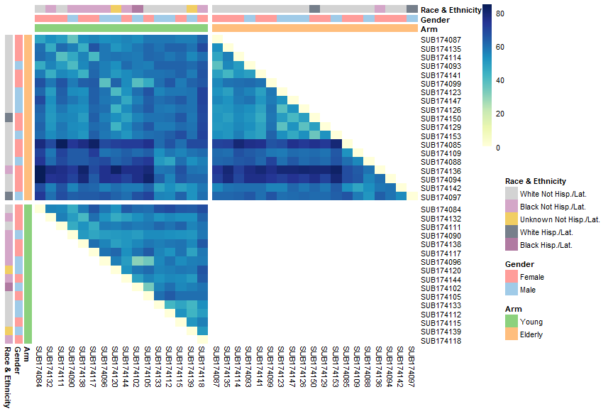

```r
library(tidyverse)
library(labelled)
library(gtsummary)
library(dendextend)
library(pheatmap)
library(RColorBrewer)

knitr::opts_chunk$set(echo = TRUE, warning = FALSE, message = FALSE, error = FALSE)

list("style_number-arg:big.mark" = "") %>% set_gtsummary_theme()

# Данные https://www.immunespace.org/project/home/Integrative_Public_Study/begin.view?SDY=IS2

# all_noNorm_withResponse_eset <- readRDS("data/all_noNorm_withResponse_eset.Rds")
all_noNorm_withResponse_eset <- readRDS(file.path("..", "data", "all_noNorm_withResponse_eset.Rds"))

# Данные по участникам исследования SDY984

df_subj <- all_noNorm_withResponse_eset@phenoData@data %>%
  filter(study_accession == "SDY984")

  # Данные на момент baseline (0 days) для описательной статистики
df_subj_baseline <- df_subj %>%
  filter(study_time_collected == 0) %>% 
  transmute(participant_id, 
            arm_accession = factor(arm_accession, c("ARM3536", "ARM3537"),
                                   c("Young", "Elderly")), 
            age = age_imputed,
            gender = factor(gender), 
            race = fct_infreq(factor(race)),
            ethnicity = factor(ethnicity, c("Not Hispanic or Latino", "Hispanic or Latino")),
            MFC = ImmResp_baseline_value_MFC)

var_label(df_subj_baseline) <-
  list(arm_accession = "Study arm",
       age = "Age, yrs",
       gender = "Gender",
       race = "Race",
       ethnicity = "Ethnicity",
       MFC = "MFC")

# Данные по экспрессии генов на момент baseline (0 days) 
# для участников исследования SDY984

expr_baseline_t <- all_noNorm_withResponse_eset@assayData$exprs
expr_baseline_t <- expr_baseline_t[,df_subj$uid[df_subj$study_time_collected == 0]]

  # Уберём гены с пропусками по экспрессии
expr_baseline_t <- expr_baseline_t[apply(expr_baseline_t, 1, 
                                         function(x) sum(is.na(x))) != ncol(expr_baseline_t), ]

  # Матрица экспрессий --> датафрейм
expr_baseline <- expr_baseline_t %>%
  t() %>%
  as_tibble(rownames = "uid") %>% 
  mutate(participant_id = substr(uid, 1, 13)) %>%
  left_join(df_subj_baseline %>% select(participant_id, arm_accession), by = "participant_id") %>%
  select(participant_id, arm_accession, everything())

  # Сравним средние значения экспрессий между группами Young и Elderly
  # с помощью t-тестов и коррекцией p-values по Benjamini & Hochberg (контроль FDR)
ttest_p <- map2_dbl(expr_baseline[,-c(1:3)], expr_baseline["arm_accession"], ~t.test(.x ~ .y)$p.value)
ttest_p_adj <- p.adjust(ttest_p, "BH")
ttest_p <- tibble(gene = attr(ttest_p, "names"),
                  p = ttest_p,
                  p_adj = ttest_p_adj) %>%
  arrange(p_adj) %>%
  mutate(p_group = cut(p, c(0, 0.05, 1.1), c("< 0.05", ">= 0.05"), right = FALSE),
         p_adj_group = cut(p_adj, c(0, 0.05, 1.1), c("< 0.05", ">= 0.05"), right = FALSE))
```


## **Descriptive statistics, baseline**

<br>

Описательная статистика по подгруппам участников исследования (Young - добровольцы в возрасте 25 лет, Elderly - добровольцы в возрасте 60 лет) на начало исследования (до вакцинации):


```r
tbl_summary(
  df_subj_baseline %>% select(-participant_id, -age), 
  by = "arm_accession",
  type = all_continuous() ~ "continuous2",
  statistic = list(
    all_continuous() ~ c("{mean} ({sd})", 
                         "{median} ({p25}-{p75})", "{min}-{max}")),
  digits = list(MFC ~ rep(1,7)),
  missing_text = "Н.Д.") %>%
  add_stat_label(label = list(
    all_continuous() ~ c("Mean (SD)",
                         "Median (Q1-Q3)", "Range"))) %>%
  add_p(test = list(
    all_continuous() ~ "t.test"),
    pvalue_fun = function(x) style_pvalue(x, digits = 3)) %>%
  modify_header(all_stat_cols() ~ "**{level}**\nN = {n}") %>%
  modify_footnote(p.value ~ "Gender, Race - Pearson's Chi-squared test; Ethnicity - Fisher's exact test; MFC - Welch two sample t-test") %>%
  bold_labels() %>%
  as_kable_extra() %>% 
  kableExtra::row_spec(0, bold = TRUE) %>%
  kableExtra::kable_classic(full_width = FALSE, position = "left",
                            html_font = "\"Source Sans Pro\", helvetica, sans-serif")
```

<table style='NAborder-bottom: 0; font-family: "Source Sans Pro", helvetica, sans-serif; width: auto !important; ' class=" lightable-classic">
 <thead>
  <tr>
   <th style="text-align:left;font-weight: bold;"> Characteristic </th>
   <th style="text-align:center;font-weight: bold;"> Young<br>N = 16 </th>
   <th style="text-align:center;font-weight: bold;"> Elderly<br>N = 19 </th>
   <th style="text-align:center;font-weight: bold;"> p-value </th>
  </tr>
 </thead>
<tbody>
  <tr>
   <td style="text-align:left;"> <span style=" font-weight: bold;    ">Gender, n (%)</span> </td>
   <td style="text-align:center;">  </td>
   <td style="text-align:center;">  </td>
   <td style="text-align:center;"> 0.678 </td>
  </tr>
  <tr>
   <td style="text-align:left;padding-left: 2em;" indentlevel="1"> Female </td>
   <td style="text-align:center;"> 9 (56%) </td>
   <td style="text-align:center;"> 12 (63%) </td>
   <td style="text-align:center;">  </td>
  </tr>
  <tr>
   <td style="text-align:left;padding-left: 2em;" indentlevel="1"> Male </td>
   <td style="text-align:center;"> 7 (44%) </td>
   <td style="text-align:center;"> 7 (37%) </td>
   <td style="text-align:center;">  </td>
  </tr>
  <tr>
   <td style="text-align:left;"> <span style=" font-weight: bold;    ">Race, n (%)</span> </td>
   <td style="text-align:center;">  </td>
   <td style="text-align:center;">  </td>
   <td style="text-align:center;"> &lt;0.001 </td>
  </tr>
  <tr>
   <td style="text-align:left;padding-left: 2em;" indentlevel="1"> White </td>
   <td style="text-align:center;"> 6 (38%) </td>
   <td style="text-align:center;"> 18 (95%) </td>
   <td style="text-align:center;">  </td>
  </tr>
  <tr>
   <td style="text-align:left;padding-left: 2em;" indentlevel="1"> Black or African American </td>
   <td style="text-align:center;"> 8 (50%) </td>
   <td style="text-align:center;"> 1 (5.3%) </td>
   <td style="text-align:center;">  </td>
  </tr>
  <tr>
   <td style="text-align:left;padding-left: 2em;" indentlevel="1"> Unknown </td>
   <td style="text-align:center;"> 2 (12%) </td>
   <td style="text-align:center;"> 0 (0%) </td>
   <td style="text-align:center;">  </td>
  </tr>
  <tr>
   <td style="text-align:left;"> <span style=" font-weight: bold;    ">Ethnicity, n (%)</span> </td>
   <td style="text-align:center;">  </td>
   <td style="text-align:center;">  </td>
   <td style="text-align:center;"> &gt;0.999 </td>
  </tr>
  <tr>
   <td style="text-align:left;padding-left: 2em;" indentlevel="1"> Not Hispanic or Latino </td>
   <td style="text-align:center;"> 15 (94%) </td>
   <td style="text-align:center;"> 17 (89%) </td>
   <td style="text-align:center;">  </td>
  </tr>
  <tr>
   <td style="text-align:left;padding-left: 2em;" indentlevel="1"> Hispanic or Latino </td>
   <td style="text-align:center;"> 1 (6.2%) </td>
   <td style="text-align:center;"> 2 (11%) </td>
   <td style="text-align:center;">  </td>
  </tr>
  <tr>
   <td style="text-align:left;"> <span style=" font-weight: bold;    ">MFC</span> </td>
   <td style="text-align:center;">  </td>
   <td style="text-align:center;">  </td>
   <td style="text-align:center;"> 0.142 </td>
  </tr>
  <tr>
   <td style="text-align:left;padding-left: 2em;" indentlevel="1"> Mean (SD) </td>
   <td style="text-align:center;"> 13.8 (1.0) </td>
   <td style="text-align:center;"> 13.2 (1.3) </td>
   <td style="text-align:center;">  </td>
  </tr>
  <tr>
   <td style="text-align:left;padding-left: 2em;" indentlevel="1"> Median (Q1-Q3) </td>
   <td style="text-align:center;"> 13.6 (13.0-14.4) </td>
   <td style="text-align:center;"> 13.2 (12.8-13.7) </td>
   <td style="text-align:center;">  </td>
  </tr>
  <tr>
   <td style="text-align:left;padding-left: 2em;" indentlevel="1"> Range </td>
   <td style="text-align:center;"> 12.6-15.6 </td>
   <td style="text-align:center;"> 10.6-15.9 </td>
   <td style="text-align:center;">  </td>
  </tr>
</tbody>
<tfoot><tr><td style="padding: 0; " colspan="100%">
<sup>1</sup> Gender, Race - Pearson's Chi-squared test; Ethnicity - Fisher's exact test; MFC - Welch two sample t-test</td></tr></tfoot>
</table>

<br>

Исходный датасет (по всем исследованиям для различных вакцин) включал в себя данные по экспрессии 26925 генов, для нашего исследования удалим те гены, данные по экспрессии которых на начало исследования были пропущены для всех участников исследования - останется матрица экспрессий по 16146 генам. Сравним средние значения по ним между группами испытуемых с помощью t-теста Уэлша, скорректируем полученные p-values по методу Бенджамини-Хохберга (для контроля FDR) и посмотрим, по какому количеству генов средние значения экспрессий различаются на уровне значимости 5% без коррекции и с коррекцией.


```r
tbl_summary(ttest_p %>% select(p_group, p_adj_group), 
            label = list(p_group = "P-value",
                         p_adj_group = "Adjusted p-value")) %>%
  modify_footnote(everything() ~ NA) %>%
  modify_header(label ~ "") %>%
  bold_labels() %>%
  as_kable_extra() %>% 
  kableExtra::row_spec(0, bold = TRUE) %>%
  kableExtra::kable_classic(full_width = FALSE, position = "left",
                            html_font = "\"Source Sans Pro\", helvetica, sans-serif")
```

<table class=" lightable-classic" style='font-family: "Source Sans Pro", helvetica, sans-serif; width: auto !important; '>
 <thead>
  <tr>
   <th style="text-align:left;font-weight: bold;">  </th>
   <th style="text-align:center;font-weight: bold;"> N = 16146 </th>
  </tr>
 </thead>
<tbody>
  <tr>
   <td style="text-align:left;"> <span style=" font-weight: bold;    ">P-value</span> </td>
   <td style="text-align:center;">  </td>
  </tr>
  <tr>
   <td style="text-align:left;padding-left: 2em;" indentlevel="1"> &lt; 0.05 </td>
   <td style="text-align:center;"> 4373 (27%) </td>
  </tr>
  <tr>
   <td style="text-align:left;padding-left: 2em;" indentlevel="1"> &gt;= 0.05 </td>
   <td style="text-align:center;"> 11773 (73%) </td>
  </tr>
  <tr>
   <td style="text-align:left;"> <span style=" font-weight: bold;    ">Adjusted p-value</span> </td>
   <td style="text-align:center;">  </td>
  </tr>
  <tr>
   <td style="text-align:left;padding-left: 2em;" indentlevel="1"> &lt; 0.05 </td>
   <td style="text-align:center;"> 1910 (12%) </td>
  </tr>
  <tr>
   <td style="text-align:left;padding-left: 2em;" indentlevel="1"> &gt;= 0.05 </td>
   <td style="text-align:center;"> 14236 (88%) </td>
  </tr>
</tbody>
</table>

<br>

Можно также оценить расстояния (будем использовать Евклидовы) между всеми парами наблюдений по экспрессиям всем генов и визуально оценить, насколько "далеки" друг от друга наблюдения внутри исследуемых групп и при сравнении испытуемых между группами:


```r
ann_rc <- df_subj_baseline %>% 
  transmute(Arm = arm_accession,
            Gender = gender,
            `Race & Ethnicity` = fct_infreq(factor(case_when(
              race == "White" & ethnicity == "Hispanic or Latino" ~ "White Hisp./Lat.",
              race == "White" & ethnicity != "Hispanic or Latino" ~ "White Not Hisp./Lat.",
              race == "Unknown" ~ "Unknown Not Hisp./Lat.",
              ethnicity == "Hispanic or Latino" ~ "Black Hisp./Lat.",
              ethnicity != "Hispanic or Latino" ~ "Black Not Hisp./Lat.")))) %>% 
  as.data.frame()
row.names(ann_rc) <- gsub(".984", "", df_subj_baseline$participant_id)

ann_clrs <- list(Arm = c("#8CD17D", "#FFBE7D") %>% setNames(levels(df_subj_baseline$arm_accession)),
                 Gender = c("#FF9D9A", "#A0CBE8") %>% setNames(levels(df_subj_baseline$gender)),
                 `Race & Ethnicity` = c("#D3D3D3", "#D4A6C8", "#F1CE63", "#767F8B", "#B07AA1") %>% 
                   setNames(levels(ann_rc$`Race & Ethnicity`)))

colnames(expr_baseline_t) <- gsub(".984(.+)", "", colnames(expr_baseline_t))
samp_dist0 <- dist(t(expr_baseline_t))
samp_dist <- as.matrix(samp_dist0)
samp_dist[ann_rc$Arm == "Young", ann_rc$Arm != "Young"] <- NA
samp_dist[ann_rc$Arm == "Young",
          ann_rc$Arm == "Young"][lower.tri(samp_dist[ann_rc$Arm == "Young",
                                                     ann_rc$Arm == "Young"])] <- NA
samp_dist[ann_rc$Arm != "Young",
          ann_rc$Arm != "Young"][upper.tri(samp_dist[ann_rc$Arm != "Young",
                                                     ann_rc$Arm != "Young"])] <- NA
samp_dist <- samp_dist[, c(which(ann_rc$Arm == "Young"),which(ann_rc$Arm != "Young"))]

pheatmap(samp_dist,
         cluster_rows = F,
         cluster_cols = F,
         color = colorRampPalette(brewer.pal(9, "YlGnBu"))(100),
         annotation_row = ann_rc,
         annotation_col = ann_rc,
         annotation_colors = ann_clrs,
         gaps_row = sum(ann_rc$Arm != "Young"),
         gaps_col = sum(ann_rc$Arm == "Young"),
         na_col = NA, border_color = NA,
         fontsize_row = 8, fontsize_col = 8, fontsize = 8)
```

<!-- -->

<br>

Исходя из визуального анализа я бы сказала, что испытуемые внутри молодой когорты отличаются друг от друга по экспрессии генов меньше, чем испытуемые внутри старшей возрастной группы. В последней явно выделяется несколько человек, которые по экспрессии отличаются как от остальных "одногруппников", так и от представителей молодого поколения.

<br>

