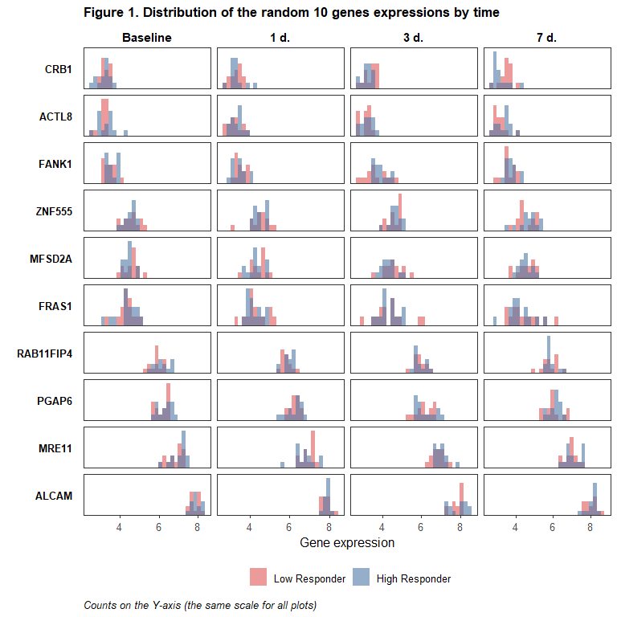

<style type="text/css">

.math {
font-size: small;
}
</style>


```r
library(tidyverse)
library(labelled)
library(gtsummary)
library(ggbeeswarm)
library(ggrepel)
library(lemon)
library(lme4)
library(lmerTest)
library(marginaleffects)
library(broom.mixed)
if (identical(knitr::opts_knit$get("rmarkdown.runtime"), "shiny")) {
  library(shiny)
}

knitr::opts_chunk$set(echo = TRUE, warning = FALSE, message = FALSE, error = FALSE)

list("style_number-arg:big.mark" = "") %>% set_gtsummary_theme()

# Данные https://www.immunespace.org/project/home/Integrative_Public_Study/begin.view?SDY=IS2

# all_noNorm_withResponse_eset <- readRDS("data/all_noNorm_withResponse_eset.Rds")
all_noNorm_withResponse_eset <- readRDS(file.path("..", "data", "all_noNorm_withResponse_eset.Rds"))

# Данные по участникам исследования SDY984 -------------------------------------

df_subj <- all_noNorm_withResponse_eset@phenoData@data %>%
  filter(study_accession == "SDY984")

timepoints <- unique(df_subj$study_time_collected)

# Данные на момент baseline (0 days) для описательной статистики
# за исключением moderate response по MFC_p40
df_subj_baseline <- df_subj %>%
  filter(study_time_collected == 0 & MFC_p40 != "moderateResponder") %>% 
  transmute(participant_id, 
            arm_accession = factor(arm_accession, c("ARM3536", "ARM3537"),
                                   c("Young", "Elderly")), 
            age = age_imputed,
            gender = factor(gender), 
            race = fct_infreq(factor(race)),
            ethnicity = factor(ethnicity, c("Not Hispanic or Latino", "Hispanic or Latino")),
            igg_baseline = ImmResp_baseline_value_MFC,
            response = factor(MFC_p40, c("lowResponder", "highResponder"), 
                              c("Low Responder", "High Responder")))

var_label(df_subj_baseline) <-
  list(arm_accession = "Study arm",
       age = "Age, yrs",
       gender = "Gender",
       race = "Race",
       ethnicity = "Ethnicity",
       igg_baseline = "log2(IgG), ELISA",
       response = "Vaccination response (MFC_p40)")

# Данные по экспрессии генов для участников исследования SDY984 ----------------

expr_t <- all_noNorm_withResponse_eset@assayData$exprs
expr_t <- expr_t[,df_subj$uid]

# Матрица экспрессий --> датафрейм
# (только по испытуемым с moderate response по MFC_p40)
# + характеристики испытуемых
df_expr <- expr_t %>%
  t() %>%
  as_tibble(rownames = "uid") %>%
  separate(uid, c("participant_id", "time", NA, NA), 
           sep = "_", remove = FALSE, convert = TRUE) %>%
  filter(participant_id %in% df_subj_baseline$participant_id) %>%
  left_join(df_subj %>% 
              transmute(uid, igg_postvax = ImmResp_postVax_value_MFC), 
            by = "uid") %>%
  left_join(df_subj_baseline %>% 
              select(participant_id, arm_accession, gender, race, ethnicity, 
                     igg_baseline, response), 
            by = "participant_id")

# Уберём гены с одними пропусками по экспрессии
df_expr <- df_expr %>%
  select(function(x) sum(is.na(x)) != length(x)) %>%
  select(participant_id, uid, arm_accession, gender, race, ethnicity,
         igg_baseline, time, response, igg_postvax, everything())

# Длинный датафрейм
df_expr_long <- df_expr %>%
  pivot_longer(A1BG:last_col(), names_to = "gene", values_to = "expr")
```

## **Общая информация**

<br>

В данном отчёте будут представлены результаты анализа данных по экспрессии генов среди добровольцев, прошедших **вакцинацию от varicella zoster живой ослабленной вакциной Zostavax**. Данные были получены в рамках исследования [SDY984](https://www.immport.org/shared/study/SDY984) по программе [Human Immunology Project Consortium (HIPC)](https://www.immunespace.org/) и выложены на страничке [HIPC-II Immune Signatures Data Resource and Analysis (IS2)](https://datatools.immunespace.org/project/home/Integrative_Public_Study/begin.view?SDY=IS2) (доступны для скачивания после регистрации).

**Задача нашего исследовательского проекта** - определить, динамика экспрессии каких именно генов связана с иммунным ответом на вакцинацию и в какие сигнальные пути входят эти гены. Эту задачу можно решать двояко: 

- с помощью оценки различий в экспрессии генов между испытуемыми, ответившими и не ответившими на вакцинацию, 

- с помощью оценки взаимосвязи между экспрессией генов (и её динамикой) и итоговым ответом на вакцинацию.

<br>

В выбранном нами исследовании **экспрессия генов** оценивалась у 35 добровольцев до вакцинации и в нескольких точках (1, 3, 7 дней) после неё. 

Также по завершении исследования (через 30 дней от начала) оценивался **ответ на вакцинацию** с разбиением испытуемых на 3 группы: low, moderate и high responder. Разбиение проводилось отдельно по нескольким критериям, но мы для определения статуса по ответу на вакцинацию будем использовать только MFC_p40. MFC - это maximum fold change (максимальная кратность изменения) для титра антител после вакцинации по сравнению с состоянием до неё (максимальная - поскольку [некоторые вакцины в исследовании содержали несколько штаммов вируса и/или титр антител для них определялся с помощью нескольких тестов](https://www.nature.com/articles/s41590-022-01329-5)). В исследовании, с данными которого мы будем работать, штамм был один и титр антител измерялся с помощью одной методики - оценки уровня IgG методом ELISA (enzyme-linked immunosorbent assay, или иммуноферментный анализ, ИФА), поэтому в данном случае MFC фактически равна просто кратности изменения титра антител (формально это $log_2(FC)$). Что касается разбивки на группы по ответу, то оно [производилось по перцентилям полученного значения для MFC](https://www.nature.com/articles/s41590-022-01329-5), а именно: для MFC_p40 все испытуемые, у кого MFC был меньше или равен 40-му перцентилю, считались low responder'ами, с MFC, равным или большим 60-го перцентиля - high responder'ами, остальные - moderate responder'ами (детали можно найти, в том числе, в [функциях](https://rdrr.io/github/RGLab/ImmuneSignatures2/src/R/immuneResponseCallGeneration.R), которые использовались для получения того датасета, с которым мы работаем).

В целях упрощения в рамках нашего исследовательского проекта мы исключим из анализа испытуемых с moderate ответом на вакцинацию (7 чел.), а также, на начальном этапе, не будем делать разбивку в зависимости от ветви исследования (возрастной группы испытуемых).

<br>

## **Описательная статистика: характеристики испытуемых, baseline**

<br>

Описательная статистика по участникам исследования на начало исследования (до вакцинации) представлена в Table 1 ниже. Поскольку мы планируем в своём исследовании, в том числе, сравнивать испытуемых с разным уровнем ответа по экспрессии генов, данные в таблице представлены в разбивке по этим группам. Young - добровольцы в возрасте 25 лет, Elderly - добровольцы в возрасте 60 лет.


```r
tbl_summary(
  df_subj_baseline %>% select(-participant_id, -age), 
  by = "response",
  type = all_continuous() ~ "continuous2",
  statistic = list(
    all_continuous() ~ c("{mean} ({sd})", 
                         "{median} ({p25}-{p75})", "{min}-{max}")),
  digits = list(igg_baseline ~ rep(1,7)),
  missing_text = "Н.Д.") %>%
  add_stat_label(label = list(
    all_continuous() ~ c("Mean (SD)",
                         "Median (Q1-Q3)", "Range"))) %>%
  add_p(pvalue_fun = function(x) style_pvalue(x, digits = 3)) %>%
  modify_header(all_stat_cols() ~ "**{level}**<br>N = {n}") %>%
  modify_footnote(p.value ~ "p-value: Study arm, Gender, Race - Pearson's Chi-squared test;<br> 
                  Ethnicity - Fisher's exact test; IgG - Mann-Whitney test") %>%
  bold_labels() %>%
  as_kable_extra(caption = "<b>Table 1. Baseline characteristics of the study participants.</b>",
                 addtl_fmt = FALSE) %>% 
  kableExtra::row_spec(0, bold = TRUE) %>%
  kableExtra::kable_classic(full_width = FALSE, position = "left", font_size = 14,
                            html_font = "\"Source Sans Pro\", helvetica, sans-serif")
```

<table style='NAborder-bottom: 0; font-size: 14px; font-family: "Source Sans Pro", helvetica, sans-serif; width: auto !important; ' class=" lightable-classic">
<caption style="font-size: initial !important;"><b>Table 1. Baseline characteristics of the study participants.</b></caption>
 <thead>
  <tr>
   <th style="text-align:left;font-weight: bold;"> Characteristic </th>
   <th style="text-align:center;font-weight: bold;"> Low Responder<br>N = 14 </th>
   <th style="text-align:center;font-weight: bold;"> High Responder<br>N = 14 </th>
   <th style="text-align:center;font-weight: bold;"> p-value </th>
  </tr>
 </thead>
<tbody>
  <tr>
   <td style="text-align:left;"> <span style=" font-weight: bold;    ">Study arm, n (%)</span> </td>
   <td style="text-align:center;">  </td>
   <td style="text-align:center;">  </td>
   <td style="text-align:center;"> 0.023 </td>
  </tr>
  <tr>
   <td style="text-align:left;padding-left: 2em;" indentlevel="1"> Young </td>
   <td style="text-align:center;"> 4 (29%) </td>
   <td style="text-align:center;"> 10 (71%) </td>
   <td style="text-align:center;">  </td>
  </tr>
  <tr>
   <td style="text-align:left;padding-left: 2em;" indentlevel="1"> Elderly </td>
   <td style="text-align:center;"> 10 (71%) </td>
   <td style="text-align:center;"> 4 (29%) </td>
   <td style="text-align:center;">  </td>
  </tr>
  <tr>
   <td style="text-align:left;"> <span style=" font-weight: bold;    ">Gender, n (%)</span> </td>
   <td style="text-align:center;">  </td>
   <td style="text-align:center;">  </td>
   <td style="text-align:center;"> 0.430 </td>
  </tr>
  <tr>
   <td style="text-align:left;padding-left: 2em;" indentlevel="1"> Female </td>
   <td style="text-align:center;"> 8 (57%) </td>
   <td style="text-align:center;"> 10 (71%) </td>
   <td style="text-align:center;">  </td>
  </tr>
  <tr>
   <td style="text-align:left;padding-left: 2em;" indentlevel="1"> Male </td>
   <td style="text-align:center;"> 6 (43%) </td>
   <td style="text-align:center;"> 4 (29%) </td>
   <td style="text-align:center;">  </td>
  </tr>
  <tr>
   <td style="text-align:left;"> <span style=" font-weight: bold;    ">Race, n (%)</span> </td>
   <td style="text-align:center;">  </td>
   <td style="text-align:center;">  </td>
   <td style="text-align:center;"> 0.516 </td>
  </tr>
  <tr>
   <td style="text-align:left;padding-left: 2em;" indentlevel="1"> White </td>
   <td style="text-align:center;"> 11 (79%) </td>
   <td style="text-align:center;"> 8 (57%) </td>
   <td style="text-align:center;">  </td>
  </tr>
  <tr>
   <td style="text-align:left;padding-left: 2em;" indentlevel="1"> Black or African American </td>
   <td style="text-align:center;"> 2 (14%) </td>
   <td style="text-align:center;"> 5 (36%) </td>
   <td style="text-align:center;">  </td>
  </tr>
  <tr>
   <td style="text-align:left;padding-left: 2em;" indentlevel="1"> Unknown </td>
   <td style="text-align:center;"> 1 (7.1%) </td>
   <td style="text-align:center;"> 1 (7.1%) </td>
   <td style="text-align:center;">  </td>
  </tr>
  <tr>
   <td style="text-align:left;"> <span style=" font-weight: bold;    ">Ethnicity, n (%)</span> </td>
   <td style="text-align:center;">  </td>
   <td style="text-align:center;">  </td>
   <td style="text-align:center;"> &gt;0.999 </td>
  </tr>
  <tr>
   <td style="text-align:left;padding-left: 2em;" indentlevel="1"> Not Hispanic or Latino </td>
   <td style="text-align:center;"> 12 (86%) </td>
   <td style="text-align:center;"> 13 (93%) </td>
   <td style="text-align:center;">  </td>
  </tr>
  <tr>
   <td style="text-align:left;padding-left: 2em;" indentlevel="1"> Hispanic or Latino </td>
   <td style="text-align:center;"> 2 (14%) </td>
   <td style="text-align:center;"> 1 (7.1%) </td>
   <td style="text-align:center;">  </td>
  </tr>
  <tr>
   <td style="text-align:left;"> <span style=" font-weight: bold;    ">log2(IgG), ELISA</span> </td>
   <td style="text-align:center;">  </td>
   <td style="text-align:center;">  </td>
   <td style="text-align:center;"> 0.012 </td>
  </tr>
  <tr>
   <td style="text-align:left;padding-left: 2em;" indentlevel="1"> Mean (SD) </td>
   <td style="text-align:center;"> 14.2 (1.0) </td>
   <td style="text-align:center;"> 13.0 (1.3) </td>
   <td style="text-align:center;">  </td>
  </tr>
  <tr>
   <td style="text-align:left;padding-left: 2em;" indentlevel="1"> Median (Q1-Q3) </td>
   <td style="text-align:center;"> 14.0 (13.4-15.1) </td>
   <td style="text-align:center;"> 13.0 (12.6-13.7) </td>
   <td style="text-align:center;">  </td>
  </tr>
  <tr>
   <td style="text-align:left;padding-left: 2em;" indentlevel="1"> Range </td>
   <td style="text-align:center;"> 12.8-15.9 </td>
   <td style="text-align:center;"> 10.6-15.4 </td>
   <td style="text-align:center;">  </td>
  </tr>
</tbody>
<tfoot><tr><td style="padding: 0; " colspan="100%">
<sup>1</sup> p-value: Study arm, Gender, Race - Pearson's Chi-squared test;<br> 
Ethnicity - Fisher's exact test; IgG - Mann-Whitney test</td></tr></tfoot>
</table>

<br>

## **Описательная статистика: экспрессии генов**

<br>

Исходный датасет включал в себя данные по экспрессии 26925 генов, для нашего исследования удалим те гены, данные по экспрессии которых были пропущены для всех участников исследования, включенных в анализ, - останется матрица экспрессий по 16146 генам. По данным об экспрессии этих генов во _всех_ точках исследования оценим медианное абсолютное отклонение (MAD) и оставим для дальнейшего анализа 5 тыс. генов с наибольшим его значением (гены с наибольшей вариацией экспрессии).


```r
genes_maxvar <- df_expr_long %>%
  group_by(gene) %>%
  summarise(mad_expr = mad(expr)) %>%
  arrange(-mad_expr) %>%
  slice_head(n = 5000)

df_expr_long_fin <- df_expr_long %>%
  filter(gene %in% genes_maxvar$gene) %>%
  mutate(timeF = factor(time, timepoints, ifelse(timepoints == 0, "Baseline", paste(timepoints, "d."))))
```

<br>

Ниже представлены гистограммы для экспрессий во всех точках исследования для 10 генов, случайно выбранных из оставшихся 5 тысяч. 

_Если вы запускаете этот отчёт в RStudio и активизируете в опциях .rmd-файла (yaml) опцию `runtime: shiny`, то сможете генерировать случайные выборки по 10 генов по нажатию кнопки New sample и видеть соответствующие графики_


```r
# Мини-приложение для генерации случайной выборки из 10 генов и отрисовки по ним гистограмм
# запускается через Rmarkdown c опцией runtime: shiny в yaml

shinyApp(
  ui = fluidPage(
    actionButton("samp", "New sample"),
    p(""),
    plotOutput("plot_sample")
  ),
  server = function(input, output) {
    
    rvalues <- reactiveValues(new_plot = 1)
    replot <- observeEvent(input$samp, {
      rvalues$new_plot <- rvalues$new_plot + 1
    })
    
    output$plot_sample <- renderPlot({
      req(rvalues$new_plot)
      df_expr_long_fin %>% 
        filter(gene %in% sample(genes_maxvar$gene, size = 10, replace = FALSE)) %>%
        mutate(gene = fct_reorder(gene, expr, max)) %>% 
        ggplot(aes(x = expr, fill = response)) +
        geom_histogram(alpha = 0.6, position = "identity") +
        scale_y_continuous(expand = c(0,0,0.1,0)) +
        scale_fill_manual(values = c("#E15759", "#4E79A7")) +
        facet_grid(gene ~ timeF, scales = "free_x", switch = "y") +
        labs(x = "Gene expression", y = element_blank(), fill = element_blank(),
             title = "Figure 1. Distribution of the random 10 genes expressions by time",
             caption = "Counts on the Y-axis (the same scale for all plots)") +
        theme_bw(base_size = 12) +
        theme(legend.position = "bottom",
              panel.grid.major = element_blank(),
              panel.grid.minor = element_blank(),
              axis.text.y = element_blank(),
              axis.ticks.y = element_blank(),
              strip.background = element_blank(),
              strip.placement = "outside",
              strip.text.y.left = element_text(size = 10, color = "black", face = "bold", angle = 0, hjust = 1),
              strip.text.x = element_text(size = 11, color = "black", face = "bold"),
              plot.title = element_text(size = 13, face = "bold"),
              plot.caption = element_text(size = 10, color = "black", face = "italic", hjust = 0))
    }, width = 600, height = 650)
  }, options = list(height = 700, width = 650))
```


```r
# Гистограммы для экспрессий для случайной выборки из 10 генов
# (для html отчёта)

df_expr_long_fin %>% 
  filter(gene %in% sample(genes_maxvar$gene, size = 10, replace = FALSE)) %>%
  mutate(gene = fct_reorder(gene, expr, max)) %>% 
  ggplot(aes(x = expr, fill = response)) +
  geom_histogram(alpha = 0.6, position = "identity") +
  scale_y_continuous(expand = c(0,0,0.1,0)) +
  scale_x_continuous(breaks = seq(0, max(df_expr_long_fin$expr), 2)) +
  scale_fill_manual(values = c("#E15759", "#4E79A7")) +
  facet_grid(gene ~ timeF, scales = "free", switch = "y") +
  labs(x = "Gene expression", y = element_blank(), fill = element_blank(),
       title = "Figure 1. Distribution of the random 10 genes expressions by time",
       caption = "Counts on the Y-axis (the same scale for all plots)") +
  theme_bw(base_size = 12) +
  theme(legend.position = "bottom",
        panel.grid.major = element_blank(),
        panel.grid.minor = element_blank(),
        axis.text.y = element_blank(),
        axis.ticks.y = element_blank(),
        strip.background = element_blank(),
        strip.placement = "outside",
        strip.text.y.left = element_text(size = 10, color = "black", face = "bold", angle = 0, hjust = 1),
        strip.text.x = element_text(size = 11, color = "black", face = "bold"),
        plot.title = element_text(size = 13, face = "bold"),
        plot.caption = element_text(size = 10, color = "black", face = "italic", hjust = 0))
```

<!-- -->

<br>

## **Сравнение экспрессии генов между группами испытуемых с разным уровнем ответа: попарные тесты Манна-Уитни**

<br>

В каждой точке исследования по каждому гену сравним экспрессии генов между группами со слабым и сильным ответом на вакцинацию с помощью теста Манна-Уитни, скорректируем полученные p-values по методу Бенджамини-Хохберга (для контроля FDR, в каждой точке отдельно) и посмотрим, по какому количеству генов средние значения экспрессий различаются на уровне значимости 5% без коррекции и с коррекцией.


```r
mwtest_p <- suppressWarnings({df_expr_long_fin %>%
    group_by(time, timeF, gene) %>%
    summarise(p = wilcox.test(expr ~ response)$p.value) %>%
    group_by(time) %>%
    mutate(p_adj = p.adjust(p, method = "BH")) %>%
    ungroup() %>%
    arrange(p_adj) %>%
    mutate(p_group = cut(p, c(0, 0.05, 1.1), c("< 0.05", "$\\geq$ 0.05"), right = FALSE),
           p_adj_group = cut(p_adj, c(0, 0.05, 1.1), c("< 0.05", "$\\geq$ 0.05"), right = FALSE))
})

tbl_summary(
  mwtest_p %>% select(timeF, p_group, p_adj_group), 
  by = "timeF",
  label = list(p_group = "P-value",
               p_adj_group = "Adjusted p-value")) %>%
  modify_footnote(everything() ~ NA) %>%
  modify_header(label ~ "", 
                all_stat_cols() ~ "**{level}**") %>%
  bold_labels() %>%
  as_kable_extra(caption = "<b>Table 2. P-values of the Mann-Whitney tests before and after<br>
                 adjustment under Benjamini & Hochberg method</b>,<br>number of genes (%)") %>% 
  kableExtra::row_spec(0, bold = TRUE) %>%
  kableExtra::kable_classic(full_width = FALSE, position = "left", font_size = 14,
                            html_font = "\"Source Sans Pro\", helvetica, sans-serif")
```

<table class=" lightable-classic" style='font-size: 14px; font-family: "Source Sans Pro", helvetica, sans-serif; width: auto !important; '>
<caption style="font-size: initial !important;">
<b>Table 2. P-values of the Mann-Whitney tests before and after<br>
                 adjustment under Benjamini &amp; Hochberg method</b>,<br>number of genes (%)</caption>
 <thead>
  <tr>
   <th style="text-align:left;font-weight: bold;">  </th>
   <th style="text-align:center;font-weight: bold;"> Baseline </th>
   <th style="text-align:center;font-weight: bold;"> 1 d. </th>
   <th style="text-align:center;font-weight: bold;"> 3 d. </th>
   <th style="text-align:center;font-weight: bold;"> 7 d. </th>
  </tr>
 </thead>
<tbody>
  <tr>
   <td style="text-align:left;"> <span style=" font-weight: bold;    ">P-value</span> </td>
   <td style="text-align:center;">  </td>
   <td style="text-align:center;">  </td>
   <td style="text-align:center;">  </td>
   <td style="text-align:center;">  </td>
  </tr>
  <tr>
   <td style="text-align:left;padding-left: 2em;" indentlevel="1"> &lt; 0.05 </td>
   <td style="text-align:center;"> 356 (7.1%) </td>
   <td style="text-align:center;"> 423 (8.5%) </td>
   <td style="text-align:center;"> 353 (7.1%) </td>
   <td style="text-align:center;"> 426 (8.5%) </td>
  </tr>
  <tr>
   <td style="text-align:left;padding-left: 2em;" indentlevel="1"> $\geq$ 0.05 </td>
   <td style="text-align:center;"> 4644 (93%) </td>
   <td style="text-align:center;"> 4577 (92%) </td>
   <td style="text-align:center;"> 4647 (93%) </td>
   <td style="text-align:center;"> 4574 (91%) </td>
  </tr>
  <tr>
   <td style="text-align:left;"> <span style=" font-weight: bold;    ">Adjusted p-value</span> </td>
   <td style="text-align:center;">  </td>
   <td style="text-align:center;">  </td>
   <td style="text-align:center;">  </td>
   <td style="text-align:center;">  </td>
  </tr>
  <tr>
   <td style="text-align:left;padding-left: 2em;" indentlevel="1"> &lt; 0.05 </td>
   <td style="text-align:center;"> 0 (0%) </td>
   <td style="text-align:center;"> 0 (0%) </td>
   <td style="text-align:center;"> 0 (0%) </td>
   <td style="text-align:center;"> 2 (&lt;0.1%) </td>
  </tr>
  <tr>
   <td style="text-align:left;padding-left: 2em;" indentlevel="1"> $\geq$ 0.05 </td>
   <td style="text-align:center;"> 5000 (100%) </td>
   <td style="text-align:center;"> 5000 (100%) </td>
   <td style="text-align:center;"> 5000 (100%) </td>
   <td style="text-align:center;"> 4998 (100%) </td>
  </tr>
</tbody>
</table>

<br>

Оказалось всего 2 гена, экспрессии которых статистически значимым образом (на 5%-ном уровне значимости) различаются между сильными и слабыми респондерами, оба наблюдения относятся к точке 7 дней после вакцинации, - это гены IL2RA, RIC3. Статистика по экспрессии этих генов в группах в каждой точке исследования представлена в таблице ниже.


```r
tbl_data <- df_expr %>%
  select(time, response, all_of(mwtest_p$gene[mwtest_p$p_adj < 0.05])) %>%
  nest_by(time) %>%
  mutate(tbl = list(
    tbl_summary(data, 
                by = "response",
                type = all_continuous() ~ "continuous2",
                statistic = list(
                  all_continuous() ~ c("{mean} ({sd})", "{median} ({p25}-{p75})", 
                                       "{min}-{max}")),
                digits = list(all_continuous() ~ rep(1,7))) %>%
      add_stat_label(label = list(
        all_continuous() ~ c("Mean (SD)", "Median (Q1-Q3)", "Range"))) %>%
      add_p(pvalue_fun = function(x) style_pvalue(x, digits = 3)) %>%
      modify_header(all_stat_cols() ~ "**{level}**<br>N = {n}",
                    label ~ "**Gene/ Statistic**") %>%
      modify_footnote(p.value ~ "p-value: Mann-Whitney test with Benjamini & Hochberg correction") %>%
      bold_labels()))

for (i in tbl_data$time) {
  tb <- tbl_data$tbl[tbl_data$time == i][[1]]
  tb$table_body$p.value[tb$table_body$row_type == "label"] <-
    mwtest_p$p_adj[mwtest_p$time == i][match(names(tbl_data$data[tbl_data$time == i][[1]])[-1], 
                                             mwtest_p$gene[mwtest_p$time == i])]
  tbl_data$tbl[tbl_data$time == i][[1]] <- tb
}

tbl_merge(tbl_data$tbl, tab_spanner = sprintf("<b>%s</b>", levels(mwtest_p$timeF))) %>%
  as_kable_extra(caption = "<b>Table 3. Descriptive statistics for genes with expressions,
  significantly different between low and high responders.</b>", addtl_fmt = FALSE) %>% 
  kableExtra::row_spec(0, bold = TRUE) %>%
  kableExtra::kable_classic(full_width = FALSE, position = "left", font_size = 11,
                            html_font = "\"Source Sans Pro\", helvetica, sans-serif")
```

<table style='NAborder-bottom: 0; font-size: 11px; font-family: "Source Sans Pro", helvetica, sans-serif; width: auto !important; ' class=" lightable-classic">
<caption style="font-size: initial !important;"><b>Table 3. Descriptive statistics for genes with expressions,
  significantly different between low and high responders.</b></caption>
 <thead>
<tr>
<th style="empty-cells: hide;border-bottom:hidden;" colspan="1"></th>
<th style="border-bottom:hidden;padding-bottom:0; padding-left:3px;padding-right:3px;text-align: center; " colspan="3"><div style="border-bottom: 1px solid #ddd; padding-bottom: 5px; "><b>Baseline</b></div></th>
<th style="border-bottom:hidden;padding-bottom:0; padding-left:3px;padding-right:3px;text-align: center; " colspan="3"><div style="border-bottom: 1px solid #ddd; padding-bottom: 5px; "><b>1 d.</b></div></th>
<th style="border-bottom:hidden;padding-bottom:0; padding-left:3px;padding-right:3px;text-align: center; " colspan="3"><div style="border-bottom: 1px solid #ddd; padding-bottom: 5px; "><b>3 d.</b></div></th>
<th style="border-bottom:hidden;padding-bottom:0; padding-left:3px;padding-right:3px;text-align: center; " colspan="3"><div style="border-bottom: 1px solid #ddd; padding-bottom: 5px; "><b>7 d.</b></div></th>
</tr>
  <tr>
   <th style="text-align:left;font-weight: bold;"> Gene/ Statistic </th>
   <th style="text-align:center;font-weight: bold;"> Low Responder<br>N = 14 </th>
   <th style="text-align:center;font-weight: bold;"> High Responder<br>N = 14 </th>
   <th style="text-align:center;font-weight: bold;"> p-value </th>
   <th style="text-align:center;font-weight: bold;"> Low Responder<br>N = 14 </th>
   <th style="text-align:center;font-weight: bold;"> High Responder<br>N = 14 </th>
   <th style="text-align:center;font-weight: bold;"> p-value </th>
   <th style="text-align:center;font-weight: bold;"> Low Responder<br>N = 14 </th>
   <th style="text-align:center;font-weight: bold;"> High Responder<br>N = 14 </th>
   <th style="text-align:center;font-weight: bold;"> p-value </th>
   <th style="text-align:center;font-weight: bold;"> Low Responder<br>N = 14 </th>
   <th style="text-align:center;font-weight: bold;"> High Responder<br>N = 14 </th>
   <th style="text-align:center;font-weight: bold;"> p-value </th>
  </tr>
 </thead>
<tbody>
  <tr>
   <td style="text-align:left;"> <span style=" font-weight: bold;    ">IL2RA</span> </td>
   <td style="text-align:center;">  </td>
   <td style="text-align:center;">  </td>
   <td style="text-align:center;"> 0.914 </td>
   <td style="text-align:center;">  </td>
   <td style="text-align:center;">  </td>
   <td style="text-align:center;"> 0.902 </td>
   <td style="text-align:center;">  </td>
   <td style="text-align:center;">  </td>
   <td style="text-align:center;"> 0.893 </td>
   <td style="text-align:center;">  </td>
   <td style="text-align:center;">  </td>
   <td style="text-align:center;"> 0.017 </td>
  </tr>
  <tr>
   <td style="text-align:left;padding-left: 2em;" indentlevel="1"> Mean (SD) </td>
   <td style="text-align:center;"> 4.9 (0.4) </td>
   <td style="text-align:center;"> 5.1 (0.4) </td>
   <td style="text-align:center;">  </td>
   <td style="text-align:center;"> 5.0 (0.4) </td>
   <td style="text-align:center;"> 5.1 (0.4) </td>
   <td style="text-align:center;">  </td>
   <td style="text-align:center;"> 5.1 (0.4) </td>
   <td style="text-align:center;"> 5.0 (0.5) </td>
   <td style="text-align:center;">  </td>
   <td style="text-align:center;"> 4.8 (0.3) </td>
   <td style="text-align:center;"> 5.4 (0.4) </td>
   <td style="text-align:center;">  </td>
  </tr>
  <tr>
   <td style="text-align:left;padding-left: 2em;" indentlevel="1"> Median (Q1-Q3) </td>
   <td style="text-align:center;"> 5.1 (4.7-5.1) </td>
   <td style="text-align:center;"> 4.9 (4.8-5.4) </td>
   <td style="text-align:center;">  </td>
   <td style="text-align:center;"> 5.1 (4.7-5.2) </td>
   <td style="text-align:center;"> 5.2 (4.8-5.4) </td>
   <td style="text-align:center;">  </td>
   <td style="text-align:center;"> 5.1 (4.8-5.4) </td>
   <td style="text-align:center;"> 4.9 (4.6-5.3) </td>
   <td style="text-align:center;">  </td>
   <td style="text-align:center;"> 4.8 (4.7-5.0) </td>
   <td style="text-align:center;"> 5.3 (5.3-5.5) </td>
   <td style="text-align:center;">  </td>
  </tr>
  <tr>
   <td style="text-align:left;padding-left: 2em;" indentlevel="1"> Range </td>
   <td style="text-align:center;"> 4.3-5.3 </td>
   <td style="text-align:center;"> 4.5-5.9 </td>
   <td style="text-align:center;">  </td>
   <td style="text-align:center;"> 4.3-5.6 </td>
   <td style="text-align:center;"> 4.7-6.0 </td>
   <td style="text-align:center;">  </td>
   <td style="text-align:center;"> 4.3-5.8 </td>
   <td style="text-align:center;"> 4.4-5.8 </td>
   <td style="text-align:center;">  </td>
   <td style="text-align:center;"> 4.1-5.2 </td>
   <td style="text-align:center;"> 4.8-6.2 </td>
   <td style="text-align:center;">  </td>
  </tr>
  <tr>
   <td style="text-align:left;"> <span style=" font-weight: bold;    ">RIC3</span> </td>
   <td style="text-align:center;">  </td>
   <td style="text-align:center;">  </td>
   <td style="text-align:center;"> 0.752 </td>
   <td style="text-align:center;">  </td>
   <td style="text-align:center;">  </td>
   <td style="text-align:center;"> 0.401 </td>
   <td style="text-align:center;">  </td>
   <td style="text-align:center;">  </td>
   <td style="text-align:center;"> 0.739 </td>
   <td style="text-align:center;">  </td>
   <td style="text-align:center;">  </td>
   <td style="text-align:center;"> 0.017 </td>
  </tr>
  <tr>
   <td style="text-align:left;padding-left: 2em;" indentlevel="1"> Mean (SD) </td>
   <td style="text-align:center;"> 4.2 (0.3) </td>
   <td style="text-align:center;"> 4.4 (0.3) </td>
   <td style="text-align:center;">  </td>
   <td style="text-align:center;"> 4.1 (0.3) </td>
   <td style="text-align:center;"> 4.4 (0.5) </td>
   <td style="text-align:center;">  </td>
   <td style="text-align:center;"> 4.2 (0.5) </td>
   <td style="text-align:center;"> 4.5 (0.4) </td>
   <td style="text-align:center;">  </td>
   <td style="text-align:center;"> 3.8 (0.3) </td>
   <td style="text-align:center;"> 4.5 (0.3) </td>
   <td style="text-align:center;">  </td>
  </tr>
  <tr>
   <td style="text-align:left;padding-left: 2em;" indentlevel="1"> Median (Q1-Q3) </td>
   <td style="text-align:center;"> 4.1 (4.0-4.4) </td>
   <td style="text-align:center;"> 4.3 (4.2-4.6) </td>
   <td style="text-align:center;">  </td>
   <td style="text-align:center;"> 4.1 (3.9-4.2) </td>
   <td style="text-align:center;"> 4.4 (4.2-4.7) </td>
   <td style="text-align:center;">  </td>
   <td style="text-align:center;"> 4.1 (3.8-4.6) </td>
   <td style="text-align:center;"> 4.5 (4.3-4.6) </td>
   <td style="text-align:center;">  </td>
   <td style="text-align:center;"> 3.7 (3.6-3.9) </td>
   <td style="text-align:center;"> 4.4 (4.2-4.7) </td>
   <td style="text-align:center;">  </td>
  </tr>
  <tr>
   <td style="text-align:left;padding-left: 2em;" indentlevel="1"> Range </td>
   <td style="text-align:center;"> 3.7-4.7 </td>
   <td style="text-align:center;"> 3.8-5.0 </td>
   <td style="text-align:center;">  </td>
   <td style="text-align:center;"> 3.5-4.6 </td>
   <td style="text-align:center;"> 3.1-5.1 </td>
   <td style="text-align:center;">  </td>
   <td style="text-align:center;"> 3.4-5.0 </td>
   <td style="text-align:center;"> 3.7-5.2 </td>
   <td style="text-align:center;">  </td>
   <td style="text-align:center;"> 3.3-4.4 </td>
   <td style="text-align:center;"> 4.1-4.9 </td>
   <td style="text-align:center;">  </td>
  </tr>
</tbody>
<tfoot><tr><td style="padding: 0; " colspan="100%">
<sup>1</sup> p-value: Mann-Whitney test with Benjamini &amp; Hochberg correction</td></tr></tfoot>
</table>

<br>

В качестве иллюстрации:


```r
ggplot(df_expr_long_fin %>% filter(gene %in% mwtest_p$gene[mwtest_p$p_adj < 0.05]),
       aes(x = timeF, y = expr, color = response)) +
  geom_boxplot(position = position_dodge(0.8), width = 0.6) +
  geom_beeswarm(dodge.width = 0.8, groupOnX = TRUE, size = 1.5, alpha = 0.5) +
  scale_color_manual(values = c("#E15759", "#4E79A7")) +
  facet_rep_wrap(~ gene, repeat.tick.labels = TRUE) +
  labs(x = element_blank(), y = "Gene expression", color = element_blank(),
       title = "Figure 2. Expressions by time and response status",
       subtitle = "Genes with significantly different expressions (at least at one point)",
       caption = "Elements of the boxplots:
       bold line inside the box is a median value (Q2), 
       lower and upper bounds of the box are Q1 and Q3 values, respectively, 
       lower whisker is a value for the smallest observation greater than or equal to Q1-1.5*IQR,
       upper whisker is a value for the largest observation less than or equal to Q3+1.5*IQR.") +
  theme_classic(base_size = 12) +
  theme(legend.position = "bottom",
        panel.grid.major.y = element_line(size = .2, color = '#ebebebFF'),
        panel.grid.minor.y = element_line(size = .1, color = '#ebebebFF'),
        axis.text.x = element_text(face = "bold"),
        strip.background = element_blank(),
        strip.text.x = element_text(size = 12, color = "black", face = "bold"),
        plot.title = element_text(size = 13, face = "bold"),
        plot.subtitle = element_text(size = 10),
        plot.caption = element_text(color = "black", face = "italic", hjust = 0))
```

<!-- -->

<br>

[**IL2RA**](https://en.wikipedia.org/wiki/IL2RA) - это ген, который кодирует белок Interleukin-2 receptor alpha chain (CD25), [Interleukin-2 (IL-2)](https://en.wikipedia.org/wiki/Interleukin_2) - это белок, который регулирует активность лейкоцитов, отвечающих за иммунитет. 

[**RIC3**](https://en.wikipedia.org/wiki/RIC3) - это ген, который кодирует chaperon белок RIC-3, отвечающий за резистентность к ингибиторам cholinesterase 3. [Chaperon белки](https://en.wikipedia.org/wiki/Chaperone_(protein)) участвуют в сворачивании или разворачивании крупных белков или макромолекулярных белковых комплексов.

<br>

## **Сравнение экспрессии генов между группами испытуемых с разным уровнем ответа: линейная смешанная модель**

<br>


```r
# Функция для нахождения квантилей по эмпирической функции распределения --> 
# ранги
rank_quant <- function(x) {
  ecdf_x <- ecdf(x)
  ecdf_inv <- function(v) {quantile(x, v)}
  qq <- ecdf_inv(ecdf_x(x))
  qq <- names(qq) %>% gsub("%", "", .) %>% as.numeric(.)/100
  qq
}

# "Квантильные" ранги для экспрессий генов для каждого испытуемого в каждой точке
df_expr_long_fin <- df_expr_long_fin %>%
  group_by(participant_id, time) %>%
  mutate(expr_rank = rank_quant(expr)) %>%
  ungroup()
```

### **Описание модели**

<br>

Для каждого гена из ранее отобранных 5 тыс. оценим линейные смешанные модели (linear mixed effects model) вида:

1. $expr_{it} = \beta_0 + \beta_{0i} + \beta_1*time_{j} + \beta_2*response_{i} + \epsilon_{ij}$, где:

- $expr_{ij}$ - экспрессия гена для _i_-го испытуемого в точке исследования _j_; оценим отдельно спецификации с:

- исходными данными по экспрессии, 

- рангами генов по экспрессии, рассчитанными для каждого испытуемого в каждой точке исследования как квантиль эмпрической функции распределения экспрессий по всем генам для этого испытуемого в этой точке, 

- $time_j$ - точка исследования (в днях от вакцинации), 

- $response_i$ - ответ на вакцинацию _i_-го испытумого (1 - high responder, 0 - low responder), 

- $\beta_0$ - константа регрессионного уравнения (глобальное среднее значение экспрессии гена по всем испытуемым во всех точках),

- $\beta_{0i}$ - случайный эффект (моделируется для каждого испытуемого, имеет нормальное распределение со средним 0 и дисперсией, которая характеризует вариацию средней экспрессии гена между испытуемыми вокруг глоабального среднего значения),

- $\beta_{1,2}$ - коэффициенты регрессионного уравнения (фиксированные эффекты времени от вакцинации и ответа на неё), 

- $\epsilon_{ij}$ - случайный остаток регрессионного уравнения (предполагается, что имеет нормальное распределение со средним значением 0 и дисперсией, которая характеризует вариацию экспрессии для каждого испытуемого (во времени)).

Оценка коэффициента $\beta_2$ данного регрессионного уравнения может интерпретироваться как **средний предельный эффект (average marginal/ treatment effect, AME/ ATE)** ответа на вакцинацию в отношении экспрессии, т.е. в нашем случае она покажет, на сколько отличается среднее значение экспрессии гена среди high респондеров по сравнению с low респондерами по всем точкам исследования.

<br>

2. $expr_{it} = \beta_0 + \beta_{0i} + \beta_1*time_{j} + \beta_2*response_{i} + \beta_3*time_j * response_i + \epsilon_{ij}$, где по сравнению с предыдущей спецификацией добавляется $time_j * response_i$ - пересечение времени анализа и статуса по ответу на вакцинацию.

При оценке этой модели предполагается, что эффект ответа на вацинацию может меняться во времени (и, аналогично, динамика экспрессии может быть разной в зависимости от ответа на вакцинацию). Оценка коэффициента $\beta_2$ в этой модели может быть интерпретирована как ATE в точке baseline (когда $time=0$), т.е. как baseline разница в средней экспрессии гена между теми, кто в дальнейшем был отнесен к high респондерам, и теми, кто нет. Для остальных временных точек ATE может быть получен из соотношения $\beta_2 + \beta_3*time$. Соответственно оценку коэффициента $\beta_3$ мы можем интерпретировать как изменение ATE ответа при увеличении времени от вакцинации на 1 день.

<br>

Оценка линейных смешанных моделей будет выполнена с помощью функции `lmer` из пакета `lme4`, а оценка средних предельных эффектов - с помощью функции `marginaleffects` из одноименного пакета. Заметим, что если в `marginaleffects` после модели с эффектами пересечения задать конкретные временные точки (например, $time=$ 0,1,3,7), то для переменной $response$ мы получим искомые значения ATE в этих точках ($\beta_2 + \beta_3*time$) вместе с их p-values, а если этого не сделать, то на выходе для переменной $response$ мы получим оценку ATE, равную оценке коэффициента $\beta_2$ из модели без эффекта пересечения.


```r
# Оценка линейных смешанных моделей

lmer_q <- purrr::quietly(.f = lmer)

lmer_fits <- df_expr_long_fin %>%
  nest(-gene) %>%
  mutate(
    fit_noint = map(data, ~ lmer_q(expr ~ time + response + (1|participant_id), .x)),
    fit_int = map(data, ~ lmer_q(expr ~ time*response + (1|participant_id), .x)),
    fit_nointrank = map(data, ~ lmer_q(expr_rank ~ time + response + (1|participant_id), .x)),
    fit_intrank = map(data, ~ lmer_q(expr_rank ~ time*response + (1|participant_id), .x)))

lmer_res <- lmer_fits %>%
  mutate(
    beta_p_noint = map(fit_noint, ~ .x$result %>% broom.mixed::tidy()),
    beta_p_nointrank = map(fit_nointrank, ~ .x$result %>% broom.mixed::tidy()),
    beta_p_int = map(fit_int, ~ .x$result %>% broom.mixed::tidy()),
    beta_p_intrank = map(fit_intrank, ~ .x$result %>% broom.mixed::tidy()),
    ame_int = map(
      fit_int, ~ .x$result %>% 
        marginaleffects(newdata = datagrid(time = timepoints, response = levels(df_subj_baseline$response)), eps = 0.001)),
    ame_intrank = map(
      fit_intrank, ~ .x$result %>% 
        marginaleffects(newdata = datagrid(time = timepoints, response = levels(df_subj_baseline$response)), eps = 0.001))) %>%
  select(-data, -contains("fit"))

# # Сохраним результаты в rds (без отправки на github, т.к. файл большой)
# # saveRDS(lmer_res, "OlgaMironenko/res/lmer_res.rds")
# # lmer_res <- readRDS("OlgaMironenko/res/lmer_res.rds")
# # lmer_res <- readRDS(file.path("..", "OlgaMironenko", "res", "lmer_res.rds"))

# Betas and p-values для моделей с пересечением

lmer_betas_ps_int <- full_join(
  lmer_res %>%
    select(gene, beta_p_int) %>%
    unnest(beta_p_int) %>%
    select(gene, term, estimate, std.error, p.value),
  lmer_res %>%
    select(gene, beta_p_intrank) %>%
    unnest(beta_p_intrank) %>%
    select(gene, term, estimate, std.error, p.value),
  by = c("gene", "term"), suffix = c("_init", "_rank"))
  
# AMEs/ATEs and p-values для моделей с пересечением

lmer_ames_ps_int <- full_join(
  lmer_res %>%
    select(gene, ame_int) %>%
    unnest(ame_int) %>%
    select(gene, term, time, response, dydx, std.error, p.value),
  lmer_res %>%
    select(gene, ame_intrank) %>%
    unnest(ame_intrank) %>%
    select(gene, term, time, response, dydx, std.error, p.value),
  by = c("gene", "term", "time", "response"), suffix = c("_init", "_rank"))

# Betas and p-values для моделей без пересечения

lmer_betas_ps_noint <- full_join(
  lmer_res %>%
    select(gene, beta_p_noint) %>%
    unnest(beta_p_noint) %>%
    select(gene, term, estimate, std.error, p.value),
  lmer_res %>%
    select(gene, beta_p_nointrank) %>%
    unnest(beta_p_nointrank) %>%
    select(gene, term, estimate, std.error, p.value),
  by = c("gene", "term"), suffix = c("_init", "_rank"))

# # Сохраним результаты в rds, чтобы при формировании отчёта не ждать оценки регрессий
saveRDS(lmer_betas_ps_int, "OlgaMironenko/res/lmer_betas_ps_int.rds")
saveRDS(lmer_betas_ps_noint, "OlgaMironenko/res/lmer_betas_ps_noint.rds")
saveRDS(lmer_ames_ps_int, "OlgaMironenko/res/lmer_ames_ps_int.rds")
```


<br>

### **Результаты оценки**

<br>

Начнем с того, что посмотрим, **является ли эффект пересечения ответа и времени статистически значимым** в моделях с первичными оценками экспрессий и их рангами, т.е. меняется ли значимым образом разница между испытуемыми с разным уровнем ответа во времени. Для этого изобразим диаграммы рассеяния для каждой спецификации, где покажем значения p-value: по оси X - для основного эффекта ответа (оценки коэффициента $\beta_2$), по оси Y - для эффекта пересечения ответа со временем (оценки коэффициента $\beta_3$). Для большей наглядности будем использовать $-log_{10}$-преобразование для обоих p-values.


```r
critv <- -log10(0.05)

lmer_p_int_plt <- lmer_betas_ps_int %>%
  filter(grepl("response", term)) %>%
  transmute(gene, term = ifelse(grepl("time", term), "b3", "b2"), p.value_init, p.value_rank) %>%
  pivot_longer(cols = contains("p.value"), names_to = "model", values_to = "p",
               names_pattern = "p.value_(.+)") %>%
  mutate(p = -log10(p),
         model = factor(model, c("init", "rank"), c("Expression as is", "Rank by expression"))) %>%
  pivot_wider(id_cols = c(gene, model), names_from = "term", values_from = "p") %>%
  mutate(b2sig = b2 > critv, b3sig = b3 > critv) %>%
  group_by(model, b2sig, b3sig) %>%
  arrange(-pmax(b2, b3)) %>%
  mutate(sig = row_number() %in% c(1:5)) %>%
  ungroup() %>%
  mutate(sig = ifelse(!b2sig & !b3sig, FALSE, sig))

genes_sig <- list(
  init_int_b2b3 = lmer_p_int_plt %>% filter(b2sig & b3sig & model == "Expression as is") %>% pull(gene),
  rank_int_b2b3 = lmer_p_int_plt %>% filter(b2sig & b3sig & model != "Expression as is") %>% pull(gene),
  init_int_b2 = lmer_p_int_plt %>% filter(b2sig & !b3sig & model == "Expression as is") %>% pull(gene),
  rank_int_b2 = lmer_p_int_plt %>% filter(b2sig & !b3sig & model != "Expression as is") %>% pull(gene),
  init_int_b3 = lmer_p_int_plt %>% filter(!b2sig & b3sig & model == "Expression as is") %>% pull(gene),
  rank_int_b3 = lmer_p_int_plt %>% filter(!b2sig & b3sig & model != "Expression as is") %>% pull(gene)
)

ggplot(lmer_p_int_plt, aes(x = b2, y = b3)) +
  geom_point(aes(color = sig), alpha = 0.5, show.legend = FALSE) +
  geom_hline(aes(yintercept = 1), linewidth = 0.7, color = "#E15759", linetype = "dashed") +
  geom_vline(aes(xintercept = 1), linewidth = 0.7, color = "#E15759", linetype = "dashed") +
  geom_hline(aes(yintercept = critv), linewidth = 0.7, color = "#E15759") +
  geom_vline(aes(xintercept = critv), linewidth = 0.7, color = "#E15759") +
  geom_text_repel(aes(label = gene), lmer_p_int_plt %>% filter(sig), size = 3) +
  scale_x_continuous(expand = c(0.02, 0)) +
  scale_y_continuous(expand = c(0.02, 0)) +
  scale_color_manual(values = c("#86BCB6", "#F28E2B")) +
  facet_rep_wrap(~ model, nrow = 2, ncol = 2, repeat.tick.labels = TRUE) +
  labs(x = bquote(-log[10](p)~", response"), y = bquote(-log[10](p)~", response*time"), 
       title = "Figure 3. P-values for regression coefficients estimates",
       subtitle = "Linear mixed models with the interaction term",
       caption = "Solid red line is for p = 0.05, dashed red line is for p = 0.1. The higher the axis value, the lower is the p-value.") +
  theme_classic(base_size = 12) +
  theme(legend.position = "bottom",
        # axis.line = element_blank(),
        panel.grid.major = element_line(linewidth = .2, color = '#ebebebFF'),
        panel.grid.minor = element_line(linewidth = .1, color = '#ebebebFF'),
        strip.background = element_blank(),
        strip.text.x = element_text(size = 12, color = "black", face = "bold"),
        plot.title = element_text(size = 13, face = "bold"),
        plot.subtitle = element_text(size = 10),
        plot.caption = element_text(size = 10, color = "black", face = "italic", hjust = 0))
```

<!-- -->

Всего получается 49 генов в модели с исходными значениями для экспрессии и 42 гена в модели с рангами для экспрессии, для которых на 5%-ном уровне значимости статистически значим и основной эффект для ответа, и эффект пересечения ответа со временем, т.е. испытуемые с разным уровнем ответа значимо отличались не только по среднему значению экспрессии данных генов на момент baseline, но и по его динамике. При этом эти списки пересекаются по 28 генам: TUBB6, OLFM4, MCOLN3, EDN1, PLCXD1, CDK1, ABCA3, NLRP2, FAM87A, ADGRE1, ATP2C2, SLC66A1, SYT5, BNC2, NEFL, SEPTIN10, MMP8, GINS1, RNASE3, CLDN23, GPR174, CEACAM8, ADAMTS6, TBXT, ZNF124, REC8, SH2D1B, NFIB.

Ещё для 277 (260) генов в соответствующих моделях был значим только основной эффект, т.е. испытуемые с разным ответом на вакцинацию изначально различались по экспрессии этих генов, но её динамика была схожей в этих группах.

Ещё для 318 (337) генов в соответствующих моделях был значим только эффект пересечения, т.е. испытуемые с разным ответом на вакцинацию изначально не различались по экспрессии этих генов, но её динамика была в этих группах разной.

Выше на графике в каждой из этих трёх групп генов оранжевым выделено по 5 генов с самым маленьким p-value.

<br>

Следующим шагом в анализе результатов оценки линейных смешанных моделей будет **сопоставление статистической значимости среднего тритмент эффекта для ответа на вакцинацию с размером этого эффекта**. Для этого мы воспользуемся результатами оценки регрессий без эффектов пересечения и построим  volcano plot для пар из $-log_{10}$-преобразования p-value и соответствующей оценки коэффициента при переменной для ответа. Оранжевым выделим по 5 генов с p-value < 0.05 с самыми низкими и самыми высокими значениями оценки коэффициента.


```r
lmer_v_noint_plt <- lmer_betas_ps_noint %>%
  filter(grepl("response", term)) %>%
  pivot_longer(cols = -c(gene, term), names_pattern = "(estimate|std.error|p.value)_(.+)$",
               names_to = c(".value", "model")) %>%
  mutate(p.value = -log10(p.value),
         model = factor(model, c("init", "rank"), c("Expression as is", "Rank by expression")),
         b2sig = p.value > critv) %>%
  group_by(model, b2sig) %>%
  arrange(estimate) %>%
  mutate(sig = row_number() %in% c(1:5, (n()-4):n())) %>%
  ungroup() %>%
  mutate(sig = ifelse(!b2sig, FALSE, sig))

genes_sig$init_noint_b2 <- lmer_v_noint_plt %>% filter(b2sig & model == "Expression as is") %>% pull(gene)
genes_sig$rank_noint_b2 <- lmer_v_noint_plt %>% filter(b2sig & model != "Expression as is") %>% pull(gene)

ggplot(lmer_v_noint_plt, aes(x = estimate, y = p.value)) +
  geom_point(aes(color = sig), alpha = 0.5, show.legend = FALSE) +
  geom_hline(aes(yintercept = 1), linewidth = 0.7, color = "#E15759", linetype = "dashed") +
  geom_hline(aes(yintercept = critv), linewidth = 0.7, color = "#E15759") +
  geom_text_repel(aes(label = gene), lmer_v_noint_plt %>% filter(sig), size = 3) +
  scale_x_continuous(expand = c(0.02, 0)) +
  scale_y_continuous(expand = c(0.01, 0)) +
  scale_color_manual(values = c("#86BCB6", "#F28E2B")) +
  facet_rep_wrap(~ model, nrow = 2, ncol = 2, repeat.tick.labels = TRUE, scales = "free_x") +
  labs(x = bquote("ATE for response" ~ (hat(beta[2]))), y = bquote(-log[10](p[hat(beta[2])])), 
       title = "Figure 4. P-values vs. effect sizes for response",
       subtitle = "Linear mixed models without the interaction term",
       caption = "Solid red line is for p = 0.05, dashed red line is for p = 0.1. 
       The higher the Y axis value, the lower is the p-value.") +
  theme_classic(base_size = 12) +
  theme(legend.position = "bottom",
        panel.grid.major = element_line(linewidth = .2, color = '#ebebebFF'),
        panel.grid.minor = element_line(linewidth = .1, color = '#ebebebFF'),
        strip.background = element_blank(),
        strip.text.x = element_text(size = 12, color = "black", face = "bold"),
        plot.title = element_text(size = 13, face = "bold"),
        plot.subtitle = element_text(size = 10),
        plot.caption = element_text(size = 10, color = "black", face = "italic", hjust = 0))
```

<!-- -->

<br>

Наконец, можно изобразить графики, аналогичные приведённым выше, но для оценки **среднего тритмент эффекта для ответа в отдельных точках исследования**, полученных по результатам для регрессий с эффектами пересечения. На каждом графике оранжевым выделим по 5 генов с p-value < 0.05 с самыми низкими и самыми высокими значениями оценки коэффициента.


```r
lmer_v_int_plt <- lmer_ames_ps_int %>%
  filter(term == "response" & response == "Low Responder") %>%
  select(-term, -response) %>%
  pivot_longer(cols = -c(gene, time), names_pattern = "(dydx|std.error|p.value)_(.+)$",
               names_to = c(".value", "model")) %>%
  mutate(p.value = -log10(p.value),
         model = factor(model, c("init", "rank"), c("Expression as is", "Rank by expression")),
         time = factor(time, timepoints, labels = ifelse(timepoints == 0, "Baseline", paste(timepoints, "d."))),
         b2sig = p.value > critv) %>%
  group_by(model, time, b2sig) %>%
  arrange(dydx) %>%
  mutate(sig = row_number() %in% c(1:5, (n()-4):n())) %>%
  ungroup() %>%
  mutate(sig = ifelse(!b2sig, FALSE, sig))

genes_sig <- c(genes_sig, map2(
  rep(1:length(timepoints), 2),
  rep(levels(lmer_v_int_plt$model), each = length(timepoints)),
  ~ lmer_v_int_plt %>% 
    filter(time == levels(lmer_v_int_plt$time)[.x] & model == .y & b2sig) %>%
    pull(gene)) %>%
    setNames(sprintf("%s_int_ame%d", 
                     rep(c("init", "rank"), each = length(timepoints)), 
                     rep(timepoints, 2))))

ggplot(lmer_v_int_plt, aes(x = dydx, y = p.value)) +
  geom_point(aes(color = sig), alpha = 0.5, show.legend = FALSE) +
  geom_hline(aes(yintercept = 1), linewidth = 0.7, color = "#E15759", linetype = "dashed") +
  geom_hline(aes(yintercept = critv), linewidth = 0.7, color = "red") +
  geom_text_repel(aes(label = gene), lmer_v_int_plt %>% filter(sig), size = 3) +
  scale_x_continuous(expand = c(0.02, 0)) +
  scale_y_continuous(expand = c(0.02, 0)) +
  scale_color_manual(values = c("#86BCB6", "#F28E2B")) +
  facet_rep_grid(time ~ model, repeat.tick.labels = TRUE, scales = "free", switch = "y") +
  labs(x = "ATE for response at the time point", y = bquote(-log[10](p[ATE])), 
       title = "Figure 5. P-values vs. effect sizes for response",
       subtitle = "Average marginal effects after linear mixed models with the interaction term",
       caption = "Solid red line is for p = 0.05, dashed red line is for p = 0.1. 
       The higher the Y axis value, the lower is the p-value.") +
  theme_classic(base_size = 12) +
  theme(legend.position = "bottom",
        panel.grid.major = element_line(linewidth = .2, color = '#ebebebFF'),
        panel.grid.minor = element_line(linewidth = .1, color = '#ebebebFF'),
        strip.background = element_blank(),
        strip.text = element_text(size = 12, color = "black", face = "bold"),
        strip.placement = "outside",
        plot.title = element_text(size = 13, face = "bold"),
        plot.subtitle = element_text(size = 10),
        plot.caption = element_text(size = 10, color = "black", face = "italic", hjust = 0))
```

<!-- -->


<br>

## **Планы по дальнейшим этапам анализа**

<br>

- Определить, какое изменение экспрессии/ ранга гена по экспрессии считать клинически значимым, и соответствующим образом интерпретировать результаты, отраженные на volcano plots.

- Определить, в какие сигнальные пути входят гены, эффекты которых оказались статистически и/или клинически значимыми.

- Для каждого гена оценить логистическую регрессию для зависимости ответа на вакцинацию от его экспрессии в разных точках. Так мы выявим гены, экспрессия которых в какой-либо точке была связана с оцененным впоследствии ответом на вакцинацию. Для этих генов также определим, в какие сигнальные пути они входят.

<br>
