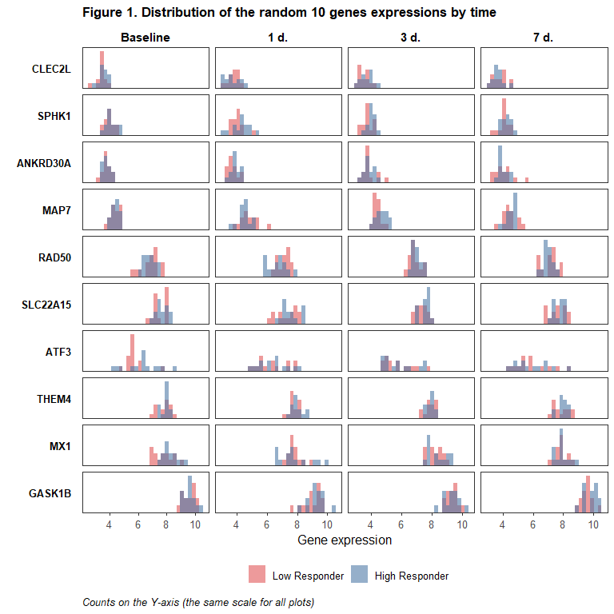
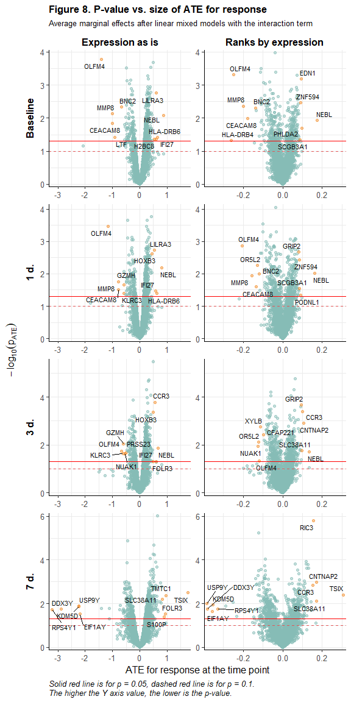
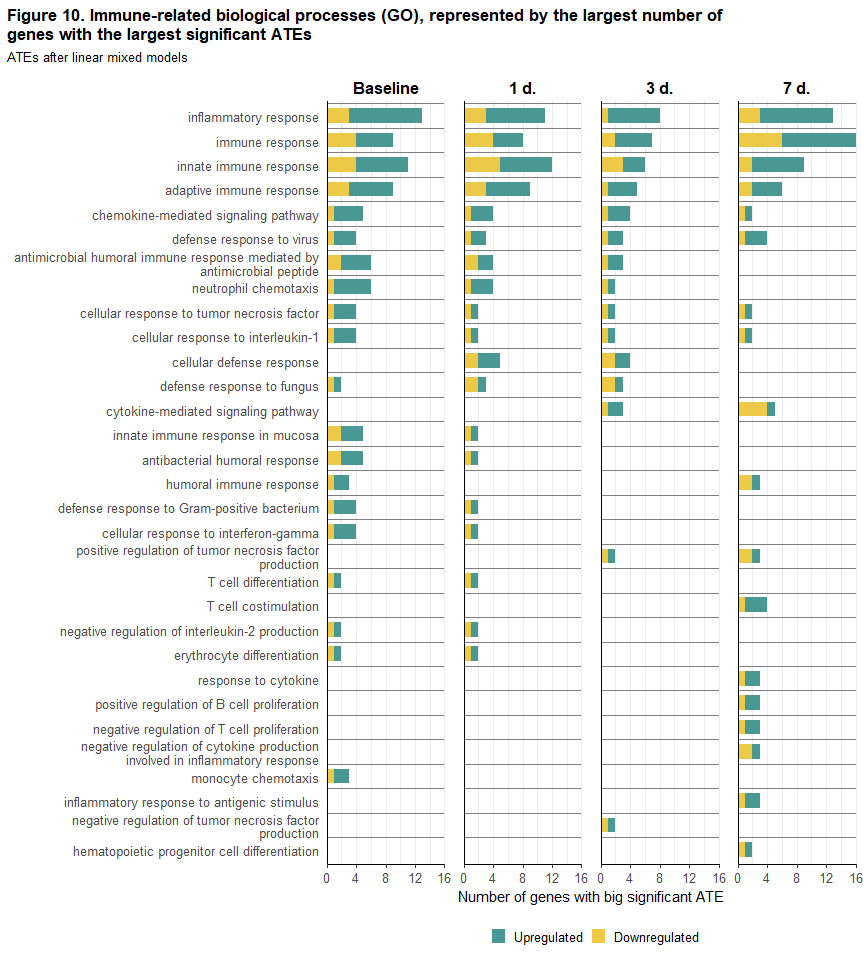
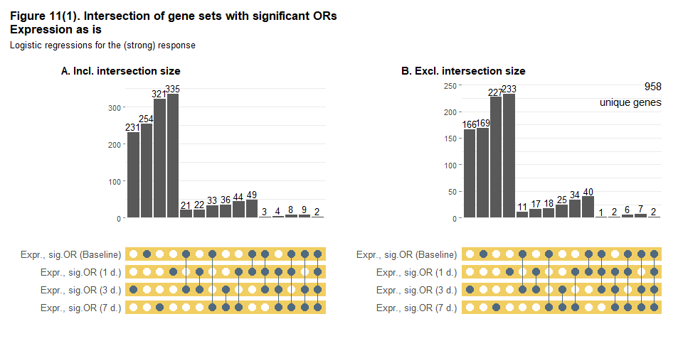
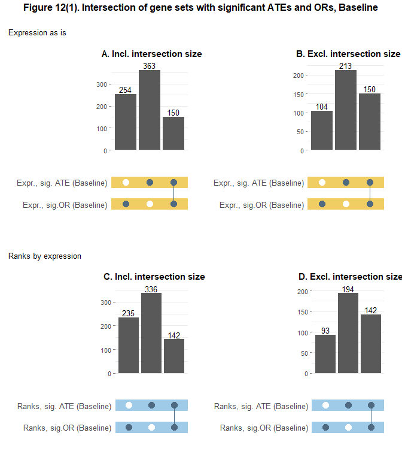
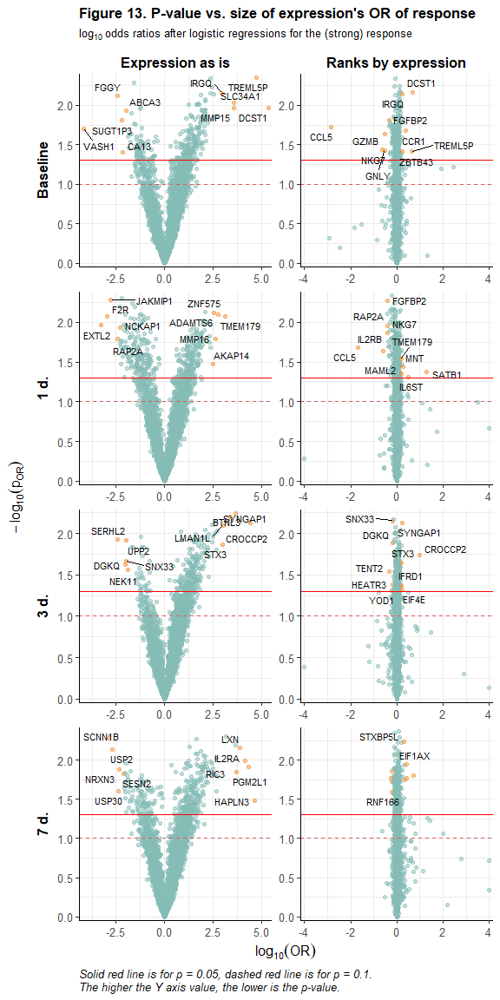

# **Identification of genes associated with immune response using open database ImmuneSpace**
### **Study SDY984 (immune response after varicella zoster vaccine)**

Authors: Olga Ilina, Olga Mironenko, Shakir Suleymanov

Bioinformatics Institute, Biostatistics and Analisys of Medical Data, Final project

Fall 2022

 

## **Introduction**

 

This study project deals with the data on the gene expression among volunteers before and after vaccination with the **live attenuated shingles vaccine Zostavax**, obtained from the open database [ImmuneSpace](https://www.immunespace.org/). We were interested in identifying genes with expression associated with the immune response, as well as in revealing signalling paths represented by these genes.

 

## **Aim, tasks and data**

 

**The aim of our project** is to find genes with expression significantly related to the strong immune response to Zoster vaccination, as well as those biological processes which are overrepresented by these genes. 

This aim can be achieved bt solving the following **tasks**: 

- Literature review on the basics of RNA transcription, process of immune response to vaccination and results of other studies realized on the same dataset.

- Descriptive statistics for the baseline characteristics of the study participants.

- Analysis of differential gene expression (revealing genes with expression that differs significantly between participants with the strong and weak response, before vaccination and over time after it).

- Analysis of the relation between the probability of the strong immune response and gene expression at different time points (revealing genes with expression associated with the probability of the strong response).

- Gathering annotations for biological processes represented by gene sets revealed at the previous two steps, listing the most represented biological processes.

 

Dataset for the project was obtained within the **study [SDY984](https://www.immport.org/shared/study/SDY984)** realized under the program of the [Human Immunology Project Consortium (HIPC)](https://www.immunespace.org/) and is available at [HIPC-II Immune Signatures Data Resource and Analysis (IS2)](https://datatools.immunespace.org/project/home/Integrative_Public_Study/begin.view?SDY=IS2) (can be downloaded after registration). Results of the original study made on the full data set were published in (Li et al. 2017).

Gene annotations will be obtained from the **[Gene Ontology (GO)](http://geneontology.org/)** - a special knowledge database containing the most up-to-date information concerning annotations on genes, gene products' molecular functions, biological processes accomplished by these products and cellular components inside which these functions are performed. In our research we will be mainly interested in biological processes represented by genes with differential expression.

 

In the dataset for the study SDY984 gene expression was assessed for 35 volunteers just before vaccination and in the several points (1, 3, 7 days) after it. 

**Response to vaccination** was evaluated at 30 days after vaccination. All participants were divided into 3 groups by the strength of their response: low, moderate and high responders. There were several alternative criteria (measures) for this division within the whole range of IS2 studies, but for our project we will use just one of the two available approaches - the MFC_p40 measure. MFC is the maximum fold change of the antibody titer after vaccination in comparison with its value before it (maximum - because some vaccines in some of the IS2 studies contained several strains of virus or atibody titer was measured by several tests for them (Fourati et al. 2022)). There was just one strain of Zoster in Zostavax vaccine and antibody titer in the SDY984 study was evaluated with just one test (IgG measurement with ELISA (enzyme-linked immunosorbent assay)), therefore in our case MFC is actually just singular fold change of the antibody titer at 30 days after vaccination (precisely, $log_2(FC)$). As for labelling the participants by the strength of their response, thresholds for their division into low, moderate and high responders were chosen as the 40th and 60th percentiles of MFC (Fourati et al. 2022), correspondingly (detailed information about that can be found, inter alia, inside the [scripts](https://rdrr.io/github/RGLab/ImmuneSignatures2/src/R/immuneResponseCallGeneration.R) which were used by researchers for preprocessing the data for the study we have chosen).

For simplification we **exclude moderate responders** (7 participants) from our analysis.

 

It should be noted that the **original study** (Li et al. 2017) utilized the broader data set in comparison with the one available to us (with respect to the greater number of volunteers, number of indicators, including those from metabolomics and flow cytometry, as well as number of time points when these variables were measured) and aimed at wider range of tasks with a bit different (in comparison with ours) emphasis, namely the estimate of the correlation between changes in metabolic indicators and changes of genes' and their modules' expression up to 180 days from vaccination. Therefore, the authors succeed in the detailed description of the immune response to Zostavax vaccine, without it dichotomization. In **our research** we set a narrower goal - to reveal those genes that are differentially expressed (DEGs) in participants depending on the strength of their immune response or expression of which is related (positively or negatively) to the probability of the strong response, and to find out those paths which are represented by these genes.

 

## **Literature review**

 

**Process of the immune response generation** can be described as follows (Pollard and Bijker 2021):

 

Or as follows (Desmet and Ishii 2012):

 

Vaccine contains patogene-associated molecular patterns (PAMPs) or can induce local reaction with releasing damage-associated molecular patterns (DAMPs). These patterns are recognized by pattern recognition receptors (PRRs), expressed by the cells of the **innate immune system**: macrophages, mast cells, neutrophils, dendritic cells (DCs). These cells do not reveal which particular infection or another pathogen has infiltrated the organism, but, depending on the certain cell, should destroy or absorb and split them into fragments and/ or signal about them to the cells of adpative immunity. **Adaptive immunity system** will then work to form/ initialize specific, target immune response against this certain pathogen, by antibody production, in particular. 

In addition, PAMPs and DAMPs can be detected by lymphoid cells of the innate immunity (e.g., NK cells), which induce the release of cytokines, that may cooperate in the activation and orientation of the dendritic cells (DCs). DCs plays the crucial role in transferring the signal from the innate to the adaptive immune system. Activated DCs migrate to lymphoid nodes where they represent fragments of the absorbed antigen to T-cells through special mechanism of co-stimulation of the T-cells receptors (TCR). At this stage one type of T-cells (T-killers, or CD8+ lymphocytes) interact with the type I molecules of the major histocompatibility complex (MHC-I) and, upon recognition of the alien MHC-I, release proteins that dissolve the pathogen, while another type of T-cells (T-helpers, or CD4+ lymphocytes) interact with the type II molecules of the MHC (MHC-II) and, upon recognition of the alien MHC-II, produce cytokines and chemokines. Depending on the cytokines mileau, CD4+ lymphocites can differentiate into different subtypes of T-helpers (Th) and T-follicular helpers (Tfh) - the latter activates B-cells which differentiate into plasma cells that produce antigen-specific antibodies. B-cells and CD8+ lymphocytes can differentiate into memory cells, which allow immune system more quickly recognize and response to familiar pathogen.

The given algorithm of the immune response to vaccination gives a rough notion about those biological processes which can be activated after vaccination. Based on that, in our analysis we will pay special attention to those **paths which are directly related to the immune response**, namely the offsprings of the following bioilgical processes from Gene Ontology (on the pictures below only their childrens are shown, click on pictures to enlarge them):

- immune system process ([GO:0002376](https://www.ebi.ac.uk/QuickGO/term/GO:0002376)) - any process involved in the development or functioning of the immune system, an organismal system for calibrated responses to potential internal or invasive threats.

- defense response ([GO:0006952](https://www.ebi.ac.uk/QuickGO/term/GO:0006952)) - reactions, triggered in response to the presence of a foreign body or the occurrence of an injury, which result in restriction of damage to the organism attacked or prevention/recovery from the infection caused by the attack.  

- cytokine production ([GO:0001816](https://www.ebi.ac.uk/QuickGO/term/GO:0001816)) - appearance of a cytokine due to biosynthesis or secretion following a cellular stimulus, resulting in an increase in its intracellular or extracellular levels. 

- response to cytokine ([GO:0034097](https://www.ebi.ac.uk/QuickGO/term/GO:0034097)) - any process that results in a change in state or activity of a cell or an organism (in terms of movement, secretion, enzyme production, gene expression, etc.) as a result of a cytokine stimulus.

- MHC protein complex assembly ([GO:0002396](https://www.ebi.ac.uk/QuickGO/term/GO:0002396)) - the aggregation, arrangement and bonding together of a set of components to form an MHC protein complex.

 

It is obvious that immune response activates other biological processes, besides mentioned above, e.g. cell activation, cell differentiation, cell-cell interaction, etc., but these paths can work not only in response to vaccination, therefore we will pay attention to them, but will not include them into the group of direct immune-related processes.

 

## **Descriptive statistics**

 

### **Participants' characteristics at the Baseline**

 

Descriptive statistics for participants' characteristics at the baseline (before vaccination) are presented in Table 1. As we are going to compare gene expression between participants with strong and weak response to Zostavax vaccine in our study, we showed statistics for these two groups in Table 1. Young are volunteers aged 25 years old, Elderly are volunteers aged 60 years old.

<table style='NAborder-bottom: 0; font-size: 14px; font-family: "Source Sans Pro", helvetica, sans-serif; width: auto !important; ' class=" lightable-classic">
<caption style="font-size: initial !important;"><b>Table 1. Baseline characteristics of the study participants.</b></caption>
 <thead>
  <tr>
   <th style="text-align:left;font-weight: bold;"> Characteristic </th>
   <th style="text-align:center;font-weight: bold;"> Low Responder N = 14 </th>
   <th style="text-align:center;font-weight: bold;"> High Responder N = 14 </th>
   <th style="text-align:center;font-weight: bold;"> p-value </th>
  </tr>
 </thead>
<tbody>
  <tr>
   <td style="text-align:left;"> Study arm, n (%) </td>
   <td style="text-align:center;">  </td>
   <td style="text-align:center;">  </td>
   <td style="text-align:center;"> 0.023 </td>
  </tr>
  <tr>
   <td style="text-align:left;padding-left: 2em;" indentlevel="1"> Young </td>
   <td style="text-align:center;"> 4 (29%) </td>
   <td style="text-align:center;"> 10 (71%) </td>
   <td style="text-align:center;">  </td>
  </tr>
  <tr>
   <td style="text-align:left;padding-left: 2em;" indentlevel="1"> Elderly </td>
   <td style="text-align:center;"> 10 (71%) </td>
   <td style="text-align:center;"> 4 (29%) </td>
   <td style="text-align:center;">  </td>
  </tr>
  <tr>
   <td style="text-align:left;"> Gender, n (%) </td>
   <td style="text-align:center;">  </td>
   <td style="text-align:center;">  </td>
   <td style="text-align:center;"> 0.430 </td>
  </tr>
  <tr>
   <td style="text-align:left;padding-left: 2em;" indentlevel="1"> Female </td>
   <td style="text-align:center;"> 8 (57%) </td>
   <td style="text-align:center;"> 10 (71%) </td>
   <td style="text-align:center;">  </td>
  </tr>
  <tr>
   <td style="text-align:left;padding-left: 2em;" indentlevel="1"> Male </td>
   <td style="text-align:center;"> 6 (43%) </td>
   <td style="text-align:center;"> 4 (29%) </td>
   <td style="text-align:center;">  </td>
  </tr>
  <tr>
   <td style="text-align:left;"> Race, n (%) </td>
   <td style="text-align:center;">  </td>
   <td style="text-align:center;">  </td>
   <td style="text-align:center;"> 0.516 </td>
  </tr>
  <tr>
   <td style="text-align:left;padding-left: 2em;" indentlevel="1"> White </td>
   <td style="text-align:center;"> 11 (79%) </td>
   <td style="text-align:center;"> 8 (57%) </td>
   <td style="text-align:center;">  </td>
  </tr>
  <tr>
   <td style="text-align:left;padding-left: 2em;" indentlevel="1"> Black or African American </td>
   <td style="text-align:center;"> 2 (14%) </td>
   <td style="text-align:center;"> 5 (36%) </td>
   <td style="text-align:center;">  </td>
  </tr>
  <tr>
   <td style="text-align:left;padding-left: 2em;" indentlevel="1"> Unknown </td>
   <td style="text-align:center;"> 1 (7.1%) </td>
   <td style="text-align:center;"> 1 (7.1%) </td>
   <td style="text-align:center;">  </td>
  </tr>
  <tr>
   <td style="text-align:left;"> Ethnicity, n (%) </td>
   <td style="text-align:center;">  </td>
   <td style="text-align:center;">  </td>
   <td style="text-align:center;"> &gt;0.999 </td>
  </tr>
  <tr>
   <td style="text-align:left;padding-left: 2em;" indentlevel="1"> Not Hispanic or Latino </td>
   <td style="text-align:center;"> 12 (86%) </td>
   <td style="text-align:center;"> 13 (93%) </td>
   <td style="text-align:center;">  </td>
  </tr>
  <tr>
   <td style="text-align:left;padding-left: 2em;" indentlevel="1"> Hispanic or Latino </td>
   <td style="text-align:center;"> 2 (14%) </td>
   <td style="text-align:center;"> 1 (7.1%) </td>
   <td style="text-align:center;">  </td>
  </tr>
  <tr>
   <td style="text-align:left;"> log2(IgG), ELISA </td>
   <td style="text-align:center;">  </td>
   <td style="text-align:center;">  </td>
   <td style="text-align:center;"> 0.012 </td>
  </tr>
  <tr>
   <td style="text-align:left;padding-left: 2em;" indentlevel="1"> Mean (SD) </td>
   <td style="text-align:center;"> 14.2 (1.0) </td>
   <td style="text-align:center;"> 13.0 (1.3) </td>
   <td style="text-align:center;">  </td>
  </tr>
  <tr>
   <td style="text-align:left;padding-left: 2em;" indentlevel="1"> Median (Q1-Q3) </td>
   <td style="text-align:center;"> 14.0 (13.4-15.1) </td>
   <td style="text-align:center;"> 13.0 (12.6-13.7) </td>
   <td style="text-align:center;">  </td>
  </tr>
  <tr>
   <td style="text-align:left;padding-left: 2em;" indentlevel="1"> Range </td>
   <td style="text-align:center;"> 12.8-15.9 </td>
   <td style="text-align:center;"> 10.6-15.4 </td>
   <td style="text-align:center;">  </td>
  </tr>
</tbody>
<tfoot><tr><td style="padding: 0; " colspan="100%">
1 p-value: Study arm, Gender, Race - Pearson's Chi-squared test;  
Ethnicity - Fisher's exact test; IgG - Mann-Whitney test</td></tr></tfoot>
</table>

 

### **Gene expression**

 

The initial dataset contained data in 26925 genes' expression. For the purposes of our research we excluded those genes which had missings on their expression for all participants - it resulted in the data for 16146 genes. We estimate median absolute deviation (MAD) of the expression for these genes (without differentiation by time points) and leave 5 thousand genes with the maximum MAD (genes with the largest variation in expression).

 

Below histograms for expression are given for 10 randomly selected genes. 

<!-- -->

 

## **Methods**

 

We will use several althernative **approaches for identifying genes related to immune response**:

1. Compare gene expressions between low and high responders using the **Mann-Whitney test** at every time point (0, 1, 3 and 7 days) with FDR-adjusted p-values (Benjamini & Hochberg adjustment), and mark those with adjusted p-value < 0.05 as differentially expressed (DEGs).

2. For every gene out of 5 thousand genes with the largest MAD we will estimate **linear mixed effects model** of the following kind:

  _exprit = &beta;0 + &beta;0i + &beta;1*timej + &beta;2*responsei + &beta;3*timej*responsei + &epsilon;ij_, where

- _exprit_ - _i_-th individual's gene expression at the _j_-th time point; we will estimate separate specifications for expression measured as:

  - the initially given data, 

  - ranks of genes by expression, calculated for each participant at each time point as the quantile of the empirical distribution function for all genes' expression for this participant at this time point, 

- _timej_ - time from vaccination (days), 

- _responsei_ - _i_-th participant's response to Zostavax vaccine measured at 30 days from vaccination (1 - high responder, 0 - low responder), 

- _&beta;0_ - regression intercept (global average expression for this particular gene among all participants and time points),

- _&beta;0i_ - individual random effect (modeled for each participant as normally distributed variable with zero mean and variance which characterize the between-subject variation of the mean gene expression around the global average gene expression),

- _&beta;1,2,3_ - regression coefficients (fixed effects for time, response and their interaction), 

- _&epsilon;ij_ - residuals (it is assumed that they are normally distributed with zero mean and variance which characterize the within-subject variation of the gene expression (in time)).

  This model allows to estimate whether the response effect changes significantly over time (or, equivalently, whether the change in expression differs significantly depending on the response to vaccination). _&beta;2_ estimate in this model can be interpreted as the average treatment effect (ATE) of the high response at the Baseline (_time=0_), i.e. the baseline difference in the average gene expression between high and low responders. For other time points the ATE can be calculated as _&beta;2 + &beta;3*time_. Therefore, _&beta;3_ estimate can be interpreted as the average change in the ATE of the high response with every additional day after vaccination.

  Linear mixed models will be estimated with the `lmer` function out of the `lme4` package (Bates et al. 2015) for R (version 4.1.1), average treatment effects will be estimated with the means of the `marginaleffects` function out of the package with the same name (Arel-Bundock 2023). It can be noted that if we give particular time points to the latter function after the mixed model with the interaction term (e.g., _time=0,1,3,7_), then near the _response_ variable we will get the desired values for the ATE of the high response at these points (_&beta;2 + &beta;3*time_) with the corresponding p-values. If to not pass the time points into this function, near the _response_ variable we will get the estimate for the ATE of the high response from the model without the interaction term.

3. For every gene out of 5 thousand genes with the largest MAD we will estimate **logistic regression** of the following kind:

  _log(odds(responsei)) = γ0 + γ1*exprij_, where:

- _responsei_ - response to vaccination for the _i_-th participant (1 - high responder, 0 - low responder), 

- _exprij_ - gene expression for the _i_-th participant at the _j_-th time point, _j=0,1,3,7_. As for linear mixed models we will estimate separate specifications for:

  - the initially given data, 

  - ranks of genes by expression, calculated for each participant at each time point as the quantile of the empirical distribution function for all genes' expression for this participant at this time point (for interpretability of results in logistic regressions we transformed ranks into the scale from 0 to 100), 

- _γ0_ - regression intercept,

- _γ1_ - regression coefficient.

  Estimates of the regression coefficient for each gene and time point will be exponentiated, and after that we will be able to interpret them as the odds ratios (ORs) of response in respect to the increase in the gene expression by 1 at the corresponding time point. 

 

Every specification of the linear mixed models and logistic regressions will give us a gene set with statistically significant coefficients (p < 0.05) or average treatment effects at some time point - we will see how much these gene sets are intersected between each other using **upset plots** (a variant of Venn diagrams) to understand whether there are some changes in them over time or differences depending on expression measurement or model type. In addition, we will match statistical significance with the size of effects (ATEs and ORs) using **volcano plots** to identify genes with the largest significant effects, i.e. genes for which expression is highly positively or negatively correlated with the high response.

 

**Gene ontology (GO) annotations** for genes and bilogical processes (BPs) will be obtained with the means of the `AnnotationDbi` package for R (Pagès H, Carlson M, Falcon S, Li N 2022). 

As there can be many findings (i.e.many DEGs), and products of the same gene can participate in different paths, as well as products from different genes can be involved into the same process, the naive estimate of BPs' representations in each gene set with the number of representative genes (which we also will use, however, due to the simplicity and visibility of this approach) can give biased results. Approaches from the **singular enrichment analysis (SEA)** (Tipney and Hunter 2010) allows to determine which particular processes are overrepresented by the genes in some set in comparison with the full gene set (the latter comprises 5 thousand genes in our case). 

At the final stage of our analysis we will try to reveal such overrepresented BPs using **p-values from the hypergeometric distribution**, i.e. probabilities of getting the same or even more representation of the given BP in the set of $n$ genes in comparison with the full set of $N$ genes (Boyle et al. 2004). These p-values can be calculated with the `hyperGtest` function from the `Category` package in R (Gentleman R 2022). We will set the option `conditional` to TRUE in it (more information on that can be found in the vignette, Falcon and Gentleman 2007), use 0.05 as a p-value cut-off and set minimum and maximum number of genes in BPs from the gene universe to 10 and 500, correspondingly. After estimating the hypergeometric test we will exclude BPs with less than 5 genes from the chosen gene set. For the p-values of the remained BPs we will use two approaches to FDR control: p-value adjustment under Benjamini & Hochberg method and q-values estimations (Storey and Tibshirani 2003).

SEA will be held separately for each set of significant genes, revealed after linear mixed models and logistic regressions.

 

## **Results**

 

### **DEGs: pairwise Mann-Whitney tests**

 

At every time point for every gene we compared its expression between low and high responders using the Mann-Whitney test, correct the obtained p-values with Benjamini-Hochberg method (for the point-wise control of the FDR) and count the number of genes with unadjusted and adjusted p-value less than 0.05. The results are given in Table 2.

<table class=" lightable-classic" style='font-size: 14px; font-family: "Source Sans Pro", helvetica, sans-serif; width: auto !important; '>
<caption style="font-size: initial !important;">
<b>Table 2. P-values of the Mann-Whitney tests before and after 
                 adjustment under Benjamini &amp; Hochberg method</b>, number of genes (%)</caption>
 <thead>
  <tr>
   <th style="text-align:left;font-weight: bold;">  </th>
   <th style="text-align:center;font-weight: bold;"> Baseline </th>
   <th style="text-align:center;font-weight: bold;"> 1 d. </th>
   <th style="text-align:center;font-weight: bold;"> 3 d. </th>
   <th style="text-align:center;font-weight: bold;"> 7 d. </th>
  </tr>
 </thead>
<tbody>
  <tr>
   <td style="text-align:left;"> P-value </td>
   <td style="text-align:center;">  </td>
   <td style="text-align:center;">  </td>
   <td style="text-align:center;">  </td>
   <td style="text-align:center;">  </td>
  </tr>
  <tr>
   <td style="text-align:left;padding-left: 2em;" indentlevel="1"> &lt; 0.05 </td>
   <td style="text-align:center;"> 356 (7.1%) </td>
   <td style="text-align:center;"> 423 (8.5%) </td>
   <td style="text-align:center;"> 353 (7.1%) </td>
   <td style="text-align:center;"> 426 (8.5%) </td>
  </tr>
  <tr>
   <td style="text-align:left;padding-left: 2em;" indentlevel="1"> $\geq$ 0.05 </td>
   <td style="text-align:center;"> 4644 (93%) </td>
   <td style="text-align:center;"> 4577 (92%) </td>
   <td style="text-align:center;"> 4647 (93%) </td>
   <td style="text-align:center;"> 4574 (91%) </td>
  </tr>
  <tr>
   <td style="text-align:left;"> Adjusted p-value </td>
   <td style="text-align:center;">  </td>
   <td style="text-align:center;">  </td>
   <td style="text-align:center;">  </td>
   <td style="text-align:center;">  </td>
  </tr>
  <tr>
   <td style="text-align:left;padding-left: 2em;" indentlevel="1"> &lt; 0.05 </td>
   <td style="text-align:center;"> 0 (0%) </td>
   <td style="text-align:center;"> 0 (0%) </td>
   <td style="text-align:center;"> 0 (0%) </td>
   <td style="text-align:center;"> 2 (&lt;0.1%) </td>
  </tr>
  <tr>
   <td style="text-align:left;padding-left: 2em;" indentlevel="1"> $\geq$ 0.05 </td>
   <td style="text-align:center;"> 5000 (100%) </td>
   <td style="text-align:center;"> 5000 (100%) </td>
   <td style="text-align:center;"> 5000 (100%) </td>
   <td style="text-align:center;"> 4998 (100%) </td>
  </tr>
</tbody>
</table>

 

There are just 2 genes with statistically significant different expression (at 5% significance level) after adjustment. Both of these cases are observed at 7 days after vaccination. These genes are are IL2RA, RIC3. Data on their expression is given in Table 3.

<table style='NAborder-bottom: 0; font-size: 11px; font-family: "Source Sans Pro", helvetica, sans-serif; width: auto !important; ' class=" lightable-classic">
<caption style="font-size: initial !important;"><b>Table 3. Descriptive statistics for genes with expressions,
  significantly different between low and high responders.</b></caption>
 <thead>
<tr>
<th style="empty-cells: hide;border-bottom:hidden;" colspan="1"></th>
<th style="border-bottom:hidden;padding-bottom:0; padding-left:3px;padding-right:3px;text-align: center; " colspan="3">
<b>Baseline</b>
</th>
<th style="border-bottom:hidden;padding-bottom:0; padding-left:3px;padding-right:3px;text-align: center; " colspan="3">
<b>1 d.</b>
</th>
<th style="border-bottom:hidden;padding-bottom:0; padding-left:3px;padding-right:3px;text-align: center; " colspan="3">
<b>3 d.</b>
</th>
<th style="border-bottom:hidden;padding-bottom:0; padding-left:3px;padding-right:3px;text-align: center; " colspan="3">
<b>7 d.</b>
</th>
</tr>
  <tr>
   <th style="text-align:left;font-weight: bold;"> Gene/ Statistic </th>
   <th style="text-align:center;font-weight: bold;"> Low Responder N = 14 </th>
   <th style="text-align:center;font-weight: bold;"> High Responder N = 14 </th>
   <th style="text-align:center;font-weight: bold;"> p-value </th>
   <th style="text-align:center;font-weight: bold;"> Low Responder N = 14 </th>
   <th style="text-align:center;font-weight: bold;"> High Responder N = 14 </th>
   <th style="text-align:center;font-weight: bold;"> p-value </th>
   <th style="text-align:center;font-weight: bold;"> Low Responder N = 14 </th>
   <th style="text-align:center;font-weight: bold;"> High Responder N = 14 </th>
   <th style="text-align:center;font-weight: bold;"> p-value </th>
   <th style="text-align:center;font-weight: bold;"> Low Responder N = 14 </th>
   <th style="text-align:center;font-weight: bold;"> High Responder N = 14 </th>
   <th style="text-align:center;font-weight: bold;"> p-value </th>
  </tr>
 </thead>
<tbody>
  <tr>
   <td style="text-align:left;"> IL2RA </td>
   <td style="text-align:center;">  </td>
   <td style="text-align:center;">  </td>
   <td style="text-align:center;"> 0.914 </td>
   <td style="text-align:center;">  </td>
   <td style="text-align:center;">  </td>
   <td style="text-align:center;"> 0.902 </td>
   <td style="text-align:center;">  </td>
   <td style="text-align:center;">  </td>
   <td style="text-align:center;"> 0.893 </td>
   <td style="text-align:center;">  </td>
   <td style="text-align:center;">  </td>
   <td style="text-align:center;"> 0.017 </td>
  </tr>
  <tr>
   <td style="text-align:left;padding-left: 2em;" indentlevel="1"> Mean (SD) </td>
   <td style="text-align:center;"> 4.9 (0.4) </td>
   <td style="text-align:center;"> 5.1 (0.4) </td>
   <td style="text-align:center;">  </td>
   <td style="text-align:center;"> 5.0 (0.4) </td>
   <td style="text-align:center;"> 5.1 (0.4) </td>
   <td style="text-align:center;">  </td>
   <td style="text-align:center;"> 5.1 (0.4) </td>
   <td style="text-align:center;"> 5.0 (0.5) </td>
   <td style="text-align:center;">  </td>
   <td style="text-align:center;"> 4.8 (0.3) </td>
   <td style="text-align:center;"> 5.4 (0.4) </td>
   <td style="text-align:center;">  </td>
  </tr>
  <tr>
   <td style="text-align:left;padding-left: 2em;" indentlevel="1"> Median (Q1-Q3) </td>
   <td style="text-align:center;"> 5.1 (4.7-5.1) </td>
   <td style="text-align:center;"> 4.9 (4.8-5.4) </td>
   <td style="text-align:center;">  </td>
   <td style="text-align:center;"> 5.1 (4.7-5.2) </td>
   <td style="text-align:center;"> 5.2 (4.8-5.4) </td>
   <td style="text-align:center;">  </td>
   <td style="text-align:center;"> 5.1 (4.8-5.4) </td>
   <td style="text-align:center;"> 4.9 (4.6-5.3) </td>
   <td style="text-align:center;">  </td>
   <td style="text-align:center;"> 4.8 (4.7-5.0) </td>
   <td style="text-align:center;"> 5.3 (5.3-5.5) </td>
   <td style="text-align:center;">  </td>
  </tr>
  <tr>
   <td style="text-align:left;padding-left: 2em;" indentlevel="1"> Range </td>
   <td style="text-align:center;"> 4.3-5.3 </td>
   <td style="text-align:center;"> 4.5-5.9 </td>
   <td style="text-align:center;">  </td>
   <td style="text-align:center;"> 4.3-5.6 </td>
   <td style="text-align:center;"> 4.7-6.0 </td>
   <td style="text-align:center;">  </td>
   <td style="text-align:center;"> 4.3-5.8 </td>
   <td style="text-align:center;"> 4.4-5.8 </td>
   <td style="text-align:center;">  </td>
   <td style="text-align:center;"> 4.1-5.2 </td>
   <td style="text-align:center;"> 4.8-6.2 </td>
   <td style="text-align:center;">  </td>
  </tr>
  <tr>
   <td style="text-align:left;"> RIC3 </td>
   <td style="text-align:center;">  </td>
   <td style="text-align:center;">  </td>
   <td style="text-align:center;"> 0.752 </td>
   <td style="text-align:center;">  </td>
   <td style="text-align:center;">  </td>
   <td style="text-align:center;"> 0.401 </td>
   <td style="text-align:center;">  </td>
   <td style="text-align:center;">  </td>
   <td style="text-align:center;"> 0.739 </td>
   <td style="text-align:center;">  </td>
   <td style="text-align:center;">  </td>
   <td style="text-align:center;"> 0.017 </td>
  </tr>
  <tr>
   <td style="text-align:left;padding-left: 2em;" indentlevel="1"> Mean (SD) </td>
   <td style="text-align:center;"> 4.2 (0.3) </td>
   <td style="text-align:center;"> 4.4 (0.3) </td>
   <td style="text-align:center;">  </td>
   <td style="text-align:center;"> 4.1 (0.3) </td>
   <td style="text-align:center;"> 4.4 (0.5) </td>
   <td style="text-align:center;">  </td>
   <td style="text-align:center;"> 4.2 (0.5) </td>
   <td style="text-align:center;"> 4.5 (0.4) </td>
   <td style="text-align:center;">  </td>
   <td style="text-align:center;"> 3.8 (0.3) </td>
   <td style="text-align:center;"> 4.5 (0.3) </td>
   <td style="text-align:center;">  </td>
  </tr>
  <tr>
   <td style="text-align:left;padding-left: 2em;" indentlevel="1"> Median (Q1-Q3) </td>
   <td style="text-align:center;"> 4.1 (4.0-4.4) </td>
   <td style="text-align:center;"> 4.3 (4.2-4.6) </td>
   <td style="text-align:center;">  </td>
   <td style="text-align:center;"> 4.1 (3.9-4.2) </td>
   <td style="text-align:center;"> 4.4 (4.2-4.7) </td>
   <td style="text-align:center;">  </td>
   <td style="text-align:center;"> 4.1 (3.8-4.6) </td>
   <td style="text-align:center;"> 4.5 (4.3-4.6) </td>
   <td style="text-align:center;">  </td>
   <td style="text-align:center;"> 3.7 (3.6-3.9) </td>
   <td style="text-align:center;"> 4.4 (4.2-4.7) </td>
   <td style="text-align:center;">  </td>
  </tr>
  <tr>
   <td style="text-align:left;padding-left: 2em;" indentlevel="1"> Range </td>
   <td style="text-align:center;"> 3.7-4.7 </td>
   <td style="text-align:center;"> 3.8-5.0 </td>
   <td style="text-align:center;">  </td>
   <td style="text-align:center;"> 3.5-4.6 </td>
   <td style="text-align:center;"> 3.1-5.1 </td>
   <td style="text-align:center;">  </td>
   <td style="text-align:center;"> 3.4-5.0 </td>
   <td style="text-align:center;"> 3.7-5.2 </td>
   <td style="text-align:center;">  </td>
   <td style="text-align:center;"> 3.3-4.4 </td>
   <td style="text-align:center;"> 4.1-4.9 </td>
   <td style="text-align:center;">  </td>
  </tr>
</tbody>
<tfoot><tr><td style="padding: 0; " colspan="100%">
1 p-value: Mann-Whitney test with Benjamini &amp; Hochberg correction</td></tr></tfoot>
</table>

 

As an illustration:

<!-- -->

 

[**IL2RA**](https://en.wikipedia.org/wiki/IL2RA) states for interleukin 2 receptor subunit alpha, it codes Interleukin-2 receptor alpha chain (CD25), [Interleukin-2 (IL-2)](https://en.wikipedia.org/wiki/Interleukin_2) which participates in regulating the activity of immune-related leukocytes. Here are biological processes for this genes' products (from Gene Ontology): inflammatory response to antigenic stimulus; regulation of T cell tolerance induction; apoptotic process; activation-induced cell death of T cells; inflammatory response; immune response; cell surface receptor signaling pathway; Notch signaling pathway; interleukin-2-mediated signaling pathway; positive regulation of activated T cell proliferation; negative regulation of T cell proliferation; positive regulation of T cell differentiation; regulation of T cell homeostatic proliferation; negative regulation of inflammatory response.

[**RIC3**](https://en.wikipedia.org/wiki/RIC3) states for RIC3 acetylcholine receptor chaperone, it codes chaperon protein RIC-3, which is responsible for resistance to cholinesterase 3 inhibitors. [Chaperon proteins](https://en.wikipedia.org/wiki/Chaperone_(protein)) participate in folding and unfolding of the large proteins or macromolecular protein complexes. Here are biological processes for this genes' products (from Gene Ontology): protein folding; positive regulation of cytosolic calcium ion concentration; synaptic transmission, cholinergic; protein localization to cell surface; cellular protein-containing complex assembly; positive regulation of protein localization to cell surface.

 

### **DEGs: linear mixed models**

 

#### **DEGs sets**

 

Upon estimation of the linear mixed models we got 49 **genes with significant coefficients** for both the main response effect and its interaction with time in the specifications with the initial data for expression (42 in the specification with the ranks) - these genes were not only differentially expressed at the Baseline, but differed in the dynamics of the mean expression after vaccination in dependence of the response strength. In addition, 277 (260) genes had significant main effect for the response only, i.e. were differentially expressed at the Baseline, but got similar dynamics of the expression among low and high responders. For 318 (337) genes the main effect of the response was insignificant, while the interaction term was significant, i.e. these genes got similar average expression before vaccination, but diverged in its dynamics afterwards.

We can **compare p-values for the main effect of the response and response-time interaction** for each gene using the scatter diagram, showing p-value for the main effect (&beta;2 estimate) on the X axis and p-value for the interaction term (&beta;3 estimate) on the Y axis. For better clarity, we use $-log_{10}$-transformation for both of p-values. In each quadrant except the lower left (here are genes with both insignificant effects), we label 5 genes with the lowest p-values.

<!-- -->

In addition, we can see **how much significant gene sets, revealed by the significance of the coefficients near response and its interaction with time, are intersected** (Figure 4).

<!-- -->

 

Combining the results for the both specifications of gene expression we found **334 unique genes with the significant main effect for response (in any of specifications) and its insignificant interaction with time (in both specifications)**, and **370 unique genes with significant interaction (in any specification) and insignificant main term (in both specifications)**. We can say that the average expression for the former genes was significantly different between high and low responders before vaccination, but its dynamics was similar for these groups after vaccination. On the contrary, the latter genes got similar average expression at the Baseline for both groups, but differed in its change over time.

Using information from Gene Ontology for each of these two gene sets we extract those **signalling paths (biological processes)** into which the products of these genes are involved. Figure 5 (1) represents the revealed processes with the largest number of genes. Figure 5 (2) lists the most represented immune-related processes (those of them which were missing among ones with the significant timre-response interaction are marked in blue color).

<!-- -->

<!-- -->

 

Besides regression coefficients, we can also estimate **the average treatment effect (ATE) of the response at particular time points**. Figures 6(1) and 6(2) shows the intersection of the genes sets with the significant ATE between time points.

<!-- -->

<!-- -->

The noticeably small number of genes have the significant ATE over the whole range of time points when expression was assessed (0-7 days). There were also quite few genes with insignificant baseline ATE of response and significant ATE from 1 to 7 days, as well genes with significant ATE at the Baseline and insignificant subsequent ATEs. On the contrast, there are two modes: **genes for which the ATE became significant only at 7 days after vaccination and genes for which the ATE turned from significant at 0-3 days to insignificant at 7 days**.

After combining the results for the specifications with the initial data on expression and ranks of genes by expression we obtain 310 genes with significant 7-day ATE (in any specification) and insignificant 0-1-3-day ATEs (in both specifications), as well as 216 genes with significant 0-1-3-day ATEs (in any specification) and insignificant 7-day ATE (in both specifications). The most represented by these two gene sets **biological processes** are shown in Figures 7 (1) and 7(2).

<!-- -->

<!-- -->

 

#### **Significance vs. size of the average response effect**

 

At the next step in the analysis of the results obtained from the linear mixed models we can **match the statistical significance of the average response effect to its size**. 

Figure 8 contains the volcano plots for the ATEs at particular time points (on the X axis) and $-log_{10}$-transformed p-values for them (on the Y axis). Points for 5 genes with the largest negative and largest positive significant ATEs are highlighted at every point.

The same plots are drawn for **the average response effect at particular time points** estimated after linear mixed models with the response-time interaction (Figure 9).

<!-- -->

 

On the one side, it can be seen that points have been "stretched" to the left and right by 7 days after vaccination. On the other hand, it is noticeable that the absolute value of the ATEs for genes with the largest ones at the Baseline has been shrunk over time.

 

Let's call genes with ATE > 0.25 (in the intitial measirements units for expressiob) as **upregulated** and genes with ATE < -0.25 as **downregulated** at the corresponding time point. The average expression for every gene in the former gene set is significantly higher among high responders in comparison to the low ones, for the latter it is significantly lower. Using Gene Ontology we obtained annotations for the corresponding **biological processes** for these sets, chose 10 of the most represented of them for each point and showed them at Figure 9.

<!-- -->

 

In addition, we filtered only immune-related processes and showed the most represented of them at Figure 10.

<!-- -->

 

### **Probability of high response vs. gene expression: logistic regression**

 

#### **Sets of genes with expression related to high response**

 

Figures 11(1) and 11(2) shows how much **the sets of genes with significant coefficients in logistic regressions are intersected**.

<!-- -->

<!-- -->

Also for every time point we can **compare gene sets with significant coefficient for expression in the logistic regression and gene sets with significant ATE at the corresponding time point as a result of the linear mixed model** - results are shown at Fugures 12.:

<!-- -->

<!-- -->

<!-- -->

<!-- -->

We see that the gene sets are much more intersected at day 7, than before vaccination and up to 3 days after it.

 

#### **Significance vs. size of the response odds ratio**

 

We can estimate the size of the effect of the gene expression at the particular point of time on the probability of high response using **odds rations**, OR (exponentiated coefficients from the logistic regression). 

Figure 12 contains volcano plot matching the effect size ($log_{10}$ of the OR on the X asis) with its statistical significance ($-log_{10}$-transformed p-value on the Y axis). For the purpose of visualiazation in the results for regressions with the initial data on expressions we replaced $log_{10}$ values of ORs out of the interval [-10, 10] with the nearest border of this interval, we did the same with the $log_{10}$ values of ORs out of the interval [-4, 4] from the results in regressions with ranks of genes by expression. We colored points for 5 genes with the lowest and largest significant ORs in orange.

<!-- -->

 

### **Functional analysis**

 

**The number of the overrepresented BPs** obtained in every model with different cut-offs for the adjusted p-values and q-values after the hypergeometric test is listed in Table 4 (empty cells state for zero BPs).

<table class=" lightable-classic" style='font-size: 14px; font-family: "Source Sans Pro", helvetica, sans-serif; width: auto !important; '>
<caption style="font-size: initial !important;"><b>Table 4. Number of significant biological processes (GO) found in hypergeometric tests</b></caption>
 <thead>
<tr>
<th style="empty-cells: hide;border-bottom:hidden;" colspan="1"></th>
<th style="border-bottom:hidden;padding-bottom:0; padding-left:3px;padding-right:3px;text-align: center; " colspan="4">
Adjusted p-value
</th>
<th style="border-bottom:hidden;padding-bottom:0; padding-left:3px;padding-right:3px;text-align: center; " colspan="4">
q-value
</th>
</tr>
  <tr>
   <th style="text-align:left;font-weight: bold;"> Gene set source </th>
   <th style="text-align:center;font-weight: bold;"> &lt;  0.1 </th>
   <th style="text-align:center;font-weight: bold;"> &lt;  0.05 </th>
   <th style="text-align:center;font-weight: bold;"> &lt;  0.01 </th>
   <th style="text-align:center;font-weight: bold;"> &lt;  0.001 </th>
   <th style="text-align:center;font-weight: bold;"> &lt;  0.1 </th>
   <th style="text-align:center;font-weight: bold;"> &lt;  0.05 </th>
   <th style="text-align:center;font-weight: bold;"> &lt;  0.01 </th>
   <th style="text-align:center;font-weight: bold;"> &lt;  0.001 </th>
  </tr>
 </thead>
<tbody>
  <tr>
   <td style="text-align:left;"> Expr., sig. ATE (Baseline) </td>
   <td style="text-align:center;"> 3 </td>
   <td style="text-align:center;">  </td>
   <td style="text-align:center;">  </td>
   <td style="text-align:center;">  </td>
   <td style="text-align:center;"> 10 </td>
   <td style="text-align:center;"> 4 </td>
   <td style="text-align:center;">  </td>
   <td style="text-align:center;">  </td>
  </tr>
  <tr>
   <td style="text-align:left;"> Expr., sig. ATE (1 d.) </td>
   <td style="text-align:center;">  </td>
   <td style="text-align:center;">  </td>
   <td style="text-align:center;">  </td>
   <td style="text-align:center;">  </td>
   <td style="text-align:center;"> 2 </td>
   <td style="text-align:center;">  </td>
   <td style="text-align:center;">  </td>
   <td style="text-align:center;">  </td>
  </tr>
  <tr>
   <td style="text-align:left;"> Expr., sig. ATE (3 d.) </td>
   <td style="text-align:center;">  </td>
   <td style="text-align:center;">  </td>
   <td style="text-align:center;">  </td>
   <td style="text-align:center;">  </td>
   <td style="text-align:center;">  </td>
   <td style="text-align:center;">  </td>
   <td style="text-align:center;">  </td>
   <td style="text-align:center;">  </td>
  </tr>
  <tr>
   <td style="text-align:left;"> Expr., sig. ATE (7 d.) </td>
   <td style="text-align:center;">  </td>
   <td style="text-align:center;">  </td>
   <td style="text-align:center;">  </td>
   <td style="text-align:center;">  </td>
   <td style="text-align:center;">  </td>
   <td style="text-align:center;">  </td>
   <td style="text-align:center;">  </td>
   <td style="text-align:center;">  </td>
  </tr>
  <tr>
   <td style="text-align:left;"> Expr., sig. b2 (Baseline) </td>
   <td style="text-align:center;"> 8 </td>
   <td style="text-align:center;">  </td>
   <td style="text-align:center;">  </td>
   <td style="text-align:center;">  </td>
   <td style="text-align:center;"> 20 </td>
   <td style="text-align:center;"> 12 </td>
   <td style="text-align:center;">  </td>
   <td style="text-align:center;">  </td>
  </tr>
  <tr>
   <td style="text-align:left;"> Expr., sig. b3 (Change) </td>
   <td style="text-align:center;">  </td>
   <td style="text-align:center;">  </td>
   <td style="text-align:center;">  </td>
   <td style="text-align:center;">  </td>
   <td style="text-align:center;">  </td>
   <td style="text-align:center;">  </td>
   <td style="text-align:center;">  </td>
   <td style="text-align:center;">  </td>
  </tr>
  <tr>
   <td style="text-align:left;"> Expr., sig. b2 (Overall) </td>
   <td style="text-align:center;"> 1 </td>
   <td style="text-align:center;">  </td>
   <td style="text-align:center;">  </td>
   <td style="text-align:center;">  </td>
   <td style="text-align:center;"> 1 </td>
   <td style="text-align:center;">  </td>
   <td style="text-align:center;">  </td>
   <td style="text-align:center;">  </td>
  </tr>
  <tr>
   <td style="text-align:left;"> Ranks, sig. ATE (Baseline) </td>
   <td style="text-align:center;"> 3 </td>
   <td style="text-align:center;"> 2 </td>
   <td style="text-align:center;"> 1 </td>
   <td style="text-align:center;">  </td>
   <td style="text-align:center;"> 39 </td>
   <td style="text-align:center;"> 8 </td>
   <td style="text-align:center;"> 2 </td>
   <td style="text-align:center;">  </td>
  </tr>
  <tr>
   <td style="text-align:left;"> Ranks, sig. ATE (1 d.) </td>
   <td style="text-align:center;"> 10 </td>
   <td style="text-align:center;"> 8 </td>
   <td style="text-align:center;">  </td>
   <td style="text-align:center;">  </td>
   <td style="text-align:center;"> 38 </td>
   <td style="text-align:center;"> 10 </td>
   <td style="text-align:center;"> 1 </td>
   <td style="text-align:center;">  </td>
  </tr>
  <tr>
   <td style="text-align:left;"> Ranks, sig. ATE (3 d.) </td>
   <td style="text-align:center;">  </td>
   <td style="text-align:center;">  </td>
   <td style="text-align:center;">  </td>
   <td style="text-align:center;">  </td>
   <td style="text-align:center;">  </td>
   <td style="text-align:center;">  </td>
   <td style="text-align:center;">  </td>
   <td style="text-align:center;">  </td>
  </tr>
  <tr>
   <td style="text-align:left;"> Ranks, sig. ATE (7 d.) </td>
   <td style="text-align:center;">  </td>
   <td style="text-align:center;">  </td>
   <td style="text-align:center;">  </td>
   <td style="text-align:center;">  </td>
   <td style="text-align:center;">  </td>
   <td style="text-align:center;">  </td>
   <td style="text-align:center;">  </td>
   <td style="text-align:center;">  </td>
  </tr>
  <tr>
   <td style="text-align:left;"> Ranks, sig. b2 (Baseline) </td>
   <td style="text-align:center;"> 6 </td>
   <td style="text-align:center;"> 2 </td>
   <td style="text-align:center;"> 2 </td>
   <td style="text-align:center;">  </td>
   <td style="text-align:center;"> 55 </td>
   <td style="text-align:center;"> 7 </td>
   <td style="text-align:center;"> 2 </td>
   <td style="text-align:center;">  </td>
  </tr>
  <tr>
   <td style="text-align:left;"> Ranks, sig. b3 (Change) </td>
   <td style="text-align:center;">  </td>
   <td style="text-align:center;">  </td>
   <td style="text-align:center;">  </td>
   <td style="text-align:center;">  </td>
   <td style="text-align:center;">  </td>
   <td style="text-align:center;">  </td>
   <td style="text-align:center;">  </td>
   <td style="text-align:center;">  </td>
  </tr>
  <tr>
   <td style="text-align:left;"> Ranks, sig. b2 (Overall) </td>
   <td style="text-align:center;">  </td>
   <td style="text-align:center;">  </td>
   <td style="text-align:center;">  </td>
   <td style="text-align:center;">  </td>
   <td style="text-align:center;">  </td>
   <td style="text-align:center;">  </td>
   <td style="text-align:center;">  </td>
   <td style="text-align:center;">  </td>
  </tr>
  <tr>
   <td style="text-align:left;"> Expr., sig.OR (Baseline) </td>
   <td style="text-align:center;"> 1 </td>
   <td style="text-align:center;"> 1 </td>
   <td style="text-align:center;">  </td>
   <td style="text-align:center;">  </td>
   <td style="text-align:center;"> 6 </td>
   <td style="text-align:center;"> 1 </td>
   <td style="text-align:center;"> 1 </td>
   <td style="text-align:center;">  </td>
  </tr>
  <tr>
   <td style="text-align:left;"> Expr., sig.OR (1 d.) </td>
   <td style="text-align:center;"> 6 </td>
   <td style="text-align:center;">  </td>
   <td style="text-align:center;">  </td>
   <td style="text-align:center;">  </td>
   <td style="text-align:center;"> 115 </td>
   <td style="text-align:center;"> 14 </td>
   <td style="text-align:center;">  </td>
   <td style="text-align:center;">  </td>
  </tr>
  <tr>
   <td style="text-align:left;"> Expr., sig.OR (3 d.) </td>
   <td style="text-align:center;">  </td>
   <td style="text-align:center;">  </td>
   <td style="text-align:center;">  </td>
   <td style="text-align:center;">  </td>
   <td style="text-align:center;">  </td>
   <td style="text-align:center;">  </td>
   <td style="text-align:center;">  </td>
   <td style="text-align:center;">  </td>
  </tr>
  <tr>
   <td style="text-align:left;"> Expr., sig.OR (7 d.) </td>
   <td style="text-align:center;">  </td>
   <td style="text-align:center;">  </td>
   <td style="text-align:center;">  </td>
   <td style="text-align:center;">  </td>
   <td style="text-align:center;">  </td>
   <td style="text-align:center;">  </td>
   <td style="text-align:center;">  </td>
   <td style="text-align:center;">  </td>
  </tr>
  <tr>
   <td style="text-align:left;"> Ranks, sig.OR (Baseline) </td>
   <td style="text-align:center;">  </td>
   <td style="text-align:center;">  </td>
   <td style="text-align:center;">  </td>
   <td style="text-align:center;">  </td>
   <td style="text-align:center;">  </td>
   <td style="text-align:center;">  </td>
   <td style="text-align:center;">  </td>
   <td style="text-align:center;">  </td>
  </tr>
  <tr>
   <td style="text-align:left;"> Ranks, sig.OR (1 d.) </td>
   <td style="text-align:center;"> 1 </td>
   <td style="text-align:center;"> 1 </td>
   <td style="text-align:center;">  </td>
   <td style="text-align:center;">  </td>
   <td style="text-align:center;"> 33 </td>
   <td style="text-align:center;"> 14 </td>
   <td style="text-align:center;">  </td>
   <td style="text-align:center;">  </td>
  </tr>
  <tr>
   <td style="text-align:left;"> Ranks, sig.OR (3 d.) </td>
   <td style="text-align:center;">  </td>
   <td style="text-align:center;">  </td>
   <td style="text-align:center;">  </td>
   <td style="text-align:center;">  </td>
   <td style="text-align:center;">  </td>
   <td style="text-align:center;">  </td>
   <td style="text-align:center;">  </td>
   <td style="text-align:center;">  </td>
  </tr>
  <tr>
   <td style="text-align:left;"> Ranks, sig.OR (7 d.) </td>
   <td style="text-align:center;">  </td>
   <td style="text-align:center;">  </td>
   <td style="text-align:center;">  </td>
   <td style="text-align:center;">  </td>
   <td style="text-align:center;">  </td>
   <td style="text-align:center;">  </td>
   <td style="text-align:center;">  </td>
   <td style="text-align:center;">  </td>
  </tr>
</tbody>
</table>

Mostly all overrepresented biological processes are found for the Baseline and 1-day post-vaccination.

Table 5 contains all **BPs with q-value < 0.05**, grouped by time points when they were overrepresented at least in one model. There are 3 among them which are directly related to the immune system (particularly to the innate immunity), namely: regulation of natural killer cell mediated immunity, positive regulation of innate immune response, positive regulation of natural killer cell mediated cytotoxicity - they are marked in bold in the table.

<table class=" lightable-classic" style='font-size: 14px; font-family: "Source Sans Pro", helvetica, sans-serif; width: auto !important; '>
<caption style="font-size: initial !important;"><b>Table 5. Overrepresented BPs, by time</b></caption>
 <thead>
  <tr>
   <th style="text-align:left;font-weight: bold;"> Time </th>
   <th style="text-align:center;font-weight: bold;"> GOBPID </th>
   <th style="text-align:left;font-weight: bold;"> BP (GO term) </th>
   <th style="text-align:left;font-weight: bold;"> Definition (GO) </th>
  </tr>
 </thead>
<tbody>
  <tr>
   <td style="text-align:left;font-weight: bold;vertical-align:top;"> 1 d. </td>
   <td style="text-align:center;font-weight: bold;vertical-align:top;"> GO:0002715 </td>
   <td style="text-align:left;font-weight: bold;vertical-align:top;"> regulation of natural killer cell mediated immunity </td>
   <td style="text-align:left;font-weight: bold;vertical-align:top;"> Any process that modulates the frequency, rate, or extent of natural killer cell mediated immunity. </td>
  </tr>
  <tr>
   <td style="text-align:left;vertical-align:top;"> 1 d. </td>
   <td style="text-align:center;vertical-align:top;"> GO:0010562 </td>
   <td style="text-align:left;vertical-align:top;"> positive regulation of phosphorus metabolic process </td>
   <td style="text-align:left;vertical-align:top;"> Any process that increases the frequency, rate or extent of the chemical reactions and pathways involving phosphorus or compounds containing phosphorus. </td>
  </tr>
  <tr>
   <td style="text-align:left;vertical-align:top;"> 1 d. </td>
   <td style="text-align:center;vertical-align:top;"> GO:0010611 </td>
   <td style="text-align:left;vertical-align:top;"> regulation of cardiac muscle hypertrophy </td>
   <td style="text-align:left;vertical-align:top;"> Any process that modulates the rate, frequency or extent of the enlargement or overgrowth of all or part of the heart due to an increase in size (not length) of individual cardiac muscle fibers, without cell division. </td>
  </tr>
  <tr>
   <td style="text-align:left;vertical-align:top;"> 1 d. </td>
   <td style="text-align:center;vertical-align:top;"> GO:0014068 </td>
   <td style="text-align:left;vertical-align:top;"> positive regulation of phosphatidylinositol 3-kinase signaling </td>
   <td style="text-align:left;vertical-align:top;"> Any process that activates or increases the frequency, rate or extent of signal transduction mediated by the phosphatidylinositol 3-kinase cascade. </td>
  </tr>
  <tr>
   <td style="text-align:left;vertical-align:top;"> 1 d. </td>
   <td style="text-align:center;vertical-align:top;"> GO:0021602 </td>
   <td style="text-align:left;vertical-align:top;"> cranial nerve morphogenesis </td>
   <td style="text-align:left;vertical-align:top;"> The process in which the anatomical structure of the cranial nerves are generated and organized. The cranial nerves are composed of twelve pairs of nerves that emanate from the nervous tissue of the hindbrain. These nerves are sensory, motor, or mixed in nature, and provide the motor and general sensory innervation of the head, neck and viscera. They mediate vision, hearing, olfaction and taste and carry the parasympathetic innervation of the autonomic ganglia that control visceral functions. </td>
  </tr>
  <tr>
   <td style="text-align:left;vertical-align:top;"> 1 d. </td>
   <td style="text-align:center;vertical-align:top;"> GO:0030003 </td>
   <td style="text-align:left;vertical-align:top;"> cellular cation homeostasis </td>
   <td style="text-align:left;vertical-align:top;"> Any process involved in the maintenance of an internal steady state of cations at the level of a cell. </td>
  </tr>
  <tr>
   <td style="text-align:left;vertical-align:top;"> 1 d. </td>
   <td style="text-align:center;vertical-align:top;"> GO:0030198 </td>
   <td style="text-align:left;vertical-align:top;"> extracellular matrix organization </td>
   <td style="text-align:left;vertical-align:top;"> A process that is carried out at the cellular level which results in the assembly, arrangement of constituent parts, or disassembly of an extracellular matrix. </td>
  </tr>
  <tr>
   <td style="text-align:left;vertical-align:top;"> 1 d. </td>
   <td style="text-align:center;vertical-align:top;"> GO:0035025 </td>
   <td style="text-align:left;vertical-align:top;"> positive regulation of Rho protein signal transduction </td>
   <td style="text-align:left;vertical-align:top;"> Any process that activates or increases the frequency, rate or extent of Rho protein signal transduction. </td>
  </tr>
  <tr>
   <td style="text-align:left;vertical-align:top;"> 1 d. </td>
   <td style="text-align:center;vertical-align:top;"> GO:0042327 </td>
   <td style="text-align:left;vertical-align:top;"> positive regulation of phosphorylation </td>
   <td style="text-align:left;vertical-align:top;"> Any process that activates or increases the frequency, rate or extent of addition of phosphate groups to a molecule. </td>
  </tr>
  <tr>
   <td style="text-align:left;vertical-align:top;"> 1 d. </td>
   <td style="text-align:center;vertical-align:top;"> GO:0043393 </td>
   <td style="text-align:left;vertical-align:top;"> regulation of protein binding </td>
   <td style="text-align:left;vertical-align:top;"> Any process that modulates the frequency, rate or extent of protein binding. </td>
  </tr>
  <tr>
   <td style="text-align:left;font-weight: bold;vertical-align:top;"> 1 d. </td>
   <td style="text-align:center;font-weight: bold;vertical-align:top;"> GO:0045089 </td>
   <td style="text-align:left;font-weight: bold;vertical-align:top;"> positive regulation of innate immune response </td>
   <td style="text-align:left;font-weight: bold;vertical-align:top;"> Any process that activates or increases the frequency, rate or extent of the innate immune response, the organism's first line of defense against infection. </td>
  </tr>
  <tr>
   <td style="text-align:left;font-weight: bold;vertical-align:top;"> 1 d. </td>
   <td style="text-align:center;font-weight: bold;vertical-align:top;"> GO:0045954 </td>
   <td style="text-align:left;font-weight: bold;vertical-align:top;"> positive regulation of natural killer cell mediated cytotoxicity </td>
   <td style="text-align:left;font-weight: bold;vertical-align:top;"> Any process that activates or increases the frequency, rate or extent of natural killer cell mediated cytotoxicity. </td>
  </tr>
  <tr>
   <td style="text-align:left;vertical-align:top;"> 1 d. </td>
   <td style="text-align:center;vertical-align:top;"> GO:0048015 </td>
   <td style="text-align:left;vertical-align:top;"> phosphatidylinositol-mediated signaling </td>
   <td style="text-align:left;vertical-align:top;"> A series of molecular signals in which a cell uses a phosphatidylinositol-mediated signaling to convert a signal into a response. Phosphatidylinositols include phosphatidylinositol (PtdIns) and its phosphorylated derivatives. </td>
  </tr>
  <tr>
   <td style="text-align:left;vertical-align:top;"> 1 d. </td>
   <td style="text-align:center;vertical-align:top;"> GO:0050801 </td>
   <td style="text-align:left;vertical-align:top;"> ion homeostasis </td>
   <td style="text-align:left;vertical-align:top;"> Any process involved in the maintenance of an internal steady state of ions within an organism or cell. </td>
  </tr>
  <tr>
   <td style="text-align:left;vertical-align:top;"> 1 d. </td>
   <td style="text-align:center;vertical-align:top;"> GO:0051347 </td>
   <td style="text-align:left;vertical-align:top;"> positive regulation of transferase activity </td>
   <td style="text-align:left;vertical-align:top;"> Any process that activates or increases the frequency, rate or extent of transferase activity, the catalysis of the transfer of a group, e.g. a methyl group, glycosyl group, acyl group, phosphorus-containing, or other groups, from a donor compound to an acceptor. </td>
  </tr>
  <tr>
   <td style="text-align:left;vertical-align:top;"> 1 d. </td>
   <td style="text-align:center;vertical-align:top;"> GO:0051480 </td>
   <td style="text-align:left;vertical-align:top;"> regulation of cytosolic calcium ion concentration </td>
   <td style="text-align:left;vertical-align:top;"> Any process involved in the maintenance of an internal steady state of calcium ions within the cytosol of a cell or between the cytosol and its surroundings. </td>
  </tr>
  <tr>
   <td style="text-align:left;vertical-align:top;"> 1 d. </td>
   <td style="text-align:center;vertical-align:top;"> GO:0055065 </td>
   <td style="text-align:left;vertical-align:top;"> metal ion homeostasis </td>
   <td style="text-align:left;vertical-align:top;"> Any process involved in the maintenance of an internal steady state of metal ions within an organism or cell. </td>
  </tr>
  <tr>
   <td style="text-align:left;vertical-align:top;"> 1 d. </td>
   <td style="text-align:center;vertical-align:top;"> GO:0060349 </td>
   <td style="text-align:left;vertical-align:top;"> bone morphogenesis </td>
   <td style="text-align:left;vertical-align:top;"> The process in which bones are generated and organized. </td>
  </tr>
  <tr>
   <td style="text-align:left;vertical-align:top;"> 1 d. </td>
   <td style="text-align:center;vertical-align:top;"> GO:0071398 </td>
   <td style="text-align:left;vertical-align:top;"> cellular response to fatty acid </td>
   <td style="text-align:left;vertical-align:top;"> Any process that results in a change in state or activity of a cell (in terms of movement, secretion, enzyme production, gene expression, etc.) as a result of a fatty acid stimulus. </td>
  </tr>
  <tr>
   <td style="text-align:left;vertical-align:top;"> 1 d. </td>
   <td style="text-align:center;vertical-align:top;"> GO:0072507 </td>
   <td style="text-align:left;vertical-align:top;"> divalent inorganic cation homeostasis </td>
   <td style="text-align:left;vertical-align:top;"> Any process involved in the maintenance of an internal steady state of divalent cations within an organism or cell. </td>
  </tr>
  <tr>
   <td style="text-align:left;vertical-align:top;"> 1 d. </td>
   <td style="text-align:center;vertical-align:top;"> GO:2000772 </td>
   <td style="text-align:left;vertical-align:top;"> regulation of cellular senescence </td>
   <td style="text-align:left;vertical-align:top;">  </td>
  </tr>
  <tr>
   <td style="text-align:left;vertical-align:top;"> Baseline </td>
   <td style="text-align:center;vertical-align:top;"> GO:0002067 </td>
   <td style="text-align:left;vertical-align:top;"> glandular epithelial cell differentiation </td>
   <td style="text-align:left;vertical-align:top;"> The process in which a relatively unspecialized cell acquires specialized features of a glandular epithelial cell. A glandular epithelial cell is a columnar/cuboidal epithelial cell found in a two dimensional sheet with a free surface exposed to the lumen of a gland. </td>
  </tr>
  <tr>
   <td style="text-align:left;vertical-align:top;"> Baseline </td>
   <td style="text-align:center;vertical-align:top;"> GO:0007187 </td>
   <td style="text-align:left;vertical-align:top;"> G protein-coupled receptor signaling pathway, coupled to cyclic nucleotide second messenger </td>
   <td style="text-align:left;vertical-align:top;"> The series of molecular signals generated as a consequence of a G protein-coupled receptor binding to its physiological ligand, where the pathway proceeds with activation or inhibition of a nucleotide cyclase activity and a subsequent change in the concentration of a cyclic nucleotide. </td>
  </tr>
  <tr>
   <td style="text-align:left;vertical-align:top;"> Baseline </td>
   <td style="text-align:center;vertical-align:top;"> GO:0015872 </td>
   <td style="text-align:left;vertical-align:top;"> dopamine transport </td>
   <td style="text-align:left;vertical-align:top;"> The directed movement of dopamine into, out of or within a cell, or between cells, by means of some agent such as a transporter or pore. Dopamine is a catecholamine neurotransmitter and a metabolic precursor of noradrenaline and adrenaline. </td>
  </tr>
  <tr>
   <td style="text-align:left;vertical-align:top;"> Baseline </td>
   <td style="text-align:center;vertical-align:top;"> GO:0044262 </td>
   <td style="text-align:left;vertical-align:top;"> cellular carbohydrate metabolic process </td>
   <td style="text-align:left;vertical-align:top;"> The chemical reactions and pathways involving carbohydrates, any of a group of organic compounds based of the general formula Cx(H2O)y, as carried out by individual cells. </td>
  </tr>
  <tr>
   <td style="text-align:left;vertical-align:top;"> Baseline </td>
   <td style="text-align:center;vertical-align:top;"> GO:0046661 </td>
   <td style="text-align:left;vertical-align:top;"> male sex differentiation </td>
   <td style="text-align:left;vertical-align:top;"> The establishment of the sex of a male organism by physical differentiation. </td>
  </tr>
  <tr>
   <td style="text-align:left;vertical-align:top;"> Baseline </td>
   <td style="text-align:center;vertical-align:top;"> GO:0048568 </td>
   <td style="text-align:left;vertical-align:top;"> embryonic organ development </td>
   <td style="text-align:left;vertical-align:top;"> Development, taking place during the embryonic phase, of a tissue or tissues that work together to perform a specific function or functions. Development pertains to the process whose specific outcome is the progression of a structure over time, from its formation to the mature structure. Organs are commonly observed as visibly distinct structures, but may also exist as loosely associated clusters of cells that work together to perform a specific function or functions. </td>
  </tr>
  <tr>
   <td style="text-align:left;vertical-align:top;"> Baseline </td>
   <td style="text-align:center;vertical-align:top;"> GO:0051148 </td>
   <td style="text-align:left;vertical-align:top;"> negative regulation of muscle cell differentiation </td>
   <td style="text-align:left;vertical-align:top;"> Any process that stops, prevents, or reduces the frequency, rate or extent of muscle cell differentiation. </td>
  </tr>
  <tr>
   <td style="text-align:left;vertical-align:top;"> Baseline </td>
   <td style="text-align:center;vertical-align:top;"> GO:0051154 </td>
   <td style="text-align:left;vertical-align:top;"> negative regulation of striated muscle cell differentiation </td>
   <td style="text-align:left;vertical-align:top;"> Any process that stops, prevents, or reduces the frequency, rate or extent of striated muscle cell differentiation. </td>
  </tr>
  <tr>
   <td style="text-align:left;vertical-align:top;"> Baseline </td>
   <td style="text-align:center;vertical-align:top;"> GO:0051482 </td>
   <td style="text-align:left;vertical-align:top;"> positive regulation of cytosolic calcium ion concentration involved in phospholipase C-activating G protein-coupled signaling pathway </td>
   <td style="text-align:left;vertical-align:top;"> Any process that increases the concentration of calcium ions in the cytosol that occurs as part of a PLC-activating G protein-coupled receptor signaling pathway. G-protein-activated PLC hydrolyses phosphatidylinositol-bisphosphate (PIP2) to release diacylglycerol (DAG) and inositol trisphosphate (IP3). IP3 then binds to calcium release channels in the endoplasmic reticulum (ER) to trigger calcium ion release into the cytosol. </td>
  </tr>
  <tr>
   <td style="text-align:left;vertical-align:top;"> Baseline </td>
   <td style="text-align:center;vertical-align:top;"> GO:0060348 </td>
   <td style="text-align:left;vertical-align:top;"> bone development </td>
   <td style="text-align:left;vertical-align:top;"> The process whose specific outcome is the progression of bone over time, from its formation to the mature structure. Bone is the hard skeletal connective tissue consisting of both mineral and cellular components. </td>
  </tr>
  <tr>
   <td style="text-align:left;vertical-align:top;"> Baseline, 1 d. </td>
   <td style="text-align:center;vertical-align:top;"> GO:0003416 </td>
   <td style="text-align:left;vertical-align:top;"> endochondral bone growth </td>
   <td style="text-align:left;vertical-align:top;"> The increase in size or mass of an endochondral bone that contributes to the shaping of the bone. </td>
  </tr>
  <tr>
   <td style="text-align:left;vertical-align:top;"> Baseline, 1 d. </td>
   <td style="text-align:center;vertical-align:top;"> GO:0007569 </td>
   <td style="text-align:left;vertical-align:top;"> cell aging </td>
   <td style="text-align:left;vertical-align:top;"> An aging process that has as participant a cell after a cell has stopped dividing. Cell aging may occur when a cell has temporarily stopped dividing through cell cycle arrest (GO:0007050) or when a cell has permanently stopped dividing, in which case it is undergoing cellular senescence (GO:0090398). May precede cell death (GO:0008219) and succeed cell maturation (GO:0048469). </td>
  </tr>
  <tr>
   <td style="text-align:left;vertical-align:top;"> Baseline, 1 d. </td>
   <td style="text-align:center;vertical-align:top;"> GO:0007605 </td>
   <td style="text-align:left;vertical-align:top;"> sensory perception of sound </td>
   <td style="text-align:left;vertical-align:top;"> The series of events required for an organism to receive an auditory stimulus, convert it to a molecular signal, and recognize and characterize the signal. Sonic stimuli are detected in the form of vibrations and are processed to form a sound. </td>
  </tr>
  <tr>
   <td style="text-align:left;vertical-align:top;"> Baseline, 1 d. </td>
   <td style="text-align:center;vertical-align:top;"> GO:0051057 </td>
   <td style="text-align:left;vertical-align:top;"> positive regulation of small GTPase mediated signal transduction </td>
   <td style="text-align:left;vertical-align:top;"> Any process that activates or increases the frequency, rate or extent of small GTPase mediated signal transduction. </td>
  </tr>
  <tr>
   <td style="text-align:left;vertical-align:top;"> Baseline, 1 d. </td>
   <td style="text-align:center;vertical-align:top;"> GO:0051928 </td>
   <td style="text-align:left;vertical-align:top;"> positive regulation of calcium ion transport </td>
   <td style="text-align:left;vertical-align:top;"> Any process that activates or increases the frequency, rate or extent of the directed movement of calcium ions into, out of or within a cell, or between cells, by means of some agent such as a transporter or pore. </td>
  </tr>
  <tr>
   <td style="text-align:left;vertical-align:top;"> Baseline, 1 d. </td>
   <td style="text-align:center;vertical-align:top;"> GO:0098868 </td>
   <td style="text-align:left;vertical-align:top;"> bone growth </td>
   <td style="text-align:left;vertical-align:top;"> The increase in size or mass of a bone that contributes to the shaping of that bone. </td>
  </tr>
</tbody>
</table>

 

## **Conclusion**

 

 

## **References**

 

Arel-Bundock, Vincent. 2023. Marginaleffects: Marginal Effects, Marginal Means, Predictions, and Contrasts. https://vincentarelbundock.github.io/marginaleffects/.

Bates, Douglas, Martin Mächler, Ben Bolker, and Steve Walker. 2015. “Fitting Linear Mixed-Effects Models Using Lme4.” Journal of Statistical Software 67 (1). https://doi.org/10.18637/jss.v067.i01.

Boyle, E. I., S. Weng, J. Gollub, H. Jin, D. Botstein, J. M. Cherry, and G. Sherlock. 2004. “GO::TermFinder–Open Source Software for Accessing Gene Ontology Information and Finding Significantly Enriched Gene Ontology Terms Associated with a List of Genes.” Bioinformatics 20 (18): 3710–15. https://doi.org/10.1093/bioinformatics/bth456.

Desmet, Christophe J., and Ken J. Ishii. 2012. “Nucleic Acid Sensing at the Interface Between Innate and Adaptive Immunity in Vaccination.” Nature Reviews Immunology 12 (7): 479–91. https://doi.org/10.1038/nri3247.

Falcon, S., and R. Gentleman. 2007. “Using GOstats to Test Gene Lists for GO Term Association.” Bioinformatics (Oxford, England) 23 (2): 257–58. https://doi.org/10.1093/bioinformatics/btl567.

Fourati, Slim, Lewis E. Tomalin, Matthew P. Mulè, Daniel G. Chawla, Bram Gerritsen, Dmitry Rychkov, Evan Henrich, et al. 2022. “Pan-Vaccine Analysis Reveals Innate Immune Endotypes Predictive of Antibody Responses to Vaccination.” Nature Immunology 23 (12): 1777–87. https://doi.org/10.1038/s41590-022-01329-5.

Gentleman R. 2022. Category: Category Analysis. R Package Version 2.65.0.

Li, Shuzhao, Nicole L. Sullivan, Nadine Rouphael, Tianwei Yu, Sophia Banton, Mohan S. Maddur, Megan McCausland, et al. 2017. “Metabolic Phenotypes of Response to Vaccination in Humans.” Cell 169 (5): 862–877.e17. https://doi.org/10.1016/j.cell.2017.04.026.

Pagès H, Carlson M, Falcon S, Li N. 2022. AnnotationDbi: Manipulation of SQLite-Based Annotations in Bioconductor. R Package Version 1.60.0. https://bioconductor.org/packages/AnnotationDbi.

Pollard, Andrew J., and Else M. Bijker. 2021. “A Guide to Vaccinology: From Basic Principles to New Developments.” Nature Reviews Immunology 21 (2): 83–100. https://doi.org/10.1038/s41577-020-00479-7.

Storey, John D., and Robert Tibshirani. 2003. “Statistical Significance for Genomewide Studies.” Proceedings of the National Academy of Sciences 100 (16): 9440–45. https://doi.org/10.1073/pnas.1530509100.

Tipney, Hannah, and Lawrence Hunter. 2010. “An Introduction to Effective Use of Enrichment Analysis Software.” Human Genomics 4 (3): 202. https://doi.org/10.1186/1479-7364-4-3-202.
